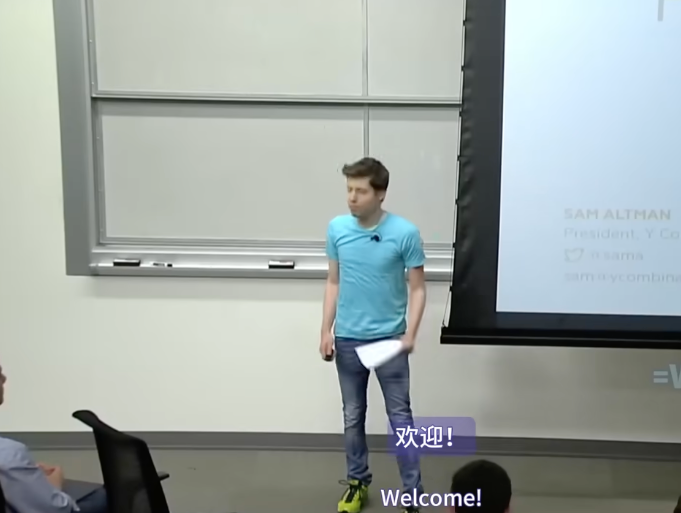

第一讲：如何创办一家初创公司 | YC斯坦福经典创业课程

欢迎来到 CS183b。我是 Sam Altman，我是 Y Combinator 的总裁。九年前，我是斯坦福大学的学生。然后我辍学创办了一家公司。过去几年我一直是一名投资者。

在 YC，我们一直在教人们如何创办初创公司，已经有九年了。其中大部分内容都是非常实用的，并且针对初创公司。但是，其中 30% 的内容是相当普遍适用的。因此，我们认为可以在这门课上讲授这 30% 的内容。尽管这只占了 30%，但希望它仍然会真正有所帮助。

我们已经在 YC 讲授了很多这方面的知识，但都是私下讲授的。这是我们第一次将 YC 所讲授的很多内容公开。因此，我们邀请了一些最好的演讲者来这里发表他们在 YC 发表的同样的演讲。

我们现在已经资助了 720 家公司。因此，我们非常肯定，这些建议中的很多都非常好。我们目前还不能资助每一家初创公司，但我们希望这些建议能够得到广泛应用。

客座演讲者将教授 20 节课中的 17 节。我只教三节课。算上 YC 本身，每位客座演讲者都参与过一家价值超过 10 亿美元的公司的创建。因此，这些建议不应该那么空洞。这些都是实践，都是来自实践过的人。

本课程中的所有建议都是针对那些以高速增长为目标的创业者，并最终建立一家非常大的公司。其中大部分不适用于其他情况，我想提前警告大家，如果你试图在很多大公司或非初创公司做这些事情，那是行不通的。

这应该还是很有趣的。我真的认为初创公司是未来的发展方向，值得尝试去了解它们。但初创公司与普通公司非常不同。因此，在今天和周四的课程中，我将尝试概述你需要擅长的四个领域，以最大限度地提高你在初创公司取得成功的机会。然后在整个课程中，客座演讲者将更详细地探讨所有这些领域。

所以是四个领域。你需要一个好主意、一个好产品、一个好团队和出色的执行力。这些有些重叠，但我必须分别讨论它们才能理解。你仍然可能会失败。结果就像是创意乘以产品、乘以执行、乘以团队、乘以运气。其中运气是0到10,000之间的随机数。确实有这么多。但如果你在你可以控制的四个领域做得很好，你至少有一定程度的成功机会。

创业公司令人兴奋的事情之一是，它们的竞争环境出奇地公平。年轻和缺乏经验的人可以做到这一点，年长和经验丰富的人也可以做到这一点。我特别喜欢创业公司的一件事是，在其他工作环境中的一些不好的事情，比如贫穷和不为人知，在创业时实际上是巨大的资产。

在我们开始讨论如何创业之前，我想谈谈你为什么要创业。我有点犹豫要不要上这门课，因为你永远不应该只是为了创业而创业。致富有很多更简单的方法，每个创业的人总是说，他们无法想象创业会有多艰难和痛苦。只有当你被某个特定问题所驱使，并且你认为创办一家公司是解决该问题的最佳方式时，你才应该创业。特定的热情应该放在第一位，创业公司是第二位。事实上，我们在YC取得的所有巨大成功都是遵循了这一点。

所以，在今天讲座的后半部分，Facebook和Asana的联合创始人达斯汀·莫斯科维茨将接手并谈论为什么要创业。我们对这门课受到的关注程度感到非常惊讶，因此我们想确保花大量时间在为什么上。

好的，所以四个领域中的第一个，一个好主意。近年来，说这个想法不重要变得很流行。事实上，花很多时间思考创业的想法几乎是不酷的。你只需要开始，把东西扔到墙上，看看什么能粘住，甚至不用花时间去想它是否有价值，是否有效。而转型应该是好的，转型越多越好。所以这并非完全错误。事物的发展方式确实难以预测。如果你没有真正把产品交到用户手中，你能弄清楚的事情是有限的。而出色的执行至少比一个好主意重要十倍，困难一百倍。但钟摆在这里已经摆得远远超出了平衡。一个坏主意仍然是坏的。而我们今天所处的这个热衷于转型的世界感觉真的不是最理想的。一个糟糕的想法，一个出色的执行将一事无成。当然也有例外。但大多数伟大的公司都是从一个好主意开始的，而不是转型。

如果你观察成功的转型，你会发现它们几乎总是转向创始人自己想要的东西，而不是随意想出来的主意。Airbnb的出现是因为Brian Chesky付不起房租，但他确实有一些多余的空间。不过，总的来说，如果你看看转型的记录，你会发现它们并没有成为大公司。我自己过去也认为创意并不那么重要，但现在我很确定这是错的。我们谈论的创意的定义非常广泛。它包括市场的规模和增长、公司的增长战略、防御性战略等等。当你评估一个创意时，你需要仔细考虑所有相关因素，而不仅仅是产品本身。如果这个创意成功了，你将会为此工作十年。因此，花一些时间认真思考业务的长期价值和防御性是值得的。尽管计划本身可能毫无价值，但规划的过程确实非常有价值，而如今大多数初创公司完全忽视了这一点。

长期思考在任何地方都很少见，尤其是在初创公司。如果你能够做到这一点，将会是一个巨大的优势。请记住，随着你的发展，这个想法会不断扩大并变得更加雄心勃勃。当然，你不需要把从现在到世界霸权的所有事情都弄清楚，但你确实需要一个好的开始。你需要一些可以以有趣方式发展的东西。

在思考创意时，我们发现年轻的创始人经常犯的另一个错误是，他们没有意识到有一天需要建立一个难以复制的企业。这是一个好创意的重要组成部分。我想再次强调这一点，因为它非常重要。创意应该放在第一位，创业公司应该放在第二位。等到你想出一个你觉得有必要去探索的创意时再创业。这也是在多个创意之间做出选择的方法。如果你有几个看起来都很不错的创意，那么在你不考虑工作的时候，就去研究你最常想到的那个。

我们一次又一次地听到创始人说，他们希望自己等到想出一个自己真正喜欢的创意时再创业。另一种看待这个问题的方式是，最好的公司几乎总是以使命为导向。除非公司感觉自己肩负着重要的使命，否则很难让大批人达到创业成功所需的高度专注和生产力。如果没有伟大的创业理念，通常很难做到这一点。

以使命为导向的理念的一个相关优势是，你自己会致力于它们。创建一家伟大的创业公司需要很多年，通常是十年。如果你不热爱和相信自己正在做的事情，你很可能会在某个时候放弃。据我所知，如果你不相信使命真的很重要，就无法度过创业的痛苦。许多创始人，尤其是学生，认为他们的创业只需要两三年的时间，然后他们就会从事他们真正热爱的事情。这几乎从来都行不通。好的创业公司通常需要十年的时间。

以使命为导向的公司还有一个优势是公司外部的人更愿意帮助你。与衍生项目相比，你在艰难而重要的项目上会得到更多的支持。谈到创办初创公司，从很多方面来说，创办一家艰难的初创公司比创办一家简单的初创公司更容易。这是那些需要人们很长时间才能理解的违反直觉的事情之一。很难夸大以使命为导向的重要性，所以我想最后一次强调这一点。衍生公司，即那些复制现有想法而几乎没有新见解的公司，不会激发人们的兴趣，也不会迫使团队努力工作以取得成功。

Paul Graham 将在下周谈论如何获得创业想法。这是许多创始人都在努力解决的问题，但我相信你可以做得更好，通过练习做得更好，这绝对值得努力去提高。想出好主意最难的部分是，最好的主意往往在开始时看起来很糟糕。

第13个搜索引擎，没有网络门户的所有功能，大多数人认为这是毫无意义的。搜索已经完成，无论如何，它并不那么重要。门户网站才是价值所在。

第10个社交网络，仅限于没有钱的大学生，也很糟糕。MySpace赢了，谁会想要大学生作为客户？或者是一种住在陌生人沙发上的方式？这听起来很糟糕。这些听起来都很糟糕，但结果却很好。

如果它们听起来真的很好，那么就会有太多人在研究它们。正如Peter Thiel在第五节课中要讨论的那样，你想要一个变成垄断的想法。但你不可能马上在大市场上垄断。竞争太激烈了。你必须找到一个可以垄断的小市场，然后迅速扩张。这就是为什么一些伟大的创业想法一开始看起来很糟糕。

如果你能说这样的话就好了，今天，只有一小部分用户会使用我的产品，但我会得到他们所有人。而在未来，几乎每个人都会使用我的产品。这是会经常出现的主题。你需要对自己的信念有信心，并愿意忽略别人的反对意见。困难的部分是，这是一条非常微妙的界线。一边是正确的，另一边是疯狂的。但请记住，如果你真的想出了一个好主意，大多数人都会认为它很糟糕。你应该为此感到高兴。这意味着他们不会与你竞争。这也是为什么告诉别人你的想法通常并不危险的原因。真正好的想法听起来不值得窃取。

你想要一个你可以说的想法，我知道这听起来像是一个坏主意，但具体来说，这就是它实际上是一个好主意的原因。你想让自己听起来疯狂，但你希望自己的想法是正确的。而且你想要一个很少有人研究的想法。如果一开始听起来不大也没关系。创始人，尤其是首次创业者，常犯的一个错误是，他们认为他们产品的第一个版本、他们想法的第一个版本，需要听起来非常大。但事实并非如此。它需要占领一个特定的小市场，然后从那里开始扩张。这就是大多数伟大公司的起步方式。

不受欢迎但正确，这就是你的目标。你想要一个听起来像坏主意，但却是好主意的东西。你也真的想花时间思考市场将如何发展。你需要一个十年后会变大的市场。大多数投资者都痴迷于当今的市场规模。他们根本不考虑市场将如何发展。事实上，我认为这是投资者犯下的最大系统性错误之一。他们考虑初创公司本身的增长。他们不考虑市场的增长。我更关心市场的增长率，而不是其当前规模。我也关心它是否有任何理由会达到顶峰。你应该考虑一下。我更愿意投资一家追求规模小但增长迅速的市场，而不是规模大但增长缓慢的市场。这类市场的一大优势是，客户通常非常迫切地需要解决方案。他们会忍受不完美但快速改进的产品。

作为一名学生的一大优势，两个最大的优势之一，是你可能比老年人更能直觉地知道哪些市场可能开始快速增长。另一件学生通常不理解或至少需要一段时间的事情是，你无法创造一个不想存在的市场。你基本上可以改变初创公司的一切，但不能改变市场。所以你应该真正思考一下，以确保或至少尽可能确定，你所追求的市场会增长并存在。

有很多不同的方式来谈论正确的市场类型。例如，冲浪别人的浪潮，或踏上电梯，或成为运动的一部分。但所有这些只是一种说法，你想要一个能够快速增长的市场。今天它看起来很小，今天可能很小。但而其他人不知道，它会快速增长。所以想想世界上发生这种情况的地方。你需要这种顺风才能让创业公司成功。令人兴奋的是，现在的顺风可能比以往任何时候都多。正如马克·安德森所说，软件正在吞噬世界。它无处不在。那里有那么多好主意。你只需要选择一个，找到一个你真正关心的。

另一个版本，归结为同样的想法，是红杉的著名问题。为什么是现在？为什么现在是提出这个想法、创办这家公司的最佳时机？为什么两年前就做不到？为什么两年后就太晚了？对于我们参与过的最成功的创业公司来说，他们都有一个好主意，对这个问题有很好的答案。如果你没有，你应该至少对此有所怀疑。

一般来说，如果你正在构建自己需要的东西，那是最好的。你会比通过与客户交谈来理解它，从而构建第一个版本时更好地理解它。如果你自己不需要它，而你正在构建别人需要的东西，那么你就会意识到你处于很大的劣势，并且要非常非常接近你的客户。如果可以的话，试着在他们的办公室工作，如果不能，每天与他们交谈多次。

关于好的创业想法的另一个有点违反直觉的事情是，它们几乎总是很容易解释，也很容易理解。如果需要用多句话来解释您正在做的事情，这几乎总是表明它太复杂了。它应该是一个清晰、清晰的愿景，用少量的文字表达出来。最好的想法通常要么在一个重要方面与现有公司截然不同，比如谷歌是一个搜索引擎，它运行得非常好，没有其他门户网站的东西，要么是像 SpaceX 这样的全新公司。任何一家公司，如果是其他东西的克隆，已经存在，有一些小的或虚构的差异化因素。例如，我们想要设计一个非常漂亮的产品，或者我们想要为喜欢红酒的人提供服务，这样的目标通常都会失败。

正如我提到的，作为一名学生的一大好处是，你对新技术有非常好的看法。

学会善于提出新想法需要一段时间。所以现在就开始努力吧。这是我们经常听到人们说的一件事，他们希望自己在学生时代能做更多。

另一件事是会见潜在的联合创始人。你不知道你现在所处的环境有多好，可以结识到将来可以一起创办公司的人。我们总是告诉大学生，比创办任何一家初创公司更重要的是，结识很多潜在的联合创始人。

所以，我想用50 Cent的一句话来结束我演讲的这一部分。这是他被问及维生素水时说的话。我不会读出来，它就在那里。但它是关于思考客户想要什么、思考市场需求的重要性。大多数人不这样做，大多数学生尤其不这样做。如果你能做到这件事，如果你能学会先考虑市场，那么你将比大多数创业者领先一大步。

这可能是我们在Y Combinator应用程序中最常见的错误。人们没有先考虑市场，先考虑人们想要什么。因此，在下一节中，我将讨论如何打造一款出色的产品。

在这里，我将再次使用非常广泛的产品定义。它包括客户支持和版权解释产品，涉及客户与您为他们打造的产品互动的任何内容。要打造一家真正优秀的公司，您首先必须将一个好主意变成一个优秀的产品。这真的很难，但至关重要，而且幸运的是它非常有趣。

虽然优秀的产品对世界来说总是新鲜的，很难给你关于打造什么的建议，但有足够多的共同点，我们可以给你很多关于如何打造它的建议。创始人最重要的任务之一是确保公司打造出优秀的产品。在你打造出优秀的产品之前，几乎没有其他事情重要。

当真正成功的初创公司创始人讲述他们早期的故事时，几乎总是坐在电脑前，开发他们的产品，或与他们的客户交谈。几乎一直都是这样。他们几乎不做其他事情。如果你的时间分配有很大不同，你应该非常怀疑。

创始人试图解决的大多数其他问题，筹集资金，获得更多媒体报道，招聘，业务发展等。当你有一个很棒的产品时，这些问题会变得容易得多。首先处理好这个问题真的很重要。

第一步是打造用户喜欢的东西。在YC，我们告诉创始人要致力于他们的产品、与用户交流、锻炼身体、吃饭和睡觉，其他的就不用管了。我刚才提到的所有其他东西，公关、会议、招聘顾问、建立合作伙伴关系，你应该忽略所有这些，只需打造一个产品，然后通过与用户交流让它尽可能好。你的工作是打造用户喜爱的产品。很少有公司在没有先做到这一点的情况下取得巨大成功。许多在纸面上看起来不错的初创公司失败了，因为他们只是做了一些人们喜欢的东西。制造一些人们想要的东西，但只是中等数量的东西，是一种失败的好方法，而且你不会明白自己为什么会失败。

所以这是两项工作。我们在 YC 经常说的一句话是，最好只制造少数用户喜欢的东西，而不是大量用户喜欢的东西。当然，最好制造一些少数用户喜欢的东西。但是，V1 这样做的机会很少，而且通常初创公司没有机会。因此，在实践中，你最终会选择灰色或橙色。你制作的东西很多用户有点喜欢，或者少数用户非常喜欢。这是一条非常重要的建议：打造少数用户喜欢的东西。从少数人喜欢的东西扩展到很多人喜欢的东西要比从很多人喜欢的东西扩展到很多人喜欢的东西容易得多。如果你做对了这一点，你可能会做错很多其他事情。如果你做错了这一点，即使你把其他所有事情都做好了，你仍然可能会失败。所以当你在一家初创公司起步时，这是你唯一需要关心的事情，直到它成功。

（你能再解释一下吗？当然。）所以，在创业公司，你可以选择。世界上最好的事情就是打造一款很多人真正喜欢的产品。实际上，你通常不能这么做。因为如果大公司有这样的机会，谷歌或 Facebook 就会去做。所以，你可以构建的东西的曲线下面积是有限制的。你可以构建很多用户有点喜欢的东西，也可以构建少数用户非常喜欢的东西。而且，爱的总量是相同的。这只是一个如何分配的问题。有一条守恒定律，即创业公司的第一款产品能给世界带来多少幸福。所以，创业公司总是纠结于应该选择哪一款。它们看起来是相等的，因为曲线下面积是相同的。但我们一次又一次地看到，它们并不相同。而且扩展起来要容易得多。一旦你有了一些人喜欢的东西，你就可以将其扩展到很多人喜欢的东西。但如果你只得到矛盾心理或某种微弱的热情，然后试图扩大这种热情，你永远不会让很多人喜欢它。因此，建议是，找到一小群用户，让他们真正喜欢你正在做的事情。这有道理吗？

好的。你知道这种方法是否有效的一种方式是，你会通过口口相传获得增长。如果你做了一些人们喜欢的东西，人们会告诉他们的朋友。这也适用于消费产品和企业产品。当人们真的喜欢某样东西时，他们会告诉他们的朋友。你会看到有机增长。如果你发现自己在谈论你没有增长也没关系，因为有一个大合作伙伴会来拯救你，或者诸如此类的事情，这几乎总是一个真正麻烦的迹象。销售和营销非常重要，我们稍后会开设两节课来讨论它们。但如果你没有一些早期的有机增长，那么你的产品可能还不够好。一个好的产品是长期增长黑客的秘诀。在你担心其他任何事情之前，你应该先把这件事做好。

推迟制作一款优秀的产品并不容易。如果你在拥有一款人们真正喜欢的产品之前就试图打造一台增长机器，那么你几乎肯定会浪费时间。突破性公司几乎总是拥有一款非常好的产品，以至于它通过口口相传而增长。从长远来看，优秀的产品会胜出。

不要担心你的竞争对手筹集了大量资金，以及他们将来可能会做什么。他们可能反正也不是很好。很少有初创公司会因为竞争而倒闭。大多数公司倒闭是因为他们自己没有做出用户喜欢的东西。他们把时间花在其他事情上。所以首先要担心这一点。

另一个让用户喜欢的东西的建议是从简单的东西开始。如果你有简单的东西，那么制作一款优秀的产品就会容易得多。即使你的最终计划非常复杂（希望如此），你几乎总是可以从比你认为最小的问题子集更小的问题子集开始。而且很难打造一款优秀的产品，所以你要从尽可能小的表面积开始。

想想那些真正成功的公司，以及他们从何开始。想想你真正喜欢的产品。它们通常使用起来非常简单，尤其是开始使用时。Facebook 的第一个版本简单得近乎可笑。Google 的第一个版本只是一个丑陋的网页，带有一个文本框和两个按钮，但它返回了最好的结果，这就是用户喜欢它的原因。iPhone 比之前的任何智能手机都简单得多，它是人们真正喜欢的第一款智能手机。

简单就是好的另一个原因是，它迫使你把一件事做得非常好，你必须这样做才能做出人们喜欢的东西。当你听成功的创始人谈论他们如何看待他们的产品时，“狂热”这个词会一次又一次地出现。创始人谈到他们对细节质量的关注方式是狂热的。他们狂热地使用他们用来解释产品的文案。他们狂热地考虑客户支持的方式。

事实上，YC 公司成功的关键因素之一是创始人将寻呼机职责与票务系统连接起来。这样，即使用户在创始人睡觉的半夜发送电子邮件，他们仍会在一小时内收到回复。公司在早期确实这样做了。当产品糟糕时，这些创始人会感到身体上的痛苦，他们想醒来修复它。他们不会发布垃圾产品，如果他们发布了，他们会非常非常快地修复它。打造一款优秀的产品肯定需要一定程度的狂热。

你需要一些用户来帮助反馈周期。但获得这些用户的方法是手动的。你应该手动招募他们。不要在早期做购买谷歌广告之类的事情来获得初始用户。你不需要很多。你只需要那些每天都给你反馈并最终喜欢你的产品的人。因此，您无需尝试让他们使用 Google AdWords，只需在世界上找到一些可以成为优质用户的人员即可。手动招募他们。

当所有人都认为 Pinterest 是个笑话时，Ben Silberman 通过在咖啡店里标记陌生人来招募最初的 Pinterest 用户。他真的这么做了。他只是在帕洛阿尔托四处走动，说：“你能用一下我的产品吗？”他还曾经在帕洛阿尔托的苹果商店里跑来跑去，想在他们抓住他并把他赶出去之前，让浏览器快速进入 Pinterest 主页。所以当人们走进去时，他们会说：“哦，这是什么？”

这是一个做事无法扩展的重要例子。如果你还没有读过 Paul Graham 关于这个主题的文章，你一定要读一读。所以要手动获取用户，记住目标是让一小部分人喜欢你。非常了解这个群体，非常接近他们。听他们说，你几乎总会发现他们非常愿意给你反馈。即使你为自己打造产品，也要听取外部用户的意见，他们也会告诉你如何制作一款他们愿意付费的产品。尽你所能让他们爱上你，让他们知道你在做什么，因为他们也会成为你的拥护者，帮助你获得下一批用户。

你想在公司中建立一个引擎，将用户的反馈转化为产品决策。然后把它带回用户面前，重复这个过程。问问他们喜欢什么，不喜欢什么，然后观察他们使用它。问问他们愿意为之付费的原因。问问他们如果你的公司倒闭了，他们会不会很沮丧。问问他们什么会让他们向朋友推荐这个产品。问问他们是否已经向任何人推荐过它。你应该让这个反馈循环尽可能紧密。如果你的产品每周都进步 10%，那么这个循环就会非常非常快地累积起来。软件初创公司的一大优势就是你可以把反馈循环做得很短。它可以用小时来衡量。最好的公司通常拥有最紧密的反馈循环。你应该尝试在公司整个生命周期内保持这种状态，但在早期阶段这真的很重要。

好消息是所有这些都是可行的。这很难，需要付出很多努力，但没有魔法。计划至少很简单，你最终会得到一个伟大的产品。伟大的创始人不会在自己和用户之间设置任何人。这些公司的创始人在早期自己做销售和客户支持等事情。将这个循环嵌入文化中至关重要。事实上，出于某种原因，我们在斯坦福初创公司中总是看到的具体问题是，学生们试图立即聘请销售和客户支持人员。你必须自己做这件事。这是唯一的方法。你真的需要使用指标来保持诚实。公司会建立任何 CEO 决定衡量的东西，这确实是真的。如果你正在构建互联网服务，请忽略总注册量之类的东西。不要谈论他们，不要让公司里的任何人谈论他们。观察活跃用户的增长情况、活动水平、群组留存率、收入和净推荐值，这些都是非常重要的指标。如果这些指标没有朝着正确的方向发展，就需要直言不讳地指出。初创企业依靠增长生存，这些指标是衡量优秀产品的标准。因此，这大致总结了打造优秀产品的概述。

我想再次强调，如果你做不到这一点，我们讨论的其他任何事情都无关紧要。在课堂上，你可以忽略我们讨论的其他所有内容，直到一切顺利。从积极的一面来看，这是创业过程中最有趣的部分之一。所以我要在这里暂停一下，我会在周四继续讨论剩下的部分。

***

Sam：在我们将让达斯汀谈谈你为什么要创业。谢谢你来，达斯汀。

Dustin：

当然。山姆让我谈谈为什么要创业。你可能有很多理由。我经常听到人们有很多常见的理由来解释你为什么要创业。知道你的理由是什么很重要，因为其中一些理由只在特定情况下才有意义，而其中一些理由实际上会让你误入歧途。你可能被好莱坞或媒体对创业的浪漫化误导了。所以我想尝试阐明一些潜在的谬误，以便你们能够以清晰的方式做出决定。然后我会谈谈我最喜欢的真正创业的理由。这与山姆刚才谈到的很多内容非常相关。但令人惊讶的是，我认为这并不是最常见的原因。通常人们有其他原因，或者他们只是想创业，为了创业而创业。

所以，列举四个常见原因是：创业很迷人，你会成为老板；你将拥有灵活性，尤其是在你的日程安排上；而且你将有机会产生更大的影响，赚更多的钱，而不是加入后期公司。你们可能对这个概念非常熟悉。当我写 Medium 帖子时，你们很多人都在一年前读过，我觉得媒体上的故事有点不平衡。创业精神被浪漫化了不少。社交网络电影上映了，作为一名企业家，有很多不好的方面，但主要描绘的是有很多派对，你从一个绝妙的见解转向另一个绝妙的见解，真的让它看起来像是一件很酷的事情。而我认为现实并不那么光鲜。作为一名企业家，有不好的一面。而且，更重要的是，你真正花时间做的只是很多艰苦的工作。山姆提到了这一点，但你基本上只是坐在办公桌前，低着头，专心致志，回答客户、客户支持电子邮件、做销售、解决困难的工程问题。所以，睁大眼睛去做这件事真的很重要。而且，这真的很有压力。这是最近媒体上的一个热门话题。事实上，《经济学人》上周刊登了一篇名为《匿名企业家》的文章，文章中描述了一位创始人躲在办公桌下。谈到创始人抑郁症，这确实是一个非常真实的问题。让我们面对现实吧，如果你创办一家公司，那将会非常困难。

为什么会这么有压力呢？有几个原因。首先，你肩负着巨大的责任。任何职业的人都害怕失败，这几乎是心理学的一个主要部分。但是，当你是一名企业家时，你不仅为自己感到害怕失败，还为所有决定追随你的人感到害怕失败。这真的很有压力。在某些情况下，这些人依靠你来谋生。即使情况并非如此，他们也决定将自己一生中最美好的时光奉献给你，追随你。所以你要为他们的时间机会成本负责。这是一件大事。

如果有事发生，你随时待命。也许不总是凌晨3点，但对于一些初创公司来说确实如此。如果有重要的事情发生，你就得处理。不管你是否在度假，不管是否是周末，你必须时刻保持警惕，始终保持心理准备，以应对这些事情。

然后，这种压力的一个特殊例子就是筹款。社交网络上的一个场景，展示了我们一边开派对一边工作的情景。有人到处喷洒香槟。社交网络花了很多时间来描绘这些场景，但马克·扎克伯格并不在这些场景中。他们花费大量时间把他描绘成一个大混蛋。

这是一个真实的场景，这是帕洛阿尔托的一个真实场景。在这张办公桌前花了很多时间，只是低着头专注工作。马克有时仍然有点混蛋，但更像是一种有趣、可爱的方式，而不是一种反社会、被蔑视的爱人的方式。他在发出信号，表明他只想专注工作，而不是社交。

还有一个场景，展示了一个精彩的洞察时刻。这有点像是直接从《美丽心灵》里走出来的，简直是偷了那个场景。他们喜欢把它描绘成你从一个时刻跳到另一个时刻，中间有分离。但实际上，我们一直都坐在那张桌子旁。有趣的是，如果你将这张照片与另一张照片进行比较，你会发现马克的姿势完全相同，但他穿着不同的衣服。这绝对是不同的一天。太酷了，这就是亲身体验的感觉。

我刚刚提到了这一点，这是我刚才谈到的《经济学人》文章。压力的另一种形式是不受欢迎的媒体关注。魅力的一部分在于，有时你会得到一些积极的媒体关注。登上《时代》杂志的封面，成为年度人物，这很好。登上《人物》杂志的封面，上面有你的一张结婚照，这可能就没那么好了。这取决于你是谁。有些人喜欢这样，但我真的很讨厌。但当 Valleywag 分析你的演讲，把你撕成碎片时，你肯定不想要那样。没人想要那样。

有一件事我几乎从未听到人们谈论过，那就是你更加投入了。所以如果你是一家初创公司的员工，事情压力很大，进展不顺利，你不开心，你可以离开。对于创始人来说，你可以离开，但这很不酷，几乎会给你的职业生涯蒙上污点。所以你真的要全身心投入。如果进展顺利，就十年，如果进展不顺利，可能更可能五年。所以三年来弄清楚进展不顺利，然后如果你为公司找到了一个不错的落脚点，再在收购公司呆两年。如果你在那之前离开，同样，这不仅会损害你自己的经济，还会损害你所有的员工，所以你几乎不会这样做。

所以如果你很幸运，有一个糟糕的创业想法，你很快就会失败，但大多数时候情况并非如此。好吧，继续前进。所以，我应该说，我自己的生活中也遇到过很多这样的压力，特别是在 Facebook 发展的早期。我的健康状况真的很差，我没有锻炼，非常焦虑。实际上，我的背部几乎每六个月就会痛一次，就像我 21、22 岁的时候一样，这真是太疯狂了。所以，如果你真的创办了一家公司，要意识到你必须处理这个问题，你必须真正管理它。这实际上是你的核心职责之一。本·霍洛维茨喜欢说，首席执行官的首要角色是管理自己的心理。这是绝对正确的。一定要做到这一点。

所以另一个原因是，人们，特别是如果他们已经在另一家公司工作过，你往往会形成这样一种说法，比如，好吧，经营这家公司的人都是白痴，他们做出了所有这些愚蠢的决定，他们把时间花在这些愚蠢的方式上。我要创办一家公司，我要做得更好。我要制定所有的规则。这是一个非常有吸引力的想法，非常有意义。如果你读过我的 Medium 帖子，你就会知道它即将到来。我给你们一点时间阅读这句话。很酷。所以这真的引起了我的共鸣。

我想指出的一点是，这些决定的现实是相当微妙的。你认为是白痴的人可能不是白痴。他们可能只是面临着非常艰难的决定。人们把他们拉向多个方向。所以作为一名 CEO，我最常花时间和精力去解决的事情就是其他人给我带来的问题，其他人创造的其他优先事项。这通常以冲突的形式出现。人们想朝不同的方向发展，或者客户想要不同的东西。我可能对此有自己的看法。但实际上，我在玩的游戏是我最不让谁失望？驾驭所有这些困难的情况，就像在日常工作中一样。比如，我可能在周一上班时制定了所有这些宏伟计划，计划如何改善公司以及我将把时间花在什么地方。但是，如果一个重要的员工威胁要辞职，我就会把时间花在这件事上。这是我的首要任务。

作为老板，你有灵活性，可以控制自己的日程安排。这是一个非常有吸引力的想法，这就是现实。正如Phil Liven所说的名言，这真的引起了我的共鸣。原因之一是，你总是随叫随到。也许你不打算全天工作，但你可能无法控制哪些时间段需要工作。你是一个榜样，这非常重要。

如果你是一家公司的员工，你可能会有好几周的高效期，也可能有几周的低效期，有时你会精力不足，想多休息几天。如果你是一名企业家，那真的很糟糕。你的团队会真正反映你正在做什么。如果你放慢脚步，他们也会放慢脚步。而你无论如何都在努力。所以，如果你真的对一个想法充满热情，它就会吸引你继续努力。

如果你与优秀的投资者和合作伙伴合作，他们会希望你非常努力地工作，再说一次，你也会想要非常努力地工作。有些公司喜欢讲述你可以鱼与熊掌兼得的故事，也许你可以每周工作四天。如果你是蒂姆·费里斯，也许你可以每周工作12小时。这是一个非常有吸引力的想法，而且在特定情况下确实有效。也就是说，如果你想真正拥有一家小企业或追逐一个利基市场，那么你就是一个小企业企业家，这很有道理。

但是，一旦你超过两三个人，你就真的需要加把劲，全身心投入。这是最重要的。所以这是我听到最多的，尤其是像申请Asana的候选人。他们告诉我，他们真的很想为一家小得多的公司工作，或者自己创业，因为这样他们就能分得更大的一杯羹，对那家公司的发展产生更大的影响，拥有更多的股权，从而赚更多的钱。

让我们来看看什么时候这可能是真的。我来解释一下这些表格。它们有点复杂，但我们先关注左边。这只是在解释Dropbox和Facebook的估值。这是你作为第100名员工进入这些公司可能赚多少钱，特别是如果你是一个相对有经验的工程师，比如你有五年的行业经验。你很可能会得到10个基点左右的报价。因此，如果你几年前加入Dropbox，那么你已经获得的收益约为1000万美元。如果您离开公司，那么从那以后还会有更大的增长。

如果您在 Facebook 成立几年后加入，那么您将赚到 2 亿美元。这是一个巨大的数字。

如果您加入 Facebook 时是第 1000 名员工，即 2009 年加入，那么您仍然赚了 2000 万美元。这也是一个巨大的数字。

当您考虑作为企业家能赚多少钱时，应该以此为基准。

请看右边的表格，这是您可能创办的两家理论上的公司。Uber 是一个关于宠物看护的好主意。如果您真的很适合这个领域，您可能真的有机会建立一家价值 1 亿美元的公司。您在该公司的股份很可能在 10% 左右。当然，这个比例会有所波动。有些创始人拥有的股份远多于此，而有些创始人拥有的股份则少得多。但经过多轮稀释、多轮期权表、期权池创建后，您很可能会达到这个比例。如果您的股权超过这个数额，我推荐您阅读 Sam 的帖子，比如创始人和员工之间的股权分配。您可能应该给出更多。

基本上，如果您对建立这个价值 1 亿美元的企业非常有信心，这是一个很大的要求，那么不用说，您应该对 2009 年的 Facebook 或 2014 年的 Dropbox 有比对一个甚至还不存在的初创公司更大的信心，那么这是值得做的。

所以，如果您有一个价值 1 亿美元的想法，而且您很有信心可以实现它，我会考虑的。如果您认为自己是创建 Uber 太空旅行的合适企业家，这是一个非常伟大的想法，一个 20 亿美元的想法，您实际上会从中获得相当不错的回报。您绝对应该这么做。这也是四年后的价值，而且这个想法可能很有前景。所以一定要追求它。

如果您正在考虑建立这样的公司，那么您现在可能根本不应该上这门课。您应该去建立那家公司。

那么为什么会有这种财务回报和影响呢？我真的认为财务回报与你对世界的影响密切相关。如果您不相信这一点，让我们通过一些具体的例子来谈谈，完全不考虑股权。

那么为什么加入一家后期公司实际上会给您带来很大的影响呢？您会得到这个力量倍增器。他们有一个庞大的用户群。如果是 Facebook，它有 10 亿用户。或者如果是谷歌，它有 10 亿用户。他们有现有的基础设施供您构建。对于新创业公司来说，这也越来越真实，比如 AWS 和所有这些很棒的独立服务提供商。但您通常会得到一些专有技术，而且它们都为您维护。这是一个非常好的起点。您将与团队合作，他们将帮助您将您的想法转化为伟大的成果。以下是几个具体的例子。

Brett Taylor 加入 Google 时是第1500名员工。他发明了 Google 地图，这可能是你们每天都在使用的产品。我用它到达这里，全世界有数亿人使用它。不需要创办一家公司就能做到这一点，确实获得了丰厚的经济回报。但关键是他产生了巨大的影响。

我的联合创始人 Justin Rosenstein 在 Brett 之后不久加入 Google。他当时是那里的一名产品经理。作为一个副项目，他最终设计了 Chat 的原型，它曾经是一个独立的应用程序，集成到 Gmail 中，就像你在右上角看到的一样。在他这样做之前，人们甚至认为你根本无法通过 Ajax 聊天或在浏览器中聊天。他只是演示了一下，并向他的团队展示了它，然后他们就实现了它。再说一次，这可能是你们大多数人每天都在使用的产品。

也许更令人印象深刻的是，此后不久，JR 离开了。他成为 Facebook 的第250名员工。他与 Andrew Bosworth 和 Liam Perlman 等人一起领导了一个黑客马拉松项目，创建了点赞按钮。所以，这是网络上最受欢迎的元素之一，彻底改变了人们使用它的方式。再说一次，不需要创办一家公司就可以做到这一点。如果他尝试过，几乎肯定会失败，因为他真的需要 Facebook 的分销才能让它发挥作用。

所以，重要的是要记住你试图创办什么样的公司，以及你在哪里才能真正实现它。那么，最好的理由是什么？Sam 已经谈过一点了，但基本上你不能不做。你对这个想法非常热衷，你是做这件事的合适人选，你必须让它发生。那么，这如何分解？我们快要结束了。我如何按时完成？酷。很棒。完美。

所以，这有点像文字游戏。你只能用两种方式来做。一是你对它充满热情，所以你必须要做。你无论如何都会做。这非常重要，因为你需要这种热情来度过我们之前谈到的创业者的所有艰难时期。你还需要它来有效地招聘。候选人可以察觉到你没有热情。而且有足够多的企业家确实有热情，他们也可以为其中一位工作。所以，这有点像成为企业家的赌注。你的潜意识也能分辨出你没有热情，这将是一个巨大的问题。然后，另一种解释是世界需要你去做。所以，这在某种程度上证实了这个想法的重要性。它会让世界变得更好，因此世界需要它。如果不是，如果它不是世界需要的东西，那就去做一些世界需要的事情。你的时间非常宝贵。有很多好主意。也许这不是你自己的，或许是一家现有的公司，但你不妨做一些好事。

然后第二种解释是世界需要你这样做。你实际上在某种程度上非常适合解决这个问题。如果事实并非如此，这可能是一个迹象，表明你的时间最好花在其他地方。但同样，如果不是这样，最好的情况是，你胜过符合条件的团队。你最终得到的只是对世界来说次优的结果。感觉不太好。

所以回到我自己在 Asana 的经历，在创立 Asana 之前，贾斯汀和我是那种不情愿的企业家。我们在 Facebook 工作。我们已经在解决一个大问题。我们基本上会整天忙于我们的正常项目。然后在晚上，我们将继续研究公司内部使用的内部任务管理器。正是因为我们对这个想法如此热衷，它如此有价值，所以我们无法做其他任何事情。

在某个时候，我们不得不进行艰难的对话，比如，好吧，如果我们不真正创办这家公司，那意味着什么？我们能够看到它对 Facebook 的影响。我们非常确信它对世界非常有价值。我们也非常确信没有其他人会建立它。这个问题已经存在很长时间了，我们只是一直在寻找渐进式的解决方案。所以如果我们不采用我们认为最好的那个，我们认为还有很多价值可以实现。是的，所以我们不能停止努力。

而从字面上看，这个想法就像是自己从我们的胸膛里跳出来，强行进入这个世界。我认为这是你创办一家公司时真正应该寻找的感觉。这就是你知道你有正确想法的方式。
