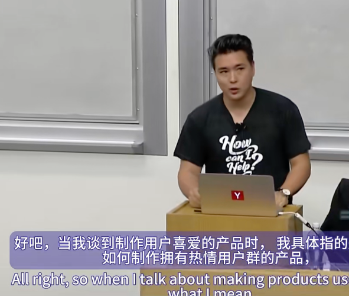

第七讲《How to Build Products Users Love》，由Wufoo创始人Kevin Hale主讲.

好的，当我谈到制作用户喜爱的产品时，我具体指的是，我们如何制作拥有热情用户群的产品。我们的用户无条件地希望它能够成功，无论是我们制造的产品，还是产品背后的公司。

我们将讨论大量信息。尽量不要做太多笔记，主要是试着倾听。我会在我的 Twitter 上发布幻灯片链接。在该链接上，您可以注释幻灯片并向我提问。如果我们没有回答这些问题，我会在演讲后回答。

所以，在过去几周里，你们一直在聆听和听到很多关于增长的信息。对我来说，我觉得增长通常相当简单。它是两种概念或变量之间的相互作用：转化率和流失率。这两件事之间的差距几乎表明了你的增长速度。大多数人，尤其是商业人士，倾向于以一种非常计算和数学的方式看待这种互动。而今天，我想从更人性化的角度来谈论这些事情，因为在一家初创公司，当你与用户互动时，你会在早期阶段进行相当亲密的互动。因此，我认为从我们如何构建产品的角度来看待这些事情是不同的。

我们将研究很多不同的例子，以及如何很好地执行它。我教给初创公司的很多东西背后的理念是，获得 10 亿美元的最佳方式是专注于帮助你获得第一美元、获得第一个用户的价值观。如果你能做到这一点，其他一切都会水到渠成。这是一种信念。

所以，我以校友的身份成为 YC 的合伙人。我于 2006 年冬天参加了这个项目，所以这是第二个项目。我开发了一款名为 Wufoo 的产品。Wufoo 是一个在线表单生成器，可帮助您创建联系表单、在线调查和简单的付款表单。它基本上是一个看起来像是 Fisher Price 设计的数据库应用程序。但有趣的是，由于它相当容易使用，我们的客户来自您能想到的每个行业、市场和垂直领域，包括大多数财富 500 强公司。

我们经营公司五年，然后在 2013 年被 SurveyMonkey 收购。当时，我们是一个非常有趣的收购。我们当时只有十个人。虽然我们通过 Y Combinator 在硅谷获得资金，但我们实际上是在佛罗里达州经营公司的。我们没有办公室。每个人都在家工作，我们是一个有趣的异常值。所以这里的每个点代表一家通过 IPO 或收购退出的初创公司。我们是左边的这个异常值。底部是他们所获得的融资金额，纵轴是当时公司的估值。总而言之，平均每家初创公司筹集约 2500 万美元，而他们对投资者的回报约为 676%。Wufoo 总共筹集了约 118,000 美元，而我们对投资者的回报约为 29,000%。因此，很多人都非常感兴趣，比如，是什么让Wufoo与众不同，或者为什么我们以非常不同的方式经营公司？其中很多都集中在产品上。

我认为，我们对开发人们只想使用的软件不感兴趣，这让你想起你在小隔间里工作，因为它的核心是一个数据库应用程序。我们想要一款人们想要喜欢的产品，想要与之建立关系的产品。我们实际上非常热衷于如何处理这个想法，几乎可以说是以一种科学的方式。

所以我们说，好吧，就我们想要创造人们喜爱的东西而言，创业公司有趣的地方在于，爱和无条件的感情在现实生活中很难做到。而在创业公司，我们必须大规模地做到这一点。所以我们决定看看，真实的关系在现实世界中是如何运作的，我们如何将它们应用到我们经营业务和构建产品的方式中？

所以我们基本上会讨论这两个比喻。获取新用户就像我们试图约会他们，而现有用户就像是一段成功的婚姻。所以当谈到约会时，我们发现的很多东西都与第一印象有关。你们所有人经常从起源故事的角度谈论你们的关系。如果我让你告诉我初吻，你们是如何相遇的，你们是如何求婚的。这些都是我们一遍又一遍地说的事情。它们基本上是我们关系的口口相传的故事。它们和我们与公司做的事情是一样的。

人类是关系制造生物。我们情不自禁地创造和拟人化我们一次又一次与之互动的事物。所以，无论是我们驾驶的汽车、我们穿的衣服、我们使用的工具和软件，我们最终都会描述它的特征、个性，并期望它以某种方式行事。这就是我们与它互动的方式。

现在，第一印象对于任何关系的开始都很重要，因为它是我们一遍又一遍讲述的。我们对起源故事的看法有些特别。我给你举个例子。如果你和某人第一次约会，你们正在吃一顿美味的晚餐，却发现他们在抠鼻子，你可能不会再和他们约会了。但是如果你和某人结婚已经20到30年了，你发现他们在大声叫喊，挖金子，你不会立即打电话给你的律师，然后说，我们这里有问题。我需要开始起草离婚文件。你耸耸肩说，至少他有一颗金子般的心。所以第一次互动意味着通过失败的门槛要低得多。

所以在软件中，对于我们使用的大多数互联网软件产品，第一印象是非常明显的。你会看到很多公司在派营销人员去工作时会关注这些事情。我认为那些非常擅长产品的人会发现很多其他的第一次时刻，并让这些时刻令人难忘。你从软件中收到的第一封电子邮件，你第一次登录时发生的事情，链接，广告，你第一次与客户支持互动。所有这些都是诱惑的机会。那么，我们是如何想到在那里创造第一次时刻的？我们实际上是从日本人那里借鉴了这个概念。他们实际上有两个词来描述你用完东西后的样子。比如说，这是优质产品吗？质量的两个词是 "atatame hinshitsu" 和 "midiokiteki hinshitsu"。第一个词意味着理所当然的质量，基本上是功能性。最后一个词意味着迷人的品质。

以钢笔为例，有些东西有 "midiokiteki"。如果钢笔的重量、墨水流出的方式、人们阅读钢笔笔迹的方式，对钢笔使用者和体验其副产品的人来说都是令人愉悦的，将其提升到一个新的水平。

从一些例子开始。所以，这是 Wufoo 的登录链接，上面有一只恐龙，我认为这很棒。但是，如果你将鼠标悬停在它上面，该规范还有一个额外的好处，那就是有一个工具提示，它不会解释如何登录和它的作用，但基本上就是 "rawr"。我们在早期可用性研究中注意到，这毫无疑问会让人们脸上露出笑容，普遍如此。

我认为，很多时候，当我们评估产品时，我们从未想过，嘿，人们在与它互动时脸上的情绪是什么？这是 Vimeo 的登录页面。这实际上是几次迭代之前。这是我觉得最漂亮的一个。但是，它让当你开始使用 Vimeo 时，这将是不同的东西。他们在整个应用程序中都这样做。如果你搜索“放屁”这个词，当你上下滚动时，它会发出放屁的声音，有一些不同，就像这个网站与你互动一样。这有点神奇。这有点不同。这是你想谈论的事情。

您不必总是通过设计来实现这一点。这是 Quark 的注册表，它曾经是一个为喜欢喝葡萄酒的人提供的社交网络。上面写着电子邮件地址。这也是你的登录名，而且必须是合法的。名字，你妈妈叫你的名字。姓氏，你军队伙伴叫你的名字。密码，你记得但很难猜到的密码。密码确认，再次输入，把它当作一个测试。填写表格时，它实际上是一首诗，这就是那种让你觉得，我喜欢这背后的人。我会享受这种体验。

现在，当你在雅虎上填写这样的表格时，它会说什么？关于这个网站的个性。令我失望的是，雅虎强迫他们旗下的每一款产品和服务都使用完全相同的登录表格。我曾认为，Flickr 拥有最好的号召性用语之一。是，进来吧？

这是 Roku 的注册页面。我认为这是一个旧版本。但令人惊奇的是，你开始感觉到，扩展我的服务器和后端服务就像上下拖动不同类型的旋钮和杠杆一样简单。它将会得到很好的使用，而且看起来相当容易扩展。因为我们在一个满是计算机科学人员的房间里，我想你会喜欢这个。这是 Chocolat，这是一个代码编辑器。

他们只有一个行动号召。当时间限制结束时，他们会说，就所有功能而言，一切都完全相同，只是我们将字体改为 Comic Sans。他们基本上是在说，嘿，我们知道我们的用户是谁，谁是我们真正的客户。他们将会是关心这个问题的人。

这是 Hurl，这是一个用于检查 HTTP 请求的网站。有时，出现错误的地方正是第一时间的机会。如果遇到 404，这就是您得到的。当我们需要帮助时，我们通常会制作非常漂亮的营销材料。但是当您真正需要文档时，我们会在设计功能上偷工减料。这是您一次又一次看到的情况。

一家做对了这一点的公司是 MailChimp。他们所做的是重新设计所有帮助指南，使它们看起来像杂志封面。一夜之间，所有这些功能的读者数量基本上增加了，而帮助人们优化电子邮件的客户支持却减少了。

说到文档，Stripe，API 公司的有趣之处在于没有用户体验。用户体验实际上只是文档，甚至在文献中也存在着机会，有点令人着迷和惊叹。我喜欢他们的一个原因是他们的例子很棒。但是如果你真的登录了应用程序，当你处理大多数人的 API 时，对大多数人来说最痛苦的事情之一就是获取你的 API 凭据和密钥。而 Stripe 所做的是，如果你登录了应用程序，我们会自动将你的 API 凭据放入示例中。所以当你尝试学习他们的 API 时，你只需要复制粘贴一次。

当 Wufoo 想要推出我们 API 的第三个版本时，我们意识到，好吧，这终于足够好了，我们希望人们能够在此基础上进行构建。我们正在试图弄清楚，我们如何向世界推出这个具有我们个性的产品？因为很多人通常会做编程 API 竞赛之类的事情，他们会发放 iPad 和 iPhone。这让你看起来像其他人一样。因此，在我们公司，他们有一个奇怪的价值观，这是我们的一个怪癖，那就是联合创始人都是中世纪的狂热爱好者。我们每年都会在公司成立周年纪念日带大家去中世纪。所以我们说，我们必须做点类似的事情。于是我们联系了 armor.com 的人。我们说，你能为我们打造一把定制的战斧吗？我们说，如果你赢得我们的编程比赛，你就会赢得一把。结果是，人们想谈论这件事。这是人们想做的事情，因为他们想说：“我在为武器编程。” 很酷的是，我们已经创建了超过25个不同的应用程序。质量和数量是我们无法用预算和时间支付的。我们有iPhone应用程序、Android应用程序和WordPress插件，因为我们所做的就是改变了人们谈论他们与我们某项服务互动的起源故事的方式。

我们可以花一整天时间讨论这些例子。但我要简明扼要地说，你应该只关注那些小细节。基本上就是大量软件截图，它们运行良好，表明它们对用户和客户非常负责。

当谈到长期关系或婚姻时，我们最终不得不阅读的唯一研究是约翰·戈特曼所做的研究。他曾在《美国生活》和马尔科姆·格拉德威尔的书中出现过。他是西雅图的一名婚姻研究员，他有一个有趣的客厅魔术。他可以观看一对夫妇为某个问题争吵15分钟的录像带，并以85%的准确率预测这对夫妇四年后会在一起还是离婚。如果他把视频延长到一小时，并要求他们也谈论他们的希望和梦想，那么预测率就会上升到94%。

他们把同样的录像带给婚姻顾问、成功结婚的夫妇、社会学家、精神病学家、牧师等。他们无法随机预测人们是否会在一起。因此，约翰·戈特曼了解长期关系如何运作的一些基本知识，基本上我们如何争吵，即使是在短期内，也可能表明整个系统以及它将是什么样子。

他发现的令人惊讶的事情之一并不是成功结婚的人根本不吵架。事实证明，每个人都会吵架。我们都为同样的事情而争吵：金钱、孩子、性、时间等等。其他的还有嫉妒和姻亲。

为了解决这个问题，您实际上可以将这些问题都归因于您在构建产品时在客户支持中看到的问题。所以，这花费太多了，我的信用卡出了问题。如果你正在构建一种帮助人们与客户打交道的服务，他们对任何与此相关的事情都非常敏感。性能、你待了多长时间、速度有多快。我说，其他人是嫉妒和姻亲，所以这就是竞争和合作关系。任何奇怪的事情发生，人们都会写信告诉你。

我喜欢从客户支持的角度来思考这个问题，因为在每个人的处理过程中，就像一个转化漏斗，客户支持是发生在每一个步骤之间的事情。这就是人们无法进一步深入的原因。这就是阻止转化发生的原因。

现在，当我们思考所有这些想法，并在建立公司时，我们意识到，每个人如何创办自己的公司或建立自己的工程团队存在一个大问题。那就是那里有一个破碎的反馈循环。人们与自己行为的后果脱节。这实际上是大多数公司创立的自然演变的结果，尤其是由技术联合创始人创立的公司。在启动之前，这是一个充满幸福、涅槃和机遇的时期。你做的一切都没有错，在你的手中，你的感觉就像上帝。你写的每件事，每一行代码，都感觉很完美，很对，对你来说都是天才。

事情是这样的，在启动之后，现实开始显现，然后我们必须处理的所有其他任务也开始出现。现在，技术联合创始人想要做的就是回到最初的状态。所以我们经常做的，我们经常看到的是，公司开始把所有这些其他事情都孤立起来，而这些事情实际上是让初创公司或公司变得真实的东西，然后让其他人去做。在我们看来，这些其他任务是次要的，我们让公司里的其他人去做。

因此，对于我们来说，我们试图弄清楚的是如何改变软件开发，以便我们注入一些我们谈论得不够多的价值观：责任、义务、谦逊、谦虚。我们像许多其他人一样，称之为支持驱动开发。它基本上与 TDD 或其他敏捷实践非常相似。这是一种创建高质量软件的方法，但它非常简单。你不需要像 Scrum 那样，你不需要一堆便利贴。你所要做的就是让每个人都提供客户支持。你最终得到的是修复反馈循环，构建软件的人是支持它的人，因此你会得到所有这些好处。其中之一是，支持负责任的开发人员和设计师以及构建产品的人，他们提供最好的支持。

现在我们不是第一个想到这一点的人。保罗·英格利什 (Paul English) 是 Kayak 这一理念的积极倡导者。他的方法是在工程楼层中间安装一条红色的客户支持电话线，这样客户支持电话就会响个不停。人们经常会问他，为什么你要付给工程师 12 万美元或更多，而你只需付给其他人一小部分费用就可以完成这项工作？他们就像呼叫中心一样处理这件事。他说，好吧，在电话第二次或第三次响起并且工程师遇到相同问题后，他们就会停止手头的工作，修复错误，我们就不会再接到有关该问题的电话。这是一种 QA 方式，也是一个很好的解决方案。

现在，约翰·戈特曼谈到了我们经常分手的原因，主要有四个原因，它们是警告信号。他把它们称为四骑士：批评、蔑视、防御和阻挠。批评基本上是人们开始关注的不仅仅是手头的具体问题，而是总体问题。你从来没听过你的用户，或者你从来没想过我们。蔑视是指某人故意侮辱他人。防御性是指不承担责任，为自己的行为找借口。而阻挠基本上就是封闭自己。对约翰·戈特曼来说，阻挠是我们在一段关系中能做的最糟糕的事情之一。而且很多时候，我们在客户支持方面不太担心这一点。批评和蔑视、防御性，这些情况在公司里尤其是随着公司的发展总是会出现。但阻挠，这是我经常在初创公司看到的事情。你接到很多客户支持电话，你只是觉得，我不需要回答，我不需要回应。而这种不回复客户的行为是你能做的最糟糕的事情之一，这可能是初创企业早期阶段客户流失的最大原因之一。

这就是 Wufoo 的支持工作方式。当我们被收购时，我们的系统上大约有 50 万用户。五百万人使用 Wufoo 表格和报告，无论他们是否知道。所有这些人都得到了同十个人的支持。通常每天只有一个人专门提供支持，或者任何班次。每周大约有 400 个问题，大约有 800 封电子邮件。但是从上午 9 点到晚上 9 点的响应时间是 7 到 12 分钟，从晚上 9 点到午夜，是一个小时。然后在周末，不会超过 24 小时。我们一直坚持到这个规模。

很多人忘记了，并且经常谈论 Airbnb，他们做了一件有趣的事情，他们去了纽约，提供专业摄影师。创始人会去那里拍摄人们的公寓照片，以帮助他们卖出更多。重点关注有关转变的故事。大多数人没有意识到的是，当我在 Airbnb 成立初期见到 Joe 时，他经常会戴着耳机，因为他一直在不停地提供电话支持。这个故事我们不喜欢一直谈论。Airbnb 的增长真正开始加快，是因为他们搞清楚了如何将容量与需求或他们接到的支持系统的电话数量相匹配。

在 Wufoo，我们实际上一直在做有关支持的实验。因为我们对此非常痴迷。我们做的一个实验是，我们听 Kathy Sierra 说过，当我们需要帮助时，我们的情绪与人们在我们从他们那里得到帮助时得到的内容和反应之间存在脱节，尤其是在线帮助，因为他们看不到所有这些非语言暗示。所以她说，除非网络上有面部识别，否则我们将永远与用户脱节。我们的感觉是，我们不是面部识别专家，但我认为还有另一种获得同理心的方法。因此，作为表单创建者，我们添加了一个下拉菜单。我们说的是，嘿，你的情绪状态如何？我们的假设是没有人会填写这个。我们基本上认为，好吧，你知道吗，这将是一个相当蹩脚的实验，但我们会看看它是如何进行的。结果发现，情绪状态下拉字段的填写率为 75.8%。相比之下，浏览器类型下拉字段的填写率为 78.1%，因此，人们基本上是在告诉我们，对于我的技术支持问题，我对这个问题的感受与弄清楚如何调试它所需的所有技术细节一样重要。目前，我们没有根据情绪对事情进行优先排序或分类，而且在大多数情况下，人们不会玩弄系统。一个有趣的副产品是，我们注意到人们在客户支持中开始对我们更友善。这是一种潜意识的变化。我们只是感叹，哇，我们的用户现在好多了。比如，发生了什么事？我们回过头来查看数据并进行了一些文本分析。我们意识到，当仅通过电子邮件等书面文字与人交流时，只有三种方式可以表达强烈的情感：感叹号、脏话以及全部大写。果然，这三项指标都下降了，客户支持人员与我们交谈的方式也发生了变化。一旦人们有了一个简单的发泄情绪的渠道，他们会更加理性，我们的工作也因此变得更加愉快。

另一个很棒的副产品是，当你这样做时，你实际上可以构建更好的软件。这实际上得到了大量研究的支持。用户界面工程部门的Jared Spool是该领域的领军人物，他说，我们花在直接接触用户上的时间与我们的设计质量直接相关。他强调，这必须以特定的方式进行，必须是直接接触，不能是某人生成报告或通过图表的方式。你必须与他们进行实时互动，至少每六周一次，至少要持续两个小时。否则，你的软件会随着时间的推移而变得更糟。我们的开发人员，我们在Wufoo上的人，每周要花四到八个小时接触用户。这改变了我们构建软件的方式。

Jared Spool还有另一种谈论我们如何构建产品的方式。他让我们想象一下，这代表了在一定范围内使用你的应用程序所需的所有知识。这就像没有知识一样，这就是所需的全部知识。这两行基本上就是您与用户的互动，也就是您试图让他们达到的目标。这是他们目前的知识点所在，这是您试图让他们达到的目标知识点，以便他们理解和使用您的应用程序。Jared Spool称，两者之间的差距称为知识差距。有趣的是，只有两种方法可以解决这个问题。这个差距代表了您的应用程序的直观性，您要么让用户增加他们的知识，要么减少使用您的应用程序所需的知识量。很多时候，作为工程师和产品开发者，我们会想添加新功能。新功能只意味着增加知识差距。所以，对我们来说，我们实际上非常关注另一个方向。这意味着，我们花了很多时间，30%的工程时间花在了内部工具上，以帮助我们的客户支持工作。但很多时候，它被用来帮助人们自助。诸如常见问题、工具提示之类的东西，比如，如果你点击帮助链接，而不是带你到通用的帮助文档页面，你会转到你正在查看的特定页面，这对你正在处理的工作来说最适合。我们一遍又一遍地重新设计我们的文档，不断地进行 AB 测试。我们的文档的一次迭代在一夜之间减少了 30% 的客户支持。这种情况意味着，所有从事该产品工作的人的工作量立即减少了 30%。

现在，如果让每个人都不断地从事客户支持工作，并且以一种非凡的方式思考，会发生什么？好吧，我在一开始就谈了很多，增长是转化和流失的函数。这是 WeView 前五年的增长曲线。有趣的是，我们没有在广告和营销上花钱。所有这些都是通过口碑增长实现的，新用户和降级用户之间的互动就是这样。差距非常小，但可以产生这样的效果。

很多人一直忘记的是，转化率提高 1% 和流失率下降 1% 之间几乎没有区别。它们对你的增长的作用完全相同。但是，后者实际上更容易做到。在你的应用程序中这样做要便宜得多。很多时候，我们忽略了这一点，太久没有注意到了，我们通常让 B 团队负责这类产品和服务。

这实际上不是我们在 WeView 大部分时间跟踪的图表。这甚至不是我引以为豪的图表。这是我引以为豪的图表。因为即使我们有这种漂亮、令人惊叹的增长曲线，这也是我们扩大规模的原因。保持公司规模小，拥有出色的文化。这需要做很多事情来帮助人们做他们需要做的事情。

因此，约翰·戈特曼注意到，人们离婚的原因和关系中存在着不同的行为类型。基本上，会有一部分人在一起生活了 10 到 15 年，然后突然离婚。而且没有其他迹象表明这种情况会发生。他查看了数据，意识到这些人之间没有激情，没有火花。说到关系，它们遵循热力学第二定律，在封闭的能量系统中，事物往往会耗尽。所以你必须不断投入精力和努力。

现在，很多人想通过产品和公司向人们展示“我关心你”，比如，让我们开一个博客。让我们发一份时事通讯。问题是，我们查看这些费率，发现基本上，这只占我们活跃用户的一小部分，大多数用户都不知道我们为他们做了这么多很棒的事情。所以我们开发了一个新工具，我们称之为 Wufoo 警报系统。它允许我们为用户构建的每个新功能添加时间戳。然后每次他们登录时，我们都会查看他们的登录时间或上次登录时间与实施的新功能之间的差异。然后我们就会显示这条消息：“嘿，自从你离开后，这里就是 Wufoo 为你做的所有很棒的事情。”

毫无疑问，这是我每次出去和用户交谈时谈论最多的功能。他们会说，伙计，自从你离开后，我喜欢这个功能。尽管我每个月支付的金额相同，但你们几乎每周都在为我做一些事情，这真是太棒了。这让我感觉我获得了最大的价值。

除了让每个人支持支付他们薪水的人之外，我们做的另一件事是让他们说谢谢。这在很大程度上要归功于我们在等式中注入了谦逊和谦虚。每个星期五，我们都会聚在一起，给我们的用户写简单的手写感谢卡。我知道很多人对此并不感兴趣，但这是一种仪式，它让一切变得不同，比如，拥有一个非常紧密、团结的团队，并从事他们真正关心的事情。他们总是知道任务是什么，以及我们为什么要这样做。这些不是花哨的感谢卡，它们只是简单的，比如索引卡上的手写内容，我们贴上一张贴纸，并在正面贴上一只恐龙。

有趣的是，我们在创办 Wufoo 的早期就开始了这种做法。我和 Chris、Ryan 聊了聊，想弄清楚，圣诞节期间，我们该怎么做才能向用户表达我们的感激之情？Chris 想出了这个主意，他说，嘿，伙计们，几年前，我妈妈让我给所有亲戚写感谢信，感谢他们送给我的圣诞礼物，但我并不喜欢这样做。但第二年，我收到的所有礼物都非常棒。所以，我认为我们应该在我们的业务中尝试一下，看看效果如何。

所以，第一年，我们给所有用户写了手写的圣诞贺卡。第二年，我们的客户太多了，我们仍然只有三位创始人。我们觉得，我们有点不知所措，不知道该怎么办。我们读了一本名为《终极问题》的书，书中谈到，嘿，只关注最赚钱的用户。如果您只是送他们去，并且照顾他们，事情就会顺利解决。所以我们觉得，好吧，这很有道理，这是可扩展的。所以，那一年我们只给付费最高的客户写信。

到了第二年的一月份，我们的一位长期忠实用户给我们写信。他基本上是说，嘿伙计们，我真的很喜欢你第一年寄给我的圣诞卡，我只是想让你知道我还没有收到第二张卡。我很期待，我知道你没有忘记我。非常感谢。所以我们觉得，他妈的，因为最好的超越期望的方式是从一开始就不发送任何东西。所以我们有点像陷入了这种困境。经过一段时间的思考，我们决定我们需要停止每年只做一次。这需要成为文化的一部分，甚至每周都会发生。尽管我们永远无法满足所有客户的需求，但只要这样做就会产生很大的不同。

我谈了很多关于爱情和感情的事情，我认为很多工程师不喜欢经常考虑这些事情。所以，我将以一些硬性的商业数据或研究作为结束。几年前，《哈佛商业评论》发表了一篇文章，作者是迈克尔·特雷西和弗雷德·怀瑟曼。在这篇文章中，他们讨论了市场领导者的纪律。他们指出，只有三种方法可以实现市场主导地位。根据你想要实现市场主导地位的方式，你必须以非常具体的方式组织你的公司：最优价格、最佳产品和最佳整体解决方案。

如果你想成为市场上最优惠的价格，你就要专注于物流，沃尔玛和亚马逊就是如此。如果你想成为市场上最好的产品，你就要专注于研发，苹果通常就是一个典型的例子。最佳整体解决方案，就是与客户亲密接触，这正是奢侈品牌和酒店业所走的道路。

我喜欢这条通往市场主导地位的道路，因为第三条道路是每个人在公司任何阶段都可以走的唯一道路，几乎不需要任何资金就可以开始。通常只需要一点谦逊和一些礼貌。因此，你可以像市场中的其他人一样取得成功。这就是我要说的。非常感谢。

如果你们有什么问题，让我们回答一下。

*你可能有多种不同类型的用户。你如何打造一款所有用户都喜欢的产品？也许有一种功能一个人真的很喜欢，但会降低另一种功能的价值。那么，当你的产品有很多不同类型的用户时，你会怎么做呢？有些用户会喜欢一件事，而另一些人会喜欢另一件事。*

我同意，这其中有一个有趣的界限。我通常告诉人们的是，专注于最有激情的人，特别是在早期阶段，无论是谁，无论它是什么利基市场，我都会全力关注。很多不同产品都做过同样的事情。我认为 Pinterest 的 Ben Solomon 是从设计博主开始的，为他们限制你的东西，最终你会找出一些能吸引很多人的普世价值观。所以一次只开始一个。

你在上面看到的很多例子中，很多人都犯了这样的错误，比如，哦，我只要让我的应用程序有趣就行了。幽默真的很难做到，你想要追求的是某种诙谐的东西。老实说，你必须把功能做好。所以，就像日本的品质。如果你那里没有榻榻米，对吧，不要试图做任何诙谐的事情，对吧，因为它会适得其反。因此，毫无疑问，我们的首要任务是让 Wufoo 尽可能易于使用，其他一切都是精益求精。

就在这里。所以，我是联合创始人，你们中的很多人都是。每个人都说要专注于你的产品。我也是开发人员。我喜欢开发产品，也喜欢把产品做到最好。但是，我们处于一个专注于产品，却得不到客户的位置的阶段。所以，第二件事，我们应该把注意力集中在产品上，但是因为我们现在应该做营销，我们应该得到一些其他客户，开始与客户交谈。但是，当你过于专注于你的产品时，用户就不会来了。

*所以，当你们说要完全专注于你的产品并提供最好的产品时，你们到底是什么意思？到底是什么？*

好的，所以问题是，我们如何平衡这种事情？我们想要专注于产品，但公司还需要处理所有其他技能和任务，如营销和品牌推广等等。我们如何平衡这些？

对于初创公司来说，你需要不断地处理很多事情。问题是，如果你在开发产品，那么在与用户交谈时，你也应该始终有这种反面。对于我们Wufoo内部人员来说，我们让人们与用户交谈的方式就是让他们只提供客户支持。他们可以立即亲眼看到该功能是否糟糕。这也影响了公司中的其他人，因为每个人都有客户支持轮班。所以你有这种社会激励来让一切正常运转。

所以，就像我说的，你不应该只关注产品。你应该始终有时间开发产品，然后看看用户对你说了什么。你应该始终有这种虚拟的反馈循环。所以当你没有这个时要小心。通常情况下，如果你足够幸运，在营销和销售方面，最终会发生的情况是，通常我的感觉是，你必须在营销和广告以及所有这些东西上花钱，这通常是你要缴纳的税，因为你没有让你的产品引人注目。口碑增长是最容易的增长方式，许多伟大的公司都是通过这种方式实现增长的。所以，你要弄清楚如何等待，如何让人们愿意讲述你的产品的故事，让他们成为餐桌上最有趣的人，然后那个人就是你的销售人员，那个人就是你的销售队伍。

*比如，什么是明确的客户或用户需求？需求就在那里，而且这是正确的解决方案，你如何与工程和设计沟通以确保其高效？因为有时团队中有人有好主意，但最终你仍必须决定去哪里。那么当有很多不同的方向可供选择时，你如何做出产品决策并与你的工程团队沟通？*

我的感觉是，对我们来说，我们只关注支持，这真的很容易，因为你经常会看到，人们遇到最多问题的东西是什么，或者人们一直在问什么。你不禁会收到人们的功能请求。无论你的产品或应用程序有什么空缺或不足，人们会喜欢在那里提出功能请求。所以你很容易知道他们想要什么。作为产品人员、工程师，你的工作不仅仅是按照他们说的做，因为那样的话，你就只是一个奴隶。这需要深层次地弄清楚，这些事情背后的原因是什么，然后解决深层次的原因。

问题是，如果每个人都想走不同的路，那么最终归结为，有人会想出办法。但同时，要为每个小想法制作最小版本。不要超过一周或两周的时间来构建它，然后你可以尝试它们，看看哪些可行，哪些不可行。我认为有多个不同的产品方向是危险的，这需要大量的时间来弄清楚。山姆？

*与此相关，你能讲讲“一日之王”的故事吗？你是在谷歌上看到的吗？*

所以我不喜欢黑客马拉松。我认为它们在公司内部进行的活动很糟糕，因为你花了48个小时来做一件你非常热衷的事情，但其中99%都没有投入生产，这真是太可悲了。所以对我们来说，我们就像是把事情翻了个底朝天，想出了一个主意，我们称其为“一日之王”。这个主意在周末确实奏效了。

具体做法是公司随机抽取一个人，让他们当国王。国王可以告诉其他人在产品上该做什么，解决所有困扰他们的关于Wufoo的事情、客户支持的问题，或者他们真正想要构建的一些功能。他们得到了公司内部所有人的工程资源、营销资源和广告资源来实现这些想法。当然，我们会和他们一起弄清楚，比如，48小时内到底能做什么。但我们每年会这样做一到两次。这就像一个巨大的成功，鼓舞了士气。因为人们最喜欢的是做一些事情，比如，哦，我对应用程序做出了改变。所以，对于我们来说，这是我们希望为产品方向分配时间的一种方式。有时候，为你工作的人对产品的未来方向有强烈的意见。通过轮换，这是一种稍微民主化一点的好方法。

*你说你们都在家工作。这通常看起来像一场噩梦。在办公室，你如何做到这一点？*

好的，我们都在家工作。我们会告诉你这个。我们仍然在坦帕湾地区工作。我们允许任何人在任何地方工作，但通常，当我们试图招募他们时，他们会与我们的团队见面。他们只是决定，好吧，我们只是想来这里。远程工作尤其棘手。很多人喜欢把它浪漫化，尤其是那些像员工一样的人。但问题是，办公室给你带来了很多好处，对吧，还有效率。当你远程工作时，你现在必须弥补这些好处。但远程工作也具有其他方面的效率。例如，我不必担心我的员工每天会因为通勤而浪费两个小时。

因此，对于远程工作，我们必须做的最重要的事情就是尊重人们的时间。因此，我们设定的方式是，在Wufoo，我们实际上每周有四天半的工作时间。周五的半天时间用于所有会议和其他事情。我们说，不要进行业务开发交易、开会、不要与其他外部方交谈。所有这些都必须在周五的半天完成，不能在周中完成。而且，每个人已经有一天致力于客户支持。因此，我们公司的每个人实际上每周只有三天时间可以真正构建或处理他们正在做的事情。但我坚信，如果你有三天完整的时间，对吧，八到十个小时，只处理你需要构建的东西，你就可以完成很多事情。因此，我们说，如果每个人都在三天内，你必须尊重他们的时间。

我们想出了一个15分钟规则。其工作方式是，你可以与某人进行讨论，比如聊天或打电话等，但时间不能超过15分钟。所以，如果你遇到了一些无法解决的复杂问题，我们会说，15分钟后，你要立即将该项目搁置，让我们在星期五讨论，然后你再继续处理清单上的下一个项目，以提高生产力。通常情况下，我想说90%的时间，该项目在星期五都没有被提出。因为通常的情况是人们会对此进行思考，然后神奇地发现，嘿，我找到了解决方案。或者，嘿，这根本不是什么大问题。因为大多数问题发生在公司内部，所以不需要实时或者立即解决。唯一的例外是网站瘫痪或付款无法使用，除此之外的一切基本上都是奢侈的。所以尽可能专注于你的优先事项。因此，我们的十人团队比许多其他公司做得更多。但要实现远程工作需要额外的工作。

我们是一支极其自律的团队，我不得不说，几乎没有多少YC公司能够真正复制我们所做的事情。我认为YC只有另外两家公司拥有同样自律的工作风格。这需要以非常不同的方式做更多的工作，办公室让你可以稍微懒一点，对吧，就所有这些与生产力有关的事情而言。

*好的。针对这个问题，作为团队领导，您是如何灌输公司文化的，对吧，同时又对员工负责，尤其是因为他们在同一个工作空间？*

好的。作为经理，我们如何为员工设定责任制？

好的。所以在Wufoo，我们在推出九个月后就盈利了，所以我们有利润分享，这非常简单明了。这将是我们奖金池的倍数，绩效衡量标准将基于他们在客户支持方面的表现，对吧，他们在那里的职责，以及他们说他们想要完成或做的事情。我不喜欢流程，也不喜欢用很多工具来帮助人们提高效率。所以我们唯一能帮助人们管理项目的东西就是待办事项清单。这就像我们在Dropbox账户中共享的简单文本文件。每个人都有自己的名字，每次有人更新他们的待办事项清单时你都能看到。我们说的是，每天晚上，你都要说出你当天所做的一切，然后到了星期五，我们就会回顾一下，好的，这就是你上周说过要做的事情。这就是你实际完成的工作。手头上的问题是什么？这非常简单，它为如何处理事情创建了一个很好的书面线索，我不必担心管理它们，他们为他们希望如何被评估定下了基调。这让事情变得非常简单。对于那些在工作中表现出色的人，它非常非常有效。当你真的遇到问题时，解雇员工也变得很容易。

我很幸运，在Wufoo我从来没有解雇过任何人，但我们能够非常迅速地纠正很多人的行为。因为我们只是看着这个，说：“看，这是你的行为模式。你完成了清单上的一小部分项目。你在星期五之前的最后一秒完成了大部分项目。这是个问题。你必须更好地管理你的时间。这是您向我们提供的证据。我们所要做的就是向您描述一下。”因为公司里的每个人都看到了这一点，有社会压力促使这一切发生。

*你是如何雇佣那些你认为能够在这种非标准环境中远程工作的人？*

那么你如何雇佣能够远程工作的人，然后以这种方式工作？很简单，你让他们为你做一个副项目。你把他们外包出去，他们必须远程工作。通常我喜欢让他们做的项目大约持续一个月。我可以用一周的时间更快地完成工作，但通常可以很好地了解人们如何管理自己，如何从这样的项目中工作。所以这一直是第一次评估。我们从不只通过面试来做任何事情。我们必须筛选他们的另一件事是他们提供客户支持的能力。因为不是每个工程师都具备处理这种压力的同理心技能。所以，有时我会在面试中让别人给我写分手信。假装你必须和我分手。你有15分钟的时间把它写下来，而且你只能手写。你要说什么？这样，你就能很好地了解他们的写作技巧，因为你在客户支持中所做的90%的工作都是告诉他们坏消息。比如，我们不支持该功能。对不起，这行不通，或者不可用。所以人们必须有一定的技巧。

*看起来你所有的这些技巧和实验都真的帮助了公司。你有什么失败的故事吗？你有所有这些技巧和实验来帮助公司。有什么失败的吗？*

好吧，我来谈谈一个。我们早期为了激励自己所做的事情之一就是尝试……比如，我们理解这种加班模式，它对员工非常不利。比如，如果你在做订阅业务，你需要员工长期坚持下去。而视频游戏，很多时候，他们会一直加班，比如，在特定的截止日期前，或者每两周进行多次冲刺。你必须赶在截止日期前完成任务，这很累人。所以员工们，因为最终的结果是，你可能会提高生产力，但你需要的恢复期总是比你获得的生产力要长。在一家需要每个人都做客户支持、保持状态并不断推出功能的公司里，你没有时间恢复。我们在考虑如何在 Wufoo 的工作方式中加入一个公司假期，以便每年奖励我们的用户。我们认为，如果假期是为了恢复而安排的，那么在假期之前可以有一个紧张的工作时期。

我们只提供客户支持，这种支持会随着用户数量的增加而扩大。因此，我们第一次进行紧缩模式时，只在三位创始人之间进行。我们让每个人都制定一份包含十项任务的待办事项清单，这份清单会相当激进。第一个完成七项任务的人将获胜，最后一个完成七项任务的人将成为我们所说的 "Trip Bitch"。

"Trip Bitch" 的意思是，当公司度假时，这个人要为别人提行李、拿饮料。我们这样做了，在那段时间里，每个人都非常兴奋和积极。在冬天，可以选择第二年的下一个公司假期。

然而，突然之间，Ryan 基本上错误地估计了他清单上的任务。他很快意识到自己会输，于是他放弃了，然后就停了下来。因此，紧张模式对他来说变成了无聊模式，因为他知道自己会输，士气低落。因此，我们决定不再以类似的方式做这件事。

虽然我们喜欢谈论这个好主意，但我们再也没有这样做过。好的，伙计们，非常感谢。您可以通过 kevin@ycombinana.com 给我发送电子邮件。谢谢。

