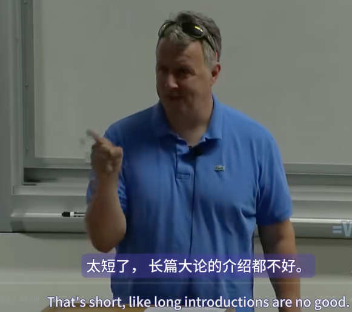

好吧，所以有孩子的好处之一是，当你必须给别人建议时，你可以问自己，我会告诉自己的孩子什么？实际上你会发现这真的让你专注。所以即使我的孩子还小，我两岁的孩子今天被问到两岁后会是什么时，他说是蝙蝠。正确答案是三，但蝙蝠更有趣。

因此，尽管我的孩子还小，但我已经知道如果他们上大学，我会告诉他们什么有关创业的事情。这就是我要告诉你们的。所以你们得到的其实就是我会给我自己孩子的东西，因为你们大多数人都足够年轻，可以做我自己的孩子了。

好吧，创业公司非常违反直觉。我也不确定具体原因。可能只是因为关于它们的知识还没有渗透到我们的文化中。但不管是什么原因，在这个领域你不能一直相信你的直觉。就像滑雪一样。你们有谁成年后才学滑雪的吗？当你滑雪时，当你第一次尝试滑雪并且想要放慢速度时，你的第一反应是向后倾斜，就像做其他事情一样。但是向后倾斜滑雪板，你就会失控地从山上飞下来。所以，正如我所学到的。所以学习滑雪的一部分就是学会抑制这种冲动。最终，你会养成新的习惯。但一开始，当你开始下山时，你需要记住以下几件事。比如双脚交替，做S形转弯，不要拖着内侧脚，等等。

好吧，创业就像滑雪一样不自然。对于创业，你也需要记住类似的清单。而我今天要给你的是清单的开头。你必须记住的违反直觉的东西的清单，以防止你现有的直觉将你引入歧途。

其中的第一件事是我刚才提到的事实，创业非常奇怪，如果你跟随你的直觉，它们会将你引入歧途。如果你只记得这些，当你即将犯错时，你至少可以在犯错之前停下来。

当我经营Y Combinator时，我们曾经开玩笑说我们的职责是告诉创始人他们会忽略的事情。这是真的。一批又一批，YC合伙人警告创始人他们将要犯的错误。而创始人忽略了他们。一年后他们回来说，我希望我们听了。但那家伙在他们的股权结构中，他们无能为力。为什么创始人总是忽视合伙人的建议？好吧，这就是违反直觉的想法。它们与你的直觉相矛盾，所以它们似乎是错误的。因此，当然，你的第一反应是忽略它们。事实上，这不仅是 Y Combinator 的诅咒，而且在某种程度上，也是我们存在的理由。你不需要别人给你不会让你感到惊讶的建议。如果创始人现有的直觉给了他们正确的答案，他们就不需要我们了。

这就是为什么有很多滑雪教练，而跑步教练却不多的原因。是的，就像那样，你看不到“跑步教练”这两个词放在一起，就像你看到“滑雪教练”一样。这是因为滑雪是违反直觉的。所以，YC 有点像商业滑雪教练，只是上坡而不是下坡，理想情况下。

但是，你可以相信你对人的直觉。你迄今为止的生活并不像创业那样，但你与人们的所有互动都就像你与商业世界中的人的互动一样。因此，事实上，创始人犯下的一个大错误就是不够相信他们对人的直觉。他们遇到了一个看起来令人印象深刻的人，但他们对此感到有些疑虑。后来，当事情爆发时，他们会说：“我知道那家伙有问题，但我忽略了它，因为他看起来太令人印象深刻了。”

在商业中有一个特定的子案例，特别是如果你有工程背景，我相信你们都是这样的。你认为商业应该是这种有点令人反感的事情。所以当你遇到看起来很聪明，但不知何故令人反感的人时，你会想，好吧，这对商业来说一定是正常的。事实并非如此。就像你选择朋友一样选择人。这是少数可以自我放纵的情况之一。与你真正喜欢和尊重的人一起工作，并且你已经认识他们很久了。因为有很多人确实很擅长在一段时间内表现出讨人喜欢的样子。等到你的利益受到反对时，你就会明白。

好吧，第二个违反直觉的观点是，这可能有点令人失望，但你在创业公司取得成功所需要的并不是创业方面的专业知识。这使得这门课与你上的大多数其他课程不同。如果你上法语课，最后，如果你努力学习，你会学会说法语。你听起来可能不完全像法国人，但很接近。这门课可以教你创业，但这不是你需要知道的。你在创业公司取得成功所需要的不是创业方面的专业知识。你需要的是你自己用户的专业知识。

马克·扎克伯格在 Facebook 上取得成功并不是因为他是创业公司的专家。尽管他在创业方面完全是个菜鸟，但他还是成功了。Facebook 最初是作为佛罗里达州有限责任公司注册成立的。就连你们也比这更了解。尽管他在创业方面完全是个菜鸟，但他还是取得了成功，因为他非常了解自己的用户。你们大多数人都不知道如何培养天使投资人。如果你对此感到难过，请不要难过，因为我可以告诉你，马克·扎克伯格可能也不知道如何培养天使投资人。如果当罗恩·康威给他开出大额支票时他甚至还留心听的话，他现在可能已经忘了这件事了。

事实上，我担心人们不仅没有必要详细了解创业公司的机制，而且可能有些危险。因为年轻创始人创业时的另一个典型错误就是走过场。他们想出了一些听起来似乎合理的想法。他们以不错的估值筹集资金。他们在索马租了一间漂亮的办公室，雇佣了一群朋友。然后，下一步……

在索马租了一间漂亮的办公室，雇佣了一群朋友，他们逐渐意识到自己是多么的糟糕。因为在模仿创业公司的所有外在形式时，他们忽略了真正重要的一件事，那就是制造人们想要的东西。

顺便说一句，除了最初非自愿的那个脏话之外，这是唯一一次使用这个脏话。我确实和 Sam 确认过是否可以。他说他已经这样做过好几次了，使用这个词。

我们经常看到这种情况发生。不，我的意思是人们在创业时敷衍了事。我们给它起了个名字，叫“过家家”。最终，我意识到为什么会发生这种情况。年轻的创始人在创业时敷衍了事，是因为他们到目前为止的一生都在接受这样的训练。

想想考大学需要什么。课外活动。检查一下。即使在大学课堂上，你所做的大部分工作也像跑圈一样虚假。我并不是在攻击当前的教育体系。不可避免地，你为学习某样东西所做的工作会带有一定程度的虚假性。如果你衡量人们的表现，他们必然会利用这种差异，以至于你衡量的东西在很大程度上是虚假的产物。

我承认我自己在大学时也这样做过。事实上，这里有一个获得好成绩的有用技巧。我发现在很多课程中，可能只有 20 或 30 个想法实际上具有正确的形式来制作好的考试题目。所以我在这些课程中备考的方式不是掌握课堂上的内容，而是试图弄清楚考试题目是什么，并提前找出答案。对我来说，考试不是我的答案会在考试中出现。对我来说，考试是我的哪些考试题目会出现在考试中。所以我会立即得到我的成绩。我会走进考场，看看题目，看看我答对了多少，基本上就是这样。它在很多课程中都适用，特别是 CS 课程。我记得自动机理论。关于自动机理论，只有几件事值得一问。

因此，在接受了玩这种游戏的有效训练后，年轻的创始人在创办一家初创公司时的第一个冲动就是弄清楚这个新游戏的诀窍是什么，这并不奇怪。初创公司的课外活动是什么？我必须做什么？他们总是想知道。由于初创公司成功的衡量标准显然是融资，这是另一个新手错误，他们总是想知道，说服投资者的诀窍是什么？我们必须告诉他们。说服投资者的最好方法是创办一家实际上表现良好的初创公司，这意味着快速增长，然后简单地告诉投资者。

然后他们会问，好吧，快速增长的诀窍是什么？而“增长黑客”这个术语的存在加剧了这种情况。每当你听到有人谈论增长黑客时，你只需在心里将其转化为“废话”。因为我们告诉他们，让创业公司成长的方法是制作用户真正喜欢的东西，然后告诉他们。这就是你必须做的，这就是增长黑客。

所以，YC合伙人与创始人之间的许多对话都是以创始人说“我该怎么做？”开头的句子开始的。而合伙人回答的句子也是“只是”。他们为什么要把事情搞得这么复杂？经过多年的困惑，我意识到，原因是他们在寻找窍门。他们已经接受了寻找窍门的训练。

所以，这是关于创业公司要记住的第三件事，第三件违反直觉的事情。创业就是在玩弄系统不再起作用的地方。如果你去一家大公司工作，玩弄系统可能会继续起作用。根据公司的破产程度，你也许能够通过讨好合适的人，在深夜发送电子邮件给人留下高效的印象而获得成功。或者，如果你足够聪明，可以更改计算机上的时钟。因为谁会去检查标题，我喜欢这样的听众，当他们笑的时候，我可以对他们讲这样的笑话。在商学院。

但是，在初创公司，这行不通。没有老板可以欺骗。如果没有人可以欺骗，你怎么能欺骗别人？只有用户。所有用户关心的都是你的软件是否能满足他们的要求，他们就像鲨鱼。鲨鱼太笨了，无法欺骗。你不能向鲨鱼挥舞红旗来欺骗它。这就像有肉还是没肉。所以，你必须拥有人们想要的东西，而且你只有在拥有这些东西的范围内才会成功。

危险的是，特别是对你们来说，危险的是，伪造在某种程度上对投资者有效。如果你真的知道自己在说什么，你可以欺骗投资者一轮甚至两轮融资。但这并不符合你的利益。你们都是为了股权才这么做的。你在欺骗自己。你在浪费自己的时间，因为初创公司注定要失败，而你所做的只是浪费时间把它写下来。所以，别再寻找诀窍了。初创公司有诀窍，就像任何领域一样，但它们的重要性要比解决真正的问题低一个数量级。一个对融资一无所知，但做出了用户真正喜欢的东西的人，会比一个知道书上所有诀窍，但使用图表平平的人更容易筹集资金。不过，从某种意义上说，现在玩弄系统不再有效是一个坏消息。从某种意义上说，你被剥夺了最强大的武器之一，毕竟，这是你花了20年时间掌握的东西。我发现，世界上有些地方甚至存在着玩弄体制并不是取胜之道，这非常令人兴奋。如果我在大学时明确意识到，世界上有些地方玩弄体制并不那么重要，而有些地方则根本不重要，那我会非常兴奋。但确实存在，这是你在规划未来时需要考虑的最重要的事情之一。明白了，好吗？

你如何在每种类型的工作中取胜，你想通过做什么来取胜？所以，这引出了我们的第四个违反直觉的观点。创业是全民性的。如果你创办一家创业公司，它将占据你的生活，达到你无法想象的程度。而且，如果它成功了，它将在很长一段时间内占据你的生活，至少几年，也许十年，也许你余下的职业生涯。所以这里有一个真正的机会成本。你可能觉得拉里·佩奇的生活令人羡慕，但其中有些部分绝对不令人羡慕。在世人眼中，他从25岁起就开始拼命奔跑，从未停下来喘口气。谷歌帝国每天都会发生一些只有皇帝才能处理的事情，而他作为皇帝，必须处理这些事情。如果他休假一周，就会有一大堆事情积压，他必须毫无怨言地忍受，因为，第一，作为公司的老大，他绝不能表现出恐惧或软弱；第二，如果你是亿万富翁，如果你抱怨生活艰难，你得不到任何同情，甚至更少。

这产生了一个奇怪的副作用，那就是几乎所有成功创业的人都不知道创业的难度。在奥运会上赢得100米比赛的人，他们走到他们面前，然后说，比如，拉里·佩奇也在做这件事，但你永远看不到。好吧，我们在哪里？Y Combinator现在已经资助了几家可以称为巨大成功的公司。在每一个案例中，创始人都说了同样的话。事情永远不会变得更容易。问题的性质发生了变化，所以你可能会担心更引人注意的问题，比如你伦敦新办公室的施工延误，而不是你单间公寓里坏掉的空调。但担忧的总量从未减少。如果有的话，它会增加。创办一家成功的创业公司就像生孩子一样，就像你按下一个按钮，它会不可逆转地改变你的生活。

虽然说实话，生孩子是世界上最好的事情，但如果你能从这次讲座中学到一点，那就是记住，在你生孩子之前，有很多事情比生孩子之后更容易做。其中许多事情会让你在有了孩子之后成为更好的父母。因此，在富裕国家，大多数人会推迟一段时间才开始创业。我相信你们都非常熟悉这个过程。然而，说到创业，很多人似乎认为他们应该在大学里开始创业。你疯了吗？大学是怎么想的？他们不遗余力地确保学生有充足的避孕药具，但他们却到处开办创业项目和创业孵化器。公平地说，大学是被迫的。很多新生对创业公司感兴趣。大学至少在事实上应该为你的职业生涯做好准备。因此，如果你对创业公司感兴趣，大学似乎应该教你创业公司的知识。如果他们不这样做，也许他们会失去那些声称这样做的大学的申请者。

那么，大学能教你创业公司的知识吗？他们不会。我们在这里做什么？是也不是。正如我所解释的那样，他们可以教你创业公司的知识，但这不是你需要知道的。本质上，如果你想学习法语，大学可以教你语言学。这就是它的意义所在。这是一门语言学课，我们教你如何学习语言，你需要知道的是如何学习一门特定的语言。你需要知道的是你自己用户的需求。你只有在真正创办公司时才能学到这些。创办一家公司，这意味着创办一家创业公司本质上是一件你只能通过实践才能学到的事情。但是你在大学里无法做到这一点，原因我刚才已经解释过了，创业将占据你的整个生活。如果你在大学里创业，如果你以学生身份创业，那么你就不能以学生身份创业，因为如果你创业了，你就不再是学生了。你可能名义上是个学生，但你甚至不会再是学生了。那么，考虑到这种二分法，你应该选择哪条路呢？做一名真正的学生，不创业，还是创业，不做学生？

好吧，我可以回答你这个问题。我正在跟我自己的孩子说话。不要在大学里创业。我希望我没有让任何人失望，说真的，说真的。对于很多雄心勃勃的人来说，创业可能是美好生活的一部分，但这只是你试图解决的更大问题的一部分，即如何过上美好的生活。虽然创业在某些时候可能是一件好事，但20岁并不是创业的最佳时机。有些事情你不能做，有些事情你可以在20岁出头的时候做，但在20岁之前或之后就无法做得那么好了。比如一时兴起，全身心投入到看似没有回报的项目中。或者超级便宜地旅行，没有最后期限的意识。事实上，这些只是不同领域的同构形状。对于没有野心的人来说，这种事情可能是可怕的失败。但对于有野心的人来说，这是一种非常有价值的探索。如果你在20岁时创业，而且你足够成功，你就永远不会再创业了。马克·扎克伯格永远不会到外国去闲逛。如果他去国外，那要么是事实上的国事访问，要么是隐姓埋名地躲在巴黎的乔治·桑克酒店。但如果人们仍然在背包旅行泰国，他永远不会去那里。人们还在背包旅行泰国吗？好的，这是我从观众那里看到的第一个真正的热情迹象。应该在泰国发表这个演讲。好吧。

他可以做你做不到的事情，比如包机飞往国外，非常大的喷气式飞机。但成功夺走了他生活中的很多偶然性。Facebook控制着他，就像他管理Facebook一样。虽然掌控某个你认为是一生事业的项目确实很酷，但偶然性也有好处。除此之外，它还为你提供了更多选择来选择你的一生事业。这里甚至不存在权衡。如果你在20岁时放弃创业，你不会牺牲任何东西，因为如果你等待，你更有可能成功。如果你20岁，这种可能性极小，比如说，如果你20岁，并且你有一些像Facebook那样成功的副业，那么你就面临着继续创业还是放弃的选择，也许继续创业是合理的。但通常情况下，创业公司的成功需要创始人的推动，而在20岁时这样做是愚蠢至极的。

那么，你应该在任何年龄创业吗？我意识到我让创业听起来有点难。如果我没有，让我再试一次。创业真的很难。如果太难了怎么办？如果你不能应对这个挑战怎么办？答案是第五个违反直觉的观点。你无法判断。到目前为止，你的生活让你知道如果你想成为一名数学家或职业足球运动员，你的前景会是怎样。孩子，你不可能对每一个听众都这么说。但除非你的生活真的很奇怪，否则你做了很多像创业公司的事情。意思是，如果创业成功的话，它会让你发生很大的变化。所以，你要估计的不仅仅是你现在是什么样，还有你能成为什么样，谁能做到这一点？好吧，不是我。

在过去的九年里，我的工作就是试着猜测人们是否会猜测。我在这里写了预测，结果却是猜测。这是一个非常有用的弗洛伊德式失误。说真的，很容易在十分钟内判断人们有多聪明。把几个网球打过网，他们会把球打回你还是打进网里？但困难的部分是，也是最重要的部分，是预测他们会变得多么坚强和雄心勃勃。现在可能没有人比我更有经验，我可以告诉你专家对此了解多少。答案是，不多。我从经验中学到，要对每一批创业公司中的哪家会成为明星保持完全开放的心态。创始人有时认为他们知道。有些人刚到 Y Combinator 时充满信心，认为自己会取得好成绩，就像他们在人生中遇到的为数不多的几个简单的人为测试中都取得了好成绩一样。其他人则刚到时怀疑自己是因为什么错误被录取，并希望没有人会发现这一点。然而，态度与结果几乎没有关系，这些态度与结果之间没有任何关联。

我读到过军队中也有同样的情况，那些大摇大摆的新兵并不比那些安静的新兵更容易成为真正的强者，原因可能是一样的，因为这些测试与人们前世的测试大不相同。如果你非常害怕创办一家初创公司，那么你可能不应该这么做，除非你是那种喜欢做你害怕的事情的人。否则，如果你只是不确定自己是否能做到，唯一的办法就是去尝试。只是现在不行。

所以，如果你想有一天创业，现在在大学里应该做什么？最初你只需要两样东西，一个想法和一个联合创始人。而获得这两样东西的方法是相同的，这引出了我们的第六个也是最后一个违反直觉的观点：获得创业想法的方法不是试图去想创业想法。

我已经写过一篇关于这个的整篇文章，这里不再重复。但简而言之，如果你有意识地努力去想创业想法，你会想到不仅糟糕而且听起来又糟糕又可信的想法，这意味着你和其他人都会被它们愚弄，你会浪费很多时间才意识到它们不好。想出好的创业想法的方法是退后一步。不要刻意去想创业点子，而是要让你的大脑变成那种无意识地产生创业点子的大脑。事实上，这种无意识会让你一开始甚至没有意识到它们是创业点子。

这不仅是可能的。雅虎、谷歌、Facebook 和苹果都是这样起步的。这些公司一开始甚至都不应该成为公司，它们都只是副业。最好的点子几乎都必须从副业开始，因为它们总是如此离奇，以至于你的意识会拒绝将它们作为公司点子。那么你如何将你的大脑变成那种无意识地产生创业点子的大脑呢？

第一，多学习重要的事情。第二，解决你感兴趣的问题。第三，和你喜欢和尊重的人一起。顺便说一下，第三部分是如何在产生点子的同时找到联合创始人。

我第一次写这段话时，写的不是多学习重要的事情，而是精通某项技术。但这种处方虽然足够，却过于狭隘。Airbnb 的 Brian Chesky 和 Joe Gebbia 的特别之处并不在于他们是技术专家。他们上的是艺术学校。他们是设计专家，也许更重要的是，他们非常擅长组织人员和完成项目。所以你不必从事技术本身的工作，只要你从事能让你发挥才能的工作就行。

那些是什么样的工作？现在，这个问题在一般情况下很难回答。历史上有很多年轻人研究当时被他人，尤其是他们的父母，认为不重要的问题的例子。另一方面，历史上甚至有更多父母认为他们的孩子在浪费时间的例子，而这些父母是正确的。那么，你怎么知道你在做的事情是真正有意义的呢？

当 Twitch TV 从 justin.tv 改为 Twitch TV，并且他们决定播放人们玩电子游戏的节目时，我当时想，这是什么？但结果却是一门好生意。

好吧，我知道我怎么知道真正的问题很有趣，而且我很放纵自己。我总是对有趣的事情感兴趣，即使没有人关心它们，而且我发现很难让自己去做无聊的事情，即使它们应该很重要。我的生活中充满了这样的例子，我做某事只是因为我感兴趣，而它们后来在某种世俗的方面被证明是有用的。Y Combinator 本身就是我做的事情，因为它看起来很有趣。所以我似乎有某种内部指南针可以帮助我。

但这是给你的，不是给我的，我不知道你们脑子里在想什么。也许如果我再多想想，我可以想出一些启发式方法来识别真正有趣的想法。但就目前而言，我能给你的只是无可救药的循环论证建议。顺便说一句，这就是短语“循环论证”的实际含义。这条毫无意义的建议是，如果你对真正有趣的问题感兴趣，那么积极地满足你的兴趣是为创业做准备的最佳方式，而且就此而言，这很可能是最好的生活方式。

尽管我无法解释一般情况下什么才算是一个有趣的问题，但我可以告诉你其中很大一部分。如果你认为技术是一种像分形污点一样扩散的东西，那么边缘上移动的每个点都代表着一个有趣的问题。蒸汽机就没那么有趣了，尽管也许你永远不知道。因此，将你的思维转变为创业想法无意识形成的那种思维方式的一种可靠方法是让自己处于某种技术的前沿，正如 Paul Buchheit 所说的那样，生活在未来。当你到达那里时，那些在别人看来似乎具有不可思议的先见之明的想法对你来说会是显而易见的。你可能没有意识到它们是创业想法，但你会知道有些东西应该存在。

例如，在 90 年代中期，在哈佛大学，我的朋友 Robert 和 Trevor 的研究生同学编写了自己的 IP 语音软件。这并不是要成为一家初创公司，他从未试图将其变成一家初创公司。他只是想和台湾的女朋友通话，而不用支付长途电话费。因为他是网络专家，所以对他来说，显然要做的就是将声音转换成数据包，并通过互联网免费发送。为什么不是每个人都这样做？因为他们不擅长编写这种软件。他从未对此做过任何事情，也从未试图将其变成一家初创公司，但所有最好的初创公司往往都是这样出现的。所以奇怪的是，如果你想成为一名成功的初创公司创始人，在大学里最理想的选择不是某种专注于创业精神的新型职业大学，而是经典的大学教育，即为教育而教育。如果你想创业，你在大学里应该做的就是学习强大的东西。如果你有真正的求知欲，只要你按照自己的意愿行事，你自然就会这样做。

创业精神的组成部分，我永远无法一本正经地说出这个词，真正重要的是领域专业知识。拉里·佩奇之所以是拉里·佩奇，是因为他是搜索专家，他成为搜索专家的原因是他真的对它感兴趣，而不是因为某种别有用心。在最好的情况下，创办一家初创公司仅仅是出于好奇心的别有用心，如果你在过程结束时引入别有用心，你会做得最好。所以，这里对年轻的、有志于创业的创始人的终极建议可以简化为两个词：学习。

好吧，我们还剩多少时间？18分钟的问题，你们有问题吗？我们将从两个在线问题开始，或者我们可以从观众开始。你们说了算，无论你们想做什么。

好的，首先从在线问题开始，今天投票最多的问题是……顺便问一下，我是否需要重复这些内容？

*非技术创始人如何才能最有效地为初创公司做出贡献？*

好吧，如果初创公司在某个领域工作，如果它不是纯技术初创公司，而是在某个非常具体的领域工作，比如Uber，而非技术创始人是豪华轿车业务的专家，那么实际上非技术创始人可能会做大部分工作，招募司机并做Uber必须做的其他事情。而技术创始人只会编写iPhone应用程序，这可能比iPhone和Android应用程序少，后者不到一半。如果它是一家纯技术初创公司，非技术创始人负责销售并为程序员送咖啡和芝士汉堡。

*您认为商学院对想要创业的人有什么价值吗？是否看到了任何价值？或者，如果看到了，价值是什么？*

好吧，我们可能不必回答第二个问题。我想这是你第一个问题的答案。

问题是，如果你对创业感兴趣，商学院有什么价值吗？如果有，价值是什么？

所以，基本上没有。这听起来不太外交，但关键是，商学院的设计目的是教授人事管理，而管理是一个问题，只有在创业公司足够成功的情况下才会出现。所以，要想让创业公司成功，你需要尽早知道如何开发产品。如果你想上某种学校，你最好去设计学校。虽然，坦率地说，学习如何做的方法就是去做，你知道吗？

我早期犯的一个错误是，我建议有兴趣创业的人先去其他公司工作几年，然后再创办自己的公司。但老实说，学习如何创业的最好方法就是尝试创业。你可能不会成功，但只要你去做，你就会学得更快。所以，事实并非如此。

商学院正在努力做到这一点，但老实说，它们本来就是为培训大公司的高管而设计的。当企业面临大公司高管和 Joe's Shoe Store 之间的选择时，企业似乎就是这样的。然后出现了一个新事物，Apple，它最初和 Joe's Shoe Store 一样小，然后变成了一家巨型公司。但它们并不是为那个世界而设计的。而且，如果他们擅长自己擅长的事情，他们就应该去做，不要管整个创业的事情，因为这很酷。是吗？

*你说管理是你成功时才会遇到的问题。是的。那么作为创始人，你试图管理的最初两三个人呢？*

好的，所以只有当你成功时，管理才是问题。那么最开始的两三个人怎么样？理想情况下，你甚至在雇用两三个人之前就已经成功了。你不是说过吗，山姆，Airbnb 花了五个月才雇到他们的第一位员工？所以，理想情况下，你在相当长的一段时间内都不会有两三个人。当你有的时候，创业公司雇佣的第一批人几乎就像创始人一样。他们应该受到同样事物的激励。他们不能是你必须管理的人。这就像那样，这不像办公室或类似的东西。这些人是你的，他们必须是你的同辈，真的。你不应该管理他们太多。

所以这是一个大禁忌，比如，有人必须被管理，他们不可能成为创始团队的一员。我应该重复所有这些问题。所以如果有人必须管理，他们就不应该加入创始团队。如果你正在做某件事，需要某种超级先进的技术，而有个科学家，如果你知道这个词，他只知道这件事，而对世界上其他事情一无所知，包括如何擦嘴，那么雇佣那个科学家并帮他擦嘴可能对你有利。但一般来说，你想要早期有上进心的人。他们应该和创始人一样。

*你认为我们目前处于泡沫之中吗？我认为我们目前处于泡沫之中吗？*

好的，我会给你两个答案。第一，问我对观众有用的问题，因为这些人来这里是为了学习如何创业，我脑子里有比其他任何人都多的数据，你问我的问题就像记者问的那种问题，因为他们想不出任何有趣的问题。我会回答你的问题。

价格高企与泡沫之间是有区别的。泡沫是一种非常特殊的价格过高形式，人们明知故犯地为某样东西支付高价，希望以后能把它甩给更傻的人。这就是90年代末发生的事情。比如，风险投资家明知故犯地投资于垃圾初创公司，以为他们能够在一切爆发之前将这些公司上市并甩给散户投资者。我当时就在那儿，处于一切的中心。

而今天的情况并非如此。价格高，估值高，但估值高并不意味着泡沫。每种商品的价格都会以某种正弦波的形式上下波动。价格确实很高。所以我们告诉人们，如果你筹集资金，不要以为下次筹集资金会这么容易。谁知道呢？假设最坏的情况，但泡沫不存在。

*我注意到年轻人和成功企业家中有一种趋势，他们不再想创办一家伟大的公司，而是想创办20家。因此，你开始看到这些实验室尝试的兴起，他们将尝试推出一堆东西。我还不知道一个真正出色的例子，但是……*

你的意思是像Ideal那样？不，像Ideal Lab，像Garrett Camp的新实验室。哦，是的，好的。所以有这种新事物，人们创办实验室，这些实验室应该会分拆出初创公司。这可能会奏效。Twitter就是这样开始的。事实上，我的意思是Ideal Lab，而不是Ideo。这是另一个弗洛伊德式的失误。因为Twitter最初不是Twitter。Twitter是一个副业。一家名为Ideo的公司副业，该公司应该从事播客业务。而你觉得，播客业务？这些词在语法上合得来吗？答案是否定的，正如Evan发现的那样。但作为一个副项目，他们剥离了Twitter，这真是太不可思议了。所以，人们开始做这些事情，这些事情应该会衍生出初创公司。这会成功吗？很有可能，如果合适的人做的话，很有可能。但是你现在还不能这样做，因为你必须用自己的钱来做。是的，很久以前。

*非常感谢。我不想陷入某种性别陷阱，但你对寻求资金的女性联合创始人有什么建议？*

当你寻求资金时，女性联合创始人。女性筹集资金可能确实更困难，我从经验上注意到了这一点，杰西卡即将发表一系列对女性创始人的采访。她们中的很多人说，她们认为她们也很难，很难筹集资金。所以，我想说的是，你还记得我提到过如何筹集资金吗？如何让你的初创公司真正取得成功？在这种情况下尤其如此。如果你有任何想法，但在某些方面未能达到风投（VC）的理想目标，那么解决这个问题的方法就是让初创公司表现出色。

事实上，一两年前，我在推特上发布了一家公司的增长图。我没有透露他们的身份，但我知道这会引起人们的关注。这实际上是一家由女性创办的初创公司，在筹集资金方面遇到了困难，但他们的增长图非常惊人。所以我发了推文，知道所有这些风投都会开始问我，她是谁。增长图没有性别，所以如果他们首先看到增长图，就会爱上它。因此，表现出色是对初创公司来说的一个好建议，对吗？

*你现在在大学会学什么？*

我在大学会学什么？文学理论？不，开玩笑。让我们看看。老实说，我想我可能会尝试学习物理。我觉得，这就是我错过的东西。出于某种原因，我非常兴奋。当我还是个孩子的时候，电脑很流行。也许现在还是，所以我对编写代码非常兴奋。你可以在卧室里做事情，可以编写真正的程序。你不能建造真正的线性加速器。也许你可以。所以也许，可能是物理学。我觉得，我总是有点渴望地看着物理学。所以也许。但我不知道那是不是，我在说什么？我说的是，我正要说，我不知道这对创办一家初创公司是否有帮助。我刚刚告诉你要追随自己的好奇心。所以谁在乎它是否有用？它会变得有用。

*另一个在线问题。你在工作和个人生活中有哪些重复的系统能让你变得高效？*

好吧，那么我在工作和个人生活中有哪些重复的系统能让我变得高效？养育孩子是提高效率的好方法。因为你没有时间了。所以如果你想做任何事情，你每次要做的工作量都很高。实际上，许多有孩子的父母、许多创业公司创始人都明确指出了这一点。它会让你集中注意力，因为你别无选择。让我们看看。但那不是……

我实际上并不建议生孩子只是为了让你更专注。所以……让我们看看。我不认为我很有效率。我有两种方式来完成工作。一种是，就像在 Y Combinator 期间，我在 Y Combinator 工作的方式是被迫的。就像有一个申请截止日期，我必须设定这个日期，然后人们会提交申请。接着，我会收到所有这些申请，并且必须在某个时间之前回复。所以，我必须阅读这些申请。我知道如果我读得不好，我们就会得到糟糕的创业公司。因此，我真的很努力地去认真阅读这些申请。我设置了这个迫使我努力工作的情况。

我做的另一种工作是写论文。我不由自主地这样做。我走在街上，论文就会在我脑海里自动成形。所以，实际上，我要么强迫自己做不那么令人兴奋的事情，要么忍不住去做令人兴奋的事情。而且我没有任何有用的技巧来提高自己的效率。对不起。如果你做你喜欢的事情，你就不必强迫自己提高效率。是吗？

*你认为什么时候是将副业转变为真正的创业公司的好时机？*

好的，所以问题是，你什么时候将创业公司转变为副业，再转变为真正的创业公司？当它占据了你生活中令人震惊的比例时，你就会知道它正在成为真正的创业公司。就像当你发现，天哪，我花了一整天的时间在做一件原本应该只是副业的事情。我所有的课程都会不及格。我该怎么办？然后，也许它会变成一家初创公司。是吗？

*我知道你之前谈了很多关于你会知道你的初创公司什么时候做得非常好。但我觉得在很多情况下，只有一条灰线，你有一些用户，但可能没有。这是爆炸性增长。图表不在右边。考虑到你分配的时间和资源，你会怎么做，或者你会建议在这些情况下做什么？你如何平衡？*

好的，**当一家初创公司有点成长，但不是很多。你没有告诉他们他们应该重做那些无法扩展的事情吗**？先生，你没有读过。因此，你被抓了。因为我写了一整篇文章来回答这个问题，就是这样。做一些无法扩展的事情。所以就去读一下。因为我记不住我说的所有内容。但它正是关于这个问题。是的，回到那里。

*您认为什么样的初创企业不应该经过孵化？YC 或者...*

哪种创业公司不应该通过 YC？绝对是任何会失败的。或者，如果你会成功，但你是一个无法容忍的人。这也是 Sam 可能宁愿放弃的。除此之外，我想不出任何。因为创始人们经常惊讶地发现，无论他们从事什么类型的业务，初创公司遇到的问题中有很大一部分是相同的。而这些问题往往是 YC所面临的。YC 最擅长的是帮助解决那些特定领域的问题。

*所以，你能想到 YC 不适合的创业公司吗？*

我不能。在上一批中，我们甚至有裂变和聚变领域的创业公司。或者说，他们有。是吗？

*你提到，多学习一些重要的东西是个好建议。是的。那么，有什么好的策略可以找出什么是重要的呢？*

好吧，如果你想知道如何找出什么是重要的，我的建议是，如果你把技术看作是一种像分形污点一样扩散的东西，那么任何边缘的东西都代表着一个有趣的想法。

*你如何找出问题所在？*

你正确地指出了我没有真正回答问题的地方，我给出了一个乞求问题的答案。我说，我只是对有趣的事情感兴趣。如果你对有趣的事情感兴趣，那就去做，一切都会好起来的。但是你如何分辨什么是真正的问题呢？我不知道。这很重要，值得写一整篇文章。我不知道答案。我可能应该写点东西，但我不知道。我找到了一种检测你是否对真正有趣的问题有兴趣的技术，也就是你是否觉得处理无聊的事情是无法忍受的。众所周知，无聊的事情有很多，比如文学理论和在某家大公司担任中层管理工作。所以如果你能忍受那些事情，那么你要么有极强的自律，要么你对真正有趣的问题没有兴趣。反之亦然。是吗？

*所以你说的是雇佣你喜欢的人。但这似乎会导致单一文化。单一文化有很多好处，但你如何处理出现的盲点？*

好的。所以如果你雇佣你喜欢的人，你可能会得到单一文化。你如何处理出现的盲点？创业是一件很多事情都会出错的事情。你不能指望它是完美的。雇佣你认识和喜欢的人的优势远远大于单一文化的小缺点。从经验上看，所有最成功的创业公司，都是只是雇佣他们所有的大学朋友。

好的，谢谢你们。
