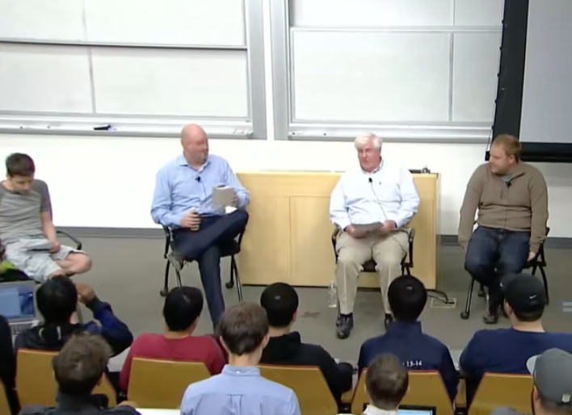

*Sam：*

*我想先问马克和罗恩一个问题，这是目前为止第一个问题，可能需要很长时间来回答。是什么让你们决定投资创始人或公司？你们两个都可以开始。*

Ron：

所以，我们投资一家公司是基于一系列的特点。我从1994年就开始做这件事了，就在马克从伊利诺伊大学毕业之前。所以，SV Angel及其实体已经投资了700多家公司。要投资700家公司，这意味着我们已经与数千名企业家进行了面对面的交谈。

当我遇到企业家时，我的脑海里会闪过很多想法。我只想谈谈其中的一些想法。实际上，当你在第一分钟和我交谈时，我会问，这个人是领导者吗？这个人是否专注并痴迷于产品？我希望如此，因为通常我问的第一个问题是，是什么启发了你发明这个产品？我希望它基于创始人的个人问题，而这个产品是解决个人问题的解决方案。

然后我在寻找沟通技巧。因为如果你要成为一名领导者并雇用一个团队，假设你的产品成功，你必须是一个非常好的沟通者。你必须是一个天生的领导者。现在，你可能需要学习一些领导特质，但你最好掌控并能够成为一名领导者。我会切换回幻灯片，但让我们让马克继续。

Marc：

是的，我同意所有这些。我想，这个问题有很多细节我们可以讨论。我们可能与罗恩还有点不同，我们与罗恩的不同之处在于我们实际上是跨阶段投资的。因此，我们在种子期、风险投资期和成长期进行投资。然后，我们投资各种不同的商业模式，消费者、企业和许多其他变体。因此，如果有具体问题，我们可以给出一些详细的答案。

我想分享两个一般概念。一个是风险投资业务100%是异常值的游戏。这是极端例外，因此，传统的统计数据是，每年大约有4,000家公司可获得风险投资。他们想要筹集风险投资，其中大约200家将得到顶级风险投资公司的资助。其中大约15家公司将来会获得1亿美元的收入。当年的这15家公司将产生当年整个风险投资类别约97%的回报。所以，风险投资是一个极端的盛宴或饥荒行业。你要么是15家公司之一，要么不是。或者你是200家公司之一，要么不是。所以，您要寻找的重要事物是，无论我们讨论哪种特定标准，它们都具有寻找极端异常值的特征。

我想强调的另一件事是我们内部经常考虑的，我们有这个概念，投资于优势而不是劣势。乍一看这听起来很明显，但实际上相当微妙。这有点像，风险投资的默认方式是勾选方框，所以，真正优秀的创始人，真正好的想法，真正好的产品，真正好的初始客户。检查，检查，检查。好的，这是合理的，我会把钱投进去。

但是你会发现，这些复选框交易总是能完成。但你会发现，它们往往没有什么真正让它们变得非常出色和特别的东西，它们没有极端的优势，使它们成为异类。另一方面，拥有真正极端优势的公司往往存在严重缺陷。因此，风险投资的一个警示教训是，如果你不投资存在严重缺陷的公司，你就不会投资大多数大赢家。我们可以举出一个又一个这样的例子。但随着时间的推移，这将排除几乎所有的大赢家。因此，至少我们渴望做的是投资一家在重要方面拥有真正极端优势的初创公司，然后愿意容忍其他一些弱点。

Ron：

当你第一次见到投资者时，你必须能够用一个令人信服的句子说你应该疯狂地实践你的产品。这样，与你交谈的投资者就可以立即在自己的脑海中描绘出产品。今天我交谈过的企业家中，大概有25%的人在听完第一句话后仍然不知道他们在做什么。随着我年龄的增长和耐心的减少，我会说，退后一步。我甚至还不知道你在做什么。但是，努力做到完美。

然后我想跳到第二栏。你必须果断。取得进展的唯一方法就是做出决定。拖延是初创企业的魔鬼。所以无论你做什么，你都必须让这艘船继续前进。如果是决定雇用还是决定解雇，你都必须迅速做出决定。一切都是为了建立一支优秀的团队。一旦你有了优秀的产品，那么一切都是为了执行和建立一支优秀的团队。

Sam:

*帕克，如果可以的话，你能谈谈你的种子轮融资以及进展如何，以及你希望自己作为父亲能做些什么不同的事情吗？*

Parker：

当然，所以实际上我认为，从融资的角度来看，我现在的公司在种子轮融资的大部分内容感觉都相对较快。但实际上，我有一个经历，我在此之前创办了一家公司，在那里工作了大约六年。我和我的联合创始人几乎向硅谷的每一家风险投资公司推销过。我们去了60家不同的公司，他们都拒绝了我们。我们一直在试图弄清楚，应该如何调整我们的推销方式，如何制作不同的幻灯片，如何调整故事等等。有一次，我在推销时，有人给了我一个关键的见解，实际上是来自Coastal Ventures的某个人。这位风险投资人说，伙计们，他正在寻找一些我们手头没有的非常特殊的分析。他说，伙计们，你们不明白。如果你们是Twitter的人，你们可以进来，把任何东西放在这里，我们就会投资你们。但是，你们不是Twitter的人，所以你们需要让这一切变得非常简单，为我们准备好所有这些东西。

而我从中得到的教训与他想让我得到的完全相反，那就是，天哪，我真的应该想办法成为Twitter的人。这就是这样做的方法。所以，实际上我创办现在的公司的原因之一，或者说我发现Zenefits非常有吸引力的原因之一是，当我在思考它时，它看起来像一门生意。我对这段经历感到非常沮丧，我尝试了两年，从风险投资公司筹集资金。而我决定去死吧，你不能指望有资金可用。所以，我创办的这家公司似乎真的可以不筹集任何资金就做成。好像有一条路可以通向，有足够的现金流，这似乎足够吸引我去做。事实证明，这些正是投资者喜欢投资的那种企业。而且，这让事情变得非常容易。

所以，我认为山姆非常友善，说我是筹款专家。事实是，我甚至不认为我很擅长筹款。这可能是我不如我工作中的其他部分擅长的事情。但我认为，如果你能建立一个企业，一切都朝着正确的方向发展。如果你能成为Twitter的人，其他一切都不重要。如果你不能成为Twitter的人，其他任何事情都很难发挥作用。让事情为你走到一起。

Ron：

为什么当失败的鲸鱼主宰了该网站两年时，那位风险投资家说要像Twitter的人一样？因为它无论如何都在增长。因为它有效。

我想说的另一点是尽可能长时间地引导自己。我遇到了一位科技界最优秀的创始人，他正在创办一家新公司。我对她说，你什么时候筹集资金？她说，我可能不会。我说，那太棒了。永远不要忘记引导。所以我实际上打算就此结束。

marc:

但我只是想加快速度，因为我认为帕克刚刚告诉了你最重要的事情。这也是我要说的。这是我读过的最重要的建议，也是我告诉人们关于这类话题的最重要的建议，它来自喜剧演员史蒂夫·马丁，我认为他绝对是个天才。他写了一本关于他创业生涯的书，显然非常成功。这本书名为《生来站着》。实际上，这本书很短，描述了他如何成为史蒂夫·马丁。这本书的核心在于，他探讨了成功的关键是什么。他说，成功的关键是做到如此优秀，以至于他们无法忽视你。

所以，从某种意义上说，就像我们将进行的整个对话，我相信我们会继续讨论如何筹集资金。但从某种意义上说，这一切都有点离题了。因为如果你像帕克那样，建立了一个将取得巨大成功的企业，那么投资者就会主动向你投钱。如果你进来时只有理论和计划，却没有数据，而且你只是接下来的一千人中的一个，筹集资金将变得更加困难。

另一个积极的说法是，做到非常好，以至于他们无法忽视你。换句话说，让你的业务变得更好几乎总是比让你的推销更好要好。另一个消极的看法，或者说警示是，每次我说这句话都会让我陷入麻烦，但我正在服用大量的流感药物，所以我会继续下去，让它爆发。

筹集风险投资是初创公司创始人最容易做的事情，与招聘相比，尤其是与招聘第20名工程师相比，这比筹集风险投资要困难得多。向企业客户销售产品更难。在消费者业务上实现病毒式增长更难。获得广告收入更难。几乎你所做的一切都比筹集风险资本更难。所以，我认为帕克说得很对。如果你遇到筹集资金很困难的情况，那么与接下来的所有其他事情相比，这可能并不难。记住这一点非常重要。

人们常说，筹集资金实际上并不是一种成功。它实际上并不是一家公司的里程碑。我认为这是对的。我认为这是根本原因。它只是让你处于一个能够做所有其他更难的事情的位置。

Sam:

*与此相关，你们希望创始人在筹集资金时做些什么不同的事情？具体来说，马克，你提到了金钱和风险之间的关系，以及这在这里是如何应用的，所以也许我们可以从这个开始。*

Marc:

是的，所以人们忽略的最大的事情，我认为这都是我们的错，我们都没有足够地谈论它。但我认为，无论是在融资还是在经营公司方面，企业家们都忽略了风险和现金之间的关系。因此，风险和筹集现金之间的关系，以及承担风险和花钱之间的关系。

因此，我一直很喜欢安迪·拉德克利夫多年前教给我的东西。他称之为风险洋葱理论。基本上，你可以想象一家初创公司，比如在第一天，有各种可以想象到的风险，你基本上可以列出风险清单。所以，创始团队的风险在于创始人们能否一起工作。你是否有合适的创始人？你会面临产品风险，能否制造出产品？你会有技术风险，可能需要机器学习的突破或其他技术来实现目标，你能做到吗？你会有发布风险，发布能否顺利进行？你会有市场接受风险和收入风险。许多拥有销售团队的企业面临的一个大风险是，能否通过销售产品赚到足够的钱来支付销售成本？因此，你会有销售成本风险。如果你的产品是消费品，你会面临病毒式增长风险，这就是病毒式增长的由来。

所以，一家初创公司在刚开始时基本上就是面临一长串的风险。我始终认为，经营一家初创公司的方式也是我考虑筹集资金的方式，也就是说，这是一个在发展过程中逐渐消除风险的过程。你筹集种子资金是为了消除前两三个风险，比如创始团队风险、产品风险，可能还有初始发布风险。你筹集A轮资金是为了消除下一级产品风险。也许你消除了部分招聘风险，因为你已经组建了完整的工程团队。也许你消除了部分客户风险，因为你获得了前五个beta客户。

基本上，思考这个问题的方式是，你在发展过程中逐渐消除风险。你通过实现里程碑来消除风险。当你实现里程碑时，你的业务就会取得进展，从而证明筹集更多资金是合理的。所以你进来，向像我们这样的人推销，说你正在筹集B轮资金。对我们而言，最好的办法是说，好吧，我筹集了一轮种子资金，实现了这些里程碑，消除了这些风险。我筹集了A轮资金，实现了这些里程碑，消除了这些风险。现在我要筹集B轮资金。这是我的里程碑，这是我的风险。

当我开始筹集种子轮资金时，我所处的状态是这样的。然后，你根据从业务中消除的风险来调整筹集和支出的金额。我经历了这一切，从某种意义上说，这听起来有点明显，但我经历了这一切，因为这是一种系统的方式来思考如何筹集和部署资金。与现在发生的很多事情相比，尤其是现在，很多人只是想着尽可能多地筹集资金，建造豪华办公室，尽可能多地雇用员工，只是希望一切顺利。我会采取策略。

Ron:

当然，不要要求人们签署保密协议。我们很少再被问到这个问题，因为大多数创始人已经意识到，如果你在关系的前端要求某人签署保密协议，基本上就是在说，我不信任你。因此，投资者和创始人之间的关系需要很大的信任。在我看来，我职业生涯中犯下的最大错误就是没有把事情写下来。我对融资过程的建议是尽可能快速高效地完成。不要沉迷于此。出于某种原因，创始人在融资中会把自己的自尊心牵扯进去，因为这是一项个人胜利。正如马克所说，这是路上最微小的一步。这是最根本的一步。快点把它做完。

但在这个过程中，当有人对你做出承诺时，你要立即给他们发一封电子邮件，确认他们刚刚对你说的话。因为很多投资者的记忆力很差，他们忘记了他们对你做出的承诺，忘记了他们要为你提供资金，或者忘记了估值是多少，或者他们要找一个共同投资者。你只要把这件事写下来，就能消除所有的争议。当他们试图逃避时，你只需重新发送电子邮件，说，对不起。希望他们无论如何都回复了那封邮件。所以把它写下来。在会议上，做笔记，跟进重要的事情。

Sam:

*我想在这里再多谈一下这些策略。这个过程是怎样的？人们可以直接给你们发邮件吗？他们需要介绍吗？你需要开多少次会议才能做出决定？你如何确定正确的条件是什么？创始人什么时候可以向你要支票？*

Marc：

那大概是六个问题。(笑）

Ron：

SV Angel 投资于种子期创业公司，所以我们喜欢成为第一个投资者。我们目前通常投资大约一百万到两百万。过去只有一百万。所以如果我们投资 25 万美元，这意味着该财团中还有五六个其他投资者。SV Angel 现在有 13 名员工。我不再做尽职调查。我不再是一个挑三拣四的人。我只是帮助那些开始成熟的投资组合公司完成重大项目。但我们有一个完整的团队来处理。在 SV Angel，我们每看 30 家公司就会投资一家，我们每周都会投资一家。

我认为有趣的是，我们并没有真正接受任何超出预期的事情。我们的网络现在非常庞大，我们基本上只是从我们自己的网络中获取线索。我们会评估这个机会，这意味着你必须提交一份非常简短的执行摘要。如果我们喜欢，我们就会投票，尽管我不再参加这次会议了。但实际上小组进行投票，我们要打电话吗？时间在这个过程中的重要性可见一斑。如果 SV 团队中有足够多的人认为这很有趣，他们就会指派一个人给创始人打电话。通常是我们团队中拥有领域经验的人。如果通话顺利，那我们就想见见你。如果 SV Angel 邀请你见面，那我们就已经开始投资了。如果会议进展顺利，我们会进行一些背景调查，秘密背景调查，了解公司和他们所追求的市场，然后做出投资承诺。接下来，我们会开始帮助其他增值投资者加入财团。因为如果我们要承担同等的工作量，我们希望这家公司的其他投资者也成为优秀的天使投资者。

Marc：

所以我会谈谈风险投资阶段，也就是接下来的A轮融资阶段。首先，我认为现在可以说，所有顶级风险投资家几乎只投资两种A轮融资阶段的公司。一种是他们之前已经筹集过种子轮融资。所以，当我们进行A轮投资时，公司几乎总是拥有一两百万美元的种子融资，来自Ron和他喜欢合作的人。顺便说一句，为了清楚起见，Ron几乎总是喜欢和人们一起工作。

所以首先，要么他们有种子轮融资。如果你要进行A轮融资，首先要做的就是进行种子轮融资，因为这通常是目前的进展方式。偶尔，我们会直接进入A轮，针对一家尚未进行种子轮融资的公司。实际上，这种情况只有在创始人过去曾是成功的创始人，而且几乎肯定是我们过去合作过的人时才会发生。因此，我们实际上有一个公告，我们刚刚做了其中的一个，我们将在几周后宣布。

如果创始人是天使投资者，实际上，我认为Ron也在2006年左右加入团队的公司，然后公司成立了，最终被另一家大公司收购。然后那个团队现在正在开始他们的新事业。因此，在这种情况下，我们将直接跳到A轮融资。因为他们非常出名，并且他们已经为此制定了计划。但是，那是例外。几乎总是先进行种子轮融资。

另一件事是的，我想我已经提到过这一点了，我们得到的与Ron所说的类似。我们每年通过我们的推荐网络获得2,000个推荐。其中很大一部分是通过种子投资者推荐的。所以，到目前为止，获得A轮风险投资公司最佳介绍的最佳方式是通过种子投资者，或者通过Y Combinator之类的公司。

Sam：

*说到条款，创始人最应该关心什么条款，创始人应该如何谈判？也许Parker，我们可以从你开始。*

Parker：

当然，我认为可能正是因为Mark所说的，种子阶段最重要的是选择合适的种子投资者。因为他们将为未来的筹款活动奠定基础，他们会做出正确的介绍。我认为介绍的质量有很大的不同。所以如果你能从风险投资家真正信任和尊重的人那里得到一个非常好的介绍，这比他们不太了解的人的冷淡介绍要好得多。所以在种子阶段，你能做的最好的事情可能是找到合适的投资者。

创始人如何知道谁是合适的投资者？我认为这真的很难。最好的方法之一，不是要为 YC 做宣传，但 YC 非常擅长告诉你他们认为那些人到底是谁。而且可以真正引导你走向正确的方向。我发现他们的判断非常准确，就像你们说谁是最好的人一样。在我们进行后续融资时，他们最终提供了最大的帮助，真的提供了最好的介绍。我可能以为那些人看起来还不错，但实际上他们并没有得到 YC 的高度评价。最终的情况是，他们在种子轮中就像是真正的失败者。有一天我们会公布这些人的名单。天哪，会有很多不高兴的人。让我来做吧。

Sam：

*那么你如何看待谈判？你如何确定一家公司的正确估值，以及条件是什么？*

Parker：

好吧，当我开始筹集种子轮资金时，我真的不知道。而且，我们讨论过这个问题。我可能在估值方面起步过高。正如你们所知，Y Combinator 最终会在一个叫做 Demo Day 的活动上达到高潮，在那里你会同时获得所有这些关注公司的投资者。我开始试图以 1200 万或 1500 万美元的上限筹集资金。这和估值不太一样，但大致相当。每个人都觉得这太疯狂了，完全是疯了。你太自以为是了，那样完全行不通。所以我最终把它降低了一点。在几天的时间里，我说，好吧，我要把它提高 9 倍。然后突然间，无论出于什么原因，种子阶段的某个神奇阈值低于 10，似乎对这一轮的需求几乎是无限的，比如，在 900 万美元的上限。所以没有人会支付 1200 万美元，但在 900 万美元的上限下，感觉我可能筹集到了 1000 万美元。大约一周后，当我达到那个门槛时，这一轮融资就开始了。

所以似乎存在这样的阈值，特别是对于种子阶段的投资者来说，超过这个水平就太疯狂了，这无所谓。人们愿意支付的金额大致有一个范围。所以你必须弄清楚这个范围是多少，拿到你需要的钱。不要筹集超过你需要的资金，然后把事情做完。归根结底，不管你筹集了 1200 万美元、900 万美元还是 600 万美元，对公司的其他人来说都不是什么大问题。

Sam：

*您认为创始人在他们经营的种子轮中出售的公司股份的最大限额是多少？超过这个限额会出现什么问题？*

Parker：

天哪，我不知道。我不知道这方面的规则。我认为，棘手的是，它们似乎有点粗糙，特别是对于A轮融资。你可能会出售公司20%到30%的股份。因为风险投资家往往更注重所有权而不是价格。所以你可能会发现，实际上，有时当公司筹集到巨额资金时，是因为投资者基本上说，听着，我不会低于20%的所有权，但我会为此付出更多。所以，如果超过30%，股权结构表可能会发生一些奇怪的事情，比如，很难在股权结构表中为每个人留出足够的空间。所以，似乎所有东西都在这个范围内。所以，在大多数情况下，情况可能就是这样。

所以，在种子阶段，我听说，这似乎没有什么魔力，但人们似乎说的是10%到15%。但这主要是我听到的。我很好奇你们的想法。

Ron：

是的，我同意所有这些。我认为完成这个过程很重要。但我认为创始人在开始时对自己说，在什么时候我的所有权开始让我失去动力是很重要的？因为如果在天使轮融资中出现40%的稀释，我实际上已经对创始人说过，你是否意识到你已经注定要失败了？如果你是一家普通公司，你将拥有不到5%的股份。因此，这些指导方针很重要。10%到15%。因为如果你继续放弃超过这个数字，你和团队就没有足够的钱了，而你们是所有工作的人。

Marc：

实际上，我们会走开，我们已经看到，在过去五年里，我们看到了一系列有趣的公司，他们只是，我们只是走开，我们不会竞标，只是因为他们的资本表已经被摧毁了。外部投资者已经拥有太多了。有一家公司我们真的很想投资，但当我们和他们交谈时，外部投资者已经拥有了80%的股份。它仍然是一家相对年轻的公司，他们刚刚进行了两轮早期融资，刚刚出售了太多的公司股份。确实，我们很担心，而且我认为我们确实担心，这样的结构会打击团队的积极性。

Sam：

*在开始之前，我们还有一个问题，请问Ron和Mark。你们能不能讲讲你们做过的最成功的投资，以及它是如何发生的？*

Ron：

对我来说，显然是1999年对谷歌的投资。我们从中获得了谷歌回报。但有趣的是，我是通过斯坦福大学工程学院的教授David Cheriton认识谷歌的。他还在这里。他实际上是谷歌的天使投资人，也是我们基金的投资者。我们与基金投资者之间的交换条件是，你必须告诉我们你看到的任何有趣的公司。我们很高兴David Cheriton是我们基金的投资者，因为他可以访问计算机科学系的交易流程。

我们穿着燕尾服参加了在Vivek Ranadeve家举行的派对。我讨厌燕尾服。这里有人认识David Cheriton吗？因为你肯定知道他不喜欢燕尾服。而他确实穿着燕尾服。但我走到他面前，抱怨我们的着装。然后我说，嘿，斯坦福发生了什么事？他说，有一个叫BackRub的项目，它是搜索，它是按页面排名和相关性进行搜索。而今天，每个人都说，页面排名和相关性，哦。这太明显了。在1998年，这并不明显。工程师们正在设计一种基于页面排名的产品。我们，它只是一个简单的算法，它说，如果很多人访问该网站，而其他网站将他们引导到那里，那么该网站一定发生了一些好事。那是最初的算法。而动机是相关性。

所以我对大卫说，我必须见见这些人。他说，你得等他们准备好了才能见他们。有趣的是，他们准备好了，时间是次年5月。我等了五个月，每个月都给他们打电话。最后终于得到了Larry和Sergey的面试机会。他们马上就采取了非常有策略性的投资策略。他们说，如果你能得到红杉资本，我们就让你投资。我们不了解红杉资本，但他们是雅虎的投资者。因为我们进入市场较晚，所以我们想与雅虎达成OEM协议。而我，所以我通过自己的努力获得了对谷歌的投资。

Marc：

那么，我要讲讲另一边的Airbnb。我们实际上并不是它的早期投资者。我们把Airbnb作为增长轮融资。我们为Airbnb进行了第一轮大规模增长。是的，2011年估值约为10亿美元。我认为这将成为有史以来最惊人的增长投资之一。我们拭目以待，但我认为这真的会成为一家大公司。所以，我会讲这个故事，因为这不是纯粹的天才故事。我们过去了。我们甚至没有和他们见过面。我认为我们第一次没有见过他们。或者可能是我们的一个初级员工。但这就是其中之一，我之前说过，风险投资完全是一场离群值的游戏，离群值的关键之一就是，这些想法往往一开始看起来完全是疯狂的。当然，一个允许别人住在你家里的网站的想法，如果你把最疯狂的想法列成一个清单，它肯定会排在最前面。你能想到的第二个最愚蠢的想法是，一个可以让别人住在你家里的网站。所以，Airbnb 独特地结合了这两个糟糕的想法。事实证明，他们已经解锁了一种全新的方式，基本上就是软件吞噬房地产。他们已经解锁了这一巨大的网络效应。这是一个巨大的全球现象，它将是一家非常成功的公司。

因此，我们不得不接受这样一个事实：我们对这个想法的初步分析失败了，而数字清楚地证明我们错了。而且，客户行为也清楚地证明我们错了。因此，我们公司的理念之一是多阶段发展。这样做的主要原因是，我们可以纠正错误，当我们早期犯错时，我们可以支付更多费用，以便以后再加入。

不过，我要强调的另一件事是，我们当时以高估值启动的另一个原因是，我们当时与创始人 Brian、Joe 和 Nate 共度了时光。我的一位私募股权朋友 Egon Durbin 有一句很棒的话。他说，当人们在职业生涯中取得进步时，他们会得到越来越大的工作。在某个时候，他们会得到真正的大工作。有些人，大约一半的人成长为大人物，而另一半的人则成长为大人物，你可以看出两者的区别。到了一定程度，人们就会失去理智。

这些超级成功的高速增长公司面临的一个问题是，Airbnb 就是这些超级年轻创始人的典型案例，他们之前从未经营过任何事情。那么，他们将如何经营这种庞大的全球业务？我们今天每次和这三个人打交道时，都印象深刻，他们是多么成熟，他们进步有多大。他们变得越来越成熟，判断力越来越好，随着他们的成长，他们变得越来越谦虚。这让我们感到非常高兴，因为这项业务不仅会发展壮大，而且这些人将能够创造一些东西并以非常好的方式运营它。

Ron：

人们总是问我，你为什么认为 Airbnb 是一家如此伟大的公司？有趣的是，我们对 Airbnb 如此痴迷。但是，我对人们说，这是因为三位创始人都和另一位创始人一样优秀。这种情况非常罕见。以谷歌为例，两位创始人，其中一位比另一位好一点。但是，嘿，他是首席执行官。每家公司都有首席执行官。我想我们刚刚看到了 TechCrunch 的头条新闻。每家公司都有首席执行官。每家、每家公司、每家公司都有首席执行官。我为什么这么说？

当你创办一家公司时，你必须找到一个和你一样优秀甚至比你更好的人来担任联合创始人。如果你这样做，你成功的机会就会大大增加。这就是Airbnb如此迅速取得成功的原因。Facebook的马克·扎克伯格是个例外。是的，他有一个很棒的团队，但是，马克·扎克伯格现象，主要是一个人，这是异常现象。所以当你创办一家公司时，你必须找到非凡的联合创始人。

*Sam：好的，观众提问。*

*所以，显然，关于你为什么筹集资金的传统观点是因为你需要它。但我越摆脱传统观点，我就越开始听到关于你为什么筹集资金的另一个故事。我实际上听到创始人说，这更多是为了促进大规模退出，或者在最坏的情况下，促进收购，而不是只是一无所获。在多大程度上，这种想法是准确还是有缺陷的？筹集资金是否有助于你退出或收购？*

Ron：

好吧，如果你选择拥有良好人脉和公司领域专业知识的优秀投资者，他们将比金钱增加更多的价值。这些就是你应该寻找的投资者类型。是的，所以这个问题的答案显然是肯定的，但从某种意义上说，这并不重要。因为你不能根据不利因素来计划这些事情。

Marc：

所以，这不是你希望的情景，或者显然你不希望的情景。所以，虽然答案是肯定的，但可能不应该过多地影响决策过程。它可能会，它可能会影响从哪个投资者那里筹集资金。我认为，它可能不会过多地影响是否筹集资金的问题。我认为创业纯粹是资本效应。你仍然希望最终获得一些股权。

*你们对如何处理这个问题有什么建议吗？你说的是动力不足等等。并不是所有的事情都像你启动一些软件，它会病毒式传播，等等。创始人应该做些什么才能让资本密集型公司仍然能够做到这一点？*

Marc：

因此，我会加倍强调我之前对风险洋葱理论以及风险和现金分阶段的评论。也就是说，业务的资本密集程度越高，你就越需要认真考虑使业务正常运转所需的条件以及里程碑和风险的阶段性安排。因为在这种情况下，你想要排列整齐，你想要非常精确地排列整齐。因为风险太高，一切都会偏离轨道，所以，你想要非常精确地确定你将在A轮融资中实现什么目标，以及A轮融资的成功执行。因为如果你在A轮融资中筹集了太多资金，那么在以后的道路上，你会陷入严重的困境，因为你将筹集C、D、E轮融资。然后累积稀释会变得太多。所以，你必须在每一轮融资中都做到精确。你必须尽可能地筹集到接近准确数额的资金。然后，你必须尽可能地对投资者保持透明和清晰，并准确说明风险和里程碑。但顺便说一句，这是一件大事。实际上，我很高兴你问了这个问题。这有点回到帕克所说的。

比如，如果你走进我们的公司，你有Twitter或Pinterest或者其他正在迅速增长并火爆的平台，它会一直发展下去。这些都是简单的。我们把钱投入进去，喂饱它，它就会开始发展。

但如果你走进来，说你有一个非常棒的想法，但在未来五年内可能需要分五轮融资3亿美元，它可能会有一个非常大的结果。但是，这不是Twitter。要达到这个目标，需要付出巨大的努力。我们仍会这样做，但团队的卓越运营更为重要。而传达卓越运营的方式之一就是计划的质量。

回到史蒂夫·马丁的事情，要做得好，他们不能忽视你。计划应该非常精确。

（Ron：如果你是资本设备密集型企业，除了风险资本外，还有借钱的方法。）

是的，你可以加入风险债务，然后再进行租赁融资。但同样，这强调了卓越运营的必要性。因为如果你要举债，那么你真的需要精确地经营公司。因为很容易违反贷款契约，也很容易失去公司。所以这是一个穿针引线的过程，需要更高级的管理水平。

*对于公司来说，哪些投资者的坏迹象表明你不应该与他们合作？*

Ron：

是的，这是个好问题。你怎么知道你应该避免与某个投资者合作？这与我所说的好投资者相反。如果投资者在你的公司没有领域专业知识，没有可以帮你介绍的联系人名单，无论是为了业务发展还是为了帮你做A轮融资的介绍，你都不应该拿那个人的钱。特别是如果他们只是为了赚钱。你可以很快地发现这些人。

Marc：

是的，我很高兴你问了这个问题。我提出了一个更广泛的观点，那就是，如果你的公司成功了，我们在谈论的是那些想要建立大型独立特许经营公司的公司。所以我们谈论的是10年、15年或20年的旅程。10、15、20年，你可能会注意到这比美国的平均婚姻时间要长。这很重要。我认为，选择关键投资者，特别是将进入公司董事会的投资者，与你嫁给谁一样重要。这非常重要。这些人是你将与之生活、合作和依赖的人。而且，你要长期处于压力和焦虑的环境中。我经常说的最重要的论点是，要一直这样做。有时人们相信，有时他们不相信。也就是说，如果一切都很顺利，你的投资者是谁就无关紧要了。但几乎从来都不是一切都很顺利，即使是成功的大公司，即使是 Facebook 和所有这些现在被认为非常成功的大公司。一路上，各种各样的糟糕事情发生，糟糕的事情一次又一次地发生。还有很多紧张的董事会会议、讨论和深夜会议，关系到公司的未来。每个人都必须加入同一个团队，拥有相同的目标，朝着同一个方向努力，达成共识。并且拥有正确的道德观和持久力，才能真正经受住即将到来的风暴。

你会发现，第一次创业者和第二次创业者之间的一个巨大差异是，第二次创业者在经历过一次之后，几乎总是会更加认真地对待这一点。所以这真的、真的、真的很重要。我一直认为，而且我相信确实如此，你的伴侣是谁真的很重要。这真的就像结婚一样。值得花同样的时间，也许没有那么多的时间和精力去选择你的配偶，但花大量时间真正了解你将要和谁合作是值得的。是的。因为这比我是否获得了 500 万美元的估值或 200 万美元的支票更重要。

Ron：

婚姻的比喻很棒。我知道在 SV Angel，我们的态度是，当我们投资企业家时，我们就是为终身投资。因为我们想投资，如果我们做出了正确的决定，我们就会投资他们创办的每一家公司。一旦成为企业家，就永远是企业家。所以我们确实认为这是婚姻。我们，我们为终身投资。

Parker：

有一件事，也就是马克刚才说的另一种说法，就是我在第一次见面时总是在寻找，你是否觉得你尊重这个人？你觉得你有很多东西要从他们身上学到吗？因为有时你与风险投资家见面，在初次见面时，你会感觉，他们可能反应迟钝，或者他们没有理解，或者他们没有看到。有时你走进来，他们会对你的业务有如此多的见解。你走出去时会想，即使这些人没有投资，我和他们在一起度过的那一个小时也真是物超所值。我觉得我对我需要做什么和需要去哪里有了更清晰的认识。这是未来几年将会如何的一个缩影。如果你觉得你希望这个人真正参与到公司中来，即使他们没有随身携带的支票簿，那也可能是一个非常好的迹象。如果不是，那可能是一个非常非常糟糕的迹象。

*天使和风险投资的交易活动受到什么限制，时间、金钱还是缺乏公司？你们可以投资多少家公司受到什么限制？*

Ron: SV Angel 已经习惯了每周一次。你当然不能做更多，而且那是 13 名员工。所以，这实际上是公司的数量。

Marc: 罗恩，如果你们的工作时间都是原来的两倍，你会投资两倍数量的公司吗？

Ron:  我不建议这么做。我宁愿为现有公司增加价值

Marc: 你能谈谈冲突政策吗？或者没有冲突政策？

Ron:&#x20;

SV Angel 实际上确实有书面的冲突政策。但大多数情况下，当我们最终遇到冲突时，通常是因为一家公司已经转向另一个领域。我们通常不会投资有直接冲突的公司。如果我们这样做，我们会向另一家公司披露，向两家公司披露。

请记住，在我们这个阶段，我们无论如何都不知道公司的产品策略。我们可能了解的信息还不够多，无法披露。但是我们的冲突政策也谈到了这个非常重要的词，那就是信任。换句话说，如果我们不信任彼此，我们的开局就会很糟糕。而对于 SV Angel，创始人与我们之间的关系是建立在信任的基础上的。如果有人不信任我们，那么他们就不应该与我们合作。

马克，你会投资有竞争的公司吗？

Marc:

是的，所以这实际上是，让我回到最初的问题，然后我会回到这个问题。最初的问题是，这是我们公司最常谈论的事情。我认为这是所有风险投资运作方式的核心问题，即约束问题。

对顶级风险投资公司来说，最大的约束是机会成本的概念。这个概念基本上就是你所做的每一件事都意味着有很多其他事情你不能做。所以成本并不是最重要的，我们一直在思考这个问题。我们投资 500 万美元给一家公司，但这家公司出了问题，我们损失了钱，这并不是成本。我们真正担心的并不是这个损失，因为理论上我们会找到赢家来弥补这个损失。

我们担心的成本是，我们所做的每一项投资都会对我们如何经营公司产生两个影响。我们所做的每一项投资首先都会排除冲突。因此，我们在风险投资和增长轮次中的政策肯定是，我们不投资有冲突的公司。因此，我们只能在一个类别中投资一家公司。因此，如果我们投资了 MySpace，然后一年后 Facebook 出现了，我们就出局了。我们做不到。因此，我们基本上锁定了，我们所做的每一项投资都会将我们排除在一个类别之外。

而且，当你在这些公司内部讨论这些事情时，这是一个非常复杂的话题，因为你只知道已经存在的公司，你甚至不知道那些还没有成立的公司。如果你投资了一家早期的公司，这家公司不会成为赢家，而三年后，当赢家出现时，你被拒之门外，你根本无法进行投资，那该有多好啊。

所以，一个问题是冲突政策。另一个问题是普通合伙人的时间和带宽机会成本。回到增值的概念，我们是一家典型的公司，我们是一家相当典型的有八个普通合伙人的公司。如果他们完全胜任，每个普通合伙人可能总共可以进入十到十二个董事会。所以基本上，沃伦·巴菲特经常谈论投资，因为你基本上要把它看作一张票，你可以打的洞数量是有限的。每次你进行投资，你就打一个洞。当你没有洞可打时，你就完了，你不能进行任何新的投资。这就是风险投资的运作方式。

所以，我们可以这样想，我们的普通合伙人在任何特定时间点拥有的每个空缺董事会席位都是公司的一项资产，可以用来抓住机会。但每次我们进行投资，我们能打的席位就会减少一个。因此，它降低了公司进行新交易的能力。因此，我们所做的每一项投资不仅会排除竞争对手，还会排除其他交易，因为这些交易会耗尽我们的时间。

所以，这有点像一件大事，这又回到我之前说的，这家公司相当不错。很明显，它将筹集风险投资。你为什么不资助它？好吧，如果我们的能力有限，我们可能会这样做。比如，它可能会赚钱。但相对于被排除在竞争之外，以及相对于没有更好的机会而空缺的董事会席位，我们经常以此为由放弃。

*人们普遍认为，构建 MVP、发布和获得关注比以往任何时候都容易。与此同时，我们知道在 MVP 之前甚至发布前和关注之前会发生 C 交易。所以，在那些你确实看到一家公司要么还没有产品，要么没有发布产品的情况下，你已经获得了一些关注的价格，这些交易是什么样的，你根据什么做出判断？在没有产品和没有关注的情况下，我们可以看到什么值得投资？*

Ron:

能说服我们的，通常是创始人和他们的团队本身。因此，我们首先投资的是人，而不一定是产品理念。产品理念往往会发生很大变化。因此，我们将首先投资团队。如果是预用户，除非创始人之一有成功的记录，否则估值往往会相应降低。

Marc:

是的，对我们来说，如果在投资时什么都没有，那么几乎就不是计划了。几乎总是我们以前合作过的创始人或非常知名的创始人。

顺便说一句，另一件值得强调的事情是，在这些对话中，在所有这些对话中，你默认的假设是我们都创办了消费者网络公司或消费者移动公司。还有其他类别的公司。资本密集型是被提及的。但是，我只想说，例如，企业软件公司或企业，如今，SaaS，应用程序公司或云公司。没有 MVP 更常见，更常见的是冷启动。而且更常见的情况是他们在 A 轮就打造出产品。MVP 毫无意义，因为客户不会购买 MVP。客户在第一次使用时实际上需要完整的产品。因此，公司实际上需要筹集 500 万或 1000 万美元来打造第一款产品。在几乎所有情况下，创始人都必须具备经验。

*你能从创始人的角度谈谈理想的董事会结构和投资视角吗？你们能谈谈理想的董事会结构吗？*

Parker:

我认为，在我们的董事会中，我们很幸运有我自己、我的联合创始人和Andreessen Horowitz的合伙人。我认为这可能消除了恐惧，创造了更多的信任，因为它消除了恐惧，不会有人随意进来解雇你，因为是时候由大公司CEO来做这样的事情了。

但在大多数情况下，我认为如果你信任与你共事的人，这实际上不应该是一个问题。因为这种情况很少，事情几乎从来不会像董事会投票那样。而当他们这样做的时候，就好像在那个时候有什么东西已经严重破裂了。

而风险投资家拥有的大部分权力都来自董事会结构之外。这是融资过程中建立的保护性契约。所以你不能承担债务。你不能出售公司。有些事情你不能在他们不同意的情况下做。所以它可能没有人们想象的那么重要。

我发现，在我看来，作为一名创始人，如果公司一切顺利，你对投资者就有无限的权力。几乎不受限制，无论董事会结构如何，无论回合中的契约如何。如果你说，听着，我想这样做，我认为这是我们需要做的。无论是好投资者还是坏投资者，即使是坏投资者也会说，让我们一起做吧，让我们实现它。因为他们想和你一起乘坐这艘火箭飞船。

当事情进展不顺利时，你在系统中为自己建立了什么保护措施并不重要。到最后，你需要回到低谷来获得更多的钱。如果事情进展不顺利，他们就会掌握所有的牌。他们将重新谈判所有条款。确切地说，他们会改变所有的。

Marc:

当一家公司陷入困境时，实际上就会发生这种情况。实际上，前几轮的条款是什么并不重要，它们都会重新谈判。

我认为这是筹集资金的基本规则，除了永远不要出现亏损。如果事情进展顺利，创始人掌控大局，而他的公司需要更多资金，事情进展不顺利，投资者掌控大局。

我在上市公司和私人公司的董事会任职20年。我从未参加过任何重要的董事会投票。许多讨论，许多争议，许多问题，从来没有投票。最终的决定总是明确的。要么是一致同意，要么非常接近一致。所以，我认为这几乎都是围绕无形资产，几乎与细节无关。

*Sam：好的，非常感谢你们今天的到来。*

