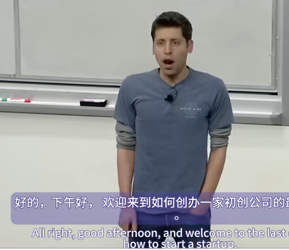

好的，下午好，欢迎来到“如何创办一家初创公司”的最后一堂课。

这堂课与其他课程略有不同。其他课程主要讨论在创业之初你应该考虑的事情，而今天，我们将讨论一些你暂时不必考虑的事情。事实上，你不应该考虑这些事情。但由于在你进入产品市场适应阶段之前，我不会和你们中的大多数人交谈，所以我只想给你一份在创业公司扩张过程中需要考虑的事情清单，以及创始人通常无法完成转型的事情清单。这些就是我们要讨论的主题。

同样，所有这些都不是编写代码或与用户交谈的事情。这意味着，除了我会尽量指出的几个例外，你可以忽略它们，直到你拥有产品市场适应性之后。对于大多数公司来说，这些事情中的大多数在第12到24个月之间变得重要。但实际上，这更多的是关于阶段而不是其他任何事情。这些事情通常会影响到25个人，并且肯定会影响到产品市场契合度。所以，只要把它们写下来，到时候再回顾它们。

我们要讨论的第一个领域是管理。在公司成立之初，没有管理层。这实际上非常有效。在20或25名员工之前，大多数公司的结构都是每个人都向创始人汇报。这是完全扁平的。这真的很好，这就是你想要的。在那个阶段，这是产品的最佳方式，这是生产力的最佳结构。但让人困惑的是，当缺乏结构时，它会一下子失败。因此，在20名员工时完全没问题的方法，从零到20名员工，在30名员工时将是灾难性的。所以你要意识到这种转变会发生。

你实际上不需要让结构变得复杂。事实上，你不应该这么做。你所需要的只是让每个员工都知道他们的经理是谁，而且应该只有一个。而且，每个经理都应该知道他们的直接下属是谁。当然，你希望将人们聚集在合理的团队中。但最重要的是，有一个明确的报告结构，每个人都知道它是什么。如果你想对它进行更改，人们会明白如何进行更改或雇用某人。清晰和简单是这里最重要的事情。但如果做不到这一点，那就很糟糕了。

因为在早期没有任何结构是可行的，而且没有结构感觉很酷，所以许多公司都说，我们要尝试这种疯狂的新管理理论，没有结构。你想要做的是创新你的产品和商业模式。管理结构不是我建议尝试创新的地方。所以不要犯什么都没有的错误，但也不要犯另一个错误，即把事情搞得非常复杂。许多人陷入了这样的误区，他们认为，如果自己是某人的经理，人们会觉得他们很酷，而如果自己只是普通员工，人们就不会觉得他们很酷。因此，他们设计了复杂的循环矩阵和管理结构：你向这个人汇报这件事，向那个人汇报那件事，向另一个人汇报另一件事。但实际上，这个人也向你汇报这件事，这也是一个错误。所以，不要试图在这里创新。

这是公司或创始人工作发生重大转变的第一个例子。在产品市场契合之前，你唯一重要的工作就是打造一款出色的产品，或者说你的首要任务就是打造一款出色的产品。随着公司的发展，当员工数量达到大约25人时，你的主要工作从打造一款出色的产品转变为打造一家出色的公司。在你余下的时间里，这种转变一直存在。这可能是创始人生涯中遇到的最大转变。

在创始人成为管理者的过程中，我们经常会看到四种失败案例。现在我要谈谈最常见的四种。

第一个是害怕聘请高级人员。在创业初期，聘请高级人员通常是一个错误。你只需要能完成工作的人。而且，努力工作的意愿和能力比经验更重要。当公司开始扩大规模时，在你必须建立基本管理结构的时候，让高级人员加入团队实际上是有价值的。以前创建过公司的高管几乎所有的创始人，在第一次聘请一位非常优秀的高管后，这位高管接管了大部分业务，并让这些业务得以实现。创始人会说，哇，我希望我早点这么做。但每个人都会犯这个错误，而且要等太久才能犯。所以，不要害怕聘请高级管理人员。

第二个错误是英雄模式。以某人管理客户服务团队为例。他们希望以身作则，这从一个好的出发点开始。这是以身作则的极端。他们会说，你知道吗？我希望我的团队非常努力地工作。我不会告诉他们努力工作，而是要树立榜样，我每天要工作18个小时。我要向人们展示如何完成大量工单。但随后公司开始发展。此外，他们通常会因为将大量工作分配给其他人而感到不适。因此，公司开始发展，工单数量不断增加。现在他们每天必须工作19个小时，然后是20个小时，这显然行不通。但他们不会停下来雇人，因为他们觉得，如果我停下来，哪怕只有一天，我们也会拖欠票款。在这种情况下，摆脱英雄模式的唯一方法是说，你知道吗？我们将落后两三个星期，因为我要离开，我要再雇佣三名支持团队成员，根据我们的增长率，我计算过这种情况会持续这么长时间。下次，我不会犯同样的错误。我会提前再雇佣。但你实际上必须做出权衡。你实际上必须说，你知道吗？我需要雇佣更多的人，否则我们将落后于他们的工作。这是正确的答案。错误的答案是一直保持英雄模式直到精疲力竭，而大多数人都是这样做的。

第三个错误是授权不当。大多数创始人以前没有管理过人，他们当然也没有管理过经理。所以，糟糕的授权方式是你说：“嘿，员工，我们需要做这件大事。你去研究一下，带着所有的数据和权衡来找我。我会做出决定并告诉你，然后你去执行它。”大多数创始人授权的方式都是这样的。这不会让人感觉良好，而且肯定不会扩大规模。

一个微妙但非常重要的区别是说：“嘿，你真的很聪明。这就是我雇用你的原因。你去吧，这是要考虑的事情，这是我的想法，但你做这个决定。我完全信任你，让我知道你的决定。”这就是真正有效的授权。

因为我认为，史蒂夫·乔布斯能够摆脱前者，并且自己做出每一个决定，而人们只是忍受它。每一个创始人认为他们是下一个史蒂夫·乔布斯，很多人都尝试过这种方法，但我认为，对于99.9%的人来说，第二种方法效果更好。

然后第四个领域是个人组织。当你在开发产品时，你实际上不需要那么有条理，无论是如何经营公司，还是如何与人们谈论他们正在做的事情。但是，如果你没有建立正确的个人组织系统，无法以某种方式跟踪你需要做的事情、其他人在做的事情以及你需要跟进他们的事情，那么你就会自食其果。因此，在公司开始扩大规模时，尽早开发这一点非常重要。

我们一次又一次地从创始人那里听到另外两件事，他们希望自己早点这样做。那就是简单地写下你做事的方式和做事的原因。这两件事，如何做和为什么做，真的很重要。

在早期，当你坐在一起吃午饭或晚饭时，你只是告诉每个人，员工，这就是我们思考产品的方式，这就是我们推动生产的方式，这就是我们处理客户支持的方式，等等。随着规模的扩大，你不能一直这样做。如果你不这样做，别人就会这么说。但是如果你把它写下来并放在维基百科或其他每个员工都会读到的地方，你作为创始人基本上就可以制定法律了。如果你把它写下来，它就会成为公司的法律。如果你让每个人都读到它，当公司雇佣100名员工，然后是1,000名员工时，人们会读到它并说，好吧，这就是我们做事的方式。如果你不这样做，它就会像招聘经理或他们最好的朋友在公司的第一周告诉他们的随机口头传统一样。所以，写下你做事的方式和原因。为什么是文化价值观？Brian Chesky 很好地谈到了这一点。我认识的每一位创始人都希望他们早点把这两个问题写下来，即“如何”和“为什么”。随着公司的发展而建立它们，然后这就是发生的事情。我认为这是你能做的最有影响力的事情之一，而人们却没有做到。

好的，下一个领域是人力资源。人力资源是大多数人在创业初期忽略的另一件事。因为再说一遍，这不是编写代码，也不是与用户交谈。但继续忽略它是一个巨大的错误。我认为大多数创始人忽略它的原因是，他们脑子里有这种想法，就像电视情景喜剧中的人力资源一样，很糟糕。但是，它不必放慢你的速度。实际上，它会让你加快速度。

大多数创始人会说，人才是我们最重要的资产。另一方面，我们不需要任何人力资源。所以，他们的意思是我们不想要人力资源。我们不想要那种糟糕的电视人力资源。好的人力资源意味着几件事。一个清晰的结构，我们已经讨论过了。为人们提供一条关于他们如何发展职业生涯的道路。最重要的是，最重要的事情之一是绩效反馈。同样，这种情况在早期自然发生。有些人知道他们做得怎么样。当公司员工人数达到25、30、45人时，这种认识就消失了。而且它不必太复杂。它可以非常简单。但应该有一种方法来实现它。而且它应该是频繁的。人们需要很快地了解他们做得怎么样。而且它应该与你如何让他们离开公司联系起来，如果他们做得不好，你就应该有一种办法让他们离开公司。或者，如果他们做得很好，就应该有一个明确的途径来说明它如何与薪酬联系起来。

这是下一件事。在创业初期，人们的薪酬是他们与创始人谈判的结果，而且它无处不在。随着你的成长，感觉就像无望的公司化，但确实值得建立这些薪酬范围。所以中级工程师在这个范围内。高级工程师在这个范围内。这就是你从这个范围过渡到那个范围的方法。它让事情变得非常公平。总有一天，每个人都会知道其他人的薪酬。如果一切都乱套了，那将是一场彻底的灾难。如果你早点把这些薪酬范围放到位，至少会是公平的。这也能帮你省去很多疯狂的谈判。

我认为在人力资源方面，股权非常重要。大多数人现在都明白这一点，他们为早期员工提供了大量股权。但我认为你应该一直提供大量股权。而这正是你的投资者总是会给你坏建议的地方。我认为，不是 YC，而是所有其他投资者都会给出坏建议。大多数人都是这样。你应该给你的员工很多股权。现在，这会稀释每个人的股权，这会平等地稀释你作为创始人和投资者的股权。出于某种原因，创始人通常认为这是好事。投资者非常短视，不想稀释自己的股权，所以他们会为每一次股权授予而争吵。

但现在我们已经在YC看到了很多数据。最成功的公司以及投资者表现最好的公司，最终都会年复一年地向员工发放大量股票。所以我告诉创始人，你应该考虑一下，在接下来的十年里，你每年都要给出公司3%到5%的股份，因为公司会变得越来越大。因此，个人授予的股份会越来越少，但总的来说，这是很多股份。我认为这真的很重要。如果你重视你的员工，你就应该这样做。

具体来说，你需要通过复习授予来做到这一点。你应该尽早制定计划。我认为你永远都不想让员工在四年的股票中已经归属了三年，然后开始考虑离开。所以你应该始终走在人们归属时间表的前面。尽早制定计划，准备好复习授予。

人们在这里使用了很多新的结构。我个人喜欢六年，大额授予，但六年的归属。因为我认为这些公司只是需要一段时间来建立。有一种金字塔归属法，即你对某人的授予进行反向加权。因此，在第四年，他们获得的归属比第一年多得多。有一个概念，有不同的名称，但类似于连续前向归属法，即人们的授予每年都会自动以相同数量的股份重新增加。

无论你决定什么，都要在此时建立期权管理系统。人们通常这样做的方式是让某人保留一个Excel电子表格。我见过一些错误，这些错误导致员工或公司损失数千万美元，因为他们没有正确处理这个问题。因此，有非常好的期权管理系统或软件，你应该在此时建立它们。

另一种人力资源方面需要涉及。有一堆规则会在大约50名员工之间发生变化。常见的例子是你必须开始性骚扰培训和多元化培训。还有很多其他的。但请记住，当你的员工人数超过50人时，你必须遵守一套新的人力资源规则。

监控你的团队是否精疲力竭。同样，这取决于产品市场契合度。这只是一场短跑。现在它变成了一场马拉松。此时，你实际上不希望人们永远每周工作100小时。你希望他们去度假。你希望他们面临新的挑战并做新的事情。如果你让整个公司一下子精疲力竭，那通常就是公司倒闭的事情。

这也是实施招聘流程的好时机。大多数创始人后悔的另一件事是他们没有招聘，一旦一切正常，我认为你应该聘请全职招聘人员。如果你太早进行这种操作，那就不好了，因为你会招聘得太快。这通常会导致崩溃。但大多数创始人在这方面都落后了。还有很多其他类型的招聘流程提示。例如，我认为大多数公司，甚至在员工人数达到300或400人之前，都应该在发出聘用通知之前，通过内部邮件列表或其他方式公布每一份聘用通知。因为这样做的话，公司里有一半的人会知道该员工的优缺点。据我所知，实施了这项计划的公司都很高兴。

这也是制定员工晋升计划的好时机。所以，当有人开始工作时，他们的第一周是什么样的？他们如何获得晋升？他们如何学习他们需要学习的一切？他们会有一个伙伴来帮助他们吗？这将帮助他们思考公司的一切。这是你在12到24个月之前确实需要考虑的问题，即团队的多样性。老实说，最常见的情况是，人们会雇佣工程团队中的前15到20名员工。到了那个时候，你就形成了一种文化，这种文化会自行发展。我采访过的大多数犯过这种错误的创始人都对此感到后悔。他们希望自己能早点在团队中聘用一些具有多元化观点的人。工程团队并不是唯一出现这种情况的地方，但这是最常见的地方。如果你早点把这件事做好，从长远来看，你将能够更快地发展团队。

另一件需要考虑的事情是你的早期员工会发生什么。一种常见的情况是公司的发展超越了早期员工。比如，你雇佣了一位非常优秀的工程师。但随着工程团队的发展，你需要一位工程副总裁。早期的工程师想成为工程副总裁，但你不能这么做。但你不希望早期员工离开。他们是文化的重要组成部分。他们知道很多，人们喜欢他们。所以，我认为你应该非常积极主动地处理这个问题。你应该考虑一下，随着公司的发展，我的前10到15名员工将走上怎样的道路。然后就和他们谈谈，非常直接，开诚布公。我想让他们坐下来，说，我想谈谈你希望在这家公司里看到自己的职业生涯走向何方。

好吧，那么，公司生产力。这是你在早期不需要考虑的事情，因为小团队在大多数情况下都是自然高效的。但随着你的成长，如果你不努力，我认为生产力会随着员工人数的平方而下降。因为它有点像节点之间的连接。每对人都会增加沟通开销。因此，如果你不开始考虑在公司有25到50名员工时要实施的系统，以便在公司发展过程中保持高效，那么事情就会比你想象的更快地陷入停滞。我认为，要保持公司在发展过程中的高效，最重要的一个词就是“协调”。公司变得低效的原因在于人们要么意见不一致，不知道共同的优先事项是什么，要么他们积极地相互对抗，这显然更糟糕。

但是，如果你能让整个公司朝着同一个方向努力，你就已经赢得了一半以上的胜利。而开始这一切的方法就是制定一个非常清晰的路线图和目标。公司里的每个人都应该知道未来三个月、六个月或一年的路线图是什么样的，这取决于公司在其生命周期中所处的位置。

我喜欢做的一个经典测试是，如果我走进一家公司，开始为这些扩展问题而苦苦挣扎，我会问创始人，比如，如果我四处走走，随机找十名员工，问他们公司目前的三大目标是什么，他们都会说同样的话吗？100%的情况下，创始人会说，是的，他们当然会说。然后我会去做，100%的情况下，没有两个员工会按顺序说出相同的前三个目标。创始人永远无法相信，因为他们会想，好吧，三个月前我在全体会议上宣布了我们的目标是什么，他们怎么会不记得呢？

但不断重申路线图和目标的信息确实很重要。几乎没有创始人会做足够的事。如果你这样做，公司会说，好吧，这些是我们的目标，我们理解它们，我们会完成它们。它会围绕这个目标自我组织起来。但如果人们不知道路线图或目标是什么，就不会发生。

我们已经讨论过尽早确定你的价值观，但我想重申这一点，因为这也将真正帮助公司做出正确的决定。如果每个人都知道要决定的框架是什么，如果他们是聪明人，他们就会做出同样的决定。你希望继续由优秀的产品来经营，而不是为了流程而流程。这是一条非常微妙的界线，因为你确实需要制定一些流程。但你永远不想制定奖励流程的流程。重点必须始终放在优秀的产品上。

许多公司尝试的一种简单方法是说，我们每天都会传递一些东西。如果你这样做，至少会继续关注交付。然后，沟通的透明度和节奏非常重要。大多数创始人等待这些事情的时间太长了，但每周召开一次管理会议，只让直接向创始人、首席执行官汇报的人参加，这一点至关重要。全体会议，不太确定多长时间最合适。至少每月一次，与整个公司一起讨论结果和路线图，这非常重要。然后，每个季度制定一个计划，说明我们在未来三个月要做什么，以及这如何符合我们今年的目标，这也变得非常重要。

我推迟了那里的会议，因为我认为人们做的还不够。我们参与过的成功公司中，令人惊讶的是，有很多公司会举办很多场外会议。他们会带着他们最好的员工去森林里的小屋或其他地方度过一个周末，然后谈论我们长大后想做什么。我们最重要的事情是什么？我们应该做哪些事情而没有做？但是要让人们走出办公室，走出日常工作。我认识的每个人都认为这样做是值得的。因此，所有这些生产力规划的目标是，你试图建立一家在很长一段时间内创造大量价值的公司。而长期才是这里最重要的。你可以避免所有这些，就像创始人的权威一样，确保公司推出一个很棒的下一个版本。但这对版本10不起作用，对版本11也不起作用。

我真的相信，商业中最难的事情是建立一个可以重复创新的公司，并在成长过程中拥有这种持续的卓越文化。如果你看看这方面的例子，大多数公司都失败了。大多数公司都做了一件伟大的事情，创始人只是努力去完成它。然后后续产品的创新就没那么好了。创始人确实需要思考如何做第二件事，这件非常困难的事情，才能打造出像苹果这样的公司。这可以带来30年、40年甚至更长时间的优秀产品。

好吧，这些都是超级战术机制。这绝对是把这些事情列成一个清单，然后记住以备后用。好吧，在早期，人们基本上忽略了所有的会计工作，如果幸运的话，他们可能有一个装满收据的鞋盒。他们当然没有任何看起来像财务报告的东西。这是实施它的好时机。当一切正常时，比如第18个月或其他时间。你可以找一个外包人员来做这件事。就说，你知道吗？我们想把账簿整理好。我们想每年开始接受审计。我们想与会计师事务所建立关系。很容易做到，绝对值得。这也是收集法律文件的好时机。因为现在很容易解决问题。因此，如果你真的指派某人去审查并收集公司签署的每一份协议，那么当你是房东时，如果有人试图让你退出租约，而你却找不到租约，那么有一半的情况是，有人会以某种方式找到它。此外，你几乎肯定会错过一些东西。有些员工没有签署他们的PIIA或其他文件。你现在就会找到它。现在很容易修复。在下一轮融资中期修复起来真的很难。所以，再说一次，现在是时候给混乱带来一点秩序了。

FF股票是一种特殊的股票，创始人可以在后续轮次出售，而不会搞乱普通股估值。过去大多数人在创办公司时就设立了这一点。创始人基金在某种程度上推广了这一点，这就是为什么它被称为FF股票。但它成为了一个非常糟糕的信号，当公司一无所有时，那些痴迷于个人流动性的创始人，结果大多以失败告终。因此，投资者了解到，如果创始人在种子轮就推动这一点，那是一个非常非常糟糕的迹象。大多数创始人实际上并不想出售股票，直到公司价值达到10亿美元或类似的水平。因此，我认为您可以在下一轮融资开始后安全地建立这一点，然后您可以在两年、三年、四年后出售它。但当你进入B轮时，记住这一点是件好事。

知识产权商标和专利，实际上只是知识产权和商标。因此，如果您想申请专利，您有12个月的时间宣布某件事。如果你错过了那个窗口，就很难做到。因此，在你启动或首次公开谈论你正在做的事情11个月后，是申请临时专利的好时机。我们建议人们只申请临时专利。这一切的作用就像是在专利局排队时保住你的位置。而且它还给你一年的时间来决定是否要申请专利。费用仅为1,000美元左右。它比完整专利花费少得多。而且大多数情况下，一年后你就会知道是否需要完整专利。但如果你只做这一步，你至少有选择权。

现在也是为美国和主要国际市场申请商标的好时机。同样，如果你在这个阶段不这样做，大多数人最终都会后悔。而当你这样做时，这是一个抢占所有域名的好时机。

FP\&A，我认为也是考虑让某人开始做FP\&A的好时机。我认为大多数公司直到为时已晚才意识到他们的财务模型的旋钮在哪里。我认为，如果让某人建立一个非常棒的业务模型，那么事实证明，真正出色的模型就是PayPal首席财务官Roloff Botta，他建立了他们的FP\&A模型。他的电子表格的顶部有1,500行。就像人们构建这些内容时所达到的详细程度一样。但你可以真正优化业务，并在大多数人完全错过的层面上理解它。大多数人在拥有数百名员工之前不会雇用这样的人。我认为值得尽早雇用。

我认为值得尽早雇用的另一件事是全职筹款人，但几乎没有人这样做。假设你雇用了一个非常非常优秀的人，他们的全职工作是为公司筹集资金。你在B轮之后雇用他们。你说，你知道吗，当我们进行C轮融资时，我们希望估值是原来的两倍。如果你只是公司内部人员，那么你几乎肯定会得到比聘请投资银行家或其他人更好的结果。你最终支付的钱要少得多，而且获得的稀释度实际上只有一半。所以我认为这是人们无法做到的这些不太明显的优化之一。

税收结构。所以这是另一回事。最重要的是，一旦一切顺利，你就值得花一点时间思考如何为公司建立税收结构。我承认，我对这里的细节了解不多，因为我个人觉得这真的很无聊。不知何故，如果你将所有知识产权分配给爱尔兰的某个公司，然后该公司将其授权给美国公司，你最终就不用缴纳公司税。但我知道你只能在相对较早的时候这样做。这最终会成为不这样做的公司与这样做的公司竞争的大问题，尤其是一旦他们成为大型上市公司。所以这是值得做的。

班上很多人都谈到了你作为创始人的心理状态，但他们没有提到的是，情况会越来越糟，而不是越来越好。随着公司的发展，你会继续摇摆不定。高潮会越来越好，但低谷也会越来越糟。你真的需要尽早考虑这个问题，并且意识到这将会发生，并尝试在即将经历的不断扩大的波动中管理自己的心理。

当你开始取得成功时，还会发生另一件事：当你从一个大多数人支持的人变成一个失败者时，很多人会开始讨厌你。你首先会在互联网评论者中看到这种情况，他们会说：“我不敢相信这家糟糕的公司筹集了资金，这太糟糕了，太糟糕了。”这只会让你有点烦恼，但随后，你关心的记者也会开始写这些负面评论，情况就会没完没了。随着你越来越成功，这种情况也会不断持续下去。你必须尽早接受这一点，否则它会一直困扰着你。

现在也是开始思考这段旅程有多长的好时机。很少有创始人会考虑长远。大多数创始人会提前一年考虑，他们认为，三年后我会卖掉我的公司，要么成为风险投资家，要么坐享其成，或者做点别的。因为很少有人真正对自己正在建设的东西做出长期承诺，那些真正做出承诺的人拥有巨大的优势。他们属于非常稀有的阶层。所以现在是一个很好的时机，可以和你的联合创始人坐下来决定，我们要为这件事工作很长时间。我们将制定一个战略，假设我们将在未来十年内这样做。我认为，仅仅这样想，可能就是你能为成功做的一件非常有影响力的事情。

休假吧。我们看到的另一个常见现象是，创始人会经营自己的企业三四年，却从未休过一天以上的假。这种情况持续了一年或两年左右。如果你不这样做，真的会导致严重的倦怠。失去专注是创始人偏离轨道的另一种方式。我真的认为这是倦怠的症状。当你对经营企业感到真正倦怠时，你会想做更简单的事情或更令人满意的事情。你想去参加会议，让人们告诉你你有多棒。你想做所有这些实际上与建立企业无关的事情。

我们资助的公司最常见的 YC 后失败案例是，他们在 YC 期间非常专注于自己的公司，然后开始做很多其他事情。他们为公司提供建议，参加会议，等等。专注是让你首先取得成功的原因。人们失去注意力的原因有很多，但要非常努力地与之抗争。这是专注的一个特殊情况。当你开始做得很好时，你会开始看到一群潜在的收购者在打探。这非常令人欣慰，你会想，哇，我可以变得如此富有，我会变得如此酷。并购谈判真的很有趣。这是公司最大的杀手之一，因为他们考虑收购谈判。你分散了注意力。如果没有发生，你会士气低落。如果真的有报价，而且价格真的很低，你心里就已经认为你完了。所以你接受了这个报价。一般来说，除非你愿意以相当低的价格出售，否则不要开始任何收购谈判。永远不要只是检查一下，希望你会得到一个奇迹般的高报价。如果真的发生了，你会知道的，因为他们会在你与他们见面之前给你一个高薪。但是，这对公司来说是致命的。

然后，提醒大家，在某种程度上，创业失败的原因是创始人的放弃。所以，有时你应该放弃。但是，如果你管理不善自己的心理，在不该放弃的时候放弃了，那就是创业失败的原因。这就是大多数创业公司的最终死因。所以，如果你能管理好自己的心理，不放弃，不走到需要放弃或放弃创业的地步，你就会处在一个更好的境地。

所以，营销和公关是我们长期以来告诉公司要忽视的事情。在早期，每个人都认为媒体会拯救他们。我们一直告诉他们，事实并非如此。这绝对是真的。媒体并不能拯救你的创业公司。但是当你开始取得成功时，创始人自己需要花时间去做这件事。因此，一旦你的产品开始运作，你就要从不关心这一点转变为稍微关心一下。创始人要做的最重要的两件事，就是自己弄清楚关键信息。永远不要把这件事外包给你的营销主管或公关公司。你，创始人，必须弄清楚公司的信息是什么。一旦你确定了这一点，它就会一直存在。一旦媒体决定如何谈论你，就很难改变这一点。另一件事是你自己去了解关键的记者。公关公司总是会试图阻止你这样做，因为他们需要有存在的理由。所以他们会说，我们要处理与记者的关系。我们会让你接受采访。没有记者愿意和公关人员交谈。他们更乐意听到创始人的声音。我认为你能做的最大的公关黑客就是不要雇佣公关公司。只要选择三四名记者，与他们建立非常密切的关系，他们喜欢你、了解你、了解你。然后你自己联系他们。他们会报道你给他们的每一个故事，他们会真正关注、了解你并关心公司。这比公关公司向200个联系人发送每条新闻的正常策略要好得多，而这些联系人从不阅读他们的电子邮件。因此，我认为这是一个开始行动的重要时刻。这也是公司业务发展开始变得重要的时期。

在早期阶段，你基本上可以忽略任何类似于交易的事情，除了筹款和销售。这是它们变得重要的时候。而且，你所做的所有事情，或者很多事情，比如筹款，都属于交易的范畴。所以，这是我的一分钟速成课程。

我认为这里有五点非常重要。我们已经讨论了很多。如果你不能打造出一款出色的产品，那么一切都将毫无意义。所以假设你以前做过这件事，那么你就去尝试让任何人和你一起做任何事情。与任何你想与之达成大交易的人建立个人联系非常重要。无论出于什么原因，大多数创始人都没有做到这一点，或者许多创始人都没有做到这一点。但没有人希望感觉他们只是交易对象，你正在利用他们来分销你的产品或筹集资金或诸如此类。因此，要想办法真正关心这个人，关心你和他们一起做的事情，而不是仅仅把他们视为一次性交易。你必须真正关心他们以及他们将从中得到什么。

竞争动态，这就像谈判的基本原则。大多数创始人第一次在融资时学到这一点，但它实际上对一切都很重要。达成交易和获得良好条件的方式是拥有竞争环境。如果你不与甲方达成交易，你就会与乙方达成交易。这并不总是一种选择，但通常是。而这就像促成交易和推动交易的唯一因素。

泰勒在上一堂课上谈到了坚持，所以我将再次谈到这一点。除了说你必须超越自己的舒适点之外，还有很多其他的，大多数时候，作为创始人。然后第五点是你必须要求你想要的东西。这是另一回事。我仍然对此感到困扰，当然我们确实拥有的大多数创始人也是如此。如果你想在交易中得到什么，就去要求它。大多数时候，你不会被排除在外，你可能会得到它。但你必须，比如，在某个时候你实际上必须说，这就是我希望你做的。即使这感觉有点咄咄逼人或有点过分，或者其他什么。

所以，我将用一张图片来结束这部分演讲。Airbnb 的一位创始人在名片上或其他东西上画了这幅图，供另一位正在创办公司的创始人使用。然后我看到了它并拍了下来。因为我认为这是一个很好的总结。他试图在这里画的是他记忆中的 Y-combinator 流程。我喜欢它，因为它非常简单，而且写在名片上时看起来非常可行。但你正在尝试找到产品市场契合点。你正在尝试打造一款产品，你正在尝试缩小这两个齿轮之间的差距。做到这一点的唯一方法就是去见人。如果你不非常非常接近你的用户，你就无法做到这一点。

然后，他在YC的白板上画了这张图，这有点像YC的成人礼之一。但这就是新公司采用情况的图表。因此，如果你在媒体上发布产品，就会出现巨大的增长。然后，增长会逐渐下降，直至消失。在某个时刻，至少在某个时刻，事情看起来会完全消失，并跌至x轴以下。它们会恢复一点。在事情好转之前，你会经历漫长的悲伤低谷。在Airbnb的案例中，图表开始上升之前有一千天。你有一些虚假的希望。然后，终于，终于，三年后，事情开始发展。所以创办一家初创公司最终是一个非常漫长的过程。它可以非常有回报。这确实很长，但可行。这就是我喜欢那幅画的原因。

所以，我想我还有大约十分钟的时间。我可以回答有关这个问题或我们课程中涉及的任何其他问题。如果有人有。

*是的。您谈到多样性很重要，但之前的一位发言者说多样性并不重要，您应该只雇用与您非常相似的人，然后您就可以信任他们。所以，问题是，你如何将多样性的重要性与前面的发言者所说的你想要非常相似的人相提并论？*

不同之处在于，你想要的是背景多样化，而不是愿景多样化。比如，当公司遇到麻烦时，他们的员工对公司应该做什么有着截然不同的看法，或者不能很好地合作。你不想要那样。你确实想雇佣你认识、信任、可以合作的人。但如果团队中的每个人都来自完全相同的背景，你最终会形成某种单一文化，这往往会在日后造成问题。并非总是如此。有些公司在这方面取得了成功。所以，我们告诉人们的是，雇佣你认识的人，以及你以前共事过的人。但要尽量雇佣互补且朝着同一目标努力的人，而不是完全相同的人。因为这样你会得到一套更好的技能。

*那么，有哪些方法可以在个人层面上保持生产力跟踪？尤其是当你经营着几家公司时。你如何在个人层面和团队层面做到这一点？如何跟踪生产力系统。*

所以，我使用的方法是，我认为效果非常好，我会保留一张纸，上面写着我在3到12个月的时间范围内的目标，我每天都会看它。然后，我单独保留一页，记录我当天的短期目标。所以，如果我需要在一周内做某事，我只需翻到七页并写下来。然后，我还会保留每个人的名单，以及他们正在做什么，我需要告诉他们什么，我需要和他们谈论什么，我们上次谈论过什么。所以每次我和某人坐下来时，我都会有完整的状态和一份关于那个人的事情清单。效果很好。

*我们已经讨论了很多关于初创企业成长的问题，但大多数初创企业都失败了。*

*有什么关于如何优雅地失败的建议吗？*

是的，很好的问题。你应该来采访我，关于如何优雅地失败。

所以，大多数初创公司都失败了，硅谷对失败的热爱几乎到了极点。失败仍然很糟糕，你仍然应该努力不失败。而这种“失败是伟大的”想法，我不同意。但是，大多数人大多数时候都会遇到这种情况。这是一个非常宽容的环境。只要你坦率地面对它，有道德，不让任何人陷入糟糕的境地。

所以，如果你失败了，首先，你应该告诉你的投资者。其次，你不应该完全耗尽资金。你不想的是公司欠下一堆债务，然后每个人有一天去上班，门都被锁上了。当你失败时你会知道，当公司失败时你会知道，事情就不会顺利了。你应该直接告诉你的投资者，嘿，对不起，这行不通。没有人会感到惊讶。比如，我预计会损失我的钱，或者我愿意在每一次投资中损失我的钱。我知道这种情况大多数时候都会发生，赢家会为此付出代价，仍然是100倍，所以没关系。没有人会感到惊讶，人们会非常理解和支持。但你要早点告诉人们，你不想让他们感到惊讶。你不想让你的员工在失业时感到震惊。你想以一种优雅的方式关闭公司，帮助他们找到工作。确保给他们两到四周的遣散费，这样他们就不会遭遇现金流问题。所有这些都非常重要。

*你在 Y Combinator 见过多少移民创始人？*

我们在 Y Combinator 看到了多少移民创始人？上一批中，我认为下一批中移民创始人的数量可能会增加。在上一批创业者中，我们资助的41%的创始人出生在美国以外，来自30个不同的国家。所以，是的，这是一个相当大的比例。

*除了硅谷，您认为还有哪些地方适合创业？*

除了硅谷，我认为还有哪些地方适合创业？我仍然认为硅谷是最好的，而且优势非常明显。但我认为它最终可能开始减弱一点，因为成本已经变得如此失控。要清楚，如果我要创办一家公司，我仍然不会考虑其他地方，我仍然会选择硅谷。我认为，如果你看看过去几年的公司数据，硅谷仍然胜出很多。但是，西雅图、洛杉矶，美国以外的很多地方，我认为所有这些都是有道理的。我犹豫着是否要向那里提出建议，因为我在这些城市里待的时间还不够长，无法真正直观地感受到。但你和我一样了解常见的情况。人们谈论创业中心。而我只是，我不能就此提出个人建议。

*那么创始人什么时候开始考虑聘请专业CEO，比如资深人士？创始人什么时候应该考虑聘请专业CEO？*

永远不会。如果你看看科技界最成功的公司，你会发现它们由创始人经营了很长时间。有时是永远。有时他们甚至聘请了专业CEO，然后意识到这不会打造一家伟大的公司。所以，就像拉里·佩奇回来再次担任CEO一样。我认为如果你不想成为一家公司的长期CEO，你可能不应该创办一家公司。我对此并不完全确定。我认为有例外。但一般来说，这就是我今天谈到的转变，如果你从打造一款伟大的产品转变为打造一家伟大的公司。作为一名创始人，十年中九年的时间里，我都要致力于打造一家伟大的公司。如果你对此不感兴趣，我认为你应该认真考虑一下。

*当你试图从打造优秀产品转向打造优秀公司时，你应该注意哪些最常见和最令人担忧的警告信号？当你转向打造优秀公司时，最常犯的错误是什么？*

我想我在这里已经讲过了大部分错误。我试图把我看到人们大多数时候犯的错误都放在这里。

*有没有办法在被接受之前参与YCombinator社区？有没有办法在获得资助之前参与YC？*

没有，而且是故意不这样做。实际上，我要说的是，你可以做的一件事是，如果你在一家YC公司工作，然后申请，我想这可能，不是可能，那肯定会，如果你得到那些创始人的推荐，会对YC有所帮助。所以，在YC公司工作是有帮助的。但你能做的帮助并不多，这是故意的。没有像医学预科那样的预创业。你应该专注于你正在做的事情。然后当你创办一家初创公司时，YC和其他公司会为你提供帮助。我们资助的大多数创始人，在创办公司之前我们根本不了解他们。你不需要，你真的不需要了解我们或参与其中。我们，我们都很好。

*你说有一个统计数据，现在进入YC比进入哈佛大学更难。所以我很好奇，你使用的标准是什么，我如何挑选初创公司？它会随着时间的推移而改变吗？*

问题是，我们用什么标准来挑选初创公司，它是否变得更难了？它变了吗？我们需要看到的两件事是优秀的创始人和好的想法。如果没有这两者，我们就不会资助一家公司。但这一点没有改变。就像那样，情况一直如此。YC的申请者人数已经增长了不少。大部分创业者的增长其实来自那些本来就不应该创业的人，他们之所以选择创业，只是因为现在创业被视为一种很酷的事情。所以，如果你真的对一个想法充满热情，而且这个想法很好，你很聪明，并且你能把事情做好且在执行上有优势，我仍然认为你很有可能进入YC（Y Combinator），即使现在的申请人数更多。

*有某个特定的市场让你非常兴奋，但你不一定了解很多。有没有什么特定的应用程序是你推荐的，或者推荐的方法？*

当然有。如果有一个市场让你兴奋，但你还不太了解，你应该怎么做？对此有两种观点。一种是直接跳进去，边走边学。这种方法很多时候都很有效。另一种是去该领域的公司工作，或者在该市场做一年或两年的事情。我稍微倾向于第二种，但只要你愿意真正学习，真正研究，真正接近你的用户，两种方法都可以。我甚至不认为这有什么太大的缺点。我认为，如果一切顺利，我会花几年时间详细地学习它，但我认为你不必这样做。

*我有一个与YC相关的问题。我认为YC在促进硅谷的创业方面做得非常出色。事实上，作为一名机构投资者，我在过去几年里投资了三家YC公司。现在，似乎每年有180家公司进入市场。看起来很难再跟踪每一家YC公司了。你认为这会导致一些人离开YC，因为他们无法跟踪如此大量的公司吗？*

通常，在过去，公司必须非常完善，基金也必须反复思考这个想法。硅谷有大量的YC公司，然后他们得到了资金。但现在，由于年轻的部分很容易获得资金。好吧，所以我认为问题是，投资者会减少对YC公司的资助吗？不，绝对不会。当然，趋势是相反的。我们有越来越多的投资者说，他们投资组合中的一半现在是YC公司。他们期待着四分之三的公司。不，我不认为这是个问题。我认为这不在我的100个问题清单上。也许恰恰相反。

*还有一个问题。一群创始人应该什么时候筹集种子基金？还是第一笔钱？一群创始人应该什么时候筹集一些种子资金？*

这是一个很好的问题。我认为，一般来说，最好等到你的想法想清楚了，并且有初步的希望迹象后再筹集资金。筹集资金会给公司带来一些压力，一些时间压力。一旦你筹集了资金，你就不能无限期地处于这个探索阶段。你最终不得不匆忙行事。所以，如果你还没有筹集到资金，而且你的想法行不通，你可以四处寻找和调整，直到你真正找到可行的东西。但是，如果你已经筹集了资金，而你的想法行不通，你就会处于一种糟糕的境地，必须进行调整。然后，你可能会转向第一个看似可行的模糊想法。这是非常糟糕的情况。

因此，我认为，如果你能够等待，不要急于筹集任何外部资本，那将是最好的。如果确实有必要筹集资金，也尽量控制在10万到20万美元以内，但理想情况下甚至不需要这么多资金。直到你的项目开始运转，或者至少朝着运转的方向发展，你才会处于一个较好的状态。

好的，非常感谢大家。这次讨论很有趣。
