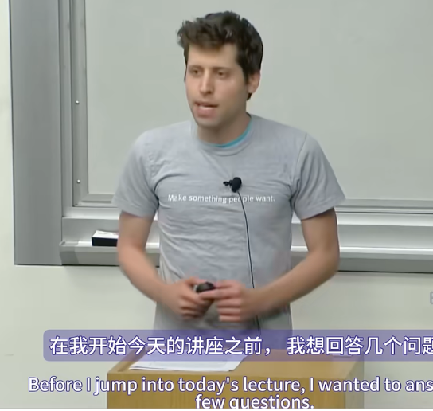

第二讲《Team and Execution 团队和执行》仍是由时任YC总裁的Sam Altman主讲：

在我开始今天的讲座之前，我想先回答几个问题。有人给我发电子邮件说他们对上一堂课有疑问，因为时间不够了。所以，如果你对我们上次讲的内容有疑问，我现在可以回答。

网上提交的一个问题是，我如何确定一个市场现在和未来十年的增长率是否很快？

好吧，所以问题是如何确定快速增长的市场。好消息是，这是学生的一大优势。你应该相信你的直觉。老年人基本上必须猜测年轻人正在使用的技术，因为年轻人变老了，他们成为主导市场。但是你可以观察自己和朋友在做什么。你几乎肯定会比任何比你年长的人对快速增长的市场有更好的直觉。所以答案就是相信你的直觉。多想想你正在使用什么，想想你正在使用什么，你看到你的同龄人开始使用什么。这几乎肯定会是未来。

也许我可以在开始之前再问一个问题。这个问题与上一堂课无关，但我的另一个问题是，你如何在保持效率的同时应对倦怠？

当然。所以问题是你作为创始人如何应对倦怠。这个问题的答案是，这很糟糕，但你继续前进。不像学生，你可以举起手说，你知道吗，我真的筋疲力尽了，我这个季度的成绩会很差。创业的困难之一在于这是现实生活，你必须克服它。经典的建议是去度假之类的，但这对创始人来说从来都行不通，这有点消耗精力，很难理解。所以你要做的就是继续前进。你依靠别人，这真的很重要。创始人抑郁症是严重的问题，你需要有支持网络。但克服倦怠的方法就是应对挑战，解决出错的事情，你最终会感觉好些。

好的。所以，上周我们，或者说上一堂课，我们讨论了想法和产品。我想再次强调，如果你做不到这些，剩下的都救不了你。今天，我们将讨论如何招聘和如何执行。希望你不要处决你雇佣的人。所以，首先，我想谈谈联合创始人。联合创始人关系是整个公司中最重要的关系之一。每个人都说你需要留意联合创始人之间正在酝酿的紧张关系并立即解决。这些都是真的。当然，在 YC 的案例中，创业公司过早死亡的首要原因是联合创始人闹翻。但出于某种原因，很多人认为选择联合创始人甚至比招聘更不重要。不要这样做。这是创业过程中最重要的决定之一。你需要这样对待它。出于某种原因，学生在这方面真的很差。他们只是随便选一个人。他们说：“我想创业。”你想创业吗？我们一起创业吧。有这样的情况，比如联合创始人约会。你会说：“嘿，我在找一个联合创始人。”我们并不认识。我们一起开公司吧。这太疯狂了。你永远不会雇佣这样的人。然而，人们却愿意以这种方式选择他们的商业伙伴。这真的非常糟糕。而且选择随机的联合创始人或选择与你没有长期合作的人，选择一个你不是朋友的人，这样当事情真的出错时，你们就有这种过去的历史把你们联系在一起。通常以灾难告终。

我们有一个 YC 批次，大约 75 家公司中的 9 家在我们面试这些公司和它们开始创业之间增加了一位随机联合创始人。而这九支团队在第二年全部解散。对于那些彼此不了解的创始人来说，他们的记录真的很糟糕。结识联合创始人的一个好方法是在大学里。如果你不在大学里，也不认识联合创始人，我认为下一个最好的选择就是去一家有趣的公司工作。如果你在 Facebook 或谷歌或类似公司工作，那么它的联合创始人数量可能几乎和斯坦福一样多。没有联合创始人总比有一个糟糕的联合创始人要好。但独自创业仍然很糟糕。

在我们开始之前，我只是在这里查看了统计数据。对于最顶级的，我可能因为数得太快而漏掉了一个，但我认为 YC 最有价值的 20 家公司，所有公司都至少有两位创始人。而我们，我们资助的比率大概是十分之一的单人团队。所以，最好的是你知道的联合创始人。比这更好，或者没有那么好，但还是可以的，单人创始人。你遇到的随机创始人。同样，学生这样做是有原因的。真的，真的很糟糕。

所以当你考虑联合创始人和可能优秀的人时，你会有一个问题，你在寻找什么。在 YC，我们有一句公开的话，那就是不懈地足智多谋。每个人都听说过。我认为这真的很好地描述了你在寻找联合创始人时所要求的。你绝对需要不懈地足智多谋的联合创始人。但我们在 YC 启动仪式上分享了一个更生动的例子。Paul Graham 开始使用这个方法，而我一直沿用它。所以，你要找的联合创始人必须沉着冷静、坚韧不拔。他们知道在任何情况下该怎么做。他们行动迅速。他们果断。他们富有创造力。他们做好了一切准备。事实证明，在流行文化中，有这样一种模式。这听起来真的很蠢，但至少非常令人难忘。我们早就告诉过 YC 的每一届学生这一点。我认为这对他们有帮助。

这个模式就是詹姆斯·邦德。

再说一次，这听起来很疯狂，但它至少会留在你的记忆中。而且，你需要一个行为举止像詹姆斯·邦德的人，而不是某个特定领域的专家。

正如我之前提到的，你真的想了解你的联合创始人一段时间，理想情况下是几年。对于早期雇用的人也是如此。但顺便说一句，在早期招聘中，人们比在联合创始人中更能做到这一点。

所以，再次强调，要充分利用学校。除了足智多谋外，你还需要一个坚强而冷静的联合创始人。有很多显而易见的事情，比如聪明。但每个人都知道你需要一个聪明的联合创始人。大多数人没有把强硬和冷静放在首位，特别是当你觉得自己不是的时候。

你需要一个懂技术的联合创始人。如果你不懂技术，希望这个房间里的大多数人懂技术，你真的想要一个懂技术的联合创始人。现在初创公司里有一种奇怪的现象，人们越来越流行这样的说法，比如，你知道吗？我们不需要技术创始人。我们要雇人。我们只是要做优秀的管理者。根据我们的经验，这种说法效果不太好。软件人员真的应该创办软件公司。媒体人员应该创办媒体公司。

所以，在 YC 的经验中，两三个联合创始人似乎是完美的。一个，显然不是很好。五个，真的很糟糕。四个人有时也行，但我认为两三个人才是目标。

好的，这是招聘的第二部分。尽量不要。所以，如果你创办了一家公司，你会注意到一件奇怪的事情，那就是每个人都会问你有多少名员工。这是人们用来判断你的创业公司有多真实、有多酷的标准。如果你说你的员工人数很多，他们会很佩服你。如果你说你的员工人数很少，那么，你听起来就像在开玩笑。但实际上，拥有很多员工是一件很糟糕的事情，你应该为自己拥有的这么少的员工感到自豪。很多员工最终会导致高烧钱率，这意味着你每个月都会损失很多钱。复杂性、紧张性、决策缓慢。诸如此类，但都不是好事。所以，你应该为自己能用少数员工完成这么多工作而感到自豪。许多最好的 YC 公司在第一年的员工人数都非常少，有时除了创始人之外没有其他员工。他们确实在尽可能地尝试保持小规模。

一开始，你应该只在迫切需要时才招人。之后，你需要学习如何快速招人并扩大公司规模。但在早期，目标应该是不招人。不招人。而这种情况之所以如此糟糕的原因之一是，早期招人失败的成本非常高。事实上，我参与过的许多公司，在最初招到三名左右员工时，表现非常糟糕，并且从未恢复过来。这只会毁掉整个公司。

Airbnb 在招聘员工之前花了五个月时间面试他们的第一位员工。而在第一年，他们只招了两个人。在他们招聘一个人之前，他们写下了一份希望任何 Airbnb 员工都拥有的文化价值观清单。其中之一就是你必须为 Airbnb 付出努力。如果你不同意这一点，他们就不会雇用你。

举个例子，Brian Chesky 是 Airbnb 的首席执行官，他就是这种强烈性格的体现。在 Airbnb 招聘员工之前，他经常会问他们，如果医生诊断他们只剩一年生命，他们是否会接受这份工作。他希望他们能如此投入。后来，他觉得这有点太疯狂了。我认为他将期限放宽到十年。但我听说，他仍然会问这个问题。

这些员工真的很重要。这些人将决定你的公司的未来。所以你需要和你一样相信公司的人。这听起来像是一个疯狂的问题，但他已经形成了这种文化，即当公司面临危机时，员工们会齐心协力，团结起来。当公司早期面临重大危机时，公司里的每个人都住在办公室里，每天都会发布，直到危机结束。

关于 Airbnb 的一个引人注目的观察是，如果你与最初的 40 或 50 名员工交谈，他们都感觉自己是公司创始人的一部分。这一点很难做到，而且非常罕见。但是，通过制定极高的标准，缓慢招聘，并确保每个人都相信使命，你就可以做到这一点。

好吧，假设你已经听取了关于不要招聘的警告，现在你绝对必须这样做。当你处于这种招聘模式时，获得最优秀的人才应该是你的首要任务。就像当你处于产品模式时，这是你的首要任务，当你处于融资模式时，融资是你的首要任务。创始人总是低估的一件事是招募人才的难度。你认为你有这个好主意，每个人都会来加入。但事实并非如此。

为了获得最优秀的人才，他们有很多很好的选择，所以招募一个人很容易就需要一年的时间。这是一个漫长的过程，你必须让他们相信你的使命是他们所关注的最重要的事情。这也是为什么在做其他事情之前先做好产品非常重要的另一个例子。最优秀的人才知道他们应该加入一艘火箭飞船。

顺便说一句，这是我的首要建议。如果你要加入一家初创公司，那就选择一艘火箭飞船。选择一家已经在运作的公司，并不是每个人都意识到这一点。但因为你在关注，它会变得非常庞大。而且，再说一次，你通常可以识别这些。优秀的人知道这一点，所以他们会等待，想在加入之前看到你处于突破轨迹上。今天早上有人在网上问了一个问题：你应该花多少时间在招聘上？答案要么是零，要么是25%。你要么根本不招人，要么这可能是你最大的时间块。实际上，就像所有关于管理的书籍或其他书籍一样，它们说你应该花50%的时间来招聘。但是那些给出这种建议的人，自己很少会花10%的时间。25%仍然是大量的时间，但一旦你进入招聘模式，你就应该花这么多时间。

如果你妥协并雇佣一个平庸的人，你永远都会后悔。我们总是喜欢警告创始人这一点，但没有人真正感受到这一点，直到他们第一次犯错。平庸的员工会毒害公司的文化。在大公司里，平庸之辈会造成一些问题，但通常不会毁掉公司。然而，在初创公司中，前五名员工中有一个平庸的员工往往会毁掉整个公司。

我的一个朋友在会议室里挂了一个牌子，用来面试。他会把牌子放在合适的位置，让候选人在面试时能看到。上面写着：“平庸的工程师不会建立伟大的公司。”这是真的。在大公司里，你可以侥幸逃脱惩罚，因为总会有人漏网。但在初创公司里，每个人都定下了基调。因此，如果你在最初的五到十名员工中做出妥协，公司可能会破产。你应该为每一个员工考虑这个问题：我会把公司的未来押在这个员工身上吗？这是一个很难回答的问题。

在公司发展壮大的过程中，你会在员工招聘上做出妥协。会有一些紧迫的最后期限或类似的事情，你还是会后悔的。但这是理论和实践的区别。我们稍后会有演讲者谈论这种情况，以及发生这种情况时该怎么做。但在早期，你不能搞砸。

候选人的来源是学生们经常犯的另一个错误。到目前为止，最好的招聘来源是你已经认识的人，以及公司其他员工已经认识的人。大多数伟大的科技公司都是通过个人推荐建立起前至少100名员工的，通常还会更多。大多数创始人不太愿意称呼自己遇到的每个人都是优秀的，并要求员工也这样做。但你会注意到，如果你去Facebook或Google工作，他们在你入职头几周会做的事情之一就是，人力资源人员会坐下来，把你遇到过的所有聪明人都列出来，不管你认为自己有多大可能招到他们。这些个人推荐确实是招聘的诀窍。所以你必须走出自己的舒适区。另一个建议是把目光投向硅谷之外。在这里，招聘工程师的竞争非常激烈。但你可能认识住在世界其他地方的非常优秀的人，他们很乐意和你一起工作。

创始人经常问我们的另一个问题是经验以及经验有多重要。简而言之，经验对某些角色很重要，对其他角色则不重要。当你招聘某个人来管理你公司的一个大型组织时，经验可能非常重要。对于初创公司早期招聘的大多数员工来说，经验并不重要。你应该追求才能，相信自己所做的事情。我一生中招到的大多数优秀员工之前都没有做过这件事。所以，真的值得思考一下，在这个职位上我是否在乎经验？在早期，大多数时候你并不在乎。

我招人时会考虑三件事：他们聪明吗？他们能完成任务吗？我愿意花很多时间和他们在一起吗？如果我得到的答案是肯定的，我几乎从不后悔雇佣他们。这几乎总是奏效的。你可以从面试中了解到很多关于这三件事的信息，但最好的方法是一起工作。所以理想情况下，面试官是你过去共事过的人，在这种情况下，你可能甚至不需要面试。如果你还没有，那么我认为最好先和某人一起做一个快速项目，然后再雇用他们。你们都会学到很多东西，他们也会。而且大多数初次创业的人面试能力很差，但很擅长在合作后评估他人。因此，我们在 YC 给出的建议之一是尝试合作完成一个项目，而不仅仅是进行一次面试。

如果你要去面试，你很可能也会这样做，你应该具体询问某人过去做过的项目。你会比用脑筋急转弯学到更多。出于某种原因，年轻的技术创始人喜欢问脑筋急转弯问题，而不是只问某人做过什么，真正深入了解人们从事过的项目。并打电话给推荐人。这是初次创业的人喜欢跳过的另一件事。你想打电话给这些人过去曾合作过的人。当你这样做时，你不会只想问，哦，某某怎么样？比如，你真的想深入了解。比如，这个人是否在你共事过的人中排名前5%？他们具体做了什么？你会再次聘用他们吗？比如，为什么，为什么，为什么你不再尝试聘用他们？你真的必须坚持下去，继续打这些推荐电话。

我从与许多 YC 公司交谈中注意到的另一件事是，良好的沟通技巧往往与成功的聘用密切相关。我以前不注意这一点。我们将进一步讨论为什么沟通在早期创业公司如此重要。如果某人很难沟通，如果某人不能清楚地沟通，那么就他们成功的可能性而言，这是一个真正的问题。此外，对于早期员工，你需要有冒险精神的人。你通常明白这一点，否则他们就不会对创业公司感兴趣。如今，创业公司越来越流行，你需要的是那些真正喜欢冒险的人。如果有人在麦肯锡和你的创业公司之间做出选择，那么这个人不太可能适合在创业公司工作。你还需要那些意志坚定的人，这与具有风险承受能力的态度略有不同。因此，你真的应该寻找两者。

顺便说一句，当有问题出现时，欢迎大家随时打断我并提出问题。保罗·格雷厄姆有一个著名的测试，叫做“动物测试”。这个测试的想法是，你应该能够将任何员工描述为做他们所做事情的动物。我认为这可能不太适合用英语翻译，但你需要那些势不可挡的人。你想要那些能把事情做好的人。

对早期招聘的员工感到非常满意的创始人通常会将这些人描述为世界上最好的人。马克·扎克伯格曾经说过，他试图雇佣这样的人：A，他愿意花时间与他们进行社交；B，如果角色互换，他会很乐意向他们汇报。我觉得这是一个非常好的框架。你不必和每个人成为朋友，但你至少应该享受与他们一起工作。如果你做不到这一点，你至少需要深深地尊重他们。

但是，如果你不想花很多时间与人打交道，你应该相信自己的直觉。既然我谈到了招聘这个话题，我想谈谈员工股权。创始人总是把这件事搞砸。我认为，作为一个粗略的指导方针，你应该把公司的10%交给前10名员工。无论如何，他们必须在四年内挣到这笔钱。如果他们成功了，他们会做出更多的贡献，他们会把公司的价值提高得更多。如果不是，那么他们反正也不会在公司了。

所以，无论出于什么原因，创始人通常对员工的股权非常吝啬，对投资者的股权非常慷慨。我认为这完全是本末倒置。我认为这是创始人最常搞砸的事情之一。随着时间的推移，员工只会创造更多价值。投资者有点像开支票，尽管有很多大承诺，但通常不会做那么多。有时他们会这么做。但是，你的员工才是多年来真正建立公司的人。所以，我相信要与投资者斗争，减少他们获得的股权数量，然后尽可能慷慨地对待员工。

YC公司在这方面做得很好，YC公司对早期员工的股权非常慷慨，一般来说，这是我们资助的最成功的公司。创始人忘记的一件事是，在他们雇佣员工之后，他们必须留住他们。我不会在这里详细阐述，因为我们稍后会就此进行完整的讲座。但我确实想谈一谈，因为创始人经常会犯错。你必须确保你的员工感到快乐并感到被重视。这是大额股权授予很重要的原因之一。人们在加入创业公司时很兴奋，不会想太多。但是随着他们日复一日、年复一年地工作，如果他们觉得自己受到了不公平的对待，他们就会开始真正受到惩罚，怨恨就会增加。但更重要的是，学习一些管理技能（首次担任首席执行官的人通常表现得很糟糕）会大有帮助。今年夏天，YC的一位演讲者现在非常成功，但早期遇到了困难，他的团队也经历了几次人员变动。有人问他最大的收获是什么，他说，事实证明，你不应该每天都告诉你的员工他们搞砸了，除非你希望他们都离开，因为他们会离开的。

但作为创始人，这是非常自然的本能，你认为你可以把所有事情都做到最好，当人们做得不好时，很容易告诉他们。所以，在这里学习一点点就可以防止大规模的团队流失。对于大多数创始人来说，真正赞扬自己的团队并不是自然而然的事情。我也花了一段时间才学会这一点。你必须让你的团队为所有发生的好事获得所有的荣誉，而你为坏事承担责任。你不必事无巨细地管理。你必须不断地给人们新的责任领域。这些不是大多数创始人会考虑的事情。

我认为你能做的最好的事情就是意识到，作为第一次创业的人，你很可能是一个非常糟糕的管理者，并试图为此付出代价。丹·平克谈到了激励人们做出伟大工作的三件事：自主、精通和目标。我在经营公司时从未想过这一点，但从那以后我就一直在想。我认为这实际上是对的，我认为值得一试。我也花了一段时间才学会做一对一的事情，并给出明确的反馈。所有这些事情都是第一次当CEO的人不会做的，直到他们被坑了几次。但也许，也许我可以阻止你这样做。

好的，关于团队的最后一部分是关于当公司运作不顺时解雇员工。无论我在这里说什么，这都无法阻止任何人做错事。原因是解雇员工是经营公司最糟糕的部分之一。实际上，根据我自己的经验，我认为这是最糟糕的。每个初次创业的人都等待太久。每个人都希望员工会回头。但正确的答案是在公司运作不顺时迅速解雇员工。这对公司更好，这对员工也更好。但这是如此痛苦和可怕，以至于每个人在最初几次都做错了。

除了解雇工作表现不佳的人之外，你还想解雇那些制造办公室政治和持续消极的人。公司的其他人总是知道员工这样做。这只是一个巨大的拖累。这对公司来说是完全有害的。再次重申，这是一个在大型公司可能行得通的例子，尽管我仍然持怀疑态度，但会毁掉一家初创公司。所以我认为你需要提防那些这样做的人。

*你能在快速解雇员工和让其他员工感到安全之间取得平衡吗，即使他们有时会搞砸事情？你不想让他们第一次就觉得自己被解雇了。*

当然可以。问题是，如何在快速解雇员工和让早期员工感到安全之间取得平衡？

答案是，当一名员工表现不佳时，他们不会只犯一两次错误。任何人都会犯一两次错误，甚至更多。你应该非常有耐心，不要把气撒在他们身上，而是像一个团队一样一起工作。如果某人的每一个决定都是错误的，那就是你需要采取行动的时候。到那时，每个人都会痛苦地意识到这一点。这并不是几个失误造成的问题。每当有人做某事时，你自己都会做相反的事情。你无法为他们做决定，但你可以选择决策者。如果有人在几周或一个月的时间内持续做错事，你会意识到这一点。这是那些在理论上听起来很复杂的事情之一，很难确定你在说什么，但在实践中几乎从来没有任何疑问。这是一个人犯一两个错误和不断搞砸一切、制造问题或让每个人都不高兴之间的区别，你第一次看到它时就非常明显。

*联合创始人应该何时决定股权分配？*

好问题。联合创始人应该何时决定股权分配？出于某种原因，我一直不确定这是为什么。很多创始人，很多联合创始人喜欢把这件事搁置很长时间。他们甚至会以某种疯狂的方式签署成立文件，以便等待进行讨论。这不是一个随着时间的推移会变得更容易的讨论。你希望在开始合作后尽快设定这个理想情况。它应该接近平等。如果你不愿意给你的联合创始人平等的股权份额，我认为这会让你认真考虑是否想让他们成为联合创始人。但无论如何，你应该在公司发展太快之前让这件事尽快尘埃落定，比如在最初的几周内。

*任何经验都可以，但你怎么知道这样会不会造成严重后果和解雇？*

问题是，我说缺乏经验是可以的。你怎么知道这是否会，如果有人要扩大规模，而不是扩大到某个角色，随着事情的发展，后来变得令人难以忍受。真正聪明、能够学习新事物的人，随着时间的推移，几乎总能在公司找到自己的位置。你可能不得不把他们调到其他地方，而不是他们开始的地方。你可能雇佣了一个人来领导工程团队，但随着时间的推移，随着人数增加到50人，这个团队无法扩大规模。然后你给他们一个不同的角色。然而，真正优秀的人几乎总能在公司找到很好的位置。我很少看到这种情况成为问题。

*创始人随着时间的推移而破裂。你准备分手，我认为这是最好的方式。*

*好吧，问题是，当你和联合创始人的关系破裂时会发生什么？*

我们将在课程快结束时进行一次关于机制的讨论。但这是创始人搞砸的最重要的事情。也就是说，每个创始人、每个联合创始人，当然，包括你自己，都必须有归属权。基本上，你在联合创始人归属问题上所做的就是预先协商如果你们其中一人离开会发生什么。因此，硅谷对此的正常立场是，这需要四年时间。假设你将股权分成50-50，需要四年时间才能赚到所有股权，而时钟要到一年后才开始。因此，如果你在一年后离开，你将保留25%的股权。如果你在两年后离开，那么就是50%，如此循环往复。如果你不这样做，并且你产生了巨大的影响，然后一位创始人带着公司一半的股份早早离开，你的股权表上就有了如此沉重的负担，很难让投资者为你提供资金或做其他任何事情。因此，防止这种情况发生的首要建议是实现股权归属。我们现在几乎不会为创始人没有既得股权的公司提供资金。实现股权归属，因为这太糟糕了。

另一件要做的事情是，一旦联合创始人之间的关系出现问题，这种情况在每家公司都会发生，尽早谈论。不要让它就此搁置，任其恶化。

*如果你必须在聘用不理想的员工和将客户输给竞争对手之间做出选择，你会怎么做？*

如果是公司的前五名员工之一，我会失去这些客户。我认为，这会给公司造成损害。失去一些客户总比毁掉公司要好。稍后，我可能会有稍微不同的看法，但在一般情况下很难说。

*再问一个问题，然后我继续。*

*你与不在同一地点工作的联合创始人有什么经验？*

我稍后会讲到。问题是，不在同一地点工作的联合创始人怎么办？不要这样做。总体而言，我对远程团队持怀疑态度。但在创业初期，沟通和速度比什么都重要，但出于某种原因，视频会议或电话的效果并不好。这方面的数据是，看看有史以来最成功的30家软件初创公司，并尝试指出一个联合创始人在不同地点的例子。这真的非常非常困难。

好吧，我们跳过一点。现在我们来谈谈执行。对于大多数创始人来说，执行并不是创办公司最有趣的部分，但它往往是最关键的。大多数创办公司的人都认为他们签约是为了拥有这个绝妙的想法，然后，他们就会上杂志封面，参加派对。但实际上，最重要的是，成为创始人意味着要签约这项长达数年的执行工作。而且你不能外包。要想让公司运作良好，你自己也要运作良好。初创公司的一切都以创始人为榜样。创始人所做的一切都会成为文化。因此，如果你想要一种人们努力工作、关注细节、关注客户、节俭的文化，你必须自己做。没有其他办法。你不能聘请首席运营官，让他们做这些事情，而你去参加会议。公司只需要把你看作一台疯狂的执行机器。

正如我在第一堂课上所说，拥有伟大想法的人至少比愿意付出努力去执行的人多100倍。想法本身一文不值，只有执行得好才能增加价值或创造价值。执行的很大一部分就是付出努力，但你可以学到很多关于如何做好它的东西。所以，我想我们会有三节课专门讨论这个问题。

因此，人们已经多次问过我关于CEO的问题，例如，初创公司CEO的职责是什么。而且可能不止五个，但是，以下五个在早期经常出现。前四个，我认为每个人都认为是CEO的工作：设定愿景、筹集资金、向你试图招募的人宣传公司（现有员工、合作伙伴、媒体、客户，每个人），以及招聘和管理团队。但第五个是设定执行标准。这不是大多数创始人会兴奋的事情，或者想想自己在做什么，但我认为这实际上是CEO的关键角色之一。除了CEO，没有人能做到这一点。

执行分为两个关键问题。第一，你能想清楚该做什么吗？第二，你能完成它吗？所以我想谈谈完成它的两个部分。假设你已经想清楚该做什么，那就是专注和强度。

专注是至关重要的。我最喜欢问创始人的问题之一是他们把时间和金钱花在了什么地方。这几乎揭示了创始人认为什么是重要的一切。作为创始人最困难的部分之一是，每天有一百件重要的事情争夺你的注意力。你必须找出两三件合适的事情，然后处理它们，然后忽略、委托或推迟其余的事情。

创始人认为很多这些事情真的很重要：面试很多不同的律师事务所、参加会议、招聘顾问，等等。这些都不重要，真正重要的事情会随着时间而变化，但它是一个重要的元建议。你需要弄清楚最重要的两三件事是什么，然后就去做。你每天只能做两三件事，因为其他事情都会向你袭来，一天中的大事。如果你不能很好地设定每天这两三件优先事项，你就永远不会真正把事情做好。

这对创始人来说真的很难，创始人是那些对开始新事物感到兴奋的人。不幸的是，出色执行的秘诀是多说不。100次中有97次你说不。大多数创始人发现他们必须非常有意识地努力才能做到这一点。大多数初创公司都不够专注。他们可能非常努力，但他们没有在正确的事情上努力，你仍然会失败。创业的伟大和可怕的事情之一是，你努力了却得不到任何回报。只有当你做出市场需要的东西时，你才能得到回报。因此，如果你在错误的事情上非常努力，没有人会在意。

那么问题来了：你如何确定每天的重点是什么？这就是设定目标的重要性所在。我认识的大多数优秀创始人，在任何时候，都会为公司设定一些总体目标。公司里的每个人都知道，这些目标可能是在某个日期之前发布产品，保持一定的增长率，获得一定的参与率，为关键角色招聘，或完成某笔交易。

在公司里，任何人都可以告诉你，我们每周的关键目标是什么。然后每个人都根据这个目标执行任务。创始人确实设定了重点。无论创始人关心什么，无论创始人认为关键目标是什么，这都是整个公司关注的重点。而且，最好的创始人会一遍又一遍地重复这些目标，比他们认为应该重复的次数要多得多。他们把这些目标贴在墙上，在每周的全体会议上一对一地讨论这些内容。这可以让公司保持专注。

专注的关键之一，也是我说不同地方的联合创始人都很难做到的原因，就是如果没有良好的沟通，你就无法集中精力。即使一家公司只有四五个人，小小的沟通障碍也足以让每个人从事略有不同的工作。然后你就失去了专注力，公司就陷入了混乱。我稍后会再谈这个问题。

但增长和动力是你永远不能失去关注的东西。增长和动力是一家初创公司赖以生存的根本。你必须始终专注于维持这些。你应该始终知道自己的指标表现如何。你应该每周召开一次回顾会议。如果你曾经说过，我们现在没有专注于增长，你应该非常怀疑。我们现在的增长并不是很好，但是我们在做其他事情。我们没有发布这款产品的时间表，因为我们专注于另一件事。我们正在进行品牌重塑，无论如何。这几乎总是一场灾难。

所以你想要有正确的指标，你想要专注于提高这些指标并保持势头。不要让公司分心或被其他事情所激动。一个常见的错误是公司对自己的公关感到兴奋。公关很容易没有结果。感觉你真的很酷。但一年后，你仍然一无所有，到那时你就不再酷了。你只会谈论一年前的这些文章。哦，就像这些斯坦福学生创办这家新创业公司一样。它将成为下一件大事。而现在你什么都没有。这很糟糕。

然后，正如我已经提到的，在同一个空间里。我觉得这根本行不通。远程联合创始团队真的非常非常困难。它比任何人想象的都要更能减慢周期时间。除了专注于执行之外，另一个因素是强度。创业公司只能在相当高强度的水平上工作。我的一个朋友说，创业成功的秘诀是极度专注和极度奉献。你可以拥有一家创业公司和另一件事。你可以同时拥有一家创业公司和一个家庭，但你可能没有太多其他爱好。创业公司并不是实现工作生活平衡的最佳选择，这只是一个可悲的现实。创业公司有很多好处，但工作生活平衡并不是其中之一。它们以一种难以解释的方式消耗着你。你通常需要愿意比你的竞争对手更努力。好消息是，在正确的事情上多做一点工作就能带来巨大的不同。

我喜欢举的一个例子是思考消费者网络产品的病毒系数。有多少用户，每个现有用户带来多少新用户。如果是0.99，公司最终会陷入停滞，然后倒闭。如果是1.01，你将永远处于这种指数增长的幸福境地。这只是一个具体的例子，说明一点点额外的工作就是成功与失败之间的区别。当我们与成功的创始人交谈时，他们总是讲这样的故事。只要比竞争对手多努力一点，他们就能成功。所以你必须非常专注。这种专注只能来自首席执行官和创始人。

初创公司最大的优势之一就是执行速度。你必须有这种不懈的运营节奏。Facebook有一张著名的海报，上面写着“快速行动，打破常规”。但与此同时，他们设法痴迷于质量。这就是创业难的原因。快速行动或痴迷于质量很容易，但你必须在创业时同时做到这两点。你需要建立一种文化，让员工对公司所做的每件事都抱有极高的质量标准，但仍然行动迅速。苹果、Facebook和谷歌都在这方面做得非常好。这不仅仅关乎产品，而是关乎他们所做的每件事。他们行动迅速，打破常规。他们在正确的地方节省开支，但在任何地方都关心质量。如果你不想让人们写出糟糕的代码，你就不会给他们买糟糕的电脑。你必须为整个公司设定一个质量标准。

与此相关的是，你必须果断。优柔寡断是创业公司的杀手。平庸的创始人花了很多时间谈论宏伟的计划，但他们从来没有真正做出决定。他们在谈论“我可以做这件听起来很棒的事情，或者我可以做另一件事”，但他们不断地犹豫不决，却没有采取行动。而你真正需要的是这种对行动的偏见。最好的创始人会做一些看似微不足道的事情，但他们行动非常迅速。他们能很快完成任务。每次你和最好的创始人交谈时，他们都会完成新的事情。事实上，这是我们学到的一件事，YC创始人成功的最佳预测。如果每次我们和一个团队交谈时，他们都完成了新的事情，那么这就是我们预测公司会继续成功的最佳指标。部分原因是，你可以通过逐步完成小事情来做大事。如果你只是一次完成一个小任务，一年后你回头看，你会发现你已经做了一件了不起的事情。另一方面，如果你消失了一年，期望一下子带着一些了不起的东西回来，这通常永远不会发生。所以你必须选择合适规模的项目。即使你正在建立一家疯狂的合成生物学公司，大多数人会说：“好吧，我必须离开一年，我无法逐步地做到这一点。”几乎总有办法将其分解成较小的项目。

速度是一个巨大的优势，最好的创始人通常回复电子邮件的速度最快，他们做出决定的速度最快，他们通常以各种不同的方式快速行动。他们有这种不惜一切代价的态度，他们也经常出现。他们来开会，他们亲自与我们会面。我的一个建议一直对我有用，那就是他们在边缘情况下乘飞机。

我们是如何准时完成的？我在这里讲一个简单的故事。当我经营自己的公司时，我们发现我们即将失去一笔交易。这是来自该领域第一个大客户的关键交易，它将交给这家在我们之前已经存在多年的公司，他们已经锁定了这一切。于是我们打电话说：“嘿，我们有更好的产品，你得和我们见面。”他们说：“你知道吗，我们明天要签这笔交易，对不起。”我们开车去了机场，上了飞机。第二天早上6点，我们到了他们的办公室。我们就坐在那里。他们叫我们走开，我们就一直坐在那里。最后，一个初级员工决定和我们见面。之后，一个高级员工决定和我们见面。他们最终撕毁了与另一家公司的合同，我们在大约一周后与他们达成了协议。我敢肯定，如果我们没有上飞机，如果我们没有亲自到场，那就不会成功。所以，你出现了，你做了这些事情。

当人们在边缘情况下说“上飞机”时，他们通常是好意的，他们通常不是字面意思。但我认为这实际上是很好的字面建议。

我之前提到了这种势头和增长。再说一次，势头和增长是初创企业的命脉。这可能是执行力最强的三大秘诀之一。你希望公司一直保持胜利。如果你松开油门，事情就会失控，像滚雪球一样越滚越大。一个获胜的团队感觉很好，会一直获胜。一个很久没赢过的团队会失去动力，一直输。所以，永远保持势头是管理初创公司的首要指令。如果我只能告诉创始人一件事，关于如何经营一家公司，那就是这个。对于大多数软件初创公司来说，这意味着保持增长。对于硬件初创公司来说，这意味着不要让你的发布日期拖延。这是我们在 YC 期间告诉人们的，他们通常会听从，一切都很好。YC 结束后，他们会分心到其他事情上，然后增长就会放缓。不知何故，在那之后，人们开始不开心，然后辞职，然后一切都崩溃了。

很难找到增长引擎，因为大多数公司都在以新的方式发展，但有一点是，如果你制造出好的产品，它就会增长。因此，一开始就推出好的产品，是避免以后失去动力的最好方法。如果你真的失去了动力，大多数创始人都会试图以错误的方式找回它。他们会发表长篇大论，讲述公司的愿景，并试图用演讲来鼓舞士气。但是，在势头低迷的公司，员工不想听这些。你必须把愿景演讲留到公司成功的时候再说。当你没有成功时，你只需要通过小胜利来找回势头。

我的一位董事会成员曾经说过，销售可以解决初创公司的所有问题，这是真的。所以你要弄清楚在哪里可以获得这些小胜利，然后就做到了。然后你会惊讶地发现，初创公司的所有其他问题都消失了。如果你的势头下降，你还会注意到的另一件事是，每个人都开始对该做什么产生分歧。当公司失去动力时，就会发生争执。因此，我认为一个行之有效的框架是，当团队对应该做什么有分歧时，你就去询问用户，然后按照用户告诉你的去做。你必须提醒人们，嘿，现在事情不太对劲。我们其实并不讨厌对方。我们只需要回到正轨，一切都会好起来的。如果你大声说出来，如果你承认这一点，你会发现事情会好起来的。

再举一个 Facebook 的例子，当 Facebook 在 2008 年增长放缓时，马克成立了一个增长小组。他们致力于做一些非常小的事情来让 Facebook 增长得更快。所有这些事情本身看起来都很小，但它们让 Facebook 的曲线重新上升。它很快成为那里最负盛名的团队。马克说这是 Facebook 最好的创新之一。据我当时在 Facebook 工作的朋友说，这件事确实彻底改变了公司的局面。从每个人都心情不好、势头消失的局面，到现在又回到了赢的局面。

因此，保持势头的一个好方法是尽早建立公司运营节奏，定期发布产品和推出新功能。每周与整个公司一起审查指标。这实际上是董事会能为你做的最好的事情之一。董事会很少为业务战略增加价值。但很多时候，你可以用它们作为强制函数，让公司关注指标和里程碑。有一件事经常会破坏势头，但实际上不应该，那就是竞争对手。我认为，竞争对手在媒体上制造的噪音可能比任何其他外部因素更能摧毁公司的势头。所以，这里有一个很好的经验法则：在竞争对手真正用实际产品打败你之前，不要担心他们。新闻稿比代码更容易写，这仍然比制造一个伟大的产品更容易。因此，请提醒你的公司这一点，不要因为媒体上的竞争对手而陷入困境，这是创始人的规则。

我很喜欢亨利·福特的这句名言：“令人畏惧的竞争对手是那些从不关心你，却一直让自己的生意变得更好的人。”这些公司几乎从来都不是那种发布大量新闻稿的公司，他们让人们失望。

