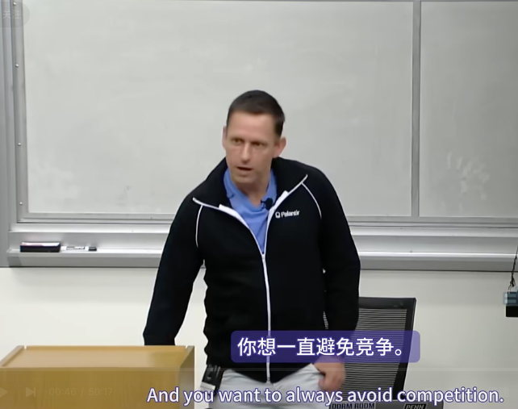

*今天的演讲者是彼得·蒂尔。彼得是 PayPal、Palantir 和 Founders Fund 的创始人，并投资了硅谷的大多数科技公司。他将谈论战略和竞争。谢谢你的到来，彼得。*

太棒了，谢谢。山姆，谢谢你的邀请。谢谢你的款待。

我有点……在商业方面，我有一个我完全痴迷的固定想法，那就是如果你要创办一家公司，如果你是创始人、创业者，你总是想以垄断为目标。你想一直避免竞争。因此，竞争是失败者的。这是我们今天要讨论的事情。

我想首先谈谈当你创办这些公司之一时，你如何创造价值的基本想法。还有一个问题：是什么让企业变得有价值？我想说的是，如果两件事都成立，那么你就拥有一家有价值的公司，这基本上是一个非常简单的公式。第一，它为世界创造了 X 美元的价值。第二，你获得了 X 的 Y%。我认为人们在这种分析中总是忽略的关键一点是，X 和 Y 是完全独立的变量。因此，X 可以非常大。Y 可以非常小。X 可以是中等大小。如果 Y 相当大，你仍然可以拥有一家非常大的企业。因此，要创建一家有价值的公司，你基本上必须既创造有价值的东西，又能获得你所创造价值的一部分。

为了说明这一点，举个例子，如果你将美国航空业与谷歌等搜索公司进行比较，如果你按这些行业的规模来衡量，你可以说航空公司仍然比搜索更重要。如果你只是按收入来衡量，2000年至2012年国内收入为1950亿美元。谷歌的市值刚刚超过 500 亿美元。因此，当然，从直觉上讲，如果你可以选择，是放弃所有航空旅行，还是放弃使用搜索引擎的能力，直觉会认为航空旅行比搜索更重要。当然，这只是国内数据。如果从全球来看，航空公司比搜索或谷歌大得多。但利润率要低得多。2012 年他们的利润微薄。我认为，在整个航空业 100 年的历史中，美国累计利润几乎为零。公司赚钱，偶尔破产，重新注资，然后循环往复。这反映在航空业的总市值上，美国航空业的市值可能只有谷歌的四分之一。所以你有一个搜索引擎，比航空旅行小得多，但价值更高。我认为这反映了对 X 和 Y 的非常不同的估值。

所以，如果我们看看完全竞争，完全竞争的世界有一些优点和缺点。从高层次上讲，这总是你在经济学 101 中学习的内容。它总是很容易建模，我认为这就是经济学教授喜欢谈论完全竞争的原因。它在某种程度上是有效的，特别是在一个事物静止的世界里，因为所有的消费者剩余都被每个人所占有。从政治上讲，我们被告知在我们的社会里这是好事，你想要有竞争，这在某种程度上是一件好事。当然，也有很多负面因素。如果你参与任何竞争激烈的事情，它通常就没那么好了，因为你往往赚不到钱。稍后我会再谈这个问题。

所以我认为，一方面，你拥有完全竞争的行业。另一方面，你拥有的东西我认为是垄断。而且它们是更稳定、更长期的业务。你拥有更多资本。如果你因发明新东西而获得创造性垄断，我认为这是创造了真正有价值的东西的征兆。所以，我确实认为，我经常表达的那种极端二元世界观是，这个世界上只有两种企业。有些企业是完全竞争的，有些企业是垄断的。令人震惊的是，介于两者之间的企业很少。这种二分法不太为人所理解，因为人们总是谎报他们所从事的业务的性质。这就是为什么，在我看来，这是最重要的，虽然不一定是商业中最重要的事情，但我认为这是人们不理解的最重要的商业理念，即只有这两种类型的企业。

那么让我来谈谈人们所说的谎言。所以，基本上，如果你想象一下，从完全竞争到垄断，公司之间的明显差异很小，因为垄断者假装没有。他们基本上会说，这是因为你不想受到政府的监管，你不想让政府追究你，所以你永远不会说你有垄断。所以任何拥有垄断权的人都会假装他们处于令人难以置信的竞争中。另一方面，如果你的竞争非常激烈，而且你从事的行业永远赚不到钱，你就会忍不住撒一个相反的谎，说你正在做一些独特的事情，这种事情的竞争力似乎没有表面上那么强，因为你希望与众不同，希望吸引资本，或者诸如此类的事情。因此，如果垄断者假装没有垄断，非垄断者假装有垄断，表面上的差别很小，而我认为，真正的差别实际上很大。因此，这种扭曲是由于人们对他们的业务撒谎而发生的，这些谎言的方向有些相反。

让我进一步深入研究这些谎言是如何运作的。所以，作为非垄断者，你说的基本谎言是我们处于一个非常小的市场。作为垄断者，你说的基本谎言是你所处的市场比表面上要大得多。因此，通常，如果你想从集合论的角度来思考这个问题，你可以说垄断者在撒谎，你把你的业务描述为这些截然不同的市场的联合，而非垄断者则将其描述为交叉点。因此，实际上，如果你是一个非垄断者，你会在修辞上将你的市场描述为超级小，你是这个市场中唯一的人。如果你有垄断，你会把它描述为超级大，而且竞争非常激烈。以下是一些实践中的例子。

所以我总是用餐馆作为糟糕企业的例子。这一直是我的想法。资本主义和竞争是反义词。积累资本的人，一个完全竞争的世界，是一个所有资本都被竞争殆尽的世界。

所以你开了一个餐馆。没有人愿意投资，因为你只会赔钱。所以你必须讲述一些独特的故事，你会说，我们是帕洛阿尔托唯一一家英国餐厅。所以它是英国的帕洛阿尔托，当然这个市场太小了，因为人们可以一路开车到山景城甚至门洛帕克。而且可能没有人只吃英国食物，至少没有活着的人。所以这是一个虚构的狭窄市场。

这有点像好莱坞的版本，电影的宣传方式总是，好吧，就像一个大学橄榄球明星，加入一个精英黑客团体去捕捉杀死他朋友的鲨鱼。对不起。所以，现在这是一部尚未制作的电影。但问题是，这是正确的类别吗？或者正确的类别，它只是另一部电影？在这种情况下，有很多这样的电影。竞争非常激烈，赚钱非常困难。没有人在好莱坞拍电影赚钱。这真的非常非常困难。

所以你总是会有这样的疑问，交集是真实的吗？有意义吗？有价值吗？应该问这个问题。当然，也有类似创业公司的做法，以及一些非常糟糕的做法，你只需要一系列流行语，共享移动社交应用，将它们组合起来，你就有了某种叙事。而这是否是真正的生意，通常是一个不好的迹象。所以这几乎是这种模式识别。当你有这种交叉的修辞时，它通常不起作用。某处的东西实际上大多只是无处可去的东西。它就像北达科他州的斯坦福。独一无二，但不是斯坦福。

那么让我们看看相反的情况。相反的谎言是，如果你是一家位于这条街上的搜索公司，拥有大约66%的市场份额，并且在搜索市场占据主导地位，谷歌现在几乎从不将自己描述为搜索引擎。相反，它用各种不同的方式来描述自己。所以它有时会说它是一家广告公司。所以如果是搜索，你会说，哇，它有这么大的市场份额。这真的太疯狂了。这就像一个令人难以置信的垄断。这比微软在90年代的垄断要强大得多。也许这就是它赚这么多钱的原因。

但如果你说这是一个广告市场，你可以说，搜索广告是170亿美元，这是在线广告的一部分，规模要大得多。然后，美国所有的广告都更大。然后，当你谈到全球广告时，它接近5000亿美元。所以你说的是百分之三点五。所以这只是这个大得多的市场的一小部分。或者，如果你不想让它成为一家广告公司，你总是可以说你是一家科技公司。所以，技术市场是一个万亿美元的市场。你提到的谷歌在科技市场上的情况是，我们正在用自动驾驶汽车与所有汽车公司竞争；在电视和iPhone上与苹果竞争；在社交媒体上与Facebook竞争；在办公产品上与微软竞争；在云服务上与亚马逊竞争。因此，我们处在这个巨大的技术市场中，无论你看向何处，竞争都无处不在。

不，我们不是政府想要的垄断者，我们不应该受到任何形式的监管。所以我认为人们必须始终非常清楚，存在着非常强大的动机来以这种或那种方式扭曲这些市场的性质。

因此，科技行业市场狭窄的证据是，如果你基本上只是……如果你看看一些大型科技公司，苹果、谷歌、微软、亚马逊，他们年复一年地积累现金，而且利润率非常高。我想说，美国科技行业在财务上如此成功的原因之一是它容易创造所有这些垄断式的企业。这反映在这些公司积累了如此多的现金，以至于他们甚至不知道在某个点之后该怎么处理这些现金。

那么让我来谈谈如何建立垄断。我认为垄断这个话题中出现的一种非常违反直觉的想法是，你想追逐小市场。如果你是一家初创公司，你想垄断。如果你正在创办一家新公司，你想垄断。垄断就是你拥有很大的市场份额。你如何获得很大的市场份额？你从一个非常小的市场开始，然后接管整个市场。然后随着时间的推移，你会找到以同心圆的方式扩大这个市场的方法。而一个永远是大错误的是第一天就追逐一个巨大的市场，因为这通常表明你没有正确定义类别，这通常意味着无论如何都会有太多的竞争。

所以我认为硅谷几乎所有成功的公司都有某种从小市场开始并不断扩张的模式。以亚马逊为例，它一开始只是一家书店。我们拥有世界上所有的书籍。因此，当它在90年代成立时，它是一家比世界上任何其他书店都更好的书店。它是在线的，你可以做以前做不到的事情。然后你逐渐扩展到各种不同形式的电子商务和其他领域。eBay，你从Pez糖果机开始，你转向Beanie Babies，最终，它变成了各种不同商品的各种拍卖。而且，这些公司中许多公司非常违反直觉的是，它们通常从非常小的市场开始，以至于人们认为，当你刚开始时，它们根本没有价值。PayPal的版本是从eBay上的超级卖家开始的，大约有20,000人。当我们在1999年12月、2000年1月首次看到这种情况时，也就是我们推出后不久，我们就觉得，这些都是很小的市场。这太糟糕了。我们认为这些客户很糟糕。他们只是在互联网上卖垃圾的人。我们为什么要追逐这个市场？但是，有一种方法可以得到一种对市场上每个人都更好的产品。我们在两三个月内就达到了25%到30%的市场渗透率。你得到了一些上门服务，获得了品牌知名度，你能够从那里建立业务。

所以，**我一直认为这些非常小的市场被低估了**。我总是给出的Facebook版本是，Facebook的最初市场是哈佛大学的1万人。它在十天内从零发展到60%的市场份额。这是一个非常吉利的开始。商学院对此的分析方式总是，这太荒谬了。这是一个如此小的市场，根本不可能有任何价值。所以我认为商学院对早期Facebook、早期PayPal或早期eBay的分析是，这些市场可能太小，几乎没有价值。如果它们一直保持小规模，它们的价值就会很小，但事实证明，有办法让它们同心协力地发展。这就是它们如此有价值的原因。

现在我认为，相反的情况总是你拥有超大的市场。而且，我认为，过去十年里，所有清洁技术公司都出了太多、太多不同的问题。但是，几乎所有公司都有一个主题，那就是它们都是从巨大的市场开始的。2005年至2008年，也就是硅谷的清洁技术泡沫时期，人们看到的每一个清洁技术PowerPoint演示文稿都是从能源市场开始的。我们处于一个价值数千亿或数万亿美元的市场。然后，一旦你成为浩瀚大海中的一条小鱼，那不是一个好地方。这意味着你有大量竞争对手，你甚至不知道所有的竞争对手是谁。

所以，你想成为一家独一无二的公司，成为小生态系统中唯一的一家。你不想成为第四家在线宠物食品公司。你不想成为第十家薄膜太阳能电池板公司。你不想成为帕洛阿尔托的第一百家餐馆。你的餐饮业是一个万亿美元的产业。因此，如果你进行市场规模分析，就会得出这样的结论：餐厅是一个值得涉足的好行业。而且，大型市场、大型现有市场通常意味着你面临大量竞争，很难区分。因此，第一个非常违反直觉的想法是追逐小市场，通常这些市场非常小，人们甚至不会注意到它们。他们认为这没有意义。这就是你立足的地方。然后，如果这些市场能够扩大，你就可以将其扩大为大型垄断企业。

第二，我喜欢关注这些垄断企业的几种不同特征。可能没有单一的公式。我一直认为，在技术领域，总有一种感觉，技术的历史就是这样，每个时刻都只会发生一次。所以，下一个马克·扎克伯格不会建立社交网络。下一个拉里·佩奇不会建立搜索引擎。下一个比尔·盖茨不会建立操作系统。如果你只是模仿这些人，你就没有真正向他们学习。

总是有一些非常独特的企业在做一些以前没有做过的事情，最终有可能成为垄断企业。如果《安娜卡列尼娜》的开场白是“所有幸福的家庭都是相似的，所有不幸的家庭都有各自的不幸”，那么在商业领域，情况正好相反。我认为所有成功的公司都是不同的，因为他们在做一些非常独特的事情。而所有失败的公司都是相似的，因为他们无法摆脱竞争的本质相同性。

因此，垄断技术公司的一个特征是某种专有技术。我的经验法则有点疯狂，也有点武断，那就是你需要一种比下一个最好的技术好一个数量级的技术。比如，亚马逊的书籍数量是它的竞争对手的十倍多。这可能不是高科技，但你找到了一种以高效的方式在线销售十倍书籍的方法。PayPal的替代方案是使用支票在eBay上汇款，这需要七到十天才能完成，而PayPal可以快十倍以上。因此，你希望在某些方面有某种非常、非常强大的改进，也许是某个关键维度上的数量级改进。当然，如果你真的想出了一个全新的东西，那就是无限的改进。

所以我想说，iPhone是第一款可行的智能手机。这可能不是无限的改进，但肯定是一个数量级或更多的改进。因此，我认为，这项技术旨在让你比下一个最好的东西有巨大的增量。我认为，网络效应往往能够发挥作用，真正起到帮助作用。随着时间的推移，这些会导致垄断。网络效应最棘手的地方在于，它们通常很难开始。因此，尽管每个人都知道它们的价值，但总是有一个非常棘手的问题：为什么它对第一个做某事的人来说有价值？

规模经济，如果你有的东西固定成本很高，边际成本很低，这通常是垄断性质的业务。然后，还有品牌，这有点像是人们脑海中根深蒂固的想法。我从来不太明白品牌是如何运作的，所以我从不投资那些只注重品牌的公司。但我认为，这是一种创造真正价值的真实现象。

我认为其中一件事，我将在最后稍微回顾一下，但其中一件非常引人注目的事情是，软件企业往往由于某种原因在某些方面非常擅长。它们尤其擅长规模经济，因为软件的边际成本为零。因此，如果你在软件中得到一些有用的东西，它通常比现有的解决方案要好得多。然后你就有了这些巨大的规模经济，你可以相当快地扩大规模。因此，即使市场起步很小，你也可以快速发展你的业务，以保持与不断增长的市场相同的规模，并保持垄断权力。现在，这些垄断的关键在于，仅仅拥有片刻的垄断是不够的。关键是要拥有一种能持续一段时间的垄断。因此，硅谷总是有这样一种想法，你想成为先行者。而我一直认为，在某种程度上，更好的框架是你想成为最后一个行动者。你想成为某个类别中的最后一家公司，这才是真正有价值的。

微软是最后一个操作系统，至少在几十年内都是如此。谷歌是最后一个搜索引擎。如果 Facebook 成为最后一个社交网站，那么它的价值将非常可观。考虑这一“最后推动者”价值的一种方式是，这些公司的大部分价值都存在于遥远的未来。如果你对一家企业进行折现现金流分析，你会看到，你拥有所有这些利润流。你有一个增长率，增长率远高于折现率。因此，大部分价值都存在于遥远的未来。

我在 2001 年 3 月在 PayPal 做过这个练习。我们经营了大约 27 个月。我们的年增长率为 100%。我们将未来现金流折现了约 30%。结果发现，截至 2001 年，该企业价值的四分之三来自 2011 年及以后的现金流。无论何时，只要你对这些科技公司进行计算，你就会得到类似的答案。因此，如果你试图分析硅谷的任何一家科技公司，Airbnb、Twitter、Facebook、任何新兴互联网公司，以及 Y Combinator 中的所有公司，数学告诉你，四分之三、80%、85% 的价值来自 2024 年及以后的现金流。这是非常非常遥远的未来。

因此，我们在硅谷总是高估增长率。我们低估了持久性。因为增长是你可以在当下衡量的东西。而且你总是可以非常准确地跟踪它。一家公司是否还会在十年后存在的问题，实际上是价值方程的主导因素。这是一种更加定性的事情。因此，如果我们回到垄断、专有技术、网络效应、规模经济等特征的想法，你可以将这些特征视为在你占领市场并接管它时存在的特征。但你也想考虑一下，这些事情会持续下去吗？所以所有这些特征都有一个时间维度。

因此，网络效应通常具有很大的时间元素，随着网络规模的扩大，网络效应实际上会变得更加强大。因此，如果你有一个网络效应业务，它通常会随着时间的推移成为更大、更强大的垄断企业。专有技术总是有点棘手。所以你想要的东西要比当今世界上最先进的技术好几个数量级。这就是你吸引人们注意力的方式。这就是你最初突破的方式。但你不想被别人取代。因此，在所有这些创新领域，都有巨大的创新，但没有人赚到钱。20世纪80年代的磁盘驱动器制造业，你可以做得更好，制造出比其他任何人都更好的磁盘驱动器，你可以接管整个世界。然而，两年后，就会有人出现并取代你。在这15年的时间里，磁盘驱动器得到了极大的改进，这对消费者有很大好处，但实际上，这对创办这些公司的人来说并没有帮助。

因此，总是存在这样的问题：在技术上取得巨大突破，但同时也要能够解释为什么你的突破将是最后一个突破，或者至少是很长一段时间内的最后一个突破。或者你会取得突破吗？然后，你可以以足够快的速度不断改进，以至于没有人能赶上。因此，如果你有一个未来的结构，其中有很多创新，其他人会在你正在研究的东西中想出新的东西，这对社会来说是件好事。通常，这对你的企业来说并不是那么好。

然后是我们已经讨论过的规模经济。所以，我认为，无论如何，我认为这个最后的推动者是非常关键的。我总是很想这么做，我不想过分使用国际象棋的类比，但是，国际象棋中的先手是下白棋的人。白棋有三分之一的兵优势。因此，先手有一点优势。你想成为赢得比赛的最后行动者。因此，卡帕布兰卡世界冠军、国际象棋冠军卡帕布兰卡总是有自己的一套路。你必须从研究残局开始。

我确实认为，我不会说这是你应该研究的唯一东西。我认为从这种角度来思考这些问题，为什么这家公司在10、15、20年后仍会是领先的公司，这是一个非常关键的问题。让我从垄断与竞争的理念的角度稍微转向两个方向。我认为，这是我心中关于商业、创业和思考的核心思想。我认为它提供了一些非常有趣的观点，从整体上讲，从整个技术和科学创新的历史讲。

因为，我们已经经历了250到300年的令人难以置信的技术进步，在许多不同的领域。从蒸汽机到铁路到电话、制冷、家用电器、计算机革命、航空，各种不同的技术创新领域。然后，人们可以说科学也有类似的事情，我们经历了几个世纪的大量科学创新。我认为人们在思考这些事情时总是忽略的一点是，因为X和Y是独立变量，其中一些可能是非常有价值的创新，但发明它们的人、提出它们的人却没有因此而得到回报。当然，如果你回过头来看，你需要创造X美元的价值，你就能获得X的Y百分比。我认为，科学史通常是Y为0%的历史。科学家从来没有赚到钱。他们总是自欺欺人地认为自己生活在一个公正的世界，他们的工作和发明会得到回报。这或许是我们社会中科学家容易遭受的根本性错觉。即使在技术领域，也有许多不同的技术领域，它们都有伟大的创新，为社会创造了巨大的价值，但人们实际上并没有获得那么多的价值。所以我认为，从人们实际获得的价值来看，整个科学技术的历史都是可以讲述的。当然，也有一些领域人们什么也没得到。

所以你是20世纪最聪明的物理学家。你提出了狭义相对论。你提出了广义相对论。你不会成为亿万富翁。你甚至不会成为百万富翁。事情就是不按常理出牌。铁路非常有价值。他们中的大多数只是因为竞争太激烈而破产了。莱特兄弟驾驶了第一架飞机，却没有赚到钱。所以我认为这些行业有一种非常重要的结构。我认为成功案例实际上非常罕见。所以实际上，当你真正思考这250年的历史时，y几乎总是0%。科学领域永远是0%。几乎总是在技术领域。所以人们很少能赚钱。

18世纪末19世纪初，第一次工业革命是纺织厂。你有蒸汽机。你实现了自动化。你有这些不懈的改进。人们每年、年复一年、十年复十年地提高纺织厂和制造业的效率，速度为5%到7%。从1780年到1850年，英国经历了60到70年的巨大进步。但即使在1850年，英国的大部分财富仍然掌握在土地贵族手中。工人没有，工人赚的钱没有那么多。资本家也没有赚到那么多。一切都被竞争夺走了。有数百人经营纺织厂。这是一个竞争结构阻止人们赚钱的行业。

所以我认为，在过去250年的整个历史中，人们真正想出新事物并从中赚钱的可能只有两大类。一种是这种垂直整合的复杂垄断，人们在19世纪末和20世纪初的第二次工业革命中建立了这种垄断。这就像福特。这是像标准石油这样的垂直整合石油公司。这些垂直整合的垄断通常需要非常复杂的协调。你需要把很多零件以正确的方式组装在一起。当你组装好它时，你就有巨大的优势。实际上，今天这样做的人数少得惊人。所以我认为这是一种商业形式，当人们能够成功时，它非常有价值。它通常相当资本密集。我们生活在这样一种文化中，很难让人们购买任何非常复杂且需要很长时间才能构建的东西。当我想到我的同事埃隆·马斯克（PayPal 创始人）与特斯拉和 SpaceX 的成功时，我认为这些公司的关键在于它们拥有复杂的垂直整合垄断结构。

如果你看看特斯拉或 SpaceX，你会问，他们是否有过一次突破？他们肯定在很多方面都进行了创新。我不认为他们在电池存储方面有过一次 10 倍的突破，或者可能在火箭方面也做过一些事情，但没有一次重大的突破。但真正令人印象深刻的是将所有这些部分整合在一起，并以比大多数竞争对手更垂直整合的方式进行。

所以特斯拉，你还整合了汽车经销商，这样他们就不会像美国其他汽车行业那样窃取所有的钱。或者 SpaceX，你基本上拉拢了所有的分包商，而大多数大型航空航天公司都有单一来源的分包商，这些分包商能够收取垄断利润，使综合航空航天公司很难赚钱。因此，我认为垂直整合是一种未被充分开发的技术进步模式，人们应该多加关注。

然后我认为软件本身就非常非常强大。软件具有令人难以置信的规模经济和低边际成本。与原子世界相比，比特世界往往可以非常快速地被采用。快速采用对于占领和占领市场至关重要。因为即使你的市场很小，如果采用率太慢，其他人也有足够的时间进入该市场与你竞争。而如果你有一个中小型市场，并且采用率很快，你就无法占领这个市场。所以我认为这就是硅谷如此成功的原因之一，也是软件成为如此非凡的行业的原因。

我想说的是，人们对某些事情有效和某些事情无效给出了不同的解释。我认为这些解释总是掩盖了创造 X 美元价值和获取 X 的 Y% 的问题。所以我们总是被告知，科学的合理化是科学家对赚钱不感兴趣。他们这样做是出于慈善原因，如果你受金钱驱使，你就不是一个好科学家。我甚至不是说人们应该总是受金钱或类似的东西驱使。但我认为我们应该对这种合理化进行更严厉的批评。我们应该问，这是一种掩盖 Y 等于 0% 的事实的合理化，科学家们在这样一个世界中工作，在这个世界中，所有的创新都被有效地竞争所取代，他们无法直接获取任何创新。

然后经常发生的软件扭曲是因为人们在软件上赚了这么多钱，我们推断这是世界上最有价值的事情。所以如果 Twitter 的人赚了数十亿美元，那一定意味着 Twitter 的价值远远超过爱因斯坦所做的一切。这种合理化往往会掩盖 X 和 Y 是独立变量，有些企业可以捕获大量 X，而有些企业则不能。所以我认为，创新的历史实际上就是微观经济学的历史，这些行业的结构在其中起到了非常重要的作用。有一个故事讲到，有些人因为身处结构正确的行业而赚取了巨额财富，而另一些人则一无所获，因为他们所处的行业竞争非常激烈。

我们不应该仅仅这样合理化。我认为有必要更好地理解这一点。最后，让我回到本次演讲的主题，即“竞争是失败者的竞争”。这个说法总是极具挑衅性，因为我们通常认为失败者是不擅长竞争的人。我们认为失败者是高中田径队中成绩较慢的人，或者是在标准化考试中成绩较差且无法进入理想学校的人。所以我们总是认为失败者是无法竞争的人。

我希望我们能够真正重新思考和重新评估这一点，并考虑竞争本身是否可能已经消失。这不仅仅是我们在理智上不理解这种垄断与竞争的二分法。我一直在谈论为什么你不会在理智上理解它，因为人们对此撒谎，它被扭曲了。我们有所有这些……创新的历史以各种非常奇怪的方式合理化了所发生的事情。但我认为这不仅仅是一个智力盲点，我认为这也是一个心理盲点。我们发现自己非常被某种形式的竞争所吸引。如果其他人做某事，我们会感到安心。

在莎士比亚时代，“猿”这个词就已经意味着灵长类动物和模仿。而人类的天性中有一些深深的模仿、猿类、绵羊、旅鼠、群居的特质。这正是我们需要始终思考并努力克服的非常棘手的问题。人们总是会问，竞争是一种验证形式，我们追求很多其他人追求的东西。这并不意味着群体智慧。并不是说当很多人试图做某件事时，这证明它有价值。我认为，当很多人试图做某件事时，这往往证明它是疯狂的。

每年有2万人搬到洛杉矶想成为电影明星，其中大约有20人成功。我认为奥运会要好一点，因为你可以很快地判断出你是好还是不好。所以对社会来说，无谓损失要小一点。在斯坦福之前的教育经历，总是有一种非竞争性的特征，我认为这个房间里的大多数人都带着机关枪，他们与拿着弓箭的人竞争。所以当你上初中和高中时，这并不是一场平行的比赛。总是有一个问题，随着你继续前进，比赛是否有意义？

因此，如果人们继续读研究生或博士后，总是存在这样的问题：竞争的激烈程度是否真的有意义？亨利·基辛格曾有一句经典的台词来描述他在哈佛的同事，他说，战斗之所以如此激烈，是因为赌注太小了，这有点像学术界。你会觉得，在某种程度上，这是对疯狂的描述。为什么人们会在赌注如此之小的情况下疯狂地争斗？但我认为这也只是情况逻辑的一个功能。当你很难将自己与他人区分开来时，当客观差异真的很小的时候，你就必须激烈地竞争，以保持这样或那样的差异，而这种差异往往更多的是想象的，而不是真实的。

我总是有这样一种个人版本，当时我有点过度兴奋。在我八年级的初中年鉴里，我的一个朋友写道：“我知道你四年后作为二年级学生会考上斯坦福大学。”四年后，高中毕业后，我进入了斯坦福大学。我去了斯坦福法学院。我最终进入了纽约一家大型律师事务所，从外面看，每个人都想加入。从里面看，每个人都想离开。而你却不得不离开，这是一种非常奇怪的动态。在我意识到这可能不是最好的主意之后，我在七个月零三天后离开了。走廊尽头的一个人告诉我：“看到你离开，彼得，我真的很放心。我不知道有可能逃离恶魔岛。当然，你只需要走出前门，不要再回来。”

但是，人们的身份认同中，有太多人被这些竞争所吸引，以至于他们不知何故忘记了什么是重要的，什么是有价值的。竞争确实会让你在你所竞争的任何事情上变得更好。因为当你竞争时，你会将自己与周围的人进行比较。你在想：“我该如何打败我身边的人？我怎样才能在他们所做的事情上做得更好？”而你会做得更好。我没有质疑这一点。我没有否认这一点。但它往往以巨大的代价而来，你不再问一些关于什么才是真正重要和真正有价值的大问题。

**所以我想说，不要总是穿过每个人都想冲过去的小门。也许绕过拐角，穿过没有人走的大门。**

非常感谢。人们想回答几个问题。我们还有几分钟时间。

*因为，正如你之前提到的，垄断和完全竞争往往看起来很相似，因为人们讲述的故事是我们自己讲述的故事。当你在看一个想法或评估自己的想法时，你有什么方法可以轻松确定差异吗？*

我想说我一直试图关注的问题是实际市场是什么。所以，问题不在于市场的叙述是什么，因为你不能总是虚构一个比它大很多或小很多的市场。但真正的客观市场是什么？所以，你总是试图弄清楚，然后你意识到人们有动机去强烈扭曲这些东西。

那么，当你说它通常像谷歌和 Excel 时，你提到的垄断的哪个方面？他们与广告网络有网络效应。他们拥有专有技术，这让他们获得了最初的领先地位，因为他们拥有页面排名算法，这比任何其他搜索引擎都要好一个数量级。由于需要存储所有这些不同的网站，所以你有规模经济，此时你有品牌。所以谷歌拥有这四个。也许在这一点上专有技术有些薄弱，但它肯定拥有这四个，现在可能拥有四个中的三个半。

这如何适用于志愿者？第二，它是什么样的？第二是什么？iPhone 是怎么回事？哦，那是一些在手机上模仿不同支付系统的公司。有 Square，有 PayPal。它们只是形状不同。这就是它们与众不同的地方。一个是三角形，一个是正方形。所以，也许在某个时候，猿猴会用尽所有形状或类似的东西。但我认为，不，Palantir，我们一开始关注的是情报界，这是一个很小的子市场。你有一项专有技术，它采用了一种非常非常不同的方法，它专注于人机合成而不是替代，我认为这是主导范式。所以，我想说，市场方法和专有技术有一系列的东西。

*我们有设计思维方法和精益创业思维，它们用于通过不创造人们不想要的东西来降低风险。但年轻的创新者如何才能有灵感创造出经久不衰的复杂系统呢？*

是的，所以问题是，我如何看待精益创业、迭代思维，从人们那里获得反馈，而不是可能行不通的复杂性。

因此，我个人对所有精益创业方法都持怀疑态度。我认为真正优秀的公司做了一些更大规模的改进，真正使他们与众不同。他们通常不会进行大规模的客户调查。经营这些公司的人有时并不总是患有阿斯伯格综合症，所以他们实际上并没有受到太大的影响，也不会轻易被其他人的想法或告诉他们要做的事情所吓倒。因此，我确实认为我们过于专注于迭代作为一种模式，而没有足够努力与公众建立虚拟 ESP 链接并自己解决问题。

我想说，让我想想，我认为风险问题总是非常棘手，因为我认为通常情况下你没有足够的时间来真正降低风险。如果你要花足够的时间去弄清楚人们想要什么，到那时你往往已经错过了机会。当然，总是存在做一些不那么重要或有意义的事情的风险。所以，从某种角度来看，你可以说法学院的轨道是一条低风险的轨道。从某种意义上说，它仍然可能是一个高风险的轨道，因为你可能有很大的风险不会在生活中做一些有意义的事情。所以我们必须以非常复杂的方式来思考风险。我认为风险是一个非常复杂的概念。

*所以你从后发优势开始，但这是否意味着在棋子上、在棋盘上已经有了竞争？*

总是有这个术语问题。所以我想说，有些类别中的人是捆绑在一起的。我想说，垄断企业实际上在某种意义上确实是先发制人。你可以说谷歌不是第一个搜索引擎。之前还有其他搜索引擎。从某个方面来说，它们比其他搜索引擎要好得多。因此，它们是第一个使用网页排名和自动化方法的搜索引擎。

Facebook并不是第一个社交网站。我的朋友Reid Hoffman在1997年创建了一个社交网站。他们称之为SocialNet，因此在Facebook成立七年前，他们就已经在公司名称中使用了“社交网络”这个名称。他们的想法是，这将是一个虚拟的网络空间，在这里，我是狗，你是猫。在这个虚拟的替代现实中，我们将制定各种不同的规则，规定我们如何相互交流。

Facebook是第一个获得真实身份的网站。因此，我希望Facebook将成为最后一个社交网站。在一个非常重要的方面，它是第一个。人们通常不会认为它是第一个，因为他们会把所有这些东西混为一谈。

*还有一个问题。我们先来回答一个问题。如果你是大学毕业后在高盛工作，六个月后离开，现在在斯坦福大学学习计算机科学的人，你会建议如何重新思考这种竞争游戏？*

我不擅长心理治疗，所以我不太清楚如何解决这个问题。他们对上商学院的人做过一些非常奇怪的研究。哈佛商学院做过一项研究，研究的是反阿斯伯格性格。我们有一些非常外向的人，通常信念不坚定，想法很少。你有一个温室环境。你把所有这些人都放进去两年。最后，他们系统地、最大的群体系统地做错了事。他们试图赶上最后一波浪潮。1989年，哈佛大学的每个人都想为迈克·米尔肯工作。一两年后，他因为垃圾债券的事情入狱。除了1999年和2000年，他们对硅谷或科技不感兴趣，当时他们恰好预测到了互联网泡沫的顶峰。他们确实感兴趣，然后，05到07年是房地产、私募股权等。所以，我确实认为，我们将竞争视为认可的这种倾向非常根深蒂固。我不认为有任何简单的心理公式可以避免它。所以我不知道该推荐什么样的治疗方法。

但是，我的第一个出发点，可能只有10%，就是永远不要低估这个问题有多大。我们总是认为这是困扰其他人的事情。所以我很容易指出商学院的人、哈佛大学的人或华尔街的人。我认为它确实对我们所有人都产生了深远的影响。我们总是认为广告是能对别人起作用的东西。这些愚蠢的人怎么会被电视上的广告所蒙骗呢？这些广告显然在某种程度上起了作用，而且对我们所有人都起了令人不安的作用，这是我们所有人都应该努力克服的。

非常感谢。
