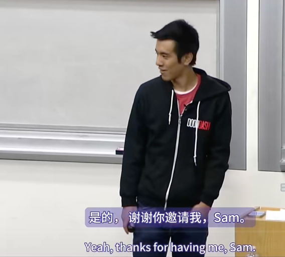

第八讲《How to Get Started, Doing Things that Don't Scale, Press》是由DoorDash联合创始人以及Twich联合创始人等共同主讲。

是的，谢谢你的邀请，Sam。我是Stanley，是DoorDash的创始人。能够来到这里真的很棒，因为其实不久前我才坐在你们的座位上。我是2014届的毕业生，毕业于计算机科学专业，我的联合创始人是Andy。

对于那些不知道DoorDash是什么的人来说，我们正在为当地城市建立一个按需配送网络。我想从几个月前拍的这张照片开始。我想这是我们刚刚完成A轮融资的那个晚上。我在走回住处的时候拍了这张照片。当时我住在校园里的罗布利。我拍这张照片是因为我意识到当时我手里拿着的东西组合得多么荒谬。我手里拿着我的CS 247作业，还有税表，因为当时是四月，我必须填税。还有那张黄色的超速罚单。下面是我刚从红杉资本签下的一份价值1500万美元的文件。这总结了我们这段旅程有多么荒谬。从斯坦福开始，在斯坦福读书期间做这件事，然后将其转变为一家真正的创业公司。今天我想和你们分享这个故事。

实际上，这一切都始于两年前，在一家马卡龙店。那是我在斯坦福读大三的时候，那是秋季学期。当时，我非常热衷于如何为小企业主打造技术。我和Chloe坐下来，她是当时帕洛阿尔托一家马卡龙店的老板，Chantal Guion。我只是采访了她，试图就我们一直在研究的这个产品原型获得反馈，同时也了解了她遇到的一般问题。正是在这次会议上，Chloe第一次提出了这个交付问题。我记得她拿出了一本非常厚的小册子，她给我看了一页又一页的送货单。她不得不拒绝很多订单，因为她根本无法完成这些订单。她没有司机，最后她不得不亲自送货。这对我们来说是一个非常有趣的时刻。

然后，在接下来的几周里，我们又与大约150到200名小企业主进行了交谈。当我们提出送货的想法时，他们一直同意我们的观点，说是的，这对我们来说是一个很大的问题。我们没有送货基础设施，这对我们来说是一个巨大的痛苦。目前没有任何好的解决方案。这让我们怀疑，送货是一件很常见的事情，这是一件很明显的事情。为什么以前没有人解决这个问题？我们肯定在这里遗漏了一些东西。所以我们想，也许是因为人们过去尝试过这个，但他们失败了，因为没有消费者对此的需求。所以我们想，好吧，我们如何测试这个假设？当时我们只是一群大学生。我们没有卡车或配送基础设施，或者类似的东西。我们不能一夜之间就成立一家配送公司。那么我们如何测试我们的这个假设呢？

于是我们决定创建一个简单的餐厅配送实验。我们花了大约一个下午的时间制作了一个非常快速的登陆页面。当我上网时，我找到了一些帕洛阿尔托餐馆的 PDF 菜单，把它贴在那里，然后在底部放了一个电话号码。实际上，那是我们的个人手机号码。就这样，我们放出了登陆页面，并将其命名为 palotadelivery.com。它实际上就是这个样子的，超级简单，甚至有些丑陋。老实说，我们真的没有期待什么。我们刚刚推出它，只是想看看会不会有人打电话来。如果我们接到足够多的电话，那么也许这个送货理念值得追求。

所以我们把它放在那里，真的没有期待什么。当时我们正在开车回家，突然接到了一个电话。有人打电话来，他们想订购泰国菜。我们惊讶地说，哇哦，这是真正的订单。我们必须做点什么。于是我们坐在车里，决定顺便去 Siam Royale 买点泰式炒河粉，然后把它送到这个人的手中。我们想试着了解整个送货过程是如何进行的。然后，我们做到了。我记得我们把食物送到了 Alpine Road 上的这个人的手中。我问他，哦，你是怎么知道我们的？你是做什么的？他告诉我们他是一名学者，然后递给我他的名片，上面写着他是一本名为《Weed the People》的书的作者。

那是我们第一次送货，可以说是你能想到的最好的第一次送货体验，也可能是最差的。我们无法编造这些情节。是的，第二天我们又接到了两个电话，接着是五个，然后是七个，最后变成了十个。很快，我们开始通过&#x20;

paloaltodelivery.com 在校园里获得关注。这真是太疯狂了，因为想想看，这只是一个登陆页面。用户必须查找 PDF 菜单才能下订单，还要打电话。这看起来并不是最专业的网站。然而，人们仍然在不断打电话下订单。那时我们就知道我们成功了。当人们愿意忍受这一切时，我们就知道我们找到了他们想要的需求。

所以，我认为要记住的另一个关键点是，我们在大约一小时内就推出了这个服务。我们没有花钱，也没有任何司机。我们没有任何算法，也没有花钱，没有后端支持。我们也没有花六个月的时间建立一个花哨的调度系统。我们什么都没有。我们刚刚推出。因为一开始，这些都不是必要的，一切都是为了测试你的想法，试图让这个项目起步，并弄清楚这是否是人们想要的东西。一开始把东西拼凑在一起是可以的。

在 YC，我们喜欢谈论的一句口头禅是，**做无法扩展的事情**。所以，一开始，我们是送货司机。我们会去上课，然后下课后去送外卖。我们是客户支持。有时我不得不在上课期间接电话。我们不得不花下午的时间走在大学大道上，分发传单，试图推广 DoorDash。

我们没有任何调度系统，所以我们必须做的是，使用 Square 向所有客户收费，使用 Google Docs 来跟踪我们的订单，使用 Apple 的“查找我的朋友”来跟踪我们所有司机的位置。诸如此类的事情。只是弄清楚是什么，只是拼凑解决方案，试图让这件事开始实施。

事实上，有一次，我们发展得如此之快，以至于 Square 实际上关闭了我们的账户，因为我们被怀疑洗钱。想想吧，我们正快速接到 15 美元、20 美元等小额订单。幸运的是，我的联合创始人托尼在 Square 工作，所以他只是给那里的几个朋友发了一封电子邮件，所有问题都解决了。

做无法扩展的事情的另一件事是，它还可以让您成为业务专家。比如，开车帮助我们了解整个送货过程是如何运作的。我们利用这个机会与我们的客户、我们的餐馆交谈。我们进行了调度，这帮助我们弄清楚了我们如何手动调度每个司机，也帮助我们弄清楚了我们的司机分配算法应该是什么样的。我们自己做客户支持，从客户那里获得实时反馈。

我记得，在我们刚开始的头几个月，我们会手动给我们的每一位新客户发送电子邮件，每天晚上结束时，我们都会问他们，哦，你的第一次送货怎么样？你是怎么听说我们的？我们会对所有这些电子邮件进行个性化设置，比如，如果我看到有人从 Orange Hummus 订购鸡肉串，我会说，哦，我喜欢 Orange Hummus。你的鸡肉串怎么样？你的第一次送货怎么样？这样的反馈真的很有价值，我们的客户非常非常感激。

我记得有一次，这是在 YC 期间，我们刚和我们的一位餐厅合作伙伴开完会，听说大学大道上新开了一家名为 Cream 的冰淇淋店，我们想去试试。然后，突然间，我们办公室的联合创始人给我们发短信说，我们需要司机上路。我们的需求激增。所以我们争论了大概十秒钟，比如，我们是去买冰淇淋，还是去送货？显然，它成功实现了目标，但这也成为了我们扩大规模的动力。比如，如果我们可以扩大规模，那么下次我们就可以去吃冰淇淋了。所以，是的，我认为是这样的。现在，当然，我们已经扩展到不同的城市。现在你必须担心建立自动化解决方案和调度系统，弄清楚如何匹配需求和供应，以及所有那些花哨的技术。但这些在一开始都不重要，因为在一开始，一切都是为了让这件事情起步，并试图找到适合市场的产品。

所以，总结一下，我想说我从 DoorDash 中学到了三件事。首先，测试你的假设。你要把你的创业想法当作实验。第二件事是快速启动。我们在不到一个小时的时间内就推出了一个非常简单的登陆页面。最后，做一些不能扩展的事情是可以的。做一些无法扩展的事情是你刚开始的时候最大的竞争优势之一。一旦有了需求，你就可以想办法扩大规模。而且，也许一旦你扩大了规模，你就可以去买冰淇淋了。谢谢。

*你的第一批客户是如何知道你的？*

是的，所以问题是，我们的第一位客户是如何知道我们的？我们的第一个客户，我不知道。我们刚刚推出了 PoliticalDelivery.com。我们没有做任何营销。所以我猜他一定是在网络浏览器中输入了 Political Delivery。然后，我们几乎没有做任何营销。我想我给我的宿舍发了一封电子邮件，仅此而已。全是通过口口相传。而且，这在某种程度上证实了你发现的需求有多强烈。当人们开始谈论你时，他们愿意忍受所有这些糟糕的用户体验、糟糕的设计，诸如此类。

*当你开始做这件事时，你觉得这很明显，你想知道为什么没有人这样做。现在回想起来，你的答案是什么？*

是的，回想起来，我认为，最重要的事情是移动。事实上，现在每个人的口袋里都有一个这样的设备，我们看到了这种趋势，并且想，如果你能设计一个完全基于移动设备的交付系统会怎么样？在你没有任何设备的地方，你不必拥有任何基础设施或交付车队。相反，你可以不用全职雇佣司机、购买车辆，如果你可以利用一个更多的按需独立承包商池，并且只在他们有时间时向他们发送订单，会怎么样？所以，这就是我们所拥有的洞察力。一切都是通过移动设备完成的。

*你知道我们要成为一家初创公司吗，还是我们只是从同一个人身上赚钱？*

是的，当时我们只是想，我们都非常热衷于为小企业主打造技术。老实说，这项配送服务源自一项实验，对吧，就是登陆页面。它真的是一个实验。我们没有期待任何东西，它就这么启动了，我们跟着它一起做。物流也一直是我们真正热衷的事情。比如物流、运输，它是完美的融合，你如何通过配送帮助小企业主？是的。

*你是先推出移动应用程序，还是先推出网站？从有想法到首次发布花了多长时间？*

我们就是在这个着陆页上开始的。我们花了一个小时才发布。

*DoorDash 如何在与 Block、Postmates、Seamless 和其他公司共同构建的领域中脱颖而出？*

问题是，DoorDash 如何在竞争激烈的领域中脱颖而出？

一开始，对我们来说，消费者需求从来都不是问题，直到现在。所以，对我们来说，这只是找到需求，然后专注于满足这种需求。所以，在刚开始时，竞争并不重要。是的，问题是当我们通过 YC 时，我们花了多长时间才成立一家公司。所以我们在 2013 年 1 月成立，然后我们在那个夏天做了 YC，当我们决定通过 YC 实现这个想法时，我们就成立了公司。

*除了送餐之外，您下一步计划做什么，或者您打算将这项业务拓展到哪里？*

是的，问题是，除了食品配送，我们计划在哪里发展？对于我们来说，当我们创办 DoorDash 时，就像我说的，我们一直在帮助小企业主，并弄清楚如何为任何当地商家提供服务，无论您是马卡龙店、餐厅还是家具店。这仍然是我们的重点。这就是长期愿景。目前，我们只是专注于餐厅配送，以此来扩大规模。但最终，这就是我们想要达到的目标。

很酷。谢谢。

*Sam Altman:好的，接下来是 Teespring 的 Walker Williams。Teespring 一年半前通过了 YC？我差点拒绝了他们，因为我认为这听起来像是一个愚蠢的想法，但现在他们每年的收入达到数亿美元，所以非常幸运的是我没有拒绝。沃克还将谈论如何按规模做事。*

好的。感谢大家邀请我。我叫沃克。我是 Teespring 的首席执行官兼创始人。对于那些不知道 Teespring 是什么的人来说，我们是一个电子商务平台，允许企业家推出产品和服装品牌，而无需承担风险、成本或妥协。如今，公司大约有 180 名员工，我们每天运送数万件产品。我想和你们谈谈作为一家初创公司，你们拥有的最基本优势之一，那就是你可以做那些无法扩展的事情。我将无法扩展的事情定义为从根本上不可持续的事情。它们不会持续下去，也不会带来第100万名用户。而它们失败的地方通常是时间，但也可能是因为其他一些原因。但真正的增长策略不会让你拥有100万名用户。

今天我想重点讨论三个方面。第一个是找到你的第一批用户。第二个是将这些用户变成忠实用户。第三个是找到你的产品和市场契合点，也就是找到你的第一批用户。

首先，你必须明白，用户获取没有灵丹妙药。每个人，包括我，在我们刚开始的时候，都在寻找那个梦想的解决方案，那个具有巨大投资回报率的按点击付费广告，一些加速的合作伙伴关系将把你推向平流层，一个联盟协议，一些能帮你解决问题的东西。但现实是，对于绝大多数公司来说，事实上，对于我有机会与首席执行官交谈的每一家公司来说，这是不可能的。这些都是独角兽。大多数从外部看起来拥有这种梦幻增长曲线的公司，事实上，那些第一批用户难以获得。

让我给你讲一个极其不可持续的企业的故事。这是2012年的Teespring。当我们第一次获得、第一次推出时，业务看起来再糟糕不过了。花了好几天的时间开会。我们不得不提供免费设计，经过几天的反复修改。我们必须自己推出产品，我们必须做社交媒体。所有这些都是为了向当地非营利组织销售50件衬衫并创造1000美元的收入。任何旁观者都会说，你们应该放弃了，这是一个糟糕的想法。但随着时间的推移，这些用户开始增加。

我认为你必须明白的是，当你第一次创办一家公司时，仅仅因为它是一个新产品，你就不擅长销售它，你根本不知道客户的痛点到底是什么。你以前从未卖过它，你没有任何成功案例或推荐。那些第一批用户总是最难的。**因此，作为创始人，你有责任尽一切努力吸引第一批用户。**

每家公司的情况都不一样。我听到的共同点是创始人需要花费个人时间和精力，大量的个人时间和精力，来吸引这些用户。它可以意味着很多事情，从每天发送100封电子邮件，打电话，尽可能多地打电话给人们，通过网络，如果你有一个像斯坦福或Y Combinator这样的网络。你可以做任何事情来获得第一个用户。我真的把它比作把一块巨石推上山。如果你想象一个非常平滑的山坡，当你开始时，斜坡是最陡的，最初的几英寸是最难的。随着时间的推移，随着你走得越来越远，斜坡逐渐稳定，变得更容易。希望最终你能到达山顶，巨石开始自己滚动。因&#x6B64;**，对于那些第一批用户，你不能只关注时间意义上的投资回报率。不要指望花一个小时就能赚到几千美元。**&#x4E5F;许斯坦利就是其中一只独角兽，这是一个相当不可思议的故事。但对于我们大多数人来说，那些第一批用户需要大量的指导和个人关爱。这没关系，这对于建立一家公司至关重要。

对此有一个警告，我不建议免费赠送您的产品。虽然这条规则有很多例外，但总的来说，削减成本或免费赠送产品是一种不可持续的策略，我不会推荐。您需要确保用户重视您的产品。而且，人们对待免费产品的方式与对待付费产品的方式大不相同。很多时候，这会给你一种虚假的安全感，认为我们得到了所有这些用户，我们肯定可以将它们转化为付费用户。

第二个方面是当你获得这些用户时会发生什么？你如何将这些用户变成拥护者？拥护者是那些谈论和倡导你的产品的用户。我坚信，每家拥有出色增长战略的公司都会拥有拥护者用户。因此，将用户变成拥护者的最简单方法就是用他们会记住的体验取悦他们。提供一些不寻常的或与众不同的、非凡的体验。

**早期做到这一点的最简单方法，也是完全不可持续的，它不会永远扩大，就是与那些用户交谈**。人们会一直这么说，你也听到过，这是 Y Combinator 的核心原则之一，就是与用户交谈。但我无法强调花大量时间与用户交谈的重要性。你应该每天坚持这样做，尽可能长时间地这样做。

今天在 Teespring，**我仍然是万能电子邮件地址。所以，只要有人拼错了支持或写了不存在的电子邮件地址，我就会收到该电子邮件。**&#x56E0;此，我每天仍然要处理大约 12 到 20 张客户服务单。我每晚花几个小时阅读每一条推文，可能有点强迫症，但没关系。我阅读了所有 Teespring 社区。只有真正地倾听真实用户的意见，你才能更好地了解你的产品。尤其是在早期，您推出的产品和功能集几乎肯定不会成为您扩展的功能集。您越快与用户交谈并了解他们真正需要什么，您就能越快达到这一点。

因此，有三种方法可以与您的客户交谈。您可以自己运营客户服务。**在 Teespring 每月收入约为 13 万到 14 万美元之前，我和我的联合创始人 Evan 从事客户服务的所有工作。这是人们本能地要迅速放弃的一项工作。**&#x90A3;是因为它很痛苦。即使在今天，当我打开我们的客户服务门户时，我也会有一种情绪反应，感到胃沉了下去，因为与有过糟糕体验的用户交谈很糟糕。这很痛苦，这是你喜欢的事情，你为之付出了很多努力，但你做错了，或者他们有过糟糕的经历，或者有人没有正确对待他们。但经历这些并了解需要构建什么、需要修复什么非常重要。

第二步是**主动联系现有客户和流失客户**。流失客户是已经离开的客户。在寻找新客户的过程中，这往往被忽略。但你要确保你的客户拥有一致、良好的体验。你不想就此抛弃这些现有用户，你不想将他们视为理所当然。然后，当用户真正离开你的服务时，你要联系他们并找出原因。两者都是因为这种个人接触可以决定离开和留下。有时人们只是需要知道你关心他们，情况会变得更好。即使你不能把他们带回来，你也有机会从导致他们离开的错误中吸取教训并加以解决，这样你就不会在将来以同样的方式流失用户。

最后，我可能对此过于执着，但这是社交媒体和社区。你需要知道人们是如何谈论你的品牌的。你需要接触并确保当有人确实有不好的体验并谈论它时，你会纠正它。创业公司难免会遇到问题。会有问题。你不会有完美的产品。事情会出错。事情会出错。这并不重要。重要的是始终把事情做好。总是付出额外的努力让客户满意。一个在你的平台上有过糟糕体验的批评者足以逆转十个支持者的进步。只需要一个人说，啊，不，你不应该因为 X、Y 和 Z 原因使用那些人，就会破坏大量的势头。所以，即使在早期，我们也会搞砸大宗订单。我们会把颜色印得有点不对。尺寸也不对。这相当于我们当月 GMV 的一半。我们会知道我们做错了。客户会不高兴。这种直觉，只是有点偏差，或者不是完全错误。这样就没问题了。但现实是，你必须咬紧牙关，确保它是正确的。而那些客户，那些最初往往最沮丧的客户，往往会成为最大的支持者和最长期的用户。

最后我想谈的是找到产品和市场的契合点。我之前提到过，但你推出的产品几乎肯定不是让你扩大规模的产品。所以在创业初期，你的工作是尽快进步和迭代，以达到与市场契合的产品。作为工程师，你的直觉是建立一个具有漂亮、干净、可扩展的代码的平台，你不想编写那种会堆积技术债务的胶带代码。但你需要优化速度、可扩展性和代码整洁性。举个例子，在早期，我们有几个企业客户来找我们，他们是一些大型非营利组织，他们说，嘿，我们真的很喜欢你们的服务，但你们缺少这些基本的东西，所以我们不能，我们不会使用它。我们研究了构建这些功能需要什么，我们不确定它们是否会长期有效，但我们想尝试一下。我的联合创始人埃文是我们的首席技术官，他的开发能力比我好一百万倍，他算了一下，发现如果我们按照正确的方式做，构建这些功能大约需要一个月的时间。在一家初创公司，一个月的时间就像狗年一样漫长，一个月的工作量相当于一年的工作量，这是不可持续的。

因此，他实际上复制了代码库和数据库，基本上构建了一个完全不同的产品，而不必担心现有用户的问题，以便为企业客户提供服务。

我们为他们提供了工具，他们加入后创造了大量收入。最终，我们了解了哪些功能是核心功能，并将它们集成到核心产品中。原本需要一个月才能完成的事情，我们能够在三到四天内完成。

**一个很好的经验法则是只担心下一个数量级。**&#x5F53;你有第10个用户时，不应该想着如何为100万用户提供服务，而是应该担心如何达到100个用户。当你有100个用户时，应该考虑如何达到1000个用户。这是所有发明中，需求是发明之母的一个重要方面。

当你达到那个临界点时，就像Twitter的失败鲸鱼是一个很好的例子。Teespring有几个月的时间，网站每天晚上都会崩溃，甚至白天也会崩溃。团队中的每个人都会把手机开得很大声，放在枕头下睡觉，这样当蜂鸣器响起时，我们就可以迅速起床，重启服务器，然后再回去睡觉。每天都会发生这种情况。

但事实上，这是值得的。你最终会遇到这些巨大的痛点、技术债务和遗憾。但只要能达到最终目标，让产品更快适应，这一切都是值得的。你会让它发挥作用，你会活下来。这些颠簸只是减速带，速度在早期是非常重要的。

所以，我最近学到的教训是，**你想尽可能长时间地做那些不能扩展的事情**。没有什么神奇的时刻，不是A轮融资，也不是当你达到某个收入里程碑时，你就会停止做那些无法扩大规模的事情。这是你作为一家公司最大的优势之一。一旦你放弃它，你就让那些规模较小、仍能做到这些事情的竞争对手获得了优势。

因此，**只要人力所能及，只要它是净收益，你就需要花时间与用户交谈，尽快发展，尽可能快**。但不要心甘情愿地放弃它，它应该从你身上夺走。

为了实践我所宣扬的，我想给你们我的电子邮件地址。如果你们有任何问题，想了解Teespring，或者想印制一些T恤，请给我发电子邮件。我很乐意提供帮助，也很乐意与你们交谈。

最后一件事是，我们已经创建了一个官方的“如何与Sam一起开始创业”T恤。所有收益都将捐给Watsi。我不能错过这个销售机会。所以，如果你们想买一件官方T恤，只需访问teespring.com/startup，它将支持一项伟大的事业。当然。

问题是，T恤印刷业务竞争激烈。是什么说服我们进入这个市场？我认为有两个因素。首先，我完全同意。从外面看，从第一天起，人们就告诉我们这是一个愚蠢的想法。而且，在我们达到的每一个数量级上，人们都会过来说，嘿，这是一个糟糕透顶的想法。你为什么要这样做？

但我们推出Teespring的原因是我们遇到了个人痛点，我们有一个需求，我们研究了当前的解决方案。我是布朗大学的一名学生，我试图为一家被关闭的廉价酒吧制作一件纪念酒吧的T恤。我意识到没有什么现有的解决方案能满足我的需求。因为我知道我有这个痛点，我知道市场契合度，而且我看到人们采用了这个产品，我知道它有潜力。这也是你能感觉到人们迅速采用产品时风力的地方之一。痛点很明显，这不是一个满足需求的地方。所以我想说，很多时候，伟大的想法都是从看起来很愚蠢的想法开始的。然后你可以通过人们的采用情况来判断这里是否有可扩展的业务。

有可能吸引客户吗？当然。非营利组织是你最大的客户群吗？不，今天我们最大的客户群是那些试图建立品牌和企业的企业家。我们有1000多人通过他们推出的品牌在Teespring上全职谋生。另一边是影响者。因此，YouTube明星、Reddit社区和博主希望通过添加产品和商品来创建品牌并将这种亲和力货币化。所以这是我们最大的两个市场。我们仍然与许多非营利组织合作，并且喜欢与他们合作。这仍然是我们业务的一部分，只是不是大多数。

谢谢。

*是的。Justin是Kiko的创始人，然后是Justin TV，它是Twitch，现在是Y Combinator的一部分，它将讨论公关。很酷。*

好吧，在我等待这张幻灯片出现的同时，我创办了许多初创公司，但我想你们已经听过很多很棒的故事，我是如何开始的。所以我要谈谈人们总是有疑问的一个非常具体的事情，那就是媒体，你是如何获得它的？它是如何工作的？这有点像我们在Y Combinator谈论的精简版，希望你们会觉得它有用。

所以，我认为很多人在刚开始创业时，都会认为获得媒体关注和出现在媒体上是一件神奇的事情。他们认为，记者们总在努力寻找最好的故事，实际上，他们发现，这就像精英统治，但事实绝非如此。所以，在你考虑媒体之前，你真正想考虑的事情之一是你想接触谁，你的实际目标是什么。很多人，比如我在刚开始创业的时候，只想着上新闻，因为我认为这是一家重要公司应该做的事情。但事实证明，如果你没有任何目标，你就无法实现它们。几乎所有事情都是如此，对于媒体来说，如果你只是漫无目的地想被报道，这对你的创业公司没有任何帮助。

上新闻是件好事，因为你可以把它发给你妈妈，说：“嘿，我有一份真正的工作，看，我们上了《纽约时报》。”但是如果你没有实际的目标，比如商业目标，那么这就不是很好的时间利用方式。

所以，有很多不同的目标。举个例子，你可能想要使用 SocialCam，它是 Justin.TV 的衍生产品，就像一个类似于视频版 Instagram 的应用程序。我们的目标是被称为像 Instagram 这样的视频应用程序，并在向硅谷投资者和有影响力的人推销时被考虑在内。所以我们真的想进入科技媒体，并将它定位为新的热门社交应用程序。

对于 Exec，我的第二个目标是获得客户。Exec 就像一个清洁、本地清洁服务，我们的目标是让旧金山的人使用它。获得全国性媒体的关注没什么用，因为99% 的人都不会使用它。因此，我们最初确实瞄准了很多媒体，比如《旧金山纪事报》和旧金山当地媒体，他们可以直接与可能使用我们应用的人交流。

至于 Twitch，这可能是你们大多数人都知道的，Twitch 是游戏界的 ESPN，或者说是游戏玩家的直播社区。我们的目标是通过媒体接触游戏行业。因为当我们刚开始的时候，它有 5500 万独立用户，游戏行业的人都知道它，但当我们刚开始的时候，没有人真正知道它是一个做广告的地方。它不像一个众所周知的平台，我们是一个非常新兴的小型游戏社区。我们的目标是让游戏行业的人，无论是开发者还是广告商，都认为我们是影响者聚集的重要场所。因此，我们真正瞄准的是行业交易和游戏开发博客，以及游戏玩家、游戏节拍等行业人士阅读的地方。

那么，什么是真正的故事？我认为有很多不同类型的故事，但这些通常是您在初创公司中看到的故事。这些就像产品发布，就像您刚刚发布的应用程序的新版本。无论出于什么原因，媒体都喜欢写有关筹款的内容，即使它不是很有趣。所以，如果你筹集了一百万美元的种子轮，你几乎可以涵盖它。里程碑或指标，比如你每周的收入达到一百万美元。这是我们的一家收购 Exec 的公司刚刚宣布他们每周的收入达到一百万美元，而且报道得相当广泛。就像商业故事一样，这通常发生在你已经拥有一家成功的公司时。像《纽约时报》或《纽约客》这样的商业杂志会想要报道你的创业故事。通常你一开始不必担心这些。我喜欢称之为噱头的东西。我不知道你们是否记得，但几年前，一家名为 WePay 的 YC 公司在 PayPal 开发者大会外扔了一块冰，里面有被冻结的钱。他们这样做是因为 PayPal 因冻结各种开发者账户而登上新闻。这件事被广泛报道，因为这是一件非常有趣的事情，而且真的让他们登上了新闻。实际上，在 PayPal 的背景下根本不会谈论他们。

招聘公告。如果你的公司足够大，而且你雇佣了一个非常重要的人，人们会想要报道这件事。然后投稿文章，比如你在科技博客或类似的媒体上写一些行业概述或观点文章。所以，基本上任何这些事情都可以成为故事。

人们通常不会想到的一件事是，你真的必须考虑一切。当你创办一家初创公司时，你认为你所做的一切都很有趣，但对其他人来说并非如此。你真正需要考虑的是客观地说，如果我不是这家公司的创始人，我会想读一个关于我正在推销的故事吗？所以，你的增量功能发布，你的 2.01 版本功能发布可能并不有趣，比如，只是因为你添加了在 Facebook 上找到你的联系人之类的功能。在你花时间真正尝试推销一个故事之前，你必须退后一步，想想，有人真的想读这个吗？因为记者和博主正在寻找的是人们真正想读的东西。

另一件事是，你实际上不必非常原创。你的新闻和新闻不必是原创的。它只需要像我喜欢说的那样足够原创。所以，你不想成为第二家在 Kickstarter 上筹集 500 万美元的酷公司，第一个人会得到所有的新闻。但是，如果你是第一个在 Kickstarter 上筹集 1000 万美元的视频游戏机公司，比如 Ouya，或者他们在 24 小时内筹集了 100 万美元。这就像一个巨大的新闻，因为他们是这个类别中的第一个，即使其他人之前已经在 Kickstarter 上筹集了很多钱。

所以，想想你的故事，想想它们处于什么背景中，还有什么其他内容被写过，它们是否足够新颖，而不是新闻中刚刚写过的东西。这是获得故事的实际机制之一。这很有策略性。所以，如果你想把你的新闻发布到媒体上，基本上有一些简单的步骤。基本上，获得媒体曝光你可以把它想象成一个销售渠道。你会和很多人交谈，但并不是所有人都会转变。所以当某个人，比如某个记者或其他什么人不写你的故事时，你不应该感到沮丧。第一件事是，你必须想一个故事。它将是其中之一，可能是我之前列出的那些事情之一。第二步是，你希望被介绍给一位或多位记者，他们将撰写关于你的报道。这就像任何形式的业务发展一样，通过某人与他们取得联系要容易得多，就像给他们发冷邮件。

我发现，最好的办法是，你可以去找那些刚刚被报道过的企业家，比如你的朋友，他们可能创办了一家初创公司，并被TechCrunch报道过。让他们把你介绍给报道过他们的记者。这种方式很好，因为从企业家的角度来看，世界上最容易做的事情就是把你介绍给已经报道过他们的记者，他们不需要记者的任何其他东西。如果你的故事很有趣，他们实际上是在帮那个人一个忙。这并不是说你在要求投资者或潜在的人感兴趣，他们不想雇佣的人或员工。

从记者的角度来看，他们会得到一个他们已经审查过的有趣的人的介绍。就像他们从他们认识的人那里得到介绍，他们认为这个介绍很有趣，值得写。因此，根据及物性，你基本上会认为你很有趣。所以，你会收到一封电子邮件，上面写着，哦，是这个人把你介绍给记者的，你想提前联系他们，这样你就可以让他们写一篇报道。可能提前一周或更长时间，因为他们不会放下手头的一切来写你的新闻。

很多人，尤其是第一次创业的人，会来找我说，哦，贾斯汀，我明天要推出这个产品。比如，你能让我加入这个科技牧场吗？除非你已经有了关系，否则这可能不会发生。最好的办法，最好的做法是给自己一些准备时间。提前介绍。一旦你设定了新闻发布的日期，你就会在两周内推出你的产品。你有这样的介绍。你安排了某种会议，你真的想让记者在你身上投入时间和精力，因为他们不会，有一种沉没成本谬误在起作用。基本上，如果他们花在你身上的时间越多，他们就越有可能写点什么。

所以，最好的办法是进行面对面的会议。很多人，报道博主，都不想和你面对面见面。但是，如果不是这样，那就打个电话，和他们通电话。最糟糕的做法是只是通过电子邮件交流，因为他们很容易忘记它，忽略它。所以你想，实际上试着联系他们，安排一次会议。

好的，那么下一步就是向他们推销。我通常会以要点的形式写下所有我想发表的新故事。我会把故事写出来，我的理想故事，我会记住它。就像整个要点集。当我和他们交谈时，如果是面对面，我会引导他们完成这件事，就像我会进行一次像我的大纲一样结构的对话。他们会做笔记，然后将这些笔记转录成一个故事。所以，我写的东西最终会被翻译成一个真正的故事。而且，通过准备，你可以更轻松地控制对话，不会忘记关键的事情，比如提到你的联合创始人的名字，或者你那超棒应用程序中的所有功能。

如果我在电话中这样做，我会把这些要点放在我面前，并确保在谈话中包括所有这些内容。所以，你这样做。他们，你有一个宣传。他们记笔记。他们会在这个时候写故事。然后接下来就是跟进。比如，在实际新闻发布前几天或前一天，你要给他们发一封电子邮件，说，这是我们发布应用程序的时候。比如，杰夫，谢谢你的会面。这是抵押品。比如，如果你有视频或照片之类的东西，你希望他们附上截图。比如，如何拼写你的联合创始人的名字和你的名字。包括我真正关心的所有信息，我会加粗，然后，就这样了。

然后，希望有一天，你按下提交按钮，将他们的发布发布到应用商店。与此同时，他们在TechCrunch上发布他们的文章，你就出名了。

好的。所以，很多人问我们关于公关公司的问题。所以，我认为一开始，这有点像你在创业公司做的其他事情。在雇佣别人做之前，你要自己做。这实际上相当容易，特别是对于科技媒体和博主来说，他们总是需要不断写一些新的东西。我强烈鼓励人们自己尝试一下，在雇用任何人之前先自己学习一下这个过程。

我要说的是，公司只能帮助你联系和安排后勤，但他们不能帮助你了解公司有什么有趣的地方。我从来没有遇到过能告诉我我制作的故事是什么的人。他们只能告诉我，比如，这里有一份你可能想要联系的记者名单。所以，你真的必须负责思考，比如，你的公司有什么有趣的地方，你在做什么？你正在从事的有趣事情的路线图是什么？

它们也非常昂贵。我认为我们每月花费5,000到20,000美元，对于不同的公司来说，这已经很多了。对于一家初创公司来说，这笔钱很多。我想说，这通常不是很好的用钱方式，尤其是在早期。获得媒体报道需要做很多工作。所以你应该确保它值得。

就像我说的，获得媒体报道并不意味着，它感觉像是一种虚荣指标，感觉你正在取得成功，因为很多成功的公司，比如谷歌和Facebook，经常受到媒体的报道。但这并不意味着你成功了。它实际上并不意味着你赚钱、获得用户、让这些用户满意。有时，这是获得前100、200或1,000名客户的好策略。但它实际上并不是一种可扩展的用户获取策略。所以它实际上就像一个引导程序。你不可能得到无数篇关于你的文章。人们最终会厌倦听到关于你公司的消息。通常这种情况很快就会发生，因为新闻的重点在于它是新的。所以除非你是谷歌，否则每周都要在媒体上报道某件事是非常非常困难的。

如果你认为这是值得的，那么你确实希望有规律地了解新闻。所以，当你在计划那些类型的内容时，你需要考虑你正在做的事情，以匹配未来可能的七种故事类型。而且，当我主要从事营销和公关工作时，我会在日历上制定时间表，记录我们何时发布产品，并确保将它们分开。但是，让它们定期出现，这样人们就不会忘记我们。这样我们就可以最大限度地扩大我们的覆盖范围。

你真的想让你的联系人保持新鲜。这真的是一项关系业务。所以一旦有人写了你，你就应该继续回头找他们，以便将来写更多关于你的东西。这有点像，当人们基本上，你更有可能为你已经做过某事的人做某事。如果你真的喜欢，我会尝试与一些记者建立良好的关系，这样你就可以随时报道新闻。如果你有幸处于这样的境地，人们会写一些关于你的负面新闻，那么建立关系会帮助你，让你的故事得到传播。

最后一件事是，这真的是一种黄金法则，或者更像是一种回馈，在这里真的适用。比如，你应该帮助你的企业家同行获得报道，因为他们会帮助你获得报道。获得报道的最佳方式是通过这些热情的介绍。所以，每当我和记者见面时，我总是会帮忙，比如，抛出一些我认为对他们来说会很有趣的事情的名字。通常这样就能得到回报。记者们喜欢它，因为它帮助他们找到了有趣的故事。而且你更有可能从你帮助过的企业家那里得到线索。

所以，如果你有兴趣了解更多关于媒体的信息，这里有两个我非常喜欢的资源。Jason Kincaid 是前 TechCrunch 记者，他刚刚写了一篇非常非常棒的概述，从博主的角度更深入地介绍了我刚才谈到的很多事情。那是一本非常棒的书。然后，这本书《相信我，我在撒谎》也是一种邪恶的资源，这本书的作者是 American Apparel 的前营销人员。他谈到了很多他非常邪恶地操纵媒体的方式。但我认为它很好地揭示了人们、事物如何在互联网上传播的心理，故事是如何在互联网上传播的。我觉得，这可能值得一看。酷。基本上就是这样。

两个问题。或者零个问题。

*什么时候才是开始担心媒体报道的正确时机？*

我认为这是一个非常好的方法，比如，如果你只是第一次推出，我们的第一个创业公司的第一个产品，对于很多产品来说，我们几乎没有得到任何关注。我们甚至不知道如何获得一百个用户。我认为这是一个获得一百个用户的好方法。YC 的许多公司在首次推出产品时，会鼓励他们走出去，做一个 TechMunch 故事，让一些人看到它。实践是件好事。一开始我不会过分关注在多个渠道获得报道或类似的事情。

*似乎关于 Twitch 的最大新闻就是 Pokemon 的事情。那么，你们在让这件事在媒体上曝光方面实际上发挥了多大作用？或者只是觉得，哦，天哪，这太棒了？*

所以，Twitch 有一个叫做 Twitch Plays Pokemon 的东西，开发人员设置了一个 Pokemon 之类的 Game Boy 游戏，可以通过聊天进行控制。数百万人会输入 A 或 B，然后角色会跑来跑去，漫无目的地四处游荡。这就像是一个重大新闻故事。

我认为我们所做的有几个部分。首先，我们通过其他新闻报道为背景，BBC 的人会谷歌搜索 Twitch，然后问 Reddit 上每个人都在谈论的这个疯狂的事情是什么？他们会有一些背景。另一件事是，我们没有想出这个主意，那真是太巧了，但我们帮助了它，比如，让公司有机会与记者交谈，并建议进行后续报道，比如，不仅仅是关于 Twitch 玩 Pokemon 的故事，因为有 100,000 人一直在观看这款 Pokemon 游戏，但因为，他们终于在通关时有了故事。当他们推出 Twitch Plays Pokemon、Crystal 或下一个 Pokemon 版本时，也有故事。所以我们给这个故事增加了一些内容。但我们并不是它的创始人。其实，是社区发起了它。

好的。我想就是这样。非常感谢。
