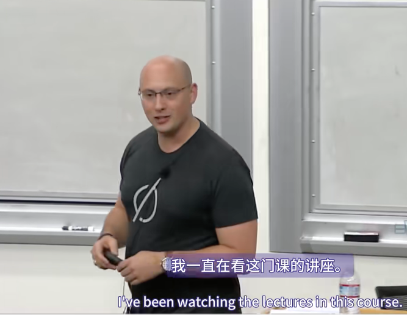

这太棒了。我一直在看这门课的讲座。内容是不是非常棒？现在你们今天只能听我的了。我们看看情况如何。

不像保罗（YC创始人）在问答环节那样，你们问他如果今天在大学里会做什么，他说物理。

我其实很放纵自己。我去学了物理，在剑桥学了物理。我认为物理是一门很棒的课，可以给你可转移的技能，这些技能在其他领域非常有用，但我想这不是你们今天听我讲课的原因。

我付了大学学费做在线营销、直销营销。我从1990年代开始做SEO。我创建了一个纸飞机网站。我在全球纸飞机这个小众市场占据了垄断地位，当你想创办一家初创公司时，也要看看这个市场在长期内能有多大。这不是很好。但它教会了我如何做SEO。

在那个年代，它是AltaVista。做SEO的方式是将白色文本放在白色背景上，在折叠线以下五页。如果你在文本中提到纸飞机20或30次，你就会排在AltaVista的首位。这就是你在20世纪90年代赢得SEO的方法。这是一个非常容易学习的技能。

当我上大学时，作为一名物理学家，我认为纸飞机会让我很酷。我实际上是物理课上最书呆子的人，所以我创建了一个鸡尾酒网站，这就是我学习编程的方式。它逐渐成为英国最大的鸡尾酒网站。当谷歌推出时，这让我真正进入了SEO领域。

所以，使用谷歌，你必须担心页面排名，你必须担心如何获得返回你网站的链接。这基本上意味着，在那个阶段，如果您在折叠下方的白色背景上也有白色文字，那么来自Yahoo目录的一个链接就可以将您带到Google的顶部列表。

当Google推出AdWords时，我才真正开始学习如何进行在线营销。那就是从Google购买付费点击，然后使用他们的联盟计划将其转售给eBay，赚取20%左右的小额利润。这就是真正让我全力以赴去做现在每个人都在谈论的增长、增长黑客或增长营销的事情的原因。在我看来，这只是互联网营销。使用任何渠道来获得您想要的任何输出。这就是我支付大学学费的方式，也是我最终从物理学家转变为营销人员并转向黑暗面的方式。

那么你认为对增长最重要的是什么？你上过很多课，人们也反复提到过这个问题。那么你们认为对增长最重要的是什么？有人给我一个答案，我会告诉你——好产品。我同意，好产品。

好产品会带来什么？客户。你需要这些客户做什么？传播消息。有人说要让用户留在你的网站上。有人说要破解增长的秘诀。就是这样，留住用户。留住用户是增长最重要的因素。

现在，Facebook拥有一支出色的增长团队，我非常自豪能为之工作。但事实上，我们拥有一款出色的产品。在Facebook从事增长工作是一种巨大的荣幸，因为我们正在推广世界上每个人都真正想使用的东西。这绝对是不可思议的。如果我们能吸引人们，并让他们兴奋起来，他们就会留在Facebook上。

很多时候，就像我为多家初创公司提供咨询一样，我最喜欢的是与Airbnb合作，但我也与Coursera合作过，我也与其他公司合作过，但这些公司的表现不如那些人。但有一件事是反复证明的：如果你观察这条曲线，即月活跃用户百分比与获取用户天数的关系，如果你的留存曲线渐近于与x轴平行的一条线，那么你就拥有了可行的业务，并且你的产品适合某个子集市场。

但是，你看到的大多数公司都飞速发展，我们谈论的是增长黑客和病毒式传播以及所有其他东西。我尽量不发誓，但这会发生。他们的留存曲线向x轴倾斜，最终与x轴相交。现在，当我向大多数人展示这张图表时，他们会说一切都很好。当你在Facebook成立增长团队时，你的增长量是每天100万人，或者你有5000万用户。有很多人加入该网站，所以你有大量的数据来做到这一点。

我们对B2B增长使用了相同的方法。让人们注册成为自助广告商，我们使用这种分析来了解我们在该市场将实现多少增长。当我加入Facebook时，产品才推出三天。在产品发布后的90天内，我们能够使用这种技术来计算出广告商一年的价值，我们预测第一年的价值将达到最终数字的97%。所以我认为查看注意力曲线非常重要，我们就是这样做的。

如果你看到这里，这条红线表示使用你的产品一定天数的用户数量。很多人，应该说是零，但很多人会使用该产品。你所有的用户至少会使用一天。但是如果你的产品已经推出一年左右，那么你将没有用户使用过366天。有道理吗？曲线合理吗？很酷。那么你接下来要做的就是寻找所有使用过你产品一天的用户。他们中有多少百分比是月活跃用户？前30天显然是100%，因为月活跃用户都是在一天内注册的。但是你看看第31天，每个用户在注册后的第31天，其中有多少百分比是月活跃用户？第32天、第33天、第34天。这样，你只需要10,000个客户或其他什么，就可以真正了解这条曲线对你的产品来说会是什么样子。你能分辨出它是否渐近吗？它会在右侧变得嘈杂，就像我没有使用真实数据一样。它会在右侧变得嘈杂，但你可以控制这条曲线是否变平？

如果它不变平，就不要去做增长策略，不要去做病毒式传播。不要雇佣增长黑客。专注于让产品适应市场。因为最终，正如Sam在本课程开始时所说的那样，创意、产品、团队、执行。如果你没有优秀的产品，那么即使它发展得很好也没有意义，因为它不会增长。

我在Facebook内部看到的第一个新产品问题，我所建议的创业网站的第一个问题是，他们实际上并没有找到他们认为适合市场的产品。因此，人们一遍又一遍地问的下一个显而易见的问题是，好的留存率是什么样的？当然，我的留存率可以达到5%，但我猜Facebook的留存率比这要高，所以这不会是一个成功的企业。当人们问我这个问题时，我真的很生气，因为我认为你可以弄清楚。

我喜欢这个故事，这是我在这里提到的一个我喜欢的无端故事，所以其余部分可能不那么无端。但这是1950年《生活》杂志上发表的一张三位一体核弹试验的照片。还有一个人，杰弗里·泰勒。谁听说过杰弗里·泰勒？太棒了，是的，有人听说过他。杰弗里·泰勒是一位英国物理学家，最终获得了诺贝尔奖。他能够通过观察这张图片推断出原子弹的威力，美国原子弹，以及俄罗斯人发布的类似图片，仅仅使用维度推理。

我认为维度推理是我在英国学习物理期间学到的最好的技能之一。维度推理就是你查看问题所涉及的维度，因此你想计算出能量。牛顿，米。牛顿是千克、米、负二秒。所以你有千克、米的平方、负二秒。然后你试着弄清楚如何从你拥有的数据中得到这些数字。所以质量是这个球体的体积。所以你把一立方米放进去。所以，你得到了米的五分之一除以秒的负二分之一，他能够利用这个来计算出这颗原子弹的威力，俄罗斯和美国原子弹的威力比，从而揭示当时世界上存在的一个最高机密。

这是一个难题。计算出 Facebook 的留存率，并不是一个难题。

互联网上有多少人？大概，有人会说出来。24 亿，23 亿，差不多吧？所以互联网上有 20 亿人。

Facebook 在我们上次的收益电话会议上说，活跃用户数量约为 13 亿。你可以把这些数字相除。是的，这不会给你正确的答案。当然它不会给你正确答案。但是，如果我们让互联网上的每个人都注册，那么这将让你大致了解 Facebook 的留存率。然后你就会知道它比这个数字要高。

同样，如果你看看 WhatsApp，他们宣布有 6 亿活跃用户。有多少人有智能手机？你可以算出这个数字。这个数字已经出来了，而且在不断变化。它能让你了解有多少用户。

亚马逊几乎在美国注册了所有人。你知道美国有多少人上网，从他们给出的数字中，你就能知道亚马逊有多少客户。

不同的垂直行业需要不同的终端留存率，才能获得成功的业务。如果你从事电子商务，并且按月保留 20% 到 30% 的活跃用户，那么你可能会做得很好。如果您从事社交媒体业务，并且您的第一批注册产品的用户保留率不到 80%，那么您就无法拥有一个大型社交媒体网站。所以这实际上取决于你所在的垂直行业，留存率是多少。

你需要做的是拥有工具来思考谁是可比的，以及如何看待它并说，我是否接近这个垂直行业的真正成功？

因此，留存是增长最重要的因素，而留存来自于拥有一个好的想法、一个支持这个想法的好产品，以及一个好的产品市场契合度。我们判断一个产品是否具有很高的留存率的方式是，当你以群组为基础进行标准化时，安装该产品的用户是否真的会长期使用它。

我认为这是一个非常好的方法来审视你的产品，并说，好吧，我获得的第一个 100、第一个 1,000、第一个 10,000 人，从长远来看，他们会被留住吗？

那么现在你如何实现增长？假设你有非常棒的产品市场契合度。你已经建立了一个电子商务网站，每个月有 60% 的人会回来购买你的产品，这绝对是太棒了。那么你如何看待这种情况并说，现在是扩大规模的时候了。现在是执行的时候了，这是你最后想到的事情。

我认为这就是增长团队发挥作用的地方。比如，我的反向观点，是如果你是一家初创公司，你不应该有增长团队。

你不应该有增长团队。初创公司不应该有增长团队。整个公司都应该是增长团队。首席执行官应该是增长主管。你需要有人为你设定北极星。这是 NASA 页面的免费截图。你需要有人为你设定北极星，告诉你公司想要去哪里。在我看来，这个人应该成为公司的领导者。

马克就是一个很好的例子。早在 Facebook 刚开始的时候，很多人都在公布他们的注册用户数量。是的，你会看到 MySpace 的注册用户数量，你会看到 Contact 的注册用户数量，你会看到注册用户数量。Mark 公布了月活跃用户数，这是他要求每个人在内部都达到的数字，他说，我们需要 Facebook 上的每个人，但这意味着 Facebook 上的每个人都是活跃的，不是每个人都注册了 Facebook。因此，月活跃用户是他内部的数字，也是他对外公布的数字。这是他让全世界都把 Facebook 作为我们关心的数字。

如果你看看 Jan 对 WhatsApp 所做的，我认为这是另一个很好的例子。他总是公布发送数字。如果你是一个消息应用程序，发送可能是最重要的数字。如果人们每天使用一次，也许这很好，但他们发送一条消息，你并不是他们的主要消息传递机制，所以 Jan 公布了发送数字。

在 Airbnb 内部，他们会讨论预订晚数，他们还会在 TechCrunch 内部的所有信息图表中发布这些信息。他们总是将自己预订晚数与世界上最大的连锁酒店进行比较。这些公司中的每一家都有不同的北极星。北极星不一定是每个垂直行业的月活跃用户。对于 eBay，当我在那里时，它是商品交易总额。人们实际上通过 eBay 购买了多少东西？外部每个人都倾向于根据收入来判断 eBay。实际上，本尼迪克特·埃文斯 (Benedict Evans) 对亚马逊的业务进行了惊人的分析，这真的很有趣，可以看看他们的市场业务与直接业务。eBay 都是市场业务，因此，eBay 是根据其收入来判断的，而实际上通过该网站的商品交易总额是其十倍或更多，这就是我在 eBay 内部时查看并优化的数字。

因此，当考虑增长时，每家公司都需要不同的北极星。但是，当你为了增长而运营时，拥有北极星并将其定义为领导者至关重要。这很重要的原因是，**一旦你有不止一个人在做某件事，你就无法控制其他人在做什么**。我向你保证，现在我管理着 100 个人，我好像无法控制。这都是影响力。

是的，我可以告诉一个人去做这件事，但其他99个人会做他们想做的事。问题是，并不是每个人都清楚什么对一家公司来说是最重要的。

在eBay内部，人们很容易说，你知道吗，我们应该关注收入。或者，你知道吗，我们应该关注从我们这里购买商品的人数。或者，你知道吗，我们应该关注有多少人在eBay上列出商品。而Pierre、Meg和John等领导总是说不，重要的是通过我们网站销售的商品交易总额，重要的是通过我们网站销售的电子商务的百分比。这对公司来说才是最重要的。

这意味着当人们在交谈时，你不在房间里，或者当他们坐在电脑屏幕前思考如何打造这个特定的产品或这个特定的功能时，在他们的脑海里，他们会清楚地知道，这不是收入问题，而是商品交易总额，或者不是获得更多注册。除非他们成为长期活跃用户，否则注册并不重要。

一个很好的例子是我2004年在eBay的时候。我们改变了向联盟会员支付新用户费用的方式。联盟计划现在有点过时了，但联盟计划的理念本质上是，你向互联网上的任何人支付推荐费，以将流量引荐到你的网站。但主要还是为了接触大型营销商，他们自己独立完成这项工作。这方面也有一些非常好的故事。

我们为确认注册的用户付费。因此，我们所有的关联公司都一致同意让确认注册的用户访问eBay网站。我们改变了我们的支付模式，为激活的确认注册用户付费。因此，您必须确认您的帐户，然后竞标某件商品，或购买某件商品，或列出某件商品，才能成为我们付费的对象。

一夜之间，当我们做出这一改变时，我们失去了大约20%的由关联公司驱动的确认注册用户。但ACRU仅下降了约5%。CRU与ACRU的比率上升，然后ACRU的增长大幅加速。造成这种情况的原因是，如果您想增加CRU，如果有人搜索蹦床，您会将他们带到注册页面，因为他们认为他们必须先注册并确认才能获得蹦床。如果你想推动ACRU，你可以让他们进入eBay蹦床搜索结果页面，这样他们就可以看到他们想买的东西，为之兴奋，并在想买的时候注册。如果你只推动CRU，人们在访问eBay网站时就不会有令人惊叹的魔力时刻。

接下来最重要的事情是，你如何推动让人们迷上你的服务的魔力时刻？所以在本课程的讲义中，我放了一些我认为在所有这些方面都很出色的人的链接，我之前展示的留存曲线。有一个链接是关于Danny Ferrante的，他对留存曲线的讨论非常精彩。

关于“魔力时刻”，有两个视频链接。一个是Chamath谈论增长，他是Facebook增长团队的创始人。另一个是四年前我和我的朋友Naomi在F8大会上谈论我们当时如何思考增长的。在这两个视频中，我们都讨论了“神奇的时刻”。

那么，你们认为注册Facebook时最神奇的时刻是什么？当你点击那个大大的绿色按钮时，用户会不会立刻想到“啊哈”？几年前，马克甚至在创业学校谈到过这个问题：见见你的朋友。见见你的朋友。就这么简单。而且通常都很简单。

我和很多公司谈过，他们试图把自己做的事情复杂化。但其实很简单，就像你在Facebook上看到朋友的第一张照片一样。你会想，天哪，这就是这个网站的目的。扎克伯格在Y Combinator上谈到了如何在14天内让用户增加10个好友。这就是我们关注该指标的原因。社交媒体网站最重要的事情是与好友建立联系。因为没有联系，你的新闻源将完全空白，显然你不会再回来。你永远不会收到任何通知。你永远不会有任何好友告诉你他们在网站上错过了什么。所以对于Facebook来说，最神奇的时刻是你看到好友的脸的那一刻，以及我们为增长所做的一切。

如果你看看LinkedIn的注册流程，或者看看Twitter的注册流程，或者看看WhatsApp在你注册时所做的一切。所有这些服务都希望做的头等大事是尽快向你展示你想关注、联系和发送消息的人。因为在这个垂直领域，这才是最重要的。

当你想到Airbnb或eBay时，你会在eBay上找到一件独特的物品，比如你非常非常在意并想要得到的Pez糖果盒或坏掉的激光笔。就像当你看到你错过的收藏品时，那是eBay上真正的神奇时刻。当你在Airbnb上看到第一个物品时，你会发现第一个物品清单就像一间你可以住的很酷的房子，当你走进门时，那是一个神奇的时刻。同样，另一方面，当你列出你的房子时，你第一次得到付款是一个神奇的时刻。当你在eBay上列出一件物品时，你第一次得到付款是一个神奇的时刻。

你应该问问Brian是怎么想的，因为他们已经制作了这些令人惊叹的故事板，我认为这些故事板已经被分享了，就像用户在Airbnb上的生活之旅，以及它是多么令人兴奋。他大概讲了三堂课。这家伙在谈论神奇时刻以及让用户感受到爱和喜悦等所有这些方面非常出色。因此，请考虑一下您的产品的神奇时刻是什么，并尽快让人们与之建立联系。因为这样您就可以在蓝线渐近处向上移动。

然后，如果您可以将人们与让他们留在您网站上的东西联系起来，您就可以轻松地将保留率从50%提高到60%甚至70%。

要考虑的第二件事是，硅谷的每个人都错了。当我们为自己考虑增长时，我们会进行优化。所以我最喜欢的例子是通知。再次，与许多公司交谈，为许多公司提供建议。每家公司在谈论通知时，都会说，哦，我收到的通知太多了。我认为这就是我们需要优化通知的原因。好吧，您的高级用户是否因为收到太多通知而离开您的网站？不。那么你为什么要优化它？他们可能是成年人，他们可以使用过滤器。你需要关注的是边际用户，即在某一天、某一月或某一年没有收到通知的人。

顺便说一句，我们的产品体验，比如打造一款出色的产品，都是为超级用户着想，打造一款令人难以置信的产品肯定是为了最常使用你的产品的人而优化。但推动增长，那些一直在使用你的产品的人，并不是你需要担心的人。

因此，在这段Danny Ferrante视频中，还有来自讲座页面的链接，其中还讨论了我们用于考虑增长的增长会计框架。我们研究了新用户、复活用户、30天内没有使用Facebook的用户，以及流失用户。在我见过的几乎所有产品中，一旦达到合理的增长点，无论是几年后，还是其他时间，复活用户和流失用户的数量都会主导新用户数量。而所有流失和重新回归的用户的好友数量都很低。找不到朋友，因此无法了解Facebook上发生的精彩事情。因此，我们需要关注的首要事情是让他们结识这十个朋友，让他们结识他们需要的任何数量的好友。

因此，在考虑增长时，请考虑边际用户，不要只考虑自己。因此，为了增长而运营，您真正需要考虑的是公司的北极星是什么？如果公司中的每个人都在考虑它，并推动他们的产品朝着该指标发展，并采取行动提高该指标，那么从长远来看，您的公司将取得成功。那么这个指标是什么？顺便说一句，它们可能都相互关联，因此几乎可以选择任何指标。无论哪一个最深刻，哪个让您感觉最好，与您的使命和价值观相符，都可能选择那个。但实际上，每日活跃用户与每月活跃用户相当相关，我们可以选择其中任何一个。分享的内容量也与用户数量密切相关，因为你猜怎么着？你添加一个用户，他们就会分享内容。很多事情最终都是相关的。选择一个适合你的方向，你知道你可以长期坚持下去的，但要有一个北极星。有了北极星，当用户体验到那个神奇的时刻时，他们会在北极星上为你提供那个指标。

然后，考虑边际用户，不要只想着自己。我认为，当你为增长而运营时，这些才是真正重要的点。一切都必须从顶层开始。

所以，这里的最后一个领域是策略。我希望能谈到其中的一些，然后我会列出一份我想介绍的策略清单，最好能有白板之类的工具来讲解。但是在我介绍这些策略时，你可以问我问题，了解它们是如何工作的，以及哪种方法更好。

你需要考虑的重要策略是，顺便说一句，汤姆·菲什曼是个很棒的人。他住在湾区，画了一些我很喜欢的讽刺漫画。假设你找到了一个利基市场，你将在捕鼠器市场中垄断这个市场。这是一个静音捕鼠器，放在床下，这样如果老鼠在夜间爬到你的床上，你不用醒来就可以杀死它们。这就是你的利基市场。你的捕鼠器比市场上其他任何捕鼠器都好。

硅谷通常的情况是，每个人都认为营销人员没用。当我还是一名物理系学生时，我也认为营销人员没用，所以我敢肯定，作为工程系的学生，你们一定会认为我们是很糟糕的人，没有用。“建好它，他们就会来。”这是硅谷的口头禅，但我不相信这是真的。我相信你真的必须努力工作。

讲座页面上还有一篇采访 Ben Silverman 的精彩文章，他在其中讨论了 Pinterest 的增长是如何由营销推动的。这确实是一篇值得一读的好文章。当然，我有偏见。

所以我想谈的第一个策略是国际化。**Facebook 国际化太晚了。**&#x53;heryl 在公开场合广泛地表达了这一点，我绝对同意这一点。我们长期发展的最大障碍之一，也是我们必须处理的最大问题之一，就是所有国家都有克隆版本。众所周知，Studiefeldt 说，他们的 HTML 中有 fakebook.css，而且有很多这样的网站。Studiefeldt 称，无论是 Contactia、Mixi、Cyworld 还是 Orkut，它们都是明显的克隆。

当 Facebook 专注于美国市场时，世界各地出现了各种各样的社交网络。因此，国际化是我们需要打破的一个重要障碍，而打破障碍往往是实现增长的重要考虑因素。Facebook 最初只面向大学，因此它进入的每所大学都在打破障碍。当 Facebook 从大学扩展到高中时，我并不在公司，但那是公司震动的时刻，人们开始质疑 Facebook 是否真的能够生存下去，网站的文化是否能够生存下去。然后从高中扩展到所有人，那是在我加入之前，那是一个令人震惊的时刻，这促使公司增长到 5000 万，然后我们遇到了瓶颈。当我们遇到瓶颈时，Facebook 内部开始质疑许多存在主义问题，即任何社交网络是否能够拥有超过 1 亿用户，这现在听起来很愚蠢。但在当时，没有人实现过这个目标。每个人都已经开发出 5000 万到 1 亿用户，我们担心这是不可能的。正是在那个时候，增长团队成立了。Chamath 把我们召集在一起。他公开表示他多次想解雇我，他可能应该这么做。但是，如果没有 Chamath，我想我们都不会留在公司。我们真的是一群很奇怪的人，但最终成功了。

我认为，我们做的两件事最初真正推动了增长。第一，我们专注于在 14 天内结识 10 个朋友，并让用户体验到神奇的时刻。这是扎克推动的，因为我们都陷入了分析瘫痪，讨论这是因果关系还是相关性。扎克说，你真的认为如果没有人交朋友，他们就会在 Facebook 上活跃，你疯了吗？

第二件事是国际化，它打破了另一个障碍。当我们推出它时，我认为有两件事我们做得很好。第一，尽管我们迟到了，而且我们为迟到而感到压力，但我们还是花时间以可扩展的方式构建它。我们慢慢行动，快速行动。你可以在讲座页面链接的一个视频中阅读、聆听 Naomi 的完整故事。但我们所做的是，我们将网站中的所有字符串都包装在 FPT 中，这是我们的翻译脚本，或者翻译提取脚本。然后，我们创建了社区翻译平台。这样，我们不仅有专业翻译人员翻译网站，还可以让所有用户翻译网站。我们在 12 小时内就翻译了法语。到目前为止，我们设法让 Facebook 翻译了 104 种语言，其中 70 种是由社区翻译的。看到了吗？我们花时间构建了可以扩展的东西。

另一件事是，我们优先考虑正确的语言。所以当时，正确的语言，四大语言是法语、意大利语、德语和西班牙语。还有中文。。。我们专注于法语、意大利语、德语和西班牙语。现在看看那个列表。这就是今天的语言分布。意大利语不再上榜。法语和德语即将跌出榜单。去年，Facebook 上的印地语用户数量增加了四倍。因此，为当今世界的发展而构建是一个很容易犯的错误，而其他许多社交网络也正是这么做的。我们建立了一个可扩展的翻译基础设施，实际上使我们能够处理所有语言，因此我们可以为未来的发展做好准备。今天晚些时候，您可能会在印度的 internet.org 峰会上看到一些关于我们想要在语言翻译方面取得进展的内容，因为我认为他们正在那里讨论这些内容。这些是我现在想要介绍的策略，我会坚持使用白板来处理这些内容。但我真的很鼓励你们，在我介绍这些内容时，如果你们有任何疑问，请告诉我。我认为这应该是一个更自由的时间，但我认为其中一些策略非常有趣。

首先是病毒式传播。是的，我认为有两种方式来看待病毒式传播。有一本很棒的书，右边这本书是Adam Penenberg所著的《病毒循环》，书中介绍了一系列通过病毒式营销发展起来的公司案例。如果您对病毒式营销感兴趣，我强烈建议您购买这本书。

我认为广告界的奥格威也很棒，因为在第七章中，他说，如果您想不出其他方法，就用强力胶将汽车粘在广告牌上，人们就会购买您的强力胶。书中还提供了非常不错的创意技巧。这家伙已经去世20年了，但我认为他仍然在，我相信，我团队中的每个人都会购买这两本书，当他们开始加入我的团队时。

所以，病毒式营销。肖恩·帕克有他教授的这个模型，或者说，当我加入Facebook时，他告诉我们的。也就是说，从三个方面来考虑产品的病毒式营销。首先是有效载荷。那么，任何一次病毒式营销可以影响多少人？第二，他对这些的措辞比较酷，我没有那么酷。第二是转化率，第三是频率。有效载荷、频率和转化率。随便。那就对了。

那么，一次可以击中多少人就是有效载荷。每次爆炸可以击中他们多少次就是频率。他们会以什么方式转化？这让你对产品的病毒式传播有一个基本的了解。

所以Hotmail就是出色的病毒式营销的典型例子。当Hotmail推出时，有很多邮件公司获得了资金，他们在传统广告上投入了大量资金。有多少人知道Hotmail关于病毒式传播的故事？太棒了，很棒的新受众。对不起，只有两三个人会感到无聊。

但是Hotmail，在那个时候，人们无法获得免费的电子邮件客户端，他们必须与他们的ISP绑定。Hotmail和其他几家公司推出了，他们的客户端随处可见。您可以通过图书馆互联网或学校互联网登录并访问该网站。这对每个想要访问该网站的人来说都是一个真正巨大的价值主张。

大多数公司都开展了大型电视宣传活动、广告牌宣传活动和报纸宣传活动等，从雅虎购买了大量广告，所有这些。但Hotmail团队没有那么多资金，所以他们不得不四处寻找如何做到这一点的方法。所以他们所做的就是在每封电子邮件的底部添加一个小链接，上面写着，从Hotmail发送，在这里获取免费电子邮件。现在有趣的是，这意味着有效载荷很低。是的，你一次只给一个人发送电子邮件，不一定会产生巨大的有效载荷。也许你发送了一些病毒式垃圾邮件，但我不确定我会点击你的链接。但是频率很高，因为你一遍又一遍地给同一个人发送电子邮件。这意味着你每天要用同一个链接打他们一次、两次、三次，并真正提高印象。而且转化率也很高，因为人们不喜欢被绑定到他们的ISP电子邮件。因此，Hotmail最终成为极具病毒性的传播工具，因为它具有高频率和高转化率。

另一个例子是PayPal。PayPal之所以有趣，是因为它有两个方面：买方和卖方。PayPal另一个有趣的地方是它的病毒式增长机制是eBay。因此，您可以使用各种可能看起来不一定很明显具有病毒性的东西来实现病毒式传播。所以PayPal，如果你汇款，如果你对卖家说，我要给你汇款，我想不出更高的转化率了。频率低，有效载荷低。但是PayPal做了这件事，当你让你的朋友注册PayPal时，他们会赠送钱。这就是他们在消费者方面病毒式传播的方式。他们不必为卖家这样做，因为如果我说我要通过这个给你汇款，你就会接受。即使在消费者方面，他们也病毒式传播，因为有人说，注册这个东西，你会得到十美元。为什么你不这么做呢？所以他们能够病毒式传播，但在这两种情况下，都是因为他们在买方和卖方方面的转化率非常高，而不是因为他们的有效载荷和频率很高。有道理吗？

所以如果你想说，这个产品是病毒式传播的，这是一种非常好的方式来看待病毒式传播。Facebook不是通过电子邮件分享或类似方式传播的。Facebook纯粹是通过口口相传传播的。因为PayPal和Hotmail的有趣之处在于，要使用它们，第一个人必须向未使用该服务的人发送电子邮件。对于Facebook，没有本地方式可以联系未使用该服务的人。每个人都认为Facebook是病毒式营销的成功案例，但实际上它的发展方式并非如此。这是口口相传的病毒式传播，因为它是一款很棒的产品。这就是你想告诉朋友的。

*当你在两个例子中谈论这种低有效载荷时，在后续的轮次中，随着这种活动或无论你想叫它什么，随着越来越多的人向越来越多的人发送Hotmail，你的有效载荷是否会更高？这样你的有效载荷就会越来越大？*

所以问题是，在第一轮中，它的有效载荷较低是有道理的，但在后续轮次中，随着人们发送越来越多的电子邮件，你的有效载荷不会更高吗？

我想，首先，我认为你实际上只向少数人发送电子邮件。因此，与当今存在的大规模病毒式引擎相比，你可以导入某人的整个通讯录并发送给所有人，向他们发送一封电子邮件，或者向 Facebook 上所有人的好友发帖。实际的有效载荷仍然很小，即使你经常向每个人发送电子邮件。而且我还在想，每封发出的电子邮件中有多少人在使用。但这是一个合理的观点。就像是的，随着越来越多的人使用 Hotmail，他们会发送更多的电子邮件，随着越来越多的人使用电子邮件，产品实际上会越来越成功。所以这是一个公平的观点。

*转换点也很重要吗？*

所以当使用 Hotmail 时，你只需点击一下就可以注册，但如果你看到广告牌广告，注册的阻力就会更大。完全同意，这就是为什么，哦，对不起。转换点也很重要吗？所以在 Hotmail 上，你点击注册，但在广告牌上，你必须记住 URL，转到网站，输入它，找到注册按钮，点击注册并注册。是的，是的，你可以做任何事情来消除流程中的摩擦，从线下广告到线上广告显然可以消除流程中的大量摩擦。完全同意。

*`频率和转化率不是相关的吗？`*

绝对。如果你用同样的促销方式打动别人，我，我重复一遍。频率和转化率不是相关的吗？如果你一遍又一遍地向某人发送相同的电子邮件或相同的横幅广告。这是在线营销的基本原则之一。同样的规则适用于每个渠道。如果你一遍又一遍地向某人发送相同的 Facebook 广告，你向他们发送相同广告的次数越多，他们点击的次数就越少。这就是为什么我们会有创意枯竭。你必须在 Facebook 上轮换创意。横幅广告也是如此。新闻提要故事也是如此。当你第 50 次在新闻提要中看到那个 IQ 故事时，你不会点击它。如果你之前没有点击过第 49 次，你就不会点击第 50 次。这些电子邮件也完全如此。因此，如果您一遍又一遍地向人们发送相同的电子邮件以进行邀请，或者如果您一遍又一遍地向人们发送底部相同的小链接以进行 Hotmail 或 PayPal 的注册，那么因为人们刚刚注册，所以 PayPal 的链接会有所不同。但是，是的，您的转化率会降低。而且，你向人们传达的信息越多，他们的转化次数就越少，这是每个在线营销渠道的基本原则。

我认为看待病毒式传播的第二种方式很棒，这是Ed的观点。Ed现在负责Uber的增长团队。他曾在Facebook的增长团队任职。他是斯坦福大学的MBA学生，上过类似的课程，他们讨论了病毒式传播。他们都去开发病毒式产品。事实上，有很多媒体报道过这件事。他在这方面很出色。

Uber的有趣之处在于，如果你看看他们的增长团队，你会发现他们非常关注司机。因为作为一个双边市场，他们需要司机。这是他们团队关注的很大一部分。尽管他们公司里可能有世界上最好的病毒式传播专家。

*通过病毒式传播，您可以发送出去，让某人联系导入。那么问题是，您能让多少人发送导入？有多少人点击？您可以添加额外的步骤。您可以输入打开的次数、点击的次数，等等。点击的次数？注册的次数？然后，有多少人导入？*

因此，本质上，您希望注册您网站的人导入他们的联系人。然后您希望他们向所有这些联系人发送邀请。您希望将其发送给所有这些联系人，而不仅仅是其中一个联系人。然后您希望获得点击的百分比和注册的百分比。如果您在每个点上乘以百分比，这基本上就是，这不是百分比，而是一个数字。如果您将其乘以，这基本上就是您得到K因子是什么的问题的点？

因此，如果有人导入时，平均向100个人发送邀请，那么抱歉，我做错了。假设每导入一个人，100人就会收到一个邀请。然后，在这10%中，点击量就变成了10。然后，假设其中50%注册，就变成了5。然后，其中只有10%到20%的人会真正导入。你的K因子将达到0.5到1。你不会像病毒一样传播。

所以很多东西，比如Viddy，非常擅长推送，或者非常擅长推送K因子超过1的故事。让K因子超过1是完全可行的。但是，如果你的东西在后端没有很高的留存率，那就没关系了。所以你应该看看你的邀请流程，然后说，好吧，我的导入量是多少？每次导入会向多少人发送邀请？其中有多少人收到点击？其中有多少转化到我的网站？其中有多少导入？了解您的 K 因子。但真正重要的仍然是考虑留存率，而不是病毒式传播。并且只有在每个注册用户都留住大量用户之后才可以这样做。所以，我们还要谈到其他一些事情：SEO、电子邮件、短信和推送通知。

在 SEO 方面，你需要考虑三件事。第一个是关键词研究。人们一直做得很糟糕。所以我推出了这个我跟你谈过的鸡尾酒网站。我花了一年时间对其进行优化，使其在“鸡尾酒制作”这个词上排名靠前。结果在英国，没有人搜索“鸡尾酒制作”，大约每月只有 500 人。我主导了该搜索词，太棒了，每月 400 名访客，太神奇了。但在英国，每个人都在搜索“鸡尾酒配方”，而在最大的市场美国，每个人都在搜索“饮料配方”。所以我优化了错误的词。因此，你必须先研究你要追求什么。

研究包括：人们搜索与您的网站相关的内容，有多少人搜索它，有多少人为它排名，以及它对您有多大价值？供给、需求和价值。我想，这很简单。因此，您进行关键词研究，找出要为哪些关键词排名。有很多很棒的工具可以帮助您做到这一点。老实说，最好的工具通常是 Google AdWords 关键字规划工具。真的。完成此操作后，下一个最重要的事情就是链接。因此，页面排名是所有 SEO 的根本驱动因素，而 Google 则基于权威。

现在，Google 的算法中还有很多其他内容。比如，人们会搜索您的网站吗？发送到您网站的锚文本的分布有很多内容，因此如果您滥用它并发送垃圾邮件，它们可能会弹出垃圾邮件。白色背景上的白色，折叠以下五页不再起作用。但最重要的事情是从高权威网站获取有价值的链接，以便您在 Google 中排名。这是最重要的事情。然后，您需要通过有效的内部链接在网站内部传播这种爱。

当我加入 Facebook 时，我们在 2007 年 9 月推出了 SEO，那是在我加入之前。我是 2007 年 11 月加入的。我们推出了它，但我们推出的页面，即公共用户资料，没有带来任何流量。所以当我进去查看它时，您访问任何公共用户资料的唯一方法是单击页面页脚的关于链接，然后单击其中一篇博客文章，然后单击其中一位作者，然后通过他们的好友蜘蛛出去找他们所有的朋友。结果发现，谷歌就像是，他们埋葬了这些页面，它们没有什么价值，我不会对它们进行排名。

我们进行了一项改动，添加了一个目录，使得 Google 可以快速访问网站上的每个页面，从而将 SEO 流量提升了100倍。这是一个非常简单的改变，但在内部链接分发方面带来了许多好处。

最后一点，有一些基本的事项需要注意，比如 XML 站点地图，确保你有正确的标题。关于你想要做的事情，网上都有很好的覆盖。

我现在要停下来确认一下，因为我们有几个问题，但还有其他什么问题吗？请继续。

*我们实际上可以讨论电子邮件吗？。*

好的，太好了。电子邮件。

在我看来，对于25岁以下的人来说，电子邮件已经过时了。年轻人不使用电子邮件，他们使用 WhatsApp、短信、Snapchat 和 Facebook。他们不使用电子邮件。如果你的目标是年龄较大的受众，电子邮件非常成功。电子邮件仍然适用于分发，但实际上，电子邮件对青少年来说并不是那么好，甚至对大学生来说也是如此。你们知道自己使用即时通讯应用的频率有多高，而使用电子邮件的频率有多低。你们可能在电子邮件的使用率上处于高端，因为你们身处硅谷。

话虽如此，关于电子邮件，需要考虑的事情是这样的。电子邮件、短信和推送通知的行为方式都相同。它们都存在可传递性问题。因此，要想成功，首先你必须确保你的电子邮件能够到达某人的收件箱。如果你发送大量垃圾邮件，最终会得到一个不良的 IP，或者你从其他人所在的共享服务器发送垃圾邮件，或者你从其他人发送垃圾邮件的共享服务器发送电子邮件通知，你最终会被持续放入垃圾邮件文件夹，你的电子邮件将完全失败。你最终可能会被阻止，你的电子邮件会被退回。

电子邮件周围有很多需要你查看的东西。当你从发送电子邮件的服务器收到反馈时，500 系列错误与 400 系列错误，你必须尊重它们的处理方式。如果有人给你硬退回，请重试一两次，然后停止尝试。因为如果你滥用别人的收件箱，电子邮件公司就会把你的邮件归为垃圾邮件，很难摆脱。如果你被垃圾邮件屋链接或类似的东西抓住，很难摆脱。

对于电子邮件来说，成为一个高素质的公民，做好电子邮件工作非常重要，因为你想长期保持可交付性。这也适用于推送通知和短信。使用短信，你可以通过灰色渠道购买短信流量，人们将手机挂在电脑上，然后发送短信。这种方法在一段时间内有效，但总会被关闭。我见过很多公司犯这样的错误，他们认为通过使用某种策略可以发展壮大。然而，如果你的电子邮件、短信或推送通知无法送达，你将永远不会从中获得任何成功。

在推送通知方面，你可能会向高级用户发送垃圾邮件。我知道这与我之前所说的略有不同，但实际上你确实在向高级用户发送他们不关心的通知，并且让他们很难选择退出。由于没有设置让他们选择退出，他们最终会开始屏蔽你。一旦他们选择退出你的推送通知，你就再也无法推送给他们。事实上，一旦他们关闭了推送通知，就很难再提示他们打开。

因此，关于电子邮件、短信和推送通知，首先要考虑的是你必须确保他们能够收到。除此之外，还有打开率和点击率的问题。那么，你可以如何写出引人注目的主题，让人们打开你的电子邮件呢？你如何让他们在访问时点击？

在我看来，每个人都专注于发送营销电子邮件，但这些邮件只是垃圾邮件。时事通讯很愚蠢。不要发时事通讯，因为你会向网站上的每个人发送相同的信息，无论是昨天注册你网站的人，还是使用你产品三年的人。他们需要同样的信息吗？不。

你能发送的最有效的电子邮件是通知。那么你要发送什么呢？你应该通知人们什么？这正是我们思维方式错误的地方。作为 Facebook 用户，我不希望 Facebook 每次收到点赞时都给我发邮件，因为我收到了很多点赞，因为我有很多 Facebook 好友。但作为新的 Facebook 用户，收到的第一个点赞是一个神奇的时刻。

在所有渠道上启用该通知可提高电子邮件、短信和推送通知的点击率。但我们只为参与度低、不会返回网站的用户启用它，因此它不会向他们发送垃圾邮件。所以这是一次很棒的体验。

所以想想吧。我们应该发送什么通知是你在电子邮件、短信和推送方面需要考虑的第一件事。然后你需要考虑的第二件事是，你如何创建出色的触发式营销活动？例如，当有人创建他们的第一笔跨境贸易交易时，就点击率而言，这是我在 eBay 参与过的最好的电子邮件活动之一。这太棒了，因为它非常及时，非常符合上下文，对用户来说是正确的事情。

所以我想说，确保你有可交付性，这是最重要的事情。除此之外，还要关注通知和基于触发器的电子邮件、短信和推送通知。

最后，我觉得我们没时间了。有一件事我想最后说一下，那就是，如果你们有任何问题，可以联系我。如果我收到垃圾邮件，我不会回复。我们有很好的垃圾邮件过滤器，不会让垃圾邮件通过。

我最喜欢的名言来自巴顿将军，虽然它太陈词滥调了，太疯狂了，但很棒。今天猛烈执行的一个好计划，比明天的完美计划要好。Chamath 向我们灌输的、Javi 仍然在向我们灌输的、以及 Mark 在整个 Facebook 上灌输的思想之一，就是“行动要快，不要怕打破常规”的精神。

如果你能比别人做更多的实验，如果你渴望成长，如果你为每一个额外的用户而奋斗甚至牺牲，如果你熬夜不眠，为了获得这些额外的用户，为了做这些实验，为了获得数据，并且一遍又一遍地重复，你就会成长得更快。

马克说他认为我们赢了，因为我们更想要成功，我真的相信这一点。我们只是非常努力。这并不是说我们非常聪明，或者我们以前都做过这些疯狂的事情。我们只是非常非常努力，而且我们执行得很快。我强烈鼓励你这样做。成长是可选的。谢谢。

