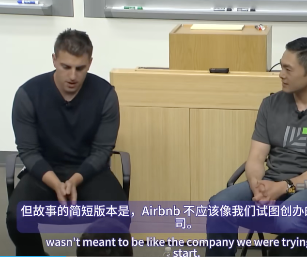

第十讲《Culture 》由airbnb创始人Brian Chesky 和2011年加入airbnb董事会的红杉合伙人Alfred Lin主讲

红杉合伙人Alfred Lin：

用几张幻灯片和一些评论来设置舞台，但主要舞台是Brian上台讲述他如何建立Airbnb文化。

你在这里，我一直在关注这些演讲。现在你知道了如何开始，已经组建了一个团队，开始构建你的产品。它已经起步，正在成长，人们喜欢它，你已经想出了如何做到这一点。你知道如何创建一个非常特别的、独一无二的公司，拥有巨大的垄断权力，你追逐的市场比纸飞机业务略大，所以你很好。那么现在呢？

我们在这里要提出的是，实际上文化对于你能够扩大业务和团队规模来说非常重要。希望在本次演讲之后，你们能够了解什么是文化，为什么文化如此重要，如何创建核心价值观，并思考哪些元素可以融合核心价值观和文化，从而打造一支高绩效团队，并获得一些文化最佳实践。

那么，什么是文化？有人想猜一下应该如何定义它吗？团队中的一套价值观？是的，很好。你有没有查过这个，因为你有电脑和互联网连接，你刚刚查过吗？这些是你可以在韦氏词典中找到的一些定义。但是，我们在斯坦福。这是一个有点刁钻的问题，这是一门计算机科学课。问题从来都不是直截了当的。真正的问题是，企业文化是什么？

我们通常谈论社会、群体、地方或事物的文化。这里，我们谈论的是企业文化。那么，如何定义企业文化？我们可以采用前面的定义并对其进行一些修改。这暗示了我们可能想要如何定义企业文化。每天，团队中每个成员的空白都在追求我们公司的空白。有些人用不同的东西来填补这些空白。A，第一个空白可能是假设、信念、价值观。我最喜欢的是核心价值观。B空白的第二个空白，人们说是行为。我最喜欢的答案是实际行动。你如何行动？追求目标，这有点薄弱。追求宏大、艰巨、大胆的目标，这有点强。但更好的定义是追求使命。

既然我们有了这种定义，我们该用它做什么呢？为什么这很重要？这是甘地的一句名言：“你的信念会变成你的思想。你的思想会变成你的言语。你的言语会变成你的行动。你的行动会变成你的习惯。你的习惯会变成你的价值观。你的价值观会变成你的命运。”如果公司没有良好的文化，你就无法追求自己的命运。这很重要，因为它会成为你做决定时要遵循的首要原则，成为一种让员工在公司重视的价值观上保持一致的方式。它提供了一定程度的稳定性，也提供了一定程度的信任，人们可以相互信任。它还为你提供了一份清单，你应该能够弄清楚该做什么和不该做什么。更重要的是不该做什么。最后，另一件重要的事情是它让你能够留住合适的员工。这个世界上有些人并不适合你的公司，但如果你拥有良好的文化和核心价值观，你就会知道你想留住谁，不想留住谁。如果你取这些单词的第一个字母，它恰好可以帮助你更快地行动。

另一个原因是，你认为这都是糊涂话。这实际上是更科学的东西。这里有从1997年到2003年的股票市场指数。在标准普尔500指数、罗素3000指数和财富100强中，最适合工作的公司。他们对所有这些公司进行了调查，并挑选出他们认为最适合工作的公司。而这些公司的股票市场回报率恰好是 11.08%，几乎是其他两个指数的两倍。因此，善待员工、充满信任、拥有强大文化的公司才具有真正的实力。

那么，你如何创建一套价值观，定义文化等等？经常有人问这个问题。你必须从公司的领导者、创始人开始。然后问问自己，对你来说最重要的个人价值观是什么？对企业来说最重要的东西是什么？你喜欢和什么样的人一起工作，他们的价值观是什么？通过这种方式，你可以提炼出一套价值观。然后想想那些你不喜欢一起工作的人。他们有什么价值观？想想这个，想想那个的反面，也许这些应该被视为你公司的价值观。

最后，记住，价值观必须支持你的使命。如果它不支持你的使命，你就错过了一些东西。然后，最后的检查是，它们必须可信，并且必须与你的使命有独特的联系。因此，在Zappos，就独特地应用于使命而言，我们专注于创造一种能够提供优质客户服务的文化。因此，我们的第一个核心价值观是通过服务提供惊喜。我们非常明确地表示，我们希望提供优质的客户服务，这将是一次令人惊叹的体验。然后，在那下面，我们想用一段话来支持这一点，谈论我们确切的意思。希望支持他们，通过服务和支持人们，比如我们的员工、我们的客户、我们的品牌合作伙伴和我们的投资者，提供惊喜。

从相反的角度来看，我们一般不喜欢和傲慢的人一起工作。因此，我们在Zappos的核心价值观之一就是谦虚。这两个例子表明，我们以一种可信的方式创造了核心价值观，并且与我们的使命有着独特的联系。因此，你经历了这个过程，你就想出了一些核心价值观。这些可能是其中的一些，无论是诚实、正直、服务、团队合作，并且可能有一个列表，你可能从三个开始，你可能会得到十个列表，你可能会列出三十个列表。这是个好的开始。当Zappos进行这个过程时，我们首先询问当时所有的员工他们想要认同的核心价值观是什么。我们得出了37个核心价值观，并最初将其缩减到大约10个。这花费了一年的时间，可能有人会问为什么需要这么长时间。简单地提出“诚实”这个词并不够，每个人都希望企业文化是诚实的，没有人会说他们想每天都被骗。对于“服务”这个词，我们需要更深入地理解其含义，而不仅仅是表面上的解释。

团队合作也是如此。校内运动队和棒球队的团队合作水平是有区别的，那么如何更深入地了解团队合作？团队中哪些因素不起作用？很多问题都与沟通有关，也与人们研究过的内容有关。我们需要更深入地探讨这些问题。

在Zappos，我们认为房间里有很多聪明人。当他们互相争论谁对谁错时，这可能不是最好的时间利用方式。我们希望每个人都能互相交流，帮助彼此改进想法。结果是公司得到了更好的想法，而不是任何个人是正确的。因此，我们希望灌输这样一种理念：首先是公司，然后是部门，然后是团队，最后是个人。那么如何做到这一点呢？你必须更深入地了解这一点。

我非常喜欢高绩效团队的一个重要元素，那就是Patrick Lencioni创建的金字塔。他在《团队的五大障碍》一书中谈到了团队的崩溃。首先，如果没有信任，很多团队就会崩溃。即使有了信任，为什么还需要信任？因为有了信任，你可以进行辩论和冲突，从而得到正确的答案。如果没有冲突和辩论，人们就像盲人领路。在你承诺某件事之前，怎么知道你真的得到了正确的答案？所以人们实际上不愿意承诺，他们害怕承诺。

假设你进入了下一个级别，并且确实能够做出承诺。那么，什么地方出了问题？通常是因为人们没有对他们承诺的事情负责。如果人们没有对他们承诺的事情负责，那么他们就无法取得成果。

如果你把公司看作一个黑匣子，那么无论是财务结果，还是你生产出优秀的产品，或者任何类似的输出，公司文化都是主要投入之一。在问答环节中，我们将讨论其他一些最佳实践，因为我认为这将融入到对话中，那就是你想将你的使命融入价值观。我们已经讨论过这个问题了。

绩效方面，你必须比你最初认为需要做的更努力、更深入、更长时间地思考你的价值观。我认为很多公司实际上没有做的一件事是，他们面试的是技术适合度、技能适合度或该领域的能力。他们实际上并没有面试文化契合度，也没有评估一个人是否真的会相信并遵循公司的使命。我认为这是一个大忌。比如，你可以拥有世界上最聪明的工程师，但如果他们不相信你的使命，他们就不会全身心地投入其中。

如果你真的开始从面试过程到绩效评估，再到确保文化成为一种日常习惯，你就会在创造一种伟大的文化方面取得更大的进步。关于养成日常习惯的最后一点，我认为文化就像客户服务或健身一样。每个人都想提供优质的客户服务，每家公司都希望拥有良好的文化，但他们没有做到的是让它成为一种日常习惯。如果你不把它作为日常习惯，你就不可能健康。最终你会走样，变胖，然后你会想，哦，我得节食减肥才能恢复体形。这不太管用。文化方面也是如此。

所以，我想我们已经检查过了所有这些，所以我们可以开始与 Brian 进行问答了。

Brian(Airbnb创始人）：

好的，大家好。这里很安静。说实话，现在好多了。我感觉不那么紧张了。没有什么比一屋子的人非常非常安静地盯着你更糟糕的了，但现在我感觉好多了。我这样做了五到十分钟。

*Alfred:*

*是的，你可以再忍一会儿:)。*

*那么 Brian，你能谈谈你是如何理解文化对 Airbnb 和公司建设的重要性的吗？*

Brian:

是的，我认为我们意识到的一件事是，为了给你们一个交代，我不会讲述 Airbnb 的完整故事，你们中的一些人可能知道。但故事的简短版本是，Airbnb 不应该像我们试图创办的那家公司。我已经辞去了工作。当时住在洛杉矶。有一天，我开车去了旧金山，和大学同学乔·杰比亚成为了室友。我去了罗德岛设计学院，乔·杰比亚。我有 1,000 美元存款，房租是 1,150 美元。

那个周末，国际设计会议即将在旧金山举行，所有的酒店都卖光了。我们有了这个想法，把我们的房子改造成一个供会议使用的住宿和早餐旅馆。我没有床，乔有三张充气床。我们把它们从衣柜里拿出来，称之为充气床和早餐。这就是公司成立的由来。顺便说一句，我可能讲过这个故事 10,000 次了。这个故事的某个版本。我没想到我会再讲第二次。

我记得小时候我也上过大学，我的父母是社会工作者，他们有点担心我去上艺术学校。他们担心我大学毕业后可能找不到工作，我相信很多父母都担心这一点。所以她说，一定要答应我，你会在健康保险行业找到一份工作。我最终创办了airbedandbreakfast.com，这是最初的名字。她记得她告诉我：“我猜你永远都不会在健康保险行业找到工作。”但我这么说的原因是这样的。

Airbnb从来就不是一个伟大的创意。它本来只是为了付房租，所以我们可以想出伟大的创意。在此过程中，通过解决我们自己的问题，它才成为了一个伟大的创意。所以除此之外，我不会谈论我们如何打造产品。这可能是其他人正在谈论的另一个话题。你必须建立一个团队和一个伟大的公司。

在早期，我们有三位联合创始人，乔、内特和我。我认为我们成功的原因之一是我真的很幸运。我不认为我真的很幸运是因为我们想出了Airbnb的想法。我不认为我们真的很幸运是因为有了团队之后就取得了成功。我认为我们本可以想出很多点子，并取得一定成功。我认为我很幸运是因为我找到了两个很棒的人，我想和他们一起创办一家公司。我钦佩他们，他们才华横溢，聪明过人，我几乎被他们吓到了。我认为这是最重要的事情之一。你必须建立一个才华横溢的团队，他们几乎让你感到有点不舒服，因为他们知道，和他们在一起，你必须提高自己的水平才能和他们在一起。

然后，当我们在早期一起工作时，就像2008年一样，第一件事就是我们就像一家人。你想想创始人。创始人就像父母，公司就像孩子。孩子会以多种方式表现出父母之间的关系。如果父母功能失调，他们不一起工作，那么坦率地说，孩子会很糟糕。所以你不希望这样。你希望你的文化很棒。

一开始，乔和我就像一家人一样。我们每周工作七天，每天工作18小时。我记得我们还是Y Combinator的时候。我们一起工作，一起吃饭，甚至一起去健身房。我们可能还一起穿连体衣，但我们没有走那么远。但我们就像在执行一项任务。我觉得我们就像一支特种部队之类的。我们有这种令人惊叹的共同做事方式，具有令人惊叹的责任感。然后我们意识到，这就是公司的DNA。

然后我们开始思考，在某个时候，你会从构建产品进入第二阶段，即建立构建产品的公司。所以，很多讨论都是关于如何构建产品？如何让产品适应市场？一旦人们开始这样做，现在你就必须建立一家公司。不管你最初的产品或想法有多棒，如果你不能建立一个伟大的公司，那么你的产品就不会持久。于是我们开始思考这个问题，我们意识到，我们想要建立一家长期的公司。我最不想做的就是建立一些东西，这样想。如果你的公司就像你的孩子，父母希望孩子活得比他或她长。如果你的孩子活得比你长，那将是一场悲剧。同样地，如果我们活得比公司长，只能看着它兴衰，那也是一场悲剧。我们不希望这样。我们希望建立一家能够经久不衰的公司。

为了实现这一目标，我们开始注意到一些长寿公司的共同点。这些公司都有明确的使命和价值观，并且有独特的做事方式，这种方式非常特别。因此，当我和乔三人讨论时，我们决定去研究这些公司。

我注意到，史蒂夫·乔布斯谈到苹果的核心价值时，他相信有激情的人可以改变世界。他说，虽然我们的产品在变，但我们的价值从未改变。我们还研究了亚马逊、耐克以及一些早期的公司。甚至可以说，一个国家如果有强大的价值观和宣言，那么这个国家可能会持续更长时间。

我们开始意识到，我们需要有明确的意图，文化需要设计。这就是我们与红杉资本建立联系的方式。当时，Alfred Lin 刚刚从 Zappos 加入红杉资本。我听说 Zappos 拥有令人惊叹的文化，于是我们去了拉斯维加斯，与 Tony 见面，了解了这一点。

我们学到了什么？我们三个人学到的是，如果文化是一种共同的做事方式，那么它实际上有两个部分。一是行为，这些是可以改变的，也许从现在起50年后，礼仪和行为都会发生改变，变得不一样。但有些东西必须永远不变。有些原则和想法是经久不衰的，成就了你。

我认为核心价值观是正直和诚实。这些不是核心价值观，因为这些是每个人都应该拥有的价值观。它们就像正直的价值观。但必须有三、五、六件对你来说独一无二的东西。你可能在生活中会思考这个问题：你和其他人有什么不同？如果你只能告诉别人三四件事，你希望他们知道你什么？

我们意识到，当 Zappos 有100名员工时，他们写下了十个核心价值观。我从托尼那里学到的唯一一件事是，他说，他希望没有等到有100名员工才写下核心价值观。是的，写下核心价值观。

我记得和山姆谈话时，他说我们是唯一在雇用任何人之前就写下核心价值观的公司之一。

*我们花了多长时间雇用第一位员工？*

我们的第一位员工是我们的第一位工程师。我想我们找他花了四五个月的时间。我可能看过几千人，面试了几百人。

*当你雇佣员工时，你是在第一天写的，还是在第三个月写的？*

我们是在 Y Combinator 的时候开始工作的，应该是 2009 年 1 月。这可能是一个在六到七个月内发展的过程。我们在 2009 年 4 月完成了 Y Combinator。我想我们在 7 月份雇佣了我们的第一位工程师，大概是这个时间。所以，大概有六个月了。

有些人问，为什么要花这么多时间雇佣第一位工程师？我们是这样想的。我觉得第一位工程师就像是给公司带来了 DNA。如果我们成功了，公司里就会有 1,000 个和他或她一样的人。所以，这不是找人开发我们需要为用户提供的下三个功能的问题。这是一个更长期、更持久的问题，那就是，我想和 100 或 1,000 个这样的人一起工作吗？

现在，你想要多样性，但你不想要价值观的多样性。你想要信仰的多样性，背景、年龄的多样性，但价值观必须非常同质。这是一件不应该多样化的事情。

*那么，Airbnb 的价值观是什么？*

我们有六个核心价值观，我可能要谈其中三个。第一个核心价值观是拥护使命。它的真正含义是，我们想雇佣能够完成我们使命的人。我们不希望人们来这里，因为他们认为我们估值很高，喜欢我们的办公室设计，或者需要一份工作，或者认为这里很热。我们希望人们来这里是为了一件永远不会改变的事情，那就是我们的使命。

简单讲一下我们的使命，很多人把 Airbnb 描述成当你环游世界时预订房间或房子的一种方式。这就是我们所做的，但这根本不是我们这样做的原因。为了回答我们的使命是什么，我只想给你讲一个简短的故事。我想这描述了它。

2012 年初，我遇到了一个叫塞巴斯蒂安的房东。我们在世界各地举行聚会，与房东见面。我遇到了这个叫塞巴斯蒂安的房东。他大概 50 多岁，住在伦敦北部。塞巴斯蒂安看着我，说：“布莱恩，你网站上从来没有用过这个词。”我问：“那是什么词？”他说：“那个词是友谊。我很想给你讲讲友谊的故事。”我说：“好吧，给我讲讲友谊的故事。”六个月前，伦敦骚乱在我家门外爆发，我非常害怕。第二天，我妈妈打电话来确认我没事。我告诉她：“是的，妈妈，我没事。”她又问：“房子怎么样？”我回答：“是的，房子也没事。”

有趣的是，骚乱爆发和我妈妈给我打电话之间有24小时的时间间隔。在这段时间里，我之前的7位Airbnb客人给我打电话，只是为了确认我没事。想想看，在我母亲给我打电话之前，有7位客人已经联系过我。我不知道这更能说明我们的客人还是我母亲的问题。

今年夏天，在一个典型的夜晚或高峰夜晚，我们会有425,000人，其中25,000人留在家中并生活在一起。他们来自世界190个国家，除了朝鲜、伊朗、叙利亚和古巴，其他所有国家都有人参与。所以当你听到这个故事时，你会发现，我们的核心工作远不止预订房间或旅行。我们的目标是帮助世界团结起来。我们希望通过让你在任何地方都有归属感来实现这一目标。因此，我们的使命是让你在任何地方都有归属感。

五年后，二十年后，也许我们还在卖房间和房子，但也许不会了。但我可以向你保证，我们永远致力于这种归属感和让人们团结在一起。这是一个更持久的想法。所以当我们雇佣员工时，我们需要确保的第一件事是，如果这是我们的使命，你就需要支持这个使命。你通过践行使命来支持使命。你相信它吗？你有关于它的故事吗？你用过这个产品吗？你会为产品流血吗？

我曾经问过一些疯狂的问题。就像Sam提醒我的一个疯狂问题是，我曾经面试过人，所以我面试了Airbnb的前300名员工，人们认为我真的很神经质，这也可能是正确的。我曾经问过他们一个问题，现在我修改了。我曾经问过他们：“如果你还剩一年的生命，你会接受这份工作吗？”实际上，回答“是”的人，你可能并不想要这份工作，因为他们应该花时间陪伴家人。所以我把它修改为十年，因为我觉得无论什么，如果你知道你还剩十年的生命，无论你想要什么，你会在最后十年做什么，你都应该去做。我真的希望人们考虑这一点。这段时间足够你去做你真正关心的事情。答案不一定是这家公司。我说：“好吧，如果你要做的事是旅行，或者你要做的是创办一家公司，你就应该这么做。不要来这里，去做那件事。”有一个古老的寓言，很多人都听说过。故事讲述了两个人在砌砖。有人走到第一个人面前问他在做什么，他回答说在砌墙。然后他问另一个人同样的问题，第二个人回答说在建一座大教堂。这寓言说明了工作和使命的区别。我们希望雇佣那些不仅仅在找工作，而是在寻找使命的人。这就是我们的第一个价值观：支持使命。

为了不占用太多时间，我再谈一个价值观，这样我们就不会讨论所有的事情，只谈价值观。第二个价值观与创造性和节俭有关。我给你讲一个故事。顺便说一句，我们公司的创始故事最终会成为公司在拥有1000名员工时不断重复和谈论的事情。这有点像你的童年经历，这些东西在以后的生活中会再次出现。公司也是一样。

关于Airbnb，我记得马克和杰森在上次谈话中说，那是有史以来最糟糕的想法，而且它真的可能是最糟糕的想法。人们认为我们疯了。我记得告诉人们这个想法，记得告诉保罗·格雷厄姆时说，我们有一个叫做Airbnb的想法。他问，人们真的会这样做吗？我回答是的。他的后续问题是，他们有什么问题？所以我知道面试进行得不顺利。在面试结束时，我想保罗·格雷厄姆不会接受我们。

我们告诉了他我们如何资助公司的故事。事情是这样的。我们经人介绍，认识了迈克尔·西贝尔，他是Y Combinator的合伙人，很多人都认识他。他把我和乔介绍给硅谷的15位投资者，包括一些曾经来过这里的投资者。他们都拒绝了这家公司。他们本可以用10万或15万美元购买公司10%的股份，但他们都拒绝了。他们认为这是一个疯狂的想法，没有人会住在别人家里。所以我们最终只能用信用卡为公司提供资金。

你知道孩子们用来放棒球卡的活页夹吗？我们把信用卡放在里面，因为我们必须把它们都放在某个地方。这就是我们拥有的信用卡数量。我们负债累累。2008年秋天，我们为民主党和共和党全国代表大会提供了住房。我们有了这个奇怪而疯狂的想法，因为我们实际上并没有卖出很多房子。基本上，Airbnb推出后一年，每天大概有100人访问我们的网站，但只有2笔预订，这通常很糟糕。这有点像发布一首歌，一年后，每天只有三个人听这首歌。这首歌可能不会很受欢迎，但我相信它，乔和内特也相信它。然而，我们负债累累，不知道该怎么办。

于是，我们有了一个想法：我们是Airbed and Breakfast，为民主党和共和党全国代表大会提供住宿。如果我们为民主党全国代表大会制作一种可收藏的早餐麦片怎么样？我们想出了奥巴马、巴拉克·奥巴马主题的麦片，称之为奥巴马O's，变革的早餐。然后我们为约翰·麦凯恩想出了共和党主题的麦片，发现他是海军上尉，所以我们想出了麦凯恩上尉，每一口都像一个特立独行的人。

我们身无分文，没有任何钱，试图打电话给通用磨坊，他们告诉我们不要再打电话，否则会得到限制令，所以这没用。但是我们找到了罗德岛设计学院的一位当地校友，他为我们制作了1,000盒麦片，我们最终把它们送去印刷。不到一周，我们就上了国家电视台和国家新闻，卖早餐麦片赚了4万美元。

2008年，我们从网站上赚了5,000美元，卖早餐麦片赚了4万美元。我记得我妈妈问过，"你现在是一家麦片公司吗？" 这还不算坏事。坏事是诚实的回答，80%是的，从技术上讲是的。所以我这么说的原因是我们的第二个核心价值观是成为麦片企业家。对不起，我使用了俗气的双关语，但要成为一名麦片企业家。我们真正的意思是，我们相信限制会激发创造力。

当你筹集到8亿美元时，突然间所有的斗志都消失了，很容易失去斗志。人们很容易告诉你，我只需要这份50,000美元的合同，或者我需要这个，或者我需要那个。每当有人表现得不节俭、缺乏创造力，或者告诉我他们做不到某件事时，我就会拿一盒麦片。甚至奥巴马的建议也表明他们需要节俭和勤奋。因此，再说一次，公司的许多创始DNA都变成了这些价值观、这些原则。所以每个人都知道，如果你不在乎，你就不应该在这里。这并不意味着你必须在乎，只是意味着你必须在这里。你还必须有创造力。这有点像一个非常节俭的企业家。这些是我们学到的一些价值观。

*很酷。所以，你们应该开始列出清单，开始思考问题。我们将向观众开放提问。但我还有几个问题要问你。所以，这一切听起来都不错。故事很棒。这里的人是一群相当怀疑的人。这是一门计算机科学系的课程，可能侧重于左脑。这感觉像是软弱的，侧重于右脑。*

我很软弱，对不起。

*但是强大的文化如何帮助你做出重要而艰难的决定？*

我认为，文化就是这样。

关于文化，有三件事他们从不告诉你。第一件事是他们从不告诉你任何事情。换句话说，没有人谈论文化，也没有人告诉你，你需要有强大的文化。所以，有很多关于打造优秀产品的文章，有很多关于增长和采用的文章，但关于文化的文章却很少。这是一种神秘的东西，有点软弱和模糊。这是第一个问题。

第二个问题是很难衡量。难以衡量的东西往往会被忽视。这是两个非常困难的事情。但第三件事是最大的问题。文化最大的问题是它在短期内没有回报。事实上，如果你想在一年内建立一家公司并尽快出售，我给你的第一条建议就是搞砸文化，忘掉它，快速招聘员工。文化会让你招聘的速度非常慢，让你对短期内可能减缓进展的决定深思熟虑。这有点像在短期内对公司进行投资。所以这些是人们永远不会告诉你的事情。这真的是为了长期和持久地建立一家公司。

现在，关于文化的一些事情，首先你需要非常清楚，比如，你代表的是什么，你的独特之处是什么。一旦你做到了这一点，你需要确保你雇佣相信这一点的人。所以我们面试了数百人。你需要确保你根据这些想法、这些价值观来雇佣和解雇员工。我们所做的事情之一就是我们不断地重复。因此，当我们进行面试时，我们希望确保他们是世界一流的，并且适合公司文化。

所以我过去常问别人的第一件事，在面试表的最后，就是如果你可以雇佣，这是一个实用性问题，如果你可以雇佣世界上的任何人，你会雇佣坐在你对面的人吗？如果我们的愿景已经变成了，比如，我们所做的事情是世界上最好的，为什么我们不雇佣世界上最好的人呢？所以每个人都应该雇佣一个比以前更好的人。你不断雇佣，提高标准。你不断雇佣世界级的人。

然后我们有单独的人，称为核心价值面试官，他们不属于这个职能。所以如果你是一名工程师，核心价值面试官永远不会是工程师，因为我们不希望他们有偏见，说，哦，我知道他们有多好。他们只是为了价值观而面试，以确保人们关心同一件事。我们拒绝了很多非常优秀的人才，因为我们觉得他们不适合长期与我们合作。这就是其中一件事。

我还认为，也许还有其他一些我们做出艰难决定的例子，比如，在2011年年末，我们遇到了这样的事情。我们主要在美国。我们有一个互联网克隆，由一群叫Samwer Brothers的人资助。我不知道是否有人听说过Samwer兄弟。他们基本上就是克隆火箭互联网，刚刚上市。他们快速复制美国网站，然后试图将其卖回给你。如果你不这样做，他们就会尝试，所以这有点像拿枪指着你的头。

他们对Groupon做了这样的事情。当时，Groupon似乎是世界上增长最快的公司，是第一家最快达到10亿美元收入的公司。然后他们停止了Groupon业务。当时Groupon正处于世界领先地位。

他们克隆了我们。当时我们有40名员工，筹集了700万美元，而他们克隆了我们，筹集了9000万美元。在30天内，他们解雇了400人。我和他们想出售公司。如果他们做不到，他们就会在世界各地摧毁我们。

Airbnb的问题在于，如果我们没有遍布世界各地，就像一个旅行网站不在欧洲一样，就像你的手机没有电子邮件一样，它实际上不起作用。所以我们有点麻烦了。

我们进行了这次谈话，并做出了务实的决定，是否应该收购他们？然后是类似的价值观决定。务实的人可能会说，收购他们，因为你不能冒失去国际市场的风险，只要保证你会走向国际。但我们最终没有收购他们。

我们最终没有买下他们的原因是，我不喜欢他们的文化。我不想引进这400个人。我觉得我们是传教士，他们是雇佣兵。我不认为他们是为了信仰而这么做，我认为他们这么做是为了快速赚大钱。我相信在战争中，传教士会比雇佣兵活得更久、更持久。

我也觉得对互联网初创公司、互联网克隆公司最好的报复就是让他们长期经营公司。这就像你生了孩子，现在要养育它。所以，这就是我们最终做的事情。这是一个非常有争议的决定。很多人告诉我，你应该买下这家公司。我们没有买，但我认为成功了。

让我们看看，上次董事会会议，收入中有多少百分比来自欧洲？超过50%。我认为成功了。

*还有一个问题，我们在Zappos的另一个说法是，文化和品牌是同一枚硬币的两面。Airbnb拥有优秀的文化和优秀的品牌。你想谈谈品牌，因为品牌在硅谷实际上比较薄弱。我们往往不关注文化和品牌。*

是的，我刚才对Sam Altman说了这番话。我认为，硅谷在历史上并不是特别强大，或者说我们很少谈论文化和品牌。它们是同一枚硬币的两面。文化指的是公司内部的原则和信念，是你希望人们长期遵守的准则。公司内部发生的任何事情最终都会暴露出来，你不能憋在心里。品牌实际上是公司外部每个人都认同的承诺。

因此，我认为要有一个明确的使命，确保你知道这个使命，并确保这个使命贯穿整个公司。这可能是你能为文化和价值观做的最重要的事情。其次，你需要知道的是，你的品牌，即人们对你公司的看法，往往是由你的品牌传播者决定的，也就是你的员工。

如果你的文化很弱，我们经常认为，雇佣充满热情的员工的公司会创造出客户真正热爱的公司。这些公司拥有强大的品牌。例如，Zappos有一个非常强大的品牌，因为他们有强大的文化。很多公司，比如谷歌，非常关心文化。他们实际上有一个问题，这个人是否是谷歌人？这就像一个包罗万象的问题，他们是否适合谷歌文化？谷歌的文化非常强大，这是谷歌独有的。

顺便说一句，没有好文化或坏文化之分。文化要么是强文化，要么是弱文化。对别人来说好的文化可能对你来说并不是好的文化。因此，我认为品牌也非常重要。品牌实际上是您与客户之间的纽带。如果您拥有非常强大的文化，那么这可能是一场关于品牌的全面讨论。但是，如果您拥有相当强大的文化，那么品牌就会脱颖而出。

关于品牌，最后要说的是，很多人在谈论他们的品牌时，谈论的是他们销售的产品。例如，如果您是苹果公司，一种做法是说我们销售电脑。就像这种新产品一样，我们的新屏幕更大，速度更快，他们谈论的是比特和字节。我记得史蒂夫·乔布斯曾经说过一个非常重要的讲话，他说，1997年他第一次回来时，取胜之道不是谈论比特和字节。取胜之道是谈论我们重视什么。我们的核心价值是，我们相信有激情的人可以改变世界。这就是我们推出“非同凡想”活动的方式。

在苹果公司实现巨大复兴并成为全球市值最高的公司之前，他们发起了“非同凡想”活动，基本上就是在说，这就是我们所信仰的。如果你买了一台苹果电脑，你也在说，我也相信这个。我认为，必须有一个更深层次的核心信念。如果做不到这一点，你就是一个公用事业公司，公用事业公司以商品价格出售。

*那么，你是怎么知道如何传达这一点的？你是怎么知道如何向公司、文化、核心价值观或员工传达这一点的？向外界传达文化和价值观？*

如何传达Airbnb所做的事情以及如何去做？在早期，我们面临的一个问题是如何有效地传达Airbnb的使命和价值。我们学到了很多，因为在早期，我们像公用事业公司一样进行沟通。我们实际上将Airbnb描述为酒店的一种廉价、实惠的替代品。我们的口号是“忘掉酒店，用Airbnb省钱”。

随着时间的推移，我们意识到这种定位过于局限，削弱了我们的核心理念。因此，我们最终将标语改为“像人一样旅行”。这意味着我们相信一种新的旅行方式，我们认为传统的旅行方式过于大规模生产，旅客常常感到孤立无援，像个陌生人。我们希望将世界变得更像一个村庄，服务来自其他人，让人们有归属感，真正被当作人对待。

无论你在生活中有多成功，旅行常常会提醒你，你并没有那么成功。通过TSA安检，住在普通的酒店，有时你会遇到一些问题。所以我们真的想让人们感到特别。这是我们早期做的一些事情。我们讲了很多故事，我可能讲过10,000次Airbnb的故事。

这与文化有点相关。前几天有人问我，首席执行官的工作是什么？**首席执行官要做很多事情，但最主要的工作是阐明愿景。你要阐明愿景，制定战略，雇佣符合文化的人。**&#x5982;果你做到了这三件事，你基本上就有了一家公司，而这家公司有望取得成功。如果你有正确的愿景、正确的战略和优秀的人才，你最终要做的就是一遍又一遍地阐明愿景。

无论是雇用员工还是招募员工，与投资者交谈、筹集资金还是进行公关采访，如果你在课堂上发言，你总是在强化价值观。你在给客户的电子邮件中也是如此。所以你只需要重复做几千次。如果你重复做某件事几千次，它每次都会有所改变，而且会越来越好。所以它就这样进化了。

*美国正在与房东互动。那么你如何确保房东正在强化Airbnb的文化？*

这是一个非常好的问题。我们如何确保房东正在强化Airbnb的文化？答案是，我们做得相当不错，但还不算出色。

当我们刚开始创办Airbnb时，我采用了Craig Newmark学派的思想。Craig Newmark是Craigslist的创始人，我认为任何人都应该能够使用Airbnb，你不必申请。如果你想出租你的房子，你可以出租你的房子。事实证明，许多人相信我们的价值观，因为我们谈论过它，我们跟踪了他们。有些人在 Airbnb 上租房并不是因为他们认同我们的价值观，而是因为他们意识到出租房屋可以赚很多钱。并不是每个人都能很好地适应我们的文化，这些人确实给我们带来了很多问题。这对我来说是一个教训。

我并不认为我们的房东必须完全符合我们的价值观，早期我并没有真正想到这一点。现在我们遇到了这些问题，并跟踪了像我们这样的人。随着时间的推移，我们意识到房东是合作伙伴，所以他们需要相信与我们相同的价值观。因此，我们现在有一个名为“超级房东计划”的项目，房东必须展示这些价值观才能获得这种徽章，这让他们获得优先的客户支持和分销。

我们正在举办房东大会，把所有的房东都召集起来，讨论和强化这些价值观。虽然我们确实起步较晚，但现在我们通过每一步都在强化这些价值观。

*关于 Airbnb 为开源社区做出的贡献，你认为这对开发团队文化有很大的影响吗？*

总体来说，这可能与 Airbnb 的两件事有关：我们倾向于一种相当开放的文化，并且经常交流。我们相信一个共享的世界，人们回馈和贡献，让社区和行业更加强大。

在沟通方面，我们基本上在内部沟通和讨论一切，除了与员工或客户隐私有关的事情。至于开源文化和工程，我们希望确保团队有很强的认同感。我们认为每家公司都需要某种护城河来保护自己免受竞争。虽然某些技术可以成为护城河，但我们更希望从技术角度回馈社会。我们希望我们的护城河是，当您使用 Airbnb 时，我们提供世界上最好的体验和最大的网络效应，这比拥有只有我们才能使用的某些技术更重要。因此，我们决定与人们分享其中的一些技术，这确实与我们的价值观有关。

我从来没有推荐过我们做任何这些事情。我们聘请了符合价值观的工程师，当他们独立想到这一点时，他们就会去做，因为他们觉得这是正确的做法。

*创业初期如何增加网站访问量？*

这实际上与文化无关，但我还是要回答。Brian 谈到，当他们试图起步时，网站并没有那么多访问者。他们是如何吸引用户访问网站的？很多人给过我建议，其中最好的建议可能来自Paul Graham。这甚至不是一个文化问题。我记得Paul Graham曾说过一句话，**他认为拥有一百个爱你的人比拥有一百万个只是有点喜欢你的人更好。拥有一百个真正爱你的人确实更好。**

原因在于，如果你有一百万客户或用户，他们根本不关心你，只是使用你的应用程序，你也许能维持运营。但要让他们关心你是非常困难的。事实上，我不知道如何让一百万人突然关心你。我所知道的是，如果你有一百个爱你的人，这些人如果感到非常热情，他们每个人都会告诉一百个人。实际上，所有的运动、公司或真正强大的想法，通常都是从一百人开始的。

这一点如此关键的原因在于，它给了我们另一个教训：如果你所需要做的就是让一百个人爱你，那么你需要做的事情是无法扩大的。比如，如果你有一百万人，你不可能见到他们所有人。但你可以见到一百个人，你可以花时间和他们在一起。这就是我们所做的。乔尼和我会在纽约市或丹佛市（民主党全国代表大会所在地）挨家挨户拜访，与我们的用户见面、一起生活。我曾经开玩笑说，当你购买iPhone时，史蒂夫·乔布斯不会来睡在你的沙发上，但我来了。

和用户生活在一起真的很重要。通过和我们的用户生活在一起并花时间与他们相处，我们所要做的就是给他们足够的时间和关注，让他们达到深深热情的地步。如果你从一百个人开始倒推，甚至从一个人开始，想象一下对于这个人来说，这将是一次多么美妙的体验。从他们喜欢你的服务开始，经历整个旅程，让它对那个人来说是完美的。一旦你为一个人提供了完美的服务，那么让几乎任何东西对另一个人来说都是非常容易的。其实没那么难。

困难的是，我们如何将其扩展到数百万人？每个人遇到的麻烦是他们试图同时解决两个问题。所以，我们要做的第一件事就是让一个人获得完美的体验。我们挨家挨户地做这件事，赢得了他们的喜爱。然后我们用大脑中另一部分来想象，现在我们如何大规模地实现这一目标？

在我停止谈论这个之前，我先举一个例子。现在在Airbnb上，如果你把你的房子放在Airbnb上，你可以点击一个按钮。而对于专业人士来说，它有点像Uber。我们在Uber出现之前就做到了。一位专业摄影师来到你家，他们会免费为你的房子拍照。我们在全球有5,000名摄影师，已经拍摄了数十万个家庭。因此，这可能是最大的按需摄影网络之一，甚至可能是世界上唯一的一个。

这一切从乔和我开始。我们当时住在纽约市的一位房东那里。她的房子很棒，但照片却很糟糕。我们问她为什么不贴出更好的照片。这是在2008年，当时iPhone相机还很出色。她说她不知道如何将相机中的照片传输到电脑上，因为她对技术不太精通。于是我们说，好吧，我们帮你拍照。实际上，我说，如果你能按一个按钮，有人就会出现在你家门口，为你拍摄专业照片，那将是神奇的。

第二天，我敲了她的门，说我在这里，然后给她拍了照片。随后我们给人们发了电子邮件，介绍这个新的神奇摄影服务。如果你愿意，可以按这个按钮，专业摄影师就会出现在你家。只要按一下这个按钮，它就会给我或乔发送一个警报。于是我们在2009年1月在布鲁克林租了一台相机，在雪地里行走，拍摄人们的家。我们手工完成了这项工作，没有使用任何技术，仅使用电子表格进行管理。

我们不会让Nate承担我们在摄影之前设计的东西的负担。然后我们开始聘请合同摄影师，最终找到了一名实习生来管理所有的合同摄影师。后来我们让这名实习生成为全职员工，管理其他实习生来管理合同员工。在某个时候，有太多的人需要管理，比如有数百名摄影师。于是我们终于开发了所有工具来管理所有的摄影，但这是在我们确切知道什么是完美的服务之后才这样做的。

*很多人说，最难的部分不是技术。在这里，营销和沟通是Airbnb最难的部分。很多人认为这不是一家科技公司，而是一家营销公司。是这样吗？*

这是个好问题。我会用一个故事来回答这个问题。

*（Alfred）让我先问一组问题，你现在有专有技术吗？*&#x662F;的。

*你有护城河吗？*&#x662F;的

*你有网络效应吗？*&#x662F;的。

*你有定价权吗？*&#x662F;的。

*你有好的品牌吗？*&#x6211;想是的。

*你是垄断企业吗？*

我不会回答这个问题。但是，我认为与这个问题类似。忘掉所有这些。如果你的公司有网络效应，并且能够起步，飞轮在转动。

*人们只是认为你很幸运。*

是的，让我来回答，这是一个完全公平的问题。人们已经说过了，所以我想回答。

现在管理红杉资本的人，他的名字是道格·利昂。是的。有一天，我想大概是一年前，一年半前，Doug Leone说，你的工作糟透了。我当时想，这到底是什么意思？就好像，你在我的投资组合中担任的CEO中工作最差。我说，告诉我为什么。

他说了。他说，好吧，让我说说我的想法。首先，你是一家科技公司。他以为我们是一家科技公司。我想说，从很多方面来说，我们本质上是一家科技公司。所以，你面临着我投资组合中所有其他公司面临的所有挑战。但除此之外，你的业务遍布190个国家。所以，你必须想办法实现国际化。我们必须在世界各国雇佣员工。我们几乎遍布世界每个国家，除了朝鲜、伊朗、叙利亚和古巴。

你基本上是一家支付公司。我们每年通过我们的系统处理数十亿美元的资金，而且我们必须在加利福尼亚州获得汇款许可证。所以，我们实际上是一家支付公司。我们有严重的欺诈和风险，需要像诺克斯堡一样封锁。他说，这通常是公司倒闭的地方。但你得担心所有这些其他的废话。

他说，信任和安全。我们有425,000人住在别人的床上，睡在别人的床单下。想想一个来自德克萨斯州的女人住在中东，反之亦然。可能发生的文化冲突和误解。你每晚有425,000人。这就像当奥克兰市长一样。现在想象一下，如果你是奥克兰市长，今晚奥克兰可能发生所有这些事情。所以你有信任和安全。

现在我们有监管问题。我们分布在34,000个城市。每个城市都有不同的法律、不同的规则，其中许多都是在不同的世纪制定的，那时还没有这些技术。所以你必须处理这个问题。

然后你就会遇到搜索和发现等问题。因此，谷歌的品牌定位就是对搜索的重视。然而，搜索的特点是，通常如果我有问题，谷歌可以给我40,000个结果。但很明显，每个人都有一两个最佳选择。所以，如果我想知道一个问题的答案，通常有一个最佳答案。我们在巴黎拥有40,000套房屋。对于在座的任何人来说，巴黎没有最好的房子。因此，我们必须非常擅长将人与技术相匹配，成为一家能够实现这一目标的公司。

例如，Facebook是一种数字产品，他们的产品是他们的网站。而我们的产品是你在现实世界中的体验。因此，我们不仅仅是一个在线产品，还必须是一个离线产品。我们需要从你使用应用程序时过渡到城市。这些只是技术和设计的一些例子。

从根本上来说，我们的技术必须达到世界一流水平，我们的设计也必须达到世界一流水平。我们必须打造世界一流的品牌，让人们相信这并不疯狂，使用它不会有危险。我们还必须让政府相信这对社区有好处。如果互联网进入你的社区会发生什么？人们希望这是一件好事。我们必须确保信任和安全确实是世界一流的。我们处理所有这些付款，不会有风险问题。

这甚至与文化无关，我甚至没有提到文化。所以我是这样描述的：我认为伟大的公司，或者在各方面都非常强大的公司，应该聘请世界上最优秀的工程师和技术人才。我绝对不认为我们是一家营销公司。

谢谢大家。
