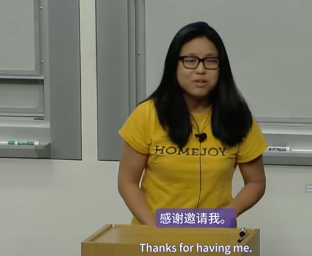

感谢邀请我。今天，我将谈论如何从零用户发展到拥有大量用户。我假设你此刻脑子里有很多好主意，并且正在思考下一步该怎么做。

今天早上，我写了这篇文章，其中很多内容都是基于我过去犯过的错误。正如 Sam 提到的，我在 2010 年参加了 YC，花了三年时间，经历了多次转型和重新开始，并学到了很多关于创业的经验。如果我在 Homejoy 之后创办另一家初创公司，我知道哪些事情不应该做。因此，很多内容都是从失败中总结出来的，告诉你不该做什么，并从中推导出你应该做什么。

需要提醒的是，这些建议只是方向性的指导。虽然这些建议都是朝着正确的方向发展，但每个企业都是不同的，你也是不同的，我不是你。所以，请把所有事情都记在心里。

因为这是一门大学课程，当你开始创业时，你应该有大量的时间专注于创业。我不是说你应该辍学或辞职，而是你应该有很多连续的时间，真正专注于沉浸在想法和开发问题上，或者开发你试图解决的问题的解决方案。例如，如果你在学校，最好每周有一两天时间专注于你的想法，而不是每天只花两个小时。这有点像工程课中的编码，有很多上下文切换，能够真正集中注意力并沉浸其中是非常重要的。

当我写这篇文章时，我首先想到的是，大多数人，尤其是新手，常常会犯的错误。很多人有一个非常棒的想法，但不想告诉任何人。他们只想不停地建造，然后在 TechCrunch 或类似的平台上发布，期望获得大量用户。但实际情况是，由于没有收到足够的反馈，可能会有很多访客访问你的网站，但没有人会留下来，因为你没有得到最初的用户反馈。如果你足够幸运，银行里有一些钱，你可能会去买一些用户，但随着时间的推移，这些用户会逐渐减少，然后你就放弃了。这是一种恶性循环。

我实际上经历过一次这样的情况。在 YC 的时候，我甚至没有推出任何产品，也没有在 TechCrunch 上发布，这是你绝对应该做的事情。所以，你永远不想陷入那个循环，因为最终你会一无所获。

接下来，你有了一个想法，你应该认真思考这个想法真正解决了什么问题。比如，实际问题是什么？

所以他们的问题陈述应该是，你应该能够用一句话来描述它。然后你应该想想，这个问题和我有什么关系？我真的对这个问题充满热情吗？然后你应该想，好吧，这是我的问题。其他人也有这个问题吗？然后通过出去和别人交谈来验证这一点。

我犯过的最大错误之一是，我和我的联合创始人，也是我的兄弟，在2009年和2010年创办了一家名为PathJoy的公司。我们的目标基本上是，我们有两个目标。一个是创建一家让人们真正快乐的公司，并且创建一家非常有影响力的公司。因此，一个很好的替代方法是创建一家庞大的公司。所以我们想，好吧，这就是我们要解决的问题，让人们更快乐。

我们首先想到的是，谁是让人们快乐的人？而且，我们想出了生活教练和治疗师，因此为生活教练和治疗师创建一个平台似乎是显而易见的。但结果是，当我们开始自己使用该产品时，我们，我们，我们绝不是愤世嫉俗的人，但生活教练和治疗师不是我们自己会使用的人。它对我们来说毫无用处。所以这甚至不是我们遇到的问题，当然也不是我们非常热衷于开发的东西。然而，我们花了将近一年的时间来尝试做到这一点。

所以，如果你从t等于零开始，就像在你制造任何产品之前考虑这一点一样，我认为你可以为自己省去很多麻烦，避免做你不想做的事情。所以，假设你有一个问题，你可以陈述它。你从哪里开始？比如，你如何考虑解决方案？

所以你应该做的第一件事就是考虑你要进入的行业。不管这个行业有多大、多庞大，你都应该全身心地投入其中。有很多方法可以做到这一点。一是，真正成为该行业中的一分子。因此，这样做似乎有点违反直觉，因为大多数人说，如果你真的想颠覆一个行业，你就不应该成为其中的参与者。一个在一个行业工作了20或30年的人可能确实会固步自封，只是习惯了事情的运作方式，真的无法思考效率低下的原因是什么，或者你可以颠覆的事情是什么。

但是，作为一个刚进入这个行业的人，你真的应该花一两个月的时间真正了解这个行业的所有细节，以及它是如何运作的。因为当你深入了解细节时，你就会开始看到可以利用的东西，真正可以利用的东西，真正效率低下的东西，以及你可以削减的巨额管理费用。

举个例子，当我们创办Homejoy时，我们决定从清洁行业开始。我们刚开始的时候，我们自己就是清洁工。我们开始打扫房子，但很快发现我们的清洁水平很差。因此，我们说，好吧，我们必须多学习一些这方面的知识。于是我们决定去买书。我们买了一些关于如何清洁的书，这可能会有些帮助。我们学到了更多关于清洁用品的知识。但这有点像篮球，你知道吗？你可以观看和学习，也可以阅读有关篮球的文章，但如果你不训练，不投篮，不把篮球扔进篮筐，你就不可能打得更好。

因此，我们决定我们中的一个人必须去学习如何打扫。于是我们去接受专业人士的培训，如果存在某种专业培训计划的话。这意味着我们实际上是去一家清洁公司找工作。很酷的是，我在清洁公司工作了几周，通过培训学会了如何清洁。但更好的是，我学到了很多关于当地清洁公司如何运作的知识。从这个意义上说，我明白了为什么当地清洁公司不能像Homejoy那样发展壮大，那是因为他们很老派，而且有很多东西做得非常低效。从预约客户到优化清洁工时间表，任何事都做得非常低效。

所以，如果你处于像我这样的情况，有一项服务元素，你应该自己去做这项服务。如果你的工作与餐馆有关，你应该成为一名服务员。如果它与绘画有关，成为一名画家，从各个角度站在客户的角度考虑你想要构建的东西。另一件事是，你也应该对它有一定的执着。你应该非常执着地想知道，这个领域的每个人都在做什么。列出所有潜在竞争对手或类似类型的公司。谷歌搜索它，点击每一个链接，阅读每一篇文章，从搜索结果1到1000。

我找到了所有潜在的竞争对手，无论大小，如果他们是上市公司，我会去阅读他们的S1文件。我会去阅读他们所有的季度财务报告。我会参加收益电话会议。虽然其中大部分你不会从中得到太多，但偶尔你也会发现一些金块，除非你真的努力将所有信息都记在脑子里，否则你无法找到它们。所以，是的，你应该成为这个行业的专家。当你在构建这个产品时，你不应该怀疑你是专家，这样当你构建这个产品时，人们才会信任你。

第二件事是确定客户群。理想情况下，在最终目标中，你已经构建了一个世界上每个人都在使用的产品或业务。但现实情况是，在一开始，你需要垄断某一部分客户群，这样你才能真正为他们进行优化。这只是一个关注和迎合的问题。不管是少女，还是青少年女孩，或者是足球妈妈。就像我说的，你可以把注意力集中在他们的需求上。最后，在你创建产品之前，在你编写代码之前，你应该真正地用故事板描绘出理想的用户体验，说明你将如何解决问题。这不仅仅是指网站本身。这意味着，客户如何了解你，无论是通过广告、口口相传还是其他方式。他们了解你，来到你的网站，进一步了解你。所有这些文字都在传达什么？你在向他们传达什么？实际上，当他们注册产品或购买服务时，他们得到了什么？在他们使用完产品或服务之后，有一个类似于评估期的阶段。比如他们给你留下评论，或者留下其他反馈，然后整个流程就完成了。

然后在脑海中想象一下完美的用户体验是什么样的。把它写在纸上，再把它变成代码，从那里开始。所以，你现在脑子里有了所有这些想法。你知道你想要争取的核心客户群是什么。你了解这个行业的一切。接下来你做什么？你开始制造你的产品。

现在大多数人使用的常用短语是，你应该建立一个最小可行产品（MVP）。我强调“可行”是因为我认为很多人跳过了这一部分，他们只是带着一个功能出去，然后整个用户体验一开始就很平淡。所以，最小可行产品基本上意味着，你应该构建的最小功能集是什么来解决你试图解决的问题。我认为，如果你仔细研究故事板，你很快就能搞清楚这一点。但同样，你必须与用户交谈，你必须了解潜在用户，你必须了解市场上已经存在什么，以及你应该构建什么来解决他们的迫切需求。

第二件事是，在将产品摆到用户面前之前，你应该真正地确定你的产品，一个简单的产品定位。你应该能够找到一个人，并且能够说，嘿，这句话可以完成X、Y和Z。例如，在Homejoy，我们从一些非常复杂的东西开始。我们是一个提供家庭服务的在线平台。我们从清洁开始，你可以选择，等等，然后它就一段落又一段落地展开。当你介绍时，我们希望潜在用户能够使用我们的平台，但他们在看到前两句话后就会感到厌烦。因此，我们发现，我们真的需要这句话。这句话非常重要，它描述了你所做的事情的功能优势。在未来，当你试图建立一个品牌或其他东西时，你应该能够描述情感上的好处和诸如此类的东西。但是，你从没有用户开始。你真的需要告诉他们他们会从中得到什么。因此，我们只是将定位改为每小时20美元来清洁你的房子，然后每个人都明白了。我们能够通过这种方式吸引用户。所以，你有一个MVP在那里。如何让最初的几个用户开始尝试您的产品呢？

首先，您的前几个用户应该是显而易见的人，与您有联系的人。您自己应该使用它，显然，您和您的联合创始人也应该使用它。您的父母、朋友和同事也应该使用它。除此之外，您还希望获得更多用户反馈。

因此，我们在这里列出了一些显而易见的地方，您可以根据所销售的产品进行选择。在线社区方面，现在 Hacker News 上有 Show HN，这是一个很棒的地方，特别是如果您正在为开发人员构建工具之类的东西。本地社区方面，如果您正在构建消费产品，有很多有影响力的本地社区邮件列表，特别是那些针对父母的邮件列表。这些都是您可能想要联系的地方。

顺便说一下，当我们去 Homejoy 时，我们实际上尝试了所有这些。我们自己使用了它，这很好，因为我们使用的是清洁服务，所以这很容易。然而，我们的父母住在密尔沃基，而我们住在山景城，所以这没用。朋友和同事有些在旧金山和其他地方，所以我们没有太多人使用它。我们实际上陷入了死胡同，无法说服很多人在一开始使用它。

于是，我们在山景城的卡斯特街上，利用夏天的街头集市来推广。我们会出去追赶人们，试图给他们发放清洁手册。几乎每个人都会拒绝，直到有一天，我们利用了一个非常炎热潮湿的日子。我们注意到，像任何集市一样，人们会被艺术品和工艺品吸引，但每个人都会被食物和饮料区吸引，尤其是在炎热的天气。

于是，我们决定介入其中。我们拿了冷冻的水瓶，开始免费分发冷水瓶。人们就来找我们了。我想我们基本上是让人们产生负罪感，预订清洁服务。但事实证明，大多数人并没有取消我们的服务。虽然有些人取消了，但大多数人没有取消。所以我们觉得，这很好。虽然我们得去打扫他们的房子，但至少，我们解决了一些问题。

我不建议参加展会，或者像上一批中的另一家初创公司，他们正在销售运输类型的产品，试图取代运输产品或邮寄东西的概念。他们会出现在美国邮政局，找到那些试图运送产品的人。然后让他们离开队伍，试图让他们使用你的产品，并让他们为你发货。所以，你只需要去人们真正出现的地方，但你的转化率会非常非常低。但要从零到一到三到四，这些是你可能必须做的事情。

好的，所以你有一些用户在使用你的产品。现在，你如何处理所有这些用户？客户反馈。首先，你应该做的第一件事是确保人们有办法联系你。所以，在homejoy.com上提供支持。理想情况下，有一个电话号码。如果您拨通了电话号码，最好确保您有语音信箱或类似的东西，这样您就不必一直接听。但无论如何，提供让人们反馈的方法是好的。

但你真正应该做的是走出去和你的用户交谈。离开你的办公桌，走出去工作。这看起来很辛苦，而且会很辛苦，但这是你将为你的产品获得最好的反馈的地方。这将告诉你哪些功能需要彻底改变、摆脱，或者哪些功能需要构建。

一种方法是发送调查问卷，在他们使用产品后获取评论。这没问题，但一般来说，人们只有在真正爱你或真正讨厌你时才会回应。你永远无法得到中间结果。所以，找到中间结果，而不是所有极端结果，就是走出去，真正地与使用你产品的人见面。

而且，这不是一个好主意，我见过有人出去见用户，然后坐在那里，就像一个实验室，几乎就像一个宗教审判。你就像在不断地戳他们，问他们为什么不这样做，为什么不那样做。这不会给你最好的结果。你真正应该做的是把它变成一场对话。了解他们，让他们感到舒服。因为你想让他们达到他们现在的水平，他们觉得，他们应该对你诚实，帮助你，为你改进，改善事情。

所以我发现带人出去喝酒之类的事情是一种很好的方法。我不确定你们是否都够大了，但你可以带他们去喝咖啡。因此，您还应该跟踪的另一件事是从宏观角度看您的总体表现如何。而做到这一点的唯一方法，也是最好的方法就是跟踪客户保留率。也就是说，今天进门的人数，明天、后天会有多少人回来，等等。通常随着时间的推移，你会关注每月的留存率。所以，今天进门的人，下个月他们还会使用它吗，等等。

这个指标的问题在于，收集这些数据需要很长时间，有时你没有一个月、两个月或三个月的时间来弄清楚。所以一个好的领先指标实际上是收集评论和评分，比如五星、四星评论。或者收集一些NPS的概念，即净推荐值。所以你基本上是在问他们从零到十分的评分，他们向朋友推荐你的可能性有多大？并计算NPS。因此，随着时间的推移，你会发现，当你构建新功能时，你应该能够看到评论或留存率逐渐上升，这意味着你做得很好。如果它在下降，那你做得不好。如果它保持不变，那意味着你可能需要出去弄清楚你应该构建哪些新东西。

另一件事是，我稍后会谈到定性的事情。但有一件事你应该警惕，那就是诚实曲线，也就是说，有些人会骗你。所以，我只是想，咱们就这么做吧。这就像与你的分离度，这就像诚实的程度。这是你的妈妈，这是你的朋友，这是随机的人。

所以我不知道你们是否都能看到这一点，但是，你的妈妈将会，她应该使用你的产品，但无论如何她都会为你感到骄傲。所以她可能会像这样诚实。你的朋友也会对你很诚实，并给你反馈，因为他们关心你。顺便说一句，这是假设你给他们的是免费产品。然后随着时间的推移，随着你变得越来越随机，这些人甚至不知道你是谁。实际上并不是这样的，但它有点像这样。人们不关心给你反馈，他们只是觉得，好吧，这是一个调查，类型，类型，类型，类型。所以你在获取用户反馈时应该考虑到这一点。

现在，假设你赚钱，你付钱。这是一个付费产品，好吧，我们就用绿色来做吧。所以，你妈妈会觉得，她会骗你，说，她会感到抱歉，说，这当然是个好产品。但你，事情会变成这样，也就是说，你的朋友会给你正确的评价，他们想要支持你，给你正确的反馈。但实际上，这些随机的人，如果他们真的认为他们付出的不值得，他们会告诉你，因为，这是钱的出路。所以，这是另一种说法，你会得到最好的反馈。这显然是，在这里。如果你让别人付钱，你会得到更多的反馈。所以这并不是说，你应该，第一次，让人们为它付钱。但这是说，如果你要制造一种产品，你最终需要，他们会为软件、硬件等付钱，你应该这样做。达到你可以非常非常快地做到这一点的程度。因为那时，你才能获得真正有意义的东西，帮助你在未来吸引更多付费用户。

好的。所以，你得到了很多反馈。在正式推出产品之前，你会做什么？所以你想要做的是，你总是想快速构建，你想要优化这个增长阶段。也就是说，你现在可能有十个用户。当你有一百万用户时，尝试构建功能是没有意义的，你想要优化下一个增长阶段，也就是十到百个用户。比如，你真正需要哪些功能？就这样去做。

有时，幻灯片上基本上有很多表达这个概念的方式。先手动，后自动化。我在构建市场时发现的一件事是，随着规模的扩大，流程随着时间的推移变得非常重要。但你不需要尝试自动化一切，也不需要创建软件，让机器人运行一切。你真正应该做的是自己手动完成，以了解应该构建什么。

一个例子就是当我们开始将清洁专业人员纳入我们的平台时。我们会让他们回答一堆问题。我们也会通过电话和当面问他们一堆问题。然后他们会去进行清洁测试，如果他们表现足够好，他们就会加入我们的平台。所以这需要对这么多候选人进行所有这些问题的询问。我们的录取率大约是3%到5%。所以你可以想象我们在漏斗开始时与之交谈的所有人，他们甚至从未进入过平台。

但随着时间的推移，我们了解到我们提出的某些问题是他们在平台上表现好坏的指标。我们通过数据收集，查看所有内容。我们可以在线填写表格。所以我们提交在线申请。他们可以申请，然后我们会在面试时问他们其他几个问题。所以，如果你试图让事情自动化得太快，那么你就会遇到这个问题，潜在的问题，无法快速迭代，比如申请表上的问题之类的。

第三点是暂时的崩溃比永久的瘫痪要好得多。在这个阶段，完美是无关紧要的。当你进入下一个增长阶段时，你应该知道，你在这个阶段试图完美的东西可能无论如何都无关紧要了。所以，当你在构建某些东西时，不要担心所有的边缘情况。只需担心谁是你的核心用户的一般情况。然后，随着你变得越来越大，这些边缘情况的数量会随着时间的推移而增加。你会想要为此而构建。

最后，要小心弗兰肯斯坦方法，这很好，你和所有这些用户交谈，他们会给你所有这些想法。你要做的第一件事就是去构建每一个，然后第二天去向他们展示，让他们更开心。你绝对应该听取用户的反馈，但是当有人告诉你要构建一个功能时，你不应该马上去构建它。你真正应该做的是，弄清楚他们为什么要求你构建一个功能。通常，他们建议的不是最好的主意，但他们真正建议的是，我在使用产品时遇到了你给我带来的另一个问题。或者，我真的需要解决这个问题，然后我才会付费使用这个产品。因此，请先弄清楚这一点。而不是堆积一堆功能，这样会完全隐藏问题。

所以，你有了一个准备发货的产品。有些人，在这一点上，会继续制造他们的产品，根本不发货。我认为，隐身和无休止地完善产品的整个想法是，模仿比创新更便宜，无论是时间、金钱还是资本。所以，我认为每个人都应该总是假设，一般来说，如果你有一个非常好的想法，无论你什么时候发布，都会有人迅速跟随你，并尽其所能地执行以赶上你。因此，没有必要隐瞒你通过获得大量用户而获得的所有用户反馈。因为你会觉得，你会感到偏执，担心有人会这样对你。我不想一直纠结于此，但这就是我今天在创始人身上看到的情况，这也是我经历过的事情。

我认为，除非你正在构建需要数百甚至数千万美元才能启动的项目，否则等待推出产品真的毫无意义。假设你有一个你觉得可以吸引大量用户的东西。那么，你现在该做什么？让我看看我的时间，20分钟，好吧。因此，我将在下一张幻灯片中介绍各种类型的增长。

但这里有一点需要注意，在早期，当你试图获得用户时，当只有你和你的联合创始人，或许还有其他几个人在建立公司时，你不会只是为了增长而创建一个团队。这将是一个人，只有一个人。所以，你需要真正集中精力。你需要，你应该，你会忍不住同时尝试五种不同的策略。但实际上你应该做的是，选择一个渠道，花整整一周的时间真正地执行它，并且只关注它。然后，如果有效，继续执行，直到它达到极限。如果不起作用，那就继续。通过这样做，你会更加确定，你正在研究的那个渠道，最初的假设是错误的。如果你在三四个星期的时间里只花三分之一的时间在这个渠道上，你就会知道。所以，一次学习一个渠道。

第二，当你找到有效的渠道，找到有效的策略时，总是要不断迭代。你可以把它交给别人，比如创建一个剧本，然后交给别人去迭代。但这些渠道总是在变化，从Facebook广告到谷歌广告，再到分销渠道，你无法控制的环境，一切都在不断变化。因此，你应该不断迭代，为此进行优化。

最后，一开始，当你看到一个渠道失败时，你可能不会放弃它，而是继续前进。还有很多其他事情可以尝试。但随着时间的推移，回到这些渠道，再看看。所以，举个例子，在Homejoy刚开始的时候，我们没有钱。所以当我们试图从MerriMate购买用户时，我们试图不从MerriMate购买用户，这只是竞争对手的一个例子。我们试图购买谷歌广告，以便快速吸引用户。我们发现MerriMates、MollyMates以及所有这些其他全国性公司都比我们有钱。他们从工作中赚的钱比我们多得多。因此，他们能够以更高的CAC（客户获取成本）为用户付费，他们能够以比我们高得多的成本获得用户。因此，我们负担不起。我们不得不转向另一个渠道，结果却是另一个渠道。但如今，我们在工作中赚了更多的钱，我们在某些事情上做得更好。所以我们应该重新考虑购买谷歌广告的想法，转向STM渠道。那又怎么样，这就是我的意思。而这一切的关键是创造力。效果营销，或者一般的营销或增长，可能非常技术化。但它实际上是技术性的，你必须有创造力。因为如果不是这样，如果它真的很容易和平淡无奇，就像现在每个人都在增长一样。所以你总是必须找到别人没有做的那件小事，并且把它做到极致。

所以，有三种类型的增长。是的，三种类型的增长：粘性增长、病毒式增长和付费增长。希望我有足够的时间来谈论所有这些。简而言之，粘性增长就是让现有用户回来并向你支付更多费用或更多地使用你的产品。第二是病毒式增长，也就是人们谈论你的时候。所以你使用一个产品，你真的很喜欢它，然后你告诉其他十个朋友，他们也喜欢它，这就是病毒式增长。第三是付费增长，如果你碰巧在银行有钱，你也许可以用其中的一部分钱来购买增长。

我要讲的中心主题是可持续性。可持续增长有很多含义，你基本上不是一个漏水的桶。你投入的金钱或时间会带来很好的投资回报。所以，就像我说的，粘性增长就是让你现有的用户继续购买东西。所以，这里真正重要的事情是你提供良好的体验，如果你提供良好的体验，人们会继续使用你的产品。如果你提供令人上瘾的体验，人们就会继续想要使用你的产品。衡量这一点并真正了解这一点以及您是否在提供良好的粘性增长的方法是查看CLV和留存核心分析。

现在，有人不知道群组分析是什么吗？还是我应该介绍一下？好的，我会介绍一下。好的，CLV是，有些人称之为LTV，称为客户生命周期，基本上是客户在一定时期内为您带来的净收入金额。因此，12个月的CLV是客户在12个月内为您带来的净收入。有时人们会查看三个月和六个月等等。所以，当我说群组时，基本上你看的是时间。所以，我们就把它称为时间吧。所以，这是返回您的用户的百分比。所以，在零时间，对，在零期，我们处于100%，所以。因此，群组也是客户细分等的另一个名称。因此，您可以查看女性与男性群体，例如佐治亚州亚特兰大的人群与加利福尼亚州萨克拉门托的人群。但最常见的是按月计算，因此群体等于月份。假设在这个练习中，我们查看的是2012年3月，我不知道。因此，2012年3月，100%的人，n等于100人。因此，100%的人显然都在使用您的产品，因为，您知道，这就是定义。

现在，几个月后，一个月后，您可能会发现，比例不对，但50%的人可能会回来。所以，您来到这里。现在，在第二个月，有多少三月份来的人在第二个月或两个月后回来了？这可能就在这里。因此，随着时间的推移，您将得到一条如下所示的曲线。您知道，最初总会有一些下降。人们第一次使用后不留下的原因是，您知道，它不值得，体验不好，诸如此类。然后随着时间的推移，你想要的是，你希望这个趋势随着时间的推移而趋于平稳，这样你的流失率基本上会降到0%。这意味着随着时间的推移，你的流失用户越来越少。而这些用户，有点像是你的核心客户。这些人会长期留在你身边。

现在，核心分析，或者，用它作为一种方式来显示你是否实现了持续增长，现在假设你，假设我们一年后，你已经建立了一堆东西，你绘制出同样的图表，希望你会看到这样的曲线。也就是说，在第一个时期，甚至有超过50%的人回来找你，越来越多的人坚持使用你的产品。一个非常糟糕的留存曲线看起来是这样的。第一次使用后，他们就非常讨厌你，甚至没有人回来。就像是零一样，我不知道那是什么样的生意。这显然是一个糟糕的业务。但我无法解释一个拥有这样留存曲线的好业务。

所以无论如何，随着时间的推移，当你考虑增加这个曲线的策略时，比如让它不断上升。你基本上想随着时间的推移查看这个分析，看看这个策略是否适合你。好的，这有道理吗？好的，很酷。

第二种增长是病毒式增长。和粘性增长一样，你也需要提供良好的体验。但最重要的是，你需要提供非常非常好的体验。比如，什么能让这些人在Twitter或Facebook或其他地方大声喊出来，告诉他们所有的朋友，并通过电子邮件向他们所有的朋友和家人介绍你？你必须真正提供良好的体验。除此之外，你需要为推荐计划本身提供非常好的机制。比如，你有100个真正想谈论你的客户，现在他们将如何谈论你？因此，从这个意义上讲，病毒式增长策略实际上就是建立良好的体验。但是，如果你有这个，那么你如何建立一个好的推荐计划呢？所以我列出了它的三个主要部分。

第一个是客户接触点，人们从中了解到他们可以推荐其他人。这可能是在他们预订或注册后，通常你会在注册后看到这些。无论出于什么原因，大多数人都会立即告诉你邀请他们所有的朋友，即使你以前从未使用过该产品。所以，这是一个客户接触点，就在你注册后。

更好的方法是，在你使用产品一段时间后，你发现他们参与度很高，然后向他们展示链接，让他们将其发送给所有人。另一个方法是，如果你做的是平台类型的游戏，比如 Homejoy，我们实际上会进入家庭内部。因此，另一个客户接触点是当清洁专业人员在家中时，他们可以留下东西。而且，我们也可以在那里向他们展示一些东西。所以你想，你想基本上把客户接触点和实际链接或其他东西放上去，告诉他们如何推荐他们的朋友，在他们高度参与并且你知道他们喜欢你的时候。

第二个是程序机制。这有点像，我见过的最常见的是 10 美元 10 美元。也就是说，如果你邀请你的朋友并且他们使用它并且他们得到 10 美元，你就会得到 10 美元。所以你应该尝试不同类型的机制，并尝试优化，任何对你有用的。它可能是 25 换 25，它可能是 10 换 0，它可能有很多很多这样的变种。

最后，当您的朋友点击链接时，当您点击推荐链接时，当他们返回网站时，优化他们注册的转化流程非常重要。因此，有时您需要以不同的方式向他们销售，或者向他们的朋友推荐他们使用这种方式，等等。因此，结合所有这些，您需要真正尝试不同的维度，并想出一个好的推荐计划。

最后，付费增长。付费增长的例子是，这里。这些是最明显的，但我相信你们还能想到更多。付费增长基本上就是，你碰巧有钱可以花。你可能有信用卡，不管怎样，但你可以花一些钱来获得用户。因此，正确看待付费增长的方式是，好吧，你要投入资金，你要冒险投入资金。你会得到什么回报？简单的思考方式是，您的 CLV（客户生命周期价值）、净收入、客户返还给您的金额，是否超过您的 CAC？您的 CAC 是客户获取成本的缩写。例如，您支付的费用，实际上幻灯片，这里的幻灯片有一个例子。假设您投放了一堆广告，这些是四个广告，在 12 个月内，客户对您来说价值 300 美元。当您点击这些广告中的每一个时，CPC 都会花费这些费用，所有这些，您知道，都会花费不同类型的钱。然后，当用户点击广告时，他们必须访问您的网站并进行注册或购买某些商品。所有这些广告的转化率各不相同。CAC（客户获取成本）可以通过CPC（每次点击成本）除以转化率来计算。因此，您会发现不同类型的广告有不同的获取成本。

要判断一个广告是好是坏，只需用CLV（客户终身价值）减去CAC，如果结果大于零，那么这个广告就是好的。如果结果为零，这也不错，但理想情况下希望结果大于零，这样您才能从中获利。

我们发现，尽管CLV相同，但转化率有高有低。有时，一些广告看起来不错，但最终效果并不理想。更高级的分析方法是将所有客户聚集在一起，但更好的方法是按客户细分进行分析。例如，如果您正在为乡村音乐建立一个市场，那么田纳西州纳什维尔的CLV将比捷克斯洛伐克的CLV大得多。这只是一个假设的情况。

因此，您需要确保在为不同类型的客户群体或细分市场购买广告时，了解它们之间的差异，不要将所有数据混在一起。

最后一点是关于回报时间和可持续性。我认为很多企业陷入困境，是因为当他们开始入不敷出时，生意就变得糟糕了。这与风险承受能力或风险偏好有很大关系，取决于您愿意承担多少风险。

假设您以300美元的成本获得一个客户，12个月后，这个客户的价值为300美元。也就是说，在第一个月，他们的价值为100美元。如果您等到12个月期末，他们会给您另外的200美元。但是，如果在第一个月您为他们支付了200美元，那么在12个月期末之前，您都会亏损100美元。这时，您可能会陷入潜在的不可持续增长，即在12个月结束时，客户实际上并没有给您带来200美元的收入。

最终，您的处境会非常糟糕，可能会耗尽资金。如果您用信用卡进行这项业务，您很快就会发现自己面临破产。因此，回报时间非常重要。一个安全的回报时间是三个月。如果您的风险偏好较高，喜欢冒险，或许12个月更好。但超过12个月是非常不安全的领域。

我还有多少时间？好的。那么，我就讲讲这个吧。

今天我要谈的是转型的艺术。很多人问我，Homejoy经历了什么。实际上，Homejoy的当前概念是我们完全建立并试图执行并试图获得客户的第13个想法。所以我收到的很多问题是，你是怎么想到第13个想法的？你是如何决定什么时候继续前进的？

因此，我能给出的最好指导就是看看这三个标准：一旦你意识到你无法成长，或者一旦你意识到，尽管你开发了所有这些很棒的功能，并与所有这些用户进行了交谈，没有一个能坚持下去，或者说，你没有任何好的高留存用户，或者这个业务的经济效益根本就不合理。那么，一旦你意识到这一点，你就需要继续前进。

我认为最棘手的可能是增长，因为有很多故事，创始人坚持这个想法，然后三年后，它突然开始增长。所以这里的诀窍基本上就是，你真正应该做的是，你应该在开始时就有一个增长计划，也就是说，理想情况下，你应该有一个乐观但现实的方式来发展这项业务。

所以，它可能看起来像这样。这是T，这是用户数量。在第一周，你只需要一个用户。在第二周，你可能想要两个用户，依此类推，你可以不断翻倍，一直翻倍。所以，在第一周，你应该尽可能多地做，在你需要的地方构建以获得那一个用户。然后第二周，你构建你需要的任何东西来获得两个用户、四个用户、八个用户。

一开始，应该是公平的，如果你有一个人们真正想要的产品，你应该能够很容易地保持这个增长曲线，只需四处走动并手动寻找人。当你需要每周100个用户时，你会需要更多的用户，你需要这些增长策略开始发挥作用。

因此，我通常会告诉人们，如果你完全投入到你的产品中，并且你真的非常非常努力地工作，那么如果你花三到四个星期连续没有增长，甚至是向后增长，那么也许是时候考虑转型了，不是从头开始，而是完全提出一个新想法。但你可能从根本上做错了什么，因为在创业初期，你应该一直保持增长。

但事实并非如此，乐观来看，这就像我创办Homejoy时制定和推出的增长曲线。但实际上，它看起来是这样的。所以，你要确保当你处于低谷时，比如这里，你不会就此停下，这就是为什么你应该等待两到三周。只要你继续努力，你最终会回到这里，而且随着时间的推移，你会看到这样的趋势。

太棒了，这就是转型，就是这样。

现在我可以回答问题了。我回答一个问题。

*网上有一个问题是，如果你的用户已经对某个产品比较满意，你如何让他们转向你的产品？*

好的，所以，转换总是有成本的。我给你举个 Homejoy 的例子。

Homejoy 实际上是在创造一个新的市场，因为我们的很多初始用户以前从未使用过清洁服务，所以让他们加入进来非常简单。很多使用清洁服务的人已经非常信任他们的清洁服务，因此让他们使用其他产品实际上可能是世界上最困难的任务。

因此，当你在构建产品并试图让人们转向你时，你真正需要做的是找到你的产品或你提供的产品比他们现有的解决方案更好或有很大差异的时刻。

举个例子，有人有固定的清洁工，也许有一天他们要开派对，第二天就需要清洁，于是他们选择了 Homejoy，而且大多数地方都有第二天的清洁服务，他们就会来 Homejoy 使用它，因为他们知道他们找不到固定的清洁工。一旦他们开始使用该产品，他们就会开始意识到使用 Homejoy 的优势，这些小优势加起来就是大优势。

所以，很多事情都是，留下现金或留下支票真的很烦人，所以能够进行在线支付更方便。能够根据自己的日程安排进行预订、取消和重新安排非常方便，等等。

所以，这真的很难。很多人在开发产品时，他们会想，这 50 件事比现有的解决方案稍微好一点。这真的很难，即使好处大于转换成本，也很难真正告诉用户这一点，并试图让他们把所有这些好处都归结为许多小事。最好只有一两件事情能让你与产品明显区分开来。

非常感谢。

