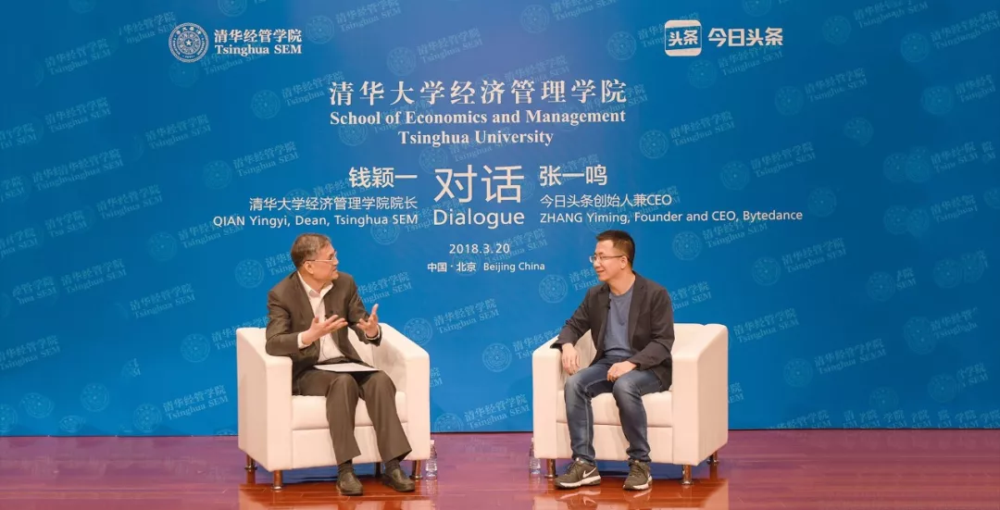
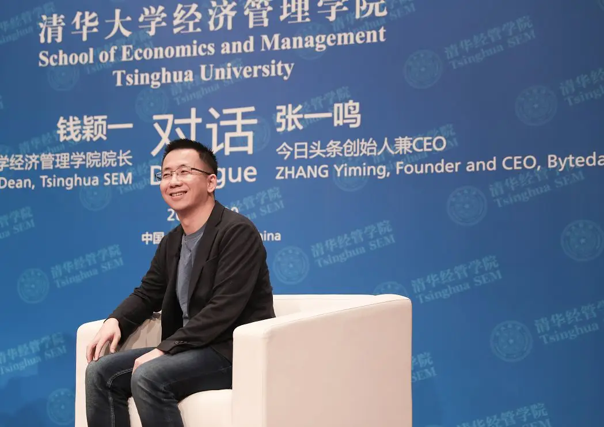

2018年3月20日晚，**清华经管学院院长钱颖一教授**与**今日头条创始人兼CEO张一鸣**展开了两个多小时的精彩对话。以下节选了关于张一鸣**求学、创业经历**和**个人成长感悟**的对话内容。

其中，张一鸣认为，**读传记让他更有耐心**，对于公司而言，保持年轻很重要，同时，创业者要有耐心，持续在一个领域深入，定会取得一定的成绩。钱颖一教授引用扎克伯格的话经典总结，对于创业：“**你应该找到一个领域，它是你自己感兴趣的，最好不是其他人感兴趣的**”。如下是精彩对话实录。

清华经管学院院长钱颖一教授对话今日头条创始人兼CEO张一鸣

**上大学看了很多“乱七八糟”的书**

**钱颖一**：今天晚上我们一起和清华学子做一个交流沟通，从你求学创业的经历开始谈。你是1983年出生，2001年考入南开大学。你最初报考了生物专业，入校时被调剂到微电子专业（即电子工程），后来自己转专业到软件工程（即计算机）。和大家分享一下，当初你报考选择志愿、被调剂和转系是出于什么原因？

&#x20;

**张一鸣**：为什么报考生物系？当时都说生物是21世纪的领头羊，所以非常热。我自己也感兴趣，高中的时候参加生物竞赛，看了一本北大老师写的《普通生物学》，对我影响很大。生物从细胞到生态，物种丰富多样，但背后的规律却非常简洁优雅，这对于你设计系统或者看待企业经济系统，都会有很多可类比的地方。

&#x20;

至于被调剂的微电子专业，我自己也对微电子非常感兴趣。但是学了一段时间之后，我觉得实验的机会太少，或者说从课本上学到的知识转化到实践层面比较难。正好我们大一、大二也学计算机，所以大二下学期我就转到了软件工程。学计算机有一个好处，只要有电脑、能上网，就可以自己获取学习的资源，你有想法的话就可以直接做出来，哪怕是一个在校生，也可以发布产品给广大用户，这点最终吸引我转向了计算机。（丰富的专业背景）对我来说也是很有收获的，创业的话各个东西都看，我中间还选修了工商管理。

&#x20;

**钱颖一**：从刚才简短的介绍当中发现，你的兴趣非常广泛，电子、生物、计算机还有工商管理，你觉得四年经历中有哪些是对你后来影响最大的？

&#x20;

**张一鸣**：我们学校在天津，不像在北京，可参加的课外活动不是太多。所以我有很多时间看各种“乱七八糟”的书。我在大一、大二的时候除了上课之外看了很多各种各样的书，传记占很大一部分。**阅读最主要的是对你的兴趣、审美有塑造**。**看了传记之后，我自己在后来的择业，对我的职业规划更有耐心**。你看到很多很伟大的人，年轻时的生活也是差不多的，也由点滴的事情构成，大家都是平凡人。**你要有耐心，持续在一个领域深入，会取得对应的成绩。我一直觉得世界上的书，如果只能选择看少数书的话，两类书值得看，第一类是传记，第二类是教科书**。

&#x20;

**钱颖一**：**读传记让你更耐心**，这是很重要的体会，现在不耐心是学生中很大的问题。听说你在大学的时候就对信息的流动效率很有思考，是什么情况下你去想这个问题的，想这个问题对你后来的创业有什么关联？

**&#x20;**

**张一鸣**：这个是我创业的主旋律。我本身是重度信息获取者，除了大学看很多传记，杂七杂八的书之外，中学也看很多报刊杂志，连中缝都会看。我当时觉得信息的传递是影响非常大的事情，由于信息传递效率的不同，对整个人类社会的效率、合作、包括人的认知造成的差别是非常大的。报纸刚被发明的时候，是非常奢侈的产品。相信过十年二十年，10后、20后这些人长大，知道当年为了传递一份信息，要通过刻字、油印，把几千几万字人工递送到几百公里外的地方，会觉得非常奇怪。

&#x20;

**信息的流动本身对社会有非常深远的影响，我甚至觉得它可能是各种其他效率的基础**。信息的流动速度或者信息的组织有序程度会产生很大的争议，我们学计算机的时候有做MIS系统还有存储系统、3D展现，也是围绕信息，IT行业就是信息产业。其中信息的组织和分发产生的争议最大。信息已经在那儿，如果没有有效组织和分发，其实产生的价值很有限。我毕业之后无论做搜索引擎还是社交网站，搜索引擎组织分发信息，社交网站以人为节点组织信息流动，还是做推荐引擎，以兴趣为颗粒度来组织分发信息，其实基本上都围绕信息分发。包括抖音也是更有利于信息被创造出来、被分发出去。我们公司内部有一个效率工程部门，专门优化公司内部的信息流动。

&#x20;

**钱颖一**：从2005年你大学毕业到2012年你创办今日头条之间的七年中，你有过丰富的创业和工作经历，曾在四家公司创业，协同办公、酷讯、海内、99房，参与创办过的四家公司，在此中间你还去微软工作过一段时间。那七年中你是如何设想和规划你自己，在实践中又是如何调整的？

&#x20;

**张一鸣**： 我之前都是偏技术创业，社交领域的创业让我有机会观察用户，在感性理解用户和产品方面有很大帮助。社交产品跟人打交道，很多用户直接给你反馈问题。跟王兴一起创业，那个创业非常注重产品品质，真的一个像素、一点点色差都非常敏感。独立创业的时候，99房是对今日头条创业的演练，99房那时候我当CEO，以前我把职责做完，还有问题向上汇报，但CEO不能向上汇报，要做独立的决定。招聘、辞退不能推给别人，这是对今日头条创业的演练。还是很幸运，最终在移动互联网浪潮起来的时候，我有以上这些经历。

&#x20;

**钱颖一**：**创业的时代和时机非常重要**，那么在你带着七年的经验创立今日头条的时候，你当时的初心就是想做一个头条这样的企业，还是只是一个偶然？

&#x20;

**张一鸣**：这个创业也是非典型，我做的搜索引擎公司经营得还可以，我主动选择重新创立公司，重新选择方向。后来我们的业务还是受到比较大的影响，转交给另外一个合作伙伴，其实是一个蛮主动选择的行为。

&#x20;

**钱颖一**：为什么有这个主动的选择？

&#x20;

**张一鸣**：主要看到移动互联网的浪潮非常非常大，而且这个浪潮甚至更早在2008年就感受到。2007年苹果发布第一款iPhone，我当时买到非常震惊，上面可以搭建一个网站或者写一个程序。放到口袋里面，很难想象一个网站躺在你的口袋里面，你可以写一个网站打开浏览器访问自己写的网站。把操作系统放到移动设备上非常具有颠覆性。

&#x20;

后来我们做社交网站的过程中，发现移动互联网的增速每周是万分之几的速度在上升，还很小，但是一直在上升。2011年我们做搜索的时候，上升速度非常快了，我们做了几款房产的互联网应用，也非常成功。2011年底基本判断整个信息的传播介质会发生变化，从纸媒为传播介质转向以手机为传播介质。实时性、双向性、多模，可以传输各种题材的信息，还带很多传感器，整个信息的传播有非常大的变化。在这种情况下，做一个垂直的业务相比和平台业务相比，做平台型产品的机会非常难得，就主动选择。

&#x20;

这个跟看传记也有关系，**人们看大的东西特别容易无感，对大的转折其实一般也无感，一般是事后才感觉**。2011年确实感觉科技的进步会让一个领域出现，预感到会出现重大深远的创新、深远的变化，这个变化甚至还未停止。现在过去六年了，从2011年到2016年整个上市企业的排行榜全部因为移动互联网发生变化，前五名的人均产值发生10倍的变化。我们现在做海外国际化，去了很多国家，发现移动互联网改变很多国家的经济、文化、社会面貌，这个趋势还没停止，还有视频化也是移动互联网上的子浪潮，这是移动互联网的网速提高带来的。

&#x20;

2011年我感受比较强烈，确实这是一个巨大的浪潮，一般来说人生只能过一遍，无法做审视，你身在其中。**看传记有机会去审视，虽然是他人的人生，但是你看的时候有代入感**。你看的时候，可以看到人在巨大浪潮中的变化。

&#x20;

**钱颖一**：这种感觉非常有意思，你主动放弃已经很成功的创业，去进行另外一个，这里面的启发从传记里面让你能感受到一些重大的变化。2016年你在央视参加一个对话节目中提到“**从公司层面不要和别人的核心领域去竞争，这样会牵扯你很多的精力，也没有优势。从另一个角度讲，除了竞争外，不做别人做得好的领域，要做另外的领域**。”这个思路非常具有开创性，让我想到扎克伯格去年走进清华经管课堂的时候也说过类似的话，学生问他，应该去哪些领域创业。他说，“**你应该找到一个领域，它是你自己感兴趣的，最好不是其他人感兴趣的**。”当时我对这句话也有一个补充，**可惜的是我们更多的看到的是自己对某一个领域有兴趣，往往是因为别人对这个领域也有兴趣，这样的话大家跟风做一样的事情，其实并不会很成功**。看来你和扎克伯格在这一点上是所见略同，与多数人非常不一样。他人的传记对你很有启发，你对想创业的同学们有哪些建议，比如刚才提到大的浪潮。

&#x20;

**张一鸣**：**大的浪潮看时机，浪潮一定有，但是有一定的周期性**。等待时机，不同的时代有不同领域的浪潮。确实要找到自己的兴趣，有人叫做兴趣，有人叫做志向，有人说激情、抱负。创业的机会是你用不同的视角看待世界，你看到一些不同的东西，这个东西你可能能领先别人看到，那你最终把它创造出来。

&#x20;

如果你把社会当成一个总的系统，你会发现你并不是在争夺他们的份额，而是在社会上创造新的增量。如果能做到这样的话，双赢。对于你来说，不是重复做事情，你不是copy一个业务。对社会来说，又有新的增量。如果不是你的兴趣的话，可能因为行业的波动就放弃了。如果是你的兴趣，相信你看到的东西，你能够跨越或者行业或者舆论的影响。

&#x20;

**钱颖一**：你讲的内容很多，也很有启发。我们一般人会看到时机、商机或者是浪潮，这些是客观的。从主观来讲，刚才讲到要从另外一个视角看同样的事情，别人的视角不一样，看出来的结果不一样，你跟别人都一样的视角看到的东西大家都看到了。这是第一。

&#x20;

第二，**兴趣和志向很重要**，给一个原因，为什么？**这些事情都是变化的，都是有波动的，不真是兴趣和志向非常执着的话，就变了。但是恰恰是因为你的执着，别人都变的时候你不变，你坚持了。**

&#x20;

**张一鸣**：其实我观察下来，我们招聘了很多人，我很多同学朋友在各种行业岗位上工作很长时间，社会上真正有强烈兴趣认真长期做某一件事情的人并没这么多，这个做到的话往往能做得不错。

清华经管学院院长钱颖一教授

**年轻比成熟更重要**

**钱颖一**：最后几个问题跟个人的成长感悟有关。我看过一篇报道，印象很深，你喜欢用坐标和矩阵描述现象，认为数学是物质事物之间最基础关系的描述，包括今日头条的广告盈利和创业步骤都有一套精密的算法推演。数学是一种思维方式，我原来是学数学的，数学对你的思维方式、工作方式是什么样的作用？我们对数学很重视，但是学生看不到它有什么用处，请你介绍一下。

&#x20;

**张一鸣**：我读书的时候也看不到（笑）。**数学确实很重要，但同时我觉得语文也很重要**。语文和数学都是描述事物的工具，有时候适合用数学描述，有时候适合用语言描述。语言和数学一样也是一种运算。比如法律问题，也有因果分析，概念的嵌套，跟写程序或者数学证明是非常类似的。语文在描述事物时，不同词的描述范围程度，也可以用坐标画出来。

只不过相比数学，语文的描述定量难度更高，很多问题，如果不能很准确的描述，就不能很好的解决，所以需要数学。比如推荐，我们给每个用户做用户画像，很多人理解是不是给每个用户打很多的标签、用很多词语描述，其实不是，而是把它看作是一个向量，在一个空间中的关系。（数学）对描述广告系统，包括对描述内容的多样性、收敛程度、泛化程度都很重要，这些都需要通过量化描述才能改进。

&#x20;

**钱颖一**：你是80后，在成功创业者中是非常年轻的，你们的很多产品大量用户是更年轻的人，悟空问答、西瓜视频，等等。你怎么能做到让90后、00后甚至10后都喜欢你们的产品？

&#x20;

**张一鸣**：这个其实蛮有挑战的，我自己很重视这个事情。前面有一个问题，您说**需求在变化，产品在演变，很重要的是保持年轻**，产品都是年轻人在用。

&#x20;

**钱颖一**：岁数不断在变，怎么保持年轻？

&#x20;

**张一鸣**：多用抖音（笑）。我们每两个月有一个全员会，有一个员工提问，公司如何变得很成熟？我的想法相反，**我们恰恰要保持年轻，不要对新事物随便持否定批判的态度**。**新事物出现一定有它的原因，一定要去体验，去尝试，去观察它的发展。**&#x6211;们对团队有很多要求，很早的时候，我发现管理团队不用抖音，很着急。我要求他们每个月拍两条视频，要获得多少个点赞，用强制手段让大家保持年轻。我们公司企业文化是始终创业，类似亚马逊的Always Day 1，永远像公司创业第一天那样思考，永远思考用户在想什么。

&#x20;

**钱颖一**：这一段话是对抖音最好的宣传，刚才一半多一点的抖音用户，听完这一段话，回去之后肯定用户大增，大家都要保持年轻。下面这个问题从我的角度讲，我是大学教师，**你觉得现在高校学生如何进取，才能符合未来科技企业创新的需求，特别是对人才培养有什么建议**？今天在座的也有一些老师。

&#x20;

**张一鸣**：**作为一个企业雇主，我们更喜欢能够学习多种知识能力的人**。比方说我们公司的产品经理很多都是工程师转型的，一部分是设计师转型产品经理，人力资源负责人是学电子转型的，行政的负责人是学计算机转型的。纯专业对口并不是这么关键，更需要的是能够学习多种知识，保持学习能力比知识的积累可能更重要。现在的互联网可以随时获取知识，你自己组织知识结构，更新知识结构的能力，我觉得可能更重要。

&#x20;

**钱颖一**：你在大学的时候对生物有兴趣，学了电子，又学了计算机，还学了工商管理，在大学的时候已经显示出，还喜欢看传记。

&#x20;

**张一鸣**：如果我有机会再学一遍，我会学更多。

&#x20;

**钱颖一**：再学一遍的话，说出两个想学的。

&#x20;

**张一鸣**：我想学更多数学。

&#x20;

**钱颖一**：我们数学还是有价值的。还有呢？

&#x20;

**张一鸣**：想学更多物理。

&#x20;

**钱颖一**：我们刚开一门新的物理课叫做《物理学简史》。马斯克在这儿说，他学了工商管理以外学了物理学第二学位，有道理的。还有一个问题在座很多人想问，你念书的时候还没有移动互联网，你刚才说读了很多书，系统性读书。现在因为移动互联网大家都是碎片式阅读，你对学生们的建议是什么？这样的话大家只看一些很短的消息、文章、15秒的抖音，是不是还是应该拿纸版书或者电子书系统看一下？你有什么建议？

&#x20;

**张一鸣**：我觉得看头条也好，抖音也好，悟空问答也好，西瓜视频也好，确实能丰富、扩展你的视野，能够补充很多信息。但是，**我还是觉得如果你要做基础知识结构的学习话，还是要看书，尤其要看教科书**。

&#x20;

**钱颖一**：你刚才说了两类书，一类是传记，教科书你说说为什么要看，教科书的特点就是系统性，但是看上去可能很枯燥。为什么教科书要看？

&#x20;

**张一鸣**：**教科书是人类知识最浓缩提炼的书**。你对某个领域感兴趣，看泛科普类的书，很多是泛兴趣阅读。如果以它的浓度而言，最提纲挈领的肯定是教科书。在学校，有老师督促完成教科书的学习还是非常重要的。

&#x20;

**钱颖一**：**没有什么别的能替代教科书，最系统化、结构化和严谨以及比较精炼**。问题讨论得非常之多，最后一个问题，回到2018，你认为今日头条2018最重要的事情是什么？作为CEO你在2018要解决的最关键的问题是什么。

**张一鸣**：2018对我们已满六年的企业来说，最重要的有三个事情。对公司本身来说希望继续完善公司，无论管理、文化还是系统。对业务来说，希望能够走向全球化。如果（全球化）能成功的话，对我们来说是一个里程碑的事情，对中国互联网企业来说也是标志性的事情。第三，作为一个社会的一分子，一家平台型企业来说，我们希望在企业社会责任这一块能做更多的事情。过去我们更多关心业务的成长，现在我们希望对管理团队，对业务负责人提出更高的要求。不仅关心业务，不仅关心全球化，也能够有更开阔的视角去认识、承担更多的企业社会责任。

