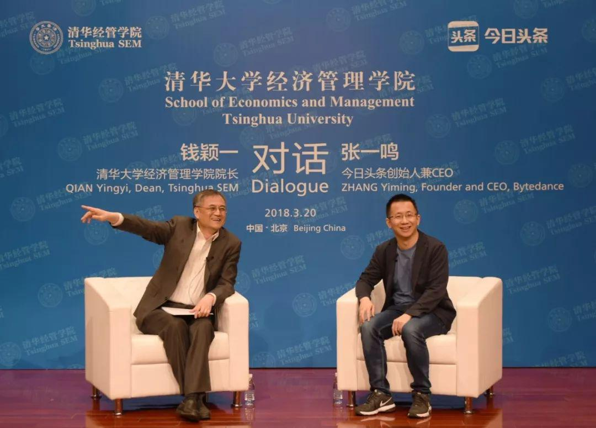
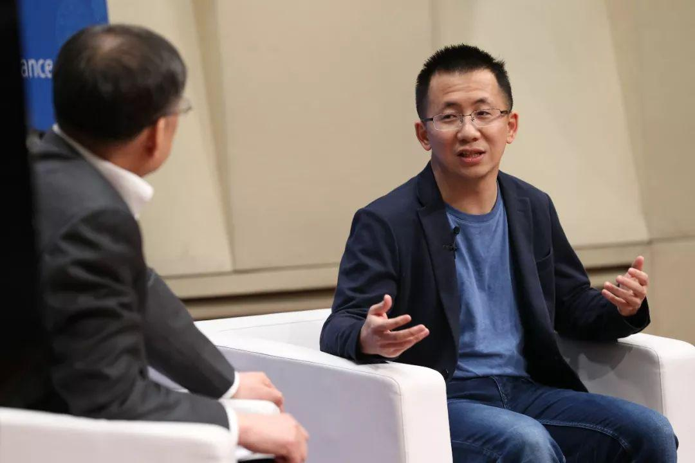

# 钱颖一对话张一鸣：超越习惯性思维，做别人认为不可行的事 | 对话实录（下）

清华经管学院 清华大学经济管理学院 *2018年03月27日 17:03* *北京*

**编者按**

2018年3月20日晚，**清华经管学院院长钱颖一教授**与**今日头条创始人兼CEO张一鸣**展开了两个多小时的精彩对话。以下节选了对话中关于**中国互联网企业的全球化发展**，**中国互联网的上半场 “BAT”的技术壁垒造成的“赢者通吃”与“TMD”下半场崛起的“脱颖而出”**，**整个两个时代以及创业者的对照**等精彩内容。

清华经管学院院长钱颖一教授对话今日头条创始人兼CEO张一鸣

**中国互联网企业的全球化**

**钱颖一**：今日头条非常重视战略，也很有它的独特性，关于互联网企业的全球化。你们2012年成立，2015年8月开始全球化布局，刚刚起步三年全球化布局，现在成立五年了，产品已经覆盖北美、日本、印度、巴西、东南亚等国家和地区，这个在互联网公司当中是比较罕见的。你们怎么这么早就考虑这个问题？这是怎么想的？
&#x20;
**张一鸣**：首先是因为，这波移动互联网浪潮，对于中国公司和海外外国公司，是相对同时起步的。在过去1998、1999年那一代，海外公司早出来两三年，中国公司“copy to China”，海外没有机会，只能靠本土化，在中国建立起自己的业务。我们觉得，**互联网是互联互通的，将来一定是全球竞争**，现在的中国公司已经和美国公司一样，是“Born to be global”的，**如果你不能做到全球配置，那你就不能运用全球的规模效益**，包括市场、组织、人力资源等等。在这个时代，中国本身也有机会，但利用全球配置的优势，才能取得更好的成绩。互联网的边际成本降低很快，同样的投入，别的市场的人口是你的5倍的话，长期不能持续竞争。我们看到前面有公司有好的先例，过去中国的电子制造、机械制造已经非常成功，ICT（信息通信技术）企业中，华为也非常成功。我们2015年启动全球化的时候，团队也不是这么自信，因为以前从来没有互联网平台型企业走向海外。
&#x20;
**钱颖一**：2015年你们坚持的理由是？之前有很多例子我们都知道。
&#x20;
**张一鸣**：最常见（不做国际化）的理由，就是每个国家和地区的文化不一样。但我一直以一个例子鼓励大家，就是华为。华为的产品既要售前，又要实施，又要部署，又要售后，既能卖到发达国家，又能卖到非洲。我跟同事们说，这么需要本土化的企业都能走向海外，我们肯定也可以。
&#x20;
**钱颖一**：你用这个例子激励大家，那个比我们要难的多，包括一系列的前前后后的服务，但华为成功了。
&#x20;
**张一鸣**：对于不同的文化、语言，产品是不是要非常多的本地化？其实不是。全球化最好的产品，即使是软件产品Windows、Office、Facebook、Youtube也都不需要，只要内容本土化就可以，产品是通用的。**我们的策略是，做全球化的产品，加本地化的内容**。其实有很多公司在做国际化，做到最后，就是成立一个国际化部，针对当地市场开发新的产品，我们不是，我们把愿景定成“全球创作和交流平台”，希望是一个统一的平台。&#xA;**&#x20;**
**钱颖一**：不是其它公司的思维，针对当地开发新产品。你就做一个统一的产品，怎么考虑的？
&#x20;
**张一鸣**：因为技术和推荐系统可以通用，配上一定的运营本地化，就可以适合当地。杯子都是一样的，饮料是不一样的。平台型产品可以做到。
&#x20;
**钱颖一**：2015年在内部讨论不一定有那么多信心，最后是你坚持要做，还是大家意见后来比较一致？
&#x20;
**张一鸣**：也有一些同事，有这个信心的，但大家都知道不容易。实际上确实也不容易。现在已经看到方向了，比较光明。现在在日本，每10个日本公民中就有1个我们的用户，月活一千多万，已经是很高的比例。我们在很多国家的应用排行榜上，都在前几名。包括我们的抖音海外版和头条的海外版，虽然还有很多不足，但是我们已经看到很大的机会。
&#x20;
**钱颖一**：你刚才提到华为，相信你对华为这家公司还是很敬佩，他们在全球化上，确实是中国企业的榜样。很多人说你做的是硬件，跟我们不一样，但是你看到的是，它做的很多事情非常复杂，它更难。能有这个看法的人是不多的。一般人说不一样，我们没有办法去学，但你看到它更难。
&#x20;
**张一鸣**：确实花了更大的工夫，我去了解过华为海外的进程。从1999年开始，到2004年之前，几乎没有任何进展。如果说没有韧性的话，认为中国企业不适合全球化，就做不好了。但华为2005年之后，海外进展非常快。
&#x20;
**钱颖一**：还要有耐心。你们刚刚起步两年，整个海外发展下一步的模式，现在只能说刚刚开始，有些设想。你们国际的竞争力与美国公司或者其它公司相比在什么方面？你们起了一个好头，接下来海外的发展模式是什么样的？
&#x20;
**张一鸣**：中国互联网企业在应用方面的探索，包括研发、运营甚至商业化方面，其实是走在前面的。主要的发展瓶颈是海外组织能力，成功实施过全球化的海外公司少。**我们应该发挥长处，继续把应用层面的创新、高效执行做得更好，同时学习海外公司，做好的管理，企业能适应全球化的运行**。全球化意味着招聘全球化的人才，把国际化的团队组建好，在这一点上目前还有一些挑战，来国内工作的话，其实有很多外国人不适应。
&#x20;
**钱颖一**：像你们这样的公司肯定全球化经营，需要全球化的人才招聘。这一点华为还是很有特色的，它的很多人才是遍布全球。你们在吸引人才方面不一定都到中国来。
&#x20;
**张一鸣**：我们也在很多国家建办公室，原则是“**Talent First**”，优先考虑人才。现在IT技术这么发达，人才在哪儿就把办公室开在哪儿。这个也是我们向华为学习的地方。
&#x20;
**钱颖一**：华为的科学家遍布全世界，你们现在也在这么做？
&#x20;
**张一鸣**：我们也在这么做。好处是能够根据每个国家的特点，招聘对应的人才。华为在俄罗斯建立数学研究所，因为东欧和俄罗斯数学非常好。我们现在在各个国家根据各个国家的特点，根据语言的分布做招聘。海外外籍员工很多。
&#x20;
**钱颖一**：你们在日本发展非常好，也在日本那边吸引人才，是本地的？

**张一鸣**：本地的。
&#x20;
**钱颖一**：不光是华人？
&#x20;
**张一鸣**：不光是华人，**真正能够做本地化运营，本地人才还是非常重要**。
&#x20;
**钱颖一**：华为现在70%的收入都是海外，你觉得今日头条在什么情况下可以说你是一家全球化的公司？在你心目中今日头条全球化公司是一个什么样的公司？
&#x20;
**张一鸣**：我自己心里面定了一个小目标，超过一半的用户来自海外。
&#x20;
**钱颖一**：当时华为说超过一半的收入，你们现在大概是百分之多少用户？
&#x20;
**张一鸣**：10%。
&#x20;
**钱颖一**：从10%到50%……
&#x20;
**张一鸣**：差距也不是这么大。
&#x20;
**钱颖一**：所以是一个小目标，从10%到50%需要多少年，保守点说。
&#x20;
**张一鸣**：要注意兑现的可能性，三年。
&#x20;
**钱颖一**：心中留有充分的余地。从2015年到现在，才两年多，从0到10%。从0开始特别难，但做成了，给了你很大的信心。刚才Musical.ly的例子，和前面讲的这几段都非常有意思：**我们每个人都有很多习惯性思维，包括全球化的一些习惯性思维，通过这个具体例子，以及你做出的成绩，都也让我们非常确信，客观的情况和我们惯性认为的，确实有很大不同**。

清华经管学院院长钱颖一教授对话今日头条创始人兼CEO张一鸣

**时代的变化——从“BAT”到“TMD”**

**钱颖一**：刚才讲的都是今日头条、你自己，现在我们往更大的层面来看一下：这个时代确实在变，**我们以前特别熟知的中国互联网的三大巨头，有百度、阿里、腾讯，合称“BAT”，现在出现一个新词“TMD”，代表新的三个巨头，头条、美团、滴滴**，这三家的估值加起来超过一千亿美元。
&#x20;
据说“TMD”这个词是2016年11月乌镇互联网大会期间，你、王兴、程维三个人有一个小聚会，这次小聚会以后，人们就打造了这个词“TMD”。先证实一下，是不是这么回事？
&#x20;
**张一鸣**：聚会上没有这个说法，媒体使用这个词的时间，大致能对得上。
&#x20;
**钱颖一**：2016年年底出现“TMD”这个词的时候，当时估值还没那么高，现在你们加起来是一千亿美元。这引出非常有意思的好多话题：从“BAT”到“TMD”，“BAT”中“B”是百度在北京，“A”阿里巴巴在杭州，“T”腾讯在深圳。
&#x20;
**张一鸣**：对，从北到南。
&#x20;
**钱颖一**：这次“TMD”不一样，三家全在北京，而且距离清华都非常近，这三家我都去过，你们最近，滴滴第二，美团第三，基本在三环到六环之间。这波公司为什么都在北京？是偶然，还是这其中有规律？
&#x20;
**张一鸣**：**北京整体的基础条件比较好，最主要是人才多。这次浪潮有一个特点，它比上次更快**。腾讯是2008年到的100亿美金，其实没有大家想象的那么快，腾讯创建于1998年，用了十年的时间。但“TMD”比这三家企业用的时间短很多很多，因为在北京这个生产要素足够充沛的地方，包括资金，人才，都不需要太长的积累时间，所以我们都活跃在北京，有一定的偶然性，但北京的基础条件这一点非常非常重要。
&#x20;
**钱颖一**：你们三个人读书的地理位置，两位在北京，王兴和程维，你是在天津，也不太远，地理位置也是有关系。有意思的是，程维是江西上饶人，你和王兴都是福建龙岩人，据说你们的父辈还都认识，这是一个小概率事件。龙岩是革命老区，这次让我们知道了，龙岩还出企业家，“TMD”里面两个人是龙岩的，给我们介绍介绍龙岩的环境是怎么回事吧。
&#x20;
**张一鸣**：龙岩的环境，应该说福建整体的数字化、互联网普及比较早，我上高中的时候，就有互联网普及了，这可能与王兴和我的创业都有一定的关系：你更早接触网络、更早产生兴趣，福建互联网普及比较早，整个福建的互联网企业家也是比较多的。
&#x20;
**钱颖一**：刚才说的是一些表面的事情，“TMD”的崛起其实特别有意义，它为什么有意义？我是学经济学&#x7684;**，经济学家一直对“BAT”的成功非常振奋，同时也有一种担忧：这种情况容易形成“赢者通吃”的局面，这样会对进一步再有更大规模的创新造成担忧**。对创业者来讲，（可能会认为）“我没赶上那个时候，现在都是BAT在这儿了，地盘被他们占了，我们没有机会了”。一个从经济学的角度，一个从个人的角度。
&#x20;
你创办今日头条，再加上美团还有滴滴，都是在这样一种环境下创业的，我特别想听听，你为我们解读一下，由于技术形成的平台业态，对新创业的企业是不是有一定程度的制约？今日头条、美团、滴滴在“BAT”强势下能够脱颖而出，那又是什么原因？
&#x20;
**张一鸣**：尽管互联网具有规模效应，但是实际上我们看到，现在创业或者投资取得成功的案例，还是越来越多，整个创业创新的趋势，还是越来越好。
&#x20;
**这首先是因为规模效应固然重要，但创新是更重要的**。好的环境也很需要，无论是法律也好，行业自律也好，需要领先者不能滥用规模效应，保持好的竞争环境。
&#x20;
第二方面，**无论头条也好，美团也好，滴滴也好，这拨企业的诞生跟移动浪潮有关系**。美团是在2010年，我们和滴滴是在2012年，美团高速发展也是2012年之后——当有大的变迁的时候，就像地壳运动，整个生态要重新发生变化，这时候新的物种有机会快速扩张。“大的浪潮来的时候”，是一个很重要的基础，大的浪潮往往是由技术创新带来的，比方说计算机、互联网再到移动互联网，大的浪潮是一个重要时机。浪潮是一浪接着一浪，只不过未来的浪潮是不是一定在互联网？不一定。所谓科技，是用新的、更好的方法去创造事情，既然是用新的更好的方法去创造事情，肯定有新的浪潮被创造。对于新的创业者机会总体来说还是更好。
&#x20;
**钱颖一**：即使BAT再强大，它也有没有看到的地方，或者说它有犯错误的时候。从你的经历来讲，在这种情况下你能崛起，很多人关心这个。
&#x20;
**张一鸣**：**首先是找准市场机会，领先半步看到蓝海**。**同时在一个创新的环境中，企业不进则退，企业保持对外部的敏锐其实是非常重要的**。雅虎伴随着互联网浪潮，抓住门户导航，但是没有抓住搜索，没有抓住社交，经过两个小浪潮没有抓住之后，雅虎就不存在了。这也是提醒企业要保持活力，不然就会被更具有活力的企业吞噬掉。
&#x20;
**钱颖一**：**下一个问题是两代人之间的相同和不同**：“BAT”当中，马云、李彦宏、马化腾分别出生于1964年、1968年和1971年，腾讯、阿里巴巴和百度分别创建于1998年、1999年、2000年。“TMD”中，王兴出生于1979年，你和程维都出生于1983年，美团早一点创建于2010年，今日头条和滴滴创建于2012年。这两组人，大致算一下，平均来说出生年份大概差了14年左右，创业时间差了12、13年左右，大概是这样一个差距。十几年算不上一代，但是在飞速发展的技术变化当中可以看成是两代。李彦宏、马云和马化腾中，两个学技术的，李彦宏学技术、马化腾学技术，马云学英语。“TMD”当中也是两个学技术，你和王兴都是学技术的，程维是学管理的。
&#x20;
你怎么看这两个时代的创业者？哪些是（你们之间的）相似之处，哪些是不同之处？当然时代不同，你做一个比较和分析。
&#x20;
**张一鸣**：跟他们都有接触，我们跟“BAT”的企业家学到很多东西，比如我会看《腾讯传》。**我们之间的相同之处，我觉得是：抓住用户体验，以用户为中心，给用户创造价值，重视人才。不同之处的话：首先，2012年前后创业的话，整个国内的创业环境是比较好的，互联网渗透率已经很高，用户一上来就适应（我们的产品和服务）。第二，我们做投融资、招聘容易很多。**&#x6211;相信1998、1999年互联网公司泡沫前还好一点，2001年、2002年招聘不会这么容易，现在互联网公司招聘竞争力还很强的，计算机系的分数据说越来越高，因为好就业。
&#x20;
**钱颖一**：主要跟我们学院竞争。
&#x20;
**张一鸣**：对，**第三，人才供应也越来越多。第四，新一代的企业家更早尝试全球化**，不仅我们尝试全球化，美团、滴滴也尝试全球化，因为我们起步并没有落后国外，几乎是同时的。**第五，更敢于开拓新业务**，他们这两家（美团、滴滴）互相开拓新业务。更不惧怕失败，容忍度高、条件好，总体来说会更有冒险倾向，业务上面快速展开的程度比之前更快。大家也可以看到，在2012年这拨企业成长速度更快。
&#x20;
**钱颖一**：你说的这点我很有同感，这六位企业家近距离有很多接触，**确实在TMD这三位里面心理上不太一样，你觉得你做的事情更敢尝试一些新的东西。**
&#x20;
**张一鸣**：2012年这拨企业家不大会遇到“企业没钱了”的情况，只要业务好，没有说融不到钱的，环境好了。
&#x20;
**钱颖一**：**有人比喻说“BAT”是互联网的“上半场”，“TMD”是“下半场”**，这两个半场之间在你看来有什么本质上的不同？能不能用人工智能来界定所谓的后手机时代、后互联网时代？**以前有“BAT”，后面有“TMD”，之后还有其它的“XYZ”**，在座很多人想成为未来“XYZ”其中的一个，很多95后、00后的学生，这是他们的梦想。在你看来，从时间的跨度上来讲，你是怎么来看上半场、下半场以及未来还有加场？
&#x20;
**张一鸣**：**“上半场、下半场”这个说法，我印象中出处是用户红利消失**——该有智能手机的用户都有了，该装上的软件都装上了，你就没有新用户红利了。从这个角度来看，典型的互联网应用是这样的。
&#x20;
如果再往下发展的话，简单通过市场手段、营销手段用户红利消失之后，要突破有几个方向：**深度，场景变深，为同样的用户提供更深、更强价值链的服务，场景变丰富，价值链变深。宽度，有两个方法，要么走全球化，要么开辟新的维度**，比如摩拜或者ofo，给自行车装上芯片，把物联网连进来，你可以认为它是延伸了，现在又有工业互联网IOT，这些都不在传统的消费互联网或者企业互联网领域，它们都延伸了。

**还有一个非常重要的维度，也是我对中国互联网科技企业比较期待的，过去我们做to C的业务，其实更有难度的是B端业务**，to C端的产品用的数据库、云计算还是芯片、支付系统，其实是ICT产业的更底层，如果C端做完可以往上游进入B端基础设施，如果能做成，是对中国科技企业的提高。
&#x20;
**钱颖一**：相比中国企业，其他国家企业在to B方面还是更有优势。
&#x20;
**张一鸣**：亚马逊在云计算，Orcale、WareForce在B端都非常好，**无论是获取用户红利还是市场营销还是社交传播，更多要打全球化，才能够进入上游更有难度的工作。**
&#x20;
**钱颖一**：上游是硬科技，这两个都有难度。或者不在传统的互联网，这个也是hardcore。从更广的角度看，目前全球独角兽企业最多的国家，一是美国，二是中国。**如果说10年前“BAT”还是跟在美国企业后面的话，那么今天“BAT”已经与那些美国领先企业齐头并进，而“TMD”则比同期创业的美国企业还有所超前。**&#x73B0;在“TMD”三家企业的估值比美国的前三家未上市的独角兽企业估值加起来可能要高，“TMD”三家估值现在加起来一千亿美元，美国Uber+Airbnb随便再加上一家未必到一千亿美元，你怎么看这个情况？另一方面，我们也有我们的特点也有我们的薄弱之处，你对这个事怎么看？
&#x20;
**张一鸣**：我们不能说有太大的优势。比如在打车这个问题上，属地监管，多数国家都被本地化，如果看单体市场，中国毕竟人口多，经济总量增长快，单体估值很高，而且中国有车的人口没有那么多。Airbnb全球化做得很好，但是是相对慢的生意。最终如果要取得更大的成绩的话，要么在价值链，要么在全球化方面取得突破。同样几年时间，我们不算超过更多，至少相当。“BAT”前几年基本是美国企业1/5的市值，百度上市可以对标Google 1/5的市值，当时已经很高了，现在跟中国整个经济体量提高有关系，还有基础环境，也有关系。

**张一鸣与今日头条**

张一鸣作为今日头条创始人兼CEO，是国内最受关注的青年企业家之一。2012年，张一鸣创立了北京字节跳动科技有限公司，推出基于机器学习技术的个性化信息推荐引擎产品——今日头条，目前字节跳动旗下的西瓜视频、火山小视频、抖音短视频、悟空问答、musical.ly等产品广受用户欢迎，其中多款产品已经进入北美、南美、欧洲、亚洲等市场，并获得成功。
