2023年8月14日晚上19：00，雷军第四次年度演讲‘成长’在国家会议中心举行。

在三小时的演讲和年度新品发布中，雷军分享了过去30多年经历的几次关键成长和感悟，并宣布。同时，雷军公布了小米的科技理念：未来5年，小米研发投入将超过1000亿元。

同时，小米积极布局人工智能，在现场，雷军正式宣布手机端侧大模型初步跑通。此外，小爱同学也升级AI大模型，并开启邀请测试。

此外，雷军为大家带来了等一系列新产品，还有全新仿生四足机器狗 惊喜亮相。

人因梦想而伟大，又因坚持梦想而成长。一个全新的小米，正在驶向梦想的星辰大海。这条路上，小米将和所有勇敢的追梦者们一起前行。祝福大家历经岁月洗礼，梦想依旧熠熠生辉。

以下是雷军公开演讲全文，与你分享。

大家好，欢迎参加今晚的演讲。

这是我第4次的年度演讲活动。今天现场来了很多人，还有很多很多朋友正在观看直播，感谢大家参与！

两个月前，我参加了武汉大学今年的毕业典礼。

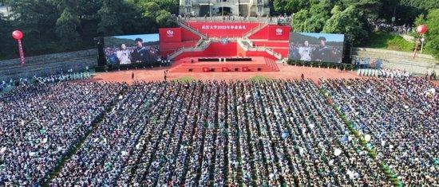

今年是武大建校130周年，现场有17000多人，特别壮观。作为校友，被母校邀请，在毕业典礼上致辞，对我来说，这是至高无上的荣誉。站在讲台上，我面对全校师生时，激动万分，当年记忆全部涌现出来。

### 一、武大往事

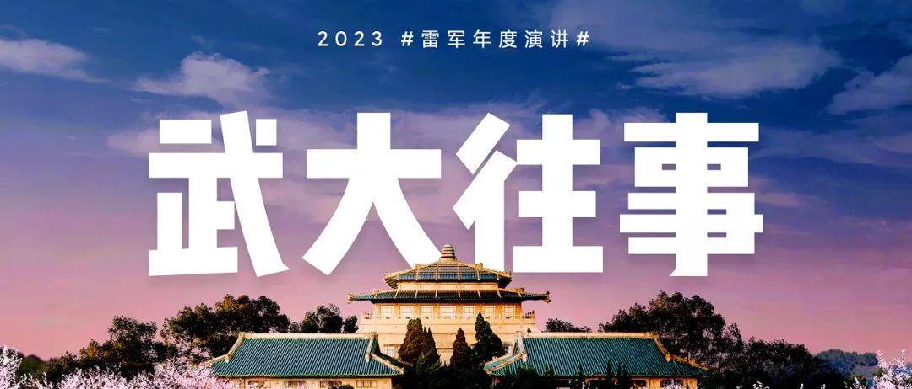

#### 1、梦想的起点

1987年，36年前，我考上了武汉大学计算机系。

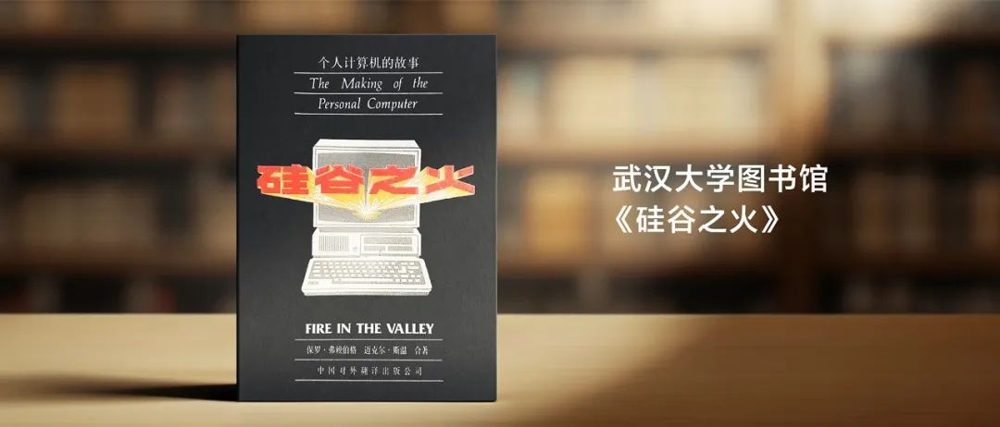

我在图书馆里看了一本书，《硅谷之火》，建立了自己一生的梦想。

看完这本书后，我热血沸腾，激动得睡不着觉。当天晚上，星光很亮，我在武大操场上，走了一圈又一圈，走了整整一夜。我心里有团火：我要创办一家伟大的公司。梦想之火，在我心里彻底点燃了。

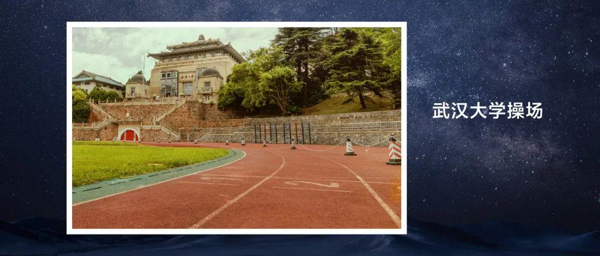

但是，一个大一新生，一个刚从县城出来的年轻人，什么也不会，什么也没有，就想创办一家伟大的公司，谈何容易！

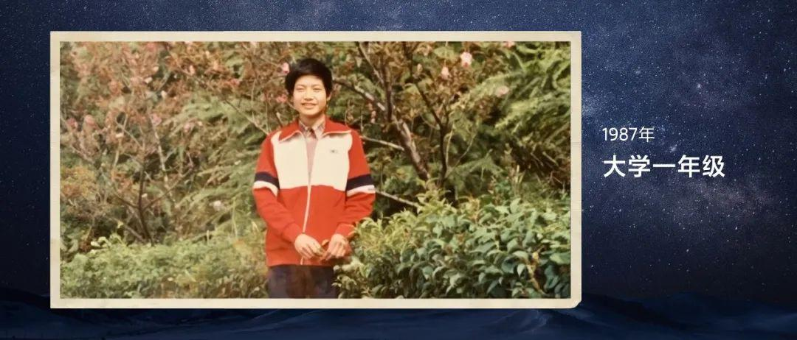

这么离谱的梦想，该如何实现呢？我完全理不清头绪，干脆就不想了，还是先把书读好。

#### **2、第一个目标：两年修完所有学分**

如何才能把书读得不同凡响呢？我琢磨了一个当时很夸张的目标：两年修完大学四年所有学分。那个年代，学分制刚刚开始，这样的想法，还是石破天惊的，很少有人想到。

当年我是如何做到的？今天时间有限，我给大家讲讲如何搞定三个难点。如果你正好在读大学，也许还用得上。

* **第一，如何选课？**

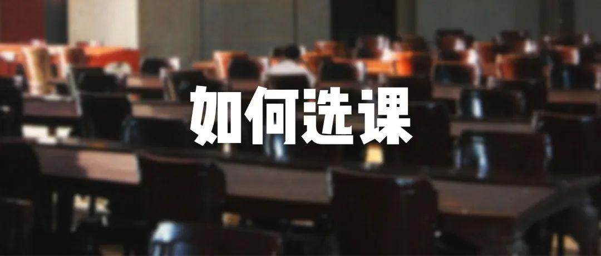

上两倍的课，写两倍的作业，过两倍的考试，这是用地狱模式上大学。辛苦不要紧，关键是如何选课。我自己琢磨好久，还是一头雾水，下决心找个人问问！

我多少有点社恐，当时也是没办法，厚着脸皮，到大三大四同学宿舍，挨个敲门找老乡。

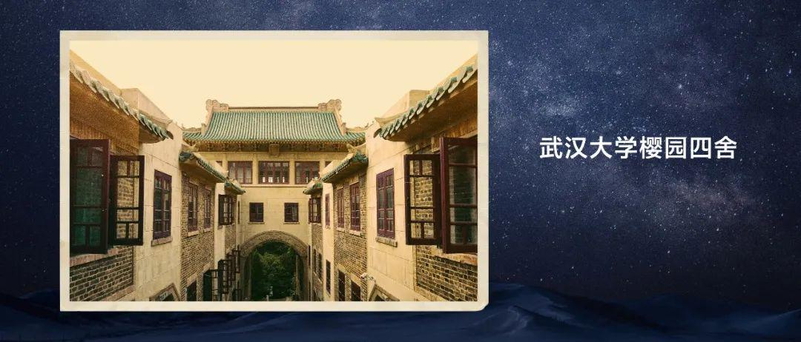

这招在大学里特别好使，我很快就找到了几个，学长们特别热情，讲了几个小时：把整个课程体系都讲了一遍，哪些课容易，哪些课难，哪些课必须先上、哪些课可以后上，最后还八卦了各个老师的奇闻逸事。走的时候，他们还把用过的教材和教辅，甚至课堂笔记，都打包送给了我。

这次聊完，我感觉突然开了天眼，大学怎么读，我基本清楚了。

就是这次经历，我有了一个特别重要的收获：**遇到问题，第一时间找个懂的人问问。**&#x5F88;多人觉得，自己遇到的问题，只能自己琢磨、自己搞定。实际上，无论你遇到什么问题，别人可能都遇到过，都解决了，甚至都有标准答案，你只要找人问问就可以。

* **第二，如何自学？**

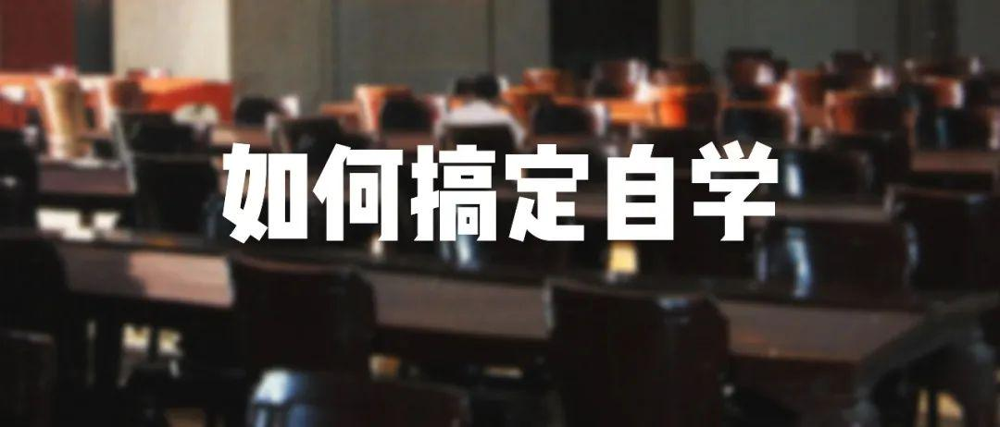

上两倍的课，这意味着大量课程要靠自学。我们计算机系是从数学系分出来的，相当于半个数学系，课程特别难。很多同学觉得《高等数学》很难学，其实，我们是不学《高等数学》的，我们学的数学系的专业课，比《高等数学》难多了。

自学的时候，经常遇到看不懂的地方，一卡就卡很久，特别痛苦。怎么办呢？只能硬读，就是硬着头皮读，读着读着，终于开窍了：

**遇到实在看不懂的，先跳过去，咬着牙往下读，像看小说一样，坚持从头读到尾；一本书，这样反复多读几遍，基本就能搞懂。**

后来我才明白了其中的道理：知识不全是线性的，大部分是网状的，知识点之间不一定有绝对的先后关系；前面内容看不懂，跳过去，并不影响学后面的；后面的学会了，有时候更容易看懂前面的。

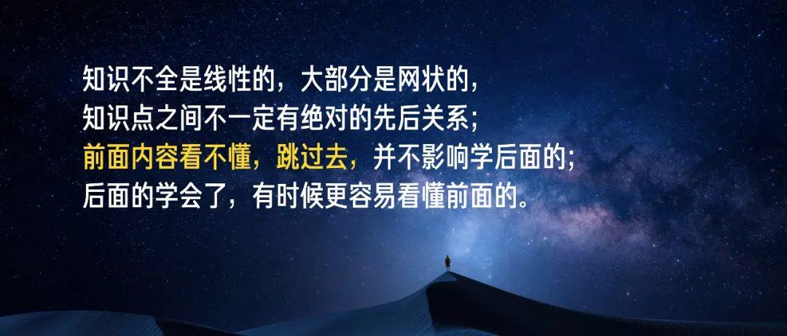

在这里，我想多说几句：今天的社会，瞬息万变，光靠学校里学的知识肯定不够；只有养成终身学习的习惯，才能应对未来所有挑战。终身学习就是要靠自学能力。

* **第三，如何搞定点名？**

*

修两倍的课程，上课时间肯定会冲突。一旦缺课，就怕遇到老师点名。在大学，点名是大事。怎么办呢？

老师点名的目的，就是怕大家不认真学习。我想出的办法是，如果我能给老师留下深刻印象，让他知道我没有偷懒，应该就可以了。

于是，上课时，我直接坐到第一排，坐到老师很容易看到的地方；老师提问的时候，我总是第一个举手；课间休息时，有不懂的地方，我也主动找老师请教。

经过我的努力，系里大多数老师对我印象都不错，缺课就不是事了。就这样，我克服了重重困难，终于搞定了四年所有学分！

在这个过程中，武大的老师们特别友善，给了我很多指导和帮助，每每想起来，内心都充满了感激！

#### **3、第二个目标：成为优秀的程序员**

我学的是计算机，光修学分是不够的，把程序写好才是硬道理。

所以，我定的第二个目标：成为一个优秀的程序员。

30多年前，电脑非常少。大一时候，全年级同学上机实践，只有一台68000小型机。四十多年前的小型机，性能远不如十年前的手机，还挂着 20多台终端，慢得令人发指。

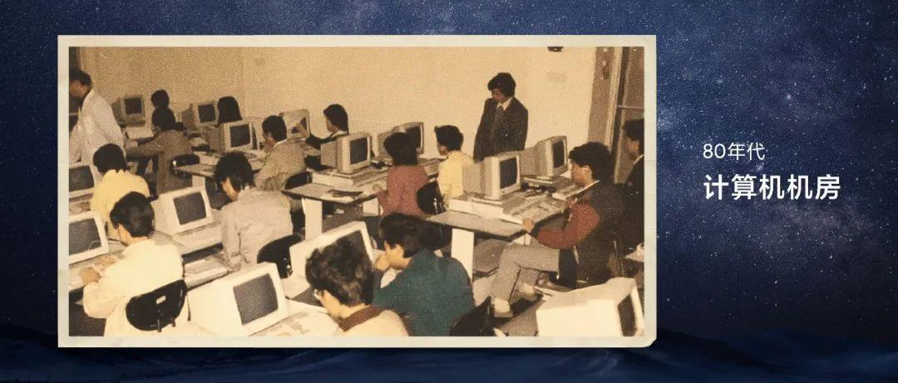

就是这样的条件，还不能放开了用，上机还需要凭票，每个人一周只有两张，每张2小时。

每周就几个小时时间，时间太短了，要把程序写好，实在太难了。

于是，我有空就跑到机房门口排队，蹭电脑。碰到同学没来，我就可以捡漏。如果实在排不上，我就站在边上看同学上机，过过眼瘾。如果遇到同学不会，我就去指导一下，特别有成就感。

为了有效利用上机时间，我每次都提前在纸上把代码写好，到了机房后就可以直接输入了。怎么输入更快呢？我想了一个馊主意：用打印纸把键盘拓下来，贴在课桌上，然后，无论上什么课，一边上课，一边敲桌子，偷偷练打字。过段时间，我发现周围的同学都这么干了。上课的时候，经常听到有人敲桌子，把老师都搞懵了。

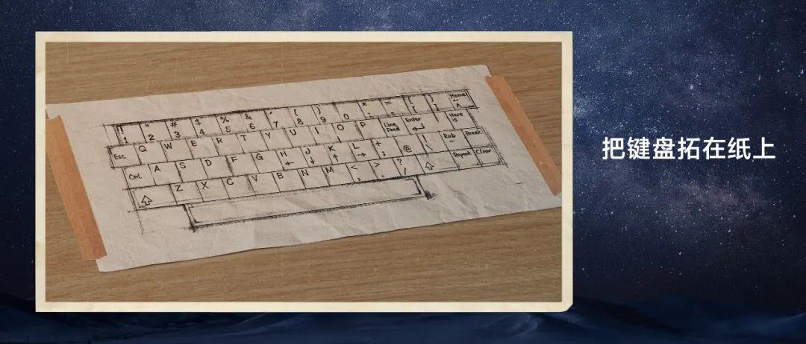

实在没电脑用的时候，我还有一个绝招：在纸上写程序。教材中的示范程序，往往都是写得最好的。我合上教材，就在纸上用自己的方法重写所有示范程序，反复写，直到写到同样的水平。

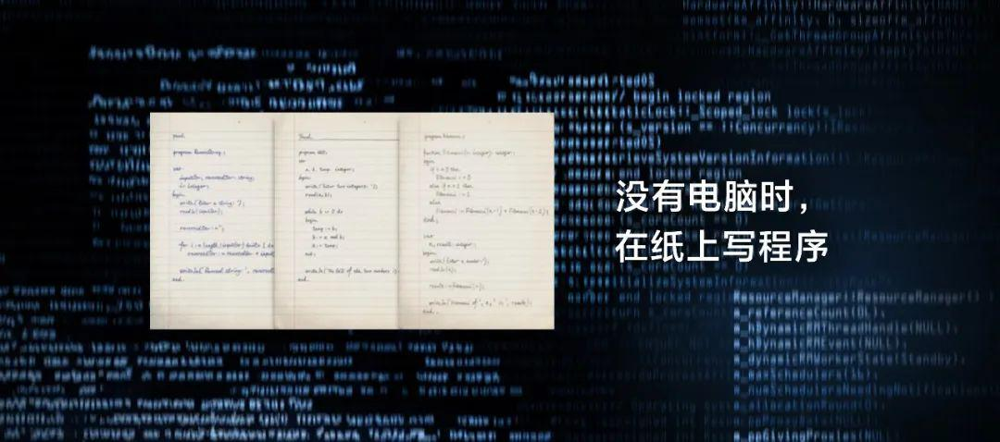

我上的第一门编程课是《Pascal 语言程序设计》。等我上大二的时候，有同学来告诉我，我写的 Pascal 作业被老师编入了新版教材。我非常高兴，我写的程序得到了老师的认可。

后来我就开始在老师的实验室帮忙做课题。在实验室的电脑前，熬过一个又一个通宵，就逐步练成了同学眼里的“技术高手”。

几年前，我在知乎上还看到了一段汇编语言的代码，这是我在大二时候写的。这是DOS系统上的内存管理工具，叫RI，当时，这个小工具在国内很火，用的人很多，我索性就全部开源了。

时隔三十多年，现在还有人讨论，作为一个程序员，我挺自豪的。

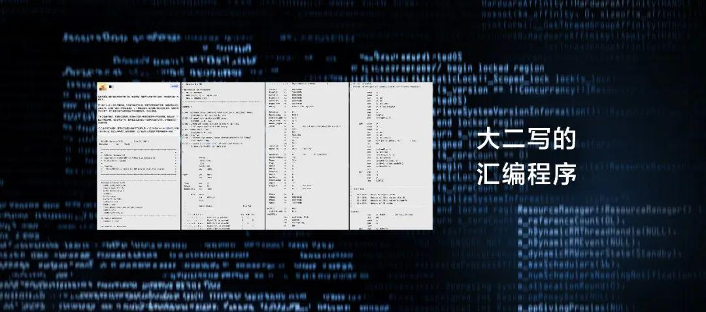

#### **4、第三个目标：在学报上发论文**

接着，我挑战第三个目标：在一级学报上发篇论文。对在校的大学生来说，这个目标相当困难。

我去找我的老师张德向教授请教，他建议我把之前研究计算机病毒的思考整理一下，写成论文试试。

那个时候，国内刚刚经历了第一次计算机病毒大爆发。我花过不少时间琢磨，甚至还写过一款杀毒软件，算国内最早一批吧。

这个就算学术成果吗？我心里没底，但还是按张老师的建议，壮着胆子整理成论文。

那时论文都是写在稿纸上。我洋洋洒洒写了几十页，厚厚一沓稿纸。写完后，我拿给几个好朋友看，大家给我提了不少意见，有位同学最后说，字写得实在不怎么样，还告诉我，“字写得好看，机会就大”，于是，他自告奋勇、辛辛苦苦花了三天时间帮我誊写了一遍。

然后，我就把论文寄给了权威的学术期刊《计算机研究与发展》。差不多过了半年，我收到回信说，论文被录用了！

当时，我特别激动。真没想到，第一次投稿就录用了。更没想到，等到正式发表，已经是两年后的 1992年8月。据说这就是正常流程。

每次想到这件事，我都觉得：敢想敢干非常重要，年轻人要有年轻人的魄力，很多事情没有想象得那么复杂，去试试就知道了。

#### **5、梦想与成长**

这就是我在武大的求学生涯。

很多人年轻时都有类似的经历，因为一本书、一部电影，或者一个人，梦想就被点燃了。

我幸运的是，我真的把这个梦想当回事，想办法拆解成一个又一个可实现的目标，然后竭尽全力去实现。

梦想的力量极其强大，我想尽办法，把各种不可能的事情，变成了可能。

这段经历为我以后的人生奠定了坚实的基础。

### 二、创业之旅

修完学分后，我有了足够的时间，开始做一些有趣的事情。

#### **1、第一款商业软件**

大二五一假期，在武汉的电子一条街上，我认识了一位朋友，技术水平很高，他叫王全国，他是武大学长，比我大四岁，已经留校当老师，在校办的一家网络设备公司上班。

我经常跑到他们那里去蹭电脑，他们的电脑比实验室的好太多了，而且都是最新型号的。我在他们演示机上写程序，如果有客户过来咨询，我就帮忙接待和介绍。老师们一直以为我在那里打工，实际上，我就是在那里蹭电脑，没有工资，中午管个盒饭。

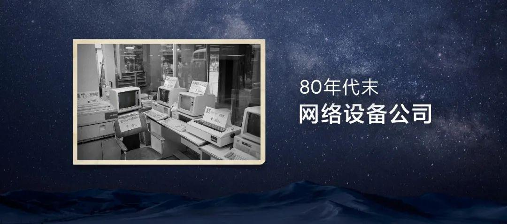

我和王全国越来越熟，他也认可我的能力，到了暑假，我们决定一起写款加密软件。

为啥写加密软件？主要因为这类软件技术上比较难，我们想做点难的事情。

每天公司下班后，把卷帘门一关，整个办公室就成了我们的天下。

我开着两台电脑，一台写程序，一台做测试，心情有点像段子里说的那样：“等咱有钱了，豆浆买两碗，喝一碗，倒一碗”，别提有多爽！

这段日子特别快乐，我们经常干到凌晨3-4点。困了，就直接睡在沙发上，办公室里正好有两张长沙发，我们俩一人一张。无论睡得多晚，第二天一定按时起床，因为公司九点要开门营业。

就这样，没日没夜干了十五天，我们俩都瘦了一整圈，产品如期干出来了。

这就是我做的第一款商业软件，叫 BITLOK ，在当时加密软件圈引起了不小的反响，很受程序员和开发者的欢迎。这款软件定价 2000多元，销量不错，我们持续升级了几代，卖了六七年时间，赚了不少钱。

第一次干，就大获成功，多少有点小激动。我自己还是非常清楚，如果不是和王全国一起干，多半没戏。大家想想，当时我大二，不到20岁，王全国已经留校当老师，他的成熟度、经验和资源都远超过了我。所以，一个人能力再强，也是有限的；找互补的朋友一块干，更容易成功。

我和王全国成了一辈子的朋友。30年后，我们两个老男人，还特意拍了张背靠背的 Kappa 照，来纪念我们第一次的合作。

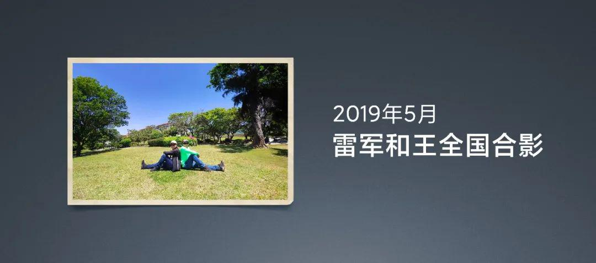

#### **2、第一次创业**

到了1990年8月，大三暑假，在武汉电子一条街上“混”了一年多后，我也算小有名气。

有位学长拉我一起创业，我答应得非常爽快，而且特别兴奋，终于有机会大展宏图了！

我们在宾馆里租了一个房间，房号103，公司取名叫“三色”。我们4个创始人，大家都是朋友，也不好意思谈股份，于是平分了，每人25%。

大家都渴望干番大事业。每天忙得热火朝天，经常一干就是一通宵。但一个很要命的问题马上来了：谁说了算？

凡事几个人商量，效率很低，而且意见不一致，经常扯皮。我们决定正式选一个董事长来决策。短短几个月，我们改选了好几回。结果，大家都轮流当了一遍。就我一个人没当过，主要因为年轻太小，压不住场。有个同学还保留了我当时的名片，前段时间拿给我看，职务是技术主管。

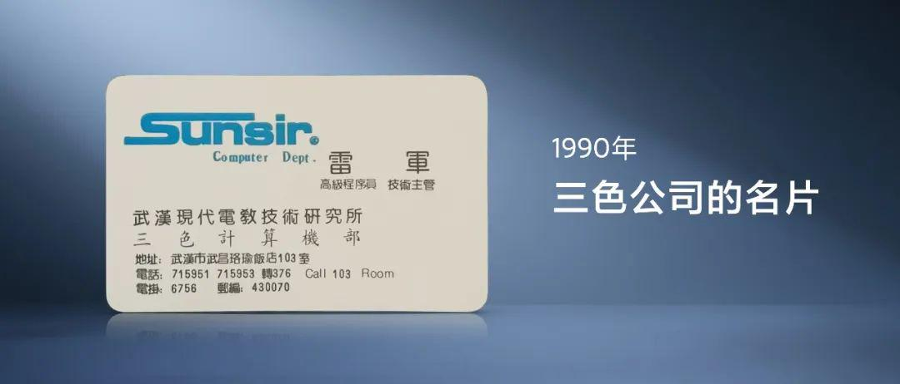

从卖电脑，到写软件，再到打字复印业务等……为了伟大梦想，我们不怕辛苦，啥生意都做。

现实很残酷，开头还赚了点小钱，随着业务越来越多，赚钱越来越难。

我在学校上晚自习时，经常被其他董事拉出去开会。几个董事都没啥经验，自然也商量不出什么好的办法。

再后来，公司发不出工资，饭都要吃不上了，这个过程非常煎熬。

有位董事吹牛，说他做生意不行，打麻将还行。我们就派他跟食堂师傅们打麻将，打了几次，还真赢了好多饭菜票，公司靠这个又撑了一段时间。后来，赢得实在太多，师傅们也不跟他玩了。

最后，公司终于熬不下去了，连散伙饭都没吃，就关门清算了。我记得，我分了一台286电脑，抱着电脑就回了学校。

第二天早上，走在校园里，感觉阳光灿烂，终于不用瞎折腾了。

我的第一次创业就这样结束了。我回来复盘了很多次，我们在商业上太幼稚了，完全没经验，比如我们创业，既没有说明白谁牵头，也没有搞明白做什么业务，碰到什么做什么，稀里糊涂就开始了。

三色的失败，给我浇了一盆冷水，让我彻底清醒了。办公司太不容易了，光有技术是不够的，还有太多东西要学，尤其是商业方面的基本功。

多年后，我见过一个大学生创业团队，四个股东，每人25%。我一看他们的名片，个个都是董事长。好家伙，四个董事长，我愣住了，问他们：你们到底谁负责？他们跟我说，他们都是同学，凡事商量着来。

那一瞬间，我彷佛看到了当年的我，当年的三色，我估计他们创业不会太顺，只能祝他们好运！

#### **3、创业与成长**

大学毕业后，求伯君拉我加入金山。时间过得很快，今年已经是金山创办35周年。金山是我真正成长的地方，有两位大哥求伯君和张旋龙，还有邹涛、章庆元、郭炜炜等一群兄弟，我们一起走了很多年。

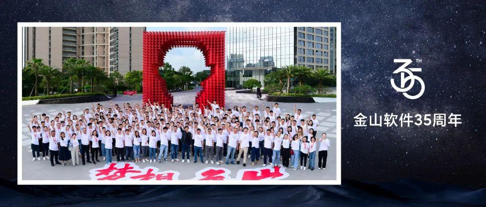

在金山内部，有句话我们经常讲，一个人可能走得更快，但一群人走，才能走得更远。这就是金山35年最重要的经验。

2010年4月，我再次出发，怀揣年轻时候的梦想，和一群伙伴创办了小米。小米的故事，我就不讲了。

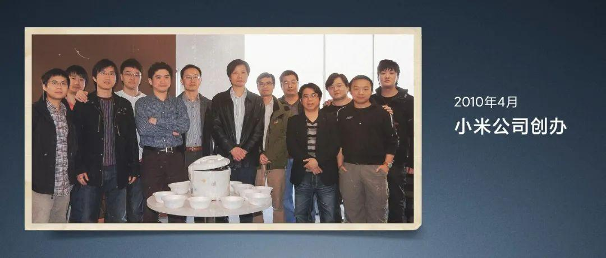

回望我自己过去三十多年的创业之旅，就是不断追寻梦想并不断成长的过程。

### 三、高端探索

谈到成长，过去三年高端探索之路，是近十年来我最痛苦、也是收获最大的一次。

小米的高端探索，从小米10开始。

刚开始很顺，首战告捷，但紧接着，小米11 就遭遇重大挫折。大家憋了一口气，花很大力气做小米12，但还是不达预期。大家没想到做高端这么难，更没想到投入这么大，沮丧的情绪在公司里弥漫开来。

#### **1、小米史上最激烈的争论**

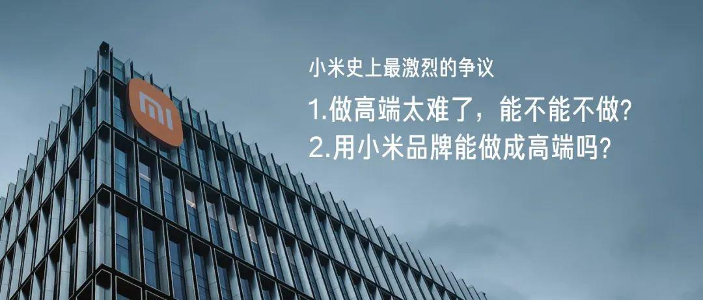

我找大家聊了很长时间，很多人的观点非常尖锐，让我都特别意外。

有人说，做高端实在太难了，我们能不能不做？

还有人说，小米品牌形象已经固化，能做成高端吗？我们要不换个新品牌？

那是去年春节放假前。我一直以为大家都支持做高端，真没想到有这么大分歧。聊完后，我心情非常沉重，焦虑得连年都没过好。

春节后上班的第一天，我紧急召集了一次讨论会。这就是小米历史上规模最大的专项战略讨论会，所有部门的总经理都参加了。

我鼓励大家畅所欲言，放开了说。也许刚过完年，气氛非常融洽，但争论非常激烈，从中午开到晚上。我反复说服大家：我们创业的梦想就是把小米做成全球知名的科技品牌。无论多难，我们一定要坚持使用小米品牌做高端。

还有，消费电子行业，竞争极其激烈，只有做高端，才能倒逼我们在技术上寻求突破，赢得未来生存和发展的空间。

最后，大家终于达成了共识，高端是我们发展的必由之路，更是生死之战！不能有任何动摇，必须死磕到底！我们正式把“高端化”定为集团战略！

#### **2、影像探索**

我举影像的例子，给大家讲讲我们探索的过程。

我们对影像一直都非常重视，2017年就设立了单独的相机部。

友商一直采用 DXO评测的排名来展示影像的效果和技术实力。当时，我们投入很大，心气也很高，目标简单粗暴：超越友商，DXO全球第一！

我们吹响了冲锋号。

在DXO评测中，我们首先进入前三，接着第二，然后做到了并列第一。为了夺取DXO第一，我们团队接着又花了两年多时间准备了小米11 Ultra，传感器是我们专门定制的，参数全部拉满，调校也下了巨大功夫。

发布前一天，我们终于收到通知：DXO评分，全球第一！

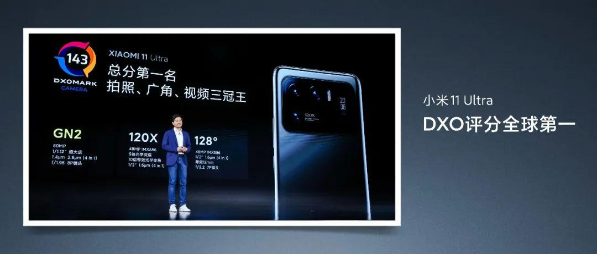

相机部沸腾了，这是大家期待已久的巨大成功。同事们有多激动呢？经过多年的奋斗，终于得偿所愿！都等不及产品的正式发布，当天晚上就举办了盛大的庆功宴。

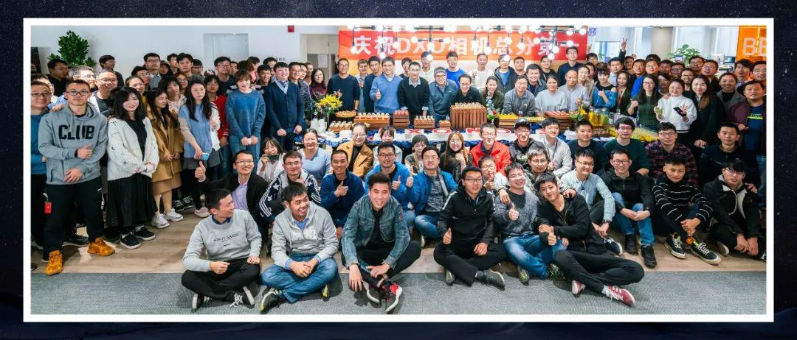

小米科技园也亮起了 DXO第一。我们都沉浸在成功的快乐之中。

结果，谁没想到，产品首发第一天，就被用户疯狂吐槽。这么牛的影像，“DXO全球第一”，为啥用户还不满意呢？大家都有些懵了。经过痛苦的反思，大家彻底明白了，参数到顶、DXO全球第一，并不代表拍照好，更不代表用户满意。

怎么才能拍出用户满意的好照片？我大学时候的经验告诉我，找个懂的人问问。

#### **3、小米和徕卡合作**

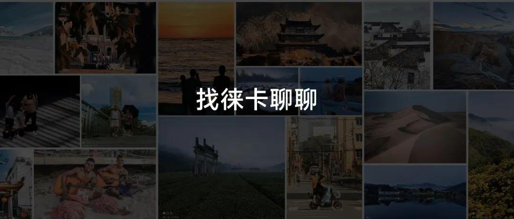

我提议找徕卡聊聊。

同事们告诉我，徕卡已经找过我们两次，被我们不同团队拒绝了。

啊？被我们拒绝了，还拒绝了两次？

我仔细了解了一下事情的来龙去脉，不是我们狂妄，而是同事们真的非常纠结：徕卡和其他品牌合作了五年，做得也挺好，我们能超越吗？如果不能超越，会不会成为行业笑话？

我的观点不同，我认为，只要徕卡是这个世界上最好的老师，只要我们用心学，我们的能力就一定会成长！我还专门问了很多摄影师，每个人都说，徕卡是影像界的传奇，地位和实力都是顶级的。

我们下定决心，正式和徕卡签约！

#### **4、摄影班**

签约后的第一件大事，你可能想不到：办班！办摄影班！

因为我深知，只有懂摄影、爱摄影，才能真正做好影像。我们正式请徕卡到小米科技园来办摄影班，我逼着核心团队成员全部来上课。

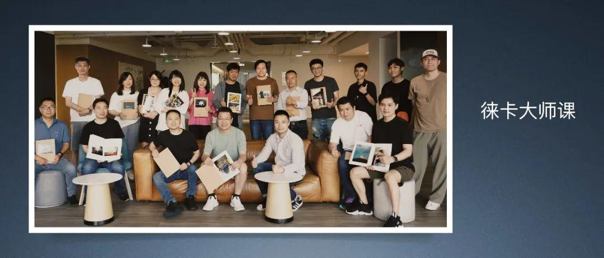

迄今为止，我们已经办了六期徕卡大师课。这次，我上课特别认真，上大学都没有那么认真，一节课都没缺过，因为

我是班长，不好意思请假。这门课上起来，挺不容易的。平时大家都特别忙，到了周末，还要上课；上课也就罢了，关键是还要交作业。

每次作业都把人整疯了。有一次赶作业，我一大早就跑到小米科技园的星巴克里，拍同事。不少同事不知道我要干嘛，咖啡没喝完，就全跑了。

摄影文化的种子一旦种下，很快就生根发芽。公司内部，大家组织了各种形式的摄影培训和员工影展，同学们参与的热情都特别高。

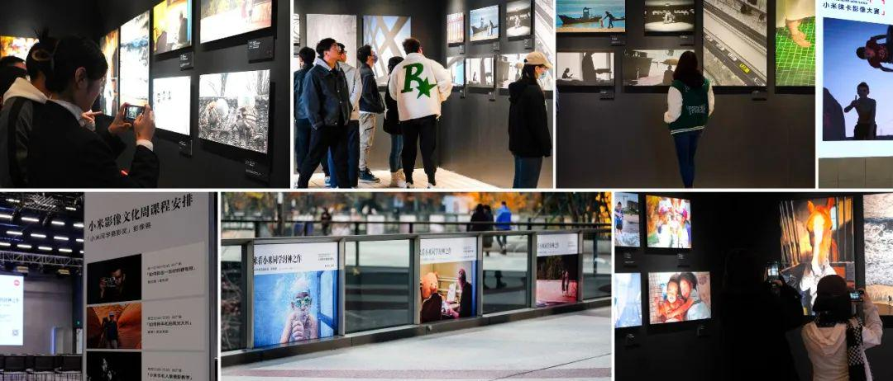

而且，我们还交了很多专业摄影师朋友。在长城上，还办了一次规模盛大的摄影展，大家看看。

#### **5、徕卡双画质和摄影套装**

随着我们对摄影文化的了解，加上徕卡的合作，我们坚定选择了人文影像的方向。并下定决心，在手机上做出原汁原味的徕卡影像。

这个决心并不好下。目前手机上的主流风格，色彩偏鲜艳，虽然有点假，但第一眼确实好看。徕卡影调，很有人文感，乍一看，不那么讨喜。万一大众用户不认可，怎么办呢？

我们和徕卡反复商量，最后，我们建议：在做好经典徕卡影调的基础上，再为大众用户设计一套“徕卡生动”。徕卡非常惊讶，小米居然有这样的决心，愿意花两倍的研发投入来做好一部手机的影像，他们欣然接受了。

徕卡双画质，就这样诞生了。

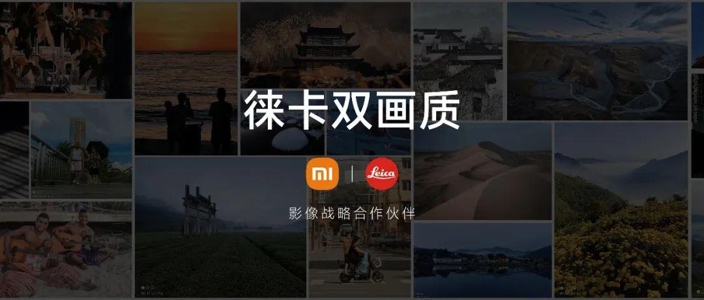

首款搭载徕卡双画质的手机，小米12S Ultra，发布后效果相当好，大众用户喜欢，摄影师也特别喜欢！

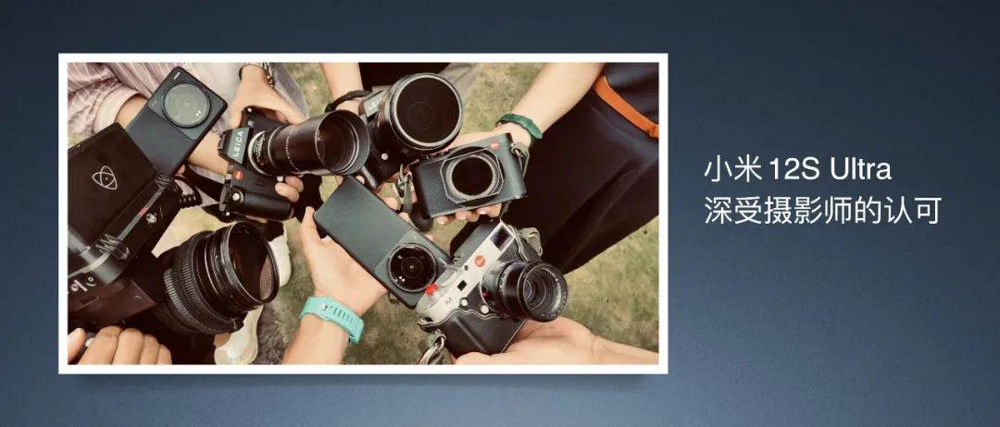

我记得，一个摄影师朋友，看样片的第一眼，就竖起了大拇指，他真的没想到手机可以拍出这样的质感，说“这款手机太牛了，这真徕卡！”。后来，我们干脆把这句话做成了海报上的广告词。

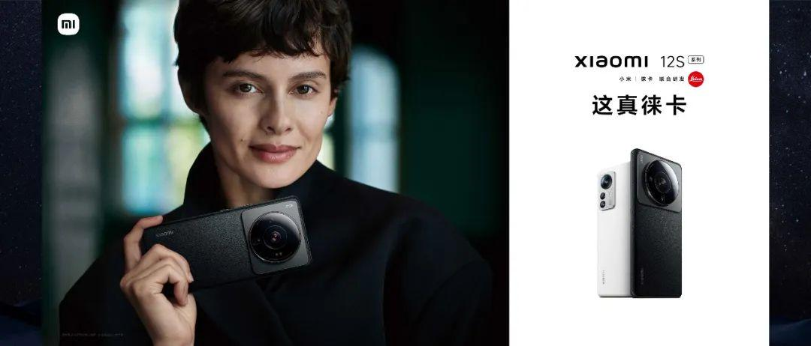

还有一个小故事，关于摄影套装的。

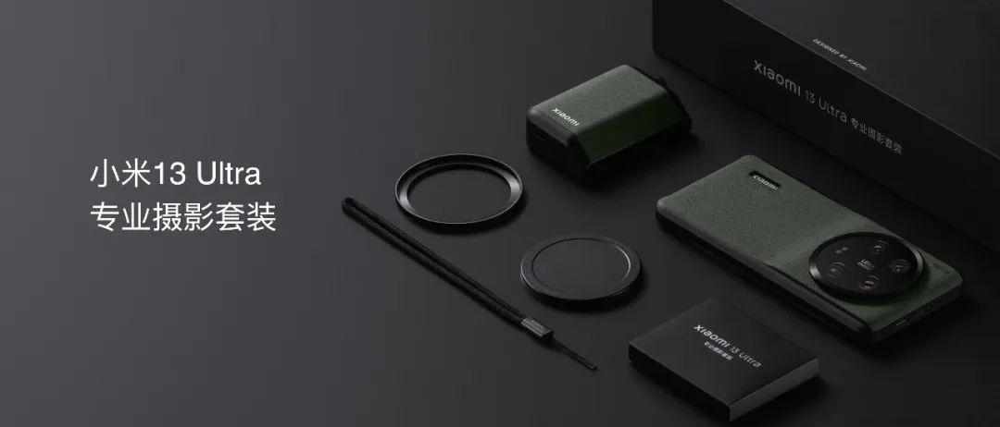

这个产品特别火，首发优惠价799元，被网上黄牛炒到1400元。这么火的产品，立项的时候，居然被我拍死了两次。认真学习摄影之后，我才真正懂了摄影爱好者的想法，第三次立项，毫不犹豫就支持了。同一个产品，认知转变后，决策完全不同。

这里，我要特别感谢一下，小米产品团队的坚持！事实证明，你们是对的！

两代 Ultra 产品的发布，让小米影像在大众用户和专业摄影圈层，都有了很好的口碑。

#### **6、小米13**

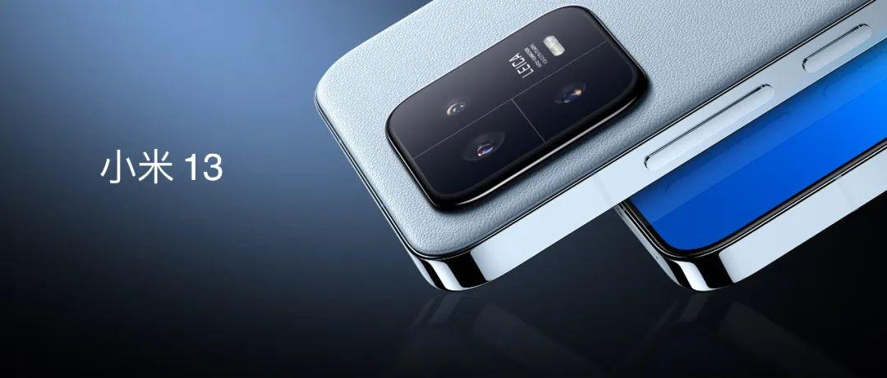

这样的探索与改变，正发生在小米的方方面面。

就是这样，我们对高端的理解在逐步增强，高端产品的表现也越来越好。

小米13 口碑和销量都非常不错，但研发过程中两次差点夭折，我给大家说说背后的故事。

第一次是在立项会上。

小米12 和 12S 连续两代不达预期，亏损非常严重，小米13 要不要继续做小屏，争论非常激烈，一半以上的同学都反对。

做小屏旗舰的确特别难。用户要的不仅仅是小尺寸手感，还必须是一款没有短板、没有阉割的全能旗舰。要在小尺寸机身里，塞进全能旗舰的所有功能，达到全能旗舰的体验，这对研发来说是一个巨大的挑战。更难的是，就算你做到了，成本也很高，用户未必买单，因为小尺寸手机看起来就不如大屏手机显值钱。

我理解大家的各种纠结，但我依然认为：手感是最重要的用户体验，虽然不在参数表上，也很难说清楚好在哪里，但用户一上手，就能立刻体会到。

这次立项，勉强通过了。

我们研发团队背水一战，迸发了超强战斗力。在去年疫情期间，大家为了不耽误进度，吃住在办公室，过上了“军训”式的集体生活。

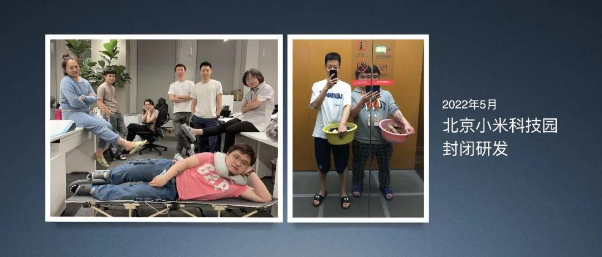

不负众望，小米13 做得极其出色，很多体验甚至大幅度超越了 iPhone。

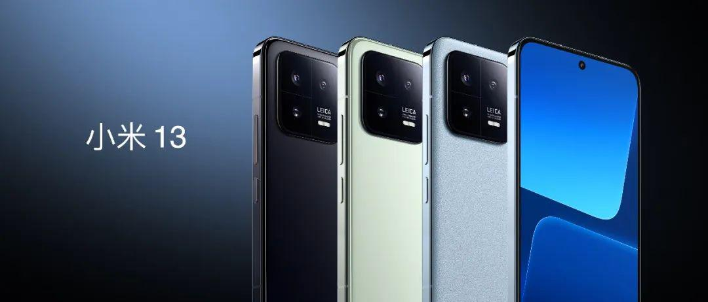

第二次差点夭折是在产品上市前夕的定货会上。

哪怕小米13 体验如此出色，同事们还是信心不足。前两代我们损失惨重，大家有点怕了，假如这一代再输，又亏几亿，甚至十几亿，我们扛得住吗？还有，同行在这个价位都是大屏，参数看起来很猛，我们真的打得过吗？

讨论会上，气氛比第一次还要压抑。这个时候，我也不能乱拍板，只能找大家做工作，反复说服：做高端一定要有耐心，用户认可需要一个过程！而且，这个过程的确比我们想象得长。还有，目前的市场是高度同质化竞争，用户需要一款独特的产品。大家看到我这么坚持，最后就同意了。

命途多舛的小屏旗舰，小米13，终于面世了。

有米粉开玩笑说，“小米旗舰，买双不买单”，他们一定等小米14，坚决不买小米13。这个玩笑，让我们脆弱的神经又吓了一跳！

结果呢？谁也没想到，口碑和销量双丰收！米粉朋友们都说，这是小米的“十三香”。

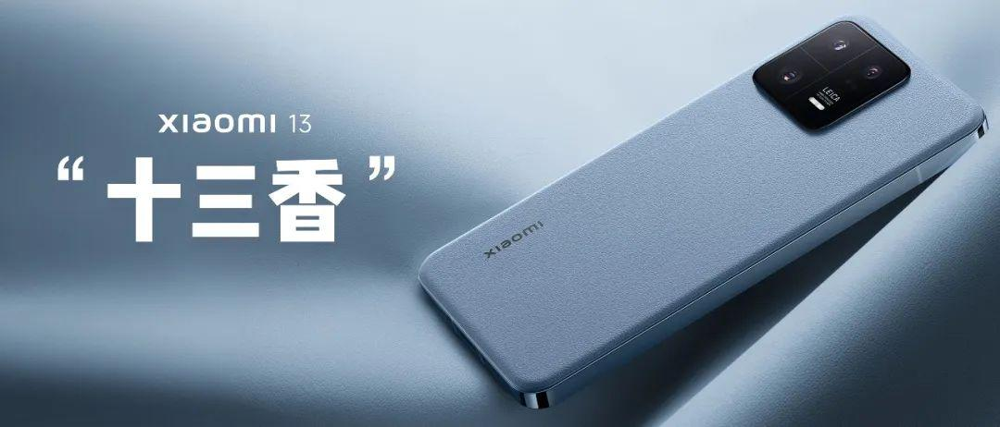

我们连续做了三代小屏旗舰，巨大的决心、投入和耐心，才收获了今天小米13的成功。这个成功实属不易，小米13 成了我们“从参数领先到体验优先”的代表作。

这次，大家从心底里彻底认同了“**体验优先**”。

这就是我们总结的高端产品设计三原则：“高端无短板，从参数领先到体验优先，软硬件深度融合”。

有了这样的认知，有了这样的共识，我相信，未来的产品一定会更好！

#### **7、认知与成长**

小米高端探索之路，三年多时间，上百亿的投入，几万人的共同努力，历经跌宕起伏，终于迎来了阶段性的突破。在这场高端战役中，哪怕任何一点微小的成功，都非常不容易，背后都是认知的改变和突破。

只有认知突破，才能带来真正的成长。这就是近十年来我最大的收获。

### 四、人因梦想而伟大，又因坚持梦想而成长

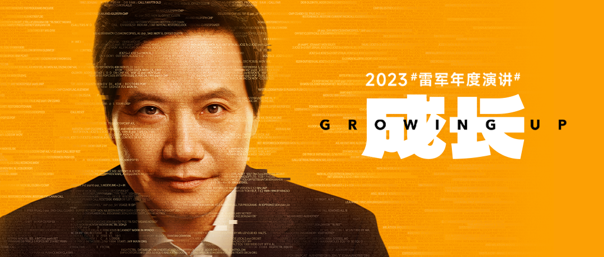

今天，跟大家分享的，就是我经历过的几次关键成长：

在武大的求学生涯，让我建立了梦想，并学会了把梦想拆解成一个又一个的目标。在金山的创业历程，让我完成了从程序员到管理者的蜕变。创办小米，一个改变中国制造业的愿景，一个创新的商业模式，让我的梦想开始逐步走进现实。

每一段经历，每一次蜕变，都是一次认知的突破，更是一次关键的成长。

最近几年，不少人都感到非常焦虑，非常迷茫。在时代变迁的洪流中，如何获得内心的平静呢？我的答案是：**成长。**

只有脚踏实地的成长，才有足够的自信、勇气与决心，去迎接所有未知的挑战；

也只有脚踏实地的成长，才能让自己内心充实，眼里有光，时时刻刻充满力量！

人生是一场马拉松，一时一刻的成败得失，都不那么重要。

所有的人生难题，你都将在成长中找到答案。

人因梦想而伟大，又因坚持梦想而成长。

朋友们，愿你历经岁月洗礼，梦想依旧熠熠生辉。

朋友们，不管你今天的梦想是什么，我都真诚地祝福你，祝你梦想成真，祝你拥有一个快乐而充实的人生。

### 五、小米科技战略

#### **&#x20;1、小米科技理念**

小米的科技理念：**选择对人类文明有长期价值的技术领域，长期持续投入。**

人是科技的原点，小米的科技探索，不仅要对人类现在的生活有价值，更要对人类未来的创造、进步和发展有价值。所以，我们着眼长期价值，坚持长期投入。

在探索科技的过程中，我们会遵从如下原则：深耕底层技术，长期持续投入，软硬件深度融合，AI全面赋能。

* **深耕底层技术，长期持续投入。**

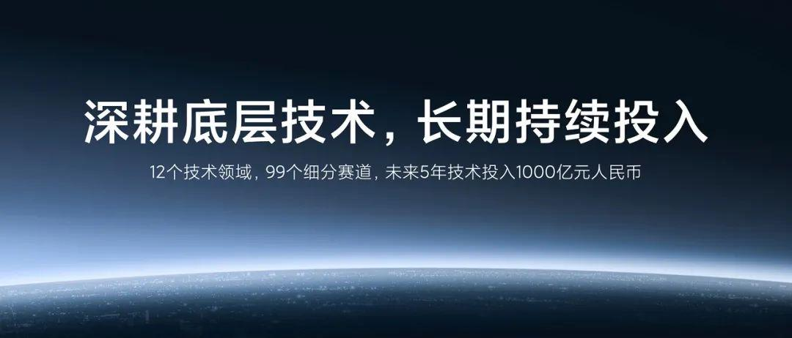

**-&#x20;**&#x5C0F;米集团已经布局12个技术领域、99个细分赛道

**-&#x20;**&#x672A;来5年，技术投入1000 亿元人民币

* **软硬件深度融合，AI全面赋能。**

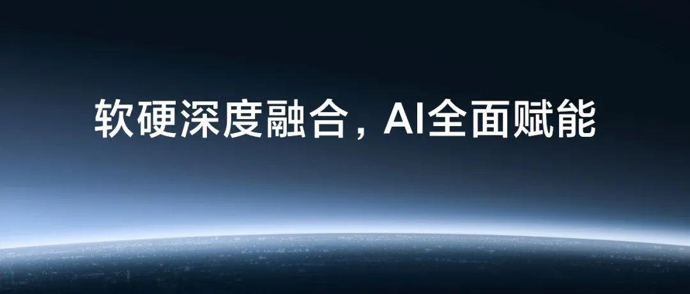

**-&#x20;**&#x8F6F;件硬件深度融合，是我们为用户提供独特体验的根本保证

**-&#x20;**&#x41;I是未来的生产力，必须、也必然要全面赋能，也是小米长期持续投入的底层赛道

**-&#x20;**&#x6211;们把它写成一个公式：（软件×硬件）ᴬᴵ  ，这样更好记

#### **&#x20;2、小米积极布局人工智能**

小米很早就对人工智能进行了布局。从2016年组建第一支视觉AI团队，到今年4月第一时间成立专职大模型团队。7年，6次扩展，小米人工智能团队已经有3000多人了。逐步建立了视觉、语音、声学、知识图谱、NLP、机器学习、多模态等AI技术能力。

* **小米全面拥抱大模型**

2023年4月，小米组建大模型团队，全面拥抱大模型。

**-&#x20;**&#x5C0F;爱同学接入大模型、开启邀请测试：小爱同学目前拥有1.1亿月活用户，为了让大家能更快地体验到大模型技术，小米对小爱同学升级大模型，并开启邀请测试。

**-&#x20;**&#x5C0F;米的自研大模型取得了一个小成绩，得到了全球权威榜单的认可。

**-&#x20;**&#x4E0E;其他公司不同，**小米大模型技术的主力突破方向为轻量化、本地部署。**&#x8BA9;用户既可以拥有数据安全，又可以拥有大模型的先进生产力。

**-&#x20;**&#x76EE;前，我们已经在手机端跑通了Demo，手机端侧大模型部分场景效果媲美云端。

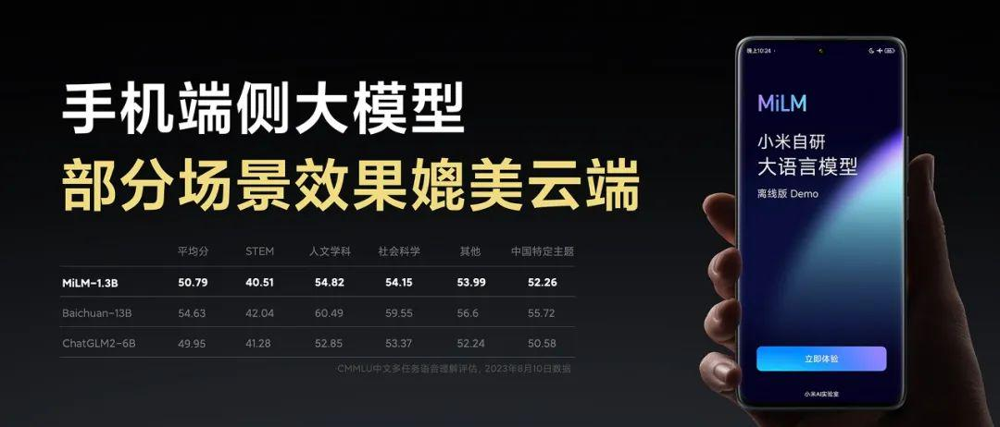

在研发领域的支持下，小米的高端化也取得了全新的进展。

接下去要给大家带来的新品，每一个都是我们精心打磨的产品，每一个都凝聚着我们对产品、对行业全新的思考和长期的技术积累。我有点迫不及待，想和大家一起分享，我们的技术和产品的全新成长。

### **六、小米MIX Fold 3未来，全面展开**

小米MIX Fold 3，搭载小米自研龙骨转轴，创新的三级连杆设计，14 个可活动关节完美贴合屏幕曲率，跌落时稳稳保护屏幕，使用更安心。更精密紧凑的结构设计，转轴区域空间比上代减少17%，不仅让整机更加纤薄，更为整机堆叠留出富余。

小米MIX Fold 3，让轻薄折叠与全能旗舰可以得兼：徕卡光学专业四摄，轻薄折叠影像新高度；第二代骁龙 8 领先版平台，强悍性能；创新 Pol-less Plus 屏幕节电技术，4800mAh 小米澎湃电池，有线 + 无线双小米澎湃秒充，告别续航焦虑；5G 超级天线 + 5G 智慧出行，随时保持连接。

轻薄折叠全面旗舰的小米MIX Fold 3，8999元起，将于 8 月 14 日发布会结束后同步开启预约，8 月 16 日首销。

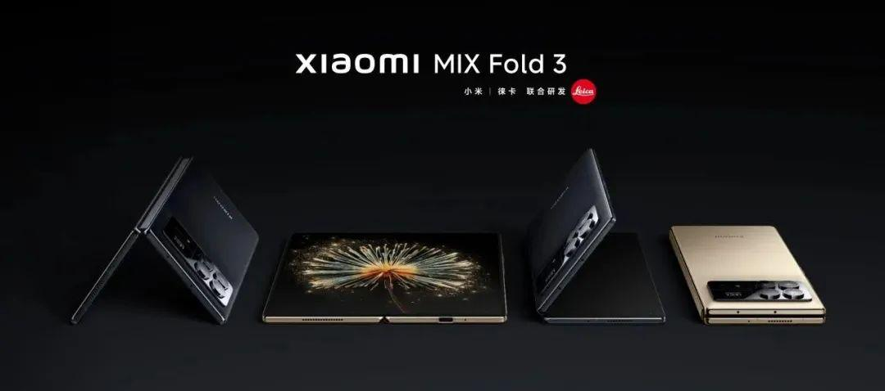

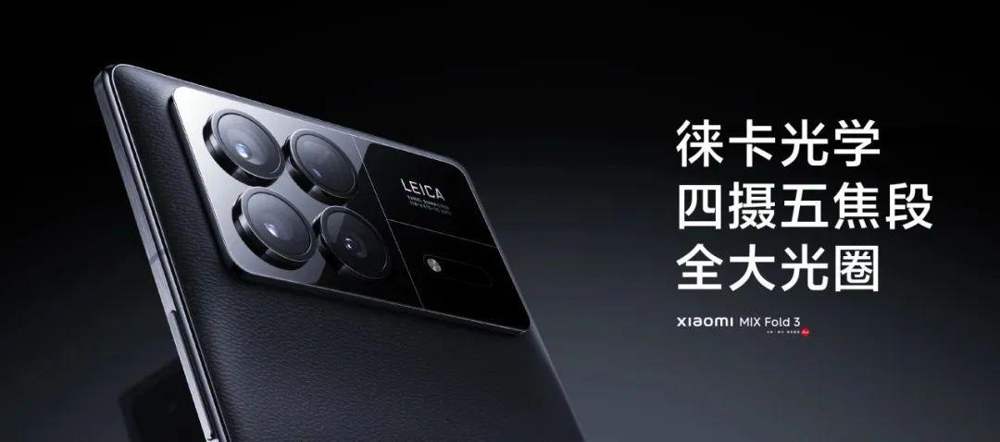

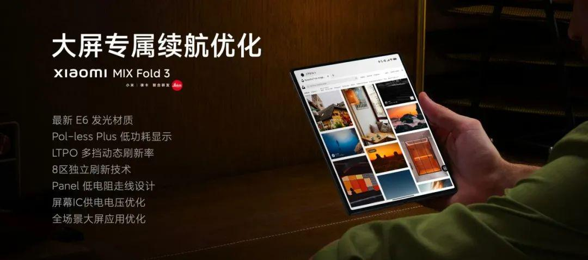

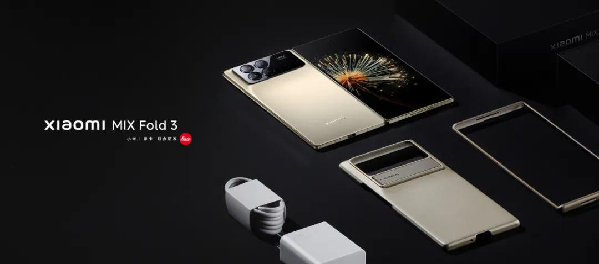

### 七、Xiaomi Pad 6 Max 14：大，不一样

Xiaomi Pad 6 Max 14，14″超大屏幕带来震撼的影音娱乐体验：2.8K 120Hz高分高刷屏幕，逐片出厂校色；8 扬声器，带来前所未有的震撼声浪；骁龙 8+ 移动平台，轻松应对重负载场景，重度游戏接近满帧运行。

14″超大屏幕，充分解锁移动生产力：全新「工作台」模式，PC级多任务交互，更高效；PC级WPS Office、会议工具箱、AI翻译，移动办公倍增从容；全新分体式智能触控键盘 + 焦点触控笔，释放创造力；10000mAh 大电池，33W 反向充电，随时随地保持在线。

Xiaomi Pad 6 Max 14已正式发布，首销价3599元起，8月14日晚正式开售。

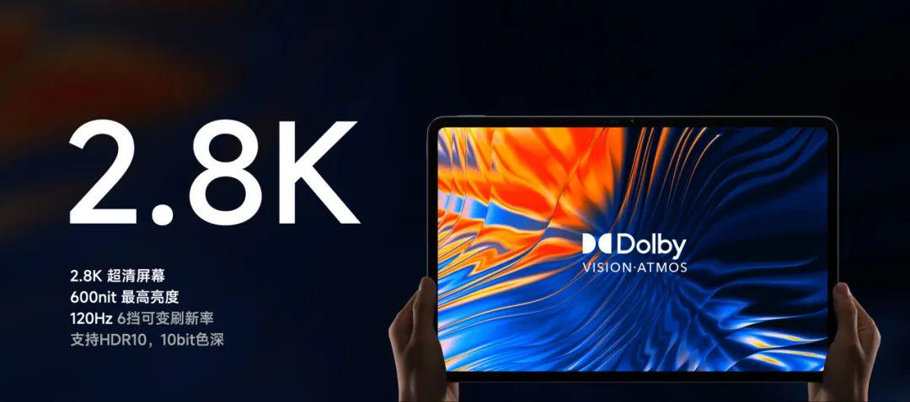

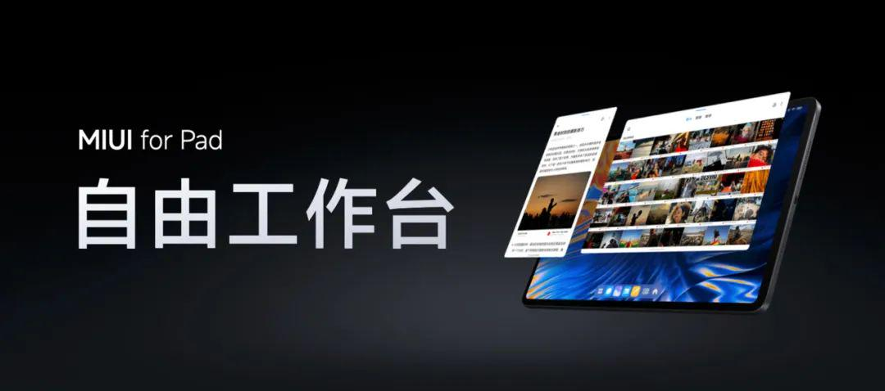

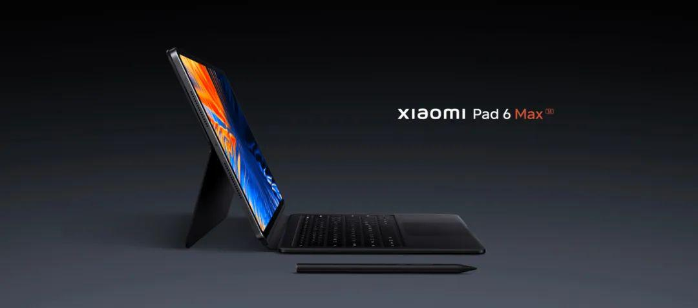

**&#x20;**

### **八、小米手环8 Pro：大，不同**

小米手环8 Pro，更时尚：全新 1.74″ 四窄边大屏，60Hz 刷新率，336PPI，手腕上的「旗舰屏」；金属质感中框，搭配多款精致快拆式表带，时尚感层出不穷；轻巧设计，5ATM 防水，14天长续航，满足全天候佩戴需求。

全新的小米手环8 Pro能力全面看齐智能手表：双通道体征传感器，心率/血氧监测准确率全面提升；独立 GPS，精准记录运动轨迹；手表级处理器+手表级系统，操作顺滑流畅；支持手环控制音频流转、切换米家 App 智能场景，互联互通尽享便捷。

小米手环8 Pro，399元起，现已正式开售。

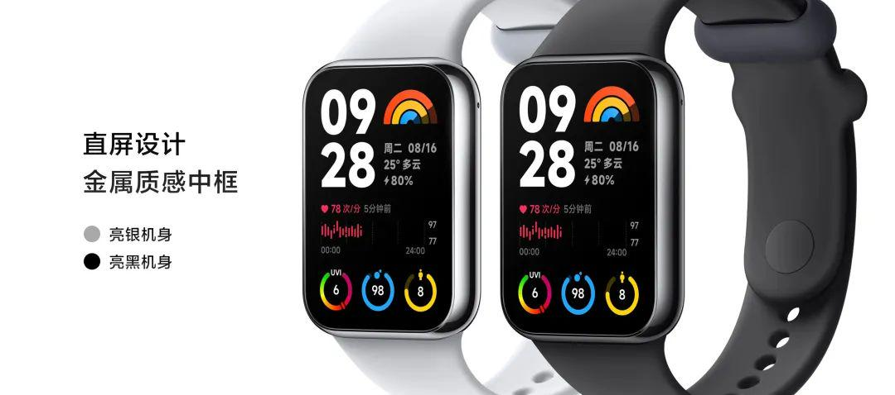

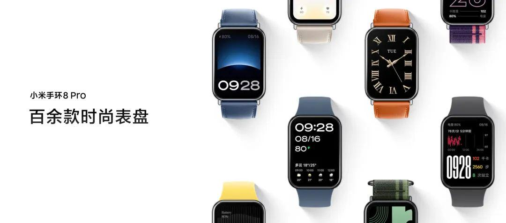

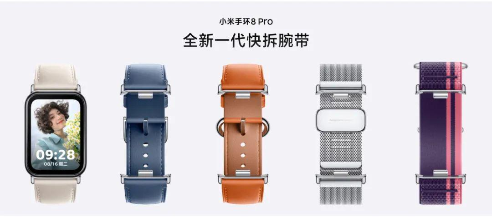

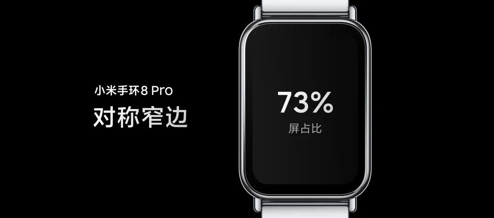

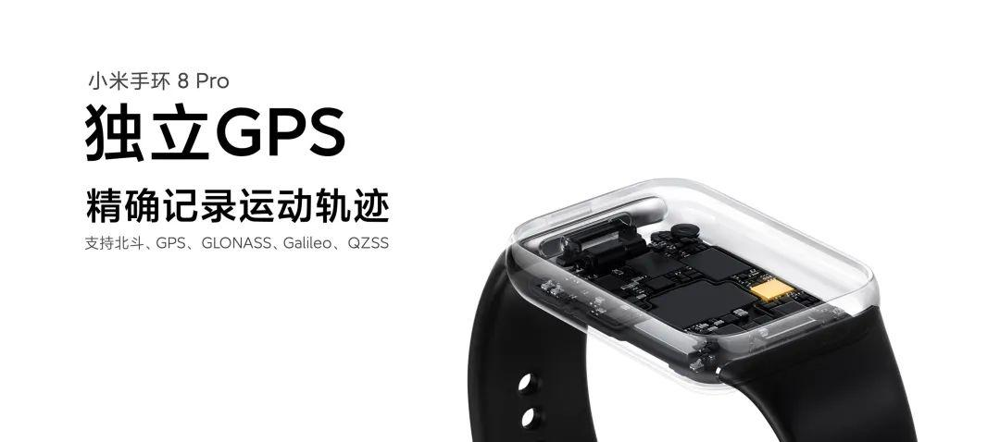

### 九、Redmi K60 至尊版：双芯旗舰，狂暴性能

###

K60 至尊版，搭载旗舰级双芯处理器：天玑9200+、独显芯片 X7，安兔兔性能跑分超 177万；全新升级狂暴引擎 2.0，自底层固化算法，软硬深度协同，可同时开启144FPS 稳定高帧 和 1.5K 超高分辨率，为你挑战性能上限。

第二代 1.5K 高亮高刷屏，视效清晰，护目更出色。优雅外观，性能美学，质感跃升。24GB + 1TB 超大存储组合可选，进一步释放狂暴性能。还有IP68级防尘防水、120W + 5000mAh 耐久续航等更多旗舰体验。

Redmi K60 至尊版，2599 元起，已开启预售，8月16日10点开售。

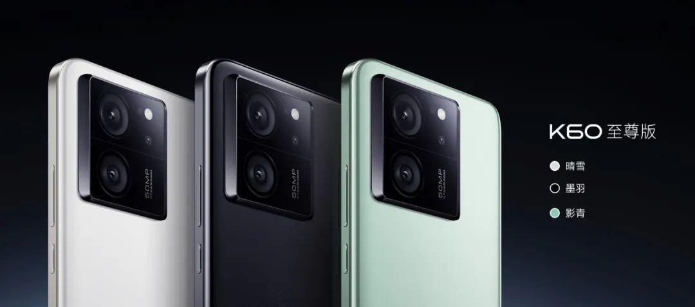

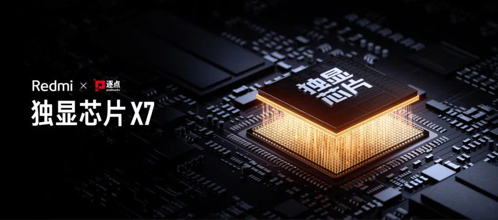

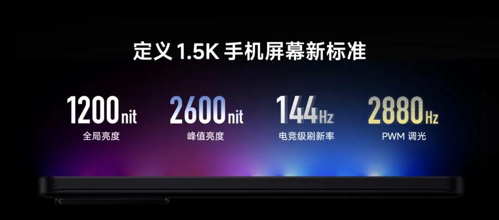

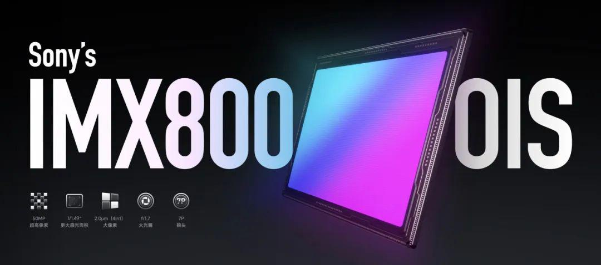

### 十、小米CyberDog 2：和未来交朋友

**第二代仿生四足机器人CyberDog2，从内到外全面进化。**

第二代仿生四足机器人CyberDog2 进化出场，铁蛋的名字不变，但样貌小巧亲人。仿生外观下，是天生的运动健将，更有学霸体质，能不断学习AI神技能。

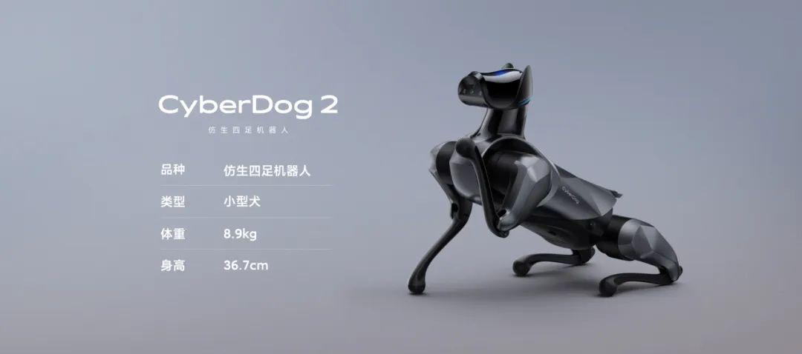

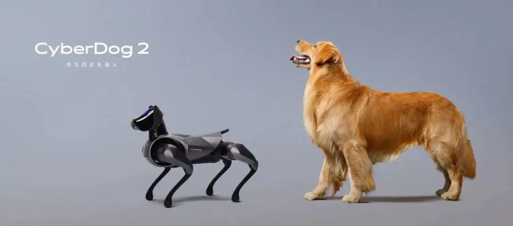

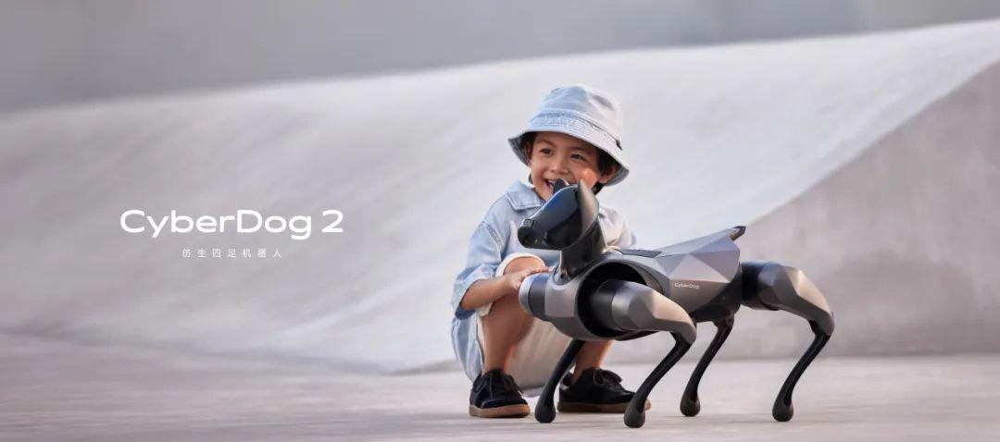

* **仿生：AI全方位赋能+强硬件性能 ，打造极致仿生**

**-** **外观仿生**：小巧、仿生学设计的外形，更像一只真实的小狗，人类友好。

**- 运动仿生**：自研CyberGear微电机+自研算法，控制精度大幅提升，可完成更多精细仿生动作。

**- 思维仿生**：具有视觉、听觉、感知能力，能够对人的动作、情感做出自主反馈。

* **开源：多层开源，不同程度用户均可参与共创**

**-** **可视化编程**：可用模块数量50+，初级用户可轻松完成多种交互场景搭建。

**- 接口开源**：应用，系统，运控，算法，100+接口，普通开发者可实现应用开发。

**- 代码开源**：机器人本体代码全部开源，高级开发者可实现AI算法，运控，系统开发。

**- 结构图纸开源**：外观结构图纸开放，可供专业用户进行外观定制。

小米 CyberDog 2 售价 12999 元，发布会结束后上架小米商城，同时开启购买申请通道，购买时需填写详细信息，经过工作人员审核相关资质后即可购买。

同时，CyberGear微电机面向行业开售，CyberGear 是小米自研科技，性能强大，重量只有317g，最大扭矩12N.m；控制精度±5，响应时间低至20ms。CyberGear 不仅强化小米CyberDog2 的运动能力，还有更多场景轻松胜任。

期待更多朋友加入，和小米一起推动机器人行业发展！

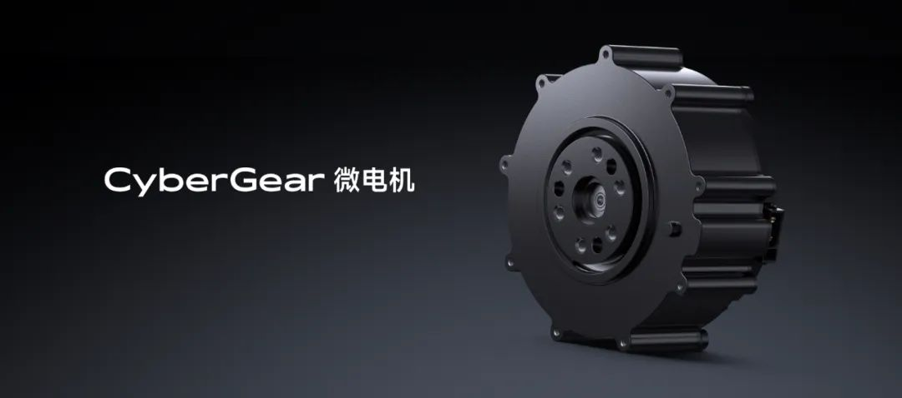

科技，应该是开放的，包容的，服务于人的。

CyberDog 2 正是一个面向开发者的开放平台，小米科技人文共创家郭帆导演邀请你共创机器人的未来。欢迎大家来小米官网，和郭帆导演一起创造更多应用生活场景。

以上，就是我们今天的全部内容。

一个全新的小米，风华正茂，坚定无畏，满怀希望，正在驶向梦想的星辰大海。

这条路上，小米永远和所有勇敢的追梦者们一起前行。

人因梦想而伟大，又因坚持梦想而成长。只有坚定的梦想和脚踏实地的成长，我们才能为这个世界展开最美好的想象，才能描绘这个时代最壮丽的画卷。成长，步履不停地成长！这就是我们给时代的最好答案。

谢谢大家！**”**

