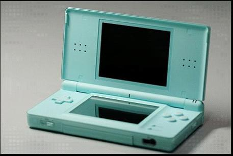
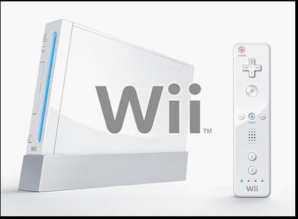

任天堂如何反败为胜

(2008-12-01 09:10:00)

**Wii 和 NDS 成功背后的故事**

2002年，索尼PS如日中天，微软XBOX快速崛起，任天堂这个老牌的游戏机巨头陷入了困境。在生死存亡之际，山内溥下课，岩田聪接任了社长。

&#x20;  在岩田聪的带领下，2004年成功发布了NDS，轰动全球，在掌机领域轻松击败PSP；2006年底成功发布了Wii，以崭新的体感游戏模式再次轰动全球，在主机领域重创PS3和XBOX360。仅仅四年时间，任天堂以崭新的姿态重返游戏机的王座。

&#x20;  2007年初，PS之父久多良木健黯然下课。

&#x20;  这是一个精采绝伦的反败为胜的故事。

&#x20;

先看看最新的战报，就知道任天堂有多厉害，仅仅一年半的时间，Wii全球售出了3455万台。截止2008年9月30日的游戏机累计销售量如下：

&#x20;  Wii  3455万台（2006年底）

&#x20;  NDS  8433万台（2004年）

&#x20;  360  2250万台（2005年）

&#x20;   PS3 1684万台（2006年）

&#x20;  作为一个游戏的从业者，我特别关心的是岩田聪是怎么做到的，四年时间里任天堂内部又是经过了一场什么样的革命。

&#x20;

一、做好游戏的前提是玩者之心

&#x20;   岩田聪在GDC2005上做了一次堪称经典的主题发言，他谈的最重要的观点就是玩者之心。一家游戏公司成功的关键在于，必须营造热爱游戏的文化，每一个人都必须是游戏玩家！这样的公司才能获得持续长久的成功。

&#x20;  “在我的名片上写着，我是一个公司总裁。在我自己来看，我是一个游戏开发者。在内心深处，我实际上是一个玩家。”

&#x20;  “是否你曾经为了一款自己都不愿意玩的游戏而辛苦开发呢？”

“即便我们来自世界的不同地方，即便我们说着不同的语言，即便我们吃着不同的食品或者饭团，即便我们在游戏中有不同的体验，但今天我们在座的每个人有一个非常重要的相同点。这个相同点就是我们都拥有同样的‘玩者之心’。”

&#x20;  被问及如何看待和其他公司的竞争。他回答，我从来不觉得任天堂在和其他公司竞争。任天堂应该做的不是和其他公司竞争，而是关注玩家的感受。任天堂的敌人是“不关心玩家”的思想。

&#x20;  暴雪成功的关键，其实也是玩者之心，暴雪雇佣每个员工都必须是狂热的暴雪游戏迷。一个不真正热爱游戏的人，很难在游戏业保持持续长久的成功。

&#x20;  二、游戏的本质是创意和乐趣

&#x20;  岩田聪批评日本游戏产业一味沉沦在无止境的商业视觉包装上，游戏的真正本质“创意”和“乐趣”却被忽略了。他认为，现在的游戏的制作越来越写实，也越来越复杂，但是，这样的做法却无法再让游戏业界成长。在他看来，“真正有趣的创意”与“简单的构思”，才是吸引用户的关键。

&#x20;  他在GDC2005上的演讲中也提到，“当我们花费更多的时间和金钱来满足玩家的时候，我们是否遗漏了其他一些玩家？我们开发的游戏是否适合每一个人？是否你有朋友和家人不玩游戏？那他们喜欢做什么？”

&#x20;  “简单设计，让不玩游戏的人也能玩，积极扩大市场占有率”。

中国的游戏产业虽然已经发展了十多年，和日本、美国相比，才刚刚开始。谨以此文献给所有游戏产业的创业者，希望中国能产生任天堂和暴雪一样伟大的游戏公司。

&#x20;  强烈推荐关于任天堂的两篇文章：
&#x20;  1\. 《周末画报》杂志在2007年报道的《任天堂重返王座路》
&#x20;   2\. 岩田聪在GDC2005上的发言《玩者之心》

