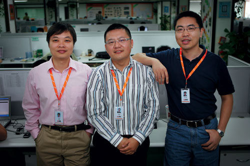

借了丁磊80万 UCWEB才度过创业困境

(2008-12-12 16:30:00)

【转载】**UCWEB 天使第一步**

《创业家》 文/张凯锋

&#x20;

一个濒临绝境的初创公司，如何在丁磊、雷军等人的帮助下，迎来柳暗花明的时刻。

&#x20;  UCWEB团队:何小鹏、俞永福、梁捷

走出电梯，联想投资副总裁俞永福心情沉重，甚至有点悲伤，决策委员会刚刚以2:2的投票结果不同意投资手机浏览器公司UCWEB，而这是他非常看好的一个案子，此前半年也倾注了大量的热情，结果却让人失望，现在他必须把这个坏消息告诉UCWEB的两位创始人：梁捷与何小鹏。

&#x20;

时间已近晚上8点，联想投资所在的融科资讯中心楼下的西餐厅里食客寥寥，略显冷清，梁与何在这里等了4个小时，仿佛在等待命运的裁决。一会儿想如果拿到联想投资的100万美元，该怎么花；一会儿又想，如果拿不到，UCWEB又该往何处去。他们创业2年多，此时UCWEB的现金已经枯竭，迫切需要资金注入。

&#x20;

可惜，俞永福带来的消息让梁捷和何小鹏很沮丧。短暂的沉默过后，何小鹏问俞永福：“永福，你愿不愿意和我们一起干？” 显然这不是一个普通的请求，在外人看来甚至不无唐突，但俞在那一瞬间只感到如释重负，甚至很欣慰：自己既然很看好UCWEB这个项目，也一直有创业的冲动，还等待什么？他几乎立即就接受了这个邀请，气氛一下子由沉重变得欢快起来，三人一起点了晚餐，开始谈下一步融资和UCWEB的发展规划。

&#x20;

三人分手后，俞永福立刻给雷军打电话，约他出来聊天，打这个电话的原因很简单，1年多以前，雷军曾对俞永福说：“如果你将来要创业，无论做什么我都支持。”见面后，俞要了瓶啤酒，雷感觉俞有点郁闷，俞告诉雷UCWEB融资遇挫的事，雷的第一反应是问俞：“要不要我打电话给朱总(联想投资总裁朱立南)说一下？”这不是俞的来意，他也深知投资人其实都是自己说服自己，而不是靠别人说服，就拒绝了雷的提议。他沉吟了一下便直接问雷自己有没有兴趣投资UCWEB，俞和雷此前就曾聊过UCWEB，作为时任金山软件CEO，雷军对无线互联网一向颇有研究，此前还投过无线社区乐讯网，他的回答很有意思：“UCWEB最大的问题是他们的团队，两位创始人都是纯技术背景，这是很大的缺陷，这个问题不解决，很难发展起来，我投资可以，但你必须加入这个团队。”一拍即合。

&#x20;

塞翁失马，焉知非福。2006年11月20日这天，梁捷与何小鹏失去了联想投资的100万美元，却得到了未来CEO俞永福和董事长雷军的加盟，谁也没有注意到，得失变换间，这家只有15个人的小创业公司悄然完成了至关重要的变化，一个完整的创业团队就此初步成型，并随即走上高速成长之路：2006年年底，UCWEB获得以雷军为主的400万元投资；2007年8月，获得晨兴和联创策源的1000万美元投资，半年内公司估值增加十余倍。

&#x20;

这是一个漂亮的开始，然而故事的开始又是如何开始的？

&#x20;

**前传**

&#x20;

梁捷与何小鹏是华南理工大学计算机系的同学，梁比何高一级，两人性格迥异——梁内敛而何外向，虽在学校时即已认识，但并不熟悉。1998、1999年两人毕业后都加入亚信广州办事处，梁一直在做技术研发，而何从测试、项目支持到培训、运营维护各个岗位都做过，两人配合默契。2003年，梁捷与何小鹏几乎同时离开亚信广州公司，开始创业。当时他们并未明确自己创业的方向，手头有网通的一个项目，他们计划以战养战，边做项目边寻找方向。在此后的一年时间中，他们考虑过P2P、博客、无线甚至网上卡拉OK等很多可能的方向，但目睹国外BlackBerry的火爆和中国移动的发展后，他们决定做“中国的Blackberry”。

&#x20;

这无疑是一个让他们感到兴奋的概念，并且，他们自信能做出这样的产品，因为邮件系统是他们熟悉的领域。在亚信，他们就曾参与开发出中国第一个通过千万级别性能测试的邮件系统，占据中国40%的市场份额，包括中华网、21CN、人民网、新华网这样的大型网站都在用亚信的邮件系统。

&#x20;

2004年8月，梁捷、何小鹏和其他3个同伴开发出第一个无线邮件产品UCMAIL，但用户反馈很不理想。原因很简单：中国手机用户习惯用短信，而极少用邮件沟通。因此无线邮件几乎没有太大的用户需求，可以说他们在一开始就选错了方向。所幸他们的UCMAIL在技术上的起点较高：有很灵活的底层架构，支持HTML协议，可以直接在邮件中带链接。这其实是一个开放的接口，可以直接访问互联网上所有的网页，实际上已经具备了潜在的浏览器功能，很快他们就在UCMAIL的基础上做出了手机浏览器UCWEB。

&#x20;

但当时公司完全没有收入，两人又都买了房，生活压力不小。在没有投资的情况下，坚持下去很难，所幸他们遇到了一个特殊的用户——网易创始人丁磊。网易的邮件系统是何小鹏的同学陈磊华开发的，邮件也是网易赖以起家的业务，丁磊自然对邮件系统颇为关注，他几乎在第一时间就发现了UCMAIL，并通过网易的技术人员找到了何小鹏与梁捷，很快约他们见面，三人相谈甚欢。后来也常有联系，在用过UCWEB之后，丁磊还和他们开玩笑说，“以后我可以在马桶上看网易新闻了。”丁磊得知他们的困境后，很慷慨的以个人的名义借给了他们80万元，这笔钱足足让UCWEB支撑了2年。

&#x20;

一个有趣的问题是，丁磊既然觉得UCMAIL不错，网易也有无线业务，为何没有投资或干脆收购，将其整合到网易，而只是借钱给梁捷、何小鹏呢？其实答案也很简单，因为当时他们并未成立公司，没有收购主体，无法投资，只能退而求其次借钱给他们。在得到雪中送炭式的80万元后，梁捷与何小鹏开始注册公司，2005年3月10日，优视动景公司正式成立。但丁磊的心态逐渐发生变化，他痛感移动运营商在无线业务领域过于强势，SP空间狭小，决心逐步退出无线业务。后来丁磊也一直没有对UCWEB提出投资或收购的要求，“如果丁磊提出投资，我们应该不会拒绝”，何小鹏回忆道。2007年，梁捷和何小鹏才全部还清这80万元。

&#x20;

除了借钱，丁磊还经常把办公室借给UCWEB使用，也正是在网易的办公室里，何小鹏和梁捷遇到了另一位对UCWEB帮助很大的人：李学凌。当时李还是网易的总编辑，办公室与梁捷、何小鹏挨着，对新鲜事物抱有兴趣的李学凌用了UCWEB之后，也比较喜欢，还经常提提意见。2005年8月，李学凌离开网易，开始创办多玩网(www.duowan.com)，雷军是李的天使投资人，2006年年初，雷军和俞永福都被李学凌发展为UCWEB的用户。

&#x20;

**俞永福**

&#x20;

俞永福喜欢开车，他常常将投资和创业与开车作对比，“创业就是开车，而投资只是坐在副驾驶的位置上”，投资做久了，感觉“不过瘾，很想自己开车”。2005年年底的时候，俞永福在联想投资已经快5年了，虽然从投资助理做到副总裁，但作为投资人，俞并没有投过“Home run(本垒打)”式的项目，他觉得自己毕竟没有做过企业，在判断项目时，没有太强的信心。俞和联想投资总裁朱立南说自己有去创业的想法，朱认同俞的观点，但建议他不要为了创业而创业，一定要等到合适的机会。

&#x20;

俞永福是个活跃分子，热爱体育活动，对新鲜事物都抱有浓厚的兴趣。2006年初，在李学凌的介绍下，他使用了UCWEB，感觉不错，认为有投资的价值，因此特地飞往广州去见创业团队。初次见面，俞永福印象最深刻的是梁捷和何小鹏递过来的名片上都是“副总裁”，这让他有点狐疑，难道他们背后还有“老大”？其实只是因为梁、何虽然创建了公司，但自觉只懂技术、不懂商业，不适合做总裁，而把这个职位空着，等着合适的人加盟，俞觉得“他们比一般的创业者想得远”。此后，三人一直保持联系，当时UCWEB的团队已有15个人，其中只有3个人真正在开发UCWEB其他人都在做中国移动的一个无线办公项目，这个项目的年收入可达到1000万，不过离回款日期尚早，借的80万也即将耗尽。公司的资金链比较紧张，迫切需要融资，也接触了不少VC，受中国移动政策的影响，VC对无线领域投资比较谨慎，梁捷与何小鹏对融资也缺乏经验，总是把中移动的项目作为一个重点来介绍，而这样的B2B模式想象空间有限，因此UCWEB的融资屡屡受挫。

&#x20;

俞永福知道梁、何的融资策略有问题，但出于投资人的立场，他不能主动引导梁、何把重心放到UCWEB，舍弃企业市场。但他还是看好手机浏览器市场。到十月，俞永福做完对UCWEB的尽职调查，于是向投资委员会提了这个案子，不过最终还是功亏一篑。但对俞永福来说，他终于等到了自己寻求的创业机会，“如果联想投了，我肯定是不会去UCWEB的”。

&#x20;

2006年11月21日，俞对朱立南说自己要去UCWEB创业，在这个项目上投赞成票的朱也立刻表示支持，并以老大哥的身份提醒俞：“以前你和他们两个创始人关系很好，可能只是因为你是投资人，真的成为合作伙伴的话，融入他们可能比较难。”这当然是金玉良言，但后来的事实证明朱的担心是多余的：三个人的合作非常顺利，在引入B轮投资时，完全由俞负责，梁、何几乎完全没有过问。

&#x20;

2007年1月3日，俞永福第一天到UCWEB上班，公司在6楼，没有电梯，虽然以前也爬过这个楼，但这一天俞有点感慨，后来写了一篇《创业从爬楼开始》的文章自励。当时公司规模尚小，内部管理、人员招聘、对外合作，一切都要自己卷起袖子亲自上阵。2007年，俞永福有70%的时间待在广州，一个细节是，他很快在广州买了第二辆车准备扎根于此。

&#x20;

**天使雷军**

&#x20;

其实雷军第一次用UCWEB的时候并不太看好，浏览器是巨头的游戏，微软IE、Mozilla Firefox、苹果Safari、Opera、以及新杀入战团的Google Chrome，无一不是实力超强，UCWEB何以对垒？答案是服务。UCWEB集成了中国所有互联网上的各种主流应用，新闻、视频、社区、邮件、存储等等，并且几乎所有的服务都是由合作伙伴提供，这就意味着UCWEB是所有无线互联网公司的合作伙伴，而不是竞争对手。

&#x20;

UCWEB推出之始，就有服务器端的概念，用户通过UCWEB访问WWW网站时，所有的图片、视频都经过UCWEB服务器的压缩处理，从而获得更快的浏览速度，这在所有的浏览器中几乎是绝无仅有的，从概念上来说，这接近于当下热门的“云计算”，对服务器端技术要求很高，但梁捷在这方面实力很强，“不是所有人都能满足300万用户同时在线、100万用户同时访问同一个页面所带来的流量压力”。目前UCWEB有400多台服务器，雷军相信在无线互联网的未来发展空间必然将超越有线互联网，而浏览器是第一入口，加上UCWEB的服务概念，雷认为UCWEB具备成为下一个伟大互联网公司的潜质。截至2008年10月，UCWEB已经有5500万用户，日PV超过3.3亿，已经为商业化打下极好的用户基础。

&#x20;

2006年12月24日，梁捷、何小鹏、俞永福、雷军在北京清华科技园附近的一个咖啡厅开会，落实投资并探讨UCWEB的未来发展策略，雷军最后与另外2位天使投资人一共投资UCWEB 400万元。在这个会议上雷军还提了另外两个建议：放弃企业业务，全力只做个人市场；开发内部运营平台，做量化管理。现在看来，这两个建议都对UCWEB的发展起到了至关重要的作用。

&#x20;

企业业务最后剥离出去，以上千万的价格卖给了一个合作伙伴，而算起来总的投资也不过几百万，还小赚了一笔。2007年开始，梁捷、何小鹏一人负责技术一人负责产品，开始专注于UCWEB的开发；3月，运营平台启用，自此UCWEB每天多少用户、多少下载、多少安装、用户来自哪里、用的什么机型、那个运营商、上哪些网站、停留多长时间，各种数据一目了然，所有决策都基于这些数据，一改以往的感性、拍脑袋式的决策方式，效果也是立竿见影；4月至6月，用户量每月增加30%，这样的发展速度让晨兴投资的刘芹坐不住了。

&#x20;

晨兴主要做早期投资，刘芹与雷军、俞永福是老朋友，刘与雷一起投资过多玩网，合作颇为愉快。雷投资UCWEB后，曾给刘芹的手机安装过UCWEB，刘也觉得不错，相信雷军的判断，也愿意和雷再合作，就想投UCWEB，但开的价钱只是在第一轮投资基础上翻一番，雷军当然不认可，而且按照UCWEB的发展计划，也不急于融资，这事就搁置下来了。但到了2007年7月，刘芹觉得按照UCWEB的发展速度，2008年的价值会高很多，甚至可能就轮不上晨兴投，当时已有多家VC对UCWEB表示兴趣，刘要求立刻就投UCWEB，他问雷军和俞永福想融多少钱，投资经验丰富的俞永福说准备2008年融1000万美元，刘芹说：“不用等到明年，我现在就给你1000万。”但另一家VC联创策源同样愿意出1000万美元，并且两家都想独占，问题变成了如何说服两家联合投。最后的结果是晨兴出600万，策源出400万，占UCWEB 28%的股份，2007年8月，投资就告完成。半年时间，UCWEB的价值暴涨，雷军的背书效应明显。

&#x20;

但雷军给UCWEB带来的最大价值可能还不是融资，而是经验的传承。2007年的UCWEB和10年前的金山太相似了，梁捷、何小鹏包括俞永福可能遇到的问题都超不出雷军的经验范围，他通常不讲理论，只需随手拈来一个故事就能说明问题。比如在讲浏览器为什么要加导航时，雷军举了Hao123的例子；而在讲为什么要注重申请专利时，雷军给梁、何举例说，微软的Excel 有个“填充序列”的功能，即下拉单元格，其中的数据可以自动按序列增加复制，这个功能很实用，但WPS却没有，为什么？不是做不了，而因为这是微软的专利，金山不能做，梁、何马上就明白专利的重要性了，现在UCWEB已经申请了11项专利，且还在不断根据产品发展申请新的专利。

&#x20;

2008年10月16日，雷军正式出任UCWEB董事长，每周去UCWEB北京公司上一天班，他的主要工作是拉更多的人来用UCWEB，激励所有员工相信自己是在做一个伟大的事业，给公司的发展提供策略，寻找最优秀的人才加盟，给产品提各种意见。从这个层面上说，雷军是UCWEB的吹鼓手、咨询师、人力资源总监、测试员甚至客服，而这个过程，也将一位天使投资人对初创公司的价值体现得淋漓尽致。
