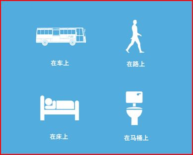

图解UCWEB痛并快乐的创业故事

(2008-11-03 09:14:50)

上周六，看了李咏的新节目《咏乐汇》的首播，邀请的嘉宾是新东方学校创办人俞敏洪。李咏问俞敏洪，创业苦吗？俞敏洪说，创业一定是快乐的，当时整天想的都是如何把事情做成；如果觉得苦的话，创业一定不会成功。

&#x20;  心有戚戚焉。转贴UCWEB梁捷在2008年10月16日公司战略发布会上讲述他们四年的创业故事。

**UCWEB创业故事**

**UCWEB联合创始人 梁捷**

**一、梦想的开始**

&#x20;  UCWEB是我和何小鹏两个人创办。我们俩是华南理工大学计算机系的同学。虽然我俩都是学计算机的，但是性格很不一样。小鹏是湖北人，头脑灵活，喜欢玩游戏；我是土生土长的广东人，老老实实，喜欢编程序。
&#x20;  毕业后，我们都进入了亚信公司广州分公司工作，属于同一个研发团队。我们所开发的大容量电子邮件系统，是公司的旗舰产品，占领整个市场的40%份额，著名的21CN、中华网等网站都是我们的客户。2000年3月，亚信公司成功在纳斯达克上市，而我们的研发团队也被公认为是亚信最优秀的研发团队。
&#x20;  这让我们开始相信，我们的技术的确能为世界带来一点改变。同时，我和小鹏也萌发了创业的想法，我们希望能像GOOGLE一样，做出令人惊叹的技术产品。

**手机上网实在不方便**

&#x20; &#x20;
&#x20;  时间回到2004年，我们经过反复的讨论，最终选择了移动互联网的方向。我和小鹏都是超级网虫，时刻都想要上网冲浪，所以，我们很早就开始用手机上网了。但是当时WAP网站上的内容实在是太少了，而且手机上的操作很慢，很不方便。我们觉得，需要一个更好的浏览器软件，让大家可以在手机上便捷的访问WWW网页。
&#x20;  于是，我们决定自己去做一个工具。我们给她起了一个名字，叫做UCWEB，UCWEB是You Can Web的缩写，意思就是：“你能随时随地访问互联网”。我们希望，有了UCWEB，每个人就都可以“把互联网装进口袋”里了。嗯，我和小鹏都觉得，“这个主意真棒!”
&#x20;  于是，我们辞去了工作，开始了创业生涯。

**二、痛并快乐的创业过程**

**“云计算”的UCWEB**

&#x20;  经过了大半年的研发，在2004年10月，我们推出了UCWEB的第一个公众版本。这个产品一经推出，就得到了用户的欢迎，完全靠着用户的口碑相传，我们在第一个月就发展了5000多个注册用户。
在那个时候，最流行的手机型号是诺基亚6610，屏幕很小，运算能力很低，而且无线网络质量也要比现在差很远。我们为了解决手机终端运算能力不足的问题，想了一个好办法，就是通过手机终端和网络服务器混合运算的技术来解决这个问题。
&#x20;  后来，当GOOGLE发布“云计算”战略的时候，我们非常开心，我们和GOOGLE想到一块去了，“云计算”的思想，早在2004年就已经应用在UCWEB产品中了。当时，全世界有2家公司通过客户端-服务器架构来做手机上的浏览器，一家是加拿大的Reqwireless，这家公司现在已经被Google收购了；另外一家就是中国的UCWEB。

**两年搬了6次办公室**

&#x20;  2005年3月，我们正式注册了广州动景公司。应该说，创业的过程是令人兴奋的，但同时，创业的环境也是非常艰辛的。
&#x20;  我记得，在最初的一年多时间里，我们并没有固定的办公场地，完全是依靠借用朋友的地方来办公，所以经常需要从一个地方搬到另外一个地方。我们常常是在夜里扛着机器，从一个地方搬到另一个办公室，当时的情景让我印象非常深刻。从创业到现在，我们广州的办公场地已经搬迁了6次。这张插图就是照着当时的创业环境画的。
&#x20;  那些在“云端”运算的服务器，都是我和小鹏在电脑城攒的PC机，连测试手机也是在广州的二手市场淘回来的。我和小鹏3年都没拿工资，生活过的非常节俭。而支撑着我们的，是用户对UCWEB的赞许，和不断上涨的用户数量。

**我们要活下去**
&#x20;  从2005年到2006年，2年的时间，我们一直在改进浏览器技术，产品的功能和质量都有了很大的提升。团队也增长到了10多人。
&#x20;  但是由于资金的制约，我们一直不敢作更大的人员扩张，也没有钱去买新的服务器和终端设备，公司面临着严峻的生存压力。
&#x20;  为了让公司能活下去，我们决定执行“以战养战”的策略，向企业客户提供移动浏览的技术服务，用项目收入来养公司。
&#x20;  2006年的春天，我们在中国移动集团和中国移动研究院进行了长达5个月的反复技术测试，终于打败了包括IBM在内的所有对手，夺得了中国移动全国手机办公系统的项目。用我们的技术，帮助中国移动公司实现了手机办公的目标。
&#x20;  从项目里面，公司挣到了一些钱，这些钱很快就统统都拿去买服务器了。因为我们的用户增长实在是太快了。

**想要融资不容易**
&#x20;  为了彻底地解决资金上的问题，我们开始主动去寻找风险投资。花了大半年的时间，跟很多家VC都作了交流，但是最终都没有能达成投资协议。那个时候，我和小鹏才发现，融资啊，真的不像网上说的那么容易。技术本身并不是唯一的决定性因素，要得到VC的认可，还需要有清晰的商业策略和能力互补的经营团队。

**三、遇到有福之人**

&#x20;  就是在寻找VC投资的过程中，我们认识了俞永福。
&#x20;  当时永福是以联想投资副总裁的身份来我们公司考察，看到我和小鹏递上来的名片，头衔都是“副总经理”，他很困惑，想了一会才问：“那总经理是谁？”可能他当时怀疑我们背后还有一个老板，呵呵。
实际上，因为我和小鹏都是技术出身，我们认为公司要做大，将来一定需要引入更合适的管理人才，我们需要找一个CEO搭档，因此，我们两个都不是CEO；其次，这样也方便对外的商务合作，遇到不好决定的事情，可以跟客户讲“需要回去和老大商量一下”
&#x20;  自从认识了永福，我们经常在一起交流，讨论公司发展的方向。永福有非常全局的视野，一些在我们看来非常迷惑和为难的问题，他总是能够找到问题的根源，理清解决问题的思路。这些建议对于我们的帮助非常大。
&#x20;  不过，我们跟永福的交流也是非常漫长的。在经过了半年多的沟通之后，我们最终获得了联想投资的初步投资意向。联想投资的投资决策会议是2006年11月20日召开的，按联想投资的流程，当时我和小鹏专门从广州飞到了北京，在决策会议的前一个小时，我们与联想投资决策委员会的全体成员，进行了最后的当面交流。
&#x20;  在我和小鹏做完了案件的最后陈述之后，我们就离开了会场，联想投资开闭门决策会议。我和小鹏并没有直接回酒店，我们来到了联想投资一楼的西餐厅等待结果。因为当时公司账上已经没有钱了，我们的压力都很大，希望能有一个好结果。我们苦苦的等待了4个小时，到了晚上七点多，永福来到了一楼的西餐厅，三个人都没有吃饭，永福来的时候很沮丧，他说：“一票之差，没有通过”。
&#x20;  大家都很失落，一下子说不出话。沉默了一阵，小鹏说的第一句话是：
&#x20;  “永福，你愿不愿意，加入我们一起干？”
&#x20;  永福没加思索：“好，我们一起干!”
&#x20;  大家的心情立即好了起来，点了晚餐，并且讨论了很多发展规划和融资资金的问题。
&#x20;  吃完饭后，永福立即打电话给雷军雷总，约着当晚见面聊UCWEB项目的事情。
&#x20;  几天之后，永福就反馈说雷军雷总爽快的答应了投资我们。
&#x20;  毫无疑问，当我们把永福发展成兄弟之后，UCWEB拥有了一个志同道合、能力互补的经营团队。

**四、我们找到“组织”了**

&#x20;  雷总的投资，对UCWEB来说，是一个历史性的转折点。

&#x20;  2006年12月，我记得非常清楚。在第一次讨论未来业务规划的会议上，雷总提出了一个重要的建议：“放弃企业市场，主攻个人市场”

&#x20;  当时，公司经过一年多的打拼，已经在企业市场取得了突破，每年稳定的技术服务收入达到了千万级。放弃这些现实收入，对于我们显然是一个痛苦的决定，但是为了集中全部精力主攻最有价值的市场，团队还是接受了这个建议，迅速的将该业务转让给了合作伙伴。将原来投入企业市场的研发骨干转到UCWEB产品上来。

&#x20;  在接下来的时间里面，雷总花了非常多的精力，和我们团队一起，明确了公司的目标和方向。他给我们提出来这样的要求：“强化后台管理系统，推行量化的运营，把UCWEB打造成为最完美的产品”。

&#x20;  在雷总的指导下，永福和我们很快建立起了市场和运营队伍，构建了量化运营平台，并成立了北京公司，公司人员扩展到了将近200人。

&#x20;  同时，公司的业务发展非常的顺利，在雷总投资之后的将近两年时间里面，UCWEB的用户量惊人地增长了25倍。

&#x20;  2007年7月，在雷军的帮助下，公司顺利完成了B轮融资，引入知名VC投资机构Morningside及策源投资，公司价值在8个月内增值超过10倍。UCWEB的发展从此驶入了快车道。

&#x20;  应该说，每个创业团队都有自己的梦想，我们的梦想是：让中国的每一台手机都用上UCWEB，人人都能“把互联网装入口袋”。我们正努力的一步步靠近梦想。
