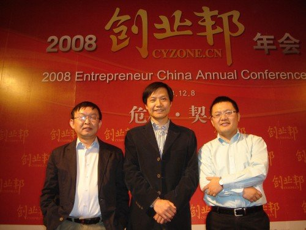
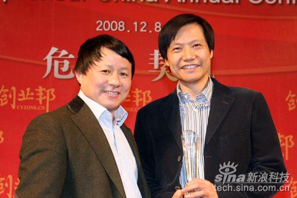

如何挑选创业项目

(2008-12-08 22:00:00)

**再谈《评估创业项目十大标准》**

&#x20;

12月8日，我参加了2008创业邦年会，VANCL创始人陈年获选年度创业人物，UCWEB俞永福获选年度潜力创业人物，祝贺他们两位！我也借他们的光入选了年度最佳天使投资人，谢谢了。

本文是我在会议上的主题报告《**如何挑选创业项目**》

&#x20;VANCL陈年、雷军、UCWEB俞永福 获奖后合影

&#x20; IDG熊晓鸽给我颁奖后的合影

Google天使投资人赚了上万倍，天使投资听上去是天下最赚钱的生意，但世界上没有白吃的午餐，与高回报相伴相随的一定是高风险。如何控制风险，提高成功率，各家有各家的高招，我试图用理性的方法找寻其中的规律。

我只是投资领域的一个业余爱好者，开始做投资时间并不长，投出去的钱也不多。我之所以敢在这里谈投资，只因为这个话题还必须有人来谈，谈清楚可以帮助创业者更好地创业。就投资的三个关键问题，我先抛出我的观点，请行家指点。

&#x20;

**一、投人还是投项目**

&#x20;

每个风险投资家都会说，项目和人缺一不可。

但总会遇到如下两种情况：第一种情况，人非常好，项目也不错，但还不够好，投还是不投？第二种情况，项目非常好，人不错，但还不够强，投还是不投？在项目和人之间，还是需要做出最后的抉择，怎么办？最后，在中国的大部分风险投资家会选择投项目。

而我会毫不犹豫选择投人！因为人是内因，人和项目之间，人是决定性因素。我的几次实践也验证了我的想法。

比如VANCL陈年，2005年4月他从卓越亚马逊离职后，我就对陈年说，“无论你做什么我都会支持”。第一次他创办我有网，我投资了，2007年10月再次创办VANCL，我继续投资了。VANCL，我投的就是陈年这个人！这里也谢谢IDG合伙人林栋梁，他也是连续两次投资了陈年。

比如UCWEB俞永福，他还在联想投资工作的时候，我就曾经说过，“如果你想创业，我一定会支持”。后来他决定加入UCWEB创业，我也是毫不犹豫投资了（当然UCWEB是个非常不错的项目）。还有lakala 孙陶然、duowan 李学凌等。

我有点不理解：大部分机构为什么不这样做呢？琢磨了许久，我觉得基金的商业模式不支持这样的投资模式，因为投资机构募集投资人的钱，都有明确的退出期，如果项目不够好，至少会浪费几年时间，机构等不起。而天使投资者投的是自己的钱，没有外部压力，有足够的时间投人！还有一个很重要的原因，在中国，高素质有经验的人奇缺，这点和美国不一样。

所以，我的判断是投人的成算更高！

&#x20;

**二、如何评估人？**

&#x20;

评估人是世界上最复杂的事情！我不认为我自己有看人的天赋。听说看相术很有效果，但我没学过。我只不过是在长期的管理过程中不断总结提高对人的识别能力而已。

对人的评估最重要的是诚信，这是所有评估的前提。

天使投资人投入的资金量比较少，一般不会雇佣专业机构做尽职调查，很容易上当受骗，所以对人的诚信要求非常高。中国还处在市场经济的初级阶段，还没有建立真正诚信的商业氛围。在这样的环境中评估人，我最关心的是这个人的价值观、商业道德底线等，只有把握了这些东西，才能真正把握诚信度。

天使投资人和创业者有了深度的互信，这就是一个成功的开始。

我在[ 评估创业项目的十大标准](https://y4pc2g8csc.feishu.cn/wiki/VrvRwB3B0iODqgkY1ifcPzPBnjf)中给出了评估团队的六条标准：

(1) 能洞察用户需求，对市场极其敏感；

(2) 志存高远并脚踏实地；

(3) 最好是两三个优势互补的人一起创业；

(4) 一定要有技术过硬、并能带队伍的技术带头人（互联网项目）；

(5) 低成本情况下的快速扩张能力；

(6) 履历漂亮的人优先，比如有创业成功经验的人等会加分。

我觉得(2) (3) (4) (6) 这四条比较容易把握，最难的是(1)和(5)，我展开讲讲(1)和(5)。

第(1)条：能洞察用户需求，对市场极其敏感。这是一项很高的能力！

大家都听过到非洲卖鞋的故事，有人觉得非洲没有市场，而有人觉得非洲市场很大。这就是一个洞察力的典型例子，觉得非洲鞋子市场很大的人就穿透表象看到事物本质。史玉柱把脑白金这样的保健品精确定位在送礼，源于他在武汉和一群老年人交流后发现的市场需求。

1996年金山在微软和盗版的压力下差点关门，这个时候我反思最多的是我们做的产品为什么卖不出去。我站了九十天店面，天天和用户面对面的交流，终于找到了一些感觉。1997年金山开始重新创业，做了词霸、毒霸、网游等，都比较顺利，最重要的原因是有了一定把握了用户需求的能力。

第(5)条：低成本情况下的快速扩张能力。这句话有两个关键词，“低成本”和“快速增长”，这里我先谈成本控制。

现在是经济冬天，大家都在谈过冬的问题。我觉得，创业企业没有到持续盈利之前，一直在过冬。创业必须具备少花钱甚至不花钱办事，并且把事情办漂亮的能力。如果靠花钱办事，小公司就没有机会了。

几个月前，一个北京的创业团队找我，我问了一个问题，假如你们找不到投资怎么办？他们说自己凑了点钱，花一年足够了。在北京，八个人能力非常强的团队，花一年时间，包括电脑、办公室、服务器和市场推广等，大家猜猜他们计划花多少钱吗？仅仅二十万！？

我特别关心他们如何做？他们说，“我们不拿工资，在通州租套两百平米的房子，每个月只要一两千元，再花两三千元请个阿姨买菜做饭，办公、吃住全都解决了，服务器带宽借朋友的，剩下的钱买电脑足够了。这样做一年，全力以赴把产品做到极致，仅靠用户口碑就可以做到相当大的规模……”我相信创业者有这样的决心和自信，创业一定会成功。

如果达到上述六条标准的创业团队，只要有梦想，坚持下去，就一定会成功。

&#x20;

**三、如何评估项目？**

&#x20;

创业团队必须找到合适的创业方向，才会真正成功。如何判断项目是否值得做呢？

我总结了四条标准来选择项目：

(7) 做最肥的市场，选择自己能做的最大的市场；

(8) 选择正确的时间点；

(9) 专注、专注再专注；

(10) 业务在小规模下被验证，有机会在某个垂直市场做到数一数二的位置。一句话来表达就是：在对的时间做一件对的事情，并且要做得数一数二。

首先，要在对的时间做对的事情，这是一个战略的问题，非常关键。假如事情明明不可行，还执迷不悔，这样的人注定以失败收场。做对的事情相对容易，难在把握把握时间点。比如联众1998年创业做棋牌游戏非常成功，假如那个时候他们选择做网游，结果会如何？我相信他们失败的可能性比较大，时机还不成熟。盛大2001年9月开始代理韩国游戏《传奇》非常成功，很重要的原因是时间点把握得比较好，网吧已经兴起，宽带已经开始普及，市场急需好的网游。

其次，要选择能做的最大的市场。一定要算清市场规模，想清楚后再做。一旦开始做了，就陷进去了，这是我个人最大的体会。回到金山1996年，我们选择的突破口假如是毒霸，我们会更成功。因为毒霸的市场规模远大过词霸。在2000年底再杀入，有点晚，成本相对比较高。

接着说专注。专注是创业团队的最重要的武器，所有人都专注在一个问题上，解决问题的速度非常快。由于各种各样的原因，创业者很容易进入一个又一个的战场，最后一件事情都做不好。

最后，是否能做到数一数二？一般来说，第二名的价值不到第一名的一半，第三名之后的价值就非常低了。你有什么样的核心能力，有什么样的绝活，一定要想清楚。

&#x20;

**【特别说明】创业真的需要这么高的标准吗？**

&#x20;

我的答案很简单：不需要！

条条道路通罗马，很多成功的企业家都是从小事做起，从单点突破，然后再一步步上台阶。比如李嘉诚从卖塑料花开始的，柳传志创办联想卖过旱冰鞋等。

创业成功最重要的要素是“梦想”加“坚持”！

我写的十大评估标准只适用于希望依托风险投资快速发展的创业者。

&#x20;

【附录1】

写此文的时候，我在网上找到 Google 研究员吴军的文章《幕后英雄：风险投资》，其中提到红杉的对项目和人的要求，和我提的十大标准有类似之处，转载给大家看看。

对于想找投资的新创业的公司，红杉风投有一些基本要求：

1.公司的业务要能几句话就讲得清楚。（标准9）

2.如果该公司的生意不是十亿美元的生意，就不用上门了。（标准8）

3.公司的项目带给客户的好处必须一目了然。（标准1）

4.要有绝活。（标准10）

5.公司的业务是花小钱就能作成大生意的。（标准5）

对于创始人，红杉风投也有一些基本要求

1.思路开阔，脑瓜灵活，能证明自己比对手强。（标准1）

2.公司和创始人的基因要好。一个公司的基因在成立的三个月就形成了，优秀创始人才能吸引优秀的团队，优秀的团队才能奠定好的公司的基础。（标准2）

3.动作快，因为只有这样才有可能打败现有的大公司。刚刚创办的小公司和跨国公司竞争无异于婴儿和巨人交战，要想赢必须快速灵活。（标准5）

&#x20;

【附录2】

**柳传志投资理念：事为先人为重**

&#x20;“第一、事为先、人为重。所谓事就一定是看我们所投企业、行业发展空间和这个项目的水准。更重要的就是看人，看这个班子，看管理团队的情况。”柳传志指出做投资，看“人”是最关键的。

&#x20;其次，考察被投资企业的机制、体制是不是能充分调动管理者的积极性，这一点是非常重要的，风投里可能主要以民营企业为主，PE里有包括对国企的投资，对国企的投资确实要很注意，我们自己的做法是投国企要占大股，我们对他的机制体制改造，而投民企就是小股，基本以帮助为主，这是基本原则。

&#x20;第三点就是所谓价值创造，投进去以后我们能做哪些事情？第一、如果投的是国企就要机制改革；第二是资金方面的帮助，第三是对企业战略设计的帮助，我们在投进去以后，发现很多企业确是不太明白为什么要有战略设计，战略设计以后怎么能够提高企业的执行能力？怎么去做？这些都不是很熟悉，尤其有的国企有相当大的规模，但对这方面不太熟悉。第四是业务环节专业化，从采购到最后销售，这中间有很多业务环节。

&#x20;“这就是一个投资人应该做的工作，我相信这是属于价值投资的内容，把这些事情做好了那投资就做好了。”柳传志表示。

