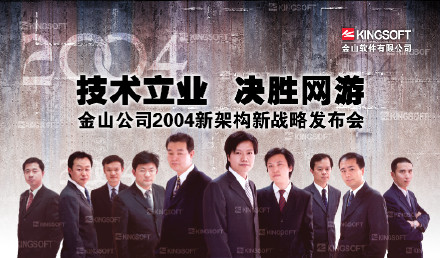
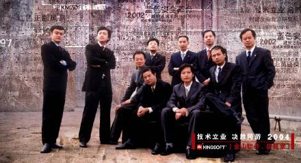

我亲手写的金山招聘广告词

&#x20;(2008-11-13 08:42:01)

&#x20;先贴两张2004年初金山高管耍酷的图片。

&#x20;  这是曾任金山副总裁王春伟的创意，他的各种创意让金山内部“酷”起来了。王春伟最大的爱好就是画油画，经常假借送我油画之名，把我的办公室变成了他的个人展室。

**金山二十年：我亲手写的金山招聘广告词**

&#x20;

1\. 1992年招聘广告词:&#x20;&#xA;**&#x20;  求伯君的今天就是我们的明天。**

&#x20;  1992年我为什么选择金山？我刚刚经历了自己创业失败的挫折，特别想沉下心来一心一意做技术。那个年代，程序员成功只有一条路，就是自己办公司，只做技术就想获得巨大成功是非常不容易的一件事情。求伯君专心致志在金山做技术，成就了一番大事业。求伯君成为了当时程序员的偶像。

&#x20;  我的想法非常简单，沉下心来，下功夫做几年技术，就可能成为“求伯君第二”。这句招聘广告词非常朴素表现了我当时的心声。

&#x20;

2\. 1997年招聘广告词:&#xA;**&#x20;  小时候，我希望登上灯光灿烂的舞台，渴望成为万众瞩目的焦点。长大以后，看到舞台和明星，仍有一丝的冲动。**

**&#x20;  金山造就了求伯君一代的巨星，成就了WPS等知名产品，你想过吗，加入金山？**&#xA;**&#x20;  加入金山，就是加入了激动人心、充满奇迹和梦想的软件行业，就是和一群野心勃勃的年起人一起创业！加入金山，终身不悔的抉择！**

&#x20;  1997年，金山刚刚经历了1996年的挫败后，重新出发的第一年。就是在那一年，金山发布了金山词霸、剑侠情缘、WPS 97等重量级的产品。

&#x20;  我们怀抱着无比热情开始了金山新一轮的创业。这个招聘广告词中，创业、激动人心、野心勃勃等词汇，彰显着金山重新站起来的热情！

&#x20;  万里，现任金山研发副总裁，十年前，他就是看了这个热情澎湃的招聘广告词加入的金山。万里加入金山后，一直在WPS研发部门，战功卓著，现在主管整个软件部门的研发工作。

&#x20;

附：正好我书架上有一本趋势科技创始人张明正的传记，其中有段趋势的招聘广告词：&#xA;**&#x20;  只要你是**&#xA;**&#x20;  爱穿牛仔裤、爱喝可乐、爱穿拖鞋在办公室走动，**&#xA;**&#x20;  喜欢自己写的程序被全世界百万人使用，**&#xA;**&#x20;   并且**&#xA;**&#x20;   热爱新科技，**&#xA;**&#x20;  不怕挑战，更不怕被挑战，**&#xA;**&#x20;   我们欢迎你**&#xA;**&#x20;  赶搭趋势科技列车，**&#xA;**&#x20;  加入Internet梦幻队伍！**

&#x20;

