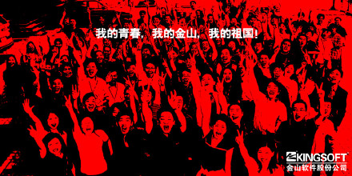

我对金山感情很深

(2008-11-12 00:01:55)

最近，我常常想起过去，记忆中不时飘过金山的影子。

&#x20;  1992年1月，我大学刚毕业半年，在求伯君的感召下，意气奋发加入了金山。到去年年底辞任CEO，一晃，十六年就过去了。不管我内心是否愿意承认，我已经不再年轻了。我已经把我全部的青春年华留在金山了，此生无憾！

&#x20;   回头再看当时的公司内部海报，唏嘘不已：我的青春，我的金山！

&#x20;  这幅海报原型是毒霸研发部门创作的，标题叫“我的青春，我的毒霸”。那是2002年，为了给金山找块根据地，陈飞舟领着一大帮刚毕业的年轻的工程师没日没夜的工作，浴血奋战，在短短的两年多时间，他们用青春、汗水和泪水换来了毒霸前三甲的市场地位。这是一群二十三四岁的年轻小伙子们在奋斗过程中真实写照。

&#x20;  他们的海报在公司内部引起了很大的反响，词霸部门也同时推出了他们的口号“爱上词霸的日子，每天都很精彩”。

&#x20;  后来，公司市场部根据这个创意重新创作，背景采用了部分员工的合影，在全公司内推广了“我的青春，我的金山”这幅海报。

&#x20;  金山就是这样溶汇了无数人年轻人的青春和梦想。

&#x20; 上市那天，我给全员发了一封信，“一起哭过笑过的兄弟们，让我们一起举起庆功的酒杯，一起为我们自己大声欢呼：我们上市了！”陈飞舟看过非常激动，打电话说，只要是热爱金山的同事们都会被“一起哭过笑过”这几个字打动。陈飞舟1998年大学毕业就加入了金山，也加入金山十年多了。他现任金山副总裁，主管游戏部门的研发工作。他的青春，他的热情，也在十年奋斗过程中绽放。

&#x20;  金山的二十年，燃烧着所有金山人的青春和梦想！

&#x20;  金山即将迎来二十周年庆，仅以此文祝贺金山和所有金山人。

&#x20;

附2007年10月9日金山上市当天致全员信

&#x20;

*致全体金山人：*

*&#x3000;　2007年10月9日上午十点整*&#xA;*&#x3000;　金山软件成功在香港主板挂牌上市*&#xA;*&#x3000;　这一刻将永久地铭刻在每个金山人的心里*

*&#x3000;　“宝剑锋至磨砺出，腊梅香自苦寒来”。经过了长达八年的上市准备，我们终于迎来了这一刻的幸福时光。这一刻属于每个金山人，没有大家的拼搏和奋斗就没有今天的灿烂笑容；这一刻属于敬爱的用户以及社会各界的朋友们，没有大家的支持和关心就没有今天的举杯相庆！*&#xA;*&#x3000;　从1988年创办至今，金山经历了十九年的风风雨雨。创业初始，我们憧憬“让我们的软件运行在每台电脑上”；事业低谷，我们依然渴望把金山办成世界一流的软件技术公司。在残酷的产业生存环境和浮躁的商业氛围里，我们始终坚持技术立业，我们始终坚持用户至上，在每个十字路口，我们选择了胜利的方向。面临跨国公司和盗版的双重挤压，金山人不畏艰难险阻，从WPS到金山词霸，从金山毒霸再到网络游戏，越战越勇，在一个又一个战场上大获成功，甚至在日本、越南也获得了足以令国人骄傲的成绩！*&#xA;*&#x3000;　十九年的春去秋来，时间没有在我们的脸上留下印记，我们依然象刚创业一样，充满了激情和活力！八月，金山毒霸成功通过了世界顶级的VB100的测试，成为唯一一款通过VB100的国产杀毒软件；九月，WPS Office 2007顺利发布；前不久，研发了三年半的《春秋Q传》正式公测。我们的各项业务都在快速前进，我深深地为我们的公司感到自豪！*&#xA;*&#x3000;　历史已经充分证明了我们金山是一支有理想有抱负、能打硬仗的团队。“一路上有你，苦一点也愿意”，一起哭过笑过的兄弟们，让我们一起举起庆功的酒杯，一起为我们自己大声欢呼：我们上市了！*&#xA;*&#x3000;　从此刻起，金山翻开了新的一页，我们将以快乐、轻盈的步伐开始乘风破浪、大展宏图的新征程！*

&#x20;

*雷军*
*10/9/2007 于香港*

&#x20;

PS: 我应该算词霸的第一个产品经理，1996年设计并规划这个产品。今天见了词霸现在的负责人，他告诉我金山词霸新版下了很大功夫，甚慰！该版内含六本牛津权威词典，详情请见金山词霸2009牛津版专题。

