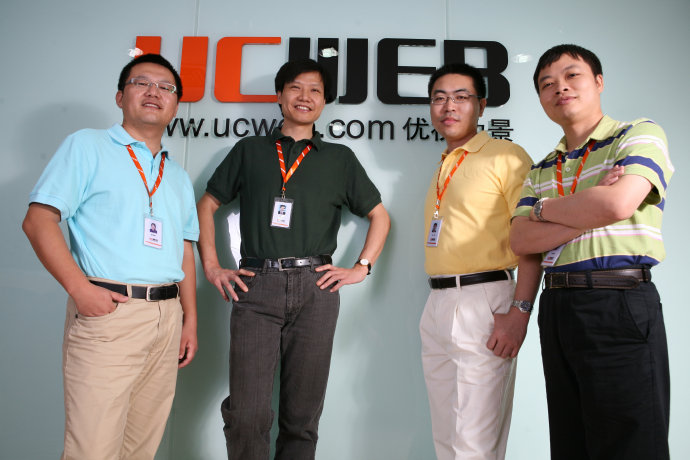

我被俞永福“忽悠”了

(2008-10-27 08:32:54)

**我出任UCWEB董事长的背后故事**

&#x20;   10月16日，UCWEB宣布我出任董事长。不少人问我，为什么在这个时候出任UCWEB董事长。我给大家讲讲背后的故事。

&#x20;

UCWEB团队：CEO俞永福、雷军、技术总裁梁捷、产品总裁何小鹏

&#x20;

一、 俞永福“忽悠”我投资UCWEB

&#x20;   2006年11月20日晚十点，北京某酒吧，俞永福约我喝酒。

&#x20;  当时他在一家投资机构做副总裁，他是我多年的朋友。一见面我就觉得他情绪不对，喝了杯啤酒后，我问他怎么呢。他说他想投UCWEB（手机浏览器），做了好几个月的功课，但下午内部投资决策会，开了四五个小时，他尽了最大的努力，最终还是没通过，他很沮丧。我问永福，这个项目没通过的原因是什么呢？他简单说了当时决策会议上的分歧，比如手机浏览器的竞争格局不明确、没有好的商业模式等等。我说，“半年前，我就开始用UCWEB，总体感觉产品做得挺不错的。你们老板担心的这些问题我到没有仔细想过，但我觉得不是大问题。”

&#x20;  永福突然放下酒杯，盯着我来了一句，“要不您投资吧？”

&#x20;  我愣了一下，虽说我一直也在关注移动互联网的成长，但还从没动过投资UCWEB的念头。还没等我回过神来，就听永福眉飞色舞的“忽悠”了起来：“移动互联网是未来的发展趋势，虽然UCWEB目前还是一个初创的企业，目前用户也只有200万，但长远来看，UCWEB将是移动互联网未来的制高点，发展潜力非常大… …”永福平时说话做事都非常严谨，他在联想工作了五六年，有着浓浓的联想的烙印，他很少这么激动。这次，他越说情绪越激动，我也开始沉浸入他的情绪里。只记得，我也把酒杯一放，立马说道：“永福，这个案子我投了！”

&#x20;  就这么简单，我连价钱都没有讨论就答应了。

&#x20;

二、我“忽悠”俞永福加入UCWEB

&#x20;   UCWEB是何小鹏和粱捷创办的，他们是做技术的好手，但一直困扰他们的就是没有合适的CEO。我看着永福对于UCWEB如此投入，刹那间，就有了“众里寻她千百度”的感受，他不就是CEO的最佳人选吗？！

&#x20;  永福一听我说愿意投资，顿露喜色！但我马上话锋一转，说道，“唯一的一个条件，就是你必须跳进来做CEO。” 这时，他沉默了一会，“雷总，给我两天时间，我要好好想一想”。我知道，风险投资行业薪资和奖金都非常可观，如果对于未来没有足够信心的话，谁也不愿意冒如此大的风险。

&#x20;  我觉得他有点犹豫，就开始“忽悠”他了：“UCWEB有机会做成下一个google, 人生能有几次这样的机会？”没过几天，我正在开会，接到永福的电话，他上来第一句话就说，“雷总，我豁出去了！”

&#x20;  就这样，永福成了UCWEB的CEO。

&#x20;  后来，他告诉我，其实之前他就已经决定了。当天晚上七点多，何小鹏已经提出希望他加入，他很痛快答应了。和我交流的时候，他说的想一想，并不是犹豫是否辞职，而是是否能挑起如此重任。没有立刻答应我，主要是不希望影响我的投资决策。看来，我是白“忽悠”了半天。

&#x20;

三、我被俞永福“忽悠”成了董事长

&#x20;  去年年底，我去广州参加多玩公司董事会。会议结束后，永福坚持要送我到机场，路上又一次激动不已，开始忽悠我，“做了一年，越做越有信心，觉得您当初说得真没错，UCWEB确实可能成为下一个google。如果您挂帅出任董事长，胜算会更大！”我当时没接茬，在我看来，我已经是UCWEB的投资人和董事，这个必要性不大。为了说服我出征，他动员了UCWEB所有的投资人和高管轮番来游说。四月份UCWEB董事会，我答应大家正式考虑这个问题。

&#x20;  在我还没有确认的时候，他就张罗开了，亲自帮我准备办公室，挑茶几、沙发、书柜等家具，甚至还买了个冰箱，装满我常喝的饮料。

&#x20;  到了九月，UCWEB的用户量增长了25倍，日PV过了三亿页，这在移动互联网领域算是非常惊人的成绩，这也着实让我兴奋了一把。拿着业绩，他也知道我对金山感情很深，拿金山开始忽悠我，“和金山一样，UCWEB也是民族软件企业，UCWEB也要对抗世界级巨头……UCWEB未来会成为几千人的软件公司，我们都没有经验，假如您坐镇，将是UCWEB事业腾飞的转折点！”

&#x20;  我原计划休整一两年，没想到，永福一次又一次的劝说，使我终于下定了决心，在这个关键时刻助他一臂之力！

&#x20;  我想清楚后，找他商量，我只做董事长，只管董事长该管的事情，公司的日常运作管理他做主！就这样，2008年10月16日，我正式出任了UCWEB的董事长，和UCWEB所有同事一起开始了这场光荣而伟大的征程。

&#x20;

最后，推荐大家装个UCWEB玩玩。

