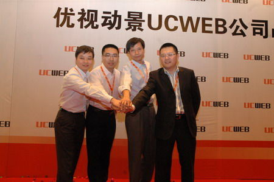

手机上网正在变成一种潮流

(2008-10-25 23:23:58)

【资料】这是我在10月16日UCWEB战略发布会上的发言，表达了我的一些观点，和大家分享。

&#x20;

**移动互联网势不可挡**

&#x20;  几年前我一直在思考一个问题，就是未来十年发展的热点是什么？我认真的想了半年的时间，我认为移动互联网会成为未来十年最热门的方向之一。我相信手机上网会变成这个时代的潮流，在不久的将来，移动互联网业务的规模会远远超过目前互联网业务的规模。环顾全球市场，这个趋势在日本已经越来越明显了。我举一个小例子，日本最大的社交网络Mixi，在一年多前通过手机上网的人仅仅10%，一年后的今天，通过手机上这家网站的人已经超过了60%。这种趋势在我们中国也正在发生。刚才我们的CEO俞总跟我们分享了非常关键的几个数字。第一点，一年零十个月的时间，我们的用户量增长超过25倍，目前在手机上安装并且激活的客户量超过了5000万。还有一个更为振奋的消息是，在一个月前，我们的日PV过了3亿页，用UCWEB上网的人越来越多。

UCWEB团队合影：产品总裁何小鹏、技术总裁梁捷、雷军、CEO俞永福

&#x20;  谈到这里，有不少的朋友们就很困惑，说我周围没有看到谁用手机上网啊？或者说我用了半天很难用啊，简直无法忍受。其实我刚开始用手机上网的时候也有类似的感受，研究很久以后我觉得中国移动互联网发展面临几大瓶颈：上网速度的问题，资费的问题，易用性的问题，还有内容的丰富度问题。我跟大家举一个例子，大家容易理解，比如资费。目前如果不包月，1K就需要几分钱，看新浪新闻，仅看首页就是几十元。使用包月会便宜很多，但包月只包50M。我相信，随着时代的发展，这些问题都会一点点被解决，互联网过去十年就是这样发展过来的。

&#x20;   目前，存在这么多问题，为什么还有这么多人在用呢？我觉得UCWEB做了很大贡献。我是用了UCWEB才真正开始使用手机上网的，它有效的解决了一些问题。第一个，比如说资费。刚才我们的创始人梁捷说，我们用了云计算，实际上客户在手机上所看到的内容是通过我们的服务器压缩、转换格式以后传输到你的手机上的。比如说新浪新闻首页转到我们的手机上只有100K，连原来的1/10都不到，所以我们被网民誉为最省钱的浏览器，是因为我们用了云计算的服务。第二个，最让我心焦倒不是电话费的问题，最难受的是按一页等30秒。但是用了UCWEB以后，做了非常多巧妙的设计，有效缓解了这种压力。比如说，UCWEB可以打开多页，一般用户是先点5页，等点完的时候，转到那一页的时候那一页已经打开了，这样就不会有等待感了。所以UCWEB就是做了这些适合中国网络环境的改善以后，使UCWEB的用户体验就不一样了。

&#x20;   2006年底，俞永福找我，说公司没钱了，当时我毫不犹豫的说我愿意投资UCWEB。我为什么这样快就决定了呢？第一个原因就是我看到了UCWEB所蕴含的巨大潜力。它实际上是推动手机用户上网的一个通道或者是平台，它具备成为谷歌、百度、腾讯的这种可能性，这个项目就有了巨大的潜力。第二个原因，这两个创业者有梦想，有热情，加上永福和更多同事的加入以后团队非常完整。所以我当时就拍板说给他们投了几百万人民币。

&#x20;  通过一年零十个月相互的共事和磨合以后，我对UCWEB的感情越来越深，而且对UCWEB的理解也越来越透彻。永福他们提出说，你多花点时间来帮帮我们？我真的深深为UCWEB梦想所吸引，我答应他们出任董事长来帮助UCWEB。首先我觉得UCWEB是一个光荣而伟大的事业。今天UCWEB能够帮助更多的用户使用手机上网，能让更多的人享受到手机上网的乐趣，这当然是一件伟大的事情。第二点，很多朋友提醒我说，浏览器这一块不好干，你看都是谷歌、微软等巨头的游戏，我跟他们说我喜欢这种跟世界巨头角逐的工作。

&#x20;  UCWEB的梦想是每个中国用户都能用UCWEB，能够帮助大家把互联网装入口袋里，而且致力于推动整个手机上网的伟大事业。就任后，一直在和管理团队深入讨论UCWEB战略问题。今天告诉大家，我们的战略分两步实施：第一个阶段的目标，一年内，我们希望和我们所有合作伙伴一起，日浏览量过10亿页的PV，日活跃客户超过一千万人。第二个阶段的目标是五年之内成为中国成为中国最大的移动互联网的技术服务公司，用更长的时间通过跟世界巨头的较量，然后一步一步提高自己的核心竞争力，成为一家世界级的技术公司，这就是我们在未来五到十年的战略规划和目标。

&#x20;  UCWEB目前还是一个非常小的公司，只有200人。但是，我希望大家能看到这一个产品和这家公司所蕴含的未来快速成长的可能性和机会。今天UCWEB还只是一个小树苗，有了大家的关怀和支持，我相信不久的将来，UCWEB就能长成一棵参天大树，甚至做成让大家骄傲的世界一流企业！

&#x20;

PS：推荐大家装个UCWEB玩玩。

