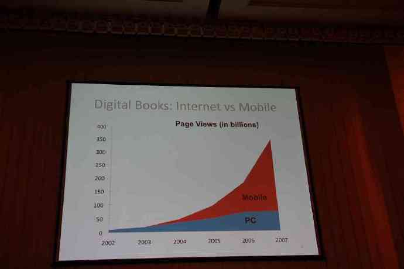
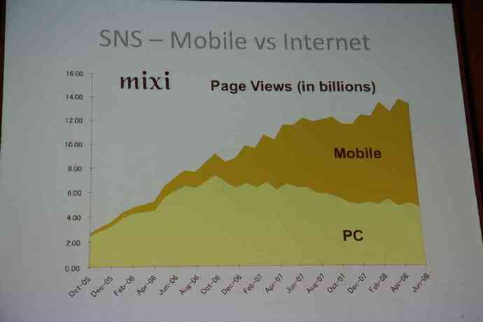
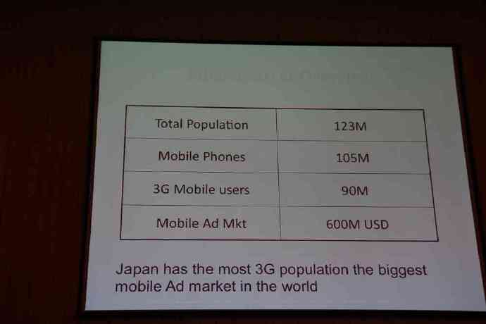
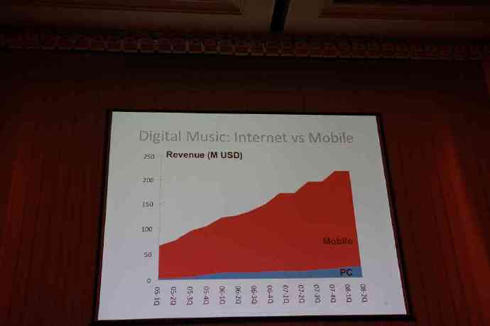

日本移动互联网：让人震撼的一组图片

(2008-11-21 09:19:46)

**现在是移动互联网创业最好的时候**

&#x20;  上周，日本举办了Infinity Ventures Summit 2008，这个会是日本移动互联网行业的年会。日本互联网和移动互联网的巨头都参加了，Yahoo Japan, DeNA, Mixi等公司高管到场并做了主题发言，与会的还有来自十多个国家的众多移动互联网企业。中国移动互联网长城会的会员单位悉数出席，UCWEB、3G门户、Yicha搜索、3G泡泡、天下网、当乐、网秦、Moabc等均派出CEO或总裁出席本次会议。

&#x20;   俞永福（UCWEB CEO）参会回来后，谈了几点主要感受：移动互联网在日本已成主流，不久的将来，在中国也会成为主流；目前中国移动互联网处于日本市场的04-05年的状态，大致晚了三年左右；按日本经验，估计明年将是中国移动互联网大发展的一年，预计活跃用户的增长率将超过100％。这次金山二十周年庆典，日本金山CEO沈海寅到北京，我也问了他日本的情况，他有同感。

&#x20;

**1. 到2007年底，日本移动互联网的流量已经是互联网流量的四倍**

**2. 日本最大SNS网络 Mixi的流量图表明：2006年10月是一个重要的拐点，来自互联网的流量达到顶峰，接着开始逐步下滑；来自移动移动互联网的流量快速增长，截至2008年6月，已经超过总流量70％。**

**3. 日本有9000万3G用户、6亿美元的移动互联网广告市场，全球最大。**

**4. 日本数字音乐市场，移动互联网的营收是互联网的十多倍。**

&#x20;

我的观点是，**移动互联网在中国正在变成一种潮流，不久的将来，移动互联网的业务规模会超过互联网的规模！现在，是进入移动互联网创业的大好时机！**

&#x20;  提醒手机上网的用户，一定别忘了开通GPRS包月。一般是20元包50M，用 UCWEB 上网理论上足够。注意，包月是从下月一号开始算起。另外，超出部分0.01元/k，好象是500元封顶。各地资费略有不同。当然，我觉得未来资费一定会越来越便宜。

