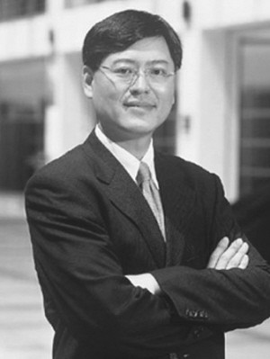

杨元庆的毕业典礼

(2009-02-05 16:00:00)

四年前，杨元庆为了并购IBM PC的大梦想而卸任CEO，我就相信，他只是进入了一个跨国公司CEO的培训课程，四五年后，他一定会回来！今天杨元庆重新出任CEO，是他跨国公司CEO课程的毕业典礼！

&#x20;

现在的联想处在生死存亡之际，我相信，柳总重新出山护航，杨元庆一定会把联想带出困境。

1. **回顾“杨元庆离职”传言**

&#x20;

去年年底，杨元庆因业绩不好要下课的传言越传越甚，我百思不得其解：联想业绩不好，首先应该下课的是CEO，怎么会是杨元庆呢？

&#x20;

在海外上市公司的治理结构中，对公司业绩负责的是CEO，不是董事长。如果公司业绩不好，首先需要承担责任是CEO。除非有一种极端的情况发生，就是董事会认为杨元庆干扰了管理层的决策，导致业绩滑坡。联想购并IBM PC部门后，杨元庆卸任CEO改任董事长。柳传志给杨元庆的要求就是“妥协”。过去四年时间，杨元庆和两任老外CEO一定有不少分歧，我相信杨元庆一定会“妥协”，就是不妥协也不会留下越权的话柄。

&#x20;

为什么有这样的传言呢？

&#x20;

联想股价从一年多前的 HK$8.73，下降到HK$1.35，跌掉了 85%的市值，市值最低只有12亿美元了。可能不少人都认为这是市场大环境的原因，整个股市都在狂跌。

&#x20;

我们再看看，去年Q4，同样的市场环境，HP和Acer保持了很好的增长，而联想市场份额下滑0.4%，综合销售额下降20%，毛利下降48%，亏损为9,700万美元。这些数字触目惊心，如果再不改善，联想可能会挂。这个时候，联想的确已经到了生死存亡的时刻。

&#x20;

杨元庆看在眼里，痛在心里，他无法忍受！联想承载了他所有的成就和梦想，承载着柳传志等联想创业者的光荣与梦想，也承载着所有联想员工和无数中国人的梦想。如果联想输了，毕竟他是董事长，他难辞其咎，他个人的近乎完美的职业简历荡然无存。他不愿意输，当然他也输不起！在这个生死关头，杨元庆不愿意再“妥协”了。

&#x20;

我估计他认为自己该毕业了，于是他摊牌了。

&#x20;

* **回顾“联想收购IBM PC”**

&#x20;

2004年12月8日，联想宣布并购IBM PC，股市狂跌。从TCL和明基的挫折中，现在每个人都知道购并国外公司不是一件容易的事情。在柳总他们不同意的前提下，杨元庆为什么力主了风险极大的IBM PC合并案呢？

&#x20;

我相信，杨元庆渴望把联想办成世界的联想，渴望成就一家世界级的企业。就是这样的驱动力，他决定压上所有赌注，勇创虎穴！为了这个梦想，他愿意“妥协”，甚至不做CEO。要知道，柳总不同意，就意味着杨元庆要负全部责任，这需要何等的勇气和决心！中国有多少CEO能做这样的决定？！

&#x20;

我请教了不少同行和专家，几乎没有人看好这个合并案。但我从内心深处还是非常支持这个合并案，因为杨元庆，因为联想。杨元庆是中国最优秀的企业家之一，他有极强的内在驱动力，同时联想也是一支有超强学习能力和战斗力的团队。

&#x20;

在今天这个时代，如果联想并购失败，我相信没有第二家中国公司能完成这样的并购。中国要办世界级的企业，就一定会面临大规模跨国的并购，联想是先行者。如果成功，他们是丰碑；如果失败，也会给后来者留下宝贵的经验。纵使今天，联想遇到了非常大的困难，我依然支持杨元庆！

&#x20;

这个世界上，总要有人踏出这一步的。联想一小步，中国IT业的一大步！

&#x20;

* **&#x20;杨元庆的毕业典礼**

&#x20;

四年前，杨元庆卸任CEO。我非常纳闷，柳传志为什么这么做，杨元庆为什么愿意接受？因为在我心里，杨元庆是中国最杰出的CEO之一，他热爱他的事业，他不可能接受这样的安排。杨元庆曾担任过两年金山的董事长，我们有过不长的共事经历。

&#x20;

当时我想了很久，最后基本相通了。这的确体现了柳传志的大智慧。直接让杨元庆做CEO，管理一个大规模的跨国企业，风险太大了。TCL和明基的例子就在眼前。先让老外做CEO，管理跨国公司，毕竟经验丰富。安排杨元庆做董事长，坐在边上学习，这是把一个中国优秀的CEO培养成世界级CEO速成的办法。当时我就坚信，杨元庆不会就此退休，四五年后他一定会复出，重新出任联想CEO。

&#x20;

联想先巨资请了IBM高级副总裁做CEO，再巨资请了戴尔高级副总裁做CEO，代价不可谓不大。当然，杨元庆学习不可谓不努力，把家和办公室都搬到人生地不熟的美国。四年下来，语言过关了，做过印度等新兴市场，做过欧洲成熟市场，成绩斐然。

&#x20;

今天，联想宣布杨元庆重新出任CEO，这就是杨元庆的毕业典礼！四年的跨国公司CEO的课程，杨元庆终于毕业了！祝贺杨元庆！

&#x20;

* **继续看好联想**

&#x20;

今天的市场惊涛骇浪，杨元庆毕竟初次出海，还是有风险。

&#x20;

为了联想的长远事业，联想董事会费尽心机。先请柳传志重新出马，担任主席，亲自保驾护航。再请一个老外担任总裁兼COO，兼顾国际化形象。这是一个非常了不起的安排。

&#x20;

首先，柳总重新上阵，是一招妙棋。这给全体员工、整个市场极大的信心，也能让杨元庆更专注在业务一线。但对柳总来说，是一个艰难决策。当我看到柳总的专访中，“联想是我的命，再出山义不容辞”等，深深为柳总这样老一代企业家的风范所感动。

&#x20;

其次，请老外辅佐，可以有效增强杨元庆国际化能力，避免海外业务团队的反弹，进一步推动联想国际化业务。也是一个完美安排。

&#x20;

柳杨组合，再大的风雨，我相信，他们都能经历。多给一点时间，多给一点掌声，多容忍一些挫折，一家真正有世界竞争力的中国公司会诞生！

&#x20;

**附：2/6, 联想股票上涨 11%，市场表达了对整个团队调整的强劲支持！&#x20;**
