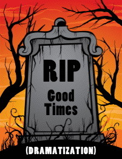

红杉资本：经济严冬慎用资金

(2008-10-25 22:47:34)

【资料】这是目前创业圈子里面转发最多的一篇文章，推荐大家仔细看看。原文《现金比你妈妈重要》这个标题有点耸人听闻，我改成更正式的标题了。世界顶级的风险投资家红杉资本的合伙人这样表达的，他的目的只是为了说明经济危机的可怕性。

&#x20;  本文观点不代表我的意见，转载只是供创业家参考。

&#x20;

美国红杉资本致信旗下公司CEO：经济严冬慎用资金、现金比你妈妈更重要

&#x20;  2008年10月15日，著名的风险投资企业红杉资本上周成了所有新闻媒体的焦点。红杉资本在上周召集了 “紧急会议”，超过100个旗下公司的首席执行官出席了会议。在会上红杉资本主要合伙人均对当前形势预期悲观，同时要求旗下公司节省资金。目前已经有人将红杉资本在此次会议上发布的幻灯片登在网上，红杉资本近日还发给旗下公司首席执行官一封信件，相比于幻灯片而言，这封信更能表达红杉资本的对当前经济状况的认知。

　　红杉资本在风险投资行业是首屈一指的企业。它资助过苹果、思科、雅虎和谷歌等企业，对它们的巨大成功功不可没。因此，当红杉资本发表对经济前景的预期时，市场非常关注。这封信目前已经在市场上疯传，市场分析人士表示，这封信反映了红杉资本多年来所坚持的投资真正智慧，这些智慧使红杉资本取得了巨大的成功。但有分析人士也不赞同信中所流露出的经济前景黯淡的观点，认为不可能出现“15年的熊市”，至少在IT和绿色技术行业里不会出现。分析人士对IT行业充满信心，表示尽管目前股市动荡不安，但风险投资公司创新不断，足以应对金融危机。

安息吧，黄金时代

&#x20;

亲爱的红杉旗下公司CEO，

　　现在到了十分危急的时刻。大家注意到谷歌、雅虎和思科等公司最近的股价了吗？他们全都暴跌。谷歌的市盈率已跌至只有原来的二十分之一。你们知道这意味着什么吗？红杉资本合伙人的净资产总计损失达几十亿美元。数十亿美元啊！遭受如此大的损失，我们现在都不再是亿万富豪了。当初，纳斯达克突破2500点时，我们公司至少有六个十亿美元富豪。现在一个都没有了。也就是说，本打算50出头退休的我们，现在若想实现亿万富豪的人生目标，大多数人只能继续奋斗下去。我们也许再也看不到10亿美元了？还是打消这种想法吧。

　　大家应该了解的另一件事是，在我们有限的投资者面前，我们再次显得山穷水尽了。我们在互联网泡沫破裂时也曾遭遇类似的危机，当时，我们过于自信，在那种情况下还坚持投资了Webvan和eToys。尽管我们的创始人唐•瓦伦丁(Don Valentine)早在1999年中期就预测“将有许多互联网公司破产”，但我们仍做出这些投资。现在全世界都知道，我们是惨败而归。我们不得不站在所有投资者面前，对我们如此愚蠢的行为表示歉意。想想吧，红杉资本竟然公开道歉！

　　也许，一系列投资的成功冲昏了我们的头脑，让我们不知不觉放松了警惕。我们在YouTube的投资带来了8亿美元的回报，投资其他Web 2.0公司也让我们获利数百万美元。我们本应该更早敲响警钟，现在，我们想提醒大家再次注意红杉资本对我们所投资的公司的各项要求：

　　1. 市场规模和时机就是一切！我们不会花钱去告诉人们，他们为何要喜欢你们的产品。很多VC在刚起步的公司身上浪费了几十亿美元，这些公司在市场尚未形成之前便去开发产品。

　　2. 我们还要重申一下第一点的重要性，也就是说，市场规模比你们本人更加重要。正如我们一向说的那样，你们不能改变市场机遇，但可以撤换CEO。

　　3. 我们的投资理念是，仅仅用一根火柴点燃地狱般的火海。假如你们不理解这个类比，我们再解释一遍，那就是产品一定要做到节约，节约，再节约！任何刚刚起步的公司只有两项任务：一是“生产产品”，一是“销售产品”。如果你们的团队中有人做不到这两点，那就炒他的鱿鱼。

　　4. 不要租用昂贵的办公楼，不要铺张浪费。

　　5. 聘请一些年轻聪慧的移民。他们的薪水比最低工资水平稍高，每周可以工作100个小时以上——相信我们。红杉资本有个秘密：过去15年，在我们多数最划算的投资交易中，对方的创业团队中都有二十出头、很有拼劲的年轻移民，例如谷歌的塞吉•布林(Sergey Brin)和YouTube的陈士骏。

　　6. 一旦产品开发出来，你们就应该考虑减少工程师数量，因为他们中很多人已不再有用。工程效率才是至关重要的！

　　7. 管理层每一个人都应参与产品销售，这样，管理人员才能真正了解自己所销售的产品以及如何成功进行销售。这件事情必须在扩大销售团队之前进行。

　　8. 解散吃得肥头大耳的销售团队，硅谷到处充斥着这些拿着高额底薪和奖金的销售人员。把底薪控制在最低水平，在销售人员实现较高的销售目标后再给予他们大量奖励。

　　9. 要明察市场，打击竞争对手，揭露他们的缺陷，在经济不景气的情况下更要如此。他们受伤了，才会安静下来。绝不能像他们一样。要么进攻，要么等死。

　　10. 现金比你妈妈更重要！(你们已经领会到这一点了吗？)

　　现在的确已到了危急时刻。与其它所有投资集团一样，我们也通过PowerPoint解释当前世界上正在发生的事情，但我们也不知道到底怎么了。我们唯一清楚的是，将类似YouTube这样一家已没有多大盈利空间的公司以超过16亿美元价格卖给谷歌的日子已经一去不复返了，至少现在来说是这样的。如果你们仍对自己的公司抱有这种幻想，那么在下一轮融资行动中，你们可能要到Kleiner Perkins碰运气了，我们将不再向你们提供资金。

　　让我们重申一次：在用光我们提供的资金之前，你们的现金流仍没有什么起色的话，那就不要再伸手向我们要钱！

&#x20;

PS：英文比较好的朋友请看英文原文

