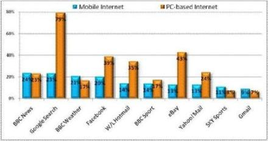

英国手机网民爱看天气

(2008-11-28 09:30:00)

**1. 英国移动互联网Q3用户达730万，比上季增长25％**

&#x20; 根据尼尔森数据显示，英国移动互联网用户截至到今年三季度，已经达到730万人。相比2008年第二季度580万用户的数量，英国移动互联网用户在第三季度增长了25%。而在同一时期，传统互联网用户从3430万增长到3530万，仅仅增长了100万。

&#x20;   Nielsen 资深分析师 Kent Ferguson称“实际上，天气、体育、新闻、EMAIL这几类站点是访问比较靠前的移动互联网站点。这说明消费者对移动互联网站点的需求倾向于功能性或即时性需求（收发EMAIL为代表），这与传统互联网以娱乐和财经理财为主要站点有很大的不同。”

&#x20;   英国BBC Weather则是被访问最多的移动互联网站点之一，只有BBC News和 Google以约170万月访问用户排在BBC Weather前面。BBC Weather每个月接纳150万用户访问，根据尼尔森数据显示，其是2008年第三季度全英国排名第三的移动互联网网站。这表示约有21%的英国移动互联网用户会访问这个站点，远远高于通过互联网访问的比例。

&#x20;  EMAIL和SNS类站点也受到用户的普遍关注。其中Facebook以每个月150万访问者排在第4位，Hotmail以每月100万用户排在第5位。另外YAHOO MAIL 接近90万的月度用户数和GMAIL的60万月度用户数都让他们挤身10强当中。前十名中还有BBC Sport 和Sky Sports及eBay.

&#x20;  另外一个毫无悬念，但是不得不提的Nielsen报告内容是：移动互联网比传统互联网拥有更多的年轻用户。25%的移动互联网用户属于15-24岁的年轻族群，而传统互联网用户这个年龄段所占有的比例约为16%。

**2. 英国移动互联网Q1渗透率达到了12.9%**

&#x20;  根据Nielsen研究报告，移动互联网目前在英国第二季度的渗透率达到12.9%，低于美国的15.6%，高于意大利的11.9%。在今年的前三个月，28%的英国移动互联网用户，通过无线设备浏览网站时会取消收看广告，建议该国促进移动广告市场的发展。

&#x20;  不限量包月计划的推广，逐渐改善的浏览器体验，更快的下载速度，以及更丰富的移动互联网网站，都带动了移动互联网的增长。

