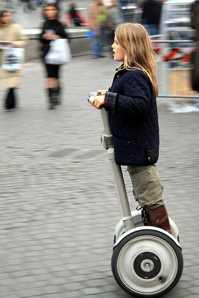
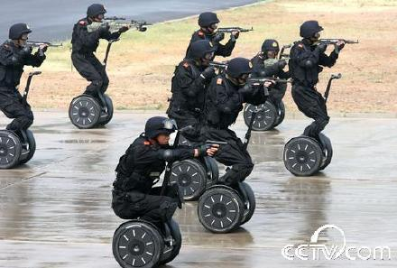

苹果CEO乔布斯脑子里怎么想的

(2008-10-28 02:58:43)

&#x20;八十年代乔布斯凭借Apple电脑独步江湖、红极一时，后来因为太拽被自己创办的苹果公司撵出门外，谁也没有想到，十年后重新杀回来，凭借 iMac/ iPod/iPhone 一个又一个雷人的产品重新成为了二十一世纪的巨星。所有人倾倒之时都很好奇，他脑子里到底怎么想的？

&#x20;  国外有篇文章介绍乔布斯参加 Segway 原型车的讨论会，生动地表现了乔布斯如何考虑产品的。张亮翻译了一部分再上有趣的解读，我在该文基础上，做了一个简化版本，并加了 Segway Scooter 产品说明，方便大家阅读。

&#x20;   先给大家介绍一下 Segway Scooter 代步车，设计相对新颖有趣。Scooter 是一个两轮电动车，能自动平衡，身体前倾车就前行，身体转动车也跟着转动，可以跑40公里/小时，售价大约四五万。去年我借了一部玩过几天，几乎人见人爱，就是太贵了。今年奥运，我没想到 Segway Scooter 还成了武警反恐的新装备，酷吧？！

&#x20;

&#x20;

**乔布斯脑子里面怎么想的**

&#x20;   Segway 代步车原型出来，乔布斯试用后彻夜未眠，第二天参加了该产品的讨论会，乔布斯问了四个非常好的问题：

&#x20;

第一问：产品定位
&#x20;   Segway 公司想出两款型号，分别针对个人和商用市场。
&#x20;  乔布斯问他们为什么要出两款？为什么不先出一个普通版本，卖个几千块美元，真的热销了，再出把价格翻倍的增强版，针对工业和军事领域呢？他开始讲自己做 iMac 的经历，为什么他在发布了第一款 iMac 之后等了七个月才推出其他花色？他希望他的设计师、销售人员、公关，都100%的聚焦。就是说，他一上来，会把自己的退路封死。毫无疑问，同时做两款产品，无论哪款都会有一些侥幸心理，即使这款不好，那款成功也够了。人们就很容易说服自己放弃对单一产品的热忱。但乔布斯的思考方法，会让全公司上下永远孤注一掷，这也就是外界经常说的，他的员工会被他压迫得爆发出潜能来。

&#x20;

第二问：产品设计

&#x20;   乔布斯问Segway 公司，你们觉得你们的产品怎么样，然后评论原型产品是狗屎。乔布斯一瞬间说出了三个评判标准：它的外形不创新、它不优雅、也感觉不到人性化。“你拥有让人难以置信的创新的机器，但外形看上去却非常地传统”。最后，他给了建议：去找一家最好的设计公司，一定要做出让你看到之后会被雷得拉一裤子的牛叉产品！

&#x20;  这段的信息量同样很足，因为它很简明的总结出乔布斯的三个设计标准：设计是否出奇，或者是否优雅，或者是否足够人性化。

&#x20;

第三问：产品生产
&#x20;  Segway担心技术被仿制，想设立工厂自己生产。
&#x20;   乔布斯问，为什么你们要盖个工厂？他坚决反对。乔布斯的想法是用时间和资金去找到其他壁垒。就像 iPod 和 iTunes 的相伴，iPhone 时代靠手机补贴获得的低价等构造了应用开发平台和appstore 等一道道护城河，把 iPhone 小心呵护起来。

&#x20;

第四问：产品营销

&#x20;  如何卖这个产品？

&#x20;  乔布斯先给了一个保守方案：把这机器，在斯坦佛这样的一流大学、迪斯尼这样的主题公园里，做小规模推广。但他立刻补充说，这风险也不小，如果有一个倒霉孩子在斯坦佛不小心摔一跤，然后在网上乱骂一顿 Scooter，公司就完蛋了。如果是一个大规模的发售呢，一点点麻烦不会从根本上伤害公司。老乔说“我是个大爆炸主义者”，说完这句话，他乐了，“高举高打的风险，就是你把自己暴露给你的敌人，你需要很多钱跟仿制者作战。”

&#x20;   经过乔兄指点后的 Segway Scooter 产品，果然很酷！

&#x20;

