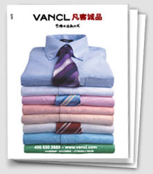
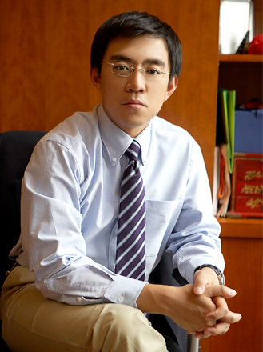

超级离谱的VANCL融资经历

(2008-11-26 09:15:18)

&#x20;电子商务在中国是一个非常有前途的行业，到目前已经有了十年历史，但依然存在很多的困难，如购物过程中的支付、配送及信誉等问题，还有改变用户购物的习惯等问题。这些困难的解决不仅仅需要很长时间，还需要投入大量的资金。因此，整个行业还是一个非常“烧钱”的行业，创业首要解决的难题就是融资。

&#x20;

**VANCL创业系列之二：一年完成了三轮数千万美元的融资**

&#x20;  创办卓越网的时候，我们融资遇到了很多困难，几次面临无米下锅的状态，我才会下了很大功夫琢磨如何融资。我把我的心得总结成了十大标准。满足了十大标准的创业项目，如UCWEB、VANCL，融资会相对容易。我介绍 UCWEB 和 VANCL 融资过程的目的，是希望给创业者一个具体可参照的对象。希望创业者一定要仔细琢磨十大标准，尽量完善自己的想法，然后再去融资，也会比较容易成功的。

&#x20;  再次推荐创业者仔细看看这两篇文章：

[ 评估创业项目的十大标准](https://y4pc2g8csc.feishu.cn/wiki/VrvRwB3B0iODqgkY1ifcPzPBnjf)

[ “我怎么才能融到钱”](https://y4pc2g8csc.feishu.cn/wiki/WHlPwaUAMifN3EkDND4cWSnGneh)

&#x20; 卓越网创办于2000年5月。这个时间点是美国互联网泡沫破灭的时候，此后的三四年，我一直被资金所困恼。

&#x20;  这次创办VANCL的时候，我想的最多是如何融到足够多的钱，让陈年和创业团队有足够的资金把VANCL做成一家伟大的企业。这次我们幸运得多，首先遇到了很多“贵人”，其次时间点把握比较好，在金融海啸之前，我们完成了三轮数千万美元的融资。

&#x20;  坐拥数千万美元现金过冬，VANCL日子过得会比较滋润。

&#x20;

**第一轮融资：公司还没设立，我们就融了两百万美元**

&#x20;  我们决定先找几家熟悉的VC谈谈。

&#x20;  去年七月的某天下午，具体日期我忘记了，我去找联创策源合伙人冯波谈，他去找IDG合伙人林栋梁谈。

&#x20;  联创策源办公室在北京秦老胡同的一个四合院里，在冯波的茶室里，我先谈了卓越网的光辉历程，谈了对PPG不足之处的分析，然后讲了我们将如何做。他对PPG模式非常了解，我们聊得非常投缘。不到半小时时间，他就拍板同意投资。最后他开玩笑说，他还有一个条件，让他见见传说中的陈年。

&#x20;  晚上喝酒的时候，陈年告诉我，他和IDG林栋梁在友谊宾馆谈的也比较顺利。林栋梁问他，是不是下定了决心，他说是的，最后林栋梁说他回去和其他合伙人商量一下，过几天答复。第二天林栋梁就来电话说，IDG也参与投资。

&#x20;  就这样，我们公司还没有注册，策源和IDG就承诺了各投一百万美元。

&#x20;  一年多来，这两家VC给了我们很大的帮助，我们也合作得非常愉快。尤其是策源的冯波，虽然我没有见过他穿VANCL，但他非常喜欢VANCL，经常给我们提各种各样的建议。他在美国念书的时候学的是电影导演，一位非常智慧的风险投资家，和他一起喝茶聊天是件很享受的事情。

&#x20;

**插曲：鼎辉接着要加投我们一千万美元**

&#x20;  去年九月初，VANCL还在紧锣密鼓的筹备中。

&#x20;  鼎晖的合伙人王功权到我办公室来拜访。我们聊到了VANCL，他马上有了兴趣，立刻就问，“我们还能再投一千万美元吗？”我说，“谢谢了，我们公司还没开张。”王功权说，“没有关系，我相信你们一定能做成。”

&#x20;  当时他就向我要了陈年的电话，当天晚上十点，就约了陈年，一直聊到凌晨一点多。很快，这个案子就上了鼎晖的决策会。

&#x20;  遗憾的是没通过，因为有合伙人质疑我们能不能短时间做成一个服装品牌。的确，传统的服装品牌都是花了十年以上的时间才建立的。

&#x20;  今天回想起来，我还是非常感谢王功权，他给了我们巨大信心。他是万通集团的联合创办人，一位杰出的风险投资家，在IDG的时候投资了周鸿祎的3721，后来到鼎辉他继续投了周鸿祎的奇虎。

&#x20;

**第二轮融资：开业不到两个月完成了第二轮融资**

&#x20;  10月18日，VANCL正式上线了。

&#x20;  我每天都能听到陈年的捷报，那时陈年的口头禅：我们真的挺牛的。VANCL的横空出世，快速窜红，引起了投资圈极大的反响。那时几乎每天都有人问我们是否融资，逼得我们思考是立刻融资还是做大一点后再融资。

&#x20;  12月下旬，董事会召开了紧急会议商量，做出了立刻融资的决定。冯波希望我们尽快完成融资，不要花太多的时间，主要精力还是要放在业务上。当时业务在高速成长，我们还面对一个大我们十倍的竞争对手，我们的确没有太多精力谈投资。

&#x20;  我们仔细讨论了融资策略后，决定公司定价可以适当低一点，但关键在于速度。我们希望两周内完成整个融资过程。这对VC来说，是一个相当苛刻的条件。

&#x20;   我们立刻约谈了几家最有兴趣的VC一起谈，这几家兴趣都非常大，响应速度非常快。其中软银赛富合伙人羊东兴趣最浓厚，但他们处在非常不利的位置，因为他们所有人都在新西兰开会，一周后才能回来。当时，我的态度非常明确，谁的速度快我们选择谁。在这样的情况下，羊东做出了巨大努力，在新西兰他们召开了一个紧急决策会，当天下午五点就打电话给我，他们通过了。软银赛富作为国内管理十多亿美元资金的顶级投资者，合伙人全部在国外，和我们用电话沟通的情况下，只用了几天时间就拍板了投资VANCL，这是一件很不容易的事。

&#x20;  当天下午七点，另外一家大牌VC也通过了决策会，其实他们的决策效率也极其惊人，但遗憾的是晚了两个小时。

&#x20;  最后我们选择了软银赛富。一月初，钱就到帐了。

&#x20;  羊东是第一位穿VANCL的风险投资家，他帮VANCL做了非常重要的一件事情，就是做了VANCL的服装代言人。

代言VANCL的软银赛富合伙人羊东

**第三轮融资：六天搞定数千万美元的投资意向书**

&#x20;  经过七八个月的努力，我们的业绩扶摇而上，已经成为了服装电子商务的第一品牌。

&#x20;  这个时候，我们迫切需要融更多的钱，引入国际一线品牌的供应商来提升产品品质。VANCL产品的品质和口碑是VANCL的生命线，没有足够的资金很难说服优质的供应商。董事会商量后，我们决定启动第三轮融资。这次我们计划融资几千万美元，根据前期和各家VC沟通的情况，我们制定了一个周密的融资方案。

&#x20;  端午节后第一个工作日，2008年6月10日，周二上午，我们的融资开始了。我给最有兴趣的六家VC打了电话，说明了我们的融资条件，我们提出的要求是希望两周之内签订投资协议，然后一个月内完成融资，谁先同意我们选谁。

&#x20;  凡是融过资的创业者都知道，出了第一版的 Termsheet, 一般来说，不花上几个星期的时间，不改上七八个版本是很难完成的。

&#x20;  于是最繁忙的一周开始了。我每天都有十多个电话会，并到各家VC拜访，交流公司情况，回答投资者的各种问题；从当天下午开始几乎每天都有投资者到VANCL办公室来了解情况，忙的时候，陈年也需要在不同的会议室同时接待不同的投资者。

&#x20;   周四，我们就收到了第一份 Termsheet 草稿，这是启明创投童士豪给的。童士豪，英文名叫Hans,是我很好的朋友，我们经常交流投资的心得。他非常看好VANCL，很快说服了他们的投资委员会。

&#x20;  于是，我们协调公司律师，已投资的三家机构合伙人、项目经理和律师，开始讨论启明的文件，提出修改意见，然后反馈给启明。几乎每半天一个版本。我们一边在和启明谈条款，另外一方面同时接待启明的尽职调查。终于在周日下午，所有人达成了一致意见，确定了投资意向书的最终版本。晚上八点，所有人都在文件上签字了。签字后，我的嗓子都有点沙哑了。

&#x20;   从周二上午开始到周日下午，仅仅只有六天时间，启明的投资意向书就搞定了！这一切，我不能不佩服启明的合伙人Hans(童士豪)，是他的强有力的执行力，创造了这样的奇迹。也辛苦了策源、IDG和赛富的合伙人、投资经理以及律师，大家忙了整整一个周末。

&#x20;  签字后的第二天，我打电话给所有参与的VC，表示感谢。有家VC的合伙人正在机场，准备飞北京，计划当天下午到公司来访问，听到这个消息，他非常失望。

&#x20;   一个月后，7月15日，这次融的几千万美元全部到帐了。今天想想，如果晚两个月的话，金融海啸开始了，结果会如何？

&#x20;  今天，VANCL已经成为了服装电子商务的绝对领导者，网上服装的第一品牌。回顾过去，VANCL的三轮融资成功的原因有以下几点：

1. PPG在前面帮我们验证了商业模式，为VANCL创业及融资奠定了良好的基础。

2. VANCL的融资成功，关键在于不断增长的业绩。支撑这个业绩的，是产品品质以及用户的认可。陈年领导的成熟电子商务团队，用一年时间逐步向市场证明了他们的执行力。

3. 投资圈朋友的鼎力支持，联想投资朱立南的建议，联创策源冯波、IDG林栋梁、软银赛富羊东和启明创投Hans(童士豪)的果断决策和投资，这些投资界的老大一起造就了VANCL的奇迹！

   VANCL离最终的成功还有很漫长的路要走。但我坚信，在用户、供应商和合作伙伴支持下，在所有员工的共同努力下，VANCL一定会交出满意的答卷。

&#x20;  最近，陈年写给董事会的邮件中提到，“经过一年的摸索，山东鲁泰、香港溢达等国际一线品牌的供应商已经成为了VANCL的供应商，我们的产品品质得到了进一步提升，用户的重复购买率也大幅提升。在最近几个月的报表中，已经超过50%购买者是回头客，VANCL已经连续两个月盈利！”

&#x20;  祝福陈年，祝福VANCL!
