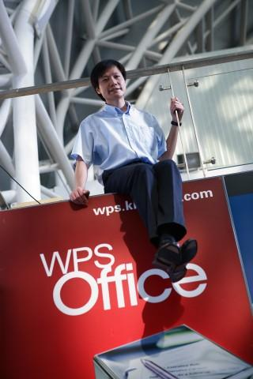

我的第一篇博客：天使投资只是我的业余爱好

(2008-10-24 16:29:39)

去年年底我辞任金山CEO后，很多朋友一直关心我下一步的打算。当听说我做天使投资并且投了几个好项目的时候，特别为我高兴，说我成功转型做了“资本家”。其实，这是大家的误解，天使投资只是我休整阶段一个业余爱好而已。

&#x20;   投资的最重要的目的是获取投资收益。而我做天使投资，投资收益是我考虑得最少的一个因素，更多的原因是分享创业者创业过程的快乐。

**&#x20;  1.首先因为我喜欢**

&#x20;   我喜欢琢磨新的东西，也经常为一些自己或者别人好的主意欢欣鼓舞。我没有精力或能力做那么多不同的事情，这些主意闲置在一边常常让我感到痛苦不堪。我曾努力同时做过不少有趣的事情，但我知道，纵使我每天工作二十四小时，我依然很难让每件事情达到我的预期。我为之焦虑不安。

&#x20;   我还有一个很大的痛苦，我非常喜欢聪明能干的人，非常希望有机会和他们一起共事。以前唯一的办法就是“三十次顾茅庐”请他们来我们公司工作，但这个办法不是每次都奏效。

&#x20;  如何排解这些痛苦呢？我最近两三年终于找到了一种方式，就是做天使投资。我可以投点钱，让这些能干的人来做这些有趣的想法，让他们把这些新奇的想法一点点变成现实。每天和这些牛人交流，时时感受他们创业的热情和智慧的火花，时时看到业务一步一步新的进展，这是多么享受的一件事情呀，如沐春风！&#x20;

**&#x20;  2.其次我想报恩**

&#x20;   这些年，有很多师长、前辈和朋友帮过我，一直心存感恩之心。“滴水之恩，应当涌泉相报”。我做什么才能还得清呢？

&#x20;   比如，在我们金山最困难的时间，1998年，柳传志拍板给我们投资了450万美元，救我们于水火，从此金山走向了腾飞之路。对柳总、对联想这种感激之情不是我们仅仅把公司做好就能还得清的！比如，我的母校武汉大学，给我创业的勇气和自信，赞助一个奖学金就能还得清吗？

&#x20;   想来想去，我觉得尽最大努力帮助创业者，投钱，投时间，帮助这些创业企业成为伟大公司，这是我回报所有帮过我的人最好的方式！

&#x20;   我自己曾经多次创业，我在大学和同学一起创办过一家小公司，1992年初作为第一批创业者参与了金山的创业，2000年我创办了卓越。这三次创业中，我曾多次遭遇公司差点关门。因为这些创业经历，“懂”创业者，所以我非常敬重创业者，也知道他们非常需要帮助。从我的经验和资源的角度来看，我也很容易帮上创业者。每次创业者说谢谢我的时候，我都想说，不用谢我，等你有能力的时候，你再帮其他人吧。

&#x20;   成功的天使投资案例回报的确非常高，经常高达几十倍，甚至几百倍，这样大家可能觉得做天使投资非常赚钱。其实任何投资都有风险，天使投资的风险级别是最高的，仅仅为了一个想法就投入了一两百万元，夸张点讲，无异于拿钱往水里面扔。

&#x20;   目前我还没有做好准备，愿意背负这么大的投资回报压力，而且我担心过于计较回报会影响这个过程的乐趣，所以，我把天使投资当成一个业务爱好而已。

&#x20;  我的确思考过做一个专业的投资者，做一个真正的“资本家”，但我现在还没有准备好。

PS: 最近微软黑屏事件很热闹，顺便推荐大家试试 WPS Office, 个人用户完全免费的，只有二十八兆。

