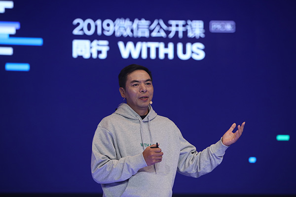
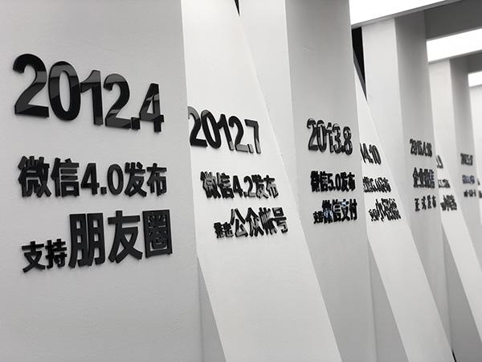
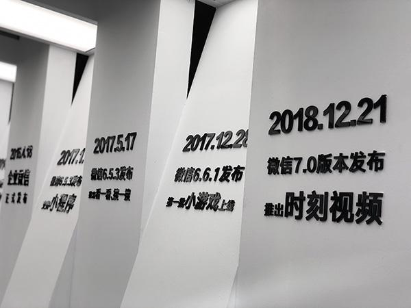

> 2019微信公开课PRO，来了一位最不神秘的神秘大咖——张小龙。和去年分享最大的不同，是分享时间改在了晚上，因为张小龙说预计自己会超时，而晚上超时的空间更大一些。（事实上，果然超了2小时。）
>
> 开场，面对用户对新版微信7.0的吐槽，张小龙说：“每天有5亿人在吐槽，有1亿人想教我做产品.....不过我都习惯了（搓手）。”除了提及对微信新版本的感受，张小龙在现场还分享了：他做微信的两个原动力——做最好的工具和让创造价值的人体现价值、关于小程序、小游戏未来的思考、以及关于社交、AI、阅读的看法等等。
>
> 张小龙喝了一口保温杯里的温水，跟大家分享了他的思考。

# 张小龙4小时演讲全文：我的微信8年总结和下一步要做什么

以下是张小龙演讲内容：

大家好！我是张小龙。

刚刚我们在下面看了一下这些吐槽（“微信之夜吐槽版”开场视频），非常好，因为我每天都在听到这样的声音，都已经习惯了。我觉得在中国来说，每天都有5亿人说我们做得不好，每天还有1亿人想教我怎么样做产品，我觉得这是非常正常的一个事情。但是我来这里不是为了教大家怎么做产品的。

每年我们公关同学问我要不要参加公开课？我总是说，我还没有确定好，我还是要想一想，后来我跟他们提了一个条件：如果我要来的话，能不能把我的时间放到更加晚一点的时间，因为我特别希望我有一个特别好的状态跟大家做交流。后来我用了一个理由说服了我自己，今年我要过来参加一下，因为你连续好几年来参加，突然中断了，有一点把一个行为艺术突然中断的感觉。

有的时候我确实觉得这个更多像一个行为艺术，因为你很难在一个很短的时间里面表达清楚让别人知道。这是一个很长的周期，而且大家都知道我并不擅长演讲，我觉得演讲是一个技术活，是挺专业的事情，我挺尊重专业的。在演讲方面我是业余的。我希望参加这样一个会议，更多只是希望利用这个机会跟大家有一个面对面的交流。

特别是今年这样一个时间点，我觉得很特别，如果是去年的话，大家都会说“七年之痒”，我只能总结怎么样“痒”的。今年是8年，在今年8月份的时候，微信的日登录量超过10亿，这是一个特别大的里程碑，这可能是国内历史上第一款APP有10亿DAU的数量级，我们也没有公布过，可能在我们自己看过来，这只是哪天达到的一个问题。但是对于一个做互联网产品的人来说，应该还是一个很值得庆祝的一个事情。

特别是最近我们发布了微信7.0版本，当然又有5亿人吐槽，有1亿人教我怎样做产品了，并且还有8亿人看不懂我们一句话“因你看见，所以存在”到底是什么意思。在座的有人看懂了吗？看懂了举一下手让我看一下。

谢谢大家！谢谢这么多知音，有10%的人举手了。这一句话可以从很多的层面理解，就像我在朋友圈里面发了一段王阳明的《心学》，但是并不只是从这一个维度，我觉得是从很多的维度，我不想做一个解释，我觉得有一个神秘感特别好，每个人有自己的解读是特别好的。

每个人都有自己的理解会更好一点，就像微信这么多年以来，微信的启动页面总是一个人站在地球前面，刚发布的时候，有很多人问我为什么是一个人站在地球前面，更早的版本是一个人站在月球前面，那个时候也是很有想象力。对于这个点，我相信每个人都有自己的理解。

因为我们没有标准答案，所以这么多年以来，每次当你看到微信这样的一个启动页面，你可能都会有一个想法：这个人在干嘛？他站在地球前面做什么？过了一年你的想法会变一点，再过一年又会变一点。正是因为这样，我觉得才是一个特别好的启动页面，因为他把想象空间留给了用户自己，10亿用户有10个亿的理解，他会找到打动它的点。所以看起来很多的APP都在把自己的启动页变来变去，微信这个不会变，并且我相信将来也不会变。

**关于设计原则**

有一个朋友说，在互联网界，微信就是一个异类。所谓异类，就是和其他的产品都不一样。我其实很惊讶，也很自豪。

自豪的是，做异类是表示你与众不同，那就是很优秀了。惊讶的是，其实微信只是守住了做一个好产品的底线，居然就与众不同了。那是因为很多产品不把自己当产品看待，不把用户当用户看待。而微信，做到了这两点。

微信和很多产品不一样的一些点，会在很多地方体现出来。比如，很多APP到了春节等特定节日的时候，就把logo和界面变成红的、黄的，变成像番茄炒蛋一样。但是微信不会这么做。很多人可能会问我们为什么这么坚持。

这次的公开课我把时间放在晚上，其实还有一个原因，就是如果认真准备一个东西来跟大家分享，那我很有可能会超时，在晚上这个超时的空间是很大的。

现在，微信到了10亿的DAU，在这样的一个点上我更愿意花一定的时间，从微信的起源、本质这些方面来更加全面的讲解一下微信背后到底我们在想什么。

其实有时候我很想问大家一个问题，你觉得什么样的产品是好的产品？是说它有很多的用户？说它让人上瘾，还是什么样的？

我记得在很多年前，当我们在用苹果手机，我们会研究为什么会设计这么好的产品出来？我记得有一位德国的产品设计师Rams总结过好的设计的十个原则，这位设计师也曾经是苹果公司特别推崇的一个人。

我把这十个原则念给大家听下，大家可以对照微信来思考一下，会很有意思。

第一个原则是好的产品富有创意，必须是一个创新的东西。

第二个是好的产品是有用的。

第三个是好的产品是美的。

第四个是好的产品是容易使用的。

第五个是好的产品是很含蓄不招摇的。

第六个原则是好的产品是诚实的。

第七个是好的产品经久不衰，不会随着时间而过时。

第八个原则是好的产品不会放过任何细节。

第九个是它是环保的，不浪费任何资源的。

第十个是尽可能少的设计，或者说少即是多。

其实我在这里偷换了一个概念，将设计替换为通用的产品。很多人会认为这是针对苹果这样的硬件产品的设计原则，但其实软件产品与用户的交互反而是更加频繁的，你做出这样的提示，用户就会这样做，那样的提示就那样做。并且本质上，不管是硬件产品还是软件产品，都是工具。对于工具设计的原则，都是适用的。之所以提到这是个好的设计原则，也是因为我认为业界很多产品并不注重产品设计，或者说不把它作为一个自己追求的目标，还只是一种功能的堆砌或者对用户价值的榨取。

而微信从来不做节日运营或者logo的变化，很多人会说微信很“克制”。但其实这并不是克制的结果，本质上是因为微信一直在遵循一种好的设计原则，使得我们不会去做很多影响设计美感的事情。

而我观察到的很多业界的产品经理，其实毕业后就会被自己所在的公司误导。因为公司的目的是要流量要变现，所以大家的KPI就是如何产生流量如何变现。一旦围绕这个目标，大家的工作目的已经不是做最好的产品，而是用一切手段去获取流量而已。

这并不是我们倡导的原则，我们更多倡导的是利用微信做出好产品分享用户。

我很感谢自己的经历，从PC时代自己一个人做foxmail，到做QQ邮箱，到手机时代做微信，因为经历了太多的产品，以至于从骨子里知道什么是好的产品什么是不好的产品，可能因此能直觉上就遵守一些底线吧。

有一次我问同事一个问题，PC时代，PV最大的页面是什么？答案是IE浏览器的404页面。我问大家，微软为什么不在这个页面放广告呢？同事们回答不出来。这个问题很有意思。是啊，为什么微软不在这么大流量的地方放广告呢？为什么微信不在启动页放开屏广告呢？大家可以自己去想。

微信有8年了。想一想，你每天花在微信上的时间有多少？你花在最亲密的朋友家人身上的时间多，还是你花在微信的时间多？如果微信是一个人，它一定是你最好的朋友，你才愿意花那么多时间给它。那么，我怎么舍得在你最好的朋友脸上，贴一个广告呢？你每次见他，都要先看完广告才能揭开广告跟他说话。

很有意思的是，因为遵循原则，很多东西我们又必须坚持去改变。

这里让我想到微信7.0版本的UI做了一个特别大的调整，也有很多用户吐槽，觉得非常不习惯。

其实任何一个大的改版都会带来用户的不满，因为人习惯于自己熟悉的界面，觉得是最好的。我们没办法让10亿人来投票决定什么是好的，也投不出来。那怎么才能通过改变寻求设计的优化，让它变得更好呢？这个决策必须遵循好的设计原则。

就像微信7.0版本，我们内部使用了很长时间，我自己一直在两个版本不停的切换，当我用了一段时间，我不愿意切换到旧的版本去。也许用户一下子不能接受，但是我相信他们适应以后也会接受。重要的是，我们必须要用我们的产品不停的适应时代，而不是因为害怕用户的抱怨就不去改变它。

尤其是UI上，我们永远不可能让所有的人满意。但是，我们比如让产品越来越美，符合甚至引导当前用户的审美，而不是落伍于时代。

**关于微信的历史**

说完微信一直以来坚持的设计原则，我想简单回顾一下微信的一些历史。

可能很多人都听过这个故事，当时我写了一封邮件给Pony，开启了微信这个项目。这个事情是真实的，但是也有很多不真实的传说，比如去过某某寺庙。想到那封邮件，我时不时会觉得有点后怕，如果那个晚上我没有发这封邮件，而是跑去打桌球去了，可能就没有微信这个产品了，或者是公司另一个团队做的另一个微信。

我发现很多想法是突如其来的，或者说，是上帝编好程序，在合适的时候放到你的脑袋中的。

但也不是完全无迹可寻。在微信上线之前的一年里，我们把QQ邮箱做到了国内第一名，然后在邮箱里面又做了很多尝试，包括漂流瓶等等，包括我花了一年多的时间折腾的邮箱里面的阅读空间。

我们后来的很多产品，都有邮箱阶段的影子在里面，比如订阅号、朋友圈。因为在阅读空间里面，我们尝试了各种社交的形式，基于社交的阅读，朋友推荐文章并且可以在下面共同来评论。

但是由于阅读空间在邮箱里只是一个分支，所以它能做的用户量并不是特别大。所以做到一定的阶段，也觉得这里差不多走到一个尽头，应该去切换一下方向。

当kik出现时，我意识到这里是一个机会，这个机会不是因为kik的产品本身，而是我自己当时开始用智能手机，而很多基于PC的产品或者短信都不能实现很好的沟通体验。所以当时想法很简单，希望给我自己或者少数人做一个沟通的工具。而且我们刚好有一个团队在做QQ邮箱手机客户端，所以刚好凑了十个人的团队开始做微信。包括后台开发，三个手机平台的前端开发，还有UI，加我自己带了一个产品毕业生，就十个人。经过两个月的时间，做出了第一个版本。

这就是微信的起源，而今年刚好是微信的第八年，也是一个具有里程碑意义的阶段，标志着一个产品从出生走向成熟。

我们当时坚持了一个原则就是，一个新的产品没有获得一个自然的增长曲线，我们就不应该去推广它，所以在前5个月里面，我们基本上没有自己去推广它，我们只是想看微信这样一个产品对于用户有没有构成吸引力？用户是否愿意自发传播它，如果用户不愿意，我们怎么样去推广它也是没有意义的。

我记得从微信2.0开始的时候，我们看到了曲线，有了一个增长，虽然它还不是很快增长，但是它是自然往上走的。这个时候我们就知道，我们可以去推它了。我们当时特别庆幸做了几个很正确的决定，第一我们没有批量导入某一批好友，而是通过用户手动一个一个挑选。第二，在一个产品还没有被验证只能够产生自然增长的时候，我们没有去推广它，把这两个事情做对，虽然这个时间会花得长一点，但是这样使得它真正开始起飞的时候，它是很健康的。

超过10亿DAU的时候，其实我们团队内部没有任何的庆祝。大家只是觉得，到10亿只是一个时间问题吧。但我自己看到这个数据的时候，还是挺多感触的。

我其实特别庆幸，能伴随这样一款产品走过了过去的八年，并且，我一直把自己当作产品经理而非职业管理者看待，我认为这是必要的，因为好的产品需要一定的独裁，否则它将包含很多不同意见以至于产品性格走向四分五裂。

所以在微信8年这样一个时间点，跟以往的公开课不一样，我更愿意从微信的方方面面，来解释下我们是怎么想的。

我想，这对大家理解微信这样一个产品会有帮助。

**初心与原动力**

初心，是用熟了的词，我换一种说法叫“原动力”。

原动力其实应该是内心深处的一种认知和期望，它很强大，以至于可以坚持很久，克服很多困难去达到它。

那微信的原动力，可以总结为两点。

第一，坚持做一个好的，与时俱进的工具。

由于我对工具产品热爱，我甚至会亲自动手写代码来打造出一个foxmail这样的产品来满足自己的制造欲望。所以做一个优秀的工具，对我来说是值得痴迷的。微信的基础点，就是成为一个优秀的工具。

虽然我很清楚在现在这样一个商业环境下，广大用户其实对于糟糕的强迫式体验容忍度是很高的。

人们会以为很多东西是正常的，比如开屏广告是正常的、系统推送的营销信息是正常的，诱导你去点击一些链接是正常的，这样坏的案例特别多。如果回到短信时代，每个人手机里面垃圾信息比正常信息还要多，可怕的不是垃圾信息更多，而是大家会认为这是正常的。

当你知道什么是好的，什么是不好的产品，你就不能接受一个很烂的功能被加在用户的身上。

所以微信一直坚持底线，我们要做一个好的工具，可以陪伴人很多年的工具，在用户看来，这个工具就像他的一个老朋友。

什么是“与时俱进”的？

对用户来说，我们不能说，微信就是一个工具，我们要获得用户的认可。

大家知道微信有一句slogan：微信是一个生活方式。

为什么是一个而不是一种？当年，当同事问我的时候，我其实解释不清楚，但我知道，如果是“一种”的话，它就是一句普通的话，起不到一个slogan的作用，也不能让人记下来。它必须是一个生活方式，这只属于微信的，它是一句独特的话。当时其实微信并没有覆盖到那么多生活的方方面面，甚至连微信支付都还没有。但现在回过头来看，它确实代表了一个生活方式。

这是一个生活方式，其实脑袋里面是有一个念头的，微信会介入到每一个人的日常生活里面去。它应该紧随时代的潮流，甚至引导时代的潮流。当时是有这样一种感觉，但其实并不知道它会怎么样去介入，是哪些方面。但是如果不把它定位为一个生活方式，如果只是定位为一个通讯工具，那就会过于片面，或者让我们的未来没有那么大的想象空间。所以现在想起来，当时是很勇敢的提出了它是一个生活方式。

现在我们看到，微信从很多方面融入到大家的生活中，群聊、朋友圈、红包、公众号、小程序等等。我觉得微信实现了生活方式这个梦想。

第二个原动力是，“创造者体现价值”。

在微信很早期的版本，我们就发布了公众平台。这也是微信的一个创新。当时的思考主要是，微信会取代短信，那么短信时代的市场需求是，众多的服务都要通过短信来触达用户，我们取代了它，也得提供相应的能力来覆盖这个需求。

但我知道短信、邮件，因为是可以不受控地群发的，这带来的副作用大家都知道。于是想，如果微信提供一种基于订阅的模式，即避免用户被骚扰和欺诈，也让服务可以可控地给需要的人发信息，其实是做一个C端和B端的桥梁。我还记得当时构思得差不多的时候特别兴奋，跟Pony发消息说这样一个机制会多么多么厉害。Pony说垃圾信息怎么办，我说天然没有垃圾消息啊。

所以从公众平台开始，从连接人到连接服务去扩展以后，微信开始体现平台化的优势，包括后来的小程序。

做平台，需要有原动力。否则，我们可能沦为当年运营商的SP平台。可能很多人没有听说过SP平台了。

当一个平台只是追求自身的商业利益最大化的时候，我认为它是短视的，不长久的。

当一个平台可以造福人的时候，它才是有生命力的。

当时做公众平台的时候，我们就会想，我们要帮助到人们解决什么问题。当然是通过信息触达来替换掉信息不对称带来的弊端。这是互联网的优势。举例来说，传统的商业，依赖于你要在一个人流大的地方租一个商铺，但利用互联网，地理不再是优势，你的服务质量才是优势，那么，我们要帮到那些真正有好的服务的人和集体，去触达潜在的用户让客户更容易连接到他们。

当时举例最多的案例，是如何帮助一个盲人，没有技能，也能够找到顾客。他应该有公众号，他的顾客会在关系链里传播这个公众号。所以，当时定下来公众号的slogan是，“再小的个体，也有自己的品牌”。它的公众号，就是它的品牌。并且，品牌是基于关注和认可的。

这个时候我们的原动力是让创造价值的人体现价值。因为微信可以打破很多的信息不对称，人们可以获得更优质的服务。那么，人们会更多地想办法去提供服务的质量和价值，这就是微信公众平台的原动力所在。

后来做小程序，也一样。如果我们不能让作出优秀小程序的人获得回报，这个生态即便能起来一点点，又有什么意义呢？

今年，我真的看到了一个这样的真实案例，是一个朋友在朋友圈里面发的，他发现有很多个盲人按摩师通过一个小程序找到顾客。看到这个案例我特别开心，因为这和最初我们反复地举例说的场景是一模一样的。

微信的很多创新其实都来自这两个原动力。从专业的角度来说，大家可能会认为这是对未来的一种洞察。

但是所有专业洞察的背后，我觉得原动力反而是第一位的。或者说，一个好的产品是有自己的使命的。

我很庆幸，这么些年过去了，微信的原动力从来没有变过。

**做最好的工具与停留时长**

针对两个原动力我展开做一些解释，关于“做最好的工具”。

坚持着这个原则，我去观察很多业界的产品，会经常觉得有很多事是违背我自己的常识的。

举个例子，比如说这两年业界的目标变成了所有APP应该尽可能多地去抓住用户的停留时长，这个是违背我的常识的。

一个用户每天的时间是有限的，这是次要的。最主要的是，技术的使命应该是帮助人类提高效率。

比如作为一个好的沟通工具，一定要高效。所以微信没有已发送状态，原因是最高效率的方式就是发完即走。你不用关心这一条消息有没有发出去，有没有发成功，对方有没有收到，甚至不用考虑网络是不是有问题。

如果是一种信息资讯类的工具，那么应该是帮助用户在尽可能短的时间里面获得最有用的信息。除非是一种娱乐类的内容消费，可能时间长一点是没有关系的，就像我去看一个连续剧，要花很多时间。但连续剧也不能无穷地增加集数，来获取用户的时间。

这里有一个很有意思的现象是，现在视频软件都有两倍速度播放的功能，很多用户会选择用两倍速看到完整的剧情。这是用户对强硬希望拖延时间的电视剧的一个用脚投票吧。

停留时长让我联想到2000年左右，当时互联网刚起来，流行的一个词叫眼球经济。所有的网站目标都是要获取尽可能多的眼球注意力。所以大家会看到一篇文章被割成很多页，看了一点点就要翻下一页，这样每页都可以加一个广告上去，让它的PV量变高。这种体验到现在还在延续，以致我们看到一些网页，还是会有一个点击展开更多。这个看起来是可以在短期获得更多用户的点击，但我并不认为它是一个好的产品。

关于时长，还有个很有意思的例子，朋友圈从刚发布到现在，用户的每个人的好友可能越来越多，理论上里面的内容也越来越多。但是大家可能想不到的一点是，随着你的好友越来越多，内容越来越多，每个人每天在朋友圈里花的时长却基本是固定的，大概就是30分钟左右。当好友少的时候，你会看得更认真一些，更慢一些。当好友多了以后，你会放得更快一些。

用户其实并不会按照你的内容多少来决定它的时间分配，但我觉得这是很合理的。如果我们非要停留时间更长的话，我们当然有很多办法来做到这一点。但是这只会让用户觉得不爽，因为他的社交效率降低了。如果非要把他半个小时能完成的事情延续到一个小时的话，只能代表效率降低。

所以拿一个停留时长衡量一个APP，这个跟我对互联网的初心的认知是背离的。每个人一天只有24个小时。互联网人的使命不应该是让所有人除了吃喝拉撒，把时间都花在看手机上面。

所以几年以前微信有个版本，让用户放下手机，多和朋友见见面，现在这个观点也没有变过，微信永远都不会把用户停留时长作为一个目标。相反微信可能关心的是一个人在这里发一个照片，看一些文章，完成一笔支付，找到一个需要用的小程序，是不是能够做到最快速最有效，这才是最好的工具。

我们为了提高这种效率可以千方百计想办法。举个例子，我突然遇到一个困惑，就是我们要给这个人发一个信息，但是记不住他的名字，因为有一些一下子想不起名字了，如果我们有一种更聪明的办法，就是提供一种联想能力，让你通过跟他相关的人联想到他，也就是帮助你的脑袋短路的时候找到你想要的信息。对于这样的能力，应该是我们要去做的特别重要的事情。

**小程序**

说完创造价值，我继续说说小程序。

现在有很多其他公司都在做小程序了。我觉得这是好事情。可能有一些代码的接口跟我们一样，但是我并不担心这里面会跟我们构成很大的威胁。虽然是做同一种东西，除了平台和团队不同，其实更重要的一个差别在于，你的原动力是什么？

如果只是希望借由小程序这种载体，来做一个流量的生意，我一点都不看好。只让自己好不让别人好的事情，通常都不会太长久。

小程序的使命是，刚才提到的，让创造者体现价值和回报。我们的一切都是围绕着点展开。不能因为拥有流量，我们就要分发流量，要让小程序来体现这个流量价值，这跟我们自己的原动力是完全不一样的。

很多人看不懂为什么小程序要去中心化。如果不去中心化的话，腾讯自己垄断了头部几个小程序，那就没有外部的开发者什么事了。看起来腾讯可以短期获利，但这个生态就没有了。

哪怕是腾讯投资的公司，也应该一样的遵循平台的规则，否则也会破坏平台的公正性，我们更看重的是平台的健康。我知道过去大家都认为平台对于投资的公司似乎有倾斜。我只能说，可能是我们做得不够好，相信我们团队今后在这块会投入更多人力和资源，使得我们可以对所有的公司包括我们投资的公司是一视同仁的。

回顾一下小程序，从最早酝酿到现在三年了，其实看起来挺慢的。我觉得小程序是我们，或者说也是我个人职业生涯里面最大的一个挑战。因为我们从来没有试过还没做一个事情，就先宣布出来了。

之所以这样做，其实是为了给自己一个压力，给团队一个压力，这个事情我们非做不可，而且一定要做到。

我还记得很清楚，我在微信公开课里面说我们要推出小程序这样一个服务的时候，当天晚上，我跟我们的团队就坐在一起讨论，讨论一个主题，我们小程序会有哪几种死法会挂掉？我记得特别清楚，因为当天晚上我们不是讨论小程序有多么美好的未来，而是说它有多难。我们会遇到哪一些障碍是跨不过去的，我们并不是对它乐观去做的，而是我们觉得这个事情很难我们一定要做到而去公布这个事情。

为什么非要做这个事情？因为我认为这就是一个未来必然的趋势。因为APP还要下载安装，网页的体验又太糟糕。这点，在之前的公开课，我已经详细讲过了，就不重复了。

其实很多人可能不理解网页的体验为什么不好，就像不理解为什么公众号的体验比网页好一样。这里，微信其实用了一些限定性的办法，比如说排版，使得哪怕是一个业余团队，做的公众号或者小程序，在用户端看起来体验都还不错。

对于小程序，我们的决心非常大，但我们并不急着说一下子就要做成它。因为它毕竟是一个生态，不是一个To C功能，所以我们有足够的耐心，慢慢的培育它。并且经过了公众号的过程，我们也不希望一上来就有一批投机分子来当作一种流量红利来滥用它。

即使到今天小程序还不能说完全的成功，但我认为它是一个逐步完善的过程，对我们来说，只要看到小程序在跟我们当时的初衷越来越接近，就是很好的信号。

所以现在看到越来越多的线下行业，已经用小程序来作为它和顾客的一个连接器，并且提高了效率，这都是特别好的案例。

因为小程序还不是特别完善，在2019年我们还有几个重要的事情要去做。

一个是，搜索的直达。

我们希望在线下，小程序是一种扫码的方式来触达，在线上，是可以通过社交传播和搜索触达。

其实搜索一直应该是小程序的一个主要流量来源，并且小程序和APP的一个很大不同，APP是一个个的信息孤岛，互相之间没法交换信息。但是小程序是可以被系统统一检索到，是可以直接搜索到小程序里面的内容的。

所以我们做过一些试点，比如说我要查一个航班号，是可以输入一个航班号就搜到小程序。但这只是一个试点，我们还没有做到对于所有的小程序都能够通过搜索来找到它的内容，直接把用户连接到小程序去。

这会是我们在未来一年的一个工作重点。

另外一个是，小程序需要一个完善的评价体系，使得用户可以作出选择。这也是我们正在做的很重要的一块。举个例子，当你要买一个家乡的土特产，你搜到那么多小程序，不知道哪个是可信的。但是如果你发现你的一个朋友在土特产小程序里买过并且有好的评价，那你就会很放心，这就是社交评价的作用。

第三个是，小程序的找回也是一个问题。比如很多人说小程序为什么不能发通知或推送？但是我们看到在手机上，每一个APP都会把消息推送使用到尽，最终的结果是，用户只好忽略了所有的推送，所以靠推送是不能解决问题。

即使我们提供了一种叫模板消息的能力，也会被滥用掉。所有的公司都有骚扰用户的动机，就不能指望所有的公司有自我克制的能力。对于小程序的找回，大家会看到有最近使用、星标，通过微信主界面的下拉，来迅速的找回。但是我觉得这里还是不太足够。

最近微信7.0版本有一个功能叫强提醒，大家都没有怎么用它，他们会觉得这是对大家一个朋友式的强提醒，它会喊你开会了，当你发一个消息的时候就会时振动起来了，其实不是这样的，我们做强提醒的目的更多的是覆盖到线下的场景，我希望的场景是我将来在一个地方排队，我不需要关注它的公众号也不需要扫它的一个小程序，只需要扫一个二维码就可以获得一个提醒，一个关于排队的提醒，我一旦扫了这个二维码授权给了他获得后续的一条或者是几条提醒的通知，这个是最轻量的，我只是为了一次性的提醒去扫一个码而已。所以强提醒的本意是希望它用在线下，甚至包括线上的一些你可以在小程序里面设一个强提醒，用户可以说当发生什么事情的时候你可以提醒我一下。

对小程序和用户之间的粘性，我们会继续想办法，来强化这一块。但未必是大家想的这种很粗暴的消息推送的方式。

**小游戏**

小游戏做到现在，其实如果从商业的角度，发展挺好的。但我并不满意。

就是因为它离我们的期望还有一个差距，我们期望并不是我们要获得更多的现金的回报，而是现状是这里面真正高质量原创的游戏还不是特别多。大部分的游戏还是互相拷来拷去的，就在一轮一轮的洗用户的流量。

小游戏的原动力是什么？不是公司的一个盈利渠道。公司也没有要求微信要做游戏。一切盈利都是做好产品做好服务后的自然而来的副产品。

游戏的原动力是，它应该是一个关于创意的平台。并且让产生创意的人体现价值。

什么是创意的平台？我觉得我们跟大家理解的小游戏，和外界对于小游戏的理解是不太一致的，外界对于小游戏的理解，就是现在那些比较小型化的游戏把它套用一个小程序的壳就变成小游戏了，但是我们并不是这样来理解小游戏的。小游戏应该是一个体现创意的地方，

所谓创意的平台是游戏是一个载体或者是小游戏是一个载体，它可以承载各式各样的创意。举个例子，以前很多人会去看中篇小说、短篇小说，现在大家不怎么看了。但是这些小说的创意并不会消失掉，很多人会有这样的创意，但是他写小说已经体现不了这样的创意了，我们希望把他写小说的创意放在小游戏来实现，它只是一个载体。关于创意的载体，我们发现，确实有一些小游戏有这样的载体，它像读一本小说一样有情节，然后一般的情节用玩这个游戏。

除了小说我们还有很多的领域，它都是关于创意的。哪怕我们经常用一个案例来说，可能一个小学生用很少课外的时间掌握了小游戏的开发，他来开发一个小游戏给班级的同学来用。这个小游戏是他自己想象出来的，创造出来的。是他的同学特别喜欢玩的智力类型或者是好玩类型的。

所以它不应该是传统意义上的那种小块头游戏的翻版。

所以我跟我们的团队一直强调一点说，如果我们再往后一年的话，我们不希望只是看到我们的收入又上涨了多少，反而我希望看到的一年以后这里面特别多的游戏是一些从来没有做过游戏的人做的，反而做过游戏的人他们的思维很受局限性，他们会把一些APP的游戏照搬过来的，反而没有做过游戏的人可能把他的想法融入进来变成从来一种没有见过的游戏内容。我希望用这样的一种维度来衡量小游戏的成功。当我们的游戏里面充满了各式各样的创意的时候，并且让这些创意得到它应该有的回报，那么我们这个平台才能真正变得很有价值。因为最终我们的用户会在这里使用是最多的，并且给用户带来的价值也是最大的。

当然要做到这样一个目标也是挺难的，我认为任何一个平台应该要有自己的梦想所在，如果他没有这种一种梦想的话，很快就会把自己当做一个流量的经营点，很快把流量耗光了，这个游戏就结束了。

这个是关于小游戏从平台角度我们对它的一个期望。我确实很希望我们将来在小游戏平台里面看到的小游戏都是让人耳目一新的，更多的是一种精神的体验，因为只有这样，我们才能说玩一个小游戏才是正经事。

**微信公众号**

下一个点是关于公众号的。大家都特别关心公众号的情况，很多人在做这方面的创业并且看起来好像经过几年公众号的流量红利早就没有了。红利从来不是我们考虑的范围。特别想了解一下，在座有多少在从事公众号的工作？大家热情很大，以前说过公众平台不是为你们准备的。公众平台是被自媒体用的最好的一个领域。虽然不是为大家准备的，但是我们真的想要很好地服务大家，最近我们做了特别大的变化，包括公众号的改版，也包括在看一看里面有一个“好看”。

简单回顾一下公众号的历史，在公众号刚发布的时候，有很多人利用这样一个流量口获得巨大的粉丝，并且在当时来说公众号有一个特别好的现象，在最好的一次公开课分享过一个数据，当时公众号阅读量有70、80%是来自朋友圈的转发，30%来自订阅号里面的。为什么觉得它特别好？因为它符合二八定律，有20%的人挑选信息，80%的人通过20%的挑选来去阅读文章，来获益。经过几年以来，一是用户接触信息的渠道更多，二是在内容质量上没有持续的特别好的内容，对用户黏性会有所降低。

自己也在盘点，公众号遇到什么问题？我们做了一次改版，发现效果并没有很大。当然很多公众号觉得自己的效果反而变得太差了，从我们的数据来看，没有变好很多，也没有变差。自己分析，这里有一个很大的问题，并不是改版怎么改的问题。改版只是帮助用户重新梳理阅读的方式，使它更有效还是效率更低了。我们改版的目的是让用户阅读的效率更高了，他进去找一篇文章更容易找到，浏览文章更方便了，是效率的问题。本质的问题并不是看这个文章的效率问题，本质的问题，这些内容对他有没有吸引力。我们自己盘点发现，在内容吸引力方面是需要强化的地方。否则不管怎么把版面改来改去，用户也不会在这里面停留，或者也不会来看它，所以好的内容才是根本。

从平台角度来讲，一个好的平台应该自然的会鼓励更多的内容创造者来创造好的内容。相比博客时代，博客时代当时的一些好的博主写的文章，量更大一些。因为我们在做邮箱的阅读空间就知道，每天都有很多的博客文章是相当好的。当时那一批的博主，公众号里面的知名博主可能反而没有之前博主的内容好，这样的现象是我们机会所在。平台的责任在于我们应该用一种机制能够使得更多的人在里面去产生更多的优质的内容，如果没有更多的优质内容产生，一定是我们平台做的不够好，我们对它的吸引力还不够大。我们通过打击洗稿，也是为了实现这样一个目的，否则平台内容也会变成劣币驱逐良币，也会让平台优质内容越来越少。怎么在公众平台上产生优质的内容是平台下一步的任务。

对内容的形式也会做尝试，比如说视频化的展现。在去年会看到公众号的APP，大家可能会寄于很大的希望，但是它只是帮助公众号的发布工具而已。

**朋友圈**

这会留下一个很好的问题，在坐产品经理可以想一下，朋友圈为什么这么多人用，并且在长达六七年里面一直在用，而且每天进去的人越来越多。甚至六七年里面这一批人都已经长大了，环境也发生很大的变化，因为本质上来说，像我杜撰远古人类是怎么社交的，本质上社交习惯并没有改变，社交的需求没有改变，我们在线上社交只是线下社交的映射，如果一个人在线下怎么社交，也会知道他在线上以什么样的方式对他来说是最有效的。

简单分析一下，如果没有互联网，在线下大家要社交可能通过饭局，参加聚会等这样线下的场合跟人打招呼、聊天，我这里指熟人的社交。这样的线下社交很低效率，需要跨越地理和时间才能做到。朋友圈本质是什么？朋友圈本质是开创了新的社交场所，它不只是时间流，如果说的话，他是一个场合，是一个广场。我把它比方成一个广场这样会比较好理解一点。因为这样的话，你会每天从广场走过，朋友圈只是一个广场，每天从广场走过的时候，会看到有三五成群人在广场不同的地方对应每一条朋友圈，你可以走到每一个三五成群人类当中，跟他聊几句，这些都是你认识的人，他们在讨论什么主题里可以参与一下，或者不参与到下一个人，到第二个朋友圈再参与一下。这样一个过程中，当你把整个广场走完的时候，几乎把所有的朋友今天打了一个招呼，或者看到他们做什么，或者参与了他们其中一些人的讨论。

朋友圈有一个特别关键的点，大家只能在里面看到共同好友，就是你看到的每一个人或者参与的讨论两两之间是认识的才能讨论起来，因为这样一个点使得不是一对一的讨论，而是三个人以上的讨论，比如说在朋友圈里看到A好友发了一个朋友圈，B好友评论了，你一定是同时认识A和B两个人，当你讨论的时候至少是三个人在讨论的。那他就符合三个人以上的人是比单聊更加丰富的社交体验。当你花半个小时把朋友圈看完以后，其实你已经完成了当天线上社交的一个任务，既然是这样一种高效率的社交工具，那当然很难离开他。

当时朋友圈也有他的弱点，也是大家谈论想要逃离的点，因为它是一个完全公开的广场，所以你想点赞或者评论，意味着在广场里面公开的大声说了一句话，你会发现整个广场里面很多人都能听到。那这样带来的压力感是比较强的，而且当你的好友越来越多，这种压力会越来越大。像我自己在刚开始的时候，朋友圈发十几个照片，现在只是每个月或者几个月发一次。这是每个人都会面临的压力。当在每一个社交工具里面，压力过大的时候，我们应该有一种新的方式去进行一种更放松，更没有压力的一种社交的行为，或者自我表达的行为。

这里很矛盾，我们希望一个人表达的很轻松，如果最没有压力，自己对自己说话是没有任何压力的。但是自己对自己说话是不可能获得朋友的回馈，也就是说它没有社交的好处，是没有回报的，他跟人说的话被越多人听到，他的社交回报越大，但是他的压力也会越大。很多人因为这样子，朋友圈设成三天可见，他自己觉得压力小一点，但是很多朋友跟他反目了，这是有可能的。

很多人问，为什么要有三天可见？如果没有这个，朋友之间也不会反目。我想简单解释一下，数据大家理解，作为设置里面的开关，用的人很少，做过产品的人都知道这一点，很多人来设一个开关。但是这个开关是我见过微信里开关用的最多的开关，有超过一亿人会把这个开关给设置，三天可见。可见是一个强大用户的需求，希望这样子。对产品来讲，为什么这也是合理的？打一个比方大家就明白了。如果重新来做一遍朋友圈，如果时光能够倒流，我们会避免掉很多的错误，走正确的路线，如果重新来做一遍朋友圈，我会怎么做？我会这样做。

比如说有朋友圈，但是没有个人相册，或者个人相册就是私秘的，别人是看不到的。我拍一个照片发了朋友圈，同时保存在我的私秘的相册里面，这才是对朋友圈最好的方式。朋友圈和相册是两个独立的东西，只不过当时做的时候，一不小心做成一个东西，同一个照片既放在相册里被人历史性的挖坟，也可以放在朋友圈里作为动态展现出来，就是把两个东西混在一起。我并不认为设了三天可见，就会怎么样，相反只会让设置这个的人更加勇敢的去发朋友圈。

相册里面点击看什么呢？如果看一个人的历史，不如说每个人提供他的珍藏，专门用来展现他的历史状态，可以挑选一些人生里面最精美的照片放在那里，作为别人对他可以看到的或者展现的内容，而不是把朋友圈当天的动态放到这里。如果这样说的话，大家可以理解。朋友圈和相册是两个概念，只不过不小心混在一起了。

特别感谢，大家跟我一起完成这样一个行为艺术。在微信里面特别讲究非常实在，这样子破除形式化的东西，不反对偶尔的形式化一下，就像我们现在这样子。

我一开始就会跟工作人员说会超时，因为一旦我认真准备了，内容就会比较多。我不浪费大家的时间，尽量的精炼一点跟大家讲。我很少一个人在说话，几千人在听，平时跟别人说话都是轮流讲，我自己也在适应的过程当中，现在感觉越来越适应了。把大家想象成一个人坐在我面前了。就像考虑微信的用户，其实就是一个人。十亿人和一个人其实没有本质的区别。

刚刚提到朋友圈，后台的一些同事也不太清楚这个数据，都没有想到。最痛苦的是我们的广告同事说，这样他们明年的目标要增大了。我觉得这都不是问题，因为细水长流。

回到朋友圈这里，说一下朋友圈社交相关的，先回顾一下历史。推特是一个很伟大的产品，在座大部分人可能没有用过。它影响后来很多产品的形态，比如说微博。我记得在微博的时候，包括腾讯也做过微博，在输入框发一个东西的时候，输入框里面会有一个提示，你们还记得它提示什么吗？是你在做什么，还是你在想什么？它提示你在做什么的举手。提示你在想什么的举手。剩下的都是看不到提示的。

这是一个很有意思的话题，推特、微博是在PC时代的东西，如果它问你你在做什么，你肯定是在敲键盘，因为你没有别的事情可以做，你正在输入，他只能问你正在想什么。但是我们仔细想一下，如果要记录正在发生的事情，你不能说你在想什么，而是应该说你在做什么，或者你看到了什么。那个时候在电脑上是看不到这些的，所以只能是在想什么。

这是微信和之前很多应用本质的区别，微信是一个手机APP，并且我们并不需要有很强的PC客户端，所以它是一个手机APP，是跟着你走的，并不是电脑放在那里，你只能去看他，所以在电脑上不会摇一摇，在微信里会有摇一摇这样的东西，因为你是摇不动一个电脑的。这是一个很大的优势。

手机端APP是可以记录你在做什么。比如说走在路上拍一个照片发出去，这是你在做什么，我走在路上看到这个东西我给它拍一个照片，但是在电脑前只能说我在做什么，我在整理我的照片，把昨天的照片发到电脑里去。这是有本质的不同。很早以前我说过一句话，人是环境的反应器，你遇到什么样的环境，你就会有什么样的反应。

纯粹的反应器是低等动物，你触他一下他动一下。对人来说，虽然是高等动物，但是还是有这样一个基因在里面，他是受环境的影响，但环境是什么，你就会怎么样想问题。如果你坐在电脑前面，电脑就是你的环境，或者说你在电脑里看到的信息就是你的环境，所以你在电脑里面输入一些什么东西，往往都是在电脑里面看了一篇文章，所以想输入对文章的读后感。环境就是电脑或者里面的文章，所以只能对这样一个环境做出反应。

但是拿着手机，你的环境是真实的环境，这个时候做出的反应也是对真实环境的反应。这个时候你的记录是真实的，而不是想象出来的，你不是在回忆，而是在经历。这样就很有意思，你同样是发一个信息，如果发到一个电脑里面类似微博的东西，你在回忆，你在记录想法。但是在手机里发是实时，是亲身经历的东西。

从另外一个点上可以看到，这是朋友圈跟之前的记录文字是不一样的地方，也在这里。在手机端你是更好的可以对你的环境来拍一个照片，而不是在那里回忆。那微信的视频其实是希望能够记录下来自己和真实的世界，以及你对真实世界的反应。这是在电脑前面做不到的，很多的应用，从PC时代迁移到手机时代是有问题的，因为没有转换过来这样一个观念。

说到记录，我们记录真实的世界，这是一个特别好的理想，但是很不现实。因为像手机里面，不会拍太多的视频记录。

记录或者拍摄，拍一个视频并不是用户的需求，大家没有这个需求。不信你看一下自己的手机里有多少视频就知道了，你其实没有拍过几个视频。即使拍很多的照片也不会再看了。

往往是有了微信之后，你因为要分享给别人，才会拍这样一个东西，所以记录或者拍摄本身并不是一个需求。假设我们做一个APP，这个APP目的是说，记录我的人生或者记录真实的世界，这个APP是做不起来的。

**微信视频的思考**

拍摄照片或者视频，首先是因为分享而有意义，而有需要。但在微信是有分享的能力，所以微信不会做视频记录，每个人来记录自己的视频，只能自己看到。

视频也不会做视频相册，放在那里让别人看到。那样只会一点里面挑最好的视频放在那里就可以了，那是用来装饰你的，而不是一个记录。我们要做的是，能够让一个人真正的去记录他正在经历的东西，然后让他的好友能看到，并且这个过程是不应该类似朋友圈的，如果类似朋友圈就不会做这个东西了，朋友圈里有视频。

在现在的视频动态1.0版本大家还体会不到这一点，但是没有关系，就像对待小程序一样，要特别有耐心去培育用户的习惯。因为大部分用户是没有拍视频记录世界的的习惯。我们也没有能力培育用户，或者改变用户的习惯。我们有的能力是通过一种社交化的设计，使得他拍这些视频的时候，能够获得他参与社交的好处或者回报。

前几天有一个朋友问我，他拍了一个视频放到视频动态里面，为什么这个东西保留一天不见了，为什么不能一直保留下去，我知道他把这个东西理解错了，理解为朋友圈，认为是一个永远性存储他最好视频的地方。我告诉他不是这样子的，这里是朋友圈的反面，这里是拍最真实不一定美好，但是最真实，甚至是胡乱拍的视频的地方。

你可以随便拍，你看一下发送视频的按纽，那不叫发布，不叫完成，不叫发表，它是写的，“就这样”三个字。所谓“就这样”这个视频确实不怎么样，就这样了，你就把它发出去了。我们说“就这样”就可以发了。

我们为了让你勇敢地发，故意让别人看不到你的视频，必须点你的头像进去，再下拉一下才能看到，来减少你发一个“就这样”视频的压力。我跟他说了，他就明白了，原来是这样子的。后面真的发现乱七八糟地拍，一点不装饰自己了，很真实地拍了很多。我看得也很爽，因为我透过它的眼睛看到他的世界，就是这样一个感觉。

我不可能给每一个用户说，你要这样来拍，所以对于产品来说，最终的走向是会让用户在压力最小的情况底下能够很自由的拍一些东西，记录他自己或者他做过的事情。同时他有足够的动力去做这个事情，目前来说，动力不是很足够，所以在座的各位也不是很频繁地去拍。但是让大家有动力，对我们来说并不是很难的事情。

比如说给大家发一个红包，大家就会拍了，当然这不是我们要做的事情。我们让朋友看到你就拍了，这是可能的。

后续我们会在这里一点一点做版本的升级，我们会尝试不同的路径，与其达到这样一个目的，它是朋友圈的反面，朋友圈是已经变成了很传统的社交的地方。我们每个人在里面展现自己最美好的一面来获得他人的认可。

但是这里我希望每个人是展现自己最真实的一面，也同样可以获得他人的认可。在这一点，我们有足够的耐心通过后续版本迭代不的打磨它，因为这样一个拍摄记录世界的动机，对用户来说并不是一个习惯，这里是需要花一些时间耐心且慢慢推进的。

我们对此为什么会有耐心？像小程序一样，小程序会给它两三年的时间变成一个生态，对这样一个功能当然不需要两三年的时间，但是我们仍然会花好几个月的时间去不断打磨它，并尝试。我们确实觉得虽然用户现在没有这个习惯，但是将来视频一定会取代照片的交流，取代照片的发送，变成更多被采用的载体，因为视频所包含的信息量要比照片大的多。

我知道这一点确实很不容易，我刚刚举了这个例子。我前天跟另外一个视频同事点了一个赞，他截了一个图发到朋友圈，张总给普通的视频点赞了，在十字路口12点拍十字路口的灯光、街道。在来看来并不普通，并不简单，比朋友圈美化的视频好的多的多，因为很真实，看到他的视频看到他所处的环境，就会有看电影的感觉。他自己并没有意识到这一点，他可能以后想为了让张总点赞，想拍更多美丽的视频。说明我们产品还没有做到位。这里面的引导我们会继续尝试用户真的某一天轻松、自如拿起手机可以记录周边真实的世界。

讨论这个时候，头脑很发散，我看到一个人发了一个视频，拍得特别有意思。如果把这个视频发的时候多一个属性叫公开，这样让周边的人也可以看到，或者关注他的人，但是不是他的好友也能看到，会怎么样。这其实也是一个思路，可以让视频更多的流通起来，这是属于另外一个事情要做的了，我们这里只是作为一个头脑风暴不去展开了。好的产品不需要费这么多的口舌去解释，我解释这么多，说明我们真的做不够好。

**朋友圈阅读的思考**

下一个主题讲一下阅读方面的思考。讲阅读，首先说明一点，微信每做一个事情就会有人说，我们想要跟谁谁PK，这是让我们很奇怪的事情。就像我们做视频动态，只是帮助大家展现他自己，和别的产品没有任何的关系在里面。做阅读，本身我们有公众号，希望用户看到更多精彩的文章。我们做的东西并不是为我们竞品去做的，而是为我们的用户去做的。

阅读是一个很有意思的话题，前不久有一篇公众号的文章翻出我以前写过的一句话，在2010年写的，“要做大众都能用的阅读产品”。当时是基于刚做完阅读空间，开始做微信的那一段时间里面，脑袋里面一直想做阅读产品。但是当时邮箱的阅读空间不是一个大众的阅读产品，当时在由香利做不到大众的阅读产品。做大众阅读产品是很困难的事情，尤其当大众对你意味着是两亿、五亿这样用户量级，那就特别困难。特别困难，并不是说数量达到多少，而是人的本性是不愿意阅读的，或者不愿意学习的。即使在邮箱做阅读空间，我们自己觉得特别好，每天打开电脑第一件事情头一件事情看一下上一天运营的数据，第二件事情看阅读空间，朋友有没有推荐什么文章，讨论什么文章，自己用的特别好。但是还是一个很小众群体在使用。但是这一点对后来有影响，在朋友圈刚刚发布的第一个版本，朋友圈第一个版本里面就可以发表其他的地方的文章到朋友圈里面来，包括其他APP生成的文章。

当我看朋友圈的时候，同样也可以看到他们在看什么样的文章。在当时朋友圈，刚刚说的二八定律也是对当时朋友圈来讲的，大部分人不愿意阅读，是少数人采集文章，分享给其他人来看。对朋友圈来说，朋友圈本意是朋友互相展现互相生活或者推广自己人设的地方，而不是推广阅读的地方，阅读只是它辅助的一个部分。即使大家在朋友圈里推荐文章，更多是推荐一些符合你人设的文章，比如说代表你的想法，代表你的观点，代表你赞同的，所以大家更多还是通过转发文章代表自己的意见。

这几年下来，朋友圈整个公众平台里面阅读量来说，来自朋友圈分享的变得越来越少。这也很正常，因为我刚刚说了朋友圈每天的停留时间就30分钟，当你的朋友变得越来越多，你会想你的朋友的信息优先级是远远高过他们文章推荐的优先级，你还是只花30分钟把朋友发的照片看完了，而不是盯着每一篇文章去看。

很多人也会认为社交推荐受朋友圈的影响，看到的东西就会被限制住了。有的时候确实有这样的感觉，对朋友圈来说，有人经常认为朋友圈看到的是全世界，因为每个人看到的东西是有限的，也许看到的朋友圈代表他所获得的所有信息。在社交推荐里面看到的东西也代表了我们看到的全部信息。

但是，这里面的全部信息至少有一点是好的，当你关系变得越来越复杂，好友越来越多的时候，你会借朋友的眼看到世界不同的角度，这也是一个好事情。

对「好看」来说，第一个版本有人认为体验很粗糙，它不是源生代码写的，而是web的展现，但是可以帮助我们更快地迭代它，可以很快上线各种优化的措施。它有点像很粗糙的1.0版本。

刚刚同事提示我已经有三个小时了。我争取还有一个小时讲完。感谢大家愿意在这么冷的时候在这里这么久，对自己来说，要么不讲，要讲就讲实在的，多讲一点东西。

**信息流的思考**

下一个话题，关于信息流。上一次公开课，我不知道什么是信息流之后，又产生了很多的误会。每次公开课需要解释上次讲的东西到底是时间东西。之所以这样说，并不代表不知道信息流是什么东西，而不喜欢业界把很多东西贴一个标签，只要是内容的往下滑就是信息流了，不喜欢这样一个标签化。

手机屏幕很窄，不可能有很多的排列信息的方式，当然只能往下翻是最快的，并不能因此说所有的东西贴一个标签是信息流，这样的认知是特别简单的认知。笼统来说，朋友圈也是一个信息流，我们订阅号，之所以非要说它不是信息流，是因为它只是一种信息展现的方式。就像你在邮箱里面看到，有收件箱，垃圾箱，已发送等等，点进去就和会看到邮件，邮件做成一个文件夹，看到里面的邮件，就说这个是信息流了，它没有本质的变化，只是把几个夹子放在一个文件里显示而已。

这里面并不想用一个标签定义这是什么东西，因为标签它只是一种表现形式而已。像我们做一个视频动态，并不是说我们做了视频功能，而是说我们做了一种，让人物拍摄或者展示自己的一种功能，这个功能的载体是什么样的载体，如果是视频，那视频为一个载体。我们并不考虑什么是信息流，只是想用什么合理的方式展现信息。

**关于AI**

后面一点，关于AI来讲一点看法。AI在过去几年特别火，我们特别重视AI这一项技术。就像大家在视频动态里面拍一个视频，你会看到有AI提出来的配乐，有很多人觉得这个配乐挺智能，因为跟它拍的东西是能够识别出来，并且是比较吻合的。这种吻合，并不认为AI识别吻合度特别好，我跟团队说要出现随机的东西，当拍一个东西的时候，拍一条马路并不是非要一个关于马路的歌曲，这个就很死板了。因为人是有想象力，看到这个景象的时候想象的是另外一种意象。

微信一直在投入很多的精力做AI。很多人并不知道微信里面的语音识别，一直是第三方来做的，其实它是我们微信内部的语音识别的团队在长达几年里一直在做的工作，并且每年优化识别准确率，一直到今天，这里面识别率越来越高了。我们投入在做语音识别的时候，业界对AI这一块并没有特别大的关注。我们并不会跟风来做AI，而是说AI是要落地到我们实际的功能或者场景里面去。讲到这里，提示一下我们内部还在做一个功能，这个就不说了。我要做一个称职的职业经理人。我现在讲这么多是不太称职的，但是我是以做产品的身份跟大家聊天而已。

在微信，研发AI的技术，技术上特别认同它，大家我们一直认为好的技术是为产品服务的，AI只是默默躲在后面，帮助用户来做一些事情，像语音识别。最近一些AI技术的发展还是让我觉得挺震惊的，我上大学的时候学过一些课程，包括模式识别这样一些课程，怎么样识别图片的图案到底是什么东西，这个是挺难的。我们当时老师跟我们说，在我们有生之年是看不到有AI能够下围棋下过人类，当时确实这么认为，这是一个难以突破的障碍。

当阿尔法狗战胜人类的时候，我也特别的震惊。当AI用到我们产品里面去的时候我们会思考AI给我们带来什么，我看过一篇文章，里面总结特别好分享给大家，大家也看过，AI医生，它可以知道所有的病例，知道所有的数据，对于诊断疾病，治疗疾病方面一定比人类医生要厉害很多。确实是这样的，一个人类的医生不管读多少年书或者治过多少病人是没有办法跟云端巨大的数据对比。阿尔法狗下围棋没有办法告诉你怎么下围棋，医生开出的药，建议你吃的药你是没有办法挑战他，只能遵守他，他给你什么药，你只能吃什么药。这个时候对于他做的事情，其实是并不知道的，或者说不能认为他是我们的工具，相反，我们变成它的工具。如果机器出故障，云端让AI给所有病人吃很致命的药也是很有可能的。

（视频卡）这种工具还能指挥人，就超出工具的含义，AI跟工具没关系了不会说它。前面说了工具是人最好的伙伴，对于之前对工具的定义，传统中的工具，传统的工具是人来驾驭的。我前不久看了一个报道很有趣，苹果是怎么看待工具的。看过一个报道是说，乔布斯在跟别人介绍什么是电脑的时候，说了一翻话，很多人不知道PC电脑是什么。他说就像自行车一样，以前人们觉得某一种动物是跑的最快的，例如说猎豹或者什么东西，当我们有了自行车之后，比跑的最快的动物跑得还要快，这种工具是帮助我们扩展人的运动能力，扩展人的某种能力，通过这种工具使我们人类变得更强大。然后他说PC就是这样一个东西，它也是一个东西，它使人变得更强大一些。这是传统意义上的工具，人去驾驭工具，人会变得更强大。AI带来的工具，AI工具本身，就像AI医生一样，它可以决定你要吃什么样的药，甚至知道你要做什么运动让身体更健康一些，AI医生如果知识面经大一点，甚至可以告诉你要交什么样的朋友等等之类的东西，它是很有可能的。

这个时候你会想这种工具，超出传统工具的范围，变成可以驾驭人的工具，曾经发生过这样一个事情。

在内部也提到这样一些观点，有同事问我说，我们的目标难道不是尽可能地多获取一些用户的点击吗？我们为什么想那么多产品之外的东西？有像谷歌的员工为什么反对公司把这项技术用到军方项目，我们做的每一件事情背后都是有它的意义所在。有的时候在思考用户的时候，总是认为用户是怎么样的，好像用户是一个陌生的人群，它跟我们不是同一类人，他在遥远的地方，我们在控制他们，驾驭他们，好像是这样一个感觉。但是微信自己提醒自己，自己就是用户，我们希望用在用户身上的，也会用到自己身上。对他用到用户身上是什么样的东西，这个确实是值得我们反思的。关于AI，只是分享一下个人对AI技术的看法。

**回应“善良”**

后面对前不久的段子做一个澄清，关于善良的。我特别害怕一句话被断章取义，变成句子去传播，这个对我来说是不太理性的。每一句话都是有一定的场景，而且当时是在公司内部对员工来说这样一句话。对公司所有同事，当时只想强调的是，我们对用户的态度必须是善良的态度，而不是一种套路的态度。并且这种善良是基于理性之上的善良，如果是非理性的善良是愚昧的善良，善良本质是一种能力。这种善良并不是一种道德上的善良，它也不是道德洁癖。对用户用真正理性的善良，用户才能长久的使用我们的产品。而且作为我们的同事能进到公司已经足够的聪明了，大家已经缺的不是聪明了，而是对待用户的态度而已。

用这个时间简短的澄清一下。

有很多的同事说，我在公开课里很少提到微信支付。之所以很少提到是因为不需要提到，不需要提到往往意味着这一块做的已经非常好了。用户意识不到的才是最好的服务，你不会想他还有这个东西存在，你付钱的时候自然把微信掏出来，扫一下二维码就好了，是一种润物细无声的感觉，这是最好的产品体验。

**微信里的小东西**

这里提到几个大家不知道的小点：

一是红包。今天企业微信有没有讲关于企业红包的封皮的问题。简单地提一下，在春节期间我们会上线一个能力，是企业微信的能力，企业微信的用户或者企业是可以在企业微信里面申请红包封皮，红包皮。像传统里面，企业会给大家一些红包皮，大家可以包红包出去送给朋友。在微信里面一直没有这样一种皮，在企业微信里面企业可以申请到这样的红包皮，并且红包可以发给微信好友，这里有使用企业微信的企业可以留意一下，可以在企业微信里申请。

二是对于红包来讲，虽然微信红包特别成功，但是成功并不意味着没有改进的空间了，我们意识到一个问题发红包越来越变成一种赤裸裸金钱的交易，只是一个发钱而已，脱离情感化的一面。这样发一个红包只能够凭金额，发的越大表明越有心，这是不对的，世界怎么可以用金钱来衡量？我们想办法在红包利佳一些情感化的元素，比如说可以自定义一个表情放进去，这样你的红包更多是体现真正的心意，而不是只能用钱来衡量。

对于支付，有一个功能很多人没有试过，亲属卡。知道亲属卡的举手一下，用过亲属卡的举手一下。5%的人，大部分人都是我们内部的同事。建议大家试一下，我给我的父母开了亲属卡，体验特别好，不是对他们的体验，对我的体验也特别好。因为你会看到，当他们每一笔消费的时候，你都在尽一份孝心，这种感觉特别好。我告诉大家有这样一个东西。我们有很不好的东西藏的太深了，有很多的用户根本不知道有这样的东西存在。

这些都是很小的东西，在微信里面有一个特别大的东西一直做的不够好的，我也不遮掩，就是卡包的能力。我们卡包做了好几年，一直认为卡和券是很大的品类，是日常里面一直用到的东西，我们想改变一个现状，出门钱包里还要放那么多卡在里面，银行卡是不用怎么带了，但是一些线下店的卡还要带着，我们的卡包一直想承载这一块，但是一直没有做好。最近大家又在这一块跃跃欲试，重新做一次新的改变，改变的结果是希望通过消费的行为，和电子的连接能够做自动的关联。这里希望在这一块取得突破，对于线下消费连接的通道。

**企业微信**

花一点时间来说一下企业微信。

有一点对企业微信特别重要，值得在座各位了解一下，虽然现在还没有做出来。企业微信如果定位只是一个公司内部的沟通的工具，我认为它的场景和意义会小很多。只有当他延伸到企业外部的时候，他会产生更大的价值。我很开心看到企业微信的团队在这一块一直做很多的事情，包括怎么跟微信打通，现在微信里面可以加到企业微信的好友。我们在服务方面以用户为第一，所以暂时大家看到在的企业微信里纳一个包含微信用户的群有一定的限制，这样的限制也是好的，我们并不想让互通，使得这里面带来很多负面的效果。

这里想要说明的是，企业微信正在尝试的一个方向，这个方向把它简称为“人就是服务”这样一个模式。举一个例子，现在想要定一个机票可能去某某APP，完成订机票的过程是很简单的，但是当你要改变时间或者要延期或者退订的时候很复杂，有可能要去通过电话客服才能完成这样一个任务。

另外一个例子，微信里面加了很多的快递员，每次送一次快递都要加一次快递员，加了很多，下次还是不知道该联系谁，因为这些快递员很可能离职了，他们并没有身份认证背书在后面。

另外一个现象是微商，微商很多人在做，朋友圈有多少是微商的信息就知道了。微商之所以能够存在是因为基于现实里类似线下社交关系获得人的背书这样一个前提的。人在交易里面起的作用特别大，像你在朋友圈里看到一个微商就去买了这个商品，如果在APP里看到商店有这个东西并不会去买，因为并没有人在这里面背书。

这里联想到一点，企业希望企业微信能够把企业微信的人作为他们的一个很重要的资源，可以作为服务提供出去，那我们就在想一点，像汽车如果出问题了要去4S店，这个时候有几个选择，第一找这一个店员的微信，第二个找4S店的小程序，第三个去找它的APP，第四个找它的网页，大多数人会直接找这个店员，如果加过这个店员。因为跟人的交互，都要比其他所有更方便。这里提醒我们，既然加了这个店员，这个店员是企业微信用户，这个店员是这个企业认证的，这个店员背后应该包含这个企业服务在后面。我们为什么不这样做呢？这个人包含企业服务在后面也很容易，在公众号，点进公众号对话窗口，底下有一个菜单，你在菜单可以点这个公众号的服务，我们可以想象在微信里面，如果点开一个企业微信的联系人的对话，在对话底部也有企业的服务菜单在下面，我们把企业的服务连接到这个人身上，带给微信用户身上，就是这样一个感觉。这样一个情况底下，这个人就代表了这个企业的服务。这是企业微信将来要做的一个方向。就是让每个员工可以直接提供服务，并且因为人的背书使得客户对于店背后的服务和人都会更加的认可一些。

关于企业微信就讲到这里。

**总结**

现在到了微信十亿用户的关口，我们一直不觉得用户有多少是特别重要的事情，或者说人口有多少是特别重要的事情。很多人总是会拿人口做一个指标来看自己的空间。我并不觉得是这样子的，微信目标从来都不是，我们的目标是要扩大用户数，如果扩大用户数在过去几年不断的推广，早一点把十亿人都覆盖到就好了。但是并不是这样子，事实上我们的用户数的增长是自然而然的过程而已。我们要考虑的是对我们已有的用户，我们现有的用户，我们能提供什么样的服务给他们，这是更重要的一个问题。因为人口总是有限的，但是服务才是层出不穷的。在过去十年算一个时代，但是自从互联网或者移动互联网出来之后，我有一个感觉三五年就算一个时代了。时代的更迭是更快了，它催生出来的需求也是更快了。围绕这种快速变化，我们实际上不用顾忌还有多少人口可以用，而是怎么样能够应对未来更多的需求。找到并且面对未来的需求才是在微信十亿用户关口所做的一个事情。

像在广州的用户，我们最近只给广州用户开通附近的店这样的入口，附近的餐厅，是在灰度发现里面，很多人并没有看到。去年在公开课说到，微信一部分是要探索线下的生活，这一块有点曲折，所以我们到现在还在一个灰度的阶段，目前只是团队拿广州用户做了一个试点。

类似这样的尝试会越来越多。因为我们自己发现，微信作为APP来说，虽然它已经承载很多很多东西，并且在承载这么多东西的情况下，看起来还很简单，但是毕竟它的承载能力有限。在下一个阶段，微信更多的是围绕微信，通过不同的APP尝试跟微信某种关联的其他的服务形态。像微信读书一样，如果把微信读书非要放到微信里面，看起来也可以，但是它可能作为独立的APP能够独立的进步，这样反而更合适。

很多人会问一个问题，微信下一步要做什么？今天花特别多的时间围绕微信的出发点来说清楚了微信过去是怎么做的，对于未来，这个时间可以面对微信的未来，刚好八年，也到了微信十亿用户，对我们团队来说在思考一个问题，微信开始面对下一个八年新的挑战。这个新的挑战不是来自竞争对手，而是来自于在用户层面，用户过去几年之后，每一年用户在变化，就像我刚刚说的三五年就是一个时代，我们要面对新的用户时代新的用户产生的需求。不管怎么面对这些需求，我觉得以微信做事风格，如果我们始终像过去微信一样，我们始终瞄准的是最好的工具，并且让创造价值的人体现价值，这样一个原动力做，我们再怎么走也不会走得太偏。

回顾这些年，自己看微信这些年改变了什么，我们自己还是挺有成就感的。你跟别人有什么不一样，当我们在思考问题的时候，思考做什么的时候，经常问自己一个问题，我们做这个事情的意义是什么。很多的团队做事情不问意义，而只是问KPI是什么，但是说老实话，微信团队从开始成立到现在，从来没有瞄准KPI工作过。但是并不妨碍团队能够越做越好。像小程序，如果围绕KPI去做，不知道怎么制定KPI，也没法制定KPI，围绕KPI大家可能就不会做这个事情了。

对于团队来讲养成了一个习惯，我们自己做个功能，每一个服务背后的意义，或者说梦想在里面到底是什么。如果一个功能纯粹为了流量做，而想不出给用户带来什么价值，这个功能一定是有问题的，或者他是不长远的。我认为正是这样每一块都去想他背后的一丝一毫的意义，这个是支撑起我们整个团队走到今天的一个很强的理由，并且帮助我们做出正确的选择。这是产品和功能背后我们所思考的意义。

刚刚说到微信的梦想是什么？从个人用户的角度来说，希望成为每个人最好的朋友，虽然它是工具，但是它是工具性的朋友。从平台角度来说，我们希望建立一个市场，而这个市场是要让创造价值的市场，在强和单之间，我们从会选择单这边，对于市场来说如果做大了，要限制你，如果刚起步会扶持你，我们希望这个市场反而是一个非常活跃、充分竞争的市场。即使面对未来，我们很少威胁来自竞争对手，威胁反而来自我们自己。自己有没有很好组织上的优化，自我组织的能力，只有基于这种能力，能不能继续保持一种很创新，能够不断突破的能力。

今天我讲的特别多，我想作为一个总结。因为在之前每一次都是讲某一个业务，今天更多作为产品经理在这里跟大家做一个交流。作为产品经理自己能够带领团队做出一个十亿级的产品，当然很有成就感。但是对我来说更幸运的是在这个过程里面，把自己对这个世界的认知能够体现在产品中，并且成为一个产品的价值观，这是更加难得的一个事情。内部有很多的同事会说我很独裁，我就认了，我说我就是很独裁，因为有很多产品我见过，他们是很民主的，是有很多领导给施加意见，最后这个产品是没有灵魂的，因为有很多人格在里面，内部就会很冲突，会支离破碎。产品需要团队有很强的共同认知，这样才能造出一个东西它的内在是一致的。

在这里特别感谢一下我们团队，因为平常在工作里面以批评为主，所以我要借公开场合来感谢我们团队。我确实为我们团队每一个人感到骄傲，像我刚才说了，我们获得微信团队这样一个名称，特别的骄傲，因为很少有团队，以产品为命名，称之为微信团队。不管是在职的同事，或者已经离职的，微信也有很多人离职，感谢他们在这个过程里面参与帮助微信走到今天。

讲到这里，基本上差不多了，我也特别感谢在座的各位花这么多的时间，在这里听我一个人讲这么多东西。在我自己看过来这些都是一个常识，在大家看来也是一个常识。作为结果讲一句话，它是电影的台词，而且是在座朋友经常提到的一句话，万物之中希望致美。很多人知道这一句话。我经常想的是，如果微信不能给用户带来哪怕多一点点希望，那么我们就没有办法判断我们做的事情到底是对的还是错的，所以它也是我们衡量的一个准则。

我今天的演讲就到这里，谢谢大家！

