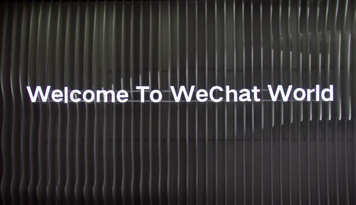

2020 年 1 月 9 日， 21 世纪 20 年代的第一场微信公开课 Pro 版正式拉开帷幕。去年的公开课，腾讯高级执行副总裁、微信事业群总裁张小龙讲了 4 个小时，从初心到产品，给微信过去 8 年作了一个总结。

今年的微信公开课，张小龙并没有来到现场，而是通过视频发表了一段演讲，阐述了对于信息互联的 7 个思考。张小龙表示，信息的宽广度和质量，一直是微信要解决的问题。

除了张小龙的演讲，在上午结束的微信公开课主论坛上，还有不少值得关注的干货。知晓程序第一时间总结了今年微信公开课主论坛的几个重点，包括了微信小程序、企业微信、小游戏、微信支付和 AI 等内容。

## 小程序：更多信心，商业场景

去年微信公开课说的是「你只要做好小程序，剩下的一切交给我们。」今天开场的小程序分享中，公开课讲师就回顾了一下这句话，有点害羞地说「其实我没有骗人啦。」

为了证明自己没有骗人，最简单直接的就是上数据。

过去一年，评测优秀小程序与评分均值都在增长，整体活跃小程序稳步增长，其中增速最猛的就是工具类小程序，增长 65%，其次则是商家自营类目小程序，增长了 51%。

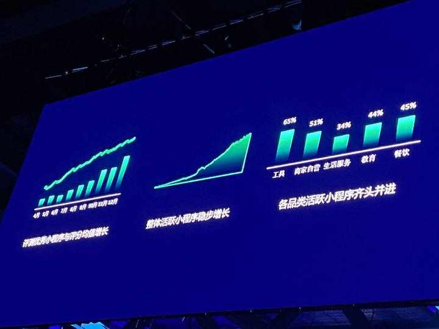

小程序日活则突破了 3 亿，相较 2018 年，2019 年的用户人均使用小程序的个数翻番，增长 98%，而活跃小程序的平均留存相较 2018 年也新增了 14%。

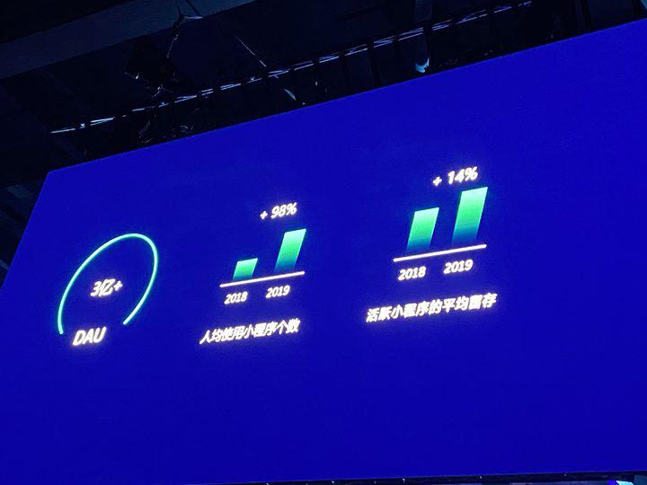

当然，最让人瞩目的数据是 2019 年小程序全年交易额为 8000 亿，相较去年增长了 160%。

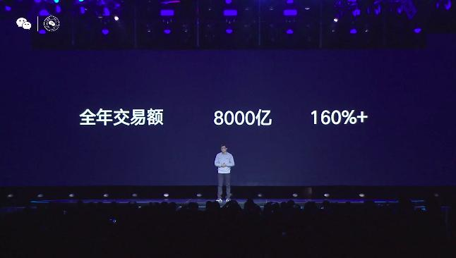

商业交易成为了小程序的重点。微信官方对小程序过去一年的回顾也是「小程序生态延续稳健上升的势头，尤其在商业交易场景上有更多潜力。」

而在如何解决自然新增，如何拉动用户回流方面，微信则再一次向现场的用户介绍了自己的基础工具。

通过搜索，让有需求的用户找到自己的小程序，让搜索成为用户「最自然」的入口。这是第一次，微信明确对外界说「我们觉得小程序搜索是最好的解决方案。」

而在搜索外，微信希望小程序内容可以基于用户兴趣偏好进行推荐。社交关系分享、地理位置的发现也能成为小程序的新增的重要入口。用好社交分享和附近的小程序，这就是微信给出小程序开发者的自然新增方案。

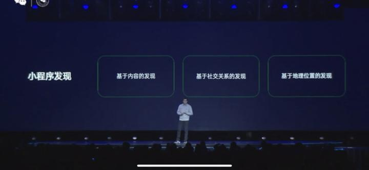

在拉回小程序用户方面，微信则着重说了消息触达。我们曾报道过的一次性消息和长期订阅消息应该成为拉回用户的有效手段。

现场最兴奋的开发者是谁？我们猜该是品牌商和电商小程序的从业者。

因为微信明确表示，除了本身的广告变现手段外，微信将重点建设商业交易场景，助力商家打造属于自己的商业闭环。一物一码、物流助手这些去年一个个更新的新功能未来将会帮助小程序商家打出「组合拳」，让拉新更易，让服务更好。

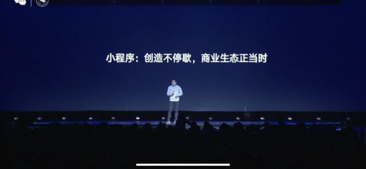

提升用户在小程序上购物的信任感也成了重中之重。

让用户想买，让用户敢买，微信的解决方案也不少。官方的品牌小程序商品可以得到搜索的加权，同时微信将对部分流程进行统一管理。而在普遍被吐槽的售后环节，微信也将加入纠纷处理流程，让更多的用户在小程序上买买买更安心。

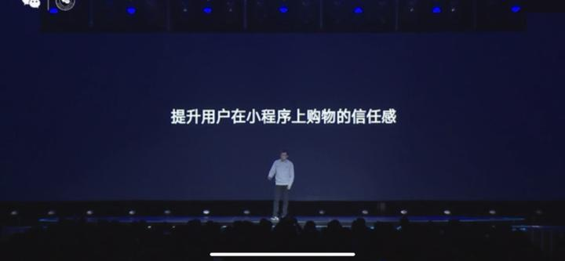

同时，外界对微信小程序团队的吐槽，他们也没装聋作哑。演讲者自己就讲了几个开发者吐槽点「微信审核慢」「微信封禁狠」对自己进行了「公开处刑」。讲师表示，新的一年，微信会「让运营更加有服务意识」，更好的服务开发者。

总的来说，微信不吝于向外界释放更多关于小程序的信心，给开发者更多的安心。而新的一年，我们也可以期待微信在小程序商业场景建设上的新动作。

## 企业微信 3.0：让每个企业都有自己的微信

企业微信的分享则更多集中于企业微信的 3.0，就是那个能发客户朋友朋友圈的 3.0。

许多行业从增量走向存量，获客成本不断攀升，企业已经意识到，服务好已有的顾客带来的价值，已经远远高于获得新客户。

用户是企业最宝贵的资产。现场分享者认为，对企业最大的惩罚就是用户的离开。为了更好的服务用户，更好的链接微信 11 亿用户，企业微信在客户联系、客户群、客户朋友圈上都提供了高效的服务渠道。

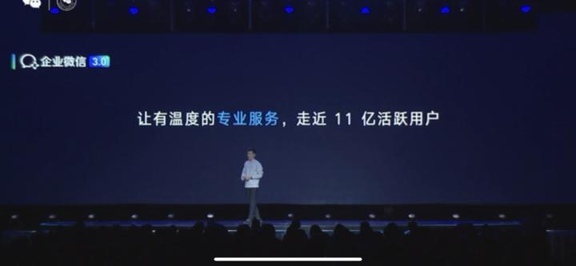

扩大到 100 人的客户群，能让更多有共同爱好、共同特征的用户能够在群里高效沟通。这个群不是普通的微信群聊，它属于企业，也是珍贵的企业资产之一，它可以让企业的服务不中断，资产不流失。

而 3.0 中更受欢迎的客服朋友圈则是为了做长线的生意。企业所提供的信息不一定是广告，只要它足够专业，足够优质，它能成为最有效的沟通渠道，它能帮助企业成为客户的「专业朋友」。

企业微信 3.0 的愿景是「让每个企业都有自己的微信」。在这个「微信」中，企业可以自行进行配置，企业认证身份让客户更信任，通过小程序、企业支付规范服务，客户也能看到更专业的导购形象。

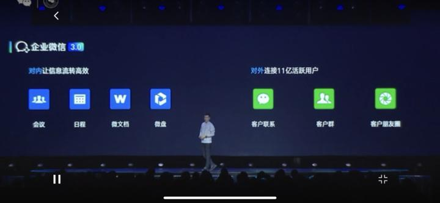

而致力于服务好 250 万家真实企业的企业微信也给了企业更多的「自主权」。390 个接口能让企业自己完成「精装修」。

企业微信提供的是毛坯房，合作伙伴根据用户需求进行精装修

连接 11 亿微信用户，支持小程序，支持企业支付，这就是企业微信 3.0 交出的成绩单。

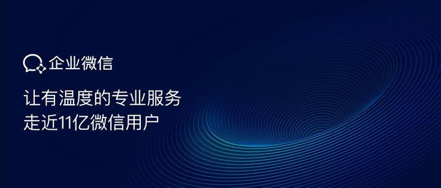

## 小游戏：内容力，大作为

### 新的一年，新的小游戏。

过去一年的小游戏没有那么「突出」，不像是「跳一跳」那样的一枝独秀，也不像是刚向第三方开放小游戏后的「群聊轰炸杀手」。但你并不能说小游戏遇冷了，只能说它变得更常态了。这个现象其实更能证明的是小游戏数量足够多，小游戏的分享规则更严格了。

小游戏数量、品类变得更多的一个证明是微信连说数据都要分品类来说了。休闲益智类小游戏拥有了 4 亿的累积用户，10 亿+ 的累积流水；经营角色类游戏则由 1 亿的累积用户和 8 亿的累计流水；消除合成类游戏也有 1 亿的累计用户和 2 亿的累计流水。

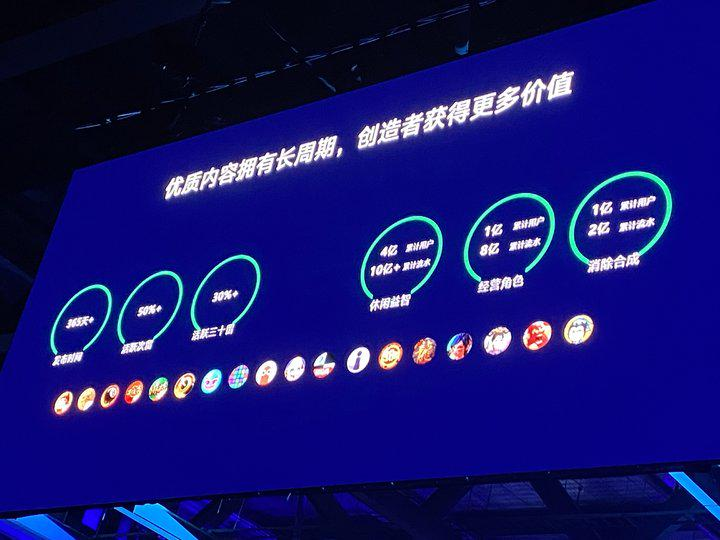

在 2019 年，小游戏的商业变现同比增长了 35%。而演讲者现场所说的「我们认为在未来两年时间里，微信小游戏应该还会保持 38% 的增长。」则能给小游戏开发者更多的信心。

小游戏的商业变现做得好，和它庞大的基本盘息息相关。相对于 app 游戏，微信小游戏最大的特点就是受众广。用公开课讲师的话说：「小游戏和 app 游戏存在一个互补的关系。」

小游戏将很多不玩游戏的用户拉入了游戏世界，女性、中年群体、三四五线的用户都尤为喜爱小游戏，在这之前，他们可能从未接触过小游戏。

有别于传统 app 游戏，小游戏用户性别占比为 5：5，和 2018 年的数据基本保持了一致。而在 2019 年，微信小游戏也走进了更大的年龄层，走进更下沉的区域。30 岁及以上玩家占比从 2018 年的 59% 提升至 66%，三四五线用户的占比也从 2018 年的 55% 提升至 57%。

用户玩的小游戏也更多了，相较 2018 年，2019 年玩家使用的小游戏人均款数提升了 45%。

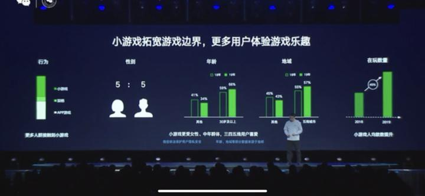

### 小游戏变多了，新的开发者还有机会吗？

微信说有。过去一年，微信出众的模拟经营类游戏有「动物餐厅」，飞行射击游戏有「消灭病毒」，合成和枪战类游戏有「全民枪神」，益智和休闲类游戏则有「成语小秀才」。这些融入了经典玩法的游戏都已经在小游戏平台上取得了较大的成功。

但在富余的益智、休闲、合成游戏之外，策略、竞速、MOBA 游戏也有更多的新机会，他们是小游戏里的「蓝海」。

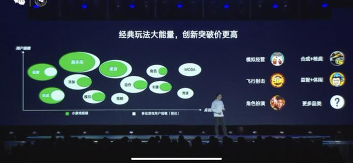

演讲者在现场也希望大家：「抓住这个历史的契机，在小游戏这个平台上，打造出自己的爆款。」

2019 年，小游戏增加了好友赠送、录屏回放等新功能，绘制工具和助手服务的升级也在努力减轻开发者的工作。在 2020 年，多人对战游戏和场景的长期订阅都成为值得开发者和用户期待的新功能。

更值得开发者关注的还是 PC 支持小游戏。之前，Windows 微信客户端内测版就支持打开小程序，而在未来，PC 端也能打开微信的小游戏了，这必将带来新的使用场景和新的商业价值。

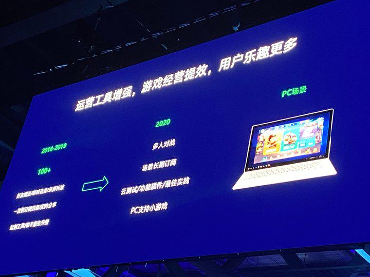

### 微信支付分：信任让生活更加简单

这次的微信公开课，微信支付的关键词是「信任」。

微信支付增值业务运营总监 Grace 重点介绍了微信支付分和微信先享卡两项业务。微信支付希望通过这些产品成为「用户的第二张身份证」，让信任进入生活，为用户 、合作伙伴、社会创造更多价值。

微信支付分很多人都不陌生，这是微信根据用户的身份特质、支付行为、守约历史等情况综合计算的分值，实际上今天正是微信支付分公开亮相一周年。

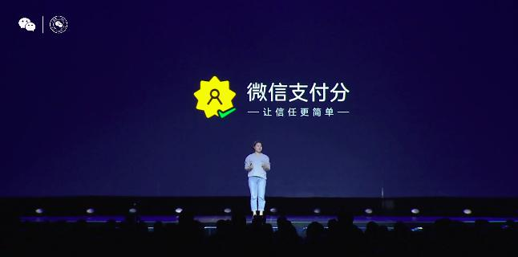

在日常的消费和交易场景中，押金和预付款通常常会导致用户体验不流畅，并存在一定风险，背后其实就是用户和商家之间的信任问题。微信希望通过微信支付分来帮助用户减少押金预付，让商家降低坏账。

目前微信支付分已覆盖物流、充电宝、免押金等十多个场景。以共享充电宝行业为例，通过微信支付分免押支付，用户不到 10 秒就能拿走充电宝，体验更加便捷高效。而共享充电宝品牌在接入微信支付分后，用户量也取得了 20% 的环比增长。

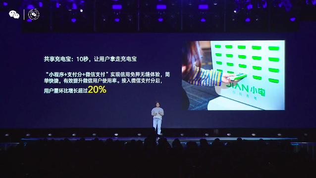

根据微信公布的数据，微信支付分用户数已经突破 1 亿，累计为用户节省了近千亿的押金，让超过 80% 的押金用户不用再缴纳押金。微信支付分的用户群体也相对年轻，主要在 20- 35 岁之间，每个用户平均每个月使用 3.8 次支付分服务。

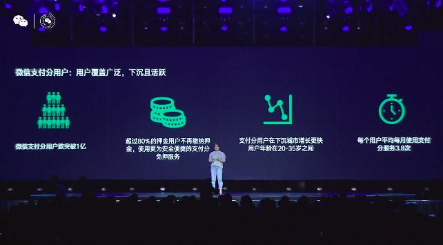

除了微信支付分，另一项解决用户与商家之间信任问题的产品是微信先享卡。微信希望通过这款产品来降低摇摆用户决策门槛，同时帮助商家锁定用户。

这到底是一款什么产品？公开课讲师举了一个例子。过去用户到美甲店消费，往往需要提前充值会员才能享受优惠。

而通过微信先享，卡能让用户，用户只要和商户约定在一定期限内消费一定次数，无需提前充值就能享受优惠。如果用户没有完成约定，商户可以选择延长约定期限，也可以收回之前的优惠，避免造成无效的营销投入。

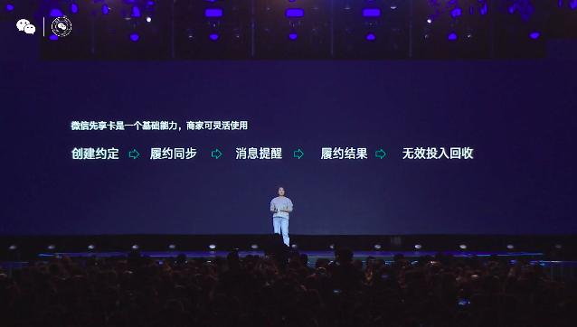

对于商家来说，接入这项能力的门槛并不高，商家可通过微信提供的 5 个基础能力来推出自己的微信先享卡服务，对支付方式和消费行为都没有限制，商家可灵活使用。

更为重要的是，这些使用微信先享卡服务的用户，都能够沉淀在商家的平台上，形成私域流量，提高用户粘性，为商户降低营销成本。

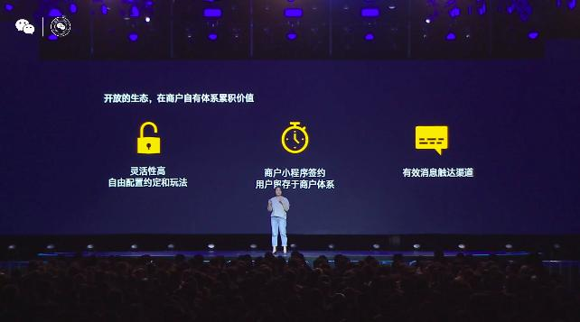

用户也不必担心无法在限定期内完成约定，微信除了通过提供有效的消息触达能力，让商家及时提醒用户。用户还可以通过邀请家人、朋友和同事组队共同来完成与商家的约定。

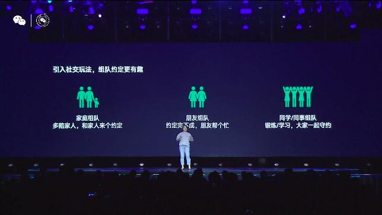

在当今的社会，信任机制几乎已经覆盖了所有的消费和服务。一套成熟的信任机制能让用户体验更加便捷，让商户降低交易和管理成本，促进社会消费经济的繁荣，正如公开课讲师所说的：

用信任的力量让生活更加简单。

## 微信 AI：更懂你的微信来了

人工智能（AI）一年里无疑是这两年最热的风口之一，其实在微信里就有不少基于 AI 的功能，当中不少可能我们每天都在使用，比如语音输入转文字和微信翻译。

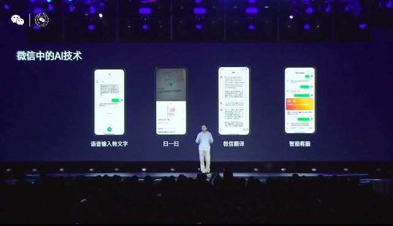

这次的微信公开课上，微信也带来了 AI 方面的一些新的能力和产品。

首先是新版的腾讯小微，这是微信 AI 团队打造的智能对话解决方案，接入腾讯小微的硬件设备可通过智能语音对话使用音乐、新闻和视频通话等技能。

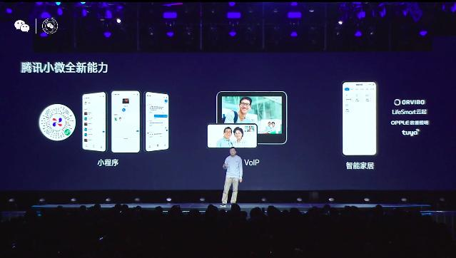

腾讯小微 2.0 在原有的基础上进化，用户可以通过小程序来与小微对话，并通过 VoIP 技术在不同终端进行人机交互，同时可连接智能家居，让小微成为家里的 AI 管家。

微信还在现场展示了腾讯小微全双工语音交互的视频，操作者快速向小微发出了询问天气、播放相声、播报股价和播放歌曲等多个语音指令，小微的响应几乎没有延迟。

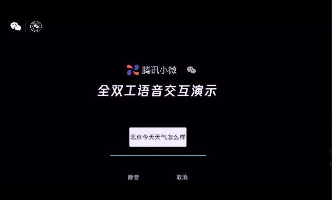

更令人惊喜的是，通过「全双工与流式语义处理」，用户无需专门用「嘿，小微」这样的语句来唤醒小微，缩减了交互环节，让交互更加流畅。

目前微信通过腾讯小微已经逐步构建起一个丰富的内容和产品生态，除了 QQ 音乐、腾讯视频、腾讯新闻等 App ，还有数百款硬件设备已经接入了腾讯小微。

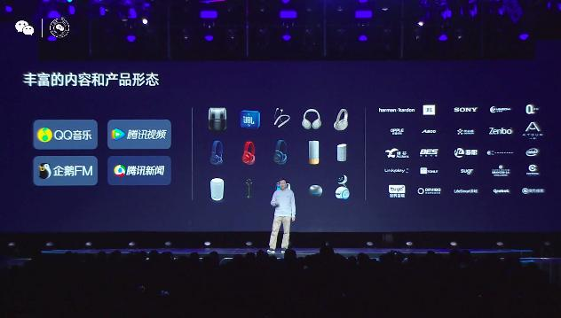

微信还发布了一款的硬件新品——微信相框 X，配置了一块 10 英寸的屏幕，集成了腾讯小微的能力 ，起售价为 799 元。

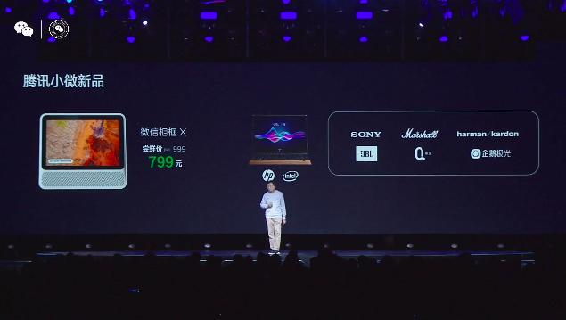

除了腾讯小微这样面对 C 端用户的产品，微信还推出了针对 B 端用户的微信对话开放平台，这是以智能对话为核心的开放技能配置平台。

企业主和个通过这个平台以零门槛搭建智能对话系统，这套系统可通过公众号、小程序、企业微信、App 和 Web 多种方式接入，并支持多种语言和风格，还可以自主进行多轮对话能力 ，准确率达到 88%，为业界最高水平。

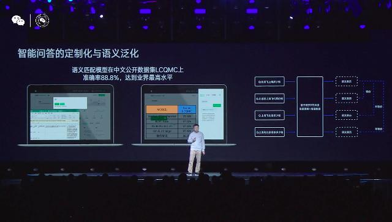

以航空业为例，这是一个与用户交流十分紧密的服务行业。微信对话开放平台，航空公司无需掌握 AI 相关的能力，只需要梳理自身的业务逻辑，就能通过微信 AI 平台表达出来，为用户提供提供 AI 客服服务 。

来自微信 AI 团队的讲师表示，如今对于 AI 的需求无处不在，而背后都需要大量的研发成本。微信智言团队在现场展示了微信在生成式对话、提升翻译质量、多维度推理等方面的 AI 研究成果，未来这些能力很可能将应用到在微信更多的功能中。

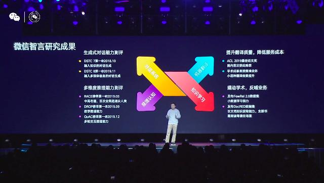

一个越来越「聪明」的微信将会出现在 11 亿用户的手机里。

虽然张小龙没有亲临现场，但今年的微信公开课还是熟悉的配方。在早上的主论坛上，「创造价值」是被频繁提到的一个词。很多人可能还有印象，在去年那场长达 4 小时的演讲中，张小龙就提到，微信的原动力就是让创造价值的人体现价值。

小程序希望帮助商家打造属于自己的商业闭环，企业微信要帮助企业拉近与 11 亿用户的距离，微信支付要打通用户和商家的信任壁垒……可以看到，微信希望以连接者的角色为用户和企业创造更大的价值。

这样的价值观让微信成为了今天的微信，无论版本如何更迭都很难改变。
