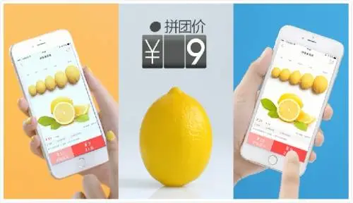
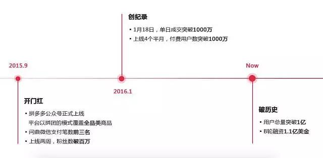
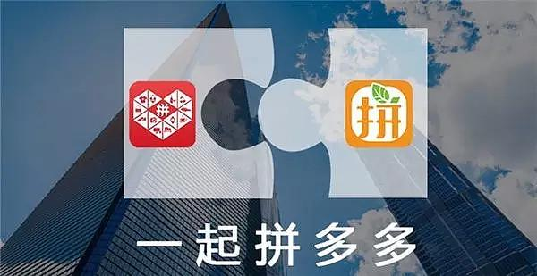

# 2016年黄峥小饭桌专访：创业历程，合并背后，打假挑战

黄峥很忙，接受小饭桌专访，他都是拉着行李箱来的。

过去几个月，这位 拼多多 董事长经历一系列探索后，最终将他一手创立的拼好货，与兄弟公司拼多多进行了合并。

这两家社交电商公司均脱胎于黄峥自己的团队，一个朝着自营方向大步迈进，一个朝着平台化方向一路狂奔。一个向左，一个向右，却最终走到了一起，造就了一家单月GMV超过20亿、付费用户超过1亿的社交电商平台。

但黄峥并没有为此多么高兴。商铺售假、经销商投诉、内部反腐……，拼多多遇到一个接一个的挑战。“**这次创业让我看到了更多人性的阴暗面**，**有时我就想**，**到底该不该创业**？”黄峥告诉小饭桌。但几乎是马上，他的另一种情绪又涌上来，“**还是要继续做**，**拼多多有机会做成一个全球化的公司**。”黄峥说。

> **一个机会**

拼好货和拼多多之间的故事要从黄峥之前的三次创业说起。

**2007年**，**在谷歌干满三年后**，**实现财务自由的黄峥决定出来创业**。他的第一个创业项目是卖手机，成立了一家电商公司。经过三年发展，**年营业额达到几亿元**，**但黄峥觉得以后容易陷入到和京东无意义的消耗战里**。**于是**，**他将这家公司出售**，**只留下了技术团队**。

**2010年**，**为了求生存**，**黄峥带领着这支技术团队筹办了第二个创业项目——电商代运营公司乐其**。很快，乐其便实现了盈利，**但他和团队都不太甘心一直做销售**，**“毕竟是个求人的活”**。

**2013年**，**乐其的一部分核心员工开始运营游戏**，上海寻梦信息技术有限公司正式成立——这是黄峥的第三个创业项目。

但就在寻梦不断发展壮大时，黄峥突然得了中耳炎，在家休息了几乎一年。

**“完全空下来后**，**就在想以后是继续创业**，**还是做投资？”黄峥觉得**，**做投资似乎还有点早**，**而他内心还有一些野心**，**“其实就是希望做的事有更大影响面**。**”**

起初，黄峥考虑过开家医院，毕竟治疗中耳炎的过程“太痛苦”。他把有名的耳鼻喉科大夫几乎都看了个遍，但越深入研究，他越觉得“好医院远不如吃得好靠谱”。

另一方面，以微信为代表的社交流量正发展迅猛。商业角度上，黄峥注意到微博、陌陌、快手等社交平台流量很大，但对应的商业没有起来，“存在的微商，很容易就变成了网络传销”。

**从这两方面考虑**，**黄峥决定再次创业**，**他瞄准的是社交电商领域**。2015年4月，拼好货正式上线。拼好货以拼单玩法为切入点，通过微信朋友圈等社交平台邀请好友参团，达到规定人数时拼单就会生效。

**拼好货从水果切入**，**起步却并非一帆风顺**。由于模式新颖，最初拼好货单量涨的非常快，瞬间就遇到发货瓶颈。黄峥向小饭桌回忆，**拼好货度过了一两次发不出货**、**爆仓**、**水果狂烂**、**退不了货退不了款的危险时刻**。

▽

为了解决仓储问题，他立马从乐其抽调了100多人，把乐其分布在全国的仓储体系独立出来，并拼命建仓，支撑拼好货发展。

**“仓库解决了**，**快递又堵住了**，**因为你一下要发掉30万单在同一个点**，**像嘉兴这样的地方**，**所有的快递公司加在一起都发不掉**。**”黄峥告诉小饭桌**，**还有耗材问题**，**一下子没有那么多耗材**，**耗材都涨价**。

好在有乐其的班底在，而且有个成熟的仓配运营团队，拼命干了几个月，拼好货的体系算是转起来了。拼好货的仓储体系跟京东很不一样，属于快速流通，货卸下来稍微做一下分解马上进流水线，分装好就出去。

“平均一个果子在我们仓库里停留的时间可能就几个小时，最多半天时间，就是个分装车间，整个的供应链链条很紧。”**黄峥认为**，**拼好货本质上是一个生鲜类的自营平台**，**吃的东西自营便于管控商品质量**。

短短几个月后，拼好货累计活跃用户突破千万，日订单量超过百万。**2015年底**，**拼好货完成了千万美金级B轮融资**，**主要投资方为高榕资本与IDG**。

> **两条路线**

话说无论拼好货，还是游戏公司班底都脱胎于黄峥最初拉起的一支技术团队，黄峥是拼好货CEO,也是游戏公司的董事。在上海，两家公司离得很近。

**2015年下半年**，**当拼好货在跌跌撞撞中快速发展的时候**，**游戏公司CEO坐不住了**。

黄峥至今记得那一幕。游戏公司CEO找到他，告诉他这种拼单模式可以做成平台，游戏公司要自己干。**有了拼好货**，**还需要再另做一家类似公司？黄峥没有着急否定这种想法**。**最初他也想过做平台**，**但认为风险太大**。

“**也行**。**”黄峥比较纠结**，**却不希望独裁**。他只提醒游戏公司CEO,这个事情难度比较大,做平台可能要烧钱，而且面临的竞争会更激烈,“如果搞挂掉了，你回去再做CEO吗？”

看到对方决心比较大，黄峥没有再质疑。于是，**游戏公司将最核心的员工抽调20多人出来**，**将游戏公司之前赚的钱投到新项目拼多多上**。

> **一场冒险开始了**。

拼多多采取的同样是拼单玩法，但本质上是商家入驻的全品类电商平台，两家公司属于同一方向下的不同形态。一个是自营产品，自建供应链，强调品质和体验；一个是供应商入驻、物流第三方合作的平台模式。

黄峥发现，由于拼多多团队既做过电商，又做过游戏，相比拼好货的纯电商团队，他们对前端的理解，对消费者深层次需求的理解，包括怎么样做好软件产品等确实要强。

**拼多多更重视软件产品的互动**，**把产品当成游戏运营**，**强调用户以什么方式第一次接触**，**互动**，**怎么做用户筛选**，**“游戏跟电商公司有一个思路是有差别的**，**它不认为进来的所有用户都是他的**，**始终在试图寻找适合这个玩法的用户**，**他在寻求的是玩法的迭代和更新**。”

本质上讲，黄峥发现，**拼多多要创造一个不一样的购物形态**，**而不是说强调某一垂直领域的购物体验**，**这是两种不一样的东西**。

拼好货的团队由于是电商运营出身，没做过游戏，就很自然而然会往供应链角度去考虑，怎么样去优化供应链，怎么样把水果的流通做得更快，物流环节能够压缩的更好，**选品怎么样能够做得更好**。

这两个公司看起来形态像，但思路的差异其实很大，“这是两条不同的道路，拼好货的道路，继续加深做仓储配送，就变成了生鲜类的京东。而游戏公司的人觉得，这个不是一条路，路线是不一样的，逻辑不一样。”黄峥说。▽

拼多多发展路径

自从2015年9月，上海寻梦团队成立拼多多，其发展速度比拼好货还要快。

成立仅一年时间，拼多多便做到了10亿的月GMV。**2016年7月**，**拼多多完成了1.1亿美元的B轮融资**，**投资方包括高榕资本**、**新天域资本**、**腾讯等**。

不过，也正是由于发展速度快，黄峥承认**拼多多在快速发展中**，**遇到了很多问题**，**特别是在早期**，具体表现为水果腐烂严重，产品质量不过关，发货速度慢等问题。

**黄峥曾多次要求拼多多方面务必改善品质和体验**。**他认为**，**经过一段时间摸索**，**拼多多在品质体验方面已经有了很大改善**，**但问题依然不少**，**还有不小的提升空间**。

尤其是发展速度与优质体验的兼顾需要更长时间的磨合，**“不能既让马儿跑**，**又让马儿不吃草**。”拼多多负责人也对黄峥说。

在这一点上，黄峥理解对方的考虑。**但从长期发展的角度**，**他还是继续要求拼多多加强审核**，**改善产品品质和体验**。

**“流血打假”**

前期的粗放发展，快速放大了拼多多规模，也带来了一定的负面影响。

黄峥说，这表现为2016下半年有个别商户散布消息说，拼多多有冻结货款，甚至怂恿刷单行为。**“这并不是事实的真相**。**这些商家都是售假商家**，**我们打假是不遗余力的**。**”黄峥告诉小饭桌**。

他表示，跟任何电商平台发展过程一样，拼多多作为一个新入局者，发展速度很快，在这个过程中难免有一些售假商户夹杂其中。如果不严厉打击，会严重损害到诚信商家和消费者的利益。

拼多多方面认为，卖假货的人不是单个单个卖，而是一批一批卖。因此，拼多多选取了跟京东一样的规定，如果这一批货中投诉有多少个，并且被验证是假货，就要求商户假一赔十，赔给所有的消费者，这一批货都要赔。

黄峥告诉小饭桌，**自从2016年4月**，**拼多多开始有计划加大力度打假**，**先后在4万多个供应商中发现了几十家卖假货的供应商**，**并相应冻结了其货款**，**而这造成矛盾被激发**。

黄峥回忆，最开始这些被查的商户抱着孩子或者让孕妇来公司闹；发展到后来，他们开始找媒体；再后来，“不光找媒体，还有向工商举报贼喊捉贼的”。

黄峥表示，有些商户甚至找来黑帮恐吓他们，“堵住公司的门，不让我们员工进，在办公区域打人、恐吓，**半夜12点在楼下等我们的女员工**，**甚至还跟踪我**，**这些都是真实发生的事情**。”

除了打假，还有腐败问题。黄峥承认，公司确实有部分员工收了商户的钱，但很快遭到了举报。今年6月份，他们开始查反腐，当时“做好了销量跌一半的准备”。

**最后的结果是**，**一位严重违法的员工被送进了监狱**，**整个海淘组**、**美妆组全部换血**，**这意味着他们的运营团队一下子缩减了1/3的人**。

总体来说，拼多多在快速发展过程中，的确在产品品质、物流、客服等方面出现了一些问题，而团队在规模迅速扩大的同时，也在不断摸索和总结规范的管理经验。

> **走向合并**

9月中旬，拼多多忙着打假的同时，突然传出消息，拼多多和拼好货合并了。

黄峥告诉小饭桌，这次合并从酝酿到完成时间不长，主要还是两家公司创始人的决策，也获得了两家公司投资方的支持。

“最主要的因素是两个公司的规模都很大，我没有足够的精力做两家公司。”黄峥解释说，“**我们无非一伙人**，**还是追求做成一件牛逼的事**，**那我们就坐下来商量**，**哪一件事情能够更牛逼**。”

“打假这个事情已经搞得大家不做业务了，所以我们需要集结团队更大的力量来做一件事。”黄峥说。

**在他看来**，**拼多多和拼好货一个缺商品**，**一个缺品质**。**合在一起更有利于双方**，**也能进一步集中力量**，**合并的目的是提升整体品质和服务水平**。

两家公司披露的合并方案是，以1：1换股的形式完成，不涉及现金交易。管理上，拼好货CEO黄峥直接担任新公司的董事长和CEO。

不过，对于合并的细节和更复杂的动因，黄峥避而不谈。他表示，合并后拼好货商品类目将更加丰富；而对于拼多多，将获得快流通供应链体系的支撑，让水果生鲜品类的品质得到大幅提升。

由于两家公司都脱胎于同一个团队，且有多个共同投资方，合并不让人意外。不过，拼好货类似于京东模式，而拼多多则类似于阿里模式，双方合并后，不同的基因能否融合将成为一大挑战。

黄峥认为，**拼好货和拼多多本质并不冲突**，**两个平台一个重供应链**，**一个重前端**，**反而有比较强的互补性**。“这个问题上我的作用就会比较大，不谦虚地讲，因为之前的历史和我的存在，这两家公司才能合在一起。”

据黄峥介绍，合并后，他们在产品形态上做了明确定位，拼好货变成了拼多多的一个子频道，他们要走的是平台模式,未来主打拼多多品牌。其次，他们对人员进行了调整，所有的运营和产品全部并在了一起。

此外，黄峥透露，合并后，拼好货将拆分后端仓配业务，成为独立公司，并进行独立融资。

> **不断迭代**

对于社交电商，黄峥一直有着美好憧憬。

**在他看来**，**社交电商能让购物变得“有温度”：“购物不全都是目的型的**，**本身是娱乐和生活的一部分**。”

“**千万不要把社交电商当成社交**，**社交只占20%-30%**，**主体是电商**。”对于拼多多拼好货，黄峥有着清醒的认识，淘宝做的是搜索，是物以类聚电商，而他们做的是人以群分的电商。

当然挑战也不小。一位电商投资人告诉小饭桌，**拼单模式很解决长期留存和复购的问题**，**一旦商品或者服务不好**，**复购就会很低**。**“卖货是一个需求供给匹配的过程**，**而社交更多是浏览信息**，**因此在需求供给匹配中间的转化率上**，**社交因素能够起的作用很小**。**”**

这位投资人分析，社交对于电商的帮助在于**发现和推荐**，而一旦被推荐的货品热卖，那货品就变成了主流大通货，这时候大平台来卖优势会更明显，这就要求社交电商就不断发现和推荐新的货品，**“这个过程对于一个平台是边际效应递减的**。”

黄峥也承认，拼单的玩法肯定需要不断迭代，“要不要永久拼下去不是重点，而是要看平台给用户创造了什么价值，**我们在逐步打造一个人以群分的平台**，**这部分的优势等到量大了之后自然会显现出来**，**并会往上游去推进**”。

黄峥要面临的还有来自巨头的挑战。另一位投资人对小饭桌表示，**目前电商行业的购买客户群被高度垄断在大平台手里**，拼多多拼好货的最大挑战在于如何突破大电商平台的流量瓶颈。

但黄峥的野心并不止于对抗巨头。**“这个产品天生可以做国际化**。”**黄峥说**，**拼多多有机会做成一个全球化的公司**，**接下来他会专注做减法**，**而这也是步步高董事长段永平对他的建议**。

在美国读书时，他因机缘巧合和段永平成了忘年之交。在黄峥感觉最为无力的那段时期，**段永平告诉他**，**要学会把复杂的事情做简单**。**“他一直在讲这个**，**作为一个好公司**，**动作越少越好**。”如果要给自己打分，黄峥说自己之前的表现只能算刚合格。

在黄峥看来，新的流量分布形式，新的用户交互形式，和新的国际化形式下，“一步一步走过去，不见得没有机会”

