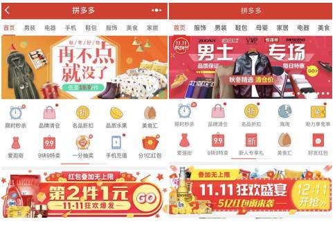

黄峥2017年谈小程序：所有的电商都应该做小程序

以下为黄峥口述，腾讯创业整理：

01

**小程序的价值观：解决用户需求，而不是追求一夜暴富的流量**

我认为，不应该单纯带着改革红利的思路去看待小程序，而要思考如何利用好这个工具去创造真正的用户价值。

虽然，小程序现阶段的发展并不完善，但其展现出来功能非常契合“以用户价值为导向”的理念。

对于用户而言，**下载APP成本较高，且打开频率低。**&#x800C;小程序“用完即走”的思路对消费者本身来讲是有益的，**对消费者有益的东西理论上会越多越大，其涵盖的场景也越来越多。**

对于我们来说，作为商业内容的提供方，拼多多小程序的开发者，自然要抓住改变中的机遇、拥抱变化，但我认为，希望通过微信改革的机会，利用改革红利，谋求在短期内获得巨大的流量甚至一夜暴富，这种想法是不切实际的。

所以，不能单纯将小程序看作是流量增长的利刃，而要关注每一位用户在什么样的场景下能够最大化利用小程序，或者解决用户之前无法解决的问题，这才是小程序的价值所在。

02

**小程序与APP之间的关系：都是为用户服务，不存在颠覆**

很多人会思考，小程序出现后，APP是否还有存在的必要？或者说，小程序和APP之间是不是相互导流的关系。

如果站在用户服务的基础上，小程序和APP适用的场景不同，但都是为用户服务，不存在谁取代谁。

而许多把APP看做主要产品的商家，利用小程序向APP导流，大部分的逻辑在于“APP是自己的，小程序是微信的”。

我们认为，将何种工具形态视为重点，需要从消费者角度出发。但大部分的商家都没有这种心态。比如，大部分APP登录界面都需要用户输入手机号，只是为了收集用户的手机好，对用户来说并没有价值。

通过这种现象，又说明了两个问题：

> **其一，商家是否真正站在消费者角度思考，到底是APP还是小程序对用户价值更大；**
>
> **其二，商家对于腾讯是否有基本的信心。**

商家想要通过APP收集手机号，是担心命运完全被微信掌控，如果其对腾讯的价值观有基本的信任，就没有必要关注这件事情。而应该更多地思考怎样做才能对消费者有利。

目前，小程序已经几乎具备APP所有功能，没有必要利用小程序为APP导流。如果消费者因为找不到小程序想下载APP，他们会自发前去苹果商店下载，这是消费者的主动需求，我们也不应该阻挡他们。

开发APP也好，利用小程序也罢，都要避免一个思维陷阱：以内容提供商或开发商的主观想法，去改变消费者的自然选择。

03

**APP用户增速降低，小程序后劲十足**

从拼多多相关数据来看，目前整个市场的APP增速的确在下降，而小程序由于其灵活满足用户使用场景的特性，其市场前景较大。因为，小程序具备两个明确的属性：

**—长尾应用。**&#x867D;然看似频率很低的动作，但是当体量足够时，依然会形成巨大的市场。比如，偶尔利用小程序搜索航班信息，其整个体验感比在百度上搜索或者单独下载APP好很多。而微信因为巨大的用户体量，此类搜索机票的小程序，依然能有巨大的机会。

**—线下场景。**&#x5FAE;信扫二维码，已经在线下非常普及，通过线下二维码作为流量入口，不论是用于信息查询还是通过线下入口激活线上购买行为，这样的场景都是天然的、高效的。

而随着线上和线下的边际逐渐消失，在线上流量枯竭的情况下，小程序在线下所展现的潜力将是无比巨大的。

左图为小程序，右图为APP

04

**电商切入小程序：与微信结合更好，呈现方式更流畅**

并非任何细分领域的生意都适合开发小程序。但电商与小程序结合的确存在一定的优势：

**目前，相比较于纯内容形式的普通文章而言，电商所具备的较长的供应链，决定了要表达清楚电商产品，就需要更复杂的内容展现形式。**&#x800C;小程序提供了更丰富的界面，不论是图形展现还是互动方式，都比原来的H5更流畅。

未来，电商也会从纯搜索式转化为契合不同场景中的形态，小程序正好为用户提供短时、高频的应用场景需求。我认为，小程序未来还会演变出各种各样的、契合不同场景的东西。

但小程序之于电商也存在一定的劣势：

**小程序“即用即走”的功能注定用户在小程序上的停留时间更短。**

小程序开发成本并不低于APP开发成本。其中，有一部分原因是小程序还比较新，熟悉小程序的语言的工程师并不多，而随着这个市场越来越大，熟悉小程序的工程师越来越多之后，其开发效率也会越来越高。

用户不易寻找入口。目前，小程序开发尚处于初期阶段，其入口隐藏较深，用户很难找到小程序。但随着使用频次越来越高，入口开放出来后，这个问题也会很快得到解决。

初期用户易流失。从理论上讲，与传统电商相比，在小程序上做电商需要配备不同的供应链。做电商最难的部分是供应链，小程序使用人群与其它渠道的人群不用，如何针对这部分人群打造差异化的供应链，让消费者获得更强的感知力，并提升转化率，是基于小程序建设的电商必须要做的事情。

05

**所有的电商都应该做小程序**

小程序是一个普适性工具，我认为，所有的电商都应该做小程序。

苹果手机的出现，颠覆了PC年代的Windows，而小程序有机会改变甚至颠覆现在的iOs。因为，微信本身存在大量用户，其中一部分用户花费他们的部分时间停留在小程序，这件事情本身就很重要。

作为电商，你做了iOs版本，就可能也有安卓版本，如果将小程序堪称冉冉升起的新的iOs，这种新的交互方式商家当然要做。

对于拼多多而言，小程序有别于“物以类聚”的搜索，其更多的是“人以群分”的电商。拼多多会在“人以群分”这件事上往前推进。每个群体在不同阶段都会有不同诉求，没有钱的时候想要赚钱，钱多了之后又有精神追求。

我们也会观察消费者当前处于什么样的阶段，是先满足他们的性价比需求，还是其生活乐趣，这是拼多多所要做的事情。

此外，拼多多要扎扎实实运用“人以群分”改变供应链。我们的核心在于，利用小程序提供商品内容，而这个内容包含商品背后整体的运营、打包、发货、物流、品控，以及后续的客服及售后。

