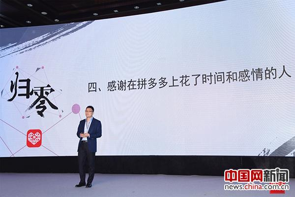

拼多多、拼好货董事长黄峥出席新经济100人2017年CEO峰会。

中国网4月15日讯 4月15日，以“归零：探索趋势 引领未来”为主题的新经济100人2017年CEO峰会在北京召开。20位行业领袖齐聚一堂，智慧碰撞，观点交锋，把脉新趋势，论道新经济。

在新经济100人创始人兼CEO李志刚发布“新经济100人趋势报告”后，拼多多、拼好货董事长黄峥登台分享了社交电商拼多多一年多以来“与巨人共舞”的感受和经验。

***结合优势进行定位 做电商界的新加坡***

2015年9月上线至今，拼多多始终处于飞奔之中。不知不觉间，今年3月的GMV就冲到了40亿。在格局初定的国内电商领域里，拼多多不仅站稳了脚跟，还跑赢了大盘，秘诀是什么？

黄峥表示，首先要明确自己拥有的优势是什么，“要结合优势，找一个独特定位，而这个独特的定位后来也成为了拼多多的优势之一。”

众所周知，互联网创业大军中上一个以独特定位杀出重围的是今日头条。做渠道，不生产内容，千人千面个性化推荐，让新闻找准粉丝——火了一个今日头条，也使内容分发成为行业的又一个风口。

据黄峥介绍，拼多多的创始团队，既有电商的强运营思维，又有游戏的基因。从项目创立起，团队就主动探寻社交和电商结合的可能性。而社交电商就这样被一群年轻人“一不小心玩出了大名堂”，成为《电子商务“十三五”发展规划》鼓励的新模式。

目前，拼多多月GMV突破40亿，估值达百亿人民币，不仅扛起了国内社交电商的领军大旗，也成了名副其实的新兴独角兽。黄峥却十分谦虚地表示，拼多多不以规模达到多大为追求目标，而是凭自己的优势，不断提升不可替代性。“能在电商界里立足的，一定是有特色的并占领消费者心智的。拼多多的规模还不大，但我们选择的是一条同行们没有走过的路。走通了，对消费者来说，是多了一种选择;而对其它电商来说，也会形成一种正面的溢出效应。”

如果以国家作比喻，黄峥希望拼多多“做一个小的新加坡”，在与巨人共舞中踩准节拍。

拼多多、拼好货董事长黄峥作题为“与巨人共舞”的演讲。

***永远关注价值创造 不断创新价值创造的方式***

如果一家电商就是一个国家，那么追求国民富裕或许可以理解为追求用户购物体验的不断优化。从决心做电商平台的那一刻起，拼多多人就面临着与巨头共舞的局面。他们深知，以淘宝的模式再造一个淘宝，对用户来说是没有价值。而实现社交和电商的融合，创造一种新的电商模式，让消费者体验另一种购物方式，才是拼多多团队奋斗的动力源泉。

拼多多无疑是成功的，它让购物这一行为不再孤单，单调。和亲朋好友一起拼团，让用户既获得了实惠，又体验到了“如线下逛街般”的温度和乐趣。这让拼多多在短短一年时间里便收获了超过一亿的用户。

喜报频传，拼多多人却始终保持着平常心，他们不停地问自己：是否在为用户创造价值，如何能为用户创造更多价值？

对于拼多多的未来，黄峥认为，要坚持以用户价值为导向，在玩法上实现迭代创新。“人们利用时间的方式，正从有明确目的、追求效率的搜索模式，逐渐转向没有目的的、非搜索的社交与娱乐模式。而购物也呈现着同样的趋势——消费者们原来是‘理性的，追求效率的’，他们需要上帝一般的人工智能为自己的消费提供正确而唯一的指引;而现在，人们更愿意由与自己情感相通、偏好一致的一群人给出推介。”

黄峥相信，社交电商未来更大的量会出现在这种平等的、多对多的社交网络上，而分布式神经网络领域研究的不断推进也将为拼多多践行新理念提供技术支撑，“感谢在拼多多上花了时间和感情的人，未来那个更贴心、更懂你的拼多多有你们每一个人的功劳。”
