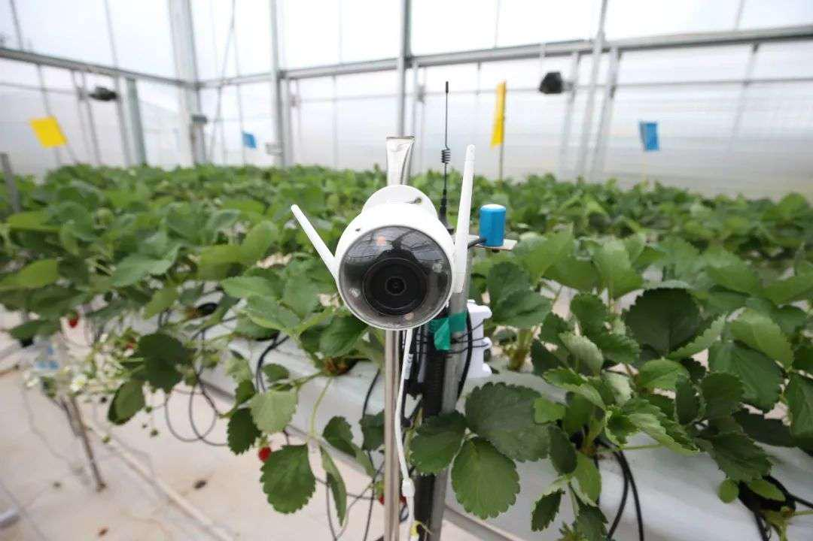
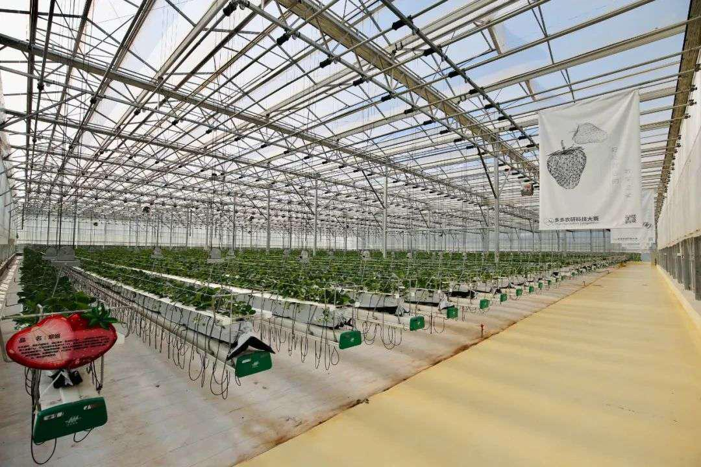

黄峥卸任了，想去制造蛋白质机器人

2021年03月20日&#x20;

进入2021年，黄峥坚信要去“完成普通的生活”。当然，事实上这并不普通。

传统观念下，大公司创始人往往大部分时间都肩扛着整个公司的运作发展，在以速度和效率为主导的现代商业竞争中更是如此。不过，其中仍有不少科技企业家试图逃离，去追寻属于未来主义的梦想。

比如，特斯拉创始人马斯克称得上是当代的“互联网科学家”。这位爱好香车、美女，行止“不羁放纵爱自由”的企业家，以探索发展各种前沿技术闻名。还有亚马逊创始人贝索斯，则宣布将于今年第三季度卸任亚马逊CEO职务，投身于Day one基金、贝索斯地球基金、蓝色起源计划等。

相比于国外企业家的“狂人style”，拼多多创始人黄峥更像是镜子的另一面。他低调、朴素，喜欢阅读思考，甚少面对公众和媒体，他更想成为一位严谨的科学研究者，或者仅仅是“科学家的助理”。3月17日，黄峥发布2021年度致股东信，宣布董事会已批准其辞去拼多多董事长职位。同时他承诺，个人名下的股票在未来三年内继续锁定，不出售。黄峥表示，辞任后将专注于食品科学和生命科学领域，为拼多多未来十年高速高质量纵深发展探索新空间。

他举例展望了自己将长期致力的科研领域——通过对农产品种植过程的方法的控制，探索对马铃薯、番薯、西红柿等潜在的有害重金属含量进行有效控制，同时对其可能有的、有益的微量元素进行可控的标准化提升等。

当日，黄峥及拼多多创始团队还发起了繁星公益基金——向浙江大学捐赠1亿美元设立繁星科学基金，首批项目将包括“超大规模实时图推理机研究”“重大脑认知障碍的闭环调控研究”“肿瘤免疫新抗原研究”和“细胞培养人造鱼肉研究”等前沿科技研究。

## **诸多“卸任”企业家投入科技研发**

聚焦当下，最受关注的领域莫过于关乎每个人生命安全的疫苗研发。2021年1月27日，比尔和梅琳达·盖茨发布了他们的2021年度公开信《这一年，全球健康与你我休戚与共》。

比尔·盖茨表示，“疫苗研发速度之快让我印象深刻。全球目前有许多候选疫苗，这些疫苗正处于不同阶段，已生产的数量和监管部门提供的数据各不相同，但情况比我预想的要好。”

对目前备受关注的新冠病毒变异的问题，比尔·盖茨表示，可能发生的情况是，面对变异病毒，有效性较高疫苗的有效性也许会降低一点，有效性偏低疫苗的有效性会降低很多。

自成立之初，比尔及梅琳达·盖茨基金会便相信每个人都应该有机会过上健康而富有成效的生活。迄今为止，盖茨基金会已经为抗击新冠疫情承诺投入17.5亿美元，用于支持合作伙伴进行疫苗、检测工具和药物的开发和公平分配等工作。

另外，屡次因为个人语言与行动吸引全球目光的特斯拉创始人马斯克，也积极投入到除了汽车与航天之外的技术创新领域。2021年2月，特斯拉和SpaceX首席执行官埃隆·马斯克宣布，他将捐赠1亿美元（约合6.4亿元人民币），用于奖励能够捕获二氧化碳的最佳技术。

为什么需要碳捕集？在过去的100年，全球二氧化碳排放量急剧上升，导致了前所未有的全球变暖和气候变化。根据国际能源署的数据，目前全球约有20个碳捕集、利用和封存（CCUS）项目在进行商业化运作。

同年2月，在亚马逊股价和个人财富都接近历史最高水平之际，贝索斯急流勇退，宣布将于今年第三季度卸任亚马逊CEO职务，投身于Day One基金、贝索斯地球基金、蓝色起源计划、《华盛顿邮报》和其他所热衷的事业之中。

此外，Google公司创始人之一拉里·佩奇也重磅投资了飞行汽车公司Kitty Hawk和BlackFly，Google X实验室多年致力于探索科技未知，以人类愿景为驱动力，开展基础科学和创新性技术研究。Google公司联合创始人之一谢尔盖·布林投资的货运飞艇公司则于2020年8月完成首单销售。

## **泥土与星空，基于农业的科技探索**

在关于“创新驱动发展”的重大论断下，更多的中国新一代互联网企业家投身于支持前沿科技发展、探索未来世界的“星辰梦想”中。

而拼多多则是国内创新发展企业阵列中，以农业起家、多范围发展突破的典型代表。扎根三农的新电商平台拼多多是目前国内大型的农产品上行平台，依托“农地云拼”等技术创新体系，直连农业生产者1200万人，累计带贫人数超百万。

2020年，拼多多实现2700亿人民币农副产品销售额，再次实现三位数的同比增幅。在今年2月的全国脱贫攻坚表彰大会上，拼多多作为互联网代表获颁“全国脱贫攻坚先进集体”。

从“最后一公里“到”最初一公里”，拼多多对农业的探索不断向源头追溯，与国内外多个顶级科研机构和院士专家等科研团队展开深度合作，在科学种植、农业物联网、无人温室、智慧农业等领域持续投入，希望帮助农民增收，助力农业升级。2020年10月，拼多多与赵春江院士团队建立战略合作，联合创立“智慧农业协同创新中心”，探索小农生产模式下，如何建立从数字化生产到品牌化销售的全产业链条。

农业是拼多多的安身之本，也是拼多多的星辰大海。随着国家全面启动乡村振兴战略，拼多多也将进一步加大在农业领域的持续投入。同时逐渐以农业为基础向外延展。自2018年至2020年，黄峥连续发表三封致股东信，清晰地阐述了他在拼多多不同发展阶段的思考重点。

其中，第一封信讲述了拼多多是一家做什么的公司，第二封信开始描述人类所处的“新时代”，第三封信黄峥用方程及定律来阐释他所理解的世界，同时文中夹杂了一些偏哲学式的、句型较为复杂的描述性表达，而且主题又变成了“时间”。

卸任董事长之前，2020年7月，40岁的黄峥以致全员信的方式宣布卸任消息。伴随此次调整，黄峥表示，将按照IPO时的承诺，连同创始团队一起，捐赠约2.37%的公司股份，正式成立“繁星公益基金”，旨在推动社会责任建设和科学研究。该慈善基金为不可撤销的慈善基金，由独立受托人管理，保证慈善基金的所有资产全部用于公益用途。

该慈善基金之名所以叫“繁星”，缘起于某一个夏夜，黄峥在步行的时候，仰头看到夜空里的漫天繁星，便忽然想起文森特•梵高的一句话——“我不知道世间有什么是确定不变的，但我只知道，只要一看到星星，我就会开始做梦。”

通过三封致股东信，可以明显看到黄峥观念的显著变化。卸任之后，黄峥表示将走更多的路，读更多的书，试图抽离出以效率和规模为主导的商业竞争，最大可能地关心粮食和蔬菜，将更多的精力用于对于长期主义的价值追求，回归到与生命最本真的思考，及如何在最根本的问题上采取行动、寻找答案。他对农业科技、蛋白质和生命科学充满了好奇。

此次，黄峥及拼多多创始团队向浙江大学捐赠1亿美金，设立繁星科学基金，首批项目恰好包括了计算与生物、医疗、农业、食品等交叉领域的基础研究及前沿探索，遥相呼应了黄峥在3月17日致股东信里对于未来的畅想——将专注于食品科学和生命科学领域的前沿研究。

## **想去制造蛋白质机器人的互联网企业家**

黄峥及创始团队的“繁星”公益基金项目的布局领域透露着在国际性科技竞争格局下，来自中国的社会力量正在发挥更大的力量。除了生命科学之外，农业科技、蛋白质等未来应用场景也是重要的科技扩展方向。

2021年3月17日，浙江大学教育基金会和繁星公益基金签署捐赠协议。以项目中的“面向超大规模实时图推理机研究”为例，具体来说，与普通数据相比，时序大数据最大的特点就是带有时间戳，基于时序大数据，不仅可以把历史数据都留下来，实时产生的数据也源源不断流入。

陈纯院士表示刚产生的“热数据”最具价值，分析处理越及时，越能最大化数据的价值，特别是在5G时代。但目前国内外较为成熟的流式大数据处理技术框架和分布式图计算框架都不足以解决多源异构超大规模动态时序图的实时计算和智能推理的需求。

超大规模实时图推理机研究对很多行业都至关重要，如金融风控中如何毫秒级判断这张卡是不是被盗刷了，城市交通系统如何实时决策红绿灯策略确保道路畅通等。

基于时序图数据，可以有效分析数据中实体间的关联关系并推理判断，然而，在实时应用领域对关联关系的推理判断需要具备实时性、准确性及灵活性。因此对大规模动态时序图实时处理技术的研究与应用推进具有极大的现实意义。

情感障碍疾病是困扰全世界的重大难题，也是繁星科学基金首批赞助的研究方向之一。以抑郁症为代表的重大情感和精神障碍已成为仅次于心脑血管疾病的人类第二大疾患，目前，全球各国都在积极探索将“脑机接口”用于脑部或脊髓损伤的患者康复治疗，希望帮助患者恢复损伤的听觉、视觉和肢体运动能力等。

如Facebook于 2019年8月推出一款无创型脑机接口可穿戴设备，能够解码佩戴设备的人听到和说出的词语及对话，帮助有语言障碍的残疾人恢复沟通能力。2020年12月，浙大科研团队成功利用自主研制的植入式脑机接口技术，帮助一位七旬老人用意念指挥机械手臂喝上了可乐。

同样的，作为成功的互联网企业家，黄峥还在最新的致股东信里，也提出了类似的科学狂想——

“比方说，通过对农产品种植过程的方法的控制，我们是否有可能对马铃薯、番薯、西红柿等的潜在有害重金属含量进行可靠有效的控制，同时对其可能有的、有益的微量元素进行可控的、可标准化的提升？如果以后有一种西红柿，每一颗都含有最适合我们身体的VC等微量元素，那我们的生活质量是否就会有明显的提高？”

“再比如，如果我们能够比较透彻的了解不同的植物蛋白和动物蛋白在摄入人体后的变化和作用，进而通过植物蛋白来合成生产出肉的替代品，那这种新的素鸡2.0是否有可能成为更健康、更绿色的稳定供给？”

他又发出疑问，“如果我们再进一步，深入到蛋白质结构及在人体内的性状的研究，我们是否有可能沿着2016年诺贝尔化学奖获得者的分子机器的道路，进一步研究出蛋白质机器人，可以进入到人的脑部血管进行疏通，避免中风？”

最后又有些回到了少年时代的初心 “如果我努力，把中学里最喜欢的化学、大学里学的计算机、工作中学习的经营管理结合起来，我天真的想，说不定也能再做出点有意思的事儿。成不了科学家，但也许有机会成为未来（伟大）的科学家的助理，那也是一件很幸福的事儿。”

这似乎早有端倪，黄峥曾引用毕业于西南联大的诗人穆旦《冥想》中的这句话——“我冷眼向过去稍稍回顾，只见它曲折灌溉的悲喜，都消失在一片亘古的荒漠。这才知道我的全部努力，不过完成了普通的生活。”进入2021年，黄峥坚信要去“完成普通的生活”。当然，事实上这并不普通。
