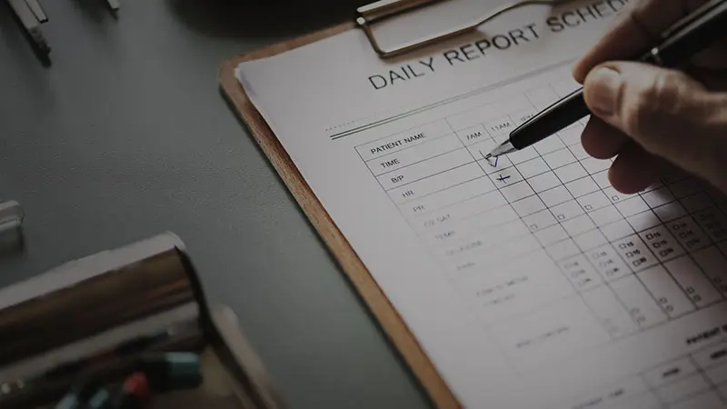

> 告别汽车之家，李想再创业。十几年来，他一直忙不停歇。也许是时间的锻造让他在创业领域驾轻就熟。但就是这么一个人也并不是没有弱点，这一期李想反思自己的创业投资历程。

车和家创始人及CEO 李想先生

## 找到适合自己的事情，比什么都重要

之前做了几年的天使投资人，回头看一下，投资成绩可以用极差来形容。

我自认为是一个还不错的创业者。从结果上来看，一方面在自己的市场领域获得了绝对的领先优势，另一方面也让投资者、团队有了非常可观的经济回报。

再看看自己的天使投资，为数不多的两三个成功案例，说白了都是走了狗屎运，和自己的判断以及对团队的帮助没有任何关系。成功的案例普遍也不需要我操心和帮忙。

为什么一个还算有成功经验的创业者，投资却很糟糕？在我彻底停掉所有的投资以后，我反复思考这个问题，终于找到了答案。

**我创业之所以还不错，最大的本事就是用人。**&#x39;0以上分的优秀人才可遇不可求，遇到了进入我们团队，他们都可以100%的发挥自己的最大价值，源于我真的信任和放权。60-80分的普通人才，我也很擅长把他们培养成90分以上的优秀人才，从而发挥巨大的价值。因为他们每天都在我身边，我不怕他们犯错，信任和重用，帮助他们成长。

到了投资就不一样了，我不是专业的投资人，所以没有时间去挑选那些最优秀的创业者。我还是以创业的心态来做投资，觉得60-80分的人也就够用了，可以把他们变成90分以上的优秀创业者。可结果往往非常糟糕，和创业不同，这些能力一般的创业者并不天天在我身边，我对他们产生的帮助和影响力非常有限，甚至很多在自己团队里一两句就说明白的事情，他们一两年都搞不明白，或者搞明白了也晚了。

所以投资创业的人才没得培养，只有选择，是那块料就是那块料。我也总算明白了身边几个搞天使投资成功率高的职业投资人，比如黄明明，他每天最核心的事情就是百里挑一的找到90分以上优秀的创业者，最后成功的概率肯定高一个量级。他追着投资我所付出的时间和精力，远远超过了我当年追女朋友的付出。

我作为一个创业者搞天使投资，除了钱有不少的损失，其实幸福感也全无。看着一帮能力平平的创业者连最基本的重点都找不到的瞎折腾，和他们讲也没什么用，有劲也用不上，真的是很痛苦。相反，我把一些创业失败的平庸创业者拉进我的企业，变成我的下属，他们的能力反而就和打开任督二脉一样，疯狂和高效的吓死人。

至此，我也就不用纠结了。

ALL IN，每天累得要死，快乐的一塌糊涂。也停掉了所有的投资，转投自己，也算是扬长避短。很多人来看我们组建了几个月的团队和整体工作进度，都认为我们已经开展了一两年了。

找到适合自己的事情，比什么都重要。

## 创业时经营的大原则

创业是我擅长，有一些经验可以分享给各位。

首先要遵循一些大原则。

互联网创业到底什么最重要？无非两个选择，一个是用户，一个是客户。腾讯的IM使用者是用户，增值服务的消费者是客户，广告商们是客户；百度的访问者都是用户，而投放竞价排名的各种各样的企业和公司是客户；淘宝的消费者是用户，所有的卖家都是客户，虽然有的卖家不付费，但也是客户。

**选择用户第一，还是客户第一，没有对错，只是一种选择，合适自己的企业就可以了。**

传统的草根创业者，大多是用户第一的选择，中国按照市值计算，最大的互联网公司前三名也都是用户第一（假如你认为阿里巴巴集团里面淘宝和支付宝的价值大于阿里巴巴B2B）。用户第一的原则需要至少2-3年的磨练，才会看到大规模盈利的曙光，所以这类公司基本上前两年都是赔钱的，赔个四五年也完全可能，但是一旦形成规模，就会很大。

如果是客户第一的原则，初期的发展速度比较快，很容易在一两年就达到千万上亿的收入规模，但是瓶颈也会来得更快，因为变现能力远远超越了创造价值的能力。

**以上两个选择其实是由创业团队的性格和经历决定，没有对错，且很难改变，关键是选择对了适合自己团队的。**&#x8FD8;有很多人连哪个更重要都很不清，这样的干脆就先别创业了，想明白了再创业。

当然，这个世界上还有一类创业者，这类创业者认为想到了是最重要的，认为想到了等于做到了，而且还会以为这个世界上就自己想到了（其实别人早就想到了，并早就开始行动了），在互联网创业领域这样的人还真不少，这类创业者损害了投资方和员工们的利益（这类创业者的恶性结果最经常见的就是解散公司或者拖欠员工工资，让投资人的钱打水漂），最重要的还是害了自己。

## 关于自信和信心

其次信念和心态也尤为重要。

自信和信心两个词翻来覆去，不管怎么说，我都认为是一码事，是关于信念的。

一个人的自信和信心我认为有三个级别：

**第一个级别，是对事有信心，但是事与我无关。**&#x6BD4;如你对苹果公司的发展有信心，你对中国足球队世界杯夺冠有信心，你对你哥们能成为HP的新CEO这件事有信心，对事的信心与行动无关，与自己也无关，属于脑子里面打飞机的信心，不存在驱动力，也是所有人都会有的信心，这个层面的信心其实毫无意义，所有人都可以有，没有难度，没有挑战，很多人认为这个层面的信心只有他自己独有，就停在这里了，然后什么都没付出，什么实际结果也没发生。

或者换种说法，这种信心是一种假的自信和信心，最害人了。

**第二个级别，是对于自己有信心，自信，和自己的目标、行动、结果关联在了一起。**&#x6BD4;如，我要从一个新人三年内做成一个主管，我要五年时间做一个中国最好的汽车网站，我要30岁之前开上宝马车等等。一个认为自己可以做到的目标，配合可以到达目标的动力，再有一个脚踏实际的过程，这就是第二级的自信和信心，这类人普遍学习能力强，意志坚强，自我要求高。每一个组织和团队都需要有这样的人，企业才能更好的发展，家庭才能够幸福。

这是一个合格的自信，但仍不足以领导团队，达到这个级别，能够做好自己、管理好小团队，还不足以领导和管理更大的团队。

**第三个级别，是最高的自信和信心，即对别人充满信心，且主要是对身边的人，哪怕一个人表现出来的是一块铁，我也相信他本应该是一块金子。**&#x80FD;够相信事情谁都会，能够相信自己有一定难度，而最难的是能够相信别人，从而让别人变得越来越自信、越来越好。

我还是用金子的说法来描述第三级自信，任何人在完成中国最基本的九年义务教育后其实都是一块金子，可能因为种种原因，这块金子有点生锈，看起来像一块生了锈的铁。于是就会出现这样一个状况，我认为他是一块铁，所以我对他的要求也只是做铁的事情，他也认为自己是块铁，所以他一辈子就是块铁，顶多是块好铁和烂铁的差别。

而第三级自信的人会坚信，你其实就是一块金子，所以虽然你现在表面的样子是铁，但是他会以金子的要求来要求你和帮助你，这个短暂的过程会很痛苦，但是结果很不同，虽然你的结果可能还不会马上成为金子，而是铜或者银子，你却已经搞明白了，原来我不是铁，我的真身其实是金子，从此你的自信和自我的要求会截然不同，你会用一切努力使自己成为金子，并以金子的标准做事，并享受着金子的成就和价值。

其实我们大多数人都是金子，少数人是钻石（天才），但是我们可能以破铜烂铁的方式创造着价值、要求着自己并活着，这个世界也并不缺少金子，真正缺少的是拥有第三级自信的人，把金子还原成本来的面貌。而一个真正的领导应该干什么呢？让铁变成金子，有金子的信心、提出金子的要求、创造金子的价值。

第三级自信是一个态度和信念，不是一件事，所以不需要漫长的过程。把铁变成金子也是一样的，10天和10年其实没区别。

## 只有「平常心」才是真善，既不左，也不右

「好心（初衷）办坏事（结果），好心（初衷）没好报（结果）」，这是身边很多人遇到的问题。关于这个问题我也思考过很多年，目前而言，我的看法很简单：「好心多数会办成坏事，好心多数会没有好报，只有平常心才能真正办好事」。

为什么好心办坏事？好心没好报？为什么很多善良的夫妻却走不在一起？为什么很多好心的人处处受排挤？

我估计这个问题很多人到死都想不明白。

我信奉人本善，但是绝不认为人是没有私心的，是个正常的人就会有私心。

**「好心」，很简单，好在「内心」，并非好在「过程」和「结果」上。**

「好心」也是「私心」，一个人把自己假设（说难听点是意淫）的「好」放在自己心里去对待别人（而不管别人到底是否需要），在心中为自己放了一个「贷」给对方，对方莫名其妙的背了一个「债」（仅虚拟的存在于「好心人」的内心）。

**这个「贷」是需要回报的，但是需要什么样的回报，只有这个「好心人」自己心里明白，这个回报或许不是利益，甚至肯定不是利益，而可能是一种关心，一种解读，一种夸奖，总是，「好心」是绝对需要回报的。**

但问题来了，除了「好心人」，没人能准确的猜到「好心」到底好在哪里，所需要的回报是什么，所以当回报和「好心人」的期望值不相符的时候，「好心人」可就不再是「好心人」了，而是「伤心人」，「好心人」自己内心意淫出来的「一切」全都会变成负面的行为和自私，从而变成负面的结果，同时还觉得所有人对不起自己。

「好心」的「心」是让人猜不透的，是超级自私的，并造成了这个世界上大多数的恶果；「坏心」的「心」也是让人猜不透的，是超级狠毒的，但是造成的恶果其实远远少于「好心」造成的。

由于「好心」不需要利益的回报，所以「好心」的回报需求更千变万化难以满足，是一种极度自我、极度自私的寻求内心自我满足的表现，从结果上看是人性中最可怕的一种表现，是多数恶果的「因」，只不过伪装成了「善」而已，是真正的伪善。

只有一个「平常心」才是不需要别人去猜测的，自己心里没有「贷」，别人身上也没有无形的「债」，能够以一颗「平常心」去做事，才会有好的结果。

只有「平常心」才是真善，既不左，也不右。

## 理解什么是平常心

以一颗平常心去做事，通常都会有好的结果和好报。

先反过来讲，这世上真的没有真的不求回报的人，我们常说的不求回报，只不过是不求利益上的回报而已。

不要利益上的回报，那就肯定需要别的回报，不如内心的满足等等。

不要利益回报的人，其实是最难满足的人，从结果上来看是最自私的人。

到底什么是平常心？

合理的去追求利益，这是一个正常人应该有的常态，只不过我们的社会把这再正常不过的心态演绎成了功利和负面的，把那些真正自私的难以满足的回报描述成了伟大和英雄。

黑的描成了白的，白的说成了黑的，谁让咱们是少数服从多数（而不是公平为先），哪怕多数都是白痴。

平常心等于：

1. 首先要对先自己负责，再对别人负责；（一个对自己都不负责任的人，如何对别人负责？一个对自己都不负责的人，知道什么是责任才见鬼呢！）

2. 在不伤害别人的前提下，必须先对自己好；（没吃过糖的人怎么可能给别人甜头？别总觉得别人欠你的，总觉得别人欠自己的人都是SB，只有你的白痴智商才造就了别人欠你的幻觉，从你生下来到死，没人欠你的！）

3. 合理的追求利益是再正常不过的；（因为结果和价值的回报就是利益和价值成就感。不求利益的人其实是伪善的，是最自私的，是最容易形成自我幻觉，感觉别人亏欠自己的。）

4. 在对自己好，对自己的负责的前提下，去对别人好。（在你觉得没人亏欠你的前提下，从结果上你必然你会发现，所有人都好了，相信我的这句话。）

## **创业发展路上的七原则**

### **1、方向**

方向是创业和发展的第一个重要指标，方向不是目标，目标有终点，而方向永远没有终点。

什么是方向？方向就是你要为什么而奋斗，我们的方向就是IT和互联网，GOOGLE的方向就是信息搜索。

不过别钻牛角尖，方向其实是清晰而模糊的，方向是具有辐射性的，不是说我们做IT和互联网，别的就一律不做，只要和这个方向相符、相关联的，而且有利可图，都可以去做，就和GOOGLE也做纸媒体广告，微软也出游戏机一样，只不过，主线一定是你的方向。不过，如果你做互联网的，还要去做钢材，那就出问题了，除非你是多元化的集团。

一个人的方向是可以改变的，不过改变的代价也是很大的，改变方向以后等于又在新的方向上回到了起点，所以，对于年轻人和创业者而言，方向是非常重要的。

说的再难听一点，即使我们自己很笨，只要坚持一个正确的方向，一直坚持，也会取得不错的成果的。

有了方向，目标就会更加清晰，也可以更加有效的去管理目标，当一个目标达到后，去挑战更高的目标。

铁哥们、兄弟姐妹、老爹老妈、老婆等沾亲带故的，一律不要出现在你的股权架构中，在中国，太多的企业家因为沾亲带故把企业搞死，或者企业活了，亲人都没的做了。**把亲朋好友以及亲人加入股权架构中，其实是害人害己，只看眼前面子和利益的行为。**

### **2、目标**

方向是模糊的，目标是清晰的，很多人说生活和人生感到迷茫，其实最重要的就是，他失去了目标。

汽车之家的时候，我们团队比较喜欢大学毕业生，他们身上的「臭毛病」比较少。我发现大学毕业生可以分成两类：一种是上学就有明确目标的，这些人在上学的四年中，除了正常的学习，还会围绕自己的目标去学习和提升，所以，这类大学生特别好用，只要工作的意愿够高，可以快速成为一流的员工；还有一种类型的是大学上完了还没有目标的，为了上学而上学，他们来面试的时候也不知道自己要做什么，只是有什么工作就干什么工作，或者干脆一坐，问HR你能给我安排什么工作？

我们100％不会用第二类的大学生的，因为培养的成本太高了。

所以，我建议大学生们，早一点给自己找到一个目标，在进入社会后，你可以比别人至少早两年进入正轨。

我们发现了目标的重要性，不过目标的制定也不是那么简单的。

目标，一定要现实又具备挑战性。当我们完成一个目标以后，再去挑战更高的目标。

目标又分为眼前的目标、阶段性的目标和战略目标。我讲一下我自己的目标有过那些改变。

我上高三的时候，我的目标是大学毕业以后，去一个好的杂志当编辑，可以拿2000-3000元的收入，不过这个目标当年就完成了，我做了自己的网站（相当于拥有了自己的杂志），每个月有6000-7000元的收入，那时候我还在上学。

当这个目标完成以后，我又有了新的目标，我要把网站商业化运作，2000年我的网站就开始商业化运作，虽然那种商业运作幼稚的可笑，但是也算迈了这步。

接下来的目标是赚钱，为了实现赚钱的目标（眼前目标），我还从石家庄到了北京，2003年我想要赚的钱赚到了，车和房子都有了。

新的目标（阶段性目标）是把网站做的更好，1000万美金卖掉（竞争对手的网站已经以这个价位卖掉了），所以我们就努力做，每年的收入都翻倍，2004年底，网站确实可以卖掉了，但是我不想卖了，因为这么多年来，我最大的收获是有了一个这么好的团队，要对这个团队负责，所以目标（战略目标）又提高了，我们要去上市，2009做到上市。上市不是空话，要针对上市进行针对性的目标管理，把5年时间要做的事情细分到每年、每季度、每月、每周甚至每天……

这是我个人和团队的目标的发展历程，你会发现，我起初目标其实是非常朴实的，简单的，甚至自私的，但是这些目标就是不断实现更大目标，成就更大的事业的必经之路。

而企业管理中则会运用到目标管理，这个从目标的制定、目标的实施、目标的监督考核、目标的总结、目标的修正，看起来是很复杂的，但是作为管理工具是相当有效的，企业发展到一定程度，一定会应用到目标管理的，对这方面有需要的朋友我建议大家多买几本书看看。

目标是导航标志，阶段性的成果分析工具，目标就是我们人生和企业的雷达，不要让自己和企业变成一个没有雷达的飞机。

马上找到属于自己的目标，尽管你我现在的目标不是多么伟大，但是他是你实现伟大目标的必经之路。

### **3、意愿**

有了方向和目标以后，最重要的不是马上去找方法，而是先解决自己的意愿的问题，当然，作为一个管理者，你也需要解决好别人的意愿。

意愿就是一个人为了实现目标而付出的行动力的决心。

我们常说人要有压力，压力纯粹就是放屁和自欺欺人的，压力从来就没有和行动力以及目标和结果有过任何实际的联系，有压力而无所作为的人中国可以找出十多亿来，只有通过意愿变成超强的行动力，而产生出结果和实现目标的才是有价值的。如果有人天天喊我有压力，他99％的可能性就是喊喊而已，行动方面几乎什么也不会改变，因为他早就习惯这样了，他知道只要经常喊一喊有压力，别人就认为自己努力了，和到底去不去行动没有关系的。没有行动力，压力就是人最大的阻碍和自我欺骗的口头禅而已。

压力喊的越多，行动力也就越差。是的，看到我这么说，很多人一定很不爽（我以后也会经常让你感觉不爽的，地球上可以爽的地方太多了，不过爽的同时，你其实还是什么都没改变），因为你自己就是这样的人，不过说实话，其实你早就看自己都感觉不爽了，只不过是你自己不敢面对而已。

放弃压力，变成行动力，而行动力的根源来自于意愿，只有行动力才可以实现你的目标。

一个人基本的做事方法取决于三个步骤：

1. 意愿；

2. 过程，包括方法、技能等等；

3. 目标、结果。

意愿决定了过程中的行动力，其实每个人都不缺少方法，太多的方法和机会都摆在你面前，你根本就看不到，因为你根本就没有意愿。没有意愿，再多的方法也没用，因为在你没有意愿的时候，给你方法你也不会去用，你甚至会觉得给你方法的人很烦。

所以，意愿对于个人和管理而言，是非常重要的，意愿越大，成功的机会也就越大（前提是有方向和目标）。

我又把人分成了四种，管理者和我们自己可以分别对号入座：

1. 高意愿、高技能；

2. 低意愿、高技能；

3. 高意愿、低技能；

4. 低意愿、低技能。

* **第一种人（高意愿、高技能）**&#x5C5E;于可遇不可求的，你只需要给他不断的挑战和鼓励，就足够了。

* 不过第一种人也有可能变成第二种人（低意愿、高技能），对于第二种人，经常会是一些老员工，做为当事人自己以及管理者，需要解决的主要是意愿的问题，让他们重新获得激情和行动力。

* **第三种人（高意愿、低技能）多半是新人**，尤其是大学毕业生，多用这样的人，他们会乐于接受和快速学习所有的方法和技能，很快成为高技能的人，只要他们的意愿足够的高。

* **第四种人（低意愿、低技能）**，这种人对于一个企业而言，没有任何价值，直接开除掉就可以了。而如果你就是一个这样的人，要解决的根本不是技能问题，而是什么也别干，先解决好自己的意愿的问题，让自己变成第三种人。

当一个人具备了很好的方向、目标和意愿以后，他就具备了创业以及走向工作岗位的基本条件了。

### **4、方法**

很多人总认为我只要有了方法就一定能成功，这个是有前提条件的，所以我把方法放在了第四位。

人最不缺的就是方法，最缺的也是方法。不缺的时候方法很多，就是用不上；缺的时候，方法也很多，就是没有最有效的那个。

方法本身并不重要，为了实现目标而存在的方法是最重要的。

这里从个人和管理双方面讲述方法，对于个人而言是如何获取正确的方法，对于管理者而言则是如何有效的传递方法。

对于一般人而言，只有自己有强烈的意愿去实现目标的时候，就非常容易接受别人给予的方法，甚至自己去找寻方法，所以获取正确的方法的前提是目标和意愿的存在；对于不一般的人，他具备很好的学习和聆听的能力，把所有的方法变成自己的，在实现目标的那个环节中最恰当的方法来使用。

对于管理者而言，管理的同时，方法会成为催化剂，这个催化剂可能是正面的，也可能是负面的。方法一定要在别人需要的时候再给予，也就是对方有意愿和需求去达成目标的时候。如果别人根本不需要方法，而你单方面的向对方灌输方法，那么这个效果则是负面的，对方不但不接受你的方法，反而会反感你，因为他当时根本就不需要方法。

人最不缺的就是方法，最缺的也是方法。如何获取最需要的方法，如何把自己的方法有效的传递给别人，将是一项非常大的挑战。

### **5、毅力**

有了意愿和方法以及正确的方向，也不一定能够实现目标，因为太多的人是根本就没有毅力的。

毅力＝坚持＋突破。

举个会出现在大多数人身上的例子。我们给自己拟定了一个大目标，并为这个大目标制定了几个相应的小目标，不过在实现目标的过程中，小目标还没有完成，又出现了更多的目标。结果很多人就被目标把自己「搞死」了。

**我们设定的目标会有很多小的目标组成，小的目标完成了，大的目标就可以完成了。**&#x4E0D;过，我们被目标搞死了，因为目标遇到一些难度或者阻碍的时候，我们就不去完成了，绕开它，然后寄希望于找到更多的新的目标去实现大目标。

好了，你会发现，慢慢的，你已经失去了完成目标的能力了，当眼前的目标受阻，你就马上转移目标，就你那毅力，眼前的目标都完不成，你以为自己就能完成新的目标了？

目标不能完成，而为之付出的过程无论多少都是白搭的，你的人生就在不断去做不能完成的目标，不断的去找新的不能完成的目标的过程中浪费掉了。

所以，盯好眼前的目标就足够了，用你的毅力去战胜困难和阻碍，坚持和突破！慢慢的，你已经掌握了实现目标的能力了，而这完全归功于你的毅力。

少找目标，多达成目标，你就不会被目标搞死了。

困扰年轻的人无非两点，而且是两个极端：1、没有目标，没有意愿；2、目标太多，没有毅力。

### **6、成果**

说了这么多辛苦的条件，我们总算可以见到成果了。

成果就是目标的完成，该目标到此结束。

最值得兴奋的就是成果，而不是过程。成果见证了你的5个必备条件的具备，标志着你已经具备了完成目标的能力，也意味着你可以去挑战更高的目标了。

**没有成果，所有的条件和努力其实都是白搭的。**

成果是验证点，成果是兴奋剂，只有成果真正体现出你的价值和能力的提升。

那么，接下来你就可以进入更高的境界了：自我观察。

### **7、自我观察**

我们太多的时候陷入过程而不能自拔，发现不了问题，如果没有高人指点，往往会陷入或者沉迷于过程而不能自拔。问题如果发现不了，就会迷失，肯定实现不了结果。

既然不能总是依赖于高人的指点，我们只好进行自我观察，以另外一个站在事情外面的人来看观察自己。

自我观察是我从2005年开始做的，我针对自我观察制定了一个简单的工具。

任何事情的组成简化为：目标－过程－结果，而对于一个有目标的人，问题肯定会出现在过程中，所以一旦感觉不太对劲，马上用这个工具判断自己，我所进行的过程与我要实现的目标是否一致，问题出现在哪里？用目标来判断正在进行的过程是否相符，是否是最佳的过程，能否产生结果？

这样，问题就会找出来，然后解决问题，目标就可以完成了。

2005年的时候，我用这个简单的「目标－过程－结果」工具来帮助自己感觉不对劲的时候观察自己，2006年，这个工具已经变成了我的生理本能，任何时候我都可以站出来观察自己，只不过，看自己的高度的提升则是永无止境的。

年轻人创业和发展七个要点：方向、目标、意愿、方法、毅力、成果、自我观察。是我这些创业的积累，希望对你有所帮助。

作者：李想，车和家创始人及CEO
