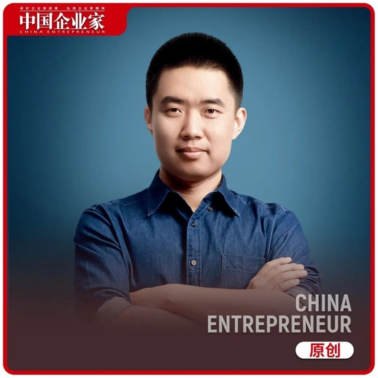

　　第一是不知道自己不知道，第二是不能实事求是。

　　采访|《中国企业家》记者 何伊凡 任娅斐

　　文|任娅斐  编辑|马吉英

　　头图来源|受访者

　　2023年春节开工第一天，李想发布了致全体员工的一封信，信中回顾2022年理想拿到了四个“第一”，并且抛出四个指引方向，即理想的使命、愿景、价值观和行为准则。

　　作为理想汽车创始人、董事长兼CEO，李想认为，只有不断提升认知，持续与惰性对抗，才能真正掌控自己的命运。“对我自己而言，其实最可怕的就两件事情，第一是不知道自己不知道，第二是不能实事求是。”在1月份接受《中国企业家》专访时，李想说道。

　　生于1981年的李想，不仅是汽车圈最年轻的企业家，也是一位连续创业者。造车之前，他先后创立过泡泡网和汽车之家。他曾这样总结自己的三段创业经历：第一次创业只关注竞争，最后没有赢；第二次创业，更关注用户，然后赢了这个市场；到了第三次创业，更关注组织。

　　在2022年，造车新势力第一梯队的“蔚小理”都走到了第一代产品密集换代的关键时期，随着公司业务、人员规模的极速扩张，组织管理的挑战也倍增。

　　李想呈现出强大的系统性思考能力，2023年1月，《中国企业家》与他有一场深度对话。

　　本次内容要点包括：

　　1．人和人之间最大的差别就是对于工具的使用。你用枪，我用刀，我就打不过你。

　　2．文化不是缺什么补什么，而是你真正优良的东西，能帮助你获得成功的东西，并且是每个人誓死捍卫的东西。

　　3．对我自己而言，其实最可怕的就两件事情，第一是不知道自己不知道，第二是不能实事求是。

　　4．规模小的时候，速度就是效率，规模大到一定程度时，质量就是效率。

　　5．阶段错配是很多企业最大的问题，没有这个阶段的命，得了这个阶段的病。

　　6．我没有退路，我不可能失败了以后再去找份工作，因为我从来没给别人工作过。

　　7．战略的核心就是取舍，我从来不相信以少胜多，但是我在每一场仗上，投入都比别人多。

　　8．我活着是为了掌控自己的命运，挑战成长的极限，所以我一定会选择最大的行业、难度最大的领域来做，并拿结果来验证。

　　以下为对话整理（有删改）：

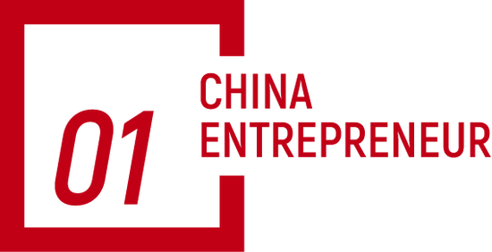

　　未来3年是极为残酷的淘汰赛

　　《中国企业家》：李斌、何小鹏都提到2022年是在弯道行驶的一年，对于弯道行驶这一说法，你是否认同？你对2022年的感受是什么样的？

　　李想：首先，2022年整个新能源汽车的涨幅高于三家新势力的涨幅，这是一个很显著的现象，根源有两个方面，一是因为汽车是一个长周期的行业，很多积累需要时间，另一方面又跟努力息息相关，既需要努力又需要时间，这两个缺一不可。

　　第二，2022年三家新势力都在发布第二代产品，但是因为各种原因，也有我们自己准备不足的问题，原本应该三季度完整交付，都延到了四季度。有的企业延误只是爬坡节奏发生了变化，有的延误甚至错失了一个市场机会。所以三家新势力同时出现的问题，都是在第二代产品上的节奏慢了，但是节奏慢的原因和影响各不相同。

　　总之，三家新势力的节奏和行业爆炸性的增长出现了一个错配。但对理想来说，我觉得80%还是自身的能力和管理问题。

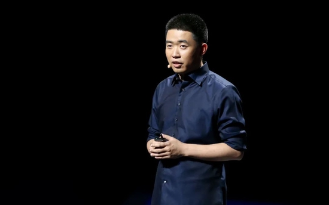

　　《中国企业家》：你说80%都是跟自己相关的，你进行了什么样的复盘？如果改变哪些行为可以变得更好？

　　李想：我觉得汽车是没有办法改变某一个具体行为的行业，因为智能电动车是一个比传统汽车更复杂的管理和运营体系。从2017年开始，我们就是以产品为中心的十字架架构来看公司的问题。

　　第一个是品牌，品牌包含两个方面，一个向外，怎么去跟用户讲明白你是谁，另一个向内，是我们的使命、愿景、价值观，怎么向团队讲明白自己是谁。这样一个复杂体系的战略意味着什么？意味着我有一个清晰的品牌和文化定位，并围绕这个定位进行一系列复杂精密的工作。其实在这一波新势力里边，有很多企业在第一点上就输掉了，就是因为他不知道自己是谁，既不知道怎么向消费者讲自己是谁，也不知道怎么向员工解释自己是谁。

　　其次是产品，产品必须构建一个非常强大的专业体系，而且是由品牌来指导。比如理想是要服务家庭，就要取舍，但是很多企业不知道怎么取舍，因为没想明白到底服务谁。另外，我觉得任何一个产品都要做好三个维度。第一个维度是向往感，用户买一个全新时代的产品一定要有向往感。第二个是价值感，再有钱的用户也在意座椅到底有没有通风，通风到底是吹风的还是吸风的。在中国能买20万以上车的人群，其实总共就几千万，这些人一定是理性居多。第三个是安全感，因为一辆车承载的是一家人。这里边也包含硬件和软件，硬件一定是做超用户需求的，软件要满足用户的需求。

　　再往下是商业模式，车的商业模式就三种，一种是制造业的商业模式，大概有10个点的毛利率就可以了。第二种是消费品的商业模式，对于汽车来说，有10到20个点的毛利率就已经很高了。第三种是成为一个科技企业，那你需要达到20个点以上的毛利率，才能支持科技企业的研发投入。这三种商业模式的难度、体系、投入都是不一样的，不同的商业模式也决定了不同资源的投入。

　　你可以把品牌理解为我的“头”，产品是我的“身体”，商业模式就是我的“血液”。接下来，以产品为中心的十字架架构中，产品怎么向左右延伸？

　　我觉得一个延伸是研发。研发有三层，一层是产品研发，跟过去传统的车企一样，以集成为主。第二层是平台研发，过去的传统汽车，因为没那么复杂，所以自动驾驶主要是那些超大型的一级供应商来做，但今天他们的软件能力跟人工智能能力不够，只能我们自己来做。尤其是智能化和电动车核心的平台，我们做的比供应商其实更好。第三个是底层系统的研发，我们的超算、云服务、操作系统等等，跟苹果后边做的底层能力是一样的。随着时间推移，我们最后会跟苹果、特斯拉一样变成三层的研发投入，因为最后大家比拼的还是研发能力，每往下探一层你的能力就更强。

　　研发能力之外，是交付能力，是综合能力。这个能力我们又分成了三块，第一个是商业化能力，如何管理多车型和复杂的区域，一款车和多款车难度是不一样的，只做一二线城市和三四线城市都做，难度也是不一样的，甚至管理方式都要发生变化。第二个是供应能力，没有自己的核心零部件生产基地，就是你的瓶颈，但这又是个很复杂，需要长时间建设的事情，今天我们看到的结果其实都是三年前干的事儿。第三个是组织能力，组织能力是最难的，因为这不是努力就能解决的。

　　《中国企业家》：往往你越努力犯的错误会越大。

　　李想：对，所以根据这个十字架构来看，我们最强的肯定是产品能力，商业模式是早就确定的，所以我们要补自己的品牌文化能力，补研发能力。比如我们现在平台研发已经成体系了，但系统研发其实刚刚开始，我们的商业能力还差很多，供应能力差很多，组织能力也差很多，但这都是机会。

　　《中国企业家》：2022年有一个新的情况出现，上面有特斯拉、比亚迪，再往下还有一大堆追赶者，蔚小理夹在中间，这种压力感有变化吗？

　　李想：我觉得做的市场不太一样，长期的价值也不一样。如果你做的是一个比较便宜的市场，比如一个网约车市场，其实它有点类似于早期的智能手机，当时那些千元机卖的也不错，但是能不能支撑到真正变成一个完整的智能机，还是有明显的差别。下边的市场肯定是更大的，它是一个金字塔结构，但我觉得还是要看得更长远一些。

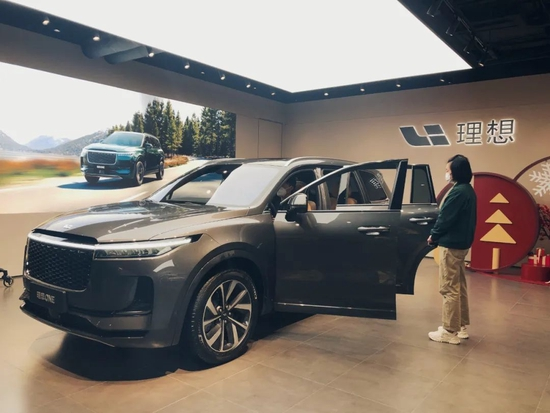

　　摄影：邓攀

　　《中国企业家》：你怎么看2023年？或者我们把时间拉长，以3年或5年为一个周期，你认为行业的竞争会进入一个什么样的状态？

　　李想：我觉得2023年到2025年这三年时间是极为残酷的淘汰赛。因为我认为不需要那么多公司。

　　《中国企业家》：2025年的格局会是什么样的？

　　李想：我就不做这个假设了，我们核心还是在20万以上的乘用车市场，占据20%的市场份额。

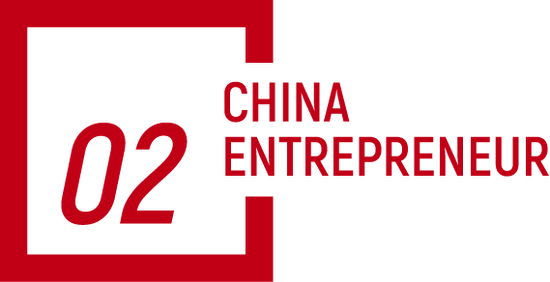

　　人与人的最大差别，是工具的使用

　　《中国企业家》：在面对造车这个如此复杂的商业系统时，其实有两个字特别重要，就是取舍。

　　李想：所以必须得回答清楚“我们是谁”。这是一个最重要的问题。

　　《中国企业家》：你花了多长时间来思考“理想是谁”？

　　李想：最开始其实我有个比较好的老师，就是秦致（原汽车之家CEO）。秦致第一件事就帮我们树立了一个体系，后边又梳理了整个组织管理体系，我觉得这个是真正受益匪浅的，而且这个东西真的有用。

　　另外我们还会研究一些好的公司，我觉得过去几年全世界表现最成功的企业中，微软绝对排第一，史蒂夫·鲍尔默管理微软的时候，是微软文化丧失的时候，但是萨提亚·纳德拉重新树立了文化，既做对了云，又做对了AI，OpenAI做的新东西让谷歌基本上走到生死关头了。

　　《中国企业家》：纳德拉突破了微软做不了硬件的“魔咒”。

　　李想：而且让微软从一个大家讨厌的公司变成一个大家喜欢的公司，纳德拉干的第一件事情就是和比尔·盖茨重新塑造了微软的文化。

　　《中国企业家》：你刚刚说确定“理想是谁”时，秦致提供了很多帮助，那是在汽车之家的阶段，后来你真正造车时，是怎么想清楚“我是谁”这个问题的？

　　李想：哪个时间点做文化，哪个时间点做品牌，我觉得还是秦致提供了最大的帮助。秦致当时给我们提供了一个非常好的最佳实践，这个最佳实践分两个阶段，第一个阶段是靠着本能去做。因为你上来讲很多东西，大家是不信的，怎么回答你是谁，你得真的是你，你和别人是有差异性的，而这种差异又是能帮助你持续获得成功的。但这个东西要经过验证，所以秦致当时拉着汽车之家的员工一起梳理，他在黑板上写“在过去这么多年，我们做的哪些关键选择，帮助我们获得了成功”，然后让大家投票。

　　第一个是把消费者的利益放在第一位；第二个是做正确的事，不做容易的事；第三个是先做到60分，再去做100分。

　　当时大家举出了无数个案例，那这个时候大家就信了。因为文化不是缺什么补什么，而是你真正优良的东西，能帮助你获得成功的东西，并且是每个人誓死捍卫的东西，这些才是你真正的文化。

　　《中国企业家》：我有一次跟阿里的朋友探讨一个问题，当你手里拿着一块砖的时候，你告诉别人，我这块砖是建教堂而不是建猪圈的，因为每个人都希望跟一个要建教堂的人玩，这个时候难题就来了，你凭什么让别人相信你？

　　李想：第一个阶段其实就是靠强硬。因为一个企业的初始阶段一定是中心化的，一定是顶层的核心管理团队决定的，所以这个时候其实没有太多的商量余地，你就去做，最后一旦做到了，大家再来总结的时候，就很容易看到相同的规律。

　　《中国企业家》：所以打胜仗是最好的团建。

　　李想：打不了胜仗，你也活不下去，我觉得第一阶段就是生存下来，集中资源，集中决策，并且把这个过程中发生的关键要素提炼出来，大家就信了。最开始大家都觉得理想ONE只能卖1000辆，当你做到1万辆的时候，再说服务家庭对不对？肯定对了，你已经超越用户的需求了。

　　大家发现你准则里的第一点是把用户价值放在第一位，不是把需求放在第一位，大家就信了。在这个过程中，你的价值观会决定你选不同的工具，如果只是解决问题那很容易，但我们解决所有的问题是非常体系化的，我们用的是丰田的TBP（Toyota Business Practices），需要经历八个步骤，做完整的分析、规划、解决问题并生成流程。最开始大家都不相信这个事儿，但做着做着发现，整个公司沟通起来、协作起来太容易了。我觉得人和人之间最大的差别就是对于工具的使用。你用枪，我用刀，我就打不过你。

　　《中国企业家》：你在原始丛林把原始武器用得再熟练，一旦走出这个丛林，你马上就被秒杀了。

　　李想：对。但企业选的所有工具，总结起来就会发现跟它的价值观都是相符的。

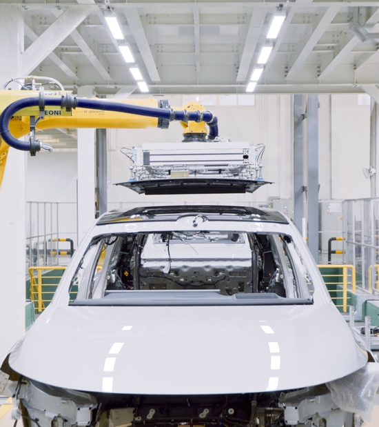

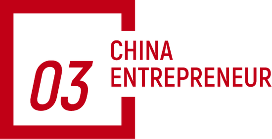

　　组织变革的最大挑战是认知

　　《中国企业家》：其实对造车新势力来说，组织管理的难度是很大的，因为它有互联网的部分，有制造业的部分，还有上游下游的部分，整个产业链非常长，这种组织的复杂程度可以说是超过目前绝大多数公司，而且很难找到一个管理的标杆，你对组织的思考是什么？

　　李想：我觉得一个企业遇到的最核心问题是，从你不知道自己不知道，变成你知道自己不知道。从某种角度分析组织，就是看组织的开放、收敛、复杂、可控和不可控。开放就是利用外部的资源，收敛就是我自己能干，可控就是东西虽然很复杂，但我能控制住，不可控是比如生态这些东西，你没法通过计划来做。我们比较幸运的一点是赶上了一个比较好的节奏。

　　首先定义一下软件1.0和软件2.0，软件1.0是我们自己制定规则，自己编程，最后程序给自己使用，今天的互联网、终端设备、APP都是这么来做的。软件2.0是机器通过向人类学习，机器自己编程，自己制定规则，以及给自己使用，神经网络、AI就是这样的。我们使用的是一个机器人，但并不使用机器人的任何具体功能，机器人是自主的。这是两个时代的东西。

　　在汽车之家的时候，我们会做APP，会做互联网，所以有管理软件1.0的经验。做汽车时我们要做销售服务，但在我们看来，它是相对开放、可控的，在逻辑范围之内。再然后我们还要补充工业能力，所以就得去学习，我们学丰田，学通用，学标准的汽车研发、实验、制造流程，重点招聘传统汽车厂里有经验的人才，甚至连解决问题的工具都学的丰田，因此掌握了工业的能力。在这个过程中其实又遇到了一些问题，比如两边的团队不知道怎么协作，我们又引入了OKR，大家要对齐，相互理解。

　　紧接着我们再去解决多车型平台化的能力，那就要去看系统型的公司是怎么做的，所以我们就先引入了IPD（Integrated Product Development，集成产品开发）的研发体系，当时我们要解决的最重要问题，就是如何把产品研发和平台研发融合在一起，否则就会出现很多汽车厂商出现的问题，研发是研发，研究院是研究院，最后结合不到一起。

　　在慢慢补齐上面提到的能力之后，再往下的一个挑战是什么？就是软件2.0，今天我们做的智能驾驶、智能座舱，其实还是软件1.0的方式，当真正变成软件2.0的时候，它是不可控的，这个挑战并没有真正到来。

　　我觉得组织的另外一个挑战跟规模相关，因为不同的规模又会决定你的管理方式。比如规模小的时候，用职能型的方式就能管理好了，但是像我们这种涉及软件硬件、AI等各种复杂因素、长周期的企业，你如何做到确定性和灵活性能够兼备？那你就要去研究全世界最成功的企业。

　　我们最开始有一段时间一直走在误区里，老觉得自己跟别人不一样，其实就是因为对别人研究得不够。

　　比如我们从2020年到2022年一直有个特别纠结的事情是什么？我们最喜欢的企业是苹果，但是大家都认为苹果是一个职能型组织，所以我们荒废了两年多时间，思考是不是转矩阵型组织。还好我们从2021年做了个矩阵型组织的尝试，就是在产品研发上面按矩阵做，效果非常好。后来发现苹果是典型的矩阵型组织，我是怎么发现的呢？是交叉着读了三本书，《史蒂夫·乔布斯传》《乔纳森传》《蒂姆·库克传》，才发现苹果就是矩阵型组织。

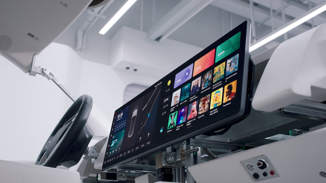

　　《中国企业家》：哪个实践做成功了？

　　李想：IPD，我们的L9、L8都是严格按照IPD来做的。

　　《中国企业家》：判断成功与否的标志是什么？

　　李想：就是销量。因为大家总是说理想在细分市场上碰了运气，后边能不能成功，能不能接着出爆款。那现在大家看到L9是， L8是， L7也会是，于是就相信了。就是要从偶然变成必然。

　　《中国企业家》：我记得你之前提过刚开始在公司推OKR时，面临过一些困惑，后来看了一本书后，才真正理解真正的OKR应该怎么做，当时对OKR的误解是什么？

　　李想：我最开始看的那本书有问题，叫《OKR工作法》，书中讲的是一个非常小的公司，只有十几个人，公司的规模和我们完全不一样。正好有一阵时间我生病在家研究另外一本叫做《这就是OKR》的书，书中说一定要用在线系统，一定要每周开会，一定要做复盘，我们就严格按照书中的东西来，2019年我们的整个协作就变得特别好了。

　　《中国企业家》：其实在你身上验证了一点，看书有用。特别是做企业的人，哪怕背后放一书柜的书，知行是很难合一的，但我发现你很多的知识都是从阅读当中获得的。关键是把书读懂就很难了，读完了之后你还能用过来，这一点你是怎么做到的？

　　李想：我在内部经常讲两件事情，第一件事情是人和人之间的差别是信息获取的能力和信息处理的能力。另外随着大家研究更先进企业后发现，信息获取有两种途径，一种途径是靠自觉，另外一种途径是靠强大的工具。全世界各种各样的先进的管理工具，逻辑基本上都是一样的，它会让你更早地知道自己不知道。

　　《中国企业家》：在组织变革的过程中，你遭遇到的挑战是什么？

　　李想：最大的挑战还是自己的认知。比如我们第一个阶段，老认为自己和别人不一样，我们是特殊的，那是因为你还没看明白人家。第二个阶段是你出去看了，但你看得不够深，如果你请一些顶级的咨询公司来帮你看，跟你自己看是不一样的。这跟看病一样，很多时候我只知道哪不舒服，但其实自身很难有诊断能力，所以得借助外部的力量来诊断，比如读书、上课，请教好的咨询公司，跟好的公司去沟通。

　　《中国企业家》：你怎么感觉和别人不一样？

　　李想：我自己觉得这可能是互联网公司的一个通病。因为中国过去传统的商业体系并不成熟，所以互联网公司做得不错，就觉得自己跟别人不一样了。其实当你到了一定的规模时，组织的管理方式是一样的，没什么区别。因为我们今天遇到的问题，人家都遇到过了，尤其是你没收入的时候觉得不一样，你有收入的时候，核心是什么？收入和费用。费用不就是你对资源的使用吗？你的资源使用反映了你的组织在怎么干，你也有研发费用、销售费用及管理费用，都是一样的。

　　《中国企业家》：有一个很有意思的地方，当你在认真研究苹果的产品模式时，苹果的造车计划还没有这么明确，当你把它的模式应用到理想时，苹果的造车路径开始逐渐清晰，你对苹果的造车计划有比较深入的研究吗？

　　李想：从行业来看，我觉得苹果造车一定是世界第一大话题。苹果有非常强的基础能力，但是我觉得它同样也会面临一个巨大的挑战，也是在组织方面。苹果之所以成功，是因为它的文化和体系非常适合它现在做的这样的产品，但是它在面对一个更复杂的产品的时候，其实会有两个严重的包袱，一个是组织包袱，一个是偶像包袱。

　　面对组织包袱，它有两种选择，一是让现在的组织方式升级，从而能适应汽车，但是它现在的组织方式太成功了，以至于做手机的人会说，为什么要发生这样的变化？二是再孵化一个组织，这个时候又会出现一个问题，尤其对一个文化品牌非常强的公司，它会发现这个“孩子”如果长得像它，拆不拆出去都无所谓；如果这个孩子更适合智能汽车、智能驾驶，就会长得和苹果越来越不一样。就好像两个白人夫妇，忽然生出来一个黑人孩子，肯定也无法接受。

　　偶像包袱是，产品做出来了，需要经历从0到1，从1到10，很多人会说苹果不卖100万辆，就是有问题，所以就不认可你，把你的股价给打下去，它就更犹豫了。

　　《中国企业家》：当你真正深入研究丰田，研究有很长历史的制造业公司的时候，你可能会更震撼，但是之前可能没有这种感受。

　　李想：我一直对他们很尊重，比如丰田的精益工作法。你开始以为TBP只是解决制造的问题，后来发现什么都能解决，甚至都能帮你解决生活上的问题。他们之所以成功，是因为他们建立了很强的生产力工具，就跟有了枪，有了炮，有了车一样。

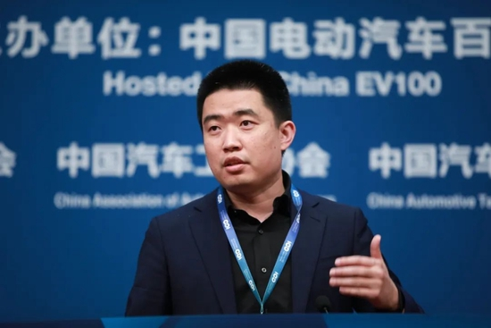

　　《中国企业家》：当一个公司有几种不同文化基因的时候，我们常说它是一个两栖动物，刚刚你说的这种情况，其实两栖都不够了，你可能需要三栖、四栖。

　　李想：这是对应不同组织的能力，其实它不是文化，我们的文化还是非常非常统一的。

　　《中国企业家》：但有时候这种能力会造成一些文化上的困惑，比如互联网的开放性或者粗放型增长，对应制造端的这种精益的控制，稳定的输出，你在做变革的过程中，会感受到这种撕裂感吗？

　　李想：我觉得秦致当时做的有两个东西特别好。第一个东西是告诉你为什么，我们为什么要用互联网的管理方式？因为谁都不比谁傻，只是过去没有看见，他不知道自己不知道，当他知道以后，他会跟你做出相同的判断和选择。我们虽然是制造团队，但对数据的拥抱比互联网团队还积极，所以整个工厂的智能化程度，数据化程度高到难以置信的程度。谁愿意拒绝自己掌握一个更强的工具？难道我有枪以后就不能穿防弹衣吗？所以让大家知道，是我们管理公司的义务所在。

　　另外一个也是跟秦致学的，统一语言。我们当时为什么要用丰田的工具，因为我们招的各个汽车企业的人都有，你要知道哪怕描述一个相同的名词，通用的定义和福特的定义也不一样。这时候每个人都觉得自己是对的，那我们都没法管了。我当时怎么做的？把总监级以上叫到一起，大家共同去分析全世界什么是做的最好的，把通用、福特、摩托罗拉的六西格玛、丰田这些主流的管理方式列在一起，所有人去研究，研究完以后大家来投票，最后大家统一选择的是丰田的（管理）方式。为此我们还专门从丰田招人，投入很多钱去做培训，这才把解决问题的体系建立起来了。

　　《中国企业家》：为什么看了这么多公司之后，还是觉得丰田的体系和工具更好？

　　李想：其实很多时候你只要去看研究哪家公司的书多就行了，一定是因为它更先进。而且你可以看日本人写的，看美国人分析的，看中国人分析的，并且还可以拉着丰田的人过来给你讲一讲，因为丰田是希望向外输出这些东西的。

　　我始终相信一个东西，就是人和人之间的差异没有那么大，当大家都能看到全貌的时候，很容易做出相同的选择。

　　《中国企业家》：这里面最大的难度就是你自己要破我执，并且要让团队破我执，千万别以为你看到的已经是世界。

　　李想：是。我觉得这就是企业最大的博弈，也是企业最大的成长。对我自己而言，其实最可怕的就两件事情，第一是不知道自己不知道，第二是不能实事求是。

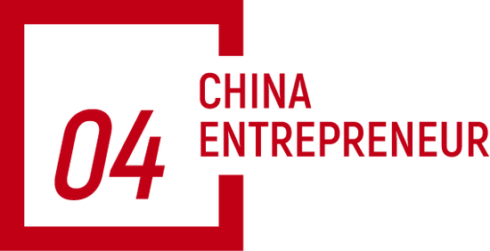

　　阶段错配是很多企业的最大问题

　　《中国企业家》：其实做组织的改造，不单是一个难而正确的事，而且是一个难而正确，且长期的事，很难一蹴而就。因为组织像一个生命体一样，它会变化，会遇到新的挑战，流动性也比较强。

　　李想：我们过去没有做过这样的规模，2019年赶上年底疫情，我们只卖了不到半个月，从2020年开始有正式的收入，2020年做了90多亿，2021年做了200多亿，2022年有450多亿的收入。这么多年我的一个很大的感触是，其实很多时候组织的升级变化是永远存在的，根本不可能一蹴而就。而且组织能力的升级，跟规模息息相关。规模小的时候，我们自己内部讲速度就是效率，但是规模大到一定程度的时候，质量就是效率，因为任何一个低质量的决策，低质量的产品，低质量的制造管理能力，都可能让你损失几十亿、上百亿，甚至可以让你的公司直接倒闭。

　　总之，要做一些动态调整，但是更重要的是学习公司在对应的规模阶段到底做了什么，千万别学错。

　　《中国企业家》：这点非常关键，比如现在很多人学华为。

　　李想：对，很多公司学华为，学三星，学苹果，其实都有严重的问题。表面上学的是流程升级，组织里边的关键组成部分就是流程，流程就像你的产品。很多公司只学这个部分其实是有问题的，至少基于我们现在的认知，组织是有四个环，环环相扣的。第一个环是你要有文化，有统一的价值观，第二个环是流程，第三个环是人才体系，第四个环是激励体系。

　　《中国企业家》：你还为组织调整，专门去了湖畔大学学习对吧？你是在湖畔大学对组织的理解更加深刻了吗？

　　李想：我们当时遇到一个最大的问题是什么？2017年底2018年初的时候，我们宣布第一款产品失败了。所以我觉得理想汽车的创办是由一个战略失败开始的。当时我的想法是说我要去学战略，学战略我就找最好的人去学，我们自己在内部聊，说全中国做战略最好的就是曾鸣教授，当时他是湖畔大学的教育长，所以我就坚定地去报湖畔大学。

　　《中国企业家》：你跟他交流的过程是什么样的？有没有哪几句话让你感觉一下捅破了一层窗户纸？

　　李想：曾教授教了我们三个东西，第一个，战略不是少数人想出来的，是共创出来的，共创的核心目的是让大家一起去看这个世界，只要你看到了，很多时候你就知道怎么去规划了。

　　第二个是帮我们梳理了从0到1要干什么，从1到10要干什么，从10到100要干什么。因为阶段错配是很多企业最大的问题，没有这个阶段的命，得了这个阶段的病。比如他提到从0到1的时候，其实是要验证自己的生存能力，从1到10是把你验证完的东西发扬光大。但是很多企业不愿意干从0到1的事儿，而是一上来就想干从10到100的事儿，那它一定折。

　　第三，帮我们设计出组织架构的诊断方式，是更开放还是更收敛，更可控还是更不可控。

　　《中国企业家》：理想当时有这种错配吗？

　　李想：学会了以后就没有了，所以我觉得核心的就是知道我们自己不知道。

　　《中国企业家》：往往吃过亏才会体会到，没吃过亏不行。

　　李想：所以一次没让我们死亡的战略失败对我们是非常重要的。

　　《中国企业家》：一般情况下，战略失败后70%的公司就过不了这个坎了。你现在回想第一款产品失败后能够活下来，并且触底反弹的原因是什么？

　　李想：第一，我们能特别好地面对失败。我们当时停掉SEV的时候，公司有1100个员工，我用了很多天时间和他们每个人沟通，一个会议室大概不到100人，开了十几场会，给每个人讲明白为什么要停掉，包括政策上遇到什么问题，规模上遇到什么问题。我认为只要大家看到相同的问题，都会做出相同的选择，所以当时很多员工抹了抹眼泪，就继续做理想ONE了。

　　第二是跟我自己相关的，我没有退路，我不可能失败了以后再去找份工作，因为我从来没给别人工作过。当然对于我们这种创业者而言也是好事，很多创业者给自己留了太多退路，其实反而成了问题。

　　《中国企业家》：你当时为什么要跟1000多人分成十次去谈，而不是开一个大会谈？

　　李想：那样谈不透，一定要跟大家面对面地讲。常州的员工都是一批一批坐火车、坐飞机过来听的。

　　《中国企业家》：一场大概多长时间？

　　李想：一场基本上两个小时。

　　《中国企业家》：所以你要把同样的问题连续讲十遍。

　　李想：是的。

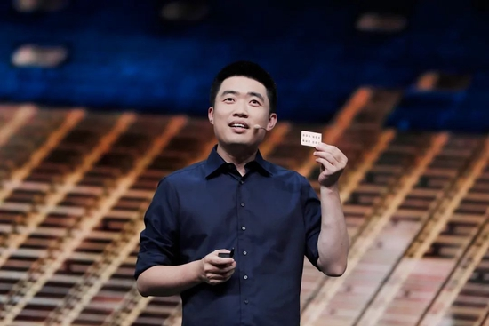

　　蔚来像海底捞，理想更喜欢星巴克

　　《中国企业家》：现在仍有很多人认为增程式路线是阶段性、过渡性的产物，当你自己也要做纯电车型的时候，你怎么看待这种评价？

　　李想：我觉得还是要解决行业最大的问题，我们如果能够解决行业的问题，我们就会成为行业的领先者，我们如果能解决竞争的问题，我们就能在竞争中能获胜。行业最大的问题跟我最开始的判断一样，一直没有变过，一个是充电问题，一个是电池成本问题。

　　充电问题中最致命的原因是充电速度慢，而不是续航里程短，充电速度慢所带来的一系列后果是用户的体验极差，其次是商业模式跑不通，不具备商业可循环性。这里边要解决的问题是，如果速度快了以后，它就会无限接近于燃油车的体验，我一直在等800V时代的到来，相当于从2G变成4G，另外如果十分钟可以充一辆车，翻台率高六倍，就有无数人进入这个行业投资了，因为他有钱可赚。所以这背后是技术代际的变化。

　　另外一个是电池成本的差异，核心是怎么能够在有效的公里数下，用更少的电池成本。

　　为什么要解决这些重大问题，就是为了能够大规模替代燃油车。增程首先符合这个需求，高压纯电也符合这个需求，所以我们从来没有停止过对高压纯电的研发。

　　《中国企业家》：你是一种倒果为因的思考方式，并不是基于对增程或某一种模式的执着，而是最终要解决用户的根本问题。

　　李想：相反我们自己内心认为，今天这种充电速度很慢、400V的纯电动车才是过渡期最短的，很快就会被过渡掉了。

　　《中国企业家》：现在对供应链的思考是什么样的？垂直供应链要做多深？

　　李想：我们把供应链分成四个模块。第一个模块是传统汽车和新能源汽车没什么差别的地方，比如座椅、后视镜等等，选择和成熟的供应商合作，不自建工厂。第二个模块跟芯片、计算单元相关，选择和芯片厂商合作，自己研发，也不会自建工厂。第三个模块是电池，同样选择与供应链合作伙伴共同设计和开发电池组，但不碰电芯。第四个模块是通过自建的方式解决，比如我们的苏州的碳化硅厂、常州的驱动电机厂、绵阳的增程器厂。

　　这不包括电池，因为我们觉得电池行业未来会是个规模市场，规模越大，效率越高。

　　我们做哪些、不做哪些的时候有两个判断，一个是说我必须做，我不做，没人给我做，另外一个是如果我自己越封闭，效率越高，我就自己来做，如果越开放，效率越高，我就交给别人做。

　　《中国企业家》：谈谈你对用户运营的思考吧，蔚小理三家在用户运营方面都有非常鲜明的特征。

　　李想：我觉得还是跟企业自身的价值观、团队的生活经历息息相关。比如李斌如果约我吃饭、聊天，去的地方基本上都跟NIO House差不多。我就会选择星巴克，给你提供专业的咖啡，剩下的是自助服务。我们认为理想更像星巴克，就是我做到差不多就可以了，但是能保证你足够的快捷方便，效率够高，剩下的你自己解决问题。

　　所以你看我们建店的方式，包括装修成本，大店是参考星巴克臻选，普通的店是参考普通的星巴克。

　　《中国企业家》：你这个比喻特别好，这两种方式都对，李斌可能更注重仪式感。

　　李想：（蔚来是）汽车界的海底捞，但是我们喜欢星巴克，而且还从星巴克招了不少人，主要是跟服务体系相关。

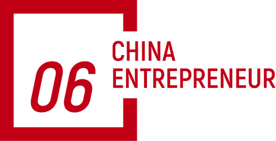

　　我从来不相信以少胜多

　　《中国企业家》：在几个关键时间我们都有过交流，我感觉你个人的变化还是很大的，因为有时候一个人杀死过去的自己是一件特别难的事，我在你身上看到了你的迭代。你觉得做一个10亿美元估值的公司CEO，和做一个50亿美元估值的CEO，一个100亿美元估值的CEO，对你个人的要求有什么不一样？

　　李想：还是认知。在面对同样的困难时，我们跟困难的关系其实就三种，一种是被困难压在底下，生不如死，痛不欲生，一种是跟困难面对面相互博弈，还有一种是站在上边去看这个困难，把困难当成一种游戏，当成一个项目去解决。这三种关系其实都是由认知决定的，认知低的时候你就被问题压在下面，认知再高一点的时候，你跟问题面对面互相博弈，认知高的时候，你会发现不就是个问题吗，我们去解决就好了。而且随着规模的扩大，你面对的问题的难度和挑战也是不一样的。

　　《中国企业家》：你一直在说认知，如果再往前走，迈到千亿美元规模之后，你觉得对你认知上的挑战是什么？

　　李想：我觉得始终都没变过，其实就是三层。

　　一层是哲学层面，就是企业的使命、愿景、价值观，回答“我是谁”“我要到哪里去”。

　　中间层是跟行业相关的，一个是支撑业务的体系，一个是支撑组织的体系，这里面我最怕的是我不知道自己不知道，所以始终在跟这件事抗衡，怎么用更多的“外脑”咨询公司，在工具里确保每个人都能感知到。

　　到了底层，我认为任何企业都有一个底线，我的两个底线一个是实事求是，所以我们非常在意数据，因为这些东西不骗人，我不希望给我讲故事，不要给我做PPT，也不要做Excel表，我就看真实的东西，拿系统里的数据来看。第二个其实是包容协作，我们不能自己什么都干了。我们要有越来越强的高层团队，合作伙伴也要变得越来越强。我们一旦封闭，就死了。

　　《中国企业家》：造车对你的改变是什么？

　　李想：造车对我有三个重要的改变。

　　第一，当你发现各种各样的问题层出不穷的时候，你真的要去思考一些哲学层面的问题。它最大的好处是帮你跳出来看待这些问题。否则你会很痛苦，痛不欲生，因为太复杂，太痛苦了，问题层出不穷。后来你发现这些东西都不是针对你的，它是给所有人出的相同的题。

　　第二，是如何面对复杂。如果你没有特别好的方法，复杂也同样会变成你的痛苦，当你能看到全世界各种各样先进工具、先进管理方式的时候，其实你看到的不是复杂，而是丰富。如何把复杂变成丰富，这些全世界最厉害的企业、最厉害的组织是怎么做的，我觉得这是我学到的。

　　第三，是对规模的认识。我们原来老说微软、苹果、华为为什么搞那么复杂，后来发现这个事只跟规模相关。因为每一个人能驱动的规模是有限的，你可以比别人高10倍，但你高不了100倍。所以为什么这些企业要搞复杂的流程，因为流程是解决底线的，没有底线，就会混乱。

　　《中国企业家》：对你来说，2019年和2022年哪年更难？

　　李想：2019年更难，血都快断掉了。2019年王兴投完以后跟我们讲的第一句话就是，你应该提前投资供应链，当时我也明白他说的道理，但为什么没做？这点钱只够活下去，根本不够投，人穷志短。后来为什么决定要投了，融完资以后，账上有几百亿了。现在我们为什么能变革，第一是企业在健康发展，第二其实还是有钱。

　　《中国企业家》：所以大家都说三家造车新势力中，理想的成本管理是最极致的，甚至用“抠门”来形容你们。

　　李想：我们没有大家想的那么复杂，核心其实是集中资源，利出一孔。战略的核心就是取舍，我从来不相信以少胜多，但是我在每一场仗上，投入都比别人多。

　　《中国企业家》：看来王兴对你的影响也很大？

　　李想：第一是给我们“供血”，而且是雪中送炭，这个肯定是一辈子的恩了。第二是王兴很多时候从认知层面给了我很多启发，我觉得这是他给我的两个最大的帮助。

　　《中国企业家》：现在很少看到创始人在社交平台上如此活跃，相对来说你是发言比较多的，当然也会有很多人批评你。给我的感受是，如果有人批评理想产品不好，一定是触了你的逆鳞。你会有意识到自己要做些改变吗？

　　李想：我还是会努力让自己去改变的，希望既能表达自己的观点，又不给他们（公关部）带来太多麻烦。

　　我生气其实是有两个底线问题。第一个是因为否定了我们的价值观，而且又是非事实的，这个我会忍不住，因为我要捍卫我们的价值观的底线。第二个底线是，你不要对我的组织进行造谣，因为组织也是我们的产品。组织是对内的产品，业务是对外的产品，我觉得这两个是要坚决捍卫的，否则大家就会把造谣变成习惯，这是不允许的。

　　《中国企业家》：最后评价一下李斌和何小鹏？

　　李想：我们三个人的追求其实是不一样的。

　　我觉得李斌的特点是想构建一个宏大的理念，并且通过企业的运营去验证。这些特点跟他学的专业、这一生的经历相关，而且他能言行一致地做这些事情，他的团队真正相信这些东西。

　　小鹏最大的核心是技术，不论是语音还是自动驾驶，小鹏都是最早投入的，而且很坚定，他是想通过技术来验证这个世界。

　　我觉得理想是我个人的映射。我活着是为了掌控自己的命运，挑战成长的极限。成长和挑战是关键，所以我一定会选择最大的行业、难度最大的领域来做，并拿结果来验证。

　　在这个过程中，相比他们两个，我觉得我的目标感更强，因为目标是成长的一个验证，也不会给自己设立什么上限。所以，至少在这个阶段，三个企业反映的都是以创始人个人为主的思考和投射。
