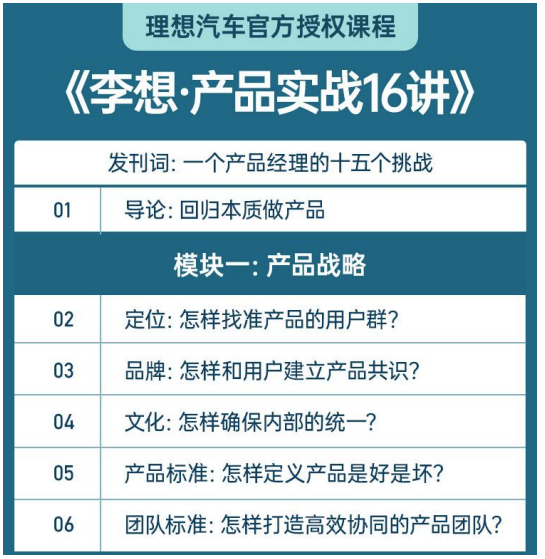
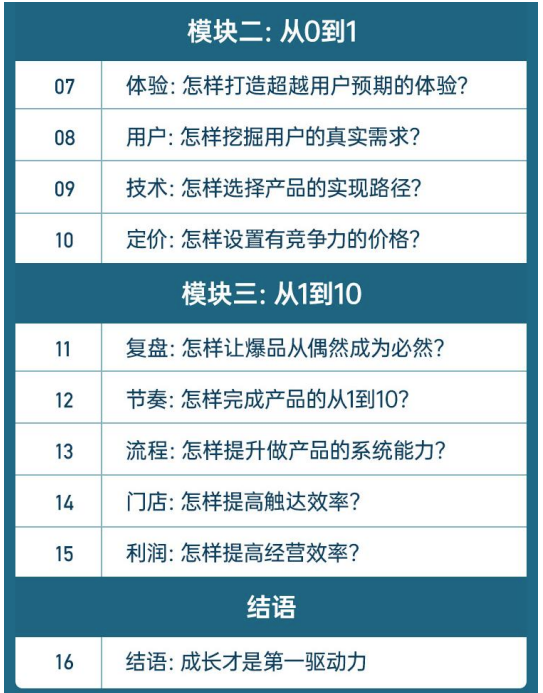

# **发刊词 | 一个产品经理的十五个挑战&#x20;**

你好，欢迎来到《李想·产品实战 16 讲》，我是理想汽车的创始人李想。这次，应得到 CEO 脱不花的邀请，来跟得到同学们，分享一些打造产品的经验。&#x20;

我从高中毕业，就开始创业做产品。到现在，已经做了两款线上产品：泡泡网和汽车之家；一款实体产品：理想汽车。这十几年来，也算积累了一些经验。但要做一次系统的分享，说实话，我还是有点犹豫的。&#x20;

**差异和坚持&#x20;**

因为做产品，我们确实有一些想法和坚持，但这些坚持，未必能获得多数人的理解。也正是因为这个原因，这几年，我们的产品，一直处于争议的风口浪尖上：&#x20;

从 2015 年创立开始，理想汽车就被嘲讽为“PPT 造车、只会说，不会干”。 因为大家觉得线上产品和实体产品，完全是不同的赛道，对一个产品团队来说，这个转型，是巨大的挑战。 而我们的产品定位，也和别人不同。我们选择的目标用户群，是家庭用户。&#x20;

很多人会质疑，这么窄的用户群，有前途吗？&#x20;

2016 年，在产品核心技术上，我们选择了油电混合动力中最冷门的增程电动技术。这个选择出来，不理解的人就更多了。&#x20;

投资人不能理解：这条路以前没有人跑通过。有投资人明确告诉我，只要你们做纯电，我们马上投资，如果选择做增程，就爱莫能助了。

团队也不理解：2018 年，理想汽车面临着资金链条的断裂，公司都快黄了， 为什么还要跟投资人反着来？更何况，增程的研发难度是更大的。&#x20;

普通群众就更不理解了，到现在，你还能看到很多嘲讽声，说“理想汽车选择的是被淘汰的技术”。 但这还没完。在产品设计上，我们也有自己的想法，比如我们做了从来没有人做过的四屏交互、六座 SUV、车载冰箱等等。这也引来了一些人的调侃， 说理想汽车卖的那是汽车吗？卖的是冰箱彩电大沙发。&#x20;

所以，当智能电动车的竞争还处在激烈的淘汰赛中，理想汽车自身也在不断迭代，不断成长，一些阶段性的经验，适不适合现在就拿出来和大家分享呢？&#x20;

后来，得到团队说服了我。他们告诉我，邀请我来分享，不是因为理想汽车现在的成绩，他们看中的是，理想汽车这一路走过来的挑战。这些挑战，更广大的产品经理们可能也正在经历，那理想汽车的阶段性经验，就能够帮助那些正在面临同样问题的人。&#x20;

**难题和挑战&#x20;**

确实，这些年，我们大大小小的仗打下来，至少面对过 15 个挑战：

&#x20;第一个挑战，在上百家竞争对手都涌入这个赛道的时候，资源条件一般的我们，**怎么挤进这个市场？&#x20;**

第二个挑战，作为一个后来者，**怎么做产品品牌定位**，能让用户在筛选的时候，迅速识别出我们？&#x20;

第三个挑战，好产品依托于好团队，但团队成员背景不同、工作理念不同， 甚至还有鄙视链，比如，豪华车品牌出来的看不上做自主品牌的，作为产品经理，**我们怎么跟不同背景的人对齐自己的产品理念？&#x20;**

跟团队对齐产品理念后，第四个挑战来了，大家对于好产品的理解也有不同， 有的人觉得做 A 功能好，有的人觉得做 B 功能好，**怎么把理念翻译成产品标准，让大家都能在同一个方向使劲？&#x20;**

有了产品标准，第五个挑战，**怎么根据这个标准来选择和培养相匹配的团队？** 大家都说，理想汽车是招 70 分的人，干 100 分的事，给 80 分的钱，那么， 我们到底是怎么做的？&#x20;

第六个挑战，一个复杂的汽车产品，研发周期动辄好几年，你今天在办公室画的草图，在三年、五年后才能实现，那**怎么设计，能比对手领先半步，给用户超预期的体验？&#x20;**

当然，我们也可以找用户做调研，那第七个挑战就来了，你能调研到的用户总是有限的，**怎么判断一个需求能不能代表大多数？怎么验证一个需求是不是“真需求”？**&#x20;

第八个挑战，汽车上有成千上万个零件，就意味着成千上万个选择，要设计产品的发展路径，考虑产品的未来，还得兼顾现实的生存压力、资源条件，**&#x20;怎么取舍？&#x20;**

第九个挑战，做产品，不能只想着生产，还得考虑商业化，一个高成本的产品怎么实现盈利？竞争一天比一天激烈，但我们出牌的机会只有一次，价格定高了卖不出去，定低了利润太薄，**怎么找到相对平衡的定价区间？&#x20;**

第十个挑战，做出一个爆品之后，别说竞争对手，我们自己也会担心这是不是个偶然，**怎么做好复盘、正确归因，让团队有能力持续打造爆品，从偶然变成必然？&#x20;**

这是从 0 到 1 和从 1 到 10 的关键转折点，跨过这一点，第十一个挑战，当我们面对一个全新的阶段，**怎么做出差异化的产品矩阵，规划好不同阶段的发展节奏？&#x20;**

第十二个挑战，产品线多了，团队规模也大了，**怎么升级流程，让两万多人的团队，还能够高效率地创造价值？&#x20;**

第十三个挑战，产品最后一道关，就是在门店跟用户见面，怎么在这“最后一公里”，**提高触达效率和用户的交付体验？&#x20;**

第十四个挑战，就是来看产品商业化的最终结果，利润。要知道，所有的硬件产品，背后都意味着巨额的前期研发和硬件成本，**怎么提高经营效率，**&#x6324;出利润，让公司不至于被巨额的前期投资所拖死？&#x20;

最后，第十五个挑战，**做产品也是一个无限游戏，怎么让成长成为团队始终的驱动力？&#x20;**

**分享和学习&#x20;**

一口气说了这么多，但这些确实都是我们一路走来，真实遇到过的问题，甚至，当时的同事们每隔两周就觉得，公司快倒闭了。但所幸，我们都扛了过来，走过了从 0 到 1，并进入了从 1 到 10 的阶段。&#x20;

我们的第一款产品理想 ONE，是造车新势力中首个单车销量突破 20 万辆的产品。我们的 L 系列车型，截至 2023 年 8 月，销量也突破了 20 万&#x8F86;**，**&#x7406;想汽车有幸成为 30 万级别的豪华品牌车型中，第一个月销突破 3 万辆的中国&#x20;

汽车品牌。而在此之前，这些都是宝马、奔驰、奥迪这些外国品牌长期占据的市场。**&#x20;**

得到团队说，虽然现在还没有走到终局，但创业做产品，大家都在摸黑走夜路，这是一条没有尽头的夜路，根本不存在完全成功的经验，无非是，先行者用走过的脚印，来帮助后来者。&#x20;

这一点，我非常认同。在我们困难的时候，我们也向外学习了很多经验。这里面，既包括各领域的前辈、先行者，也包括同行、对手。这些经验，帮助理想汽车走到了今天。那我们摸索出来的阶段性经验，也应该拿出来跟大家分享。&#x20;

于是，我们决定答应得到的邀请，来到这里跟你、跟你们，分享我们这 8 年来的经验，也说说，那些特立独行的选择背后，我们自己的思考和教训。&#x20;

所以，在这门课程里，我们会毫无保留地跟你分享，理想汽车从 0 到 1 打造产品，再从 1 到 10 复制爆款产品的过程中，我们遇到的 15 个挑战。借这个 机会，我们自己也第一次系统总结了一遍，这些年来我们打造产品的方法论。&#x20;

这套产品方法论有什么不一样呢？我自己总结，主要是两点：&#x20;

第一，在这门课程里，你会发现，我会花大量篇幅强调一个最基础的问题： 目标用户是谁，产品提供给目标用户的价值是什么？紧盯目标用户，这是我们理想汽车最受益的一个方法。在课程里，我会详细跟你分享，扎实做好基&#x20;

础，在后面整个产品打造链条上，会有多深远的影响和好处。&#x20;

第二，在这门课里，我还会花时间跟你讲打造团队的方法、商业化的方法。 因为团队这一点，我是吃过亏的。在我做泡泡网的时候，曾经面临过一天之 内，团队大半人集体辞职的情况。所以我得到了一个深刻教训：**要想做好产&#x20;**

**品，必须要依托于一个相互信任的好团队。&#x20;**&#x505A;产品和炼组织，就像是在画两个圈，如果一个圈画得很大，而另外一个圈 很小，就会产生巨大的浪费。所以，我们想尽一切办法，把两个圈画得差不多大，来保证整体的效率和价值的输出。 而商业化就更不用说了，产品不是作品，它最终是要消费者用真金白银来买单的。所以我们也会跟你分享，我们怎么从一开始就思考好商业化的目标， 并一点点通过组织的力量去实现它。 但是，我们也必须先请你了解，我们的经验，没有什么新奇的招数，总结下来，都是常识，都是最朴素的东西。 只不过，唯一的不同是，作为产品经理，我相信常识的力量，我们也有一个敢于坚持常识，敢于结硬寨、打呆仗的团队。&#x20;

但总的来说，我会坦诚地分享我们的成功经验和失败教训，也期待你的反馈和交流。更欢迎你把这门课程，分享给更多的产品经理，和更多靠产品驱动公司成长的创业者。&#x20;

当然了，如果你也因此了解了我们，愿意成为我们的车主，我们肯定非常欢迎。但我更希望，能因此认识更多好产品、更多做产品的人。所以，如果你发现了其他好产品，请告诉我，让我能有机会向他们好好学习。这门课，算是我先干为敬，希望能听到更多产品人的分享。&#x20;

我是李想，咱们课程里见。

