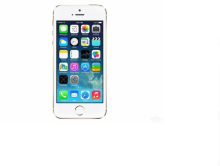
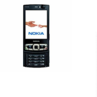
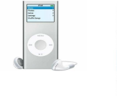
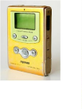
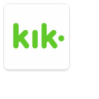
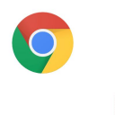
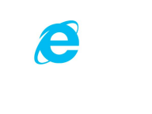

# 前言

一、成功和失败的产品

一般来说在一个领域里一款产品的成功对应着无数产品的失败，根据老王个人的经验，成功和失败的比例大约是1:30，失败的原因多种多样，有些啥都没做对，有些作对了一部分，这里列举的失败案例主要讲做对了一部分的，准确说算是“成功的失败”。

1\. iPhone vs. 诺基亚

现在的诺基亚手机业务没了，只有通信业务了。2000年左右诺基亚是手机行业里最牛的品牌，直到2007年iPhone登场。

2\. iPod vs. MPMan

MPMan是韩国公司生产的全球第一款MP3播放器，iPod并不是行业首创，甚至比国内的爱国者MP3播放器都还晚些，事实上今天大多的成功案例都不是行业内的第一款产品。

3\. 微信 vs. Kik

微信是模仿Kik的，甚至不是第一个模仿Kik的，前面还有米聊、TalkBox等产品，但是微信是最成功的。

4\. 搜狗输入法 vs. 智能ABC

智能ABC在没有搜狗输入法的时代是比较好用非常主流的，但有了搜狗输入法之后大家觉得智能ABC太不好用了。

5\. Chrome vs. IE

IE和前面的案例比并没有那么失败，毕竟仍然还有很大使用量。但这个案例比较特殊，在Chrome开始做的时候，主流操作系统是Windows，IE是Windows自带的浏览器，所以Chrome要打败IE是非常非常难的，因为需要用户主动下载Chrome，考虑这个因素，Chrome是非常成功的。

几乎在每一个大行业里，最终取得成功的通常都不是第一家。Google也不是第一个，甚至当时有业内人士认为Google的创始人没有搞清楚行业情况，他们认为搜索引擎这个行业格局已定；Tesla也不是第一个做电动车的，第一辆电动车应该在100多年前就有了。不是第一个这说明技术可能已经不是瓶颈了，而真正关键的原因是产品经理（笑）。

