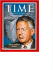

二、成功的产品经理

1\. Neil McElroy（经济学专业）

Neil是人类历史上第一个产品经理，他是宝洁的，原来是做品牌做广告的，但觉得宝洁的运营有很大改进空间，所以他提出应该设立一个岗位对产品的成败负责任，推动设立了产品经理这个职位，后来他就成为了宝洁的总裁，还做过美国国防部部长。

2\. 乔布斯

&#x20;

大家对乔布斯最耳熟能详的成功产品是iPhone，但他和沃兹第一个搞出了个人电脑PC。在此之前，电脑是给军队和企业用的，最强的电脑公司是IBM，所以当时的电脑非常贵，乔布斯和沃兹觉得电脑非常好但是买不起，于是他们两个自己搞出来了，沃兹负责开发，乔布斯负责销售，Apple II大获成功，图形化界面是他们率先普及的。

被苹果赶走后乔布斯投资了Pixar，做动画片《玩具总动员》那个，因为乔布斯认为Pixar做的事情非常有前途，所以不断投钱成为了Pixar的老板，Pixar后来被迪士尼收购了。后来Apple收购了乔布斯的NeXT，他回到苹果，把苹果死马当活马医，当时PC行业最强的是Dell，有人让Dell的老板给乔布斯一个建议，Dell的老板给的建议是把苹果解散把钱还给股东。乔布斯在他整个人生里都是非常有创新力的人（Elon Musk有可能会超越他，乔布斯可惜英年早逝了）。

3\. 张小龙

张小龙的第一款产品是Foxmail，第二款产品是QQMail，第三款产品是微信。当然现在微信已经不能算是一款产品了，现在微信里有微信支付、二维码扫描等各种各样的功能，是多种不同产品功能的融合，且融合得非常好。张小龙现在是国内的产品大神，强档推荐龙神的分享每隔一段时间读一遍。按照惯例现在应该讲搜狗输入法的产品经理（马占凯），但由于人在现场，就不讲了,以免他太骄傲

4\. Pichai

这个人没有乔布斯那么多成功的产品经历，但他有一个很特殊的地方。乔布斯虽然做工程师水平一般般，但毕竟是会技术的，张小龙更是工程师出身，Foxmail就是他自己写的，而Pichai是学冶金工程的。浏览器相当于是一个小型操作系统，所以浏览器是非常有技术含量的，所以Pichai做成了Chrome是非常有意义的一件事。Pichai现在是Google的CEO，Google是一家搜索引擎为主的公司，他们还有很多其他的优秀产品，比如他们有安卓、Youtube、Google Map，所以按常规来说，创始人退休应该从搜索引擎业务线里选一个人做CEO，但选了Pichai这个Chrome业务线且不懂技术的人，所以Pichai能成为CEO是一件非常牛的事。

