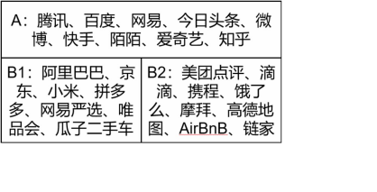
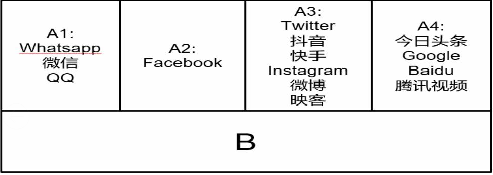

二、分类经营

龙神说分类就是设计。如果我们对中国的互联网行业只砍一刀做分类，那么可以把公司分成供给和履约在线上的和供给和履约在线下的。

供给和履约在线下的可以分成以SKU为核心的生意和以Location为中心的生意。（此处略过，详见老王2017年的分享《王慧文：互联网有AB面，最惨烈战争发生在B2》）

两类生意的基建不同，淘宝的基建包括物流和支付，而服务业和电商完全不同的基建是地图，外卖、单车、打车、点评都对地图的要求很高（因此定位时长就很重要）。

商品零售这个行业里供应商是有规模效应的，淘宝和京东的供应商都是规模化生产的，而服务业的供应商比如配送员、滴滴的司机都是没有规模效应的，物是生产出来的，人有反规模效应。在面临巨量订单的时候，淘宝上商家的成本是下降的，因为可以大批量生产且库存周转快，而巨量订单下服务业的边际成本是更高的，且时效性要求很高，消费者没法攒着一起消费，这导致经营逻辑发生根本变化，生产经营逻辑变成了削峰填谷。

招商也不同，淘宝是全国招商，所以招商的时候备选的供应商有很多，决定了不需要在招商这件事上花太多精力，而美团的业务一个地方的商家只能服务一个地方的消费者，所以每个地方的商家都要做地推，要求相应的组织能力做地推，所以淘宝招商在杭州（纯线上），美团的招商团队在全国。

前面讲的是B面的分类，线上是根据信息的可见度分成A1（微信WhatsApp、Line）、A2（Facebook）、A3（Twitter、微博、抖音、快手、Ins）、A4（今日头条、Google、百度、腾讯视频）四个类别。微信里互发消息，有没有特定的好友，别人是看不到的；Facebook里的好友别人是看得到的；Twitter发一条消息，所有人都能看到，但只有关注的人才会优先看到；而Google和今日头条里的信息所有人都能看到。如果一个产品集成了不同信息可见度的功能的话，消费者的区分难度是很大的，比如说微博刚出现的时候有人在微博的公域里和其年轻女性朋友聊天，所以如果我们把微信和微博的功能做到同一个产品里，就会有用户出现混淆，这对用户的体验是非常致命的。

这件事上做得最好的是Facebook，他们的Facebook、WhatsApp、Instagram是分开的，只有最后一个没搞定，最后一个都在Google手里。所以微信做的再好也不影响微博的生存，双方的信息可见度不一样，微博有2亿DAU。

不同信息可见度的产品的核心方法有区别。张小龙做产品的方法和今日头条的方法差别巨大，张小龙说做产品要用心，字节跳动是全数据驱动的，谁数据好谁跑出来。所以时至今日腾讯还没做好信息流和短视频，当然字节跳动搞个飞聊也完全没有进展。因为核心产品方法有根本差异，用最简化的方法描述他们的差异在于A1A2主要靠用心，A3A4主要靠算法，腾讯长期靠人脑而不是靠机器导致他们在机器学习上的算法不够强，尤其是把搜索业务卖给搜狗之后，但不是他们算法不行，而是他们应用算法的能力不够强。

这就涉及到哪些产品能做到一个APP上，哪些不能。淘宝和支付宝流量虽然大，把饿了么放上去效果也并不明显；腾讯微信和朋友圈有这么大的流量，微博还能蓬勃发展。这也是为什么美团可以在一个APP上集成那么多东西，因为大都在B2。抖音和今日头条是分开的APP，他们并没有因为今日头条的流量很大而把抖音集成到今日头条里去。这些和分类有关，这些分类涉及到了核心能力、资源配置、消费者心智、组织能力。

Q\&A环节

1\. 中国腰部企业少，头尾企业多的情况是不是不健康？

目前看还是挺健康的，美国有美国的特色，中国有中国的特色，只要经济政治制度互相匹配不错位，就是健康的。

2\. 交叉学科的Synergy问题

查理芒格的思维理论和乔布斯的思想“学习很多领域最前沿的成果”有相似之处，不同学科之间的碰撞有时候会产生奇妙的结果，因为查理芒格不太做科技业的投资，所以不太需要最前沿的成果，只学习最经典的理论就可以了，而乔布斯在创新最前沿，所以要学习最前沿的成果。贝索斯是科技业的巴菲特，他把巴菲特的资本理论用在了科技业，Bezos是管理领域的集大成者，各个方向的管理理论他都很好地应用在了亚马逊的管理里。

3\. 美团为什么不做小程序

美团有微信里的小程序，也有公司内部用的小程序，但像微信一样把小程序做成一个生态，别人在生态里开发小程序，这种没有做的原因是在互联网行业里和在平台公司里江湖地位没达到，用户量不够。

