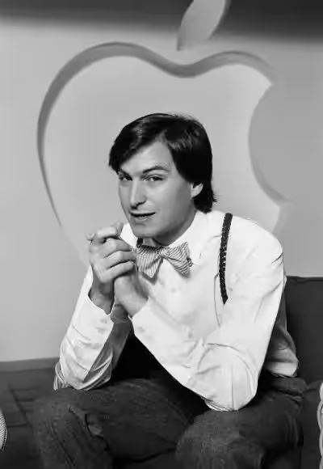
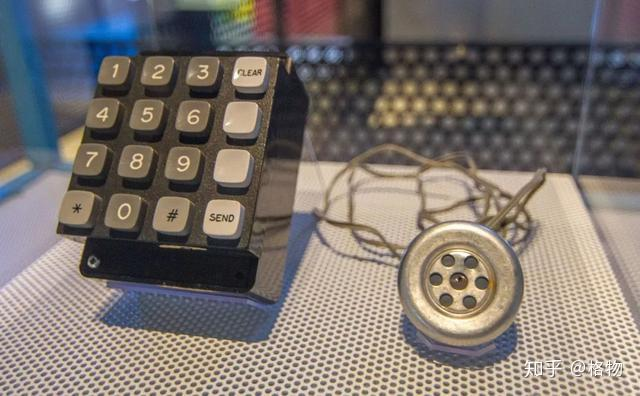

《花花公子》拍摄的1985年乔布斯

这篇采访全程高能，展示了三十多年前苹果这家伟大公司成长初期引人入胜的往事。

1985年的乔布斯只有29岁，但是已经被称为了计算机革命之父，身家曾一度高达5亿美元——1984年的5亿美元。

《花花公子》的记者在这篇采访中，谈及了以下问题：

-乔布斯的财富和财富观
-计算机普及的可能性
-Macintosh计算机的开发以及新特性，包括鼠标的应用是否比键盘更高效等
-苹果公司的危机
-Lisa和Apple III产品的失败
-乔布斯所面临的权力斗争
-乔布斯对苹果公司的愿景和价值观的解读
-苹果与IBM的市场与路线之争
-乔布斯的童年与硅谷，以及在惠普打暑期工
-与苹果联合创始人沃兹尼亚克的相识以及恶作剧
-第一份工作
-在印度的经历
-最初的苹果电脑Apple I是怎么造出来的
-苹果计算机业务的起步和腾飞
-当时计算机市场的主要竞争者
-对日本公司的看法（在80年代日本电子行业如日中天的情况下判断了他们的失败命运，35年后事 实证明了他的惊人判断）
-苹果计算机的教育市场
-乔布斯及同代人改变世界的初心与选择经商或从政的探讨
-乔布斯眼中的美国社会危机
-苹果电脑被军方用于核武器控制
-对技术未来的展望（很多今天已经实现了并正应用于我们的生活之中）
-对人生的未来展望（乔布斯展现了超越年龄的洒脱以及禅意）
-乔布斯的财富以及财富观
-对技术未来的展望

知名的《花花公子》杂志的记者，在1984年对计算机的家用普及可能性还有很大的疑问。就连乔布斯谈到通信网络，也只想到了美国范围内的互联。

50后的乔布斯，深受60年代美国的思潮影响，充满理想主义的浪漫。相比之下，今天的人们把钱看得比什么都重要。滑稽的是，正是把钱看得很轻的乔布斯创造了闪耀着理想主义光芒的苹果产品设计，以及市值上万亿的公司。

从采访中我们可以看得，29岁的乔布斯思考的是能源革命和信息革命对世界的影响。他认为信息革命给世界带来的是自由的能源——人类智力的能源——这令石化能源革命对世界的影响相形见绌。苹果当时处在了这个革命的前沿，然而20年之后iPhone又再次深刻改变了世界。

成长初期，苹果经历了挫折。采访中记者对了Lisa和Apple III的失败向乔布斯发问，而乔布斯则做了正面回答。

然而1985年的乔布斯，尽管是公司的股东和创始人，但是却面临着内部来自管理层的权力斗争。
《花花公子》杂志的记者的提问始终都很犀利，看得出有些问题是有备而来的，而有些问题则是随机提起的。引用一位长者的话，确实比国内 的记者“高到不知道哪里去了”。

《花花公子》：我们挺过了1984年，尽管有的人可能觉得难以置信，但计算机并没有占领世界。如果要为计算机的普及而指责或者赞扬某个人，你这位29岁的计算机革命之父是有力的竞争者。这也令你富有到做梦也想不到的程度——你的股票曾一度价值5亿美元，对吧？

乔布斯：股票下跌的时候实际上我一年之内损失了2.5亿美元。\[笑]

《花花公子》：你能对此一笑置之？

乔布斯：我不会让件事这毁了我的生活。这不是有点滑稽吗？你知道，我对钱这回事儿的反应是它很可笑，所有对它的关注（很可笑），因为过去十年来它并非发生在我身上的最有内涵或最有价值的事情。但是它令我感到自己老了，有些时候，当我在校园演讲时，我发现学生们最敬畏的是我是个百万富翁这件事。

我上学的时候，正是六十年代刚结束而这股务实目的性风潮兴起之前。如今的学生们压根不用理想主义方式来思考，或者至少可以说远不及此。他们肯定不会让当代的哲学问题占用他们太多的时间，因为他们要学习自己的商业课程。然而，六十年代的理想主义风潮仍然在我们心中，而且大多数我认识的同龄人心里都永远铭刻着它。

《花花公子》：有意思的是计算机领域里出的富豪都是——

乔布斯：是年轻的疯子，我知道。

《花花公子》：我们本来想说的是像你和史蒂夫·沃兹尼亚克这样的人，10年前还在车库里工作着。你们两个人看起来发动的这个革命到底是什么呢？

乔布斯：我们生活在100年前的石化革命之后。石化革命为我们提供了自由的能源——具体说是自由机械能。它以很多方式改变了社会的性质。这个革命，信息革命，也是一种自由能源的革命，但是属于另一种：自由的智力能源。它现在还很不成熟，然而我们的Mac计算机运行所需能量比100瓦灯泡还小，并且能给你每天节省数小时。10年后它将会能够做到什么？20年后，50年后呢？这个革命会令石化革命相形见绌。我们处在前沿。

《花花公子》：或许我们可以暂停一下，让你给计算机下个定义。他们是如何工作的？

乔布斯：计算机其实挺简单的。我们在这里坐在咖啡厅的长凳上（对于这部分采访来说）。让我们假设你仅理解最基本的命令，而你问怎样找到卫生间。我会需要以十分具体和精确的指令来对你描述。我可以说，“离开长凳斜向快走两米。直立。提起左脚。弯曲左膝至水平。伸左脚向前移动重心300cm...”等等。如果你可以比这个咖啡厅里任何人都快100倍的速度解读所有这些指令，你会开起来像个魔术师：你可以跑过去拿一杯奶昔回来放桌上，打个响指，而我则认为你变出来的这杯奶昔，因为这对于我的认知来说太快了。那正是计算机所做的事情。它获取很简单很简单的指令——“获取一个数字，与这个数字相加，将结果放在这里，对其是比另一个数字大进行认知”——但以比如每秒1百万次的速度执行这些指令。以每秒1百万次的速度，结果看起来就很神奇。

这是个简单的解释，关键是人们真的不需要去理解计算机如何运行。大多数人对自动变速箱怎么工作没有概念，然而他们知到怎么开车。你不需要去学物理搞明白了运动定律后再去开车。你不需要理解任这种东西就可以使用Mac电脑——不过你问了。（笑）

《花花公子》：很显然，你相信计算机将会改变我们的个人生活，但是你如何去说服一个持怀疑态度的人？或者一个抵制者？

乔布斯：计算机是我们所见过的最难以置信的工具。它可以是写作的工具，通讯的中心，超级计算器，规划工具，文件管理器，还可以是艺术工具，集这些于一身，只要给它新的指令或软件来运行就可以。没有什么其它工具有计算机这样强大和多功能性。我们不知道它还能走多远。现在，计算机令我们的生活更容易。它们在不到一秒的时间里可以帮我们做完要花上数小时的工作。它们提高生活的质量，有的是仅通过将苦差事自动化，而有些则是通过拓展可能性。随着事情的进步，它们将为我们做得越来越多。

《花花公子》：那么今天要去买一台计算机的实在理由呢？你们行业的一位高管最近说过，“我们给人们提供了计算机，但是还没有展示给他们要用计算机来干些什么。我可以手动核对支票簿，来得比用计算机更快。”为什么人们要去买一台计算机呢？

乔布斯：对不同的人答案不同。商业上来说，问题很容易回答：你真的可以更快地准备文档且质量水平更高，而且你可以做很多事情来提高办公室效率。计算机令人们从低级工作中解放出来。除此之外，你给了他们一个鼓励创新的工具。不要忘了，计算机是工具。工具令我们更好的工作。

在教育上，计算机是自书籍以来首个会坐在那里与你无休止地互动而不评判你的事物。问答式教学不复存在了，而计算机在与名师结合下使用，则有潜力成为教学过程中的真正突破。大多数学校里已经有我们的产品了。

《花花公子》：这是计算机在商业和教育上的论点，但是在家庭中又如何呢？

乔布斯：目前为止，那更是一个概念市场而非真正的市场。目前给家里买电脑的主要原因是你想在家工作或者为自己或孩子来运行教育软件。如果你没有理由为这两点买电脑，唯一一个另外的理由是你想成为一个懂计算机的人。你知道有些事情在发生，但你不知道具体是什么，所以你想要了解。这将会改变：计算机将成为大多数家庭里的必需品。

《花花公子》：什么会改变？

乔布斯：人们为家庭购买电脑最强有力的理由将会是将其连接至全国范围的通信网络。我们正处在一个对大多数人来说是真正举世瞩目的突破的开始阶段——像电话一样举世瞩目。

《花花公子》：具体来说，你所提到的突破是怎么样的？

乔布斯：我只能开始猜测。这在我们行业内很常见：你不知道到底结果会如何，但是你知道这是极大和极好的事情。

《花花公子》：那么，目前而言，你不是在要求家庭计算机购买者为本质上的信念行为投资3000美元吗？

乔布斯：在未来，这将不会是一个信念行为。我们所面对的困难之处在于人们问你具体的情况而你没法告诉他们。一百年前，如果有人问亚历山大·格雷汉姆·贝尔，“你用电话能做些什么事？”，他应该不能够告诉此人电话影响世界的形式。他不知道人们会打电话询问当晚上映的电影或者订购日用品或者打电话给世界另一头的亲戚。但是别忘了第一个公共电报始于1844年。那是通讯的惊人突破。你实际上可以在一个下午的时间里从纽约发消息到旧金山。人们还谈及在美国为每个办公桌上都配一个电报机来提高生产力。但是这无法实现。它要求人们学习这整套奇怪的咒语的顺序——莫尔斯电码，点和线，来使用电报。大概需要40个小时才能学会它。大多数人永远都不会愿意去学它。所以，幸运的是在19世纪70年代，贝尔申请了电话的专利。它基本上实现了与电报相同的功能，但人们已经知道怎么使用它了。并且，它最妙的地方在于除了使你可以以词语通信之外，还令你可以歌唱。

《花花公子》：此话怎讲？

乔布斯：它使你能够通过语调为文字赋予含义来超过其简单的语言学意义。而我们今天的情况是一样的。有些人说我们应该在每个办公桌上配备IBM个人电脑来提高工作效率。这行不通。这一次你要学习的特殊咒语是“符号 指令”等等一类的东西。WordStar这个最流行的文字处理程序，其手册有400页厚。要写一部小说，你先要读上一部——一部对大多数人来说读起来都像秘密的小说。他们不会去学这些代码和指令，就像他们不会去学摩尔斯电码一样。Mac电脑就是与此有关。它是我们行业的第一个“电话”。而且，除此之外，它最妙的地方，对我而言，是Mac电脑让你歌唱，如同电话所做的那样。你不是简单的交流词语，你有特别的打印风格和画图并添加图片的能力来表达自己。

《花花公子》：那真的意义重大还是仅仅一时新鲜？Mac电脑被至少一位批评家称为“世界上最贵的‘神奇画板’ ”。

乔布斯：它的意义重大好比电话和电报之间的差异。想象一下，如果你拥有这个“神奇画板”，成长的过程中你可能会做些什么。但那只是它的一小部分。它不仅可以帮助你极大地提高工作效率以及创造力，还可以使我们通过使用图片和图表进行更有效的沟通。

《花花公子》：大多数电脑使用键盘敲击来输入指令，但是Mac电脑用一种叫做鼠标的东西取代了大部分的键盘输入——一个小盒子在桌子上滚来滚去地引导一个显示器上指针。这对使用键盘的人们来说是个很大的变化。为什么用鼠标呢？

乔布斯：如果我想告诉你，你的衬衫上有一个斑点，我不会以语言的形式说道：“你的衬衫上有一个斑点，从领子下面14厘米，从纽扣左边3厘米。”如果你有一个斑点——“在那里！”——我会指向它。指向是一个我们都熟悉的类比。我们对此做了很多研究和测试，用鼠标来实现各种功能，比如剪切和粘贴，速度要快得多，所以不仅使用更容易，而且效率更高。

《花花公子》：开发Mac计算机花了多长时间呢？

乔布斯：电脑本身花了两年多。我们在那之前花了好几年开发支撑它的技术。我想我从来没有在什么事情上如此努力过，但开发Mac电脑是我一生最妙的经历了。几乎所有开发它的人都会这么说。最好我们没有人想发布它。好像我们知道一旦它离开我们的手中，就不在是我们的了。当我们最终在股东会议上展示它的时候，礼堂中的每个人都站起来喝彩了有五分钟。对我来说不可思议的是我可以在前几排看到Mac团队。好像我们中没有人相信我们最终真的完成了它。每个人都开始哭了起来。

《花花公子》：有人告诉我们要小心你：这次采访开始之前，有人说我们将会被“最大的大忽悠给忽悠了”。

乔布斯：\[笑]我们只是对我们的事业充满激情。

《花花公子》：但是考虑到这种热情，数百万美元的广告营销以及你自身获得媒体报道的能力，消费者怎么能了解到炒作的背后是什么呢？

乔布斯：广告营销是竞争所必须的；IBM的广告铺天盖地。但是好的公共宣传教育人们；就是这么点事儿。在这行里你没法骗人。产品本身说明一切。

《花花公子》：除了经常发生的批评——比如鼠标效率太低，Mac电脑的屏幕只是黑白的——最严肃的指责是苹果定价过高。你想回应某个或所有的批评吗？

乔布斯：我们做过研究证明鼠标比传统的方式更高效地移动于数据和应用之间。有一天我们或许能够以合理的价格制造彩色显示器。对于定价过高，新产品的起步阶段使其比后续阶段价格更高。我们所能生产的越多，价格就会越低——

《花花公子》：这就是批评者指责你的地方：用高价吸引狂热粉丝，然后转身就降价占领剩下的市场。

乔布斯：这根本不是实情。一到我们可以降价的时候，我们就会去做。我们的计算机比几年前要便宜，甚至比去年便宜，这是实情。但IBM个人电脑也是这种情况。我们的目标是想要把计算机带给数千万人，而我们制造它们的成本越低，这样做就越容易。如果Mac电脑只要花1000美元，我会很高兴。

《花花公子》：那么买了Lisa和Apple III的人呢？这两款电脑是你们在Mac之前发布的。你给他们留下的是不兼容的，过时的产品。

乔布斯：如果你要说这个，那得把买了IBM个人电脑或者PCjrs的人也加进来。关于Lisa，由于它的一些技术被用在了Mac电脑上，它现在可以运行Mac电脑软件而且被看作是Mac电脑的大哥；尽管它一开始不太成功，我们的Lisa销量正飞速增长。我们每个月仍然销售超过2000台Apple III——一半以上是卖给回头客。总的来说新技术不一定非要取代老的技术，但它会使之过时。字面意思就是这样的。最终，还是会取代的。但这就像彩色电视机出来以后那些拥有黑白电视机的人们一样。他们最后要决定新的技术值得投资。

《花花公子》：按照目前事物变化的速度，Mac本身不也会在几年以后过时吗？

乔布斯：在Mac电脑之前，有两个标准：Apple II和IBM个人电脑。这两个标准好像峡谷中的岩床上刻蚀出来的河流。刻蚀它们花了好几年——在Apple II上花了七年，在IBM上花了四年。我们为Mac电脑所作的花了不到一年，通过产品革命性的方方面面的势头，以及我们作为一家公司所拥有的每块市场，我们能够在那堆石头中冲击出第三条渠道并打造出第三条河流，第三个标准。在我看来，今天只有两家公司能做到这一点，苹果和IBM。也许这很糟糕，但是现在就这样做只是一个追求名声的努力，而且我不认为苹果会在未来的三到四年里去这样做。到八十年代末，我们或许可以看到些

《花花公子》：那么在此以前呢？

乔布斯：发展方向会是使产品更便携，令其网络化，产生激光打印机(译注：第一台激光打印机于当年由惠普公司推出），产生共享数据库，产生更多的通讯功能上面，或许在电话和个人电脑的融合。

《花花公子》：你在这上下了血本了。有人说过Mac电脑会成就苹果或者毁了苹果。Lisa和Apple III之后，苹果股价暴跌而业界猜测苹果可能无法生存。

乔布斯：是的，我们深感重任在肩。我们知道要通过Mac电脑来实现奇迹，否则我们将永远无法实现我们对产品或者公司的梦想。

《花花公子》：有多严重？苹果曾濒临破产吗？

乔布斯：不，不，不。实际上，所有这些预测出现的1983年，是苹果公司异常成功的一年。我们的规模几乎在183年翻了倍。我们的销售额从1982年的5.83亿美元增长到了9.8亿美元。这几乎都是跟Apple II相关的。它仅仅是没有达到我们的期望。如果Mac不成功的话，我们大概会靠销售Apple II和它的不同版本保持在年销售额10亿美元左右。

《花花公子》：那么去年说苹果已经破产了的说法背后是怎么回事呢?

乔布斯：IBM发展非常非常强劲，势头转向了IBM。软件开发人员跳去了IBM。经销商越来越多地谈论IBM。对我们所有搞Mac电脑的人来说，这一点变得很清楚：它将令整个业界刮目相看，会重新定义这个行业。而这就是它需要做的。如果Mac电脑将来不成功，我就要举手投降了，因为我对整个行业的愿景全错了。

《花花公子》：Apple III本应该是你们Apple II的升级，但是自其四年前投产起就一直是失败的。你还记得最初的14000台吧？而且甚至改进的Apple III从来没有推出。在Apple III上亏了多少钱？

乔布斯：无限多，无法计算的数额。我想如果III更成功一些，IBM进入这个市场应该会很艰难。但生活就是如此。我认为我们从这个经验中成长了很多。

《花花公子》：但是Lisa推出的时候，在市场上还是一个相对的失败。出了什么问题？

乔布斯：首先，它太贵了——要大约一万美元。我们得到了财富500强，试图卖给大型公司，而我们的根基在向大众销售。还有其它的问题：发货延迟；软件没有像我们期望的那样好用所以我们损失了时机。而IBM发展很猛，加上我们晚了大概六个月，加上价格太高，加上另外一个我们犯的战略错误——决定只通过大约150家经销商来销售Lisa，我们在这一点上是绝对愚蠢的——就是说这是很昂贵的错误。我们决定雇佣了我们认为是市场和管理专家的人。不是坏主意，但是很不幸的是，这个业务这么新，从这个新的看待业务的方式来说，那些所谓的专业人士所懂的东西几乎是有害的。

《花花公子》：那是你没有把握的反映吗——“这个事现在闹大了，而我们现在全力以赴；我最好请一些真正的高手”？

乔布斯：别忘了，我们那时二十三四岁。我们从来没干过这些事，所以那看起来是个不错的事情。

《花花公子》：这大部分这些决定，或好或坏，是你做出来的吗？

乔布斯：我们试过永远不要让一个人做所有的决定。管理公司的当时有三个人，麦克·斯科特，麦克·马库拉和我。现在是约翰·斯卡利（苹果总裁）和我。早期的时候，如果有不同意见，我的判断一般会尊从于比我更有经验的其他人。很多时候，他们是对的。在一些重要的情况下，如果我们按我的方式来做，结果可能会好些。

《花花公子》：你想要管理Lisa事业部。马库拉和斯科特事实上是你的老板，尽管你参与了对他们的雇用，他们感觉你能力不够，对吗？

乔布斯：设定了概念的框架并找到了关键人员，并基本制定了技术方向后，斯科特决定我管理这件事所需的经验不够。我很难过。这是绕不过去的。

《花花公子》：你感到要失去苹果了吗？

乔布斯：我猜有一点吧，但是对我来说更难的是他们在Lisa组里雇佣了很多跟我们最初的愿景不同的人。在Lisa组里的两组人之间有矛盾，一组人大体上想要造一台想Mac电脑那样的东西，另一组人是从惠普和其它公司雇来的，他们带着一种搞更大型设备，向企业进行销售的想法。我就决定了我要离开跟一小伙人来设计Mac电脑，就像回到车库时代一样。他们没拿我们太当回事儿。我想斯科特只是在某种程度上迁就着我。

《花花公子》：但这是你创建的公司啊。你没有怨恨吗？

乔布斯：你永远没办法怨恨自己的孩子。

《花花公子》：即使你的孩子告诉你滚远点吗？

乔布斯：我不会感到怨恨。我对此会感到难过而且我会沮丧，我确实沮丧。但我在苹果公司有最棒的人，因为我认为如果我们不这样做，我们就会有真正的麻烦。当然，是这些人搞出了Mac电脑。（耸肩）看看Mac吧。

《花花公子》：作结论的日子还远。实际上，你像先前为Lisa那样开启了一样的大肆宣传，而Lisa最初失败了。

乔布斯：没错：我们对Lisa寄予厚望，但我们错了。对我们最困难的是我们知道Mac会来，并且Mac看起来克服了每个对Lisa可能的不认同。作为一家公司，我们将会回到根基之中——销售计算机给大众，而不是企业。我们开始并造出了世界上最疯狂最伟大的计算机。

《花花公子》：要有疯狂的人才造的出疯狂又伟大的东西吗？

乔布斯：实际上，造出疯狂又伟大的产品跟创造这个产品的过程关系很大，还有如何学习事物并采用新的想法，以及丢弃旧的想法。但是，是的，创造Mac的人有点非主流。

《花花公子》：有疯狂又伟大的想法的人和实现这些疯狂又伟大想法的人之间有什么区别？

乔布斯：让我把它跟IBM做个比较吧。怎么是Mac项目组造出了Mac计算机而IBM的人造出了PCjr呢？我们认为Mac计算机会卖出无数台，但是我们不是为别人造的Mac计算机。我们是为自己造的。我们是会来评价它是不是了不起的那群人。我们不会走出去来做市场研究。我们就是要做我们能做出的最好的东西。当你是个木匠要去做个漂亮的抽屉柜时，你不会用胶合板来做背板，尽管实际上它面对的是墙，没人会看到它。你会知道它在那里，所以你会在背面用一块漂亮的木板。为了你能晚上能睡好，美感和质量需要贯彻始终。

《花花公子》：你是说造出来PCjr的人没有那种对产品的自豪感吗？

乔布斯：如果他们有，他们不会交出PCjr。在我看来很清楚，他们是基于市场研究而为某个特定细分市场、为特定的年龄段的客户设计的，而他们希望如果他们造这个产品，很多人会购买它们，而他们会赚很多钱。这是不同的动机。Mac项目组的人想要造出从来没人见过的最伟大的计算机。

《花花公子》：为什么计算机领域占主导地位的人员这么年轻？苹果员工的平均年龄才29岁。

乔布斯：任何新的，革命性的东西都常常如此。人们随着年龄的增长会陷入困境。我们的思维是某种电化学计算机。你的想法在思维中想搭脚手架一样构造图案。你实际上在打刻化学图案。大多数情况下，人们会困在这些图案里，就像唱片中的凹槽，它们永远也不会从中跳出来。不用某种特定看待事物的方式打刻凹槽，不用某种特定方式质疑的，这样的人很少见。你很难看到一个在气30多岁或40多岁时能够做出惊人贡献的艺术家。当然，有些人与生俱来地充满好奇心，永远是敬畏生命的孩子，但是他们很少见。

《花花公子》：很多人40多岁的人都会真的很喜欢你的。让我们继续谈另一件人们提起苹果会谈论的事——苹果公司，而不是苹果计算机。你对苹果公司里事情的运作方式有类似的使命感，不是吗？

乔布斯：我确实感到除了电脑之外我们还有另一种方式可以影响社会。我认为苹果公司有机会在八十年大末和九十年代初成为世界500强的典范。10到15年前，如果你让人们列出五个美国最令人兴奋的公司，宝丽来和施乐会出现在每个人的清单上。它们现在在哪里？它们今天不会出现在任何人的清单上。发生了什么？随着公司成长为数百万美元的实体，它们不知为何失去了愿景。它们在管理公司的人和做具体工作的人之间插入了很多中间管理层。它们对产品不再拥有内在的感觉或着热情。满怀热情关心的创意人员，需要说服五层管理人员才能去做他们认为正确的事情。

大多数公司里发生的是不应该把人才置于一个个人成就受打击而不是受鼓励的环境中。人才离开剩下的就是庸才。我明白这一点是因为苹果公司就是这样建立起来的。苹果是个埃利斯岛那样的公司。苹果公司建立在其它公司来的难民基础上。这些事极为聪明的个人，但在其它公司就是麻烦制造者。

你知道，埃德温·兰德博士就是个麻烦制造者。他从哈佛辍学创办了宝丽来。他不仅是我们时代的一位伟大发明家，更重要的是，他还看到了艺术、科学以及商业的交汇点，并创造了一个组织来反映这一点。宝丽来如此了数年，但是最终，兰德博士这位聪慧的麻烦制造者之一，被要求离开他自己的公司——这是我听说过的最愚蠢的事情之一。所以，兰德以75岁高龄，尽其余生从事纯粹的科学研究，试图破解彩色影像的密码。这个人是国宝。我不理解为什么那样的人不被拿来当作榜样：这是最了不起的人——不是宇航员，不是足球运动员——是这样的人。

不管怎么说，我们最大的挑战之一，也是我认为约翰·斯卡利和我自己在五到十年后应该受评判的挑战，是在把苹果公司打造成为一个价值100到200亿美元的非凡而伟大的公司。它仍然会有其今天所拥有的精神吗？我们在开拓新领域。对我们的高增长，对一些新的管理观念，没有可以参照的样板。所以我们要找到自己的道路。

《花花公子》：如果苹果真的是那样的公司，那么为什么要预计二十倍的增长？为什么不保持相对小的规模？

乔布斯：在我们这个行业里，要想继续成为主要的贡献者，我们需要成为一个价值百亿美元的公司，这才是行得通的方式。要保持竞争力，我们的增长是必须的。我们的关切是如何成为那样的公司，而不是仅实现金钱上的目标，那对我们没有意义。

在苹果，人们有时一天工作18个小时。我们吸引不一样的人——不想等上五到十年让别人为他或她冒巨大的风险的人。那些想要全身心投入并在宇宙中留下痕迹的人。我们明白自己在做一些意义重大的事情。我们一开始就在这里而且能够塑造其未来。这里的每个人都意识到现在就是那种我们在影响未来的时刻之一。大多数时间，我们是在索取。你我都没有制作我们所穿的衣服；我们不产出所吃的食品也不种植食材；我们使用着别人所发展的语言；我们使用另一个社会的数学。我们很少有机会为这个共享池回馈一些东西。我想现在我们有了这样一个机会。而且我们不知道它会将我们带到何处。我们只是知道有些东西比我们这里的任何人都要重要。

《花花公子》：你说过用Mac电脑占领商业市场对你来说至关重要。你可以在工作方面胜过IBM吗？

乔布斯：是的。商业市场有几个部分。相对于仅仅考虑IBM最擅长的市场，财富500强公司，我喜欢考虑财富5百万强或者1千4百万强的美国小企业。我想需要计算机化的庞大人群包括数量巨大的中小企业。我们会努力在1985年带给他们一些切实的解决方案。

《花花公子》：如何实现呢？

乔布斯：我们的方法是不把他们考虑为企业而是人的集合体。我们想要从性质上改变人们的工作方式。我们不只是想要帮助他们更快的处理文字和计算。我们想要改变他们彼此通信的方式。我们会看到五页长的备忘录被压缩成一页备忘录，因为我们可以使用图片来表达关键概念。我们会看到越来越少的纸张纷飞，更高的沟通质量。并且这将会更有趣。总是有一种误会认为很棒很有趣的人一上班就变得无趣又无聊。这根本不是事实。如果我们能将自由艺术家的精神注入到商业的严肃领域，我想这将会是个有价值的贡献。我们甚至无法构想它能走多远。

《花花公子》：但是在商业市场，你们跟IBM的名声对抗得不亦乐乎。人们会把IBM同稳定和高效联系起来。计算机领域的新进入者，AT\&T，也跟领先于。苹果公司还是相对年轻和缺乏历练的公司，特别是在那些可能成为客户的大企业眼中。

乔布斯：Mac电脑的工作就是真正打入到商业市场里去。IBM专注于至上而下，以大型机为中心的手段来在商业市场进行销售。如果我们要成功，我们需要采取草根视角的手段。以联网为例，相较于IBM所作的把整个公司连接起来，我们要去专注于小工作组的现象。

《花花公子》：这个领域的一位专家说，要想使这个行业真的繁荣发展，并造福于消费者，一个标准需要胜出。

乔布斯：那不是事实。（译注：面对这种情况乔布斯从来不用“I don't agree with that”这样的说法，因为那会显得是个人看法的分歧，而用“That's simply untrue”这样的说法则显得乔布斯是在为事实代言。同时乔布斯思路特别敏捷地举汽车行业的例子，特别有说服力。）现在坚持认为我们需要一个标准好像说在1920年需要一个汽车标准。如果他们相信了这一点，就不会又自动变速箱、助力转向或者独立悬架了。我们最不该做的事情就是冻结技术。对计算机来说，Mac电脑是革命性的。毫无疑问Mac电脑优于IBM电脑。人们对IBM的替代产品有着明显的需求。

《花花公子》：你决定与IBM不兼容是不是出于于你不想屈居IBM之下这个事实？有位批评家说Mac与IBM不兼容的原因仅仅是自负——“是乔布斯在向IBM说‘去你的’”。

乔布斯：我们并不是要用不同来展示自己的气概，不是的。

《花花公子》：那你们为什么不同呢？

乔布斯：主要的原因很简单，我们所开发的技术更优越。如果我们与IBM兼容的话，它就不会那么好。当然我们不希望IBM统治这个行业也是事实。很多人认为我们不跟IMB兼容太傻了，不去活在IBM的保护伞下。我们把公司押注在不这样做上，有两个主要的原因：第一我们曾认为——而且我认为随着历史的演进，我们正被证明是正确的——IBM会向制造兼容计算机的公司关上这把伞而毁了他们。

第二点也是更重要的一点，我们没有与IBM兼容，是因为驱动我们公司的产品愿景。我们认为计算机是人类造出的最了不起的工具，而且我们认为人基本上是工具使用者。所以如果我们只要把计算机给了很多人，会从本质上对世界有所改变。我们在苹果公司想要做的是把计算机变成家用电器把他们带给数数百万人。那就是我们想做的事。而我们没法用现有IBM代际的技术类型来做这件事。所以我们需要做点不同的事情。这就是我们搞出Mac电脑的原因。

《花花公子》：从1981年到1983年，你们的个人电脑销售份额从29%下滑到了23%。同期IBM的份额则从3%增长到了28%。你怎么解读这些数字？

乔布斯：我们从来没有担心过数字。在市场上，苹果试图将焦点放在产品上，因为产品真正带来不同。IBM试图将焦点放在服务、支持、安全、大型机以及 。然而，苹果三年前的重要观察是，当你每年发货1千万台计算机，即使是IBM也没有足够的母版来随着每台计算机发一个。所以你要把母版装进计算机里面。那就是Mac计算机特点的重要方面。

所有这些事情表明真的取于苹果和IBM。如果因为某些原因我们犯了大错，而IBM赢了，我个人的感觉是我们会进入长约20年的某种计算机的黑暗时代。一旦IBM获得了某块市场的控制权，他们几乎总是停止创新。他们阻止创新的产生。

《花花公子》为什么呢？

乔布斯：看看这个例子吧：Frito-Lay是一家很有意思的公司。他们每周拜访超过50万客户。每个商店里都有Frito-Lay的货架，芯片都在那儿，而且每个商店都有一样的货架，大商店里还不止一个。对Frito-Lay来说，最大的问题是过期的产品——可以说是坏芯片。对Fito-Lay的服务，他们有差不多1万个人跑来跑去取出过期产品然后换上好产品。他们跟那个部门的经历沟通并确保一切都没问题。因为这样的服务和支持，他们现在在每个他们进入的细分市场中都有80%以上的份额。没人能打进去。只要他们继续做他们擅长的事情，没有人能达到80%的市场份额，因为他们没法获得销售和支持人员。他们没法获取是因为他们承担不起。他们承担不起是因为他们没有80%的市场份额。这是第二十二条军规（译注：《第二十二条军规》是美国作家约瑟夫·海勒创作的以二战为背景的长篇小说。其中某空军部队的第二十二条军规规定：只有疯子才能获准免于飞行，但必须由本人提出申请。但你一旦提出申请，则证明你是一个正常人，就不能免于飞行。乔布斯所说的打破Frito-Lay的垄断地位也像飞行豁免一样不可能。）。永远不会有人能够打入到他们的专营之中去。

Frito-Lay不需要做什么创新。他们只需要观察小芯片公司推出的新产品，研究上一年，然后一、两年后搞出他们自己的东西，通过服务和支持把这个新产品搞死，一年以后他们就拥有了这个新产品80%的市场份额了。

IBM玩的是一摸一样的游戏。如果你看看大型机市场，自从IBM15年前取得了对这个市场的控制地位之后，那里事实就上再无创新了。如果能得手，他们会在每个其它市场做同样的事情。IBM个人电脑根本上没有为行业带来任何创新。它只是重新包装并稍微扩展以下Apple II的技术，然而他们想要得到一切。他们绝对全部都想要。

不管我们喜不喜欢这件事，市场最终取决于我们两家。我并不喜欢这样，但是最终取决于苹果和IBM。

《花花公子》：你怎么能够对一个变化这么快的行业做这样的论断呢？Mac电脑现在是最潮的新品，但它两年以后还会是吗？你不是在跟自己相同理念的人竞争吗？就像你们以IBM为目标一样，不也有小公司以苹果为目标吗？

乔布斯：关于供应计算机这件事本身，就是苹果和IBM了。并且我不认为会有第三和第四名的公司，更别提第六或第七名的公司了。大多数年轻的创新型公司专注于软件。我想在软件领域会有很多创新，但硬件上不会。

《花花公子》：IBM可能会对硬件有同样的说法，但你不会同意。为什么你的观点就不一样？

乔布斯：我认为这个行业的规模已经变得足够大，以至于任何人想成功推出新产品都很困难。

《花花公子》：再不会有孵化于车库中的十亿级公司了吗？

乔布斯：不会，恐怕不会在计算机上面了。而这赋予了苹果一种责任，因为如果这个行业里有创新的话，会上来自我们。这是唯一我们可以跟他们竞争方式。如果我们足够快，他们是跟不上的。

《花花公子》：你认为IBM什么时候会最终对那些制造兼容IBM计算机的公司，按你的说法，“合上伞”？

乔布斯：也许有些剩下的模仿者规模在1亿到2亿美元范围呢，但是作为一家价值2亿美元的公司，意味着你要为生存奋斗，而那不是一个可以创新的地位。我不仅认为IBM会通过提供他们提供不了的软件废掉其模仿者，我还认为最终他们会推出连自己现在产品都不兼容的标准来——因为它太有局限性了。

《花花公子》：这正是你们在苹果公司所作的事情。如果有人拥有Apple II的软件，他没法在Mac电脑上运行它。

乔布斯：是的，Mac是全新的。我们知道可以用这一代技术——Apple II，IBM计算机，来赢得早期创新者用户，因为他们会整晚不睡觉来学习如何使用他们的计算机。但是我们将永远不会赢得大多数人。

如果我们真的想要把计算机带给数百万人，我们需要一个技术，能够令其彻底地更方便使用，而且同时更强大，所以我们要做一个切割。我们就是需要这样做。我们想要确保它很伟大，因为它可能是我们任何人做一个干净切割的最后机会了。而且我对Mac电脑最后呈现的样子感到很高兴。它将证明是未来十年的一个真正坚实的基础。

《花花公子》：让我们回到Lisa和Mac之前，回到开始的时候。你的父母对你在计算机上的兴趣有多大的影响？

乔布斯：他们鼓励了我的兴趣。我父亲是一个机械技师，而且他手巧得差不多是个天才。他什么都能修得好用起来，还可以把任何机械拆开再装回去。那是我最初的接触。我开始更多的被电子产品所吸引，而他会为我弄来可以拆了再装的东西。我五岁的时候他被调到了帕罗奥图。我们就是这样再硅谷住了下来。

《花花公子》：你是被领养的，对吗？那在你的生活中是多重要的一个因素？

乔布斯：你永远也没法真的搞清楚，不是吗？

《花花公子》：你尝试过找寻你的亲生父母吗？

乔布斯：我觉得被领养的人想理解一些特质的来源是很自然的好奇心。但我们基本上是一个环境论者。我认为你被养育的方式，你的价值观和你大部分的世界观来自你长大过程中的经验。但有些事情没法这么解释。我想对此感到好奇是很自然的。而且我确实这样。

《花花公子》：你找到了亲生父母吗？

乔布斯：这部分我真的不想谈。

《花花公子》：你父母搬去的峡谷后来被乘坐硅谷。在那里长大是怎么样的？

乔布斯：那是市郊。跟美国大多数市郊一样：我在一个有很多孩子的小区长大。我母亲在我上学之前教会了我阅读，所以在学校我感到很无聊，所以我变成了一个捣蛋鬼。你应该看看我们上三年级的样子。我们基本上把老师给毁了。我们在教室里放蛇还搞爆炸。但是，四年级时事情起了变化。我生命中的一位圣人就是这位女士，她叫做伊莫吉恩·希尔，是教四年级高级课程的老师。她在一个月内把我的整个情况都搞清楚了，并点燃了我想要学东西的热情。那一年我学的东西比我印象中的任何一学年都多。那年之后他们想让我上高中，我的父母非常明智地没有同意。

《花花公子》：但是地点跟你的兴趣有关系，对不对？硅谷是怎么形成的？

乔布斯：硅谷战略性地位于两所很棒的大学之间，伯克利和斯坦福。这两所大学不仅吸引了很多学生，而且吸引的是来自全美国的非常优秀的学生。他们来到这里，爱上了这个地区然后就留下在了这里。所以这里有持续的新鲜聪明的人力资源汇入。

在二战之前，两位斯坦福毕业生，比尔·惠莱特和大卫·普卡德创建了一家极具创新精神的电子公司——惠普。接着贝尔电话实验室在1948年发明了晶体管。晶体管的联合发明人之一，威廉姆·肖克利，决定返回故乡帕罗奥图创办一家小公司，好像叫做肖克利实验室还是什么。他带来了十多位当时最顶尖最聪明的物理学家和化学家。渐渐地，人们开始分道扬镳去成立彼此竞争的公司，就像那些花或野草，你朝它们吹风它们就会向四面八方散布种子一样。这就是硅谷有今天的原因。

《花花公子》：你是怎么对计算机入门的？

乔布斯：小区里有一位邻居叫拉里·朗，他是惠普的工程师。他花了很多时间跟我在一起，教我东西。我见过的第一台计算机是在惠普。他们那时每周二晚上邀请大概我们十来个人，给我们上课并让我们使用计算机。第一次我大概12岁。我记得那个晚上。他们为我们展示最新的台式机并让我们玩。我特别想要一台。

《花花公子》：它的什么地方令你感兴趣？你那时意识到了它的潜力吗？

乔布斯：根本不是那样的。我就是觉得他们很棒。我只想要一台来玩。

《花花公子》：你去了惠普工作。那是怎么回事？

乔布斯：我十二三岁的时候，想要做点东西，但缺些零件，所以我拿起电话打给了比尔·惠来特——帕罗奥图的电话簿上有他的电话。他接了电话而且很客气。他跟我聊了大概20分钟。他根本不认识我，但他最后给了我一些零件，还在那个夏天给我找了一个在惠普生产线的工作，组装频率计数器。组装也许强度太大了。我在装螺栓。那没什么，我置身乐园之中。

我记得我的第一天，跟我的主管表达我夏天在惠普工作的全部热忱和若狂欣喜，他叫克里斯，我告诉他世界上我最喜欢的东西就是电子产品。我问他他最喜欢做的是什么，他看着我说道：“做爱！”（笑）那个夏天学了不少东西。

《花花公子》：你什么时候遇到了史蒂夫·沃兹尼亚克？

乔布斯：我13岁时遇见了沃兹，是在一个朋友的车库里。他差不多18岁。他是那时候好像是我碰到的第一个比我更懂电子产品的人。我们成了好朋友，因为我们有共同的对计算机的兴趣，而且我们都有幽默感。我们一起搞各种恶作剧。

《花花公子》：比如呢？

（咧嘴笑）普通的东西。比如做个大旗上面是这个（竖中指）。主意是我们在学校毕业典礼上展开它。还有一次沃兹尼亚克做了个外观和声音都像炸弹的东西然后带到学校食堂里去了。我们还一起搞了蓝盒子的生意（译注：可以破解电话系统的工具，它能模拟电信运营商的拨号，拨打免费电话）。

乔布斯和沃兹尼亚克搞的Blue-Box，现存于计算机历史博物馆

《花花公子》：那是可以打免费长途电话的非法设备，对吧？

乔布斯：嗯呐。有名的故事是沃兹打电话给梵蒂冈告诉他们他是亨利·基辛格。他们三更半夜的安排人去叫醒教皇，后来才搞清楚那不是基辛格。

《花花公子》：你有没有因为这些事情惹上麻烦？

乔布斯：我被赶出学校好几次。

《花花公子》：你那个时候或曾经是一个计算机迷吗？

乔布斯：我完全沉浸在任何世界中的时间都不长。还有很多别的事情在发生着呢。在我大二到大三的时间中，我第一次吸毒嗨了；我发现了莎士比亚，迪兰·托马斯和所有那些经典。我读了《大白鲸》并作为大三学生参加了创意写作班。当我成为大四学生的时候，我获得了一半时间呆在斯坦福上课的许可。

《花花公子》：沃兹尼亚克在某段时间里痴迷吗？

乔布斯：（笑）是的，但不仅是对计算机。我想沃兹处在一个没人能理解的世界里面。没人跟他的兴趣一样，而且他有点超前于他所处的时代。这对他来说很孤独。他是由内在的见解所驱动的，而不是对他的外在期待，所以他活得还可以。沃兹和我在大多数方面都不一样，但是在某些方面我们是一样的，而在这些方面我们非常关系非常紧密。我们有点像两个在自己轨道上运行的行星，轨道常常相交。也不只是在计算机方面。沃兹和我都很喜欢鲍勃·迪伦的诗，我们花很多时间思考那些事情。这里是加利福尼亚。你可以拿到从斯坦福新做出来的摇头丸。你应该在晚上跟女朋友睡在沙滩上。加利福尼亚有一种试验的气氛和一种开放的气氛——开放给新的可能性。

除了迪伦，我还对东方神秘主义感兴趣，差不多也是那时舶来的。我去俄勒冈的里德学院上学的时候，持续有到访的人流，从蒂莫西·里艾瑞、理查德·阿尔泼特到加里·斯奈德。有持续的对生命真相的学术质疑的潮流。那是一个全国大学生都在读《活在当下》和《小行星的饮食方式》——差不多有十本书。你很难在今天的多数大学校园里找到这些书了。我不是说好或不好；只是不一样了——很不一样。《追求卓越》（关于商业实践）已经取代了《活在当下》。

《花花公子》：回首往事，那些对你如今的事业有怎样的影响？

乔布斯：这整个时期影响巨大。随着六十年代的结束变得明显起来，另外明显的是很多经历了六十年代的人最终没有实现他们要去实现的东西，而且因为他们把自律都丢到九霄云外了，他们也没什么出路。我的很多朋友最后怀着那个时代的理想主义，但也有了某种务实，某种谨慎，不想到了45岁最后只能在天然食品店柜台后面工作，而这正是他们看到的很多年长些的朋友的经历。不是说做这个或这个本身有什么不好，但是如果这不是你真正想做的那就糟糕了。

《花花公子》：里德学院之后，你回到了硅谷，响应了一个如今著名的广告，宣扬说：“开心赚钱”。

乔布斯：对。我决定我想要去旅行，但是没有足够的资金。我最后找了个工作。我在看报纸然后看到这则广告，“开心赚钱”。我打了电话过去。是雅达利公司。除了我孩提时代那个工作之外我从来没工作过。当时好运临头，他们第二天给我打了电话雇佣了我。

《花花公子》：那一定是雅达利最早期的时候。

乔布斯：我好像是第40号员工。这是一家很小的公司。他们制作了《乓》和两款其它游戏。我的第一份工作是帮一个叫唐的伙计制作一个篮球游戏，这个游戏很失败。有这个篮球游戏，还有人在搞一个冰球游戏。当时他们试图把所有的游戏都去模仿简单的场地运动，因为《乓》太成功了。

《花花公子》：你从来没有忘记工作的原因，挣钱去旅行。

乔布斯：雅达利发了很多游戏到欧洲去，但里面有些工程缺陷，我想出了解决的办法，但需要有人去那里去修。我自愿去并要求到了那边请些假。他们让我去了。我最后去了瑞士然后从苏黎世去了新德里。我在印度呆了一段时间。

《花花公子》：你在那里剃了头。

乔布斯：还不是那么发生的。我在喜马拉雅附近转悠，误入了一个后来发现是宗教节日的活动里去了。有一位上师，圣人，是这个特别节日的圣人，带着很多追随者。我闻到了好吃的食物。我很久以来都没有好运气能闻到好吃的了，所以我漫步上去行了礼，吃了点午餐。

出于某种原因，这位上师，看见我在那儿吃东西，立刻向我走来，坐下并大笑起来。他不太说英语而我只会一点点印地语，但他试着与我对话然后在地上笑得打滚。然后他抓着我的胳膊带我走上了一条山路。很有意思，因为数百印度人跋涉数千公里来跟这位伙计相聚十秒钟，而我误入这里吃点东西，他却把我拉上那条山路。

我们半小时以后来到了山顶，山顶上有个小井还有个池塘，接着他把我的头按入水中，从口袋里掏出剃刀开始给我剃头。我彻底惊呆了。我19岁，身在异国，在喜马拉雅山上，然后有一位怪异的印度上师刚把我从人群中拉走，在山顶给我剃头。我仍然不知道他为什么这样做。

《花花公子》：回来以后你干了什么？

乔布斯：回来比去时更是一种文化冲击。雅达利给我打电话让我回去工作。我不是特别想去但是最终他们说服了我去做一个顾问。沃兹尼亚克和我常常一起去玩。他带我去一些自制计算机俱乐部会议，计算机爱好者在那里比较笔记等东西。我没觉得他们很令人兴奋，但有些人很有意思。沃兹尼亚克则虔诚地去参加。

《花花公子》：那时对计算机的思考是什么？你为什么感兴趣？

乔布斯：那个俱乐部建立在一台叫做阿尔塔的计算机套件的基础上。对我们来说，有人能真的想出办法造一台可以自己拥有的计算机简直太了不起了。那是从来都不可能的。别忘了，我们在高中里，两个人都没法弄到一台计算机主机。我们要开车去一些大公司，让人家用一种施舍的态度对我们，才让我们使用计算机。但是现在，这是头一次你能买一台计算机了。阿尔塔是一个1975年左右出来的套件，售价不到400美元。

尽管它相对便宜，并非每个人都能买得起。计算机俱乐部就是这么开始的。人们会联系起来最后成了一个俱乐部。

《花花公子》：你会用你凑合的计算机做什么呢？

乔布斯：那时候，没有图像。都是字母数字，而我曾经痴迷编程，简单的编程。在最早的计算机套间里，你甚至没法打字；你要拨开关来指示字符。

《花花公子》：那时候，阿尔塔展现了家用计算机的概念。

乔布斯：只是某种你可以拥有的计算机。他们真的不知道可以拿来干什么。他们做的第一件事就是给它语言，以便你可以写一些程序。人们直到一两年之后才开始把他们用于实际的事情上，接着是一些简单的事情，比如记账。

《花花公子》：然后你下决心你可以把阿尔塔做得更好。

乔布斯：就是自然而然的发生了。我在雅达利经常工作到晚上，曾经让沃兹进来。雅达利推出了一款游戏叫做《格兰赛道》，是第一个有方向盘的赛车游戏。沃兹对《格兰赛道》上瘾了。他会投大把的硬币到游戏机里去玩，所以我就让他晚上进来到车间里，他会整晚地玩《格兰赛道》。

当我在项目上碰到障碍时，我会让沃兹从他的公路赛从休息个10分钟，过来帮我。他自己也鼓捣点东西。有一次，他设计了一个带视频的计算机终端。过些日子，他最终买了个微处理器，跟这个终端连接起来，做了日后的Apple I。沃兹和我自己布的电路板。就是这样。

《花花公子》：再说一遍，想法就仅仅是做出它？

乔布斯：是的，当然。还有就是能去跟朋友们炫耀。

《花花公子》：什么引发了下一步——生产和销售它们来赚钱？

乔布斯：卖了我的大众巴士和沃兹的惠普计算器，我们凑了1300美元作为资金。一个最早开计算机店的家伙告诉我们如果我们生产，他可以卖。那时候我们才开窍了。

《花花公子》：你跟沃兹尼亚克怎么合作的？

乔布斯：他做大部分的设计。我帮忙搞存储部分并且当我们决定把它变成产品的时候我也出了力。沃兹在把东西变成产品上不怎么擅长，但他是个很有才的设计师。

《花花公子》：Apple I是为爱好者开发的？

乔布斯：完全是。我们一共只卖了大约150台。并不是什么大买卖，但是我们赚了9万5千美元，我开始不只把它看成想做的事情，还看作是一个生意。Apple I只是一个印刷电路板。没有机箱，没有电源；还不算是个产品。他只是一个印刷电路板。你需要去给它卖变压器。你要自己买键盘。（笑）

《花花公子》：事情开始发展的时候，你和沃兹尼亚克有愿景吗？你们都在想它会变多大还有计算机会如何改变世界吗？

乔布斯：不，没有特别去想。我们都没有想过这能有大的发展。沃兹的动力来源是把事情搞清楚。他专注在工程上并继续做他最杰出的工作之一，就是磁盘驱动器，另一项使得Apple II成为可能的壮举。我在试图建立公司——努力弄明白公司是怎么回事。我不认为没有沃兹它能发生，我也不认为没有我它能发生。

《花花公子》：随着时间继续，这个伙伴关系怎么了？

乔布斯：主要是沃兹从来没有对苹果作为一家公司感兴趣。他就是有点对这有兴趣：把Apple II变到印刷电路板上，这样他就可以有一台并能拿到他的计算机俱乐部了，电线也不会在路上断掉。他那样做了然后决定继续去做其它事情。他有其它的想法。

《花花公子》：比如美国音乐节摇滚音乐会和计算机展，他在那上损失了差不多1千万美元。

乔布斯：我觉得美国音乐节有点疯狂，但是沃兹强烈的相信它。

《花花公子》：你们两个现在怎么样？

乔布斯：你和人如此紧密的工作，并且一起经历了我们经历的事情，就会有一辈子的感情纽带。无论出现过什么分歧，总是有感情纽带在。而且即使随着时间过去他不是你最好的朋友，还是有些东西以某种方式甚至超越了友谊。沃兹现在过着他自己的生活。他有五年没接近苹果公司了。但他所做的事情会载入史册。他现在去很多计算机活动发言。他喜欢这个。

《花花公子》：你们两个继续创造了Apple II, 它事实上开启了计算机革命。那是怎么发生的？

乔布斯：不只是我们。我们找来了其他人。沃兹尼亚克仍然做Apple II的逻辑，那当然是其一大部分，但还有些其它的关键部件。电源真的是个关键。机箱真的是个关键。Apple II的飞跃在于它是个成品。它是第一个可以买到的非套装整机。它完全地组装好了并有自己的机箱和键盘，并且你真的可以坐下来开始使用它。那是Apple II的突破，它看起来像个真正的产品。

《花花公子》：最初的市场是爱好者们吗？

乔布斯：差别在于对于Apple II你不必是个硬件爱好者。你可以是一个软件爱好者。那是Apple II的关键突破之一：意识到有像沃兹和我一样的大批想玩计算机的人，这比能装自己电脑的人多很多。那是Apple II的关键所在。然而，第一年我们只买了3000或4000台。

《花花公子》：对于几个不知道自己在干什么的人来说，即使那样听起来也很多。

乔布斯：简直是天文数字！1976年生意还在车库里的时候，我们赚了差不多20万美元。1977年差不多7百万美元。我是说，这简直惊人！到了1978年，我们赚了1千7百万。1979年，赚了4千7百万。那时候我们真的意识到这才刚刚腾飞。到了1980年，我们赚了1亿1千7百万。1981年，我们赚了3亿3千5百万。1982年，我们转饿了5亿8千3百万。1983年，我们赚了9亿8千5百万，我想。今年，将会是15亿。

《花花公子》：你忘不了这些数字。

乔布斯：你知道，这些只是标尺。最棒的是，到1979年的时候，我可以走进有15台苹果电脑的教室看着那些孩子们使用它们。而这才是真正是里程碑的事情。

《花花公子》：这循环一圈把我们带到你最新的里程碑上，Mac和你跟IBM旷日持久的对决。在这次采访中，你反复听起来好像赛场上只有你们两个了。但是尽管你们占了差不多60%的市场份额，你能把其它的40%——无线电器材公司, DEC，爱普生等等——一笔勾销成无足轻重吗？更重要的是，你无视最大的潜在对手，AT\&T吗？

乔布斯：AT\&T肯定会参与这个行业。这家公司现在正在发生一项主要的变革。AT\&T在从一家受补贴和监管的服务导向型公司变成一个自由市场，竞争营销的技术公司。AT\&T的产品本身从来没有最高的质量。你要做的就是去看看它们的电话。它们差不多就是难堪。但他们在研发实验室里确实掌握不错的技术。他们的挑战是学会如何把技术商业化。而且，他们还要学习消费者营销。我想他们这两件事都会去做，但会花上他们好几年。

《花花公子》：你不认为他们是个威胁吗？

乔布斯：我不认为他们在未来的24个月里会是个巨大的因素，但他们会学习。

《花花公子》：那无线电器材公司呢？

乔布斯：无线电器材公司完全出局了。他们错过了机会。无线电器材公司试图将计算机挤到他们的零售模式里去，这在我看来常常意味着在库存货商店的环境里销售二流的或低端的产品。老练的计算机买家路过无线电器材公司都不会真正注意到它。他们的市场份额掉到地板下面去了。我不预计他们会恢复并再次成为主要的玩家。

《花花公子》：施乐公司呢？德州仪器呢？DEC呢？王安实验室呢？

乔布斯：施乐没生意了。德州仪器离预期还远的很。至于其它的一些大公司，想DEC和王安，可以对他们已有客户群销售。他们可以把个人电脑当作高级终端卖，但是那种业务会减小。

《花花公子》：低价电脑又如何呢，比如康茂达和雅达利？

乔布斯：我把这些看作是你买Apple II和Mac电脑的宣传品。我想人们已经认定低于500美元的计算机干不了什么。他们或者引得人们想要更好的，或者彻底令人们沮丧。

《花花公子》：有些小便携机怎么样？

乔布斯：如果你是个记者想在奔波中记笔记，他们还不错。但是对一般人来说，它们不那么有用，而且也没那么多软件。等你弄出了软件，更大显示器的新品就出来了，而你的软件则过时了。所以没人会给他们写软件。等着我们去做吧——Mac电脑的强大功能，只有书那么大！

《花花公子》：爱普生和一些日本计算机生产商怎么样？

乔布斯：我以前说过，日本货舶来如同死鱼被冲上岸一样。爱普生在这个市场里一直是失败的。

《花花公子》：像计算机一样，汽车工业是个差点输给日本人的美国行业。有很多关于美国半导体公司正节节败退给日本人的讨论。你们如何保持优势？

乔布斯：日本很有意思。有人觉得他们仿制东西。我不再这么认为了。我认为他们所作做的事重新发明东西。他们会拿着已经被发明的东西，研究它一直到完全理解为止。有些情况下，他们比最初的发明者更理解它。基于那个理解，他们会以一个更优化的第二代版本来重新发明它。这个策略在他们研究的东西变化不大的情况下是有效的——音响行业和汽车行业就是两个例子。当目标移动迅速的时候，他们会觉得很难，因为这个重新发明的周期要花几年的时间。

只要个人计算机的定义以当前的速度保持变化，他们的日子会很不好过。一旦变化的速度慢下来，日本人会带着他们的长处投入到这个市场中来，因为他们绝对像掌控计算机行业；这毫无疑问。他们把这看作是国家要务。

我们认为四到五年之后，日本人会最终搞清楚如何造一台像样的计算机。如果我们要保持这个行业的美国领先，我们有四年的时间来成为世界级生产商。我们的制造技术要比肩货超越日本人。（注：最后实现的方法是富士康代工。）

《花花公子》：你计划如何实现这一点？

乔布斯：在我们设计Mac电脑的时候，我们还设计了一台机器来制造它。我们花了2千万美元建造了计算机行业里自动化水平最高的工厂。但那还不够。相较于大多数公司那样用七年时间报废的工厂，我们用两年报废。我们会在1985年地抛弃它并建设我们的第二个厂，而且我们会在两年内报废并扔掉它，这样在三年以后，我们会使用第三个自动化工厂。这是唯一我们可以学得够快的方法。

《花花公子》：跟日本公司并不总是竞争，比如你们从索尼买磁盘驱动器。

乔布斯：我们从日本公司那里买很多零件。我们是世界上最大的微处理器用户，最大的高级RAM芯片用户，最大的磁盘驱动用户，最大的键盘用户。我们不必去设计磁盘驱动货微处理器，节省了大量的精力可以用于软件上。

《花花公子》：让我们谈谈软件。在软件开发上，你认为过去几年有什么革命性的变化？

乔布斯：当然，早期的编程，把编程语言写道微处理芯片上，是真正的突破。VisiCalc是个突破，因为那是第一个真正的对计算机的商业使用，商务人士可以看到使用计算机的具体益处。在那之前，你需要编写自己的应用，想写程序的人少之又少——百分之一。配备了VisiCalc，图形化的能力，图像信息就很重要，Lotus也是如此。

《花花公子》：我们飙了很多品牌名称，人们可能不熟悉。请你解释一下他们。

乔布斯：Lotus所做的是结合了不错的电子表格和图形程序。Lotus的文字处理和数据库不是市场上最可靠的。Lotus的真正关键是其在一个程序里结合了电子表格和图形，这样你可以在两者之间快速切换。

下一个突破是正在发生的，要归功于Mac电脑，它把Lisa的技术变革到可以接受的价格。已经有并将还会有更多的革命性软件。一般你要在一个突破发生几年之后才真正的去评价它。

《花花公子》：那么文字处理呢？你在突破清单上没有提到文字处理。

乔布斯：你说得对，我应该在VisiCalc后面列上文字处理。文字处理是最广泛需要的应用，也是最容易理解的。它可能是大多数人使用计算机的第一用途。在个人计算机之前就有文字处理器，但在个人计算机上的文字处理器更大意义上是个经济的突破，而在个人计算机之前没有过任何形式的VisiCalc。

《花花公子》：在教育软件上有过突破吗？

乔布斯：教育软件上有过很多不错的软件但是没有突破性的产品，没有像VisiCalc一样的。我想会出现的，但未来24个月之内我不指望它发生。

《花花公子》：你强调过教育是你的要务这件事。你认为计算机正如何影响它？

乔布斯：计算机本身和有待开发的软件，会变革我们的学习方式。我们成立了一个叫做苹果教育基金会的机构，为做教育软件探索性工作的人和买不起计算机的学校提供数百万美元的现金以及设备。我们还想让Mac电脑成为大学的首选计算机，如同中小学对Apple II所做的那样。所以我们去寻找六所打算对个人计算机进行巨大投入的大学——巨大指的是每所1000台——而我们找到的不是六所，是二十四所。我们问这些大学他们是否愿意投资至少2百万美元来加入Mac电脑项目。所有24所大学，包括所有的常青藤学校都愿意。所以不到一年之后，Mac电脑成了大学计算机的标准。我可以把今年生产的每台Mac电脑发到这24所大学去。当然我们不能这样，但需求在那里。

《花花公子》：但没有软件，对吗？

乔布斯：有一些。没有的软件，大学里的会自己写。IBM尝试通过提供IMB个人电脑来阻止我们——我听说他们成立了一个400人特别工作组来做这件事。但这些大学相当精明。他们意识到要投入的软件投资会远超硬件投资，而他们不想把那些软件钱花在像IBM那样的陈旧技术上。所以在很多情况下，他们拒绝了IBM的提议而选择了Mac电脑。有些情况下，他们使用了IBM的赠款买了Mac电脑。

《花花公子》：你可以指出一些大学吗？

乔布斯：不可以。我会给他们带来麻烦。

《花花公子》：在电脑出现之前，你上大学的时候，你和你的同学们感到可以做贡献的方式是什么？政治吗？

乔布斯：我在大学里认识的真正聪明的人没有一个从政的。他们都感到，就改变世界而言，政治在六十年代末和七十年代都不是个好去处。他们所有人如今都在经商——这很好玩，因为这些人就是那群艰苦跋涉去印度或者尝试各种办法去寻找生命真相的人。

《花花公子》：商业和金钱的诱惑最终不恰恰是简单的选择吗？

乔布斯：不，这些人没有一个在乎钱的。我是说，他们很多人赚大把的钱，但他们不会真的在乎。他们的生活方式没有特别的变化。是实际上尝试些东西，失败，成功，成长。如果你渴望尝试，过去十年政治都不是合适的去处。作为一个还没有到30岁的人，我认为你二十多岁的时代是没有耐心的时候，在政治中很多这种人的理想主义会被深深地挫败；它会被磨平。

我想要美国发生些事情，需要一场危机。而且我相信，随着那些我们政治领袖应该要去解决的问题浮出水面，九十年代初会有一场很大部分的危机。那是这些人要带着实际经验和他们的理想主义进入政治领域的时候。你会看到有史以来最训练有素的一代人进入政治。他们会懂得如何选拔人才，如何成事，如何领导。（译注：90年代初苏联解体，美国一家独大，克林顿政府确实在经济上有所作为。）

《花花公子》：不是每代人都这么说吗？

乔布斯：时代不同了。技术革命与我们的经济和社会交错日深——美国国民生产总值的50%以上来自于以信息技术为基础的行业——大多数政治领袖都没有这个革命的背景。我们所作的更大的决策，例如如何分配资源，如何教育子女，需要在理解技术问题以及技术发展方向的基础上做出，这将会变得至关重要。那还没有发生。比如说，在教育上，我们差不多是个举国难堪的境地。在社会中，信息和创新会成为关键，如果我们失去当前拥有的技术势头和领导力，美国将确实可能变成一个二流工业国。（译注：30多年后美国已经没有完整产业链了。据称如果不是美国对日本半导体行业实行基于军事占领特权的打击，芯片行业也早就没落了。）

《花花公子》：你提到过投资教育，但在赤字飙升的时代问题不是找到恶魔吗？（译注：美国财政赤字严重，没有对教育进行令人满意的投资。乔布斯的回答指明了恶魔的身份。）

乔布斯：我们正在未来五年对武器做人类有史以来最大的资本投资。作为一个社会，我们已经决定了那里是我们应该花钱的地方，这提高了赤字，进而提高了我们的资金成本。与此同时，日本，我们在下一个技术前沿——半导体工业，最接近的竞争者——朝着筹集资金投资该领域的方向，已经塑造了其税收结构和整个社会。你应该感觉到在美国没人把制造武器和我们可能失去半导体行业的事实之间联系起来。我们必须教育自己认识到那个危险。

《花花公子》：而你认为计算机对这个过程会有所帮助。

乔布斯：我给你讲个故事吧。我看过一段内容本不该看的视频。它是为联席会议（译注：相当于美国的军事委员会）准备的。通过看这个录像带，我们发现至少几年以前，在欧洲的每个由美国人员操控的战术核武器是由Apple II计算机定位的。既然我们没有向军方出售计算机，我猜他们是自己去经销商那里买的。但知道我们的计算机被用于在欧洲瞄准核武器没有令我们感觉良好。唯一好的一面是它至少不是用的TRS-80计算机（无线电器材公司产品）！感谢上帝。

重点是工具永远会被用来做一些我们个人不会感到高兴的事情。最终是人的智慧，不是工具本身，会决定是否这些东西被以积极的方式使用还是以消极的方式使用。

《花花公子》：你认为短期未来内计算机和软件将如何发展？

乔布斯：目前为止，我们基本上把计算机当作好帮手。我们让它们做些事情，做一些电子表格的操作，让他们把键盘点击变成一封信，他们做得还不错。你会看到计算机作为帮手越来越熟练。但接下来的事情是让计算机成为向导或代理人。意思就是他们会做更多对我们想做的事情的预测，注意到我们所做的事情之间的联系和规律，询问我们是否某件事是我们希望定期做的一般的事情，这样我们会有好比触发器的概念。我们将会可以让计算机实施监控，当某些条件发生的时候，就触发，计算机会在事后采取某些措施通知我们。

《花花公子》：比如说呢？

乔布斯：简单的事情比如每小时或每天监控你的股票。当股票超过所设的限值，计算机会给我的经纪人打电话并电子化的卖掉股票，并通知我。另一个例子是在月底，计算机会进入数据库并找出所有销售超额百分之二十并替我给他们写封个人化的信，通过电子化的邮件系统发给他们，并给我发一份每月发信的报告。将来有一天我们的计算机会有大概100个这样的任务，他们会更像我们的代理人一样。你会看到这将在未来12个月里发生一点点，但实际上，差不多要有三年的时间。那是下一个突破。

《花花公子》：我们会能够在现有的硬件上实现那些事情吗？还是你会卖新机器向我们收费？

乔布斯：所有的？使用“所有”这个词，那会是个危险的声明。我不知道。Mac的设计肯定考虑了这些概念。

《花花公子》：你对令苹果保持领先感到极为自豪。对老的公司要拼命赶上年轻的公司这件事，否则就消失，你怎么看？

乔布斯：那不可避免地是正在发生的事情。那也是为什么我认为死亡时声明最精彩的发明。它清除系统中过时的老模式。我认为那是苹果的挑战之一，真的。当两个年轻人带着下一代的东西走进来的时候，我们会去拥抱它，说着很了不起吗？我们会去放下自己的模式，还是把它拒之门外？我想我们会做得更好，因为我们完全一直到这一点并且我们把它当作优先的事情。

《花花公子》：在思考你的成功的时候，有没有那么一瞬间你捏一下自己的大腿并问自己发生了什么？毕竟这几乎是一夜之间发生的。

乔布斯：我曾想着每年卖1百万台计算机，但只是个想法。当它真的发生了，完全不是一回事。所以，好像这种感觉：“天呐，这居然成真了！”。但难以解释的是这并非感觉像一夜之间。明年将是我的第十年了。我生活中从来没干过什么超过一年的事情。当我们开始苹果公司的时候，六个月对我来说是个很长的时间。所以自从我成为意志自由的成年人以来，这一直是我的生活。每年都很稳健，有问题，有成功，有经验和人事，在苹果公司一年好像是一辈子。所以这好像是十辈子的时间了。

《花花公子》：你知道人生剩下的时间想要去做什么吗？

乔布斯：有一个古老的印度教谚语不时进入我的脑海：“人生的前三十年，你成就习惯。人生的后三十年，你的习惯成就你。”因为二月份我就30岁了，那个想法闪过了脑海。

《花花公子》：然后呢？

乔布斯：然后我不确定。我会永远与苹果相联系。我希望我的一生与苹果像线一样彼此织就，像壁毯一样。或许有些年我不在那里，但我总是会回来。那是可能尝试去做的。对我关键要记得我仍然是个学生。我仍然在新兵训练营里。如果有人能读到我的想法，应该记住这一点。别把它看得太严肃。如果你要生活得有创造力，作为艺术家，你不能向后看太多。你需要愿意去接受你所做过的事，成为的人，把这些抛开。说到底，我们是什么呢？大部分我们自认为的自我是喜欢的东西，不喜欢的东西，习惯和模式的集合。我们自我的核心是我们的价值观，做过的反映这些价值观的决定和采取的行动。这就是为什么接受采访，被看到很不容易：随着你成长和变化，外界越是试图按期理解强加一个形象给你，做一个艺术家就越难。这也就是为什么艺术家有很多时候要说，“再见，我要走了。我要疯了，我得离开这里。”然后他们离开并找地方隐居。或许晚点他们带着带点不同又出现了。

《花花公子》：你可离开。你肯定不要担心钱的问题了。你还在工作——

乔布斯：（笑）因为犯罪感，因为钱产生的。

《花花公子》：让我们谈谈钱吧。你23岁就成了百万富翁了——

乔布斯：并且我24岁的时候，我的净值超过了1千万美元；我25岁的时候，超过了1亿美元。

《花花公子》：有一百万美元和几亿美元最主要的不同是什么？

乔布斯：知名度。这个国家里净值超过1百万美元的人有数万。净值超过1千万的人就下降到几千。而净值超过1亿美元的人则下降到几百个了。

《花花公子》：这些钱实际对你意味着什么？

乔布斯：我仍然不理解。拥有超过你一辈子能花的钱是个巨大的责任——我感觉我要把它花掉。如果死了，你肯定不想给孩子留一大笔钱。这只会毁了他们的生活。如果你死了而没孩子，它都会归政府。几乎每个人都会认为他可以比政府更精明地把钱投资回人类。挑战是搞清楚如何面对它并重新投资回世界，这意味着或者捐出去或者把它用来表达你的担忧或价值观。

《花花公子》：那么你做什么呢？

乔布斯：那是我想保持隐私的生活内容。我有时间的时候，我会搞一个公共基金。现在我做点私人的事情。

《花花公子》：你可以把时间都用在花钱上。

乔布斯：哦，那肯定的。我确信有效地奉献一美元比赚一美元更难。

《花花公子》：那不是推迟做些事情的借口吗？

乔布斯：不。有几个简单的理由。一是要学会把一些事情做好，你有时要失败。要失败，就需要有个衡量体系。那是大多数慈善事业的问题——没有衡量体系。你给别人一些钱去做些事，对那个人或他的想法或他们的落实，大多数时候没法真正地用你的判断去衡量你是成功了还是失败了。所以如果你不能成功或失败，改善真的很难。还有，大多数时候，带着主意来找你的人带来的不是最好的主意。你去找最好的主意，而那会花很多时间。

《花花公子》：如果你计划利用你的知名度来为人们创造一个榜样，为什么这是你不愿讨论的方面之一？

乔布斯：因为我还没做成太多事情呢。在那方面，行动胜过话语。

《花花公子》：是你道德高尚还是需要承认过谦了？

乔布斯：嗯，我生活里最喜欢的东西是书，寿司等等...我生活中最喜欢的东西不怎么费钱。非常清楚的是我们都有的最宝贵的资源是时间。如此的情况，我付出的代价是没有太多的个人生活。我没有时间追求爱情或游览意大利的小镇，坐在咖啡厅里吃番茄奶酪沙拉。偶尔我花点钱来节省一些麻烦，这意味着节省时间。程度就是那样。我在纽约买了一个公寓，但那是因为我喜欢这个城市。我努力学点东西，因为我来自加利福尼亚的小镇，没有在大城市长大的事故和文化。我把这看作是我的一个教育。你知道，很多在苹果工作的人可以买他们想要的所有东西，他们的钱仍然花不完。我不喜欢把这当成一个问题来谈；人们会读到这个然后想，是啊，把你的问题给我吧。他们会认为我是个自大的小混蛋。

《花花公子》：有了你的财富和过去的成就，你有能力追求少有人追求的梦想。那种自由令你害怕吗？

乔布斯：一旦你有办法为自己的梦想负责，并为之承担成败的后果，生活就会变得艰难许多。有绝妙的想法而实现的机会渺茫就容易得多了。当你身处至少有机会实现想法的境地，其中的责任要多很多。

《花花公子》：我们聊了你所看到的短期未来，那长期未来呢？如果我们仍然在上幼儿园，而你开始想象计算机将会改变我们的生活，你会看到什么？

乔布斯：当我从印度回来的时候，我发现自己在追问，触及我内心的最重要一件事是什么？我认为是西方的理性思考并非人类与生俱来的特征。它是一项习得的能力。我从来没有意识到，如果没有人教我们如何去这样思考，我们就不会这样思考。但是，这本来如此。显然一项教育最大的挑战之一就是教会我们如何思考。我们所发现的是，随着越来越多的孩子们可以拥有计算机，这些工具实际上将会影响思考的质量。人类是工具使用者。书籍难以置信的地方在于你可以阅读亚里士多德写的东西。你不需要拥有某些老师对亚里士多德的解读。你肯定可以获得那些解读，但你可以阅读到亚里士多德所写的每一字每一句。思想和理念的直接传递是我们作为社会如此这般的关键组成部分之一。但书籍的问题是你没法向亚里士多德提问。我认为计算机的潜力之一是以某种方式...采集到经验的根本和深层规律。（译注：这不就是今天的人工智能吗？）

《花花公子》：比如说？

乔布斯：这是个很粗略的例子。初始的视频游戏，《乓》，采集了重力规律、角度惯量和类似的东西，使得每局游戏都遵守这些深层规律，然而每局游戏又是不同的——好像生活一样。这是最简单的例子。计算机编程可以做的是去采集这些深层规律，隐含的实质，然后促成数千个基于对深层规律的见解的经验。那么，如果我们可以采集亚里士多德的世界观——他的世界观的深层规律，会怎么样呢？那么你可以真的向亚里士多德提问了。好吧，你可能会说那不完全是亚里士多德。它可以完全是错的，但也许不是。

《花花公子》：但你可以说那至少是个有趣的回答。

乔布斯：太对了。挑战的一部分，我认为是把这些工具带给数百万数千万人，并改善这些工具使得有一天我们可以粗略地，然后更精确地采集亚里士多德或爱因斯坦或在活着的时候采集一位兰德那样的人。想象一下对于一个年少的孩子的长大，那会是怎样的。忘了年少的孩子，想象一下对我们来说会是怎样的！那是挑战的一部分。

《花花公子》：你会亲自做那件事吗？

乔布斯：那时留给别人的。是给下一代的。我想一项智力探索领域的有趣挑战就是优雅地过时，是从这个意义上来说的：事物变化如此之快，肯定到了八十年大末期，我们真的想要把控治权交给下一代人，他们的根本见解是最先进的见解，这样他们可以继续，站在我们的肩上并走得更远。这是个很有趣的挑战，不是吗？如何优雅地过时。

