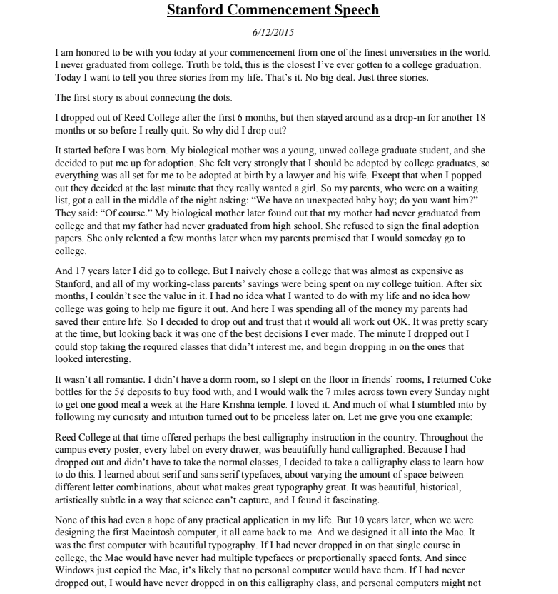
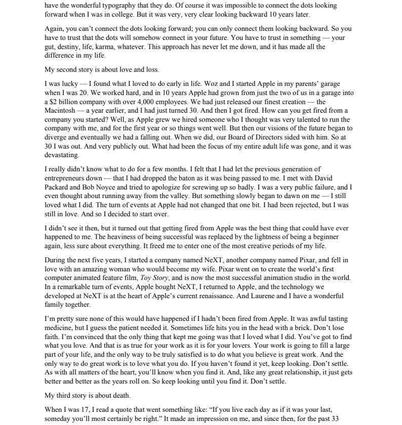
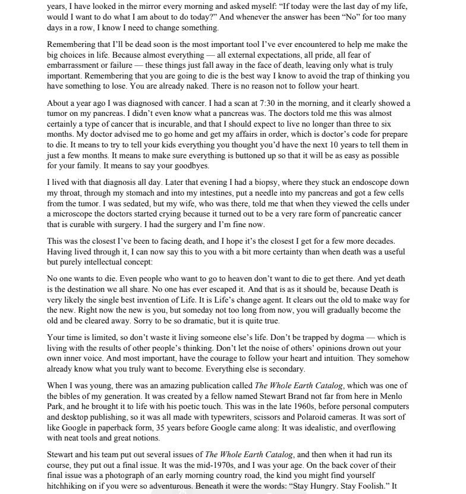
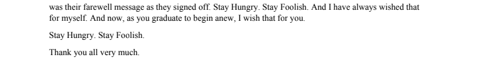

**斯坦福毕业演讲**

*2005年6月12日*

我今天很荣幸能和你们一起参加毕业典礼，斯坦福大学是世界上最好的大学之一。我从未从大学毕业。说实话，这是我离大学毕业最近的一次。今天我想给你们讲我人生中的三个故事。就这样。不是什么大事。只是三个故事。

**第一个故事是关于连接点点滴滴。**

我在上了6个月的里德学院后退学了，但之后又以旁听生的身份待了大约18个月，直到我真正退学。那么我为什么要退学呢？

这要从我出生前说起。我的生母是一个年轻的、未婚的大学毕业生，她决定把我送去收养。她非常坚信我应该被大学毕业生收养，所以她安排好让我被一位律师和他的妻子收养。只是当我出生时，他们突然决定他们真正想要的是一个女孩。所以我的养父母，那时正在等候名单上，半夜接到电话：“我们这儿有一个意外出生的小男婴；你们要吗？”他们说：“当然要。”后来我生母发现，我的养母从未上过大学，而我的养父甚至连高中都没毕业。她拒绝签署最终的收养文件。直到几个月后，当我的养父母承诺我将来会上大学时，她才同意。

17年后我确实上了大学。但我天真地选择了一所学费几乎和斯坦福一样贵的大学，而我那工薪阶层的父母把全部积蓄都花在了我的大学学费上。六个月后，我看不到继续下去的意义。我不知道自己想干什么，也不知道大学是否能帮我找出答案。眼看着父母一生的积蓄都花在了我身上，我决定退学，并相信一切最终都会好起来。那时我确实很害怕，但回头看，这是我做过的最好的决定之一。我一退学，就可以不再上那些我不感兴趣的必修课，而是去旁听那些看起来有趣的课程。

这并不完全浪漫。我没有宿舍，只能睡在朋友的地板上，我靠捡可乐瓶换5美分的押金来买食物吃，我每个星期天晚上会走7英里到镇上的哈瑞奎师那神庙吃顿好饭。我很喜欢那种生活。而我凭着好奇心和直觉做出的选择，后来证明是无价的。让我举一个例子：

里德学院当时可能是全国最好的书法教学之一。学校里的每张海报、每个抽屉上的标签都是手写的书法。因为我已经退学，不用再上常规课程，我决定选一门书法课来学习。我学到了关于衬线字体和非衬线字体的知识，学到了字母间距的调整，以及什么样的字体排版看起来最美观。这是一门美丽、历史悠久、艺术性极高的课程，是科学无法捕捉的，我深深着迷了。

这一切在当时看似毫无实际用途，也不可能在我人生中有任何应用。但10年后，当我们设计第一台Mac电脑时，一切又回到了我的脑海中。我们把它都融入到了Mac中。Mac是第一台拥有漂亮字体排版的电脑。如果我当年没有上过那门书法课，Mac也不会拥有多个字体或按比例排列的字体。而既然Windows只是模仿Mac，那么大多数电脑很可能也都不会有那么漂亮的字体。

当然，当我在大学时，根本不可能“向前”把这些点连起来。但10年后回头看，一切都清晰无比。

再说一次，你无法“向前”连接这些点；你只能“回头”才能把点点滴滴连接起来。所以你必须相信这些点将会在你的未来某一刻连接起来。你必须相信某些东西——你的直觉、命运、人生、因果报应，随便什么。这种信念从未让我失望，它在我的人生中带来了巨大的改变。

**我的第二个故事是关于爱与失去。**

我很幸运——很早就找到了自己热爱的事情。我和沃兹在我20岁时在我父母的车库里创办了苹果。我们努力工作，10年时间里，苹果从我们两个在车库里的小团队成长为一家拥有4000多名员工、市值20亿美元的公司。我们刚刚发布了最杰出的作品——Macintosh——就在一年前，我刚满30岁。然后我被炒了。你怎么会被自己创办的公司炒掉？是这样的，随着苹果的发展，我们招募了一个我曾认为非常有才华的人来一起管理公司，在最初的一年里一切都还好。但之后我们对未来的看法开始分歧，最终我们决裂了。当我们分歧激化时，董事会站在了他那边。所以，在我30岁的时候，我被赶了出来，而且是以非常公开的方式。我整个成年生活的重心突然没了，那是一场毁灭性的打击。

有好几个月我真的不知道该做什么。我觉得我让上一代企业家失望了——好像我把接力棒掉在地上了，就在我接过它的时候。我见了戴维·帕卡德和鲍勃·诺伊斯，试图为我的巨大失败道歉。我成了一个非常公开的失败者，甚至想过逃离硅谷。但渐渐地，我开始意识到一些事——我仍然热爱我所做的事。苹果发生的一切并没有改变这一点。我被拒绝了，但我仍然热爱。所以我决定重新开始。

当时我没意识到，但后来发现，从苹果被解雇可能是发生在我身上最好的事情。成功带来的沉重压力被重新做一个初学者的轻盈所取代，我再次对一切不那么执着了。这让我获得了解放，得以进入我人生中最具创造力的时期之一。

接下来的五年，我创办了一家公司NeXT，又创办了另一家公司Pixar，并爱上了一位了不起的女性，她后来成为了我的妻子。Pixar 创造了全球最成功的动画电影《玩具总动员》，并成为世界上最成功的动画工作室。而在命运的奇妙转折中，苹果收购了NeXT，我回到了苹果，而我们在NeXT开发的技术成为苹果重生的核心。而劳伦与我拥有了一个美满的家庭。

我几乎可以肯定，如果我没有被苹果解雇，这一切都不会发生。这就像是苦口的药，但病人确实需要它。有时候生活会突然给你一记重击。不要失去信念。我坚信唯一让我坚持下去的，是我热爱我所做的事情。你必须找到你热爱的东西。工作会占据你生活中很大一部分，而真正感到满足的唯一方式是做你认为伟大的工作。而做伟大工作的唯一方式，就是热爱你所做的事。如果你还没找到，那就继续找。别停下。就像所有与心有关的事一样，当你真正找到时，你会知道的。而且就像一段美好的感情，它会随着岁月的推移越来越好。所以继续寻找，直到你找到为止。不要将就。

**我的第三个故事是关于死亡的。**

当我17岁时，我读到一句话，大致意思是：“如果你把每一天都当作生命中的最后一天去活，那么某天你几乎一定会是对的。”这句话对我影响很大。从那以后，过去的33年里，我每天早上都会对着镜子问自己：“如果今天是我生命中的最后一天，我还会不会做我今天准备要做的事？”而当答案连续太多天都是“不”的时候，我就知道我该改变一些事情了。

记住自己终将死去，是我一生中遇到过最重要的帮助我做出人生重大抉择的工具。因为几乎所有东西——所有外在的期望、所有的骄傲、所有对尴尬或失败的恐惧——在死亡面前都会消失，唯有真正重要的东西才会留下。记住你将会死去，是我所知道的避免陷入“你还有什么可失去”的陷阱的最好方法。你已经一无所有了。没有理由不追随你的内心。

大约一年前，我被诊断出患有癌症。我早上7:30接受扫描，图像清晰显示胰脏上有一个肿瘤。我甚至不知道胰脏是什么。医生告诉我，这几乎肯定是一种无法治愈的癌症，我应该预计生命只剩下三到六个月。医生建议我回家，把事情安排好，这其实是医生的说法，意思是要准备去死了。意思是要试着向你的孩子讲完那些你原本还想在未来十年里告诉他们的话。意思是要确保一切都安排妥当，好让家人能尽量轻松地接受。意思是要向亲人道别。

我整天都带着这个诊断生活。那天晚上我做了活检，他们用内窥镜从喉咙穿过胃，再深入肠道，在我的胰脏里插了一根针，取了几块细胞组织。我当时打了镇静剂，但我的妻子在场，她后来告诉我，当医生在显微镜下查看那些细胞时，突然哭了起来。因为他们发现这是一种非常罕见、可以通过手术治愈的胰腺癌。我接受了手术，现在已经康复。

这是我距离死亡最近的一次经历，我希望这也是我距离它最近的一次。在经历了这一切之后，我现在可以比过去更有把握地告诉你：死亡不再只是一个纯粹的概念。

没人想死。即便是那些想上天堂的人，也不想通过死亡去那里。但死亡是我们每个人共同的终点。没有人能逃脱。这就该如此，因为死亡很可能是生命中最伟大的发明。它是生命的变革者。它清除旧的，为新的腾出空间。此刻你是“新生力量”，但不久的将来，你会逐渐变成“旧人”，被清除。抱歉说得这么戏剧化，但这是真的。

**你的时间有限，所以不要浪费时间去活别人的人生。**&#x4E0D;要被教条束缚——那是活在他人思想结果中的生活。不要让他人的喧哗声淹没了你内心的声音。最重要的是，要有勇气追随你自己的内心和直觉。它们某种程度上早已知道你真正想成为怎样的人。其他一切都是次要的。

我年轻的时候，有一本叫做《全球概览》的奇妙出版物，那是我们那一代人的圣经。这本书由一位名叫斯图尔特·布兰德的人创办，他家离这不远，在门罗公园。他赋予它诗意的气息。这是在上世纪60年代末，在个人电脑和桌面出版出现之前，那时一切还靠打字机、剪刀和宝丽来相机完成。这本书有点像是Google的纸质版，提前了35年出现。它理想主义，充满了奇妙的工具和卓越的观点。

斯图尔特和他的团队出版了几期《全球概览》，然后在最终一期推出时，是在70年代中期，我正好是你们现在的年纪。在那期的背面封底上，是一张乡村小路的清晨照片，像是你会在冒险搭车旅行时遇见的那种路。在照片下方写着：“求知若饥，虚心若愚。”

那是他们最后的道别语。求知若饥，虚心若愚。我一直希望自己能做到这一点。现在，在你们毕业、即将开始新人生之际，我也把这句话送给你们。

**求知若饥，虚心若愚。**

非常感谢大家。

**英文演讲稿：**

