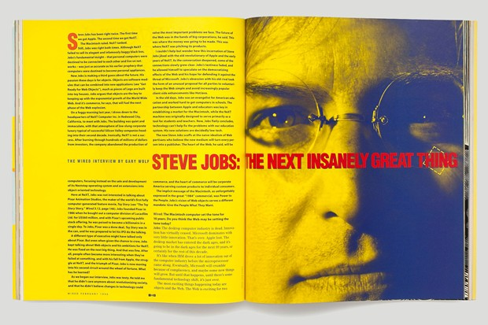

1996年，从苹果离开的乔布斯对《连线》杂志描述了自己心中的下一个“极好”的东西——谈到了网络，技术，以及设计的反思。今天，我们先来一起温故一番。当然，分享这篇访谈，真正想说的并不仅仅是个中的启示而已，还有更多。

###

##### &#x20;   英文原文：[The Wired Interview](http://www.wired.com/wired/archive/4.02/jobs_pr.html)&#xA;整理、编辑：Vivian P&#xA;封面配图：[Wired](http://wired.co.uk/)

### Part 1：关于网络

#### 《连线》：10年来，麦金塔为计算机行业确定了基调。你认为网络会为今天的世界定下基调吗？

乔布斯：在台式计算机领域，创新停滞不前，行业失去生机；微软创新不多，却称雄计算机行业。全都到头了，苹果也成了输家。台式机市场已经进入了黑暗时代，下一个十年将仍然是黑暗的十年，至少这个十年的后续年份将依然如此。

这就如同IBM在制造了微处理器后就鲜有大批创新一样，微软将会因为骄傲自满而土崩瓦解。到那个时候，也许会有一些新的事物得到发展。但只有等到那个时候，等到出现根本性技术革新的时候，局面才会有所变化。

眼下最激动人心的事情就是网络。之所以说网络激动人心，是因为两方面的原因。第一，网络无处不在，我们在哪里都能听到网络拨号音。任何无处不在的事物都会引发人们的兴趣。其次，我认为微软不会想出掌控网络的办法。网络需要更多的创新，这些创新所形成空间将不会有乌云蔽日般的行业称霸现象。

#### 《连线》：你为什么认为网络在迅速壮大？

**乔布斯：**&#x5230;目前为止，网络扩展的重要原因之一就在于它的简单性。很多人想让网络变得复杂化，希望把种种处理过程放在客户端上。而我则希望这样的事情少一些，进展的速度慢一些。

这很像旧式的大型机计算环境，其中网络浏览器是很笨的终端，网络服务器则类似进行所有处理工作的主机。这个简单的模型逐渐变得无处不在，因而将产生深远的影响。

《连线》：互联网还有些什么其他机遇吗？

&#x20;   乔布斯：你认为谁会是互联网的主要受益者？谁又会是最大的赢家？

《连线》：有东西去……

&#x20;   乔布斯：有东西去卖的人！

《连线》：去分享的人。

&#x20;   乔布斯：去卖的人！

《连线》：你意思是说出版业？

&#x20;   乔布斯：不仅仅只有出版业，整个商业都可以，人们以后不会再去商店买东西，他们将从网上购物！

《连线》：网络是最大的大众化引擎，这方面的情况又如何？

&#x20;   乔布斯：如果你看看我这生所做的事，你就会发现一个大众化的元素。网站就是一个令人难以置信的大众化引擎。在网上，小公司可以表现出大公司一般的规模，也像大公司一样便于访问。大公司动辄花费数亿美元建设分销渠道，而网络则会完全冲散这样建立的优势。

《连线》：在大众化进程经过一个发展周期后，经济前景将会有何变化？

&#x20;   乔布斯：网络是不会改变世界，在未来的10年肯定不会。它会让世界变大。只要置身网络的延伸空间，就会看到大众化的身影。

&#x20;   网络不会俘获每个人。网络所联系的货物和服务达到全国的10%时，就已达到十分惊人的水平了。我认为它还会远高于此。网络最终会成为经济的一个巨大部分。

《连线》：为什么网络的突然崛起让人们如此震惊？

&#x20;   乔布斯：这有点像电话。你有两个电话，并不是很有趣的事情，有三个、四个等等也不见得有趣。也许有一百个的话，会稍微有趣一些。有一千个，就更加有趣一些。可能直到你有了大约一万个电话的时候，才会真的有趣起来。

&#x20;   很多人都无法预见、无法想象有几十万或一百万个网站会是什么样。如果只有一百、两百个，或者全都是大学的网站，那就不会有什么意思。当数量最终超越了这个临界值，就会变得非常有趣、非常快。这一点，你可以看得到。人们也会说，“哇！这简直不可思议。”

&#x20;   网络让我想起了PC行业初期的情形。当时人们真是什么都不知道，也没有专家。所有的专家都错了，所有的事情都存在巨大的可能性。同时，人们对PC行业也没有做多少限制，下多少定义。那样的状况真是非常好。

&#x20;   佛教中有个说法叫“初心”；拥有初心是件很好的事情。

《连线》：网络是否为个人带来更多自由？

&#x20;   乔布斯：它抹平了层级之间的差异。个人如果投入足够的精力，也可以把网站建设得像世界上最大型公司的网站一样具有冲击力。

&#x20;   我喜欢能够抹平层级差别的事物，它把个人提升到与组织齐平的高度，或把小型的组织提升到与拥有许多资源的大型组织齐平的高度。网络、互联网就能做到这一点。这是一个非常深刻、非常好的事情。

### &#x20;   Part 2：对技术革命的再思考

《连线》：网络技术带来的最大惊喜是什么？

&#x20;   乔布斯：现在我的年纪大了，40岁了，我知道这些东西不能改变世界。确实不能。

《连线》：这么说会让大家伤心的。

&#x20;   乔布斯：很抱歉，但这是真的。有了孩子会让你改变对这些事情的看法。我们出生、短暂地生活，然后死去。长久以来，一贯如此。就算技术能改变它，也不会改变多少。

&#x20;   这些技术可以让生活更变得更轻松一些，让我们接触到我们本来可能不会接触到的人。如果你的孩子有先天缺陷，那么通过网络技术，你就能与其他家长和支持小组进行联系，获取医疗信息，了解最新的试验药物。这些都会深刻地影响我们的生活。我并没有贬低技术的意思，但是如果不断地说它们会改变一切，那就是在帮倒忙。重要的事情本来就重要，不需要通过改变世界来变得重要。

&#x20;   网站将非常重要。它是否会改变千百万人的生活？我想不会，但也不确信。它可能会对人们产生潜移默化的影响。

&#x20;   它肯定不会像人们第一次看到电视那样，也不会产生内布拉斯加州人们第一次听到电台广播时那么深刻的影响，它的影响不会那么深刻。

《连线》：网站将如何影响我们的社会呢？

&#x20;   乔布斯：我认为人们生活在信息化经济中，而不是信息社会中。人们思考得比以往少了，这主要是因为电视。人们读得也少，思考得也少了。所以，我没有看到大多数人使用网络来获取更多的信息。我们已经处于信息超载之中。不论网络可以提供多少信息，大多数人得到的信息都远多于他们所能吸收的数量。

《连线》：问题是电视吗？

&#x20;   乔布斯：小的时候，你看着电视会觉得电视中一定有阴谋。电视网络企图将我们变得不会思考。等长大一些，你又会意识到事实并非如此。电视网络的行业目标就是要给予人们真正想要的东西。在电视上，阴谋可以变成好事，你也能教训恶棍，能够发起革命！这样的年头着实令人感到益发沮丧。电视网络的行业性质就是提供人们想要的东西。这是事实。

《连线》：看来，史蒂夫·乔布斯认为现状会继续越变越糟。

&#x20;   乔布斯：确实是越来越糟了！这谁都知道。难道你不觉得吗？

《连线》：我确实这么看，但我希望能发现让情况好转的方法。你真的认为这个世界是越变越差吗？你是否认为自己所参与的工作能使世界变得更美好？

&#x20;   乔布斯：世界确实越变越差，过去15年左右的时间都是如此。绝对是这样。其中有两个原因。在全球范围内，人口急剧增加和我们从生态到经济、政治的所有结构体系，无法解决这个问题。在美国，政府当中明智的人好像变少了，人们对必须做出的重要决定也不是十分重视。

《连线》：不过，你好像对变革的潜力持乐观态度。

&#x20;   乔布斯：在某种意义上，我是一个乐观主义者。我相信人类是高贵的，值得尊敬的，有人确实富有智慧。我对个体持十分乐观的态度，个体的人们在本质上是好的，但我对于群体却有些悲观的。看看我们国家所发生的大事小事，我感到非常担心。至于能否让我们的国家变成一个更适合孩子生活的地方，人们对这个问题似乎并不乐观。

&#x20;   建造了硅谷的人都是工程师。他们学习了商业，也学了很多其他不同的事物，但他们都有一个相同的、真实的信念—普通人与其他富有智慧和创造力的人共同努力，就能够解决人类的大多数问题。对此，我深信不疑。

&#x20;   我认为从工程这个基础的角度看，很多具有工程背景的人参与进来确实会很有助于问题的解决。但在社会上，这就行不通了。那些人并没有被吸纳到政治事务中，可为什么有的人却能参与其中？

### &#x20;   Part 3： 关于设计

《连线》：你擅长设计精品，这一点有口皆碑。为什么没有给更多的产品赋予大手笔设计的美学元素？

&#x20;   乔布斯：“设计”是一个有趣的词。有人觉得，设计就是对外观的设计。但进一步想，其实设计是产品的用法。Mac的设计就不在于它的外观，尽管外观也是一部分。最主要的设计还是在于对工作方式的设计。要设计出好的产品，就必须熟悉它，切实弄清楚它到底是什么。设计者要不断地投入极大热情才能真正彻底地明白它，还需要反复地咀嚼回味，而不能只是囫囵吞枣。不过，大多数人并不愿意花时间这样做。

&#x20;   创新就是把各种事物整合在一起。当你问有创意的人是如何创新的，他们可能会感到些许愧疚，因为他们根本就没有创造什么。他们只是看到了一些东西。他们总能看出各种事物之间的联系，因为他们习惯于将他们的各种经验联系起来，然后整合形成新的东西。之所以能做到这一点，是因为他们具有比别人更丰富的经验，或者他们对自己的经验思考得更多。

&#x20;   不幸的是，这是一种非常稀缺的品质。我们行业中的很多人都缺乏多方面的经验。因此，他们就没有很多可供联系的节点，对待问题就只能提出线性的解决方案，而没有宽广的视野。我们对于人类的体验了解得更深更广，我们的设计就会越出色。

《连线》：当今的优秀设计中，是否有作品激发了你的灵感？

&#x20;   乔布斯：设计并不局限于别致的新玩意儿。我们家刚刚买了一个新的洗衣机。我们以前的洗衣机不太好，所以我们用了点时间了解它们。结果是，美国人造的洗衣机和烘干机根本不对路，欧洲人的产品就好多了，但欧洲的洗衣机要花费两倍的洗衣时间！不过它们的用水量大概只有美国同类产品1/4，而衣服上残留的清洁剂也少得多。最重要的是，它们不会毁坏衣服。洗衣使用的肥皂和水都少得多，而洗出来的衣服却干净得多、柔软得多，也能多穿些日子。

&#x20;   我们希望如何取舍？我们家于是花时间对此做了一番讨论。我们谈了很多有关设计的事情，很多还涉及我们家的价值观。我们真的在意是在一个小时内洗完衣服，还是一个半小时？我们是否真的在意衣服穿起来极为柔软并耐久？我们是否在意用更少的水？我们用了大概两周的时间，每天晚上在餐桌上讨论这些事。我们围绕这个话题反复讨论，而谈的就是关于设计。

&#x20;   最后，我们买的是德国米勒牌（Miele）洗衣机。这种洗衣机非常贵，但这也是因为美国没有人买它。它们造工精良，算得上是过去几年里我们买过的让人开心的少数产品之一。它的创造者对洗衣过程的确彻底研究过。他们把洗衣机和烘干机设计得很好，比我在过去几年里看到的任何高科技产品都更出色。

&#x20;   <节选完>
