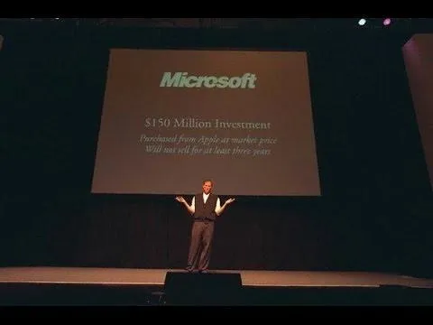

## 乔布斯在1997年Macworld大会上的演讲

【巴芒阅览室】完整翻译了全文

**1997 WWDC 问答会**

*1997年5月*

早上好，非常感谢你们。我真的很感激。

我今天早上来是想跟大家聊聊天。我知道你们整个星期都听了很多演示，所以我不打算做什么花哨的演示。我想做的只是聊天，这样我们就可以一起花45分钟左右的时间，谈谈你们想谈的任何事情。我对大多数事情都有一些看法……我想，如果你们只是想开始提些问题，我们就能有一些不错的交流。

为了稍微定个基调，我对目前的情况感到非常兴奋。我认为你们这周见到的一些在苹果公司关键领域工作的同事是非常出色的人，我认为他们正在朝着一个相当清晰的战略方向取得巨大进展。这个战略围绕着一个基本的概念展开，那就是打造一些真正优秀的产品。而且**我非常坚信，现在仍然存在一个非常可观的市场空间，可以容纳一些非常优秀的产品，而其中有很多巨大的空白，是我们可以在你们的帮助下去填补的。** 所以，我愿意回答你们任何的问题，也希望今天上午我们能有一些不错的讨论！

**专注就是要学会说“不”**

***问题：关于OpenDoc你怎么看？***

Steve：OpenDoc？你问OpenDoc？它已经死了，对吧？好吧，让我说点什么。我知道你们中有些人花了很多时间在这上面，但我们已经对它“开了一枪”。我很抱歉。但是苹果这些年来因为糟糕的工程管理遭了不少罪。我必须这么说。而且过去有很多人朝着18个不同方向做事，每个方向看起来似乎都挺有趣的。优秀的工程师——糟糕的管理。而发生的事情就是，当你把这些不同方向、不同时期的成果拼在一起时，整个“农场”看上去就像是由各种动物组成，但它们朝着不同方向奔跑，最后就无法整合。整体的效果甚至不如这些部分的总和。于是我们必须决定：“我们真正的战略方向是什么？”“什么是有意义的，什么是没有意义的？”于是我们发现有很多方向根本行不通。**从微观来看它们是合理的，但从宏观来看，它们毫无意义。**

最难的事情是……你在思考专注的时候，是不是会想，“嗯，专注就是要说‘是’”？不，专注其实是要学会说“不”。专注就是要说“不”。你必须要说“不，不，不”。当你说“不”的时候，你会得罪人。然后你去和《圣菲新墨西哥人报》的记者谈话，他们会写一篇很糟糕的文章来攻击你。这真的很烦人，因为你想当个好人，你不想让记者写出糟糕的报道。但你必须承担这些后果。

而苹果在过去六个月里也因此遭受了不少打击，有些批评甚至是成年人都很难承受的。我为我们能承受这些感到自豪。但这还不是全部，我相信还有更多故事没说完。我读过一些关于那些离开公司人的文章。我认识他们中的一些人。他们已经有两年什么也没做了。而你知道吗，他们一离开，公司反而开始走上了毁灭的道路。

我认为会有很多这样的故事存在，但专注最终会带来好结果。**专注的结果就是会诞生一些真正伟大的产品，而这些产品的整体价值将远远超过它们每个部分的总和。**

**而关于OpenDoc……我赞成“给OpenDoc一枪”。我的意思是，我认为它是很棒的技术，但它不合适。外面的世界不会使用OpenDoc。我认为在Java领域作为容器策略有一些东西要更好得多。而且就连OpenDoc的开发者们，基本上也只是想用Java重写整个东西，也就是说是重新开始。所以，它根本就不合理。**

**媒体和股价会自我调整**

***问题：我们该如何应对媒体？《华尔街日报》的记者每天早上醒来就看苹果股价下跌，然后开始写关于我们的报道。而且，很明显这是“感知”和“现实”之间的差距。他们对操作系统一无所知。他们对工具一无所知。他们不知道未来会发生什么。他们不知道我们正在打造‘冰山’，正在从底层构建一切。***

当然。我相信你们中很多人都经历过这样的情况：当你在成长、在改变的时候，作为一个人你在成长，人们却还是把你当作18个月前的你来看待。这真的很令人沮丧。当你变得更有能力，一些个性的小毛病也改掉了，不管那是什么，但人们还是会像你一年前或者18个月前那样看待你。这种情况会让人非常挫败。

嗯，公司也一样。媒体也是一样。媒体总是有滞后时间，我们能做的最好的事情就是接纳他们，尽力去教育他们理解我们的战略。但关键是，我们要始终盯着目标不放。

而这最终会带来一些很棒的产品，带来与客户直接的沟通，我们尽可能地把像你们这样能让公司成功的人群纳入其中，让你们了解公司在做什么，而不是让你们一无所知，只能在原地踏步。

**这就像股票市场……媒体和股价会自己调整。在今年年底之前，情况将会非常不同。**

我现在在这个行业也算个老家伙了，见过了起起落落，一旦你经历过足够多次，就知道事情会如何发展。所以，当你早上醒来看到媒体在低价抛售苹果，那你就出去买点股票吧。这是我会做的事——事实上，这也是我已经做的事。

**专有软件 vs 采用开放标准**

***问题：苹果确实有引入新技术的传统，但最近，苹果似乎更多在为自己与众不同而感到抱歉，而非为此感到自豪。我只是想知道，在推出Mac多年之后，苹果还能做些什么来重拾它的勇气。***

我得告诉你，我对这个问题有一点不同的看法。我认为苹果在过去很多年里一直对网络计算视而不见。这期间网络计算发生了太多的事情，而苹果几乎完全错过了。例如，**Mac可能是世界上最缺乏强大网络支持的主流计算平台之一。**

当NeXT加入苹果时，NeXT已经拥有一个非常先进的网络基础架构来处理网络计算，相较之下，苹果完全无法适应，即便到了今天，苹果内部的团队依然难以理解这一点。

因为Mac一直处于**各种专有机制的束缚之中，同时也由于一种傲慢的态度，认为“我们不仅不需要适配网络世界，而且我们比网络世界更优越”**……于是Mac活在它自己的小世界里，而外面的世界已经不再关注它了。

所以，我们必须让Mac进入现代网络世界。但在很多领域里，我们无法做到这一点，**因为我们不是首先制定标准的人，而这些标准现在已经被写进了“石头里”——我们不得不用它们。**

所以，我认为**智慧之处并不是说“我们得自己发明一切”。真正的智慧在于，我们只需要自己发明其中的10%、20%或最多30%，剩下的，我们应该去利用现有的技术。**

我们没发明PostScript，对吧？但我们用它造出了LaserWriter。我们是第一个推出LaserWriter的公司。

所以，**我认为，在我们所做的每一个方面都走专有路线的思维方式，确实严重伤害了我们。而且，过去我们的管理层和愿景也鼓励了这种思维方式。鼓励大家去自己重新发明轮子。是的，也许它会更好10%，但通常结果却是它差了50%，因为也有很多聪明人并不在苹果工作。**

**“更好”比“与众不同”更重要**

*我唯一想补充的是，我认为苹果被视为“与众不同”是很重要的，因为如果苹果说“我们跟其他人一样，只是更好”，那听起来其实什么都没说。*

不，我不认为苹果应该被看作是“与众不同”的。我认为苹果应该被看作是“明显更好”的。如果要实现“更好”必须得“与众不同”，那我们就得这么做。但如果我们能在不“与众不同”的情况下变得更好，那我完全可以接受。我想要的是变得更好，而不是与众不同。我们确实需要在某些方面做到不同，以此来实现“更好”，那才是真正的目标，你不觉得吗？

*我同意，但苹果也需要清晰地表达这种“不同”。目标是变得更好，但对于大众来说，这必须是整体意义上的“更好”，并且这种“更好”要以一种“不同”的方式体现出来。*

这必须是全方位的“更好”。

**从本地存储到云端存储**

***问题：早上好。你在开场时说过，苹果存在很多漏洞是无法靠自己弥补的。作为一位有远见的人，你能不能花几分钟谈谈你对这些目标的看法？***

当然。如今使用电脑最强大的地方，在于它们不仅仅是用来做计算密集型任务，而是作为一种窗口去完成通信密集型任务，你们都知道。从未有哪种技术像现在这样强大——把计算能力和我们当前的网络技术结合在一起。所以，不仅是整个组织内部的网络，当然也包括通过互联网连接的广域网。

我想强调一件我非常重视的事情：“生活在一个高速网络的世界中，每天都在靠它完成工作。”现在，你们中有多少人自己管理自己的存储？你们中有多少人定期备份自己的电脑？比如，你们过去三年、四年有多少人遭遇过系统崩溃？对吧？

让我描述一下我所生活的世界。大约8年前，我们使用的是已被淘汰的NeXT硬件（当时我们跑的是NeXT系统）。因为我们使用了NFS，我们可以将所有的个人数据，也就是所谓的“home目录”，从本地机器中取出，放到服务器上。而那套软件完全透明地完成了这个过程。由于服务器拥有大量RAM，在某些情况下，从服务器获取数据比从本地硬盘还快，因为数据可能已经被缓存到了服务器的内存中，如果那台服务器是热门服务器的话。

**但真正了不起的是，整个组织可以雇一位专业人员每晚备份那台服务器，并且还能多花一点钱在那台服务器上，所以它可能拥有冗余硬盘、冗余电源。**

你知道吗，在过去7年里，我一次个人数据都没丢过。你知道我备份了几次电脑吗？零次。我在Apple、NeXT、Pixar还有家里都有电脑。我走到任意一台电脑前，登录自己的账户，它会通过网络找到我在服务器上的home目录，然后我所有的数据就都在那里，无论我身处何处。而这些数据都不在本地硬盘上。

**千兆以太网实现云存储**

现在，让我觉得非常有意思的是——千兆以太网即将到来。

使用千兆以太网，几乎在每个方面都比使用本地硬盘更快地与服务器通信。我最兴奋的其中一件事就是，把个人电脑中除了键盘和鼠标以外的所有移动部件都移除。**如果我能连接到服务器更快，那我就不需要电脑里的硬盘了。**

因为我把网络连接看作是“通过线缆传输的MFS Dialtone”。数据通过这根线传输完了。我根本不在乎另一端是什么设备。

我们在NeXT有一个大系统，花了五十万美元，非常值得。我们做了很多软件开发。没有人丢过任何东西。没人需要担心这些问题。你也可以用更小的系统。**但管理这样一个网络真的是件麻烦事。搭建它、让它运行好真的很复杂。**

我希望苹果能做的一件事是，通过这种新的网络类型（对我们来说并不新，但对普通用户来说是新的）以及千兆以太网技术，还有即将出现的一些新服务器技术，加上一些更轻量的硬件客户端——**让苹果能将这一切变成“即插即用”，让普通用户也能像十多年前我们改善用户体验那样轻松使用。**

这就是我觉得存在巨大机会的地方——而除非你真的去使用它，我根本无法描述它有多棒。你只需要使用一两天，就能得出结论：相较于携带这些无法联网或数据混乱的电脑，这种方式简直像天堂与地狱的对比。

所以，有三四件类似的事情，它们意味着巨大的机会。而且很多时候，一个组织或一个人的最大优势，也可能是其最大的弱点，反过来也成立——你的最大弱点，也可能成为你最大的优势。

**通过端到端的产品设计更快地实现愿景**

**苹果一直被认为有一个极大的弱点，那就是它过于封闭并且高度垂直整合。** 它不制造自己的半导体，但它制造硬件、开发软件、控制用户体验、进行营销。很多人因此建议苹果应该退出硬件业务，因为这会让它看起来像个弱者。

我不同意这个看法。**我认为如果管理得当，这种“垂直整合”本身可能是苹果最大的优势。**

我来举个例子：即插即用。

在PC行业，要推动一件事情似乎总是要花很多年时间。即插即用的构想是五年前提出的。微软、康柏和英特尔为此花了两年时间吵架，最终把英特尔拉进来……现在已经过了五年，它仍然不能正常运行。

你可以想象，要花多少年时间，他们才能制定一个薄客户端的标准，开发出能与客户端兼容的服务器。而我们现在已经进入21世纪。所以，苹果能从头到尾控制产品设计——从硬件到软件——这给了苹果一个独一无二的机会。行业中没有其他公司能做到这一点。它让我们能以令人难以置信的速度解决一些复杂问题，并在市场上获得巨大的竞争优势。

**我认为我们几乎可以比英特尔生态系统领先5年甚至10年来解决这些问题。**

当然，他们也有自己的优势，别误会我的意思。但我认为我们的一大优势就是，**我们能够掌控所有的环节，从而更快地真正实现一个统一的愿景，只要我们内部能协调一致。**

**软件开发者生态的机会**

***问题：那听起来非常棒，当你说到这些时我都有些入迷了。但这时我想到一个问题：这对苹果来说是个很棒的愿景。但开发者的机会在哪呢？***

我可以给你很多简单的例子。

微软还没承诺将他们的应用套件移植到Rhapsody，对吧？他们在等什么？

Adobe——你知道Adobe每个月卖出多少份Photoshop吗？无数份！Photoshop是Adobe的基础。**但据我所知，Adobe还没有承诺将Photoshop移植到Rhapsody。他们在等什么？**

有家名为Lighthouse的公司，大约6个月前被Sun收购。他们是最出色的NeXTSTEP开发者。他们只有18个开发者。没错，就18个人。但他们做出了我人生中见过最棒的演示文稿应用Concurrence。我至今仍在用。

他们还开发了一整套5款应用程序，每一款都是同类产品中的佼佼者。我用过最好的电子表格程序叫**Quantrix**。你们有人用过**Improv**吗？Improv是地球上最好的电子表格软件，因为它提供了一种全新的方式来看待电子表格，尤其适合像我这样需要建模思维方式的人。它真的非常强大。

而Lotus因为自己也搞不定Improv，干脆放弃了，让Lighthouse去仿制。18个开发者干掉了Lotus的5个应用程序，全靠这个强大的开发环境。

**软件开发与应用营销**

苹果将交到你手里的，是一个让你可以用比其他任何平台快5到10倍的速度开发应用系统。就是这么快，就是这么简单。

而你可以选择走极致的高效路线，或者找一个折中的方式。

**让现有的复杂操作加速5倍甚至10倍。**

**你可以让现有复杂度的应用快5到10倍开发出来，这意味着三个人可以在第一天进车库，只凭一个创意，在6到9个月内就能推出一款产品进入市场。**

我们行业在过去10到12年里都没有看到这种情况。这是非常非常令人兴奋的。而有些人可能会说，“它只能运行在Macintosh上，或者只能在Rhapsody上运行，在Intel上卖，可能还得搭配Mac系统。天啊，这只是一个市场中个位数百分比的份额。”好吧，是的，但那也是每年三百多万份拷贝。

我并不介意面向那个市场去销售。如果你是一个三人、十人、十八人的软件开发公司，那可是个巨大的市场。Lighthouse就是靠销售给NeXTSTEP市场而活得很滋润的。拜托，别再小看它了！

所以你知道吗，我认为那里有一个巨大的市场。而且，我认为还有许多客户对苹果仍然抱有极大的忠诚度。如果Adobe不想为Rhapsody打造下一代Photoshop，那你们中有人应该去做！也许他们会收购你……谁知道呢？

但出版行业的市场很希望看到下一代工具，而更重要的是，你知道谁会比他们更爱这些工具吗？苹果，对吧？

你走进某个地方说，“我有个产品，它比Photoshop强5倍。”如果足够多的出版行业人士开始认同苹果，认为这真的是他们需要的工具……你知道苹果每年在营销上花多少钱吗？

他们应该把一部分花在这些应用上，并且把这些产品传播出去。所以，如果你真做出了一些非常棒的产品，我认为它会迅速流行开来。我认为这是一个非常独特的机会。

**开发一个你在其他平台上无法构建的应用**

我想回到刚刚提到的最后一点。除了能让当前复杂度的应用快5到10倍地开发出来之外，你还可以用这些强大的工具开发出一个你在任何其他平台上都无法构建的应用。对我来说，这是最让人兴奋的一点。

开发一个你在其他平台无法构建的应用，因为这一切都与管理复杂性有关，对吧？你们是开发者，你们知道的。这就是在管理复杂性。这就像脚手架，对吧？你搭建起脚手架，继续向上搭，最终这个脚手架就会因为自身重量而坍塌。这就是构建软件的本质。

问题在于，在整个结构因为自身重量崩塌之前，你能搭建多少层？这与你有多少人做项目无关。无论你是微软，有三四百人、五百人做一个项目，一旦超过承重，还是会垮掉。

你们都看过《人月神话》吧？它的核心观点是：软件开发项目一旦到达某个规模，增加一个人反而会拖慢进度。**因为与你协调沟通所花费的精力实际上超过了你对项目的实际贡献，所以进度反而变慢。**

所以你达到了一个局部最优点，然后进度开始放缓。我们都了解软件开发。这就是在管理复杂性。这些工具能让你省去大约90%的担忧，让你搭起5层脚手架的时候，不是从第23层才开始搭，而是从第6层就开始搭建。这样你就能建得更高。

***问题：你刚才提到股票，以及我们如何期待今年年底会发生的事情。我想知道，你能评论一下Larry Ellison吗？***

关于拉里·埃里森，人们可以有很多评论。我从没和拉里约会过，所以可以排除那一类评论。其实，拉里是我最好的朋友之一，这让我处在一个有点尴尬的位置。

我当然劝过他不要考虑掌控苹果公司，因为我认为苹果现在的方向非常好。而且我也认为拉里现在走在一条非常棒的路上。我的意思是，我曾经跟他说，“你看，如果你在硅谷做个调查，问人们最想在哪家公司工作，甲骨文可能会排在名单的最前面。”它是世界第二大软件公司，是全球最具活力的公司之一。**而拉里是从零开始创建它的，他现在拥有世界上最棒的工作之一。**

所以，我认为拉里已经公开表示他会继续管理甲骨文这一决定就足够了。我不会为此担忧。**我认为我们现在真正需要担心的是：开发一些优秀的产品，让它们在平台上运行起来，同时告诉我们的客户这些产品的价值和意义。**

**如何与行业领头羊竞争：构建你和朋友都想要的东西**

***问题：几周前，《华尔街日报》公布了微软的利润数据。他们还表示，在这个行业中，目前真正表现好的公司只有英特尔、微软，也许还有康柏。你怎么看待面对这些几近垄断的巨头竞争，而司法部似乎又莫名其妙地回避了反垄断起诉的问题？***

我们创办苹果的那一天，IBM在计算机行业里的地位远超如今的微软和英特尔。他们不仅控制了技术，还控制了客户。他们与客户有直接联系。

所以，我们当时完全可以打退堂鼓。我是说，我本应该拍着Woz的肩膀说：“算了吧，没戏。”但我们太蠢了，不知道这些“市场规则”。我们没上过商学院。我们也不看《华尔街日报》。我们不知道《华尔街日报》在说什么。我们甚至没见过《华尔街日报》。而这正是我们的优势。所以，我还能说什么呢？

我认为，这个行业以及几乎任何地方所有我所见过的优秀产品，都是因为一群人真的在乎做出一些他们自己和朋友都想用的东西。他们希望自己能使用这个产品。

这正是Apple II是怎么诞生的，苹果公司是怎么诞生的，Macintosh是怎么诞生的——几乎我知道的所有好东西，都是这样诞生的。

它们不是因为人们因为害怕某家大公司踩扁他们而战战兢兢地缩在角落里。**如果大公司真能做出正确的产品，那很多好产品根本不会诞生。**

**如果当年我和Woz手里有2000块钱，能直接买一台Apple II，那我们干嘛还去造一台？我们不是想创办公司，我们只是想搞台电脑出来。**

我给你举个例子。

我每天收到大约200封电子邮件，去掉垃圾邮件和一些从互联网上搜来的快速建议，剩下的就是5到6年来我见过的最重要的用户反馈。而且，我已经在多个系统上使用邮件服务，在我看来——无论是NeXTSTEP还是Rhapsody——**Rhapsody在各方面都是一个数量级的提升：更好、更高效、更强大。**

我的意思是，我在苹果四处走走，发现他们用的是世界上最糟糕的电子邮件系统。**我知道，只要我们给他们一个好的邮件系统，就可以让苹果内部的生产力提升30%。**

所以，这真的让我震惊——像“邮件”这么基础的东西，居然被搞砸了。Netscape 的邮件很烂，我的意思是，所有人的邮件系统都很烂。如果连“邮件”这种最基本的东西都能搞砸……

再举个例子：电子表格。如果你用 Improv 或 Quantrix 一周，你会问，“它为什么还没完全取代 Excel？” 对于75%的用户来说，这些工具明显更好。25% 的人仍然会坚持用 Excel，这也情有可原。但对于另外75% 的人来说，为什么这些工具没能取代 Excel？**而且对于这些问题，根本没有答案，除了——“我们就应该去做！”** 这就是我对这类事情的态度。

**苹果与微软的竞争**

我还有个非常非常强烈的观点：如果苹果必须以微软的失败作为自身成功的前提，那是极其愚蠢的。这真的太蠢了。

我的意思是，我并不期待联邦政府会拆分微软。原因有很多，最小的一个原因是——**联邦政府本身就是个垄断。我的意思是——他们和微软是“好哥们”！**

**所以，微软是一个既定事实。他们就像我们呼吸的空气一样存在。** 也许更贴切的比喻是瓶装水——你还是得去买。

但即便如此，苹果仍然可以赢，而不必以微软的失败为前提。我真的相信这一点。希望随着时间推移，微软能意识到这一点，并认识到苹果其实是他们业务中非常有利可图的一部分。

他们现在似乎已经有这个倾向。苹果和微软之间已经宣布了一个联盟。所以，我真的强烈认为，**把微软妖魔化，并与其进行一场“圣战”将是苹果所能做的最错误的事情。** 市场上还有太多机会，苹果可以获得巨大的优势，**不需要正面冲撞微软，只需直接去面对客户即可。**

**Rhapsody 操作系统的定价与授权**

***问题：我希望你今天上午能就Mac兼容市场的未来演化发表一些看法。***

这是我个人的观点。我认为苹果应该授权一切（有少数例外）。但我认为苹果应该为此收取一个合理的费用。我认为过去3、4年那套克隆策略本身是被糟糕执行的。

首先，苹果授权的是硬件设计，并强迫克隆厂商使用它。这很愚蠢。**应该让那些厂商自己设计硬件——让他们做他们想做的事，对吧？不要把他们限制住。**

但如果他们愿意为此额外付钱，想使用苹果的硬件，那也行。如果他们不愿意，就让他们自己设计。

至于软件方面，苹果应该收取一个公平合理的价格。

举个例子，假设我是一个做Mac兼容机的厂商——你也知道，这种低端Mac市场是比较混乱的，竞争也很激烈，利润不高，那我可能不愿意多付钱。

**而为了抵消这类低利润产品的影响，我们在高端市场就需要一些高利润产品。**

所以，如果你是一个克隆机厂商，你会想：“哇，我愿意给苹果10美元买下这套软件，然后去抢占那个5000美元的高端Mac市场。”

这对苹果来说将是非常愚蠢的做法。因为这些克隆厂商简直就是寄生虫。他们靠的是苹果的商业模式在某些层级上不赚钱，然后再试图在高端产品上“钻空子”，只花很少的钱购买软件授权，赚取高额利润，这并不公平。

所以你希望人们在出货量较少的情况下付更多的钱——因为他们唯一能提高销量的方式就是把一些中低价产品也做出来，赚得更少。而如果他们是这样做的，那他们应该以较低的单价跨越整个产品线来获得授权。

因此，我一直在主张：取消对硬件的授权，让克隆厂商想怎么做就怎么做；同时**提高软件授权的版税价格到一个合理的水平，并将其按销量做阶梯定价**。我认为这是正确的做法。一些克隆厂商对这个想法非常反感，真的很愚蠢。我的意思是，我不认为他们应该比授权其他现代操作系统多花很多钱买Rhapsody 的授权。但这不是10或20或30块钱的问题。

我认为最终我们会走到这一步，所有人都会过得不错。我认为克隆厂商会更轻松地运营，而且不用再去处理苹果的硬件了。也许他们会造出更好的硬件，也许会造出更差的硬件，最终还是由用户来决定。而我完全支持这一点。

我只是觉得苹果不应该让克隆厂商以极低的价格获得软件授权，然后再转手靠高利润产品大赚一笔。如果他们要去卖高利润产品，就应该为软件支付一个合理的授权费用，随他们去。这就是我对此事的看法。但决定不是我做的。

**赋能开发者服务市场**

***问题：不过我还是很高兴你来了。你刚才提到管理复杂性。很多人都不使用电脑，或者认为电脑是他们必须看管的东西——电脑在“使用他们”。我们如何才能让电脑为人工作，而不是让人去“伺候”电脑？***

我不太确定你说的是什么意思。我不觉得我是为我的电脑工作的。我只是觉得它有点“入侵性”——比如，我家里有T1网线，你习惯于在你到家的那几秒内就开始回复邮件，它的确会“渗透”到家庭生活中……

***问题：那我们怎么才能让电脑为我们做更多事情，而不是我们不断地点击、点击……？电脑不停工作，我们却在原地等待……***

我在这方面的看法可能跟别人有些不一样：

* 我的看法是：**我通常会同时运行10到15个应用程序。**

* 它们彼此之间会以一种很棒的方式通信，我几乎不需要花心思就能在它们之间自由切换；

* **而我身处一个极高带宽的网络环境，和我的同事之间也有极强的透明协作机制。**

这比我在Windows或Mac世界里看到的任何东西都好太多。如果未来12到24个月内你们能把你们正在开发的应用程序推出，我会非常开心——这样我们就可以把它带给所有人。

其次，我脑中还有至少20个我希望自己能使用的应用——而它们还没被开发出来。如果我们能让这些应用更容易开发、让Mac市场保持比Intel市场更低的成本，那我们每个人就都有机会去发布你们写的那些优秀软件。

所以，在未来三四年里，我的看法是，我们的任务不是去重新发明世界，而是**把一些已存在但鲜有人使用的东西推向市场**。

老实说，这有点像Xerox PARC。Xerox PARC曾经开发出一些极其先进的技术，Macintosh 的一些功能就来自那里。但他们自己却从没真正推广出去。现在有成千上万人在用这些技术，但还远远不到“数百万级”。如果我们能让它走向大众，我认为它将会带来巨大改变。幸运的是，其中很多东西已经被打磨过、完善过、几乎无懈可击——我们不会再经历那些令人尴尬的早期时刻了，我希望如此。

**程序员生产力**

***问题：那听起来真酷。你刚才提到开发工具。有个很棒的NeXTSTEP演示，我们可以用可视化的方式构建界面——这太棒了！但突然之间，我们又回到了写代码阶段。那么，什么时候我们才能真正实现“可视化编程”？***

说实话，这就是关键：提升程序员生产力的方法，不是让他们每天写更多代码行数。那样是无效的。提升程序员生产力的关键在于：减少他们必须写的代码量。对吧？**写得最快、不会出错、不需要维护的那一行代码，就是你根本不需要写的那一行代码。**

所以，目标是让你在开发应用时，消除掉80%的代码。这就是目标。

如果过程中我们能提供一些可视化的WYSIWYG工具（所见即所得），那很好。但更重要的是**去掉80%的代码。**

当你在界面构建器里拖出一条线的时候，你实际上只是在某种形式上减少了一行代码。但它的潜力可能更大。我见过很多试图将这种方式深入到算法层的演示，但从没见过真正优秀的。如果你们知道有，就让Bobby给我看看，我很乐意看看。

**控制硬件**

***问题：你刚才提到苹果控制硬件是一件好事。但有人认为这在苹果与克隆厂商之间造成了利益冲突。***

我不认为那是真的。

我认识掌管苹果硬件的那个人十年了。他的名字叫 **John Rubenstein**。我非常信任他。他是我这辈子见过最棒的硬件领导。他真的非常非常优秀。

他来自高性能系统领域，他的专长就是将这些高性能系统变得极其便宜。他带领的团队很棒，他本人也非常懂技术、擅长领导工程师。而他的目标是打造一些**真正出色的硬件**，即使它不在“性能食物链”的顶端，也能名列前茅。我们想要做到这一点——而我们一定会做到。

所以，如果有什么东西已经准备就绪、足够优秀，我向你保证，John（Rubinstein）昨天就会把它送去量产。OK？至于那些克隆厂商，我知道John非常坚定地在推动一件事——他希望并支持让克隆厂商自由打造他们自己的硬件。我百分之百支持这一点。这是最简单的事情。

别被“苹果发布了什么/没发布什么”所限制，自己去构建。有十亿人在做硬件。看看PC克隆市场。他们都在做自己的硬件。他们可以请别人帮他们做，也可以自己设计。所以要把他们从“只能用苹果硬件”的枷锁中解放出来。他们可以做任何他们想做的。

实际上，他们可以造出装着Intel处理器的Rhapsody电脑——只要他们愿意。他们可以做任何他们想做的。这也是我希望苹果能走的方向。

***所以你不认为这之间存在利益冲突？***

不，我不认为。我能告诉你的是：如果苹果有一款火热的产品，它明天就会发货。OK？他们最近已经发了几款不错的产品。如果还有一批产品马上准备好，他们也会立刻发货。苹果是一家靠产品说话的公司。**所以，只要有好产品，绝对不会被拖延。**

**营销苹果：电视、公共关系与报纸**

***问题：OK，所以苹果翻身了。我们有Gil、有你、有G3、有Rhapsody、有Newton 2000。太好了。那么，我们什么时候能看到一些真正能“改变态度”的超燃电视广告？***

让我稍微纠正一下你的说法。我个人不认为苹果已经完全“翻身”。我认为我们现在正处于“翻身”的过程中。我不会用过去时态来形容——我们正在走在这条路上。

我对现在管理苹果的团队非常有信心。我认为他们做得非常出色。他们的战略也非常合理。我对他们的表现非常有好感。我认为你会看到更多的好消息。

我来讲讲我的观点。营销其实是一种“暗示性的事物”（suggestive thing），而不是科学。它包含了很多因素。我个人的信念是：**媒介本身其实传递了非常多信息。有时候，媒介甚至比内容本身更重要。**

**我个人非常明确地认为，苹果今年不应该做电视广告。这对苹果来说是完全错误的方向。因为这意味着苹果要花大价钱去“说服你一切都很好”。**

我认为，苹果更应该做的是：花其中的一小部分钱放到印刷媒体上。我不是指在《华尔街日报》第8页投放广告。我是说——假设你花100万美元在7-14页大肆宣传“我们回来了”，但第一页的记者还在写苹果快完了——你说人们更相信哪个？

**苹果真正需要的，是让第一版面的记者在报道里说“苹果回来了”。那100万美元的广告只是锦上添花。真正起作用的是电视广告背后潜移默化地塑造公众感知。**

**我一点也不信广告。完全不信。我不认为广告能做到这些。**

我认为，现在最重要的事情是，**公共关系（PR）才是在影响消费者购买决策。不是广告。**

虽然我可能是少数派，但我在这方面确实有些经验。**我强烈认为苹果现在必须宣传它伟大的产品、伟大的用户和伟大的应用，而最好的方式就是通过直接明了的平面媒体。**

我也强烈认为，任何营销活动的核心目标就是盈利。我们不能在某一季度大肆花钱去营销，否则我们创造的正面势头可能会被瞬间抹除。

所以，我的建议是，今年苹果的营销应该聚焦于公关与印刷广告，避免进入电视广告领域。当然，这只是我的建议，决定权不在我手中。

**从用户体验出发，反推技术**

***问题：我希望你能用明确的语言说明Java（或其变种）如何体现OpenDoc所包含的理念。然后，也许你可以告诉我们你这7年都在做些什么。***

你知道……**你只能取悦一部分人、一部分时间。**

当你试图推动变革时，最困难的一件事就是——**像这位先生这样的人，在某些方面确实是对的。**

我相信OpenDoc确实在某些方面做得不错，甚至比我了解的还多。一定有些东西只有OpenDoc能做到，我也相信你可以做些演示，甚至开发个商业化小应用来证明这些点。

最难的是：**我们如何将这些点纳入一个连贯的、更宏大的愿景中，让它能支撑起每年销售80亿甚至100亿美元的业务？**

我始终坚信的一点是：**你必须从“用户体验”出发，然后再往回推技术。你不能从技术出发，再试图去找市场定位，那样你是在“推销”技术。**

在座的各位里，我可能是犯这种错误最多的人。我有经验为证。我也知道这是事实。

当我们尝试为苹果制定战略与愿景时，我们的出发点是：

**“我们能为用户创造什么惊人的价值？”、“我们能把用户带到哪里？”**

而不是“让我们坐下来，盘点下我们有什么炫酷的技术，然后再想怎么推向市场。”

我认为这是正确的做法。

我还记得LaserWriter的经历。我们造出了世界上第一台小型商用激光打印机。盒子里的技术非常先进。我们有美国第一位激光打印引擎的设计师，我们设计了一款非常出色的控制器。我们有Adobe的PostScript软件，还有我们开发的AppleTalk网络协议。**所有的科技都被封装在那个盒子里。真的非常棒。**

我还记得第一张打印出来的成品从打印机里出来的那一刻，我们只是拿起来看了一眼，然后说：“你知道吗，我们可以把这个卖出去。”

因为你根本不需要知道那个盒子里有什么。我们要做的就是把它举起来问一句：“你想要这个吗？”

如果你还记得，1984年，在激光打印机出现之前，那一刻真的很震撼。**人们会说：“哇，太棒了！”这才是苹果应该回到的状态。**

你知道吗，我很遗憾OpenDoc成了路上的“牺牲品”，我也承认生活中有很多事我根本没弄明白我在说什么。所以，我也为此道歉。但现在苹果内部有一大群人正在拼命努力工作。

Avie、John、Fred，整个团队都在熬夜加班，还有数百人都在努力推进这些事情，他们正在尽全力。有些决定在过程中可能会出现失误——但那其实也好，因为这说明决定在被做出。**一旦我们犯错了，我们就会修正它。**

我认为我们现在该做的是：支持这个团队，度过这个极其重要的转型阶段。他们都在拼尽全力。他们每天都接到三倍工资的外部招聘电话，但没人离开。

我们要支持他们，同时写出一些牛X的应用程序，真正支撑起苹果的市场地位。这是我个人的看法。错误会发生，有人会生气，有些人甚至不知道自己在抱怨什么，但我认为现在的情况比以前好太多了。而且我们正朝着正确方向前进。

**如何说服大公司继续使用实验性软件**

***问题：我在一家大公司工作，公司正在严肃考虑是否要放弃对Macintosh的开发。我去年参加了WWDC，回去后讲了很多新技术，大家很受鼓舞。我说我们现在有Gil、有新系统在开发……但现在我有点失去说服力了。周一我得回去说：‘我们这次真的动真格的了。’那我该怎么说服他们继续留在Mac平台？***

好问题。那我反过来问几个问题：你主要使用的是市面现成的软件，还是你们自己公司开发应用程序？

**取决于你说的具体内容。我主要用CodeWarrior、Photoshop，还有一些文字处理软件。写的内容大多是为我的公司，或者我自己用的。**

我猜你的意思是，你正试图说服公司继续使用Macintosh。你们公司是靠Mac开发自己定制应用，还是主要是购买“盒装软件”？

**大部分是用于支持硬件的软件，这些硬件既服务于PC，也服务于Mac用户。**

**那他们的软件是自己写的吗？**

**是的，他们自己写。**

那么，你可以试着说服他们：**如果他们能把软件开发速度提升5到10倍，并且可以同时部署在Mac和Intel平台上的Rhapsody上，他们会感兴趣吗？**

**我认为会的。**

我会把这点作为我游说的一部分。同时我还会说，Guarino DeLuca 就在这，他负责苹果的市场推广。去找他聊聊。他手里就有一份关于这方面的白皮书——你应该搞到手。

**专注连接性，而非单一电脑**

***问题：以前苹果的愿景是这样的：我不需要做任何事情，电脑会为我完成任务，有智能代理、知识导航器之类的。这类系统还有希望出现吗？我很期待那一天。***

其实我们还有很多潜力可以释放，能让现在这个网络世界变得更高效。我们今天知道该怎么做这些事。这不再是研究问题。**我们掌握了方法。**

所以，如果现在我们去押宝，押在智能代理领域的研究上，去读各种杂志、听一堆人空谈，那就太愚蠢了。

我们战略的核心，是要利用这些巨大的“富余能力”，去把这个连接的世界变得更高效。不是回到一个个“孤岛式”的电脑，而是要迈出新的一大步，让这个世界更高效、更紧密地连接起来。

当然我们并没有放弃代理。有人在研究它。但我们的重心是我刚才讲的这一点。而且我认为你说得对——将来这些系统确实会开始为我们做越来越多的事情。**但即便在那天到来之前，我们就能通过联网，让生活提高五倍效率。**

***问题：你认为苹果应该怎么处理Newton？***

我是少数派。所以我的观点可能不重要。

我认为大多数公司连**一套系统栈**都很难运营好，别说两套了。我们现在已经在Mac OS和Rhapsody这两套系统上下功夫——我认为它们会成功。**但要再加一个Newton系统，我无法想象一个公司如何管理三套系统栈。**

我对这完全“物理逻辑断裂”了。我就是想不通它该怎么做。

这跟Newton本身好不好无关，也和我们该生产800美元还是500美元的产品无关。我们就是不能再多管一个系统了。我不认为一个公司能同时管理3个软件栈。这就是我的看法。

***问题：你实际上有在用Newton吗？***

我试过Newton。我买过一个，是早期版本之一。我觉得它就是一堆垃圾。我把它扔了。

我还买过一个Motorola Envoy，我用了3个月后也觉得它就是垃圾，于是也扔了。我听说现在的新款要好很多，但我还没试过。

不过，我的问题是这样的：对我来说，更重要的东西是“连接性”。最重要的是：保持联通，接入网络。这就是我当初买Envoy的原因——它带有蜂窝调制解调器。

我不觉得这个世界的未来是把我的生活塞进一个小玩意里。我回到主机工作站后马上就会上电脑。

对我来说，我需要的是一个可以随身携带的小设备，上面有个键盘。因为你要写电子邮件，就得有键盘；而且你必须时刻保持联网。所以，如果有人能做出一个始终保持联网、有个小键盘的设备——我会买的。但我现在没看到市面上有这样的东西。而且我也不在乎它运行什么操作系统。

**所以，我不需要一个小小的涂鸦设备。但那只是我个人的看法。**

**重组与管理苹果**

***问题：这是回到公关和营销的话题。首先，你有没有兴趣在公司内部担任一个更具布道性质的角色？虽然你是少数派，但你的话非常有影响力，像一颗石头丢进水里，会激起很多涟漪。***

***其次，在营销方面——比如投放印刷广告、促使媒体写文章，这些事情确实有积极影响。但营销团队似乎与整体战略步调不一致，特别是外部代理公司。***

***苹果需要与那些真正希望事情成功的营销代理合作。就我个人的感受来说，现在很多营销公司根本不关心苹果的利益。他们不够“饥饿”，没有动力。***

我来从你问题的后半部分开始答。我认为苹果应该与非常优秀的营销代理公司合作。我不在乎他们是否“饥饿”，也不在乎他们在东西岸——他们必须足够优秀。**最终，客户不会根据我们有多努力或多渴望来判断我们，他们只看我们做出来的东西。**

我同意你的观点。我不认为苹果目前合作的营销公司中，有100%是够优秀的。

不过，我认为Guarino DeLuca做得非常好。他目前负责苹果的营销事务，他已经在按照优先级推进，他从最重要、最紧迫的事情做起，其他的慢慢来。所以，我认为你的观点绝对是对的。而且我认为还需要几个月才能看到变化，再过几个月我们才能看到更明确的结果。

至于我个人的角色，当苹果收购NeXT时，Gil（Amelio）邀请我担任顾问，我答应了。他说，如果哪天我觉得他不听我的意见了，我可以走人。到目前为止，他没有让我走，我也没有要离开。

我非常感激这次机会，也很享受和他一起合作制定战略。

在过去几个月里，我真正集中精力投入的事情，是帮助Gil（Amelio）重新架构公司及其高管团队的组织结构。苹果原本是一个**高度分权化**的公司，有着数不清的利润中心，这让管理极其复杂。而现在我们把它转变成了一个**功能型组织**。

目前组织结构如下，非常清晰高效：

* **Avie Tevanian** 负责所有软件。我认为Avie是世界上最出色的软件主管之一。他的表现非常棒。

* **John Rubenstein** 负责硬件，我之前已经说过了，他是顶尖的。

* **Guarino DeLuca** 负责市场营销。他之前在Claris工作，现在的表现也非常好。

* **Fred Anderson** 担任CFO，是顶级的财务主管。

其他团队成员也都非常出色。制造等方面也都做得很好。我觉得整个团队在执行计划方面非常有力，而且他们之间合作良好。对我来说，这才是最重要的部分。

苹果的问题并不是“没有想法”或“没有创意”，而是执行力不够，管理基础薄弱。这并不复杂，就是基本功。而我认为现在这些基础已经在逐步落实。而且在很大程度上，这些改进已经在组织内部产生了积极效应。

当然，结果不会一夜之间就显现出来，但我确实认为现在正在开始发生变化。苹果目前推出的新产品表现不错，到今年年底，我相信大家会明显感受到局势正在转变。

所以，我的建议是：**别再为微软感到恐慌，就像我们当年在创办苹果时也不怕IBM一样。**

尽管你现在可能还感受不到，但苹果的管理层已经发生了重大改变。有一支非常强大的高管团队在运营整个公司。

我对这支团队的执行力非常有信心。我认为他们能做到。我也相信：

**Rhapsody的转变，将为开发者带来一个极具突破性的机会，让他们去做出一些真正伟大的产品。**

Rhapsody 将运行在所有设备上，从PC到新Mac，甚至旧Mac OS。我认为这是个巨大的机会，**让大家拥抱这些新事物。**

所以，如果我是你，我会马上去买一台能跑Rhapsody的机器，开始看看它能做什么，**然后你会被震撼到。**

我认为现在是一个契机——面对数百万潜在用户，有能力、有热情、有趣的人正在拥抱这个平台。他们渴望机会。而现在苹果公司，愿意给他们这样的机会。**因为我们终于有了可以实现梦想的系统。**

**我非常感激有这个机会来到这里，听到你们的一些问题，也希望我回答了一些。谢谢大家。**

