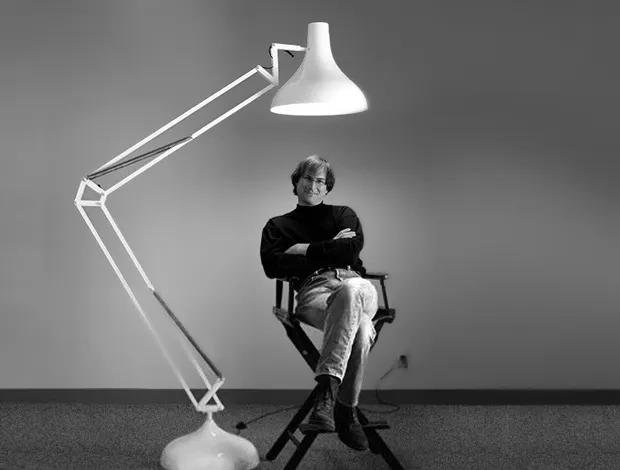
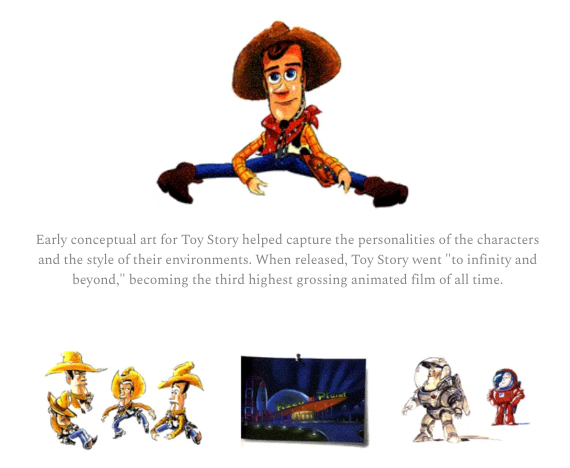
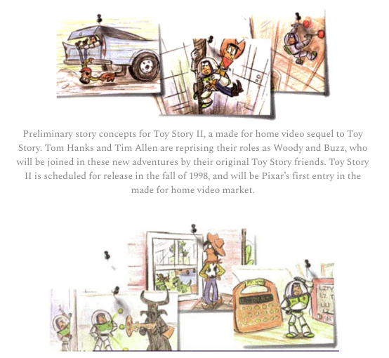

> 这封信是乔布斯在皮克斯1996年上市后，写给股东的**第一封年度信**，恰好是在他从卢卡斯影业手中将其独立出来、亲自投资创建皮克斯的整整十年后。当时，NeXT 刚刚被苹果收购，而皮克斯则成为了乔布斯的**唯一关注焦点**。这封信可以说是乔布斯写下的最具洞察力的作品之一，也是关于皮克斯这家**极具创造力的公司**最具价值的解读之一。皮克斯是独一无二的，而乔布斯作为一位改变了多个行业的创业者，他的视角同样独一无二。每次重读这封信，我都能从中学到新的东西。

**致股东信：**

亲爱的股东们：

1996年是皮克斯作为上市公司的第一个完整年度，而在本次年度报告中，我决定给你们写一封长信，完全意识到帕斯卡那句名言——“人们写长信，是因为他们没时间写短信。”我现在确实有时间（如今皮克斯是我全部关注的焦点），但我也确实有很多事情想告诉你们：1996年我们取得的卓越成绩，我们在去年与迪士尼秘密谈判达成的里程碑式协议，皮克斯目前正在进行的激动人心的项目，以及我们在打造世界一流动画工作室方面取得的进展。我们也为皮克斯制定了一项新的战略方向，它将指引我们迈入下一个十年。对于大多数公司来说，只有极少数时刻会迎来如此众多有利事件的集中爆发。而现在，皮克斯正处于这样的关键时刻，我为能够向你们详细讲述这一切感到无比兴奋。

**过去一年**

遵循年度报告的惯例，让我们先从刚刚过去的一年谈起。1996年我们取得了诸多成就——这一年极为出色。以下是一些最为显著的成果：

* 我们实现了2530万美元的收益，而1995年为160万美元，每股收益从一年前的0.04美元跃升至0.54美元。我认为这对于首次公开募股后第一年来说，是一份强劲的成绩单。也许我们1996年财务表现中最重要的一点，是它证明了皮克斯的商业模式是有效的。我们已经展现出自身具备带来可观收入和实际盈利的能力。

* 我们在1996年初的资产负债表本就十分稳健，主要得益于首次公开募股，到年末变得更为强劲。我们正谨慎管理你们投入皮克斯的资金。我们没有债务，而我们的现金投资在1996年间从1.44亿美元增长至1.61亿美元。这一强劲的现金状况，不仅增强了我们的持续能力，也让我们有机会参与联合投资制作项目，从而保留更多利润份额（稍后我会详细说明）。

* 《玩具总动员》自1995年末上映以来的持续成功，使皮克斯成为历史上第二家制作出票房大片动画长片的工作室（第一家是迪士尼，而且他们已经制作出多部）。1996年，《玩具总动员》成为有史以来票房排名第三的动画电影（仅次于迪士尼的《狮子王》和《阿拉丁》），美国本土票房收入为1.92亿美元，全球票房为3.6亿美元。《玩具总动员》的家庭录像带于1996年底发布，创下纪录的2100万盘录像带在假期期间进入美国消费市场，预计全球销量将超过3000万盘。

* 我们当然为《玩具总动员》的票房成绩感到无比激动，但我们同样为这部作品为皮克斯赢得的艺术认可感到骄傲：导演约翰·拉赛特获得特别奥斯卡奖，此外该片还获得了最佳剧本提名（涵盖真人和动画影片），由皮克斯编剧团队安德鲁·斯坦顿、皮特·道克特、乔·兰福特和约翰·拉赛特共同完成。这是动画片首次获得这一殊荣。

* 皮克斯在1996年还基于《玩具总动员》推出了两款互动CD-ROM产品，由迪士尼互动发行。两款产品表现都非常出色，迄今为止合计销量已接近一百万套。许多评论认为，我们的CD-ROM产品将动画与高质量计算机图像在这一媒介上带到了新高度。不幸的是，CD-ROM市场的整体增长速度并没有如许多人希望和预测的那样迅猛，因此我们在1997年初决定见好就收，退出该市场，将我们的人才重新投入主流影视制作项目中。

* 我们在1996年的一项重大成就，是新增了125名员工。去年我们工作室的规模扩大了70%，目前已拥有超过300名员工。在我们的行业中，成功不仅取决于拥有优秀人才，更取决于是否拥有一群极具天赋、甚至近乎独一无二的创意人才。这个行业对这些人才的竞争非常激烈，而在过去一年中，我们投入巨大努力去寻找并招募最优秀的人才，帮助我们建设工作室。

* 从个人层面讲，苹果在1996年末收购了Next软件公司，使我如今能够将全部精力（包括我的希望和梦想）都倾注于皮克斯的未来。我现在全职在皮克斯工作，并且乐在其中。

**与迪士尼的合作**

当我们为1996年划上句号时，皮克斯内部充满了巨大的成就感。过去一年，我们的关注点不仅仅在于眼前的工作，更在于那个艰巨的长期目标——**打造一家世界一流的动画工作室**。而这个未来愿景在两个月后的1997年2月24日显著地向前推进了一大步，那天我们宣布了与华特迪士尼影业公司达成一项重大的新十年合作协议。

在谈及这项新协议之前，我先回答一个显而易见的问题：如果皮克斯一切进展都这么顺利，我们为什么还需要一项新协议？我们已经与迪士尼签署了一项三部影片的协议，这将持续到2000年。而《玩具总动员》的成功也证明皮克斯拥有许多独特的优势，足以支撑我们长期的成功：无与伦比的创意团队、业内顶尖的技术团队、领先行业至少五年的尖端专有技术、全球屈指可数的、具备制作动画长片经验的制作团队，以及世界上最强的市场营销与发行合作伙伴——迪士尼。但即便拥有这一系列独特优势，我们仍缺少两项对于打造真正世界级工作室来说至关重要的要素。它们是什么？

首先是**更好的经济收益结构**。要实现打造“第二家伟大动画工作室”的愿景，我们需要从自己的作品中获得更大份额的利润，以加大对未来的投资，并为我们的股东带来更高的回报。虽然原先与迪士尼的合作协议是皮克斯迄今为止最幸运的事件之一，其财务条款对于一个初入主流行业的新秀而言极具吸引力，但迪士尼保留了超过85%的全部利润。要用10-15%的利润份额去打造一个世界级的事业，难度太大了。

其次是**品牌塑造**。我们认为目前电影行业中只有两个真正意义上的强势品牌——“迪士尼”和“史蒂文·斯皮尔伯格”。我们希望将“皮克斯”打造为第三个。成功的品牌源于消费者的信任，而这种信任来自消费者长时间以来对品牌产品的正面体验。例如，家长们信任迪士尼品牌的动画电影，认为它们能提供令人满意且适合家庭观看的娱乐内容，这种信任基于迪士尼在创作精彩动画电影方面毋庸置疑的成绩。这种信任既便利了家长的观影选择，也让迪士尼能更轻松、更自信地吸引观众观看其新片。长期来看，我们希望“皮克斯”成长为一个同样能承载这种信任的品牌。但要赢得这份信任，消费者首先必须知道是皮克斯在创作这些电影。因此，我们迫切需要在所有产品上显著强化皮克斯品牌的呈现。

新的迪士尼合作协议同时满足了这两项缺失的要素。根据以下核心条款，皮克斯与迪士尼将在未来十年内联合制作五部动画长片：

* 皮克斯与迪士尼将**平分所有影片及相关产品的利润**，包括家庭录像、周边商品、互动产品、续集和为家庭录像市场制作的续集。这意味着皮克斯获得的利润份额比原协议大幅提高。

* 合作出品的所有产品都将**以双方品牌共同署名**，无论是电影还是牙刷。这将让皮克斯的品牌在我们所有产品上与全球最受尊敬和信赖的迪士尼品牌**并列呈现**。

* 皮克斯与迪士尼将**共同出资**制作影片，而**营销和发行则完全由迪士尼承担**，同时收取的发行费用也远低于原协议。虽然我们要承担一半制作成本，相较旧协议中由迪士尼独自承担制作费用而言风险更高，但这也为我们换来了更高的潜在利润份额。这正是我们希望承担的风险——我们愿意为自己下注，因为影片正是由我们创作的。

* 原协议中的剩余两部影片将转为新协议的前两部影片。皮克斯将**比原先早至少四年**享受到新协议带来的好处，包括更高的利润份额和品牌共建。

* 最后，迪士尼通过购买一百万股皮克斯股票成为我们的股东，并承诺至少持有三年。如果他们全面行使认股权，未来可能拥有最多5%的皮克斯股份。我们热烈欢迎迪士尼加入皮克斯股东大家庭，并相信他们的投资体现了对皮克斯/迪士尼合作关系成功的高度承诺。

**战略岔路口**

为了让大家更好地理解这项协议对皮克斯长期发展的重大意义，我想带你们回顾一下幕后故事，回到1996年初。《玩具总动员》的上映以及随之而来的即时成功，使我们开始将视野扩展到不仅仅制作一部电影。我们希望建设一个完整的工作室，能够持续不断地推出成功的影片。经过大量思考，我们意识到自己站在一个**战略性的岔路口**。我们可以选择等待原先与迪士尼签署的三部影片协议完成，最后一部将在2000年交付，届时我们便可“独立前行”——完全由我们自己出资制作和营销，从而保留大部分利润。或者，我们也可以尝试与迪士尼重新谈判一项条件更优的新合作协议。

“独立前行”无疑是一个颇具诱惑力的选项，尤其是在《玩具总动员》成功带来的兴奋氛围中。但那样做将是一种**狂妄自大的尝试**。根据我们原来的协议，迪士尼负责所有的市场营销和发行费用，而对于一部高关注度的动画长片来说，这部分费用可能甚至高于制作成本。若选择独立运营，皮克斯将面临**成倍增长的财务风险**，每部影片的投入将是原来的两倍，而我们无法保证每一部作品都能获得成功。

我们还重新审视了自己的独特之处。当前市场上至少有六家制片公司具备大规模影片的市场营销和发行能力（迪士尼、华纳、派拉蒙、福克斯、索尼和环球）。但在历史上，只有**两家**公司曾制作出票房大片级别的动画长片（迪士尼和皮克斯）。而在此之中，只有**一家**工作室曾制作出一部完全由计算机动画完成的长片——那就是皮克斯。若为了涉足营销和发行而分散管理层精力，放弃我们在“只有皮克斯能做到的事情”上的专长，而去做我们完全是新手的事情——在我们看来，这是一个错误的方向。我们也不希望公司文化因此改变。皮克斯是一个由动画师、视觉艺术家、故事创作者、科学家、工程师和制片管理人员共同构成的独特组合。而发行则是一种完全不同的专业技能，我们担心在这个阶段将其融入公司会对文化造成干扰。**创作与销售是两回事。**

一旦我们决定与一个合作伙伴同行是最佳的长期战略，**我们毫无疑问的首选就是迪士尼**。因为他们，简而言之，是最好的。迪士尼在1937年凭借《白雪公主》发明了动画长片这一艺术形式，并此后制作了30多部动画长片。他们是世界第一的电影制片厂，1996年他们在全球票房市场的占有率超过20%，在家庭录像市场同样居于主导地位。更重要的是，我们与迪士尼的合作关系已经有十年之久。在制作《玩具总动员》时，他们作为宝贵的导师始终在我们身边。我们喜欢与他们共事。

最后可能还有一个问题：“**为什么迪士尼要与皮克斯签订这项新协议？**”我们相信，迪士尼比大多数人都更清楚**创作一部票房级动画长片有多么困难**。他们亲身参与了《玩具总动员》的制作，清楚这部电影所需的努力与投入，也见证了我们在下一部动画长片及其他未来项目上的进展。当我们宣布新的合作关系时，迪士尼首席执行官迈克尔·艾斯纳表示，动画长片是迪士尼品牌的核心——它们提供了故事、角色和场景，成为迪士尼主题乐园、商店以及其他营销渠道的衍生基础。与皮克斯的新合作关系，将在未来十年内为迪士尼带来五部新的动画长片，以及更多像胡迪和巴斯这样能够填充迪士尼魔法王国的新角色。

**现阶段进展**

说到这里，我们终于来到了“现在”。战略、商业模式、制作协议固然重要，但我们真正的工作是什么？皮克斯的员工每天早上（还有很多晚上）走进工作室时，正在从事哪些事情？我们正全力投入三个非常激动人心的重大新项目中，每一个都在将我们带入全新的方向。接下来我想简单向你们介绍一下每一个项目。

第一个项目是《虫虫危机》（暂定片名），这是皮克斯的**第二部长篇动画电影**，也是我们在新迪士尼合作协议下的**首部作品**。《虫虫危机》的故事灵感来自伊索寓言《蚂蚁与蚱蜢》。我们的影片讲述的是一个蚂蚁王国的故事：它们辛勤地为过冬储存食物，而每年都会有一群蚱蜢前来捣乱、抢走食物、然后离去。蚂蚁们终于忍无可忍，决定去找一些强悍的战斗型昆虫来帮它们在蚱蜢再次来袭时进行防卫。于是，它们派出了我们的主角——一只叫做弗力克（Flick）的蚂蚁，去外面的世界招募这些战士昆虫。弗力克本意是好的，但他阴差阳错地找来了一群失业的马戏团昆虫，而这些马戏团成员误以为自己被雇来表演。直到他们抵达蚂蚁王国时，才惊讶地发现自己其实是要上战场对抗蚱蜢。《虫虫危机》拥有引人入胜的故事、令人难忘的角色和丰富的幽默元素——这是《玩具总动员》成功的配方，而这一次我们再次延续这种创作风格。影片在视觉表现上也将焕然一新——我们将使用几乎是制作《玩具总动员》时**十倍的计算能力**，因此观众将看到前所未有的动画细节。目前我们已经为《虫虫危机》投入超过两年的时间，并按计划准备在**1998年假期档**上映。

第二个正在制作中的项目是《玩具总动员2》，这是《玩具总动员》的**家庭录像专属续集**，汤姆·汉克斯与蒂姆·艾伦将分别回归继续为胡迪和巴斯配音。在制作《玩具总动员2》的过程中，我们拥有一个巨大优势：可以直接使用我们称为“数字片场”的内容资产库——那是我们为原版《玩具总动员》制作时积累的大量计算机模型、场景、材质、表面效果和动作序列。虽然我们最近才公开宣布《玩具总动员2》，但实际上我们从去年夏天就开始筹备这个项目了。我们非常兴奋能够为观众带来胡迪与巴斯的新冒险，这也是我们工作室首次制作的**为家庭录像市场定制的续集影片**，预计将于**1998年秋季**发行。

**第三部作品**是继《虫虫危机》之后我们计划推出的下一部动画长片。目前我们已经为这个项目开发超过一年，并且它的前景非常令人期待。由于需要保护我们的故事创意，我此时还无法透露更多细节。我们希望这部影片能够在**2000年假期档**上映，也就是《虫虫危机》发布的两年之后。

随着这些项目陆续进入制作阶段，皮克斯显然需要不断扩大我们的团队规模。我们在1996年间从175人扩展到300人，计划在今年年底将工作室人数扩充到**400人**。我们在招聘上非常谨慎，力求只聘请最优秀的人才。一旦他们加入皮克斯，我们也同样用心地帮助他们迅速融入，成为高效的团队成员。每一位新入职的动画师或技术总监，都会立即进入“皮克斯大学”进行学习。这是一个为期三个月的课程，由经验丰富的皮克斯员工设计并授课。我们在去年创立了皮克斯大学，本月将迎来第三届毕业生。

我们也十分重视**持续学习**，这也是为什么皮克斯一直保留着制作**动画短片**的传统。今年的短片作品是《老人与棋》（*Geri’s Game*），讲述一位老人（Geri）在公园中独自下棋的故事。我们视这些短片为对创意与技术能力发展的**投资**——是我们工作室研发（R\&D）的一部分。例如，《老人与棋》的技术研发，在皮肤与布料的计算机动画方面取得了突破，而这两个领域对皮克斯来说至关重要。我们已经开始将这些技术进步应用到《虫虫危机》和《玩具总动员2》中。而且，正如约翰·拉塞特在执导《玩具总动员》前，曾通过五部短片磨练导演技巧，我们也正在通过每年持续推出一部短片来**投资皮克斯的未来**。

**核心能力**

除了从具体项目来观察皮克斯的发展，我们还可以从另一个维度来看——是什么能力让我们能创造出这些作品？我们相信，**构建一家世界一流动画工作室**，必须具备三项核心能力：**创意、技术和制作**。在过去十年中，我们持续在这三大领域培养深厚的人才储备。下面我将一一介绍。

首先是**创意**，它是一切工作的核心。虽然皮克斯被公认为计算机动画的先驱，但我们业务的本质，其实是讲述**引人入胜的故事和塑造令人难忘的角色**。我们工作室有一个铁则：**再多的技术也无法将一个糟糕的故事变好**；同样，无论技术多么惊艳，如果没有动人的故事，也无法吸引观众超过五分钟。《玩具总动员》、《虫虫危机》、《玩具总动员2》以及我们正在开发的新片，这些原创故事**全部来自皮克斯的导演与故事团队**。这种能力极其罕见，也成为了我们工作室的标志。一旦我们拥有了一个有吸引力的故事，接下来的创意挑战，就交由我们的动画师、视觉艺术家、布局师、灯光师和剪辑师将其变成视觉现实。他们中的许多人都是行业顶尖。

我们的创意团队现在已经超过100人，拥有真正的人才深度。例如，参与《虫虫危机》制作的一位员工拥有**计算机生成植物的博士学位**！要找到这样的创意人才并不容易，我很高兴地告诉你们，现在我们**越来越多的人才是在皮克斯内部培养出来的**。例如，《玩具总动员》的编剧之一、也是关键故事创作人员的安德鲁·斯坦顿，现在是《虫虫危机》的**联合导演**，与约翰·拉塞特并肩合作。而《玩具总动员》的动画导演之一阿什·布兰农，现在则是《玩具总动员2》的**导演**。我们相信皮克斯是行业内最出色、也最受向往的**创意人才孵化基地**之一。

**第二项核心资产是技术**——更准确地说，是我们的技术团队以及他们所开创的技术。《玩具总动员》之所以获得巨大赞誉，其中所使用的计算机动画技术完全是皮克斯的**自主研发专有技术**——是我们自己发明的，而且**不对外出售**。我们的研发团队和技术总监持续开发新的技术，专注于推进我们的电影艺术创作。例如，基于制作《玩具总动员》过程中获得的经验，我们列出了一份包含**超过1500项改进**的清单，旨在让我们的计算机动画系统更加完善。这些改进现在已被整合进我们为《虫虫危机》所使用的软件中。在计算机动画这个全新的世界里，创新的空间巨大，而我们拥有全世界最具天赋的员工，正在努力保持皮克斯处于行业领先地位。

我们的高级计算机动画技术还为皮克斯带来一些**也许出人意料的优势**——它节省时间，使我们成为**高品质长篇动画电影中成本最低的制片方**，并帮助我们的动画师更好地完成工作（正如任何优质技术应有的作用一样）。传统的赛璐璐动画师必须投入大量时间进行绘画，因为一部典型的动画长片中，每一帧（以每秒24帧、75分钟计算，超过10万帧）都需要**逐帧手工绘制**。而在皮克斯的计算机动画中，所有的绘图工作都由计算机完成——**数百台速度极快的计算机**。这个过程带来了两个与传统动画截然不同的重要变化：

第一，它将我们的动画师从绘图工作中解放出来，使他们可以**专注于表演**——在角色运动中注入生命。这也让皮克斯能够聘请一些**不一定擅长绘画、但具有出色表演天赋的动画师**。我们的动画师甚至会接受**表演训练**。

第二，我们的计算机平均为每一帧**绘制三个小时**，三小时可以呈现极为丰富的细节。这种细致入微的图像效果，是皮克斯影片呈现出**独特三维质感和细腻纹理**的关键，而这些在传统手绘动画中是难以实现的。

**第三项能力是制片管理专长**，涵盖从故事构思到最终影片交付的**整个动画长片制作流程**。这个流程可以划分为大约17个不同阶段，整个任务极其复杂，需要对**超过150位员工的详细协调**、对**5000万至1亿美元预算的精密管理**，同时还要将导演的艺术愿景与必须按时、按预算完成影片的商业现实相融合。

随着我们从单一项目扩大为三部同时制作的作品，这一制作挑战也随之升级。幸运的是，我们成功建立了一支强大的制片管理团队。为了领导这支团队，我们最近成功聘请了**莎拉·麦克阿瑟（Sarah McArthur）女士，她此前是迪士尼动画长片部的制片副总裁**，如今担任皮克斯的制片副总裁。莎拉是目前动画行业中最资深的制片领导者之一。

负责统筹和协调这些核心能力的，是皮克斯的**高管管理团队**：

&#x20;       •        执行副总裁兼首席技术官：**埃德温·卡特姆尔（Edwin Catmull）**

&#x20;       •        执行副总裁兼首席财务官：**劳伦斯·莱维（Lawrence Levy）**

&#x20;       •        创意副总裁：**约翰·拉塞特（John Lasseter）**

&#x20;       •        制片副总裁：**莎拉·麦克阿瑟（Sarah McArthur）**

&#x20;       •        以及我本人

虽然我们在管理整座工作室方面仍算相对新手，但在各自的专业领域中，我们都具备丰富经验，并且作为一个团队，我们在**管理计算机动画工作室方面的经验比业内任何其他团队都要丰富**。

**展望未来**

尽管如此，在我们建设工作室的过程中，前方的道路仍不可避免会有一些波折。虽然我们将从每一部影片中保留**更大份额的利润**，但并不能保证每一部作品都会成为票房大片。而且，我们的收入本就不稳定，是一种**间歇性爆发式收入**，通常在每一部成功长片及其家庭录像发行后出现。我们预计《玩具总动员》的收入高峰将在1997年逐渐减弱，而下一波收入高峰将出现在**1999年**，跟随《玩具总动员2》和《虫虫危机》在1998年底的发行。因此，1998年我们将面临**收入显著下降和盈利亏损**，而如果《玩具总动员2》和《虫虫危机》如我们所希望的那样取得成功，那么1999年将迎来创纪录的盈利。我知道，无法实现季度甚至年度之间那种传统意义上的**递增式增长**，一定会令某些投资者感到焦虑。但我们的衡量单位是“电影”，**而不是季度**，而我们坚信：在将皮克斯打造为一个独特而珍贵的娱乐资产的过程中，我们正在为股东创造**长期价值**。

几年前，迪士尼重新发行了《白雪公主》——这部开启一切的动画长片首作，距今已有60年。我家也有一份这部影片，我们的孩子们都非常喜欢。事实上，我不认识有谁不知道或者不喜欢《白雪公主》的故事。**最优秀的动画电影，已成为我们当代的神话**。在皮克斯，我们希望创作属于这样的神话——能够俘获一代又一代人心灵的故事。我们希望我们的电影，**在60年后依旧会被观看与热爱**，就像今天的《白雪公主》一样。

展望未来，我们工作室内充满了**明确的使命感与创作激情**。我们的愿景非常清晰：凭借我们在全新媒介——计算机动画领域的独特地位，建设“第二家伟大的动画工作室”。我们的挑战也已明确：**在未来十年内制作五部伟大的影片**。我们已经拥有完成这一目标所需的全部要素。如果我们能做到，其艺术与财务上的回报都将极为丰厚，因为**没有比能够世代传承的资产与遗产更珍贵的了**。

史蒂夫·乔布斯

董事长兼首席执行官

（全）

