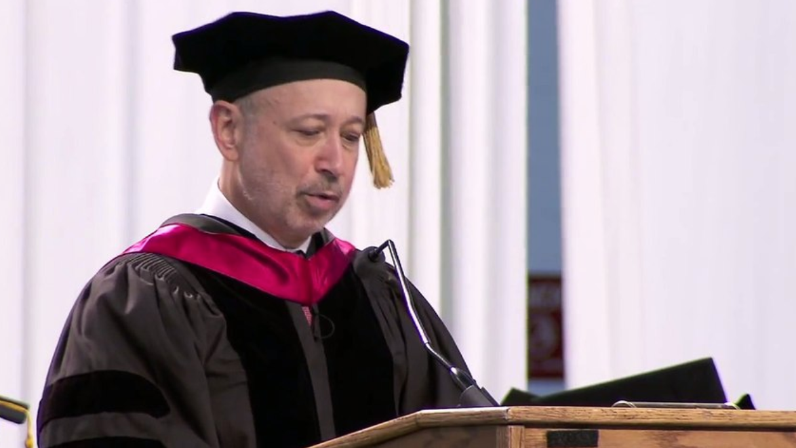

梅洛校长、尊敬的教师、朋友们、家人们，以及2013届的毕业生：

今天能够与你们共同分享这份成就与骄傲，是我莫大的荣幸。但我必须坦白，我在准备这次演讲时感到有些忐忑。我想，毕业演讲可能是人类交流中最严肃地发表、最专注地聆听、却又最快被遗忘的一种形式。

所以我会尽量简短而实用。我的建议源自我个人的经历。而我的经历，在许多方面，其实与你们的经历并没有那么不同。

我成长的环境里，大学更多是一种憧憬而非预期。我目睹父母为生活辛苦挣扎，这种日复一日的求生之战，有时甚至耗尽了他们对我所抱有的希望与梦想。他们没有上过大学，我唯一的哥哥也没有。

我父亲在邮局分拣邮件。他上夜班，因为夜班工资比白班多10%。我母亲是防盗报警公司的一名前台接待——那是我们街区为数不多的增长型行业之一。我是在林登公寓长大的，那是位于东纽约的一个保障性住房项目，一些人可能知道那里。

那是一个严峻的社区，至今依然如此，尽管它也培养出了一些杰出人士，他们或因背景所致，或逆境奋起，取得了成功。我就读于托马斯·杰斐逊高中，该校现在已不再作为高中运行，而是改办为各种技能培训项目。高中之前，我与大家庭同住在一间狭小的公寓里，成员包括我的祖母、姐姐和外甥。

但回头看，我是在一个充满无限机会的世界中长大的。每天晚上我都会阅读，而阅读为我打开了世界的大门。我热爱读历史，尤其是传记。在传记中，你几乎总是读到一些起初毫不起眼、最终却拥有重要人生的人物。

我最喜欢传记的一点是：你读到的这个人在书的前五十页时，尚未意识到自己在三百页时会取得的成就。他们无法预见未来的伟大。如果你想一想，这正是你们应对未来人生充满乐观的最佳理由。你们每个人都正处在自己人生传记的第50页，还有数百页等着你们书写。

小时候，我最大的目标就是离开东纽约。我参加了大学入学考试，并全力以赴争取进入大学。我做到了。离开纽约市去上大学那天，是我人生中第一次真正离开这座城市。

大学对我而言是一个令人望而生畏的地方。其他学生似乎天生自信，很多人游历广泛，对世界了解甚深。直到今天，我依然无法忘记那种自卑感，但也正是它促使我更加努力。

一旦我意识到我属于那里，我便变得更有野心。野心，是你内心的声音，告诉你可以并且应该突破环境或身份的限制。你们已克服了种种障碍、压力与自我怀疑，而你们之所以能做到，是因为你们有野心。你们希望为自己、为家庭赢得成功。而实现这一切，最强大的手段莫过于教育与知识。

我为拉瓜迪亚学院与高盛的合作而感到自豪，我们一起支持小企业发展。通过这一合作，我亲眼看到许多拉瓜迪亚的学生在兼顾学业、工作与家庭责任之间努力坚持。

今天你们能站在这里，已经证明你们属于这个舞台。而既然属于，就要用野心去滋养它。这意味着要专注、有纪律、有要求、自我反省、并保持开放心态。你们的挑战不会就此消失，实际上，它们可能会更加陡峭。

朋友们，这就是人生。但正如挑战巨大，回报也将同样丰厚。换个角度想：你真的有选择吗？你们早在踏入拉瓜迪亚的第一天就已经知道答案了。我们有责任为自己和家庭不断奋斗。

现在的经济时期无疑不算轻松，但经济总是有周期的。在你们未来的五十年人生中，会见证许多周期，就像这一次，你们也会挺过来。不要陷入不切实际的乐观，或脱离现实的悲观。

但事情的变化往往迅速而剧烈。你们的安全感，应建立在掌握多种技能并做得比别人更好的基础之上。

而这种知识与能力，只有通过愿意去追求更好事物的勇气才能获得。这可能意味着转换职业路径，也可能是在当前岗位上推动一个新点子或策略。无论是哪种情况，都要推动自己尝试新事物，并在每次变化中获得成长。

大学毕业后，我去读了三年法学院，然后进入了梦想中的大纽约律师事务所工作。但尽管那曾是我的梦想，到了那里我却不喜欢它。

那是我第一次感到经济上相对安稳，但我清楚自己对这份工作缺乏激情。正因为我不热爱它，我永远无法从中获得真正的满足，也无法做到出色。热爱这份工作的人会更投入，更专注。对他们而言，那是乐趣；对我而言，只是一项苦差。

在律所干了五年后，我决定尝试不同的事情。我回到家告诉妻子我打算辞职，她哭了——不是因为高兴。无论如何，后来一切都顺利了。我进入了一家华尔街小公司，我们被一家更大的公司收购，最后我留在了这家大公司……高盛。

在我的职业生涯中，有幸与本国众多顶级CEO与商业领袖共事。我总是被一种特有的激情所打动。尽管他们富有又有权势，但他们的激情超越了金钱与权力。

我不会站在这里告诉你们这些东西不好。它们可以非常美好，但前提是你有更大的目标。如果你对工作没有热情，或者缺乏为子女创造更好生活的动力，那么你将没有足够的动力坚持下去。

所以，我想给你们留下几条具体建议，希望能助你们一臂之力：

**第一，自信真的很重要**。要意识到你们已经赢得了自信的权利。你们中的大多数人为了走到今天，做出了巨大牺牲，克服了重重障碍。你们建立起了许多经历相对轻松的人所没有的“肌肉”。这些“肌肉”将在你们一生中发挥作用。

我为上大学、完成大学所付出的挣扎，最终成了我的优势。你们所经历的劣势，会成为你们人生轨迹与个人历史的一部分，日后也会成为你们的优势。因此，自信是合理的。

**第二，找到一份你喜欢的工作**。你会做得更好，也能做得更久。当然，在经济不景气或家庭压力的情况下，你可能无法轻易冒险选择工作，毫无疑问，我们每个人在人生中都曾“将就”过。

但，不要让某一时刻的不得已成为一生停滞不前的借口。不断努力，让自己走到合适的位置。如果我一直做律师，我也许还能坚持一段时间，但最终我会因为不爱它而熄火。

**第三，做一个全面而完整的人。**&#x4F60;们中很多人还会继续深造或职业培训。固然，要学习谋生所需的技能。但，别忘了阅读、了解历史、文学以及当前事件。

你会变得对他人更有吸引力，对自己也更有趣，你的工作表现也会更出色。我读过的大多数书籍都与我的工作或行业没有直接关联，但我却在意想不到的时刻用到了它们的教训。

**第四，参与社区。**&#x5BFB;找方式去做出贡献，让自己感到骄傲，也为子女树立榜样。谋生不是生活的全部，它只是手段，不是终点。你必须对自己感到自豪。总会有人在挣扎，无法从事社区工作，但你要尝试。

多年来，我为自己努力了很多。但我年纪越大，越能从为他人服务、帮助他人中获得满足。事实上，我最初就是通过“1万家小企业”项目认识梅洛校长及拉瓜迪亚学院的。

**最后**，请理解生活充满变数，所以不要对可能性关闭心扉。**努力让自己身边围绕着同样有雄心的人**。把自己放在可以成长的环境中——一个你不仅能推动自己，也会被他人推动的地方。

一个来自贫民区的孩子最终领导了世界上最伟大的金融机构之一——这有什么可能？你永远不会知道。正是这种不可预测性让生活如此美妙。你会改变，世界也会改变。你们生活在一个仍然充满巨大机遇的国家。对这个世界保持开放。你们拥有雄心、智慧与坚韧。所以，翻开你们传记的新一页吧——你们的人生刚刚开启了新的篇章。

祝你们好运，祝贺你们和你们的家人。

