**第一部分** **巴菲特：“永远不要赌美国输”**

**沃伦·巴菲特：**

这是伯克希尔哈撒韦公司的年会。不过这看起来不像是（一般意义上的）年会，因为我60年的搭档，查理·芒格，今天并没有坐在这里。我想大多数来参加我们会议的人都是来听查理演讲的。但我想向你保证，96岁的查理身体很好。他的头脑和以前一样好。他的声音一如既往地坚定，但让他来奥马哈参加这次会议似乎不是个好主意。查理，查理已经适应了新生活。他把Zoom添加到他的每日日程中。他每天都要和不同的人开会，在技术的理解上，他比我超前。但我想，这真的不是一个什么巨大的成就。但无论如何，我要你向你保证，查理身体很好，他明年会回来的。我们将努力在明年的股东大会中将一切恢复正常。

负责保险业务的副董事长阿吉特·贾恩（Ajit Jain）目前在纽约。同样，对他来说，前往奥马哈参加这次会议似乎并不值得。但在我的左边，我们有格雷格·阿贝尔（Greg Abel）。格雷格是副主席，负责除保险以外的所有业务。因此，格雷格管理着一家收入超过1500亿美元、横跨数十个行业、拥有30多万名员工的企业。他已经干了几年了。坦白说，如果我没有阿吉特和格雷格处理的职责，我未必能够做到像现在（这么好），我现在的工作量只有两年前的1/4。所以我要感谢格雷格，随着会议的进行，你们会更多地接触到他。

会议将分为四个部分，稍后我将进行发言。第一部分是我用幻灯片展示的“独白”。我以前从来没有真正用过幻灯片。从21岁到88岁，我也曾断断续续地教过大学课程，但我从来没有用过一张幻灯片。但谁规定的“你不能教一只老狗新把戏”呢？所以今天就让我们来看看。今天我有很多幻灯片，我想让你们看一看。我们将在一分钟后开始第一部分，然后我们将简要回顾伯克希尔第一季度的业绩。

现在我们已经把这些放在10Q上了，我们是在今天早上发布在互联网和berkshirehathaway.com上的。这里面有很多很多的细节，所以我就不赘述了。不过，我会指出一两件你们可能感兴趣的事情，实际上我会讲一点我们在4月做的事情，而这对伯克希尔来说是新的。然后我们将举行正式会议，这可能需要15或20分钟。然后我们将去找贝基（BeckyQuick，CNBC主播)，她会问我和格雷格几个小时的问题——我听说她是从她收到的一大堆问题中挑选出来的。卡罗尔卢马斯（Carroll Lumas）和安德鲁罗斯索金（Andrew Ross Sorkin）以及贝基都收集了问题，但为了简化流程，我们事先把贝基要问的问题都整理好了。就像我说的，我们会回答几个小时的问题，目前没有具体的截止时间。我们就等着看事情如何发展了。

当然，在过去两个月左右的时间里，每个人都在思考美国的卫生健康状况如何？以及未来几个月甚至几年美国的经济状况如何？对于卫生健康知识方面，我真的没有什么好补充的。因为在学校里，我的会计成绩还可以，但我的生物学却一塌糊涂。我和你一样在学习正在发生的这些事情。

我个人认为，能够聆听一年前我还不认识的福西医生（Dr. Fauci）的演讲，我感到非常高兴。但我认为我们非常幸运——就美国而言，能拥有这样一位79岁高龄的老人，他一天24小时都能工作，而且还能保持幽默、客观的态度，把一些非常复杂的事实简单明了的告诉公众，告诉你什么时候他知道什么时候他不知道——这是非常幸运的。在今天下午，我不会谈论任何政治人物或政治话题，但我觉得我需要对福西医生表达一个巨大的感谢。福西医生教育并提醒我们关于正在发生的事情——实际上还有我的朋友比尔盖茨。我从他们那里得到及时、正确的消息。所以谢谢你，福西医生。

当疫情发生，当我坐在这个有17或18,000个空座位的礼堂里时——我最后一次来这里的时候，这里完全挤满了人——当时是克雷顿和维拉诺瓦比赛，这有17或18,000人。这曾经坐满了人，而现在一个人也没有。当时是在1月份，当时所有人都认为“疯狂三月”会如期举行。就整个国家所有人的行为和心理而言，这是一个巨大的转变。这很戏剧化。当我们开始这段我们并没有要求的旅程时，在我看来，无论在健康方面还是在经济方面，这都会造成各种各样的可能。在美国，一边是5级防御状态，另一边是1级防御状态。当然，没有人真正知道所有的可能性，他们不知道什么概率因素会有所影响。

但在这种特殊情况下，在我看来，在卫生健康方面可能发生的事情非常多，在经济方面可能发生的事情也非常多，而它们之间相互交叉，相互影响。所以当事态继续前行的时候，它们会互相碰撞。我要再说一遍，关于疫情我不知道更多的情况，但我确实认为，在当前范围下各种各样的机会和可能性都越来越集中了。我们知道我们没有遇到最好的情况，但我们也知道我们没有遇到最坏的情况。这种病毒最初是很难发现的，而且后续也很难评估。关于病毒，我们学到了很多东西，也发现了很多我们不知道的东西，但至少我们已经了解了一些我们不曾了解的东西。我们有一些非常聪明的人正在努力工作，我们是边做边学。

但这种病毒显然具有很强的传播性。但从积极的方面来说，它还没有像1918年的西班牙流感那样致命。1918年，我们遇到了西班牙流感，我父亲和四个兄弟姐妹以及他的父母都经历了这一过程，在3月15日的奥马哈世界先驱报上有一个很棒的故事，在omaha.com上可以看到，它也在谷歌的第一页可以找到。当时的报道写道，在奥马哈，在大约四个月的时间里，西班牙流感在奥马哈造成了974人的死亡，这占当时人口的0.5%。而这一数字与全国各地相比并没有太大差别。所以你想一下，如果现在人口的0.5%，大约1,700,000人，这就是最坏的情况。幸运的是，我认为你几乎可以排除它与西班牙流感一样致命的可能性。但它非常非常容易传播。我们当然遇到了问题，我们不知道到底有多少人现在被传染了，包括有症状的和无症状的。

但无论如何，疫情在卫生健康的影响范围有所缩小，但疫情对经济的影响仍非常广泛，目前还不完全知道（影响的深度）。我们不知道当你自愿关闭和隔离你的整个社会的很大一部分的时候，经济会发生什么。在2008年和2009年，我们的经济列车脱轨了，目前有些行业也被从“轨道”上拉下来了。因此，银行和一些行业的表现不佳是有一些原因的。这一次我们把火车从轨道上拉下来，把它放在一边，我在这方面没有见过任何类似的情况——要知道，美国作为世界上最重要的国家之一，生产力最高，人口众多。实际上，疫情会使经济和很多劳动力靠边站，而且显然不可避免地会造成巨大的焦虑，并改变人们的心理和行为。可以理解的是，在经济和生活方面，已经有很多人有点迷失了方向。

这是一个相当大的实验，我们可能很快就会知道大部分问题的答案。但一些非常重要的问题，我们可能很多年都不知道答案。所以它仍然有各种各样的可能。但即便如此，我还是想和你们谈谈这个国家的经济前景，因为我仍然坚信这一点——我在第二次世界大战中就确信这一点，我在古巴导弹危机、9/11、金融危机期间也确信这一点——我确信没有什么能够阻止美国前进。虽然我们还没有遇到过像这次疫情一样问题，但我们过去也曾面临过很多巨大的问题——事实上，我们在美国奇迹中遇到了很多更棘手的问题，但最终，美国都化危为机。这次，美国也将再次前进。

我想带大家回顾一下我自己的案例。如果你要选择一个出生时间和一个出生地点，你不知道你的性别是什么，你不知道你的智力是什么，你不知道你的特殊才能或缺陷会是什么。但如果你能选择一次，你不会选1720年，你不会选1820年，你也不会选1920年。你会选择今天，你会选择美国。当然，有趣的是，自从1789年乔治·华盛顿宣誓就职时美国成立以来，人们都想来这里。你能想象吗？231年来，总有人想来这里。

**图1：美国成立至今231年，巴菲特和芒格年龄加起来185岁**

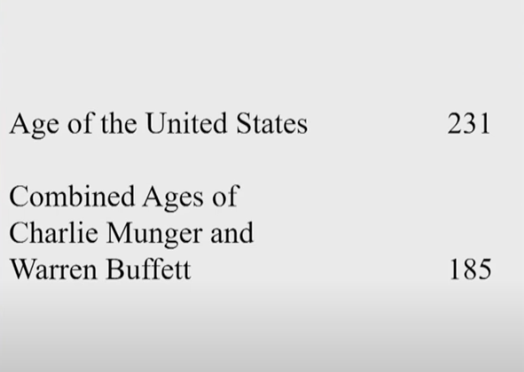

我的朋友，我想我只是有一点点操之过急。我正在放幻灯片。但我会在我们会议进行的过程中调用一些幻灯片。但是在幻灯片一上，关于这个国家有趣的事情是什么？我们来看看。这是一个非常年轻的国家。现在我把它和几个很老的人做比较，比如当你考虑到查理和我的年龄，我们的生活经历。然后我们再加上这个年轻人，格雷格·阿贝尔。我们的岁数加起来超过了美国，可见我们是一个非常非常年轻的国家。但我们所取得的成就是奇迹。你们想想，231年只是历史长河上的一小部分。

**图2：1790年美国人口情况**

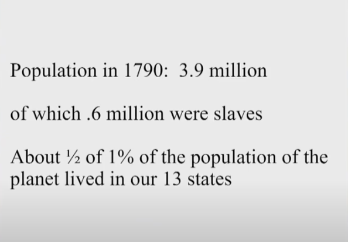

如果我们看第二张幻灯片，我试着估算一下……好吧，让我们倒回去。继续看第二页，但1790年的人口，我们全国人口有390万。有趣的是，当你查阅人口普查数据时，你会发现他们1921年在美国商业部大楼发生了一场大火，他们丢失了很多人口普查记录，所以可能有一些数据和事实有一些差距的。但是在1790年，美国有390万人。事实上有60万-70万的人是所谓的奴隶。而当时390万人，约占地球人口的0.5%。

如果你问了这390万人中任何一人，他们都无法想象231年后的生活会是什么样子，哪怕是最乐观的人。即使他们可能喝了很多酒，吃了一点大麻，在他们最疯狂的梦想中，他们仍然不会想到，在查理、我和格雷格三人的有生之年中，能够看到有2.8亿辆汽车在道路上行驶；拥有把人从4万英尺远的一侧海岸送到另一侧海岸，却只需要5个小时的飞机——也许在今天坐飞机的人少了很多，但它们会再回来的；各种伟大的大学会在一个接一个的州存在；拥有完善的医疗系统；拥有以一种在18世纪90年代无人能想到的方式传递给人们的娱乐方式等等。231年来，这个国家超越了任何人的想象。

**图3：200多年前的一些数据**

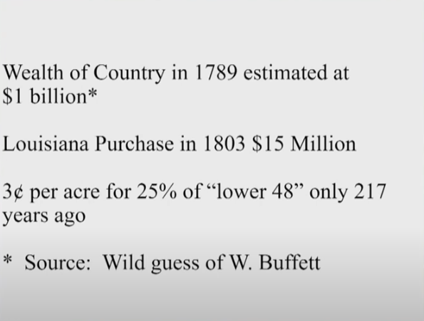

我上网做了一些准备，请看下一张幻灯片。我试图找出1789年，也就是我们国家的起点，美国的财富是多少。我以“美国财富”作为关键词进行了搜索。我搜索1789年、1790年的数据。我想搜索一个完整的年份来说可能会容易一些，但大概有400万的参考文献出现了。我没有看过全部的400万的文献，但我可以告诉你，那些早期在许多方面的数据收集与今天完全不同。你真的找不到我认为可靠的数字。你可以找出这个国家有多少骡子之类的东西，然后试着把它们加起来。但是在房地产领域，当你看房子，公寓或者办公大楼的价格，它们彼此之间都有一点点不同，但是它们主要看的是可比销售。

所以，在很多数据都是估算的情况下，很难找到准确的全国性数据。但回过头来想想，1803年我们花了1500万美元买下了路易斯安那州，这很有趣。这比1789年晚了一点，但这是最好的对比，就像他们在房地产中说的那样。无论如何，这是我们能找到的最好的土地价值的数据。顺便说一下，当我们购买路易斯安那州的时候，大约800,000多平方英里，这相当于美国本土48个州的总面积的四分之一。因此，我们在1803年用1500万美元买下了全美国的四分之一。如果你住在德克萨斯，如果你的祖父即将去世，他可能会对他的子孙后代交代遗言说，“不要出售采矿权。”法国人在那笔1500万美元的交易中，顺带把采矿权也卖给了我们。所以我们得到了整个堪萨斯州，得到了基本上是整个俄克拉荷马州，自从购买以来，在那里我们生产了大约210亿桶石油，生产了大量的天然气。

其中一个插曲是，我们为路易斯安那州的收购支付了1500万美元。其中的300万，也就是20%，我们以20万盎司的黄金，每盎司价值15美元进行支付。这就是法国人拿走的300万。作为路易斯安那州收购的一部分，我们得到了南达科他州，以及那里的金矿——在它关闭之前，生产了远远超过4000万盎司的黄金，总价值约为600亿美元。就像我说的，20万盎司的黄金占了我们购买总价的20%。因此，路易斯安那州的购买是一个很划算交易，当时800,000平方英里土地的价值，我猜，在那个时候，是每英亩3美分。所以，我通过研究不同的数字，比如上一张幻灯片中的数字，作为对1789年国家财富的合理估计。我想，当时国家总财富在10亿美元左右，并不会是一个疯狂的数字。现在，如果我是一个院士或什么的，我可能会得出当时的国家财富在11.074亿美元这样精确的数字，我会让它看起来很体面。但这都只是胡乱猜测。但我猜的10亿美元不是一个疯狂的数字。

**图4：2020年全美国财富**

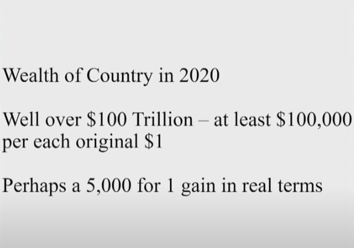

那么发生了什么，让我们转到下一张幻灯片，关于自那时以来这个国家的财富？这里我们有一些经常定期出现的数据。这些数据确实定期出现在美联储，他们会定期出来估计美国人的净家庭财富，涵盖所有美国的家庭。你可以查一下。你会看到，我们现在有30万亿的股票。还有些什么？有8200万左右的自有单身家庭，可能还有4500万出租公寓等等各方面的数据。所以把所有这些加起来，美联储告诉我们，我请你们看一下数据。挺有意思的。我们现在在美国，在231年后，我们有大概超过100万亿的家庭财富，尽管股市自上一季度报告以来有所下跌。

尽管你可能会说，“我们经历了很多通货膨胀”，但实际上，在美国，在我们几个人的前半生里，我们真的没有遇到那么严重的通货膨胀。我们经历了通货膨胀时期和通货紧缩时期，但总体价格水平并没有发生显著变化。但我在计算中，我再次假设一次20倍的通胀——实际上这个通胀涨幅程度比许多商品的价格变化都要低，不过很难衡量和讨论不同种类产品的等价收益以及成本。但我认为有理由说，美国的实际财富增加了5000倍以上，这真的是令人兴奋。在一个最初只拥有0.5%的人口和一大片未开垦的土地的国家里，以实际价值计算，有5000倍以上的财富增值，在231年里实现这一愿景，不可否认，这超出了任何人最初的想象。

**图5：1863年美国总统在葛底斯堡讲话**

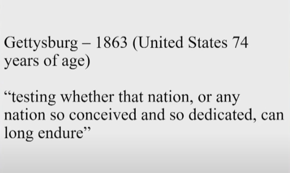

但这还没完，这很重要，因为我们现在遇到了困难。这231年里，美国并不是一帆风顺，稳步发展。事实上，我们的这个国家一直处于成长过程中。72年后，在1861年，我们有大约3100万人。统计显示，美国当时大约有3100万人，其中400万人是奴隶。而1789年的建国后所涉及的未完成的事业（指黑奴解放和平权运动等），稍后我们将对此进行更多的讨论。但是我们有很多国家没有经历过的事情，如果你在1789年告诉人们，在72年后，你们可能会面临分裂的危机（注：指南北战争）——当时的美国总统（林肯）在葛底斯堡发表著名演说，“如今我们卷入了一场巨大的内战，以考验我们或任何一个受孕于自由和献身于上述理想的共和国是否能够长久生存下去”——想象一下，美国总统大声地想知道他所领导的国家是否能够长久存在，而这只在建国74年后。

**图6：南北战争期间的一些数据**

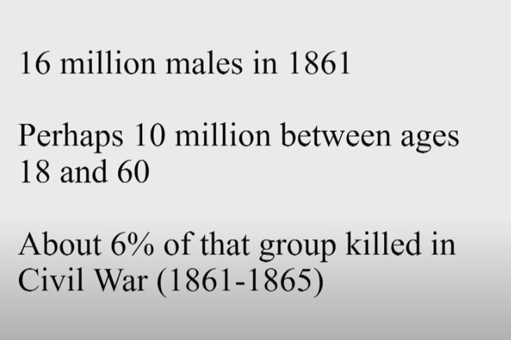

所以，当这个美国奇迹正在上演到大约三分之一的时候，我们面临着一个决定性时刻，我们进入了一个竞赛，如果我们看下一张幻灯片，我做了一个大概的估计。这实际上导致美国约6%的18岁至60岁男性的死亡。我假设战争中有60多万人死亡。我认为这是一个合理的估计，因为18岁到60岁的男性占了当时最大的人口比例。想象一下，一个国家6%的壮年男性在四年内死亡。所以当我们看到这个国家的进步，想到我们自己的问题时，我只是想你们思考一下，然后我们将进入下一张幻灯片。

**图7：相当于2020年400万成年男性的死亡**

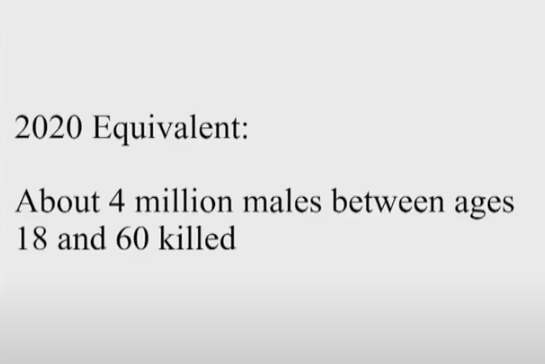

这相当于在今天，在同一年龄组中有大概400万男性死亡。因此，这是一个令人难以置信的打击。尽管如此，这个国家在编纂这个世界奇迹之一的美国梦时，还是成功地解决了这个问题，从很多意义上说，这也许是世界上的奇迹之一。

**图8：1929年9月3日道琼斯工业指数**

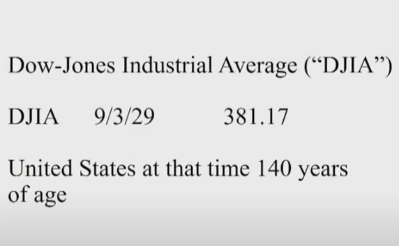

让我们继续看另一场不同类型的危机，它袭击了这个国家，这当然就是1929年的大崩盘。这导致了大萧条。这里是道琼斯平均指数，我们会用到它。当时其实大家关注的就是这个。如果你看报纸，当时第二重要的指数，是纽约时报指数（the New York Times average），它现在已经消失了；当然，标准普尔指数（Standardand Poor's）可能是一个更好的衡量标准。但道琼斯工业指数是一个完全合适的衡量标准。1929年9月3日，道琼斯平均指数收于381点。当时人们非常兴奋，都在用保证金购买股票，似乎一切看起来都非常好。

**图9：1929年11月13日道琼斯工业指数**

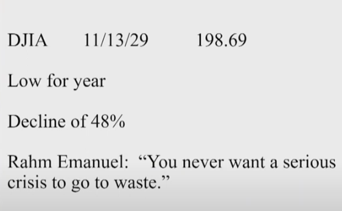

不管你信不信，随着汽车时代的到来，航空旅行时代的到来，各种各样的新电器和电话得到了更广泛的使用，咆哮的二十年代给人一种很好的感觉。当时的市场是一个让人快乐的地方。但是，好戏就要开始了。然后，如果我们看下一张幻灯片，我们来看看在9月3日之后的几个月里发生了什么——道琼斯平均指数几乎被腰斩，这是相当令人印象深刻的。直到我们最近，我们的股市在更短的时间内，下跌了大约三分之一。但是这次危机，有一本关于这次大崩溃的书（写的很好），那是约翰·肯尼思·加尔布雷斯（John Kenneth Galbraith）写的《大崩盘》（The GreatCrash）。

对了，让我插一句，奥马哈有很多小企业，我讨厌这次会议的做法，或者说如此戏剧性的改变对奥马哈的许多企业造成的影响，因为我认为我们之前股东大会的模式对奥马哈的很多小企业是有益的，我们是真正的受益者。这些小企业在伯克希尔的股东大会上获得了很多生意，虽然他们在未来也会恢复，但他们在这样一个时期遭遇了困难，而这也是一段可以载入史册的困难时期。

好吧，如果你买了任何我推荐的书，考虑一下在奥马哈买吧。《大崩盘》是我推荐的一本精彩的书，约翰·肯尼思·加尔布雷斯在书里描述了1929年的大崩盘，但我也想谈一点个人的看法，这会和大萧条的股市有一些相关性，但不会太多。因为在1929年，我的父亲，当时26岁，受雇于当地一家小银行做证券推销员，他的工作是卖股票和债券，但主要是卖股票。

当股票跌了48%的时候，如果在几个月前你把股票卖给别人，那么你真的不想再出去面对同样的人，所以我想我的父亲可能喜欢做的是——用现在的话说，“就地避雨”（shelter in place）——这意味着宅在家里，而当时我们的房子里真的没有那么多东西，我们只有一个小院子，那时候是冬天，我父亲也不会在院子里闲逛，那里也没有电视。所以当时他和我的母亲就相处得很好（注：巴菲特是1930年8月30日出生的）。

**图10：巴菲特诞生时道琼斯工业指数**

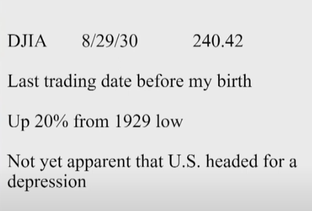

所以在这种情况下——如果你翻到下一张幻灯片，我是在9个月后出生的。但在那个时候，我实际上是在8月30日出生的，但那天股市是闭市的，所以我用的是前一天8月29日的数字，但是在那之后的9个半月期间，股市实际上已经恢复了20%以上。

在1930年的秋天，人们没有想到，他们正处于大萧条之中，他们认为这只是一次衰退，而这至少发生过十几次，尽管并不总是发生在股市很重要的时候。但在那段时间之前，美国已经经历了许多次衰退，所以，1929年大崩盘看起来并不像是什么不同寻常的事情。有一段时间——实际上是我出生后的10天左右，在那10天里，股市实际上上涨了1-2%，但那对很多人来说是“最后一天”了。

**图11：1932年7月8日道琼斯工业指数**

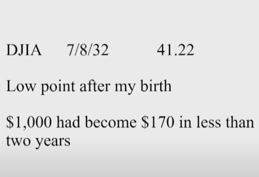

好的，从那时候开始，如果你看下一张幻灯片，股市从240点下降到41点，这是一个明显的崩盘。因为如果有人在我出生那天给了我1000美元，我用它买了股票，买了道琼斯平均指数，我的1000美元在不到两年的时间里就会变成170美元，虽然我们可能偶尔会遇到一只股票是这样的表现，但当时的这种情况，是我们在座的人从来没有经历过的。美国股市在两年内下跌了83%，在1929年9月3日达到峰值后下跌了89%，这是非常不寻常的。

在我出生不到一年的时间里，仅仅不到一年，我爸爸去他工作的银行取钱，发现银行有一个“倒闭”的标志，然后他就失业了。那时我的父亲有两个孩子，他的父亲开了一家杂货店——查理和我都曾为我的祖父工作。查理1940年在那里工作，我1941年在那里工作，所以我们彼此不认识，但我祖父对我父亲说，“别担心，霍华德，”他说，“我会支付你的账单的。”

这正是我祖父的原话，他关心他的家人。当我回顾那段时期的时候——我认为经济学家一般不会认为联邦存款保险公司的重要性，但如果我们早10年有FDIC——联邦存款保险公司成立于1934年1月1日，它是罗斯福上台后进行的全面立法的一部分——但如果我们有联邦存款保险公司，我相信，在大萧条时期，我们会有非常非常不同的经历。

我的意思是，当时发生了各种各样的事情，比如1929年的保证金要求，所有这些都导致了经济衰退，但如果你有4000多家银行倒闭，那在当时可是4000多个地区的人们储蓄的地方——人们把钱存起来，然后有一天他们去取钱，发现钱没了——这发生在当时本土的所有48个州，它发生在你的邻居身上，发生在你的亲戚身上，它显然对人们的心理产生了难以置信的影响。

所以，在我看来，大萧条之后出现了一件非常非常好的事情，那就是联邦存款保险公司（FDIC）。我相信，如果不是银行倒闭席卷全国，如果不是那些认为自己是储蓄者的人发现自己一无所有的话，世界肯定会有所不同。可当时，当他们去那里的时候，银行门口只有一个牌子写着“倒闭”。

顺便说一句，联邦存款保险公司——我想很少有人知道这一点，或者至少他们不欣赏它，但是FDIC没有花美国纳税人一分钱。我的意思是它的费用和它的损失都已经支付了，这都是通过对银行的评估来支付的。FDIC是一家由联邦政府支持的银行互助保险公司，它与联邦政府有联系，现在它拥有1000亿美元的规模，这是包括保费的投资收入，再加上一些经营费用，并支付了所有的损失后的数字。想想看，大萧条来袭时，这会让那些处境不同的人们得到了多么令人难以置信的内心平静。

大萧条持续了很长一段时间，但它在人们心中持续的时间比它的实际影响要长得多。第二次世界大战爆发后，我们不由自主地采纳了凯恩斯主义，我们开始出现巨额的财政赤字，我们的债务占GDP的比例达到了前所未有的水平，是一个自那以后也从未曾达到过的水平。

**图12：1951年1月4日巴菲特大学毕业时道琼斯工业指数**

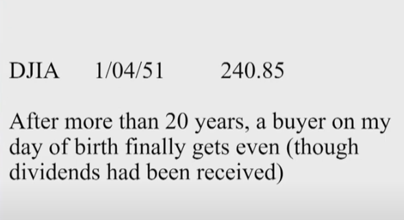

我们在那之后有一个巨大的经济复苏，但人们的心灵却已经伤痕累累。父母们会告诉他们的孩子，“1929年”成为了人们心中的一个符号。我的意思是，如果你说“1929年”，就像说“1776年”或“1492年”。我的意思是，每个人都确切地知道你在说什么，它以一种相当显著的方式影响着股票价格。如果你换到下一张幻灯片，这个1930年8月30日出生的孩子，直到1951年1月4日才读完大学，那时候股市才恢复到原来早些时候的水平。

所以从1920年、1930年或1929年到1951年算起，或者从我出生那一年算起，整整20年——请记住，这个时候这个国家只有140岁——这是我们国家231年的历史中的20年，在很长一段时间里，经济没有增长，人们对国家财富、对美国经济的价值、对所有这些一天比一天做得好的公司没有任何反应。总之，花了这么多时间，股票市场才恢复到我20年前出生时的价格水平。

所以，如果你考虑到我们已经忍受了几个月（疫情影响），而我们将忍受更多的几个月……我们不知道最后我们是如何走出来的，就像20世纪30年代的人们并不知道该如何走出大萧条。但最终，人们忍受着，坚持着，繁荣着，美国奇迹仍将继续着。有趣的是——我没有下一张幻灯片，因为昨天晚上我在准备好了所有的幻灯片之后我在想——我记得在1954年初，道琼斯指数只有280点左右。我清楚记得是1954年，因为那是我在股票市场上遇到过的最好的一年。

道琼斯指数从年初280点左右，到了年底是400点多一点。当它到了400点的时候——它很快就升过了381点，这是1929年的著名数字——当它到400点的时候，有些人可能很难相信，但每个人都想知道，“这会是1929年的重演吗？”

这似乎有点牵强，因为在1954年美国是一个完全不同的国家，但这是一个普遍的问题。它实际上反映了这样一种担心的程度，即我们是否即将跳下另一个悬崖，仅仅因为1929年的381点被超过了。当时的人们认为，比如阿肯色州的参议员比尔·富布赖特（BillFulbright）——他后来在外交关系委员会变得非常有名，但他当时是参议院银行委员会（Senate Banking Committee）的领导，他开展了一次被称之为“股票市场研究”特别调查。如果你通读这份调查报告，当时他真的在质疑我们是否又建了一个纸牌屋（House of cards，固定习语，字面意思是“用纸牌砌成的房子”。可以想象，纸牌砌成的房子是比较脆弱的，很容易倒塌）。在这个委员会中，有趣的是当你看到参议院财政委员会名单时，他们其中一名成员是普雷斯科特·布什（Prescott Bush），他是乔治·布什（George H.W. Bush）的祖父。这个委员会当中，有一些显赫的名字。

他的委员会，在1955年3月，道琼斯指数为405点时，他召集了美国20个最聪明的人，来证明我们是否再次陷入疯狂的情景，仅仅因为当时道琼斯指数在400点。因为（在道琼斯指数达到400点之后）我们遇到了令人难以置信的麻烦，但这就是这个国家的当时的心态，这是难以置信的。

我们很难相信曾经的美国是这个样子的。我之所以对此感到熟悉（这些内容在一本1000页的书中记载，而巴菲特当时在图书馆曾阅读过这些资料），是因为我曾在纽约为这20个人中的其中一位（即本·格雷厄姆）工作，这20个人被传唤在参议员富布赖特面前作证。而本就在伍德将军（General Wood）发言之后、在当时是美联储的负责人的比尔·马丁（Bill Martin）之前作证，他们的证词在当时都是非常非常重要。当然，比尔·马丁是美联储历史上任期最长的主席，他有一句关于美联储功能的名言，就是“在派对正变得越来越好时就要把酒杯收走”（the Fed was to take away the punchballs just when the party started to get really warmed up，意思是美联储需要试图避免在经济中制造货币泡沫）。

但我的老板本·格雷厄姆（Ben Graham）派我去纽约的公共图书馆为他收集一些信息——这是他现在用电脑五分钟就能做的事情，我找到了一些东西，然后他去作证。在这本书的第545页，我记得的那句话——我之所以记得是因为本·格雷厄姆是我一生中遇到的三个最聪明的人之一，他是证券投资的奠基人，他在1934年写了经典的《证券分析》一书，他在1949年写了改变我一生的书《聪明的投资者》，他聪明得令人难以置信。

**图13：如今，道琼斯指数超过24000点**

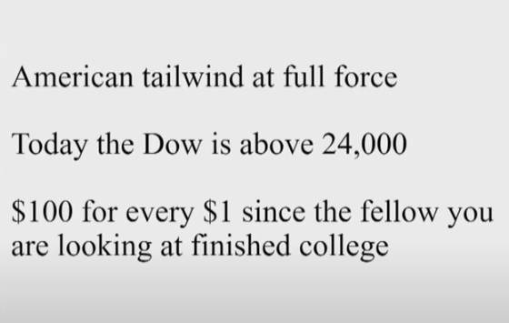

当他作证时，道琼斯指数为404点，他在书面证词的开头有一行字，他说，“股市很高，看起来很高，确实很高，但没有看起来那么高。”如果我们转到下一张幻灯片，从那时起，我们感受到了美国乘着顺风全速前进。道琼斯指数，让我们看看，尽管道琼斯指数在周五时有所下跌，但是当我们做这张幻灯片时，它大约是24000。所以你现在看到的是一个每1美元能够产生100美元回报的市场，你所需要做的就是你必须相信美国——你不需要阅读华尔街日报，你不需要查看你的股票价格，你不需要向任何人支付很多费用，你只需要相信美国奇迹一定会发生并继续。

但是在1929年到1954年之间，确实有过一段考验时期，当道琼斯指数涨回380点的时候所发生的事情也说明了这一点。在当时，人们真的在某种程度上失去了信心，那时候他们只是没有看到美国所能做的事情的潜力。我们发现，只要美国一开始行动，其实就没有什么可以阻止美国，这句话一直是对的，虽然它偶尔可能会受到打击。

**图14：永远不要赌美国输**

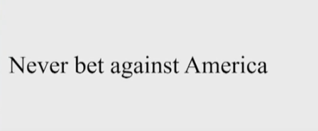

历史上我们经历了很多可怕的考验，比如南北战争；它也可能在大萧条中再次经受考验；现在可能在某种程度上我们也在经受考验，但最终答案是：永远不要赌美国输。在我看来，这句话在今天和在1789年一样正确，在南北战争和大萧条时期也是如此。

**图15：2020年美国已经是一个比1789年更好的国家**

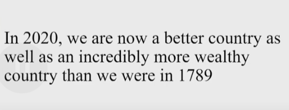

现在，我要说的是——请不要改变幻灯片——但我现在要说的是一些你们中的一些人可能会与我争论的事情，但我想说的是，虽然我们在很多方面都不完美，但如果你打开下一张幻灯片，与1789年相比，我们现在是一个更好的国家，也是一个更加富裕的国家。我们离我们应该成为、将要成为的样子还差得很远很远，但我们已经朝着正确的方向前进了。

**图16：1790年有15%的人口为奴隶**

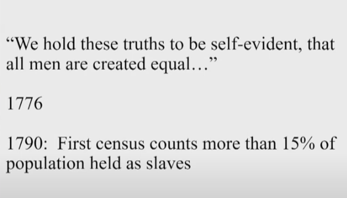

有趣的是，在1776年，我们说我们认为这些真理是不言而喻的——“人人生而平等，造物主赋予他们不可剥夺的权利，其中包括生命权、自由权和追求幸福的权利”。然而14年后，1789年，我们正式建国一年后，我们通过了一部宪法，我们忽然发现这个国家有超过15%的人是奴隶，之后我们与之进行了斗争。但当你说“不言而喻”这个词时，这听起来就像你在说，任何该死的傻瓜都能认识到这一点。（对于独立宣言）你肯定会说，人们可能对关于生活和对幸福的追求进行一些争论，但我看不出世界上有谁能将自由与15%的人口被奴役的矛盾争论清楚——我们花了很长时间才至少部分地纠正了这一点。

我的意思是，我们经历了一场内战，我们失去了6%的18到60岁的男性，但我们已经走上了正确的方向，虽然我们还有很长的路要走，但我们现在已经走上了正确的方向。此外，我们也再次回到1776年的独立宣言上：“人人生而平等，由他们的造物主赋予不可剥夺的权力……”。

**图17：1981年最高法院大法官迎来第一位女性**

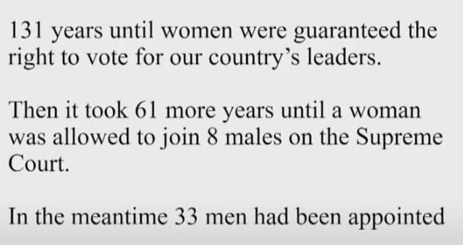

我认为，对于50%的人口来说，他们在这个国家生活的大半辈子里都得到了公平的待遇，这是不言而喻的。然后我们花了131年才保证妇女有权投票选举我们国家的领导人。更值得注意的是，在我们采纳了这个建议之后，在1920年的第19条修正案后又过了61年，才有一名女性被允许加入最高法院那8名男性的行列。在我成长的过程中，直到我61岁的时候，在桑德拉·戴·奥康纳（Sandra DayO'Connor）被任命为最高法院法官之前，我一直认为最高法院必须是由9个男性组成。而这已经距离建国过去了192年，这是一个渐进的过程。

在1920年，可能有一半的人口是女性，但没有一半的律师是女性，或者我认为可能只有10%的律师是女性。所以你可以理解这当中出现了一些延迟，但61年是一个很长的时间，而这当中我们的最高法院连续挑选了33名男性大法官。如果这完全是偶然的，那么这相当于抛硬币连续为同一面的概率，大约是80亿分之1。就像我说的，这是一个渐进的过程，但是我们花了很长很长的时间，直到现在都还没有完成。但我认为，这确实意味着我们要想发展成一个更好的社会，还有很大的发展空间。与1789年相比，我们拥有一个更好的社会。

**图18：在成为一个更富裕、更平等的社会的路上，我们还要继续努力**

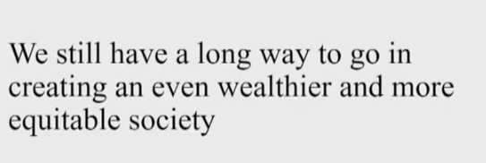

当你去威廉斯堡殖民地古镇（Colonial Williamsburg）时——事实上，我去过那里几次，我在1976年观看了吉米·卡特（Jimmy Carter）和杰拉德·福特（Gerald Ford）之间的辩论，那不是一个黑人的好时代，那也不是属于女性的好时机。在履行1776年《独立宣言》所做的承诺方面，黑人和女性这两个类别肯定仍有显著改善的潜力。这一关于我们如何相信人人生而平等的承诺是是不言自明的，而我们已经取得了进步，我们是一个更好的社会。如果你们看下一张幻灯片，随着岁月的流逝，我相信当你评估完所有的定性事实，会发现我们所做的一切都是为了实现我们在1776年的承诺——我们在1776年《独立宣言》里所写的不是事实，但它是一份有抱负的文件，我们已经朝着这些目标努力了，我们还有很长的路要走。但我要重复一遍，如果你移动到下一张幻灯片，那就是永远永远不要赌美国输。

**图19：谈谈“什么是我不知道的”**

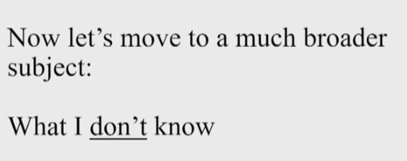

现在，让我们转到一个更广泛的主题——“什么是我不知道的”。我不知道的东西——也许是因为我带着一丝偏见，但我不相信任何人知道明天、下周、下个月或明年市场会怎样。我知道随着时间的推移，美国将会向前发展，但我无法确定（未来怎么走）。我们在2001年9月10日就得知了这一点；几个月前，我们又从病毒的角度了解到了这一点——就市场而言，任何事情都可能发生。你可以押注美国，但你必须小心你的押注方式。原因很简单，市场无所不能。

在1987年10月11日，我记得是星期一，市场在一天内下跌了22%；在1914年，他们关闭了股票市场大约四个月；在9/11后交易所关闭了市场四天后，我们努力让它重新启动，但没人知道明天会发生什么。所以当他们让你下注美国的时候——我告诉你，自从我11岁买了第一只股票，我就下注美国（奇迹）并迎来了一个无比巨大的顺风——但它不会每天都朝着有利于我的方向吹，你不知道明天会发生什么。

**图20：2015年6月17日山姆·纳恩于YouTube上传视频《病菌没有边界》**

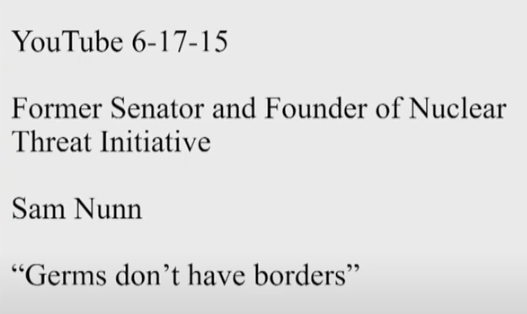

我想结合当前的新闻，指出一些你可能会感兴趣的东西。如果你去YouTube，你会发现在2015年6月17日，大概四年多前，你会发现山姆·纳恩（Sam Nunn）——这是我在美国和世界上最钦佩的人之一，伟大的爱国者和了不起的参议员。在离开参议院后，他一直在做一些费力不讨好的工作，并领导了一项名为“核威胁倡议”（Nuclear Threat Initiative）的项目。你们大多数人都没听说过，但我稍微参与了一下，山姆·纳恩创立了它。

“核威胁倡议”是一个致力于减少核化学、生物威胁的组织——无论是恶意的应用还是意外的应用，因为不管是什么，这都导致数百万美国人死亡。在山姆共同创立的组织中，他是组织的核心和灵魂。他谈到，几十年来，他一直担心大规模的流行病和核威胁，他参加过各种战争演习，包括恶意散播的流行病——可能是由在9/11前后发出炭疽信的同一类疯子在不久之后发动的。山姆在YouTube上做了这个演示——我相信他肯定看过很多其他的演示，我只是碰巧看到了这个——并谈到了流行病的危险，任何人在任何时候都应该听山姆·纳恩的话。所以他当时说，“病菌没有边界”，而这正是我们在过去几个月里学到的。当我点击YouTube时，我查了一下，我发现它只有831的浏览量，而这只是几天前的数据，但是我不知道这些浏览量是最近几天还是最近几个月的，也不知道这些浏览量是否是因为人们对流行病感兴趣而点击的。但人们真的很难想到还没有发生的事情。比如这次我们就可以体验到，当类似目前的大规模流行病发生时，其实人们很难将这种因素考虑在投资里。至少在我看来，这就是为什么你永远不想用借来的钱买入股票投资的原因。

我们以这种方式经营伯克希尔，我们试着想象最坏的情况：不仅是一件事出了问题，同时还有其他事情出了问题，并且可能部分是由第一件事引起的，但也可能是独立于第一件事的。我不知道现在是几年级教的乘法——可能比我上学的时候还早，但是应该在五六年级的时候，你就学习到任何一系列数字乘以0——你只需要1个0，答案就是0。因此，没有理由用借来的钱参与美国的顺风，但应该有其他所有理由来参与。

**图21：2019年10月约翰霍普金斯大学关于全球大规模流行病的报告**

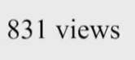

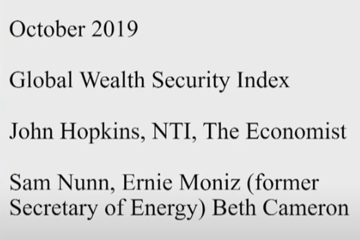

现在，我忍不住要指出，在2019年10月，有一本300页厚的书——我这里刚好有一本——一本书出版了。这是由约翰霍普金斯大学——这是最受尊敬的机构之一，核威胁倡议组织（NTI）和经济学人的情报小组合作的，这本书评估了全球范围内大规模流行病预防的问题。

**图22：300页报告的开头：“生物威胁会对全球健康、国际安全和经济构成威胁”**

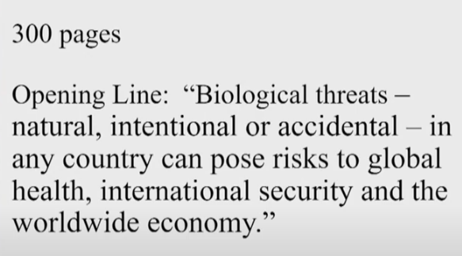

我记得在11月，山姆和厄尼（Ernie）一起来见我，厄尼是前能源部长，现在是NTI的首席执行官。他和萨姆是联合主席，贝丝·卡梅伦（Beth Cameron）为这份报告做了很多工作，她也来见我。我相信，他们在去年11月给了我这份评估报告。如果你翻开这一页，第一行就是：“任何国家的生物威胁——自然的、有意的或意外的——都可能对全球健康、国际安全和全球经济构成威胁。”

而这本书就是为了评估各国的预防情况并进行排名而编写的。我们的排名相当不错，但我们所有人都不及格……基本上所有国家都不及格。

**图23：报告视频上传油管获得1498次观看**

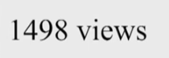

现在，你可能会想，以约翰霍普金斯大学和《经济学人》的声望，以及像萨姆和厄尼这样的人，这会得到一些关注。请翻到下一页。山姆和其他人的相关视频于2019年10月24日上传到了YouTube，截至几天前，他们已经获得了1498次观看。

几年前，我的朋友比尔·盖茨（Bill Gates）在一次Ted演讲中发出了同样的警告。不过他得到了更多的关注。但它只是说明了这样一个事实，即虽然你可以从网络中获得这些信息，你也可以阅读关于它们的文章，你可以和一些人进行谈论未来将发生什么，就像他们过去那样——所罗门过去曾经告诉我，一些25西格玛事件（极端事件），然后他们会说这类极端事件在宇宙中只会发生一次。然后结果是，这类极端事件在一个月内连续发生了几次，然后他们就破产了。

你只是不知道未来会发生什么。你知道，至少在我看来，美国的顺风并没有耗尽。如果你长期持有股票，你会得到很好的结果。认为股票不会产生比30年期国债更好的结果的想法（30年期国债目前的收益率为1.25%），是一种潜在的税收。美联储（Federal Reserve）的目标是每年2%的通胀率。而股票的表现将超过债券，它们的表现将超过国库券，它们的表现将超过你藏在床垫下的钱。

我的意思是，股票是一个非常可靠的投资——只要它们是一种投资，而且它们不是赌博工具或你认为你可以安全地以保证金购买的东西——那么股票就是一种非常可靠的投资。

有趣的是，股票提供了报价，但我们总是把股票看作是业务的一部分。我的意思是，股票只是企业的一小部分。如果在1789年，你存了一小笔钱——当时存起来可并不容易，你很可能会用这些钱买一小块地。

也许你买了一栋可以租给别人的房子，但你没有机会和10个不同的人一起买房——因为这些人往往正在发展自己的生意，他们可能会把自己的钱投进去，而这样这些人就会迎来美国的顺风。在这10个人中，有相当高的比例会在某种程度上取得成功，并获得可观的回报，但这些都是各人选择。你必须对你的储蓄做点什么。

他们最初开始提供债券。你得到了有限的回报。但当时的回报率可能只有5%或6%左右。但你不能买无风险的债券——我的意思是，我的衡量标准永远是美国财政部。当有人给你提供比美国财政部多得多的回报时，通常是有原因的。而这样往往风险要大得多。

但回到股票上，人们往往会对它们抱有这样的态度——因为它们是交易活跃的的，每分钟都有报价，所以你每分钟都要形成对它们的看法，这对人们来说很重要。现在，当你仔细思考这种态度，你会发现这真的很愚蠢。这就是格雷厄姆在1949年教给我的东西。我的意思是，这就是一个简单的想法：股票是企业的一部分，而不仅仅是在图表上移动的符号——图表在那些日子里非常流行。

想象一下，你现在决定投资，你买了一个农场。假设你买了160英亩，你以每股X或每英亩的价格购买。而这附近的农田——假设在你旁边的农民有160英亩相同的土地、相同的轮廓、相同的质量、土壤质量，两者是相同的。然后，假设你隔壁的那个农民是个很特别的人，因为每天他都会和你说，“让我把我的农场按照一定的价格卖给你，或者我以一定的价格买下你的农场。”。

那他将是一个非常乐于助人的邻居。我的意思是，有这样一个人在旁边的农场肯定是件好事。现实生活中，你不可能从农场得到这些，但你可以从股票得到。比如，你想要100股通用汽车的股票，然后在周一早上，有人会向你报价购买100股，或者以完全相同的报价打算卖给你另外100股。这种情况会一直持续下去，一周五天。

但想象一下，如果有一个农民这样做（会是怎么样）。当你买下农场的时候，你看的是农场能生产什么。你脑子里就是这么想的。你对自己说，“我为每英亩支付了X美元。我想我平均每年会得到很多蒲式耳的玉米或大豆，不过有些年份好，有些年份不好；有些年份价格会好，有些年份价格会不好”等等。

但是你应该想想这个农场的潜力。现在我们看到这个白痴买下了你旁边的农场，更重要的是，他有点狂躁和抑郁，他可能喝一点酒，也许还抽一点大麻，所以他到处进行报价。现在，你唯一要做的就是记住，隔壁的这个家伙是来为你服务的，而不是来指导你的。你买下农场是因为你认为农场有潜力。你真的不需要关注这个家伙的报价。如果你面对的是约翰.D.洛克菲勒（John D.Rockefeller）或安德鲁·卡内基（Andrew Carnegie）或类似的人，那也不需要任何报价。虽然后来不断会有一些报价，但重点是你买入的生意。这就是你买股票时应该做的。但是你有一个额外的优势，你有一个邻居，你根本不需要听他的话，而他每天都会给你一个价格。他的报价会有起伏，也许某天他会给出一个他们愿意购买的价格，在这种情况下，如果你想卖，你就可以卖。

或者他会出一个很低的价格，那么你可以从他那里买下他的农场。但你没必要必须这么做，你也不会想把自己置于一个你必须要做的位置。所以股票有巨大的内在优势，人们会一直向你喊出价格，而很多人把这变成了劣势。当然，很多人都能以这样或那样的方式从告诉你——他们会能告诉你这个农民明天、下周或下个月就会喊出什么价格。

这涉及到一大笔钱。所以很多人告诉你，“你应该多关注他们关于价格变化的想法，这很重要。”但你应该告诉自己这并没有这么大的区别。事实是，如果你在病毒到来之前拥有你喜欢的企业，也许报价会改变，但并不会有人逼你做出卖出的决定。如果你真的喜欢这个行业，你喜欢你的管理层，而且这个行业没有发生根本性的变化，那么股票就有巨大的优势——当我汇报伯克希尔一季度表现的时候，我会讲到这一点，我很快就会讲到。

你可以把赌注押在美国身上。如果你愿意并且在独立思考后决定你想要持有美国资产整体的一部分，那么你就可以把赌注压在美国上（指指数投资），因为我不认为大多数人有能力选择单一的股票。有一些人可能是具有这个能力，但总的来说，我认为，人们最好购买美国资产整体的一部分，然后忘记它。如果你这么做了——如果我在大学毕业后也这么做了，我就会赚100倍，然后在此基础上获得分红。并且分红将随着时间的推移而大幅增加。

美国的顺风是了不起的——虽然它偶尔会有中断，你也无法预见到中断。你肯定不会想让让这些偶尔的中断影响到你——要么是因为你的杠杆，要么是因为你在心理上无法面对大额浮亏。

如果你真的有一个农场，你有一个邻居，有一天他给你报价一英亩2000美元，第二天他给你一英亩1200美元，也许之后的一天，他给你800美元一英亩，你真的会觉得当你评估农场的产量时农场就值2000美元吗？你会让这个家伙的报价驱使你思考吗？“我最好卖掉我的农场，仅仅因为这个报价一直在下降”？要知道，用正确的心态去持有普通股是一件非常非常重要的事情。

但我要告诉你，如果你把赌注押在美国身上，并保持这种状况几十年，你会做得更好。在我看来，这比持有美国国债要好得多，也比听从那些告诉你农民下一步要喊什么价格的人要好得多……人们为他们真的不需要的建议支付大量的钱，而那些提供建议的人可能是善意的并且坚信他们自己的预判。但事实是，你不可能通过让每个人围绕一项业务进行交易，最终来为每个人带来卓越的结果。

如果你买入一家企业，它将提供企业生产的产品。而那种认为你会比你旁边的人更聪明的想法、或者只要听从了某人建议你就会比坐在你旁边的人更聪明的想法，其实是错误的方法。

所以要么去寻找企业。或者去做指数投资。在我看来，对大多数人来说，最好的选择就是持有标普500指数基金。人们会试着把其他东西卖给你，因为如果他们这样做，他们会赚更多的钱——我并不是说这是他们有意识的行为。

大多数优秀的销售人员都相信自己的胡扯。我的意思是，这是一个好的销售人员的一部分。我相信我在我的生活中也做了很多这样的事情，但如果你经常重复一些事情，那这是非常正常的。这就是为什么律师让证人一遍又一遍地说，当他们站在证人席上的时候，他们就会相信（自己说的是事实），不管这是不是真的。

但在我看来，你现在面对的是从根本上只对普通股有利的局面。我会把我的余生都押注在美国身上。我希望我在伯克希尔的继任者能做到这一点。现在，我们用两种不同的方式来做。一种是我们通过购买整个企业，另外一种是我们购买企业的一部分（股票）。

我想强调的是……好吧，我想给大家提供几个数字，这些数字将与我们第一季度的活动以及我们在4月份所做的工作相联系。我们确实试图选择我们认为我们了解的业务。我们不买标准普尔500指数。我们喜欢在收购时买下整个企业，但我们没有机会经常这么做。因为大多数最好的企业并没有全部出售。

但我们丝毫不介意购买企业的部分股权。我们更愿意持有一家出色公司6%、7%或8%的股份，并将其视为我们在该公司的合伙权益。然后我们就有机会通过有价证券做到这一点。有时候我们比别人有更多的机会。

就凭这一点，我希望我已经说服你把赌注压在美国身上了。我不是说现在是买股票的正确时机——如果你所说的“正确”是指股票将上涨而不是下跌。我不知道他们在接下来的一天、一周、一个月或一年里会怎么样。但我希望我知道的足够多，我想我可以买一个整体（指数），然后在20或30年内会做得很好。你可能会认为，对于一个89岁的人来说，这是一种乐观的观点。但我希望每个人买股票的时候，都抱着这样的想法：他们买的是合伙企业，而不是把它们当作只会向上或向下移动的筹码。

**图24：贝基·奎克的email地址**

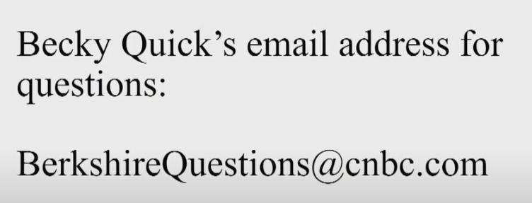

所以我们现在就快速地看一看。我看到屏幕上有贝基的电子邮件地址。所以，如果你对我所说的或其他事情有疑问，你可以通过电子邮件问这些问题。她现在在电脑后边，试图处理你们发送的问题，并挑选出她要优先考虑提问的问题。不过，到目前为止，如果对我到目前为止所谈论的任何事情有任何意见，请随时给她发一封信，我们也会在稍后举行正式会议时保留她的Email地址。

**第二部分 伯克希尔2020年一季度经营情况说明**

**图25：伯克希尔2020年一季度运营利润情况**

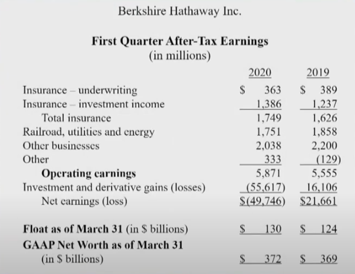

下面我们会非常简短地说一下伯克希尔第一季度的情况，如果你愿意的话……我们有这方面的幻灯片吗？我们看到了。我们的运营利润是…在10-Q中有更多关于这方面的信息，真的不值得花任何时间在这上面。但是，第一季度的运营利润对于预测下一年将会发生什么没有任何意义。

我不知道关闭美国经济的后果。但我知道无论我们做什么，最终都会成功的。我们可能会犯错误。我们会犯错误，在这次演讲和之后的时间里，我不会再去猜测别人的想法，因为没有人确切地知道任何其他的行动会产生什么结果，或者任何短暂的结果。

但我们知道的是，在一段时间内——肯定是在今年的剩余时间内，但疫情可能会持续相当长的一段时间，谁知道呢——我们的运营利润将会减少，大大少于如果病毒没有出现的情景。我是说，事实就是这样。这对我们的一些企业伤害很大。我是说，（在疫情期间）整个企业关门了。我们的一些业务实际上已经关闭。

它对别人的影响要小得多。我们的三个主要业务是保险、BNSF铁路和我们的能源业务，这是我们三个最大的业务。他们的处境还算不错。他们的费用支出将超过折旧。因此，随着折旧的进行，部分收益将用于增加固定资产。

但基本上这些企业即使它们的收益有所下降，它们将产生现金。如果我们看第二部分，在伯克希尔，我们保持着非常强大的地位。我们会一直这样做——这是我们的根基。我们给予人们承诺。在某种程度上，我们是专家，也是行业领导者。这不是我们的业务的主要内容，但我们的确出售承诺给人们。这意味着如果有人遭遇了严重的事故，通常是车祸，他们需要10年、30年、50年的护理。

在我们看来，一般他们的家人或律师都是足够明智的，与其采取一些大的现金解决方案，不如安排在个人的余生中支付一些钱来照顾他们的医疗遗嘱、账单或其他任何事情。而且由于我们规模很大，实际上我们有很多很多人把他们的幸福押在了伯克希尔的承诺上——就像我说的，在50年里甚至更长的未来需要伯克希尔来照顾他们。

现在，在任何情况下，我都不会拿别人的钱去冒真正的风险。查理和我都有过合伙经营的背景。我在1956年开展我的合伙企业，为真正的七个家庭的成员服务。六年后查理也做了同样的事。我们中的任何一个人——我想，我知道我没有，我几乎可以肯定查理也是如此——我们中的任何一个人都没有在我们这里接受过任何一次机构投资。

我的意思是，我们为他人管理的每一分钱都来自于个人——他们是真实的个人、实体、或者附属于他们身上的钱。所以我们一直觉得我们的工作基本上就是一个受托人，而且希望在我们想要努力实现的目标方面，我们是一个相当聪明的受托人。受托人（靠谱与否）一直非常重要。这对于那些有退休后资金安排的人来说很重要、对上有老下有小的投资人很重要、也对股东来说很重要。所以我们总是从“实力”的角度来运作伯克希尔的资金。

**图26：伯克希尔2020年一季度现金情况**

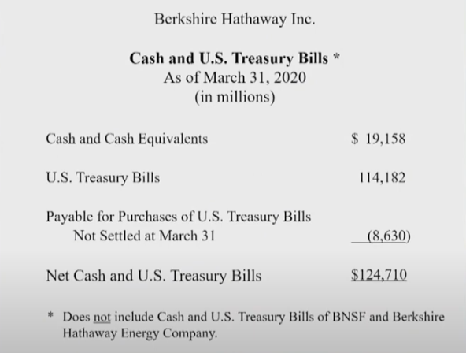

现在，我在上面的幻灯片上显示，我展示了3月31日我们的净值、现金和国库券头寸。你可能会说，“好吧，你有大约1250亿美元的现金和短期国库券。”不过在那个时候，我们至少有大约1800亿美元的股票。

你可以说，“与1800亿美元的股票相比，伯克希尔持有的国债是一个巨大的头寸。”但我们在股票上的头寸实际上远远超过这个数字，因为我们拥有很多业务。我们拥有许多企业100%的股权，对我们来说，这些股权与我们拥有的可上市交易的股票非常相似。（对于上市公司）我们只是不拥有他们所有股权而已。（对于我们100%拥有的子公司）它们没有公开市场报价。

但是我们有几千亿的独资企业。因此，我们账面上的1240亿美元并不代表我们持有40%左右的现金头寸，（我们持有的现金比例）远远低于这个数字。在任何情况下，我们会一直留有大量现金。随着9/11的到来，或者如果股市像第一次世界大战时那样暂时关闭——我想这不会发生，但我在1月观看克雷顿队和维拉诺瓦队的比赛时，也没有想到我们会遭遇一场全世界范围的流行病。

因此，我们希望在伯克希尔处于这样一个位置……好吧，你还记得《欲望号街车》（A Streetcar Named Desire，1951年的一部电影，讲述了一个美国南方美女布兰奇娇生惯养，秉性脆弱，有点神经质，在舒适优越的环境里度过了无忧无虑的青少年时代。后来由于婚姻的不幸、家庭的破产和亲人的死亡，突然坠落到生活的底层。她意识到自己青春已逝，周围的男人也不理想，但为了寻找赖以生存的精神支柱，她仍然以“柔情的色饰”为武器，以引人注目。然而，她总是摆脱不了自己身上那种不愿与世俗同流合污的清高品格，这就导致了她必然毁灭的悲剧命运）中的布兰奇·迪布瓦（Blanche Dubois）吗？这电影可能比你们所有人都老。但在布兰奇的例子中，她说她不想要依赖于陌生人的善意。而我们也不想依赖于朋友的善意，因为有时候现金是相当珍贵的。有趣的是，我们现在手中有一些资金。当然，我们在2008年和2009年也曾是这样。

但就在3月23日前的一两天，我们非常接近出手了，但幸运的是，我们有一个知道该怎么做的美联储，但资金……当时，投资级公司基本上将被冻结在市场之外（拿不到资金）。

全国各地的首席财务官都被教导要将股权资本的回报最大化，因此他们在一定程度上通过商业票据为自己融资，因为这种方式成本很低，并且获得了银行贷款等的支持。他们让许多公司的债务不断攀升。

然后毫无疑问，他们被市场上发生的事情吓得魂不附体，尤其是股票市场。因此，他们匆忙跑去市场上企图增加自己信贷额度。但这让那些发放信贷额度的人感到很惊讶，他们感到非常紧张。3月中旬，华尔街吸纳流动性的能力已经到了极限，以至于美联储在观察这些市场行为后，决定必须采取非常大的行动。

当时我们已经到了这样的地步，美国国债市场作为所有市场中最有深度的市场，其市场都已经变得有些混乱。当这种情况发生时，相信我，这个国家的每一家银行和首席财务官都知道，他们的反应是恐惧。恐惧是你能想象到的最具传染性的疾病，它使病毒看起来像一个小丑。

我们非常接近于完全冻结了世界上所有大型公司的信贷，而这些公司都依赖于此。多亏了杰伊·鲍威尔（Jay Powell）——多年里，我一直把保罗·沃尔克（Paul Volcker，1979年至1987年任美联储主席）放在一个特殊的位置上，他作为美联储主席享有一个特殊的地位。我们有很多非常好的美联储主席，但保罗·沃尔克，我把他排在美联储主席名单的首位。但保罗·沃尔克在不到一年前去世了。我待会会提名另一个。

但在他去世前不久，他写了一本书，名为《坚持不懈》（Keeping at it）。如果你打电话给我在“书虫”（Bookworm，一家书店）的朋友，我想你会喜欢这本书的。保罗·沃尔克在很多方面都是一位伟人。他也是个大块头。他和杰伊·鲍威尔，在品行上不能更好了。但杰伊·鲍威尔，在我看来，美联储董事会应该让他和保罗一起站在神坛上，因为他们在3月中旬采取了行动，可能在某种程度上受他们在2008年和2009年所见的教训。他们做出了规模空前的反应，基本上从那时起，一切都按照原样继续进行。

然后是三月，当市场基本冻结，甚至到了月中后不久融资功能就关闭。但因为美联储在3月23日采取了这些行动——我相信，这是历史上企业债券发行量最大的一个月，然后接下来的四月是一个更大的月份——你看到各种各样的公司抓住一切机会进入市场进行融资，然后利差实际上缩小了。每一个在三月底和四月发行公司债券的人，都应该给美联储写一封感谢信，因为如果不是他们以前所未有的速度和决心采取行动，发行公司债券就不可能成功。

沃伦·巴菲特：我们将知道扩大美联储资产负债表的后果。你可以看看美联储的资产负债表。他们每周四都会公布。如果你像我一样，分析这些数据会很有趣。它们每周四都会在网上公布。在过去的六到七个星期里，你会看到一些非凡的变化。

就像我说的，我们不知道这会有什么后果，也没有人确切地知道。我们不知道美联储前所未有的行动会有什么后果，但我们知道什么都不做的后果。这就是美联储在过去很多年里的倾向——不是什么都不做，而是做得不够。但是不管是他们做的是一些什么事情，美联储和欧洲央行都做出了前所未有不惜一切的行动。然后在3月，它们做了更多“不惜一切代价”的行动之后，我们欠它们一个巨大的感谢。

但我们在伯克希尔准备好了。我们总是在最糟糕的情景假设的基础上准备——我们假设也许美联储不会有一个这样行事的主席。我们真的想做好一切准备。这就解释了为什么我们持有1240亿美元现金和票据的部分原因。实际上我们并不需要这么多。

**图27：2020年一季度伯克希尔股票投资及回购情况**

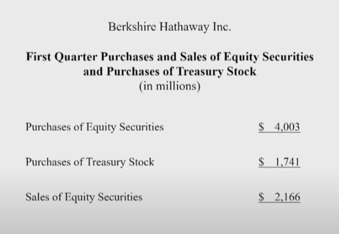

但我们从来不想依赖陌生人的善意，也不想依赖朋友的善意。现在，在下一张幻灯片中，我们看到了我们在股票方面所做的工作，当你看到这些数字时，你会发现它们很小——我的意思是，因为在年初我们拥有5000亿美元左右的市场价值，而我们只是回购了约17亿美元的伯克希尔的股票，另外我们的股票购买量比我们的股票出售量多出了十几亿美元。

**图28：伯克希尔2020年4月份股票投资及回购情况**

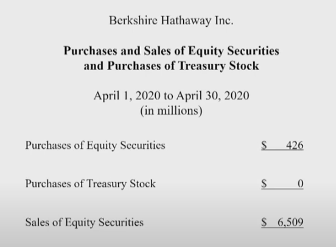

但正如你在上一张幻灯片中看到的，我们的运营利润为50亿美元，接近60亿美元。所以我们在第一季度做得并不多。然后在这里我又加了一个数字——通常我不会给你们看的。但我想确定的是，如果我和你谈论的投资和股票比我平时谈论的更多，那么我是想让你知道伯克希尔实际上正在做什么。现在，你会看到在4月份，我们净卖出了60亿美元左右的股票。

基本上，这并不是因为我们认为股市会下跌，或者因为有人改变了他们的目标价格，或者他们改变了今年的收益预测。我只是觉得我在评估的时候犯了个错误。这是一个可以理解的错误。当我们购买时，这是一个概率加权的决定，当我们投资整个航空业的时候，我们得到了一个很有吸引力的出价。

因此，我们购买了四大航空公司大约10%的股份，我们可能……这不是我们在4月份所做的，但我们可能为此支付了70或80亿美元，以拥有航空业四大公司10%的股份。我们当时认为，我们获得了大约10亿美元的盈利——不是说我们会得到10亿美元的分红，但当时我们认为，我们的潜在收益份额是10亿美元，而且我们认为，在一段时间内，这个数字更有可能上升而不是下降。航空业显然是周期性的，但就好像我们买下了整个公司。因为我们是通过纽约证券交易所购买的，我们只能最多购买这四家公司中的大约10%，但我们在精神上就像是在收购一家企业一样。事实证明，我对这一业务的看法是错误的，因为这绝不是四位优秀CEO的错。

相信我，作为一家航空公司的首席执行官其实并不快乐，但我们买入的公司管理得很好。他们做对了很多事，但这是一个非常非常非常困难的生意，因为你每天要和数百万人打交道，如果人群中的1%出了问题，那航空公司的CEO就会很不高兴了。所以我并不羡慕任何人担任航空公司的首席执行官，但我尤其不喜欢在这样一个时期担任这一职务。现在，基本上没有人乘坐飞机……人们被告知不要坐飞机。有人告诉我有一段时间不要坐飞机了。但我很期待民航业务重新运行。虽然商业飞行可能不行，但那是另一个问题。对于航空业，我可能是错的而且我希望我是错的，但我认为它发生了重大变化，很明显，情况发生了变化，因为这四家公司每家都将大额借款——平均每家至少100亿或120亿美元。

因此，航空公司必须在一段时间内从收入中偿还贷款。我的意思是，如果发生这种情况，你将损失100亿或120亿美元。当然，在某些情况下，他们不得不出售这么多金额的股票或出售购买股票的权利。这就使得股东和债权人的地位互换了。我不知道从现在开始的两到三年内，是否会有像去年一样多的旅客进行乘坐飞机——他们可能会，也可能不会，但未来对我来说不太清晰。今天所有的这些业务到底以后会发展成什么样的趋势，我们还是不知道，而这绝对不是航空公司自身的过错。疫情的发生这是一件发生概率很低的事情，但它尤其伤害了旅游业、酒店业、邮轮业务、主题公园业务，尤其是航空公司业务。当然，航空公司业务有一个问题，即使业务恢复了70%或80%，飞机也不会消失（注：巴菲特这里的意思是航空业供需不平衡，很可能票价会下跌）。

所以到时候停机坪的飞机就会太多了，但是几个月前下订单的时候、安排航线的时候，并不是这样的。但航空公司的情况发生了变化，我希望他们一切顺利，但这也是我们的业务之一。我们直接拥有的企业将受到严重伤害。这次疫情会让伯克希尔损失惨重，也影响到我们其他的商业活动，它不会直接造成现金的损失，因为我们是持有股票——我的意思是，如果XYZ公司是我们的控股公司之一，我们把它当作一门生意来拥有，并且我们喜欢这门生意，那么如果股价下跌了20%、30%或40%，在那种情况下，我们并不觉得很糟糕。但就那些航空公司业务实际发生的情况而言，我们的感觉很糟糕，就好像我们没有百分之百了解它们一样。

因此，这就解释了我们那些相对较小金额的股票卖出，但我想确保没有人认为这涉及到市场预测。这对伯克希尔来说是一个很好的总结。现在我们进入会议的正式部分，如果待会贝基有很多问题，那么接下来会有一个相当长的问答时间。当我们在做会议的正式部分时，它总不是太令人兴奋。所以不感兴趣的人请自便，如果你想向贝基提问，我们会在屏幕上保留她的联系方式；或者如果你想给自己做个三明治或者做点别的什么，我们现在就开始行动吧……或者你也可以关注会议的正式部分。但我们会开始会议的正式部分，这不会花太长时间，然后我们将会进入问答环节。

> **第三部分 常规会议流程**

**沃伦·巴菲特：**&#x73B0;在，我将宣布会议开始。如果你听不懂我在说什么，其实这就是跟剧本一样。我是公司董事会主席沃伦·巴菲特，欢迎大家参加2020年股东年会。马克·汉博格（Marc Hamburg）是伯克希尔哈撒韦公司的秘书，他将对会议过程做书面记录。在这次会议上，Dan Jaksich被任命为选举监察员。他将证明在董事选举中所投的票数，以及在本次会议上所要表决的议案。

本次会议的委任书持有人的姓名为沃尔特·斯科特（Walter Scott）和马克·汉博格。请问会议秘书，是否有一份关于伯克希尔发行在外、有投票权和出席会议的股票数量的报告？

**马克·汉博格：**&#x662F;的。如本说明随附的委托书所示，本次会议的通知已于3月4日发送至所有登记在册的股东。2020年，即本次会议的记录日期，伯克希尔哈撒韦公司发行在外的A类普通股为699,123股。每一股份对会议审议的议案有一票表决权；另外伯克希尔哈撒韦公司发行在外的1,382,352,370股B类普通股，对会议审议的议案，每一股份有万分之一的表决权。其中，472,037股A类股票和834,802,274股B类股票由截至4月30日(周四)晚间的代理人代表出席本次会议。

**沃伦·巴菲特：**&#x8C22;谢。这一数字代表法定人数，因此我们将直接开始会议。第一项议程是宣读上一次股东大会的会议记录。我认识黛比·博萨内克（Debbie Bosanek）小姐，她将在会议之前提出一些动议。

**黛比·博萨内克：**&#x6211;提议不宣读上一次股东大会的会议记录，通过会议记录。

**沃伦·巴菲特：**&#x6709;其他人有异议吗？

**发言人3：**&#x6211;附议。

**沃伦·巴菲特：**&#x52A8;议获得通过。下一项事务是选举董事。我同意黛比·博萨内克女士向会议提出关于选举董事的动议。

黛比·博萨内克：我提议沃伦·巴菲特、查尔斯·芒格、格雷戈里·艾贝尔、霍华德·巴菲特、斯蒂芬·伯克、肯·陈纳德、苏珊·德克尔、大卫·戈特斯曼、夏洛特·盖曼、阿吉特·贾恩、托马斯·墨菲、罗纳德·奥尔森、沃尔特·斯科特和梅丽尔·维特默当选董事。

**发言人3：**&#x6211;附议。

**沃伦·巴菲特：**&#x6C83;伦·巴菲特（Warren Buffett）、查尔斯·芒格（Charles Munger）、格雷戈里·阿贝尔（Gregory Abel）、霍华德·巴菲特（Howard Buffett）、史蒂夫·伯克（Steve Burke）、肯·陈纳德（Ken Chenault）、苏珊·德克尔（Susan Decker）、大卫·戈特斯曼（David Gottesman）、夏洛特·盖曼（Charlotte Guyman）、阿吉特·贾恩（Ajit Jain）、提名已准备就绪，可以采取行动。Jaksich先生，当你准备好的时候，你可以宣读你的报告。

**Dan Jaksich：**&#x6211;的报告准备好了。至上周四晚间，委托书持有人针对委托书的投票结果显示，每位被提名人获得的选票不少于543,203张。该数目超过所有发行在外的A类和B类股份总票数的大多数。特拉华州法律所要求的精确计票的证明将交给会议秘书，并与本次会议的会议记录放在一起。

**沃伦·巴菲特：**&#x8C22;谢。Jaksich先生。沃伦·巴菲特、查尔斯·芒格、格雷格·艾贝尔、霍华德·巴菲特、史蒂夫·伯克、肯·陈纳德、苏珊·德克尔、大卫·戈特斯曼、夏洛特·盖曼、阿吉特·杰恩、汤姆·墨菲（Tom Murphy）、罗恩·奥尔森（Ron Olson）、沃尔特·斯科特（Walter Scott）和梅丽尔·维特默（Meryl Witmer）当选为董事。肯，如果你在看或听…肯·陈纳德，他是我们的新导演，实际上得到了所有导演中的最高票，好的，在我之前，我想说，所以恭喜你，肯。会议议程的下一项内容是对伯克希尔哈撒韦公司高管的薪酬进行咨询投票。我请黛比·博萨内克女士就这一项目向会议提出一项动议。

黛比·博萨内克：本人动议本公司股东以谘询方式批准根据SK规例第402项所披露支付予本公司具名行政人员的薪酬，包括薪酬讨论及分析、随附的薪酬表及本公司2020年股东周年大会授权委讬书中的相关叙述性讨论。

**发言人3：**&#x6211;附议。

**沃伦·巴菲特：**&#x6709;人提议并支持该公司的股东在咨询的基础上批准向该公司指定的执行官员支付报酬。Jaksich先生，当你准备好的时候，你可以宣读你的报告。

**Dan Jaksich：**&#x6211;的报告准备好了。截至上周四晚间，委托书持有人针对收到的委托书进行了投票，至少有519750人投票赞成在咨询基础上向公司指定的高管发放薪酬。该数目超过所有发行在外的A类和B类股份总票数的大多数。特拉华州法律所要求的精确计票证明将交给会议秘书，并与本次会议的记录放在一起。

**沃伦·巴菲特：**&#x8C22;谢你，Jaksich先生。以咨询方式批准支付公司指定高管人员薪酬的动议已经通过。议程上的下一项内容是就伯克希尔哈撒韦公司高管薪酬的股东咨询投票频率进行咨询投票。我请黛比·博萨内克小姐就这一项目向会议提出一项动议。

**黛比·博萨内克：**&#x672C;人动议，公司股东应在咨询基础上决定以每年、每两年或每三年的频率，并就公司2020年年会委托书中规定的支付给公司指定高管的薪酬进行咨询投票。

**发言人3：**&#x6211;附议。

**沃伦·巴菲特：**&#x6709;人提议并附议，公司股东应决定他们对指定高管的薪酬进行咨询投票的频率，可选择每一年、两年或三年进行一次。Jaksich先生，当你准备好的时候，他可能会给你一份报告。

**Dan Jaksich：**&#x6211;的报告准备好了。截至上周四晚间，受委代表持有人就已接获的代表委任进行的投票，共投出每年131,443票，每两年2,228票，和每三年419,984票，因此，通过每三年就公司指定高管的薪酬进行一次咨询投票。特拉华州法律所要求的精确计票证明将交给会议秘书，并与本次会议的会议记录放在一起。

**沃伦·巴菲特：**&#x8C22;谢你，Jaksich先生。本公司股东已按谘询基准决定，彼等将就向本公司股东支付的补偿进行谘询投票。每三年任命一次执行官。现在我们已经完成了会议的部分常规流程。下一条更重要，我们已经在

berkshirehathaway.com网站上放了一些关于这个动议的材料，我希望股东和其他人能读到，因为它很重要，我把它描述成剧本里说的。

下一个议题是由纽约市雇员退休系统、纽约市教师退休系统、纽约市警察养老基金、纽约市火灾养老基金的董事会提出的议案，这些都被统称为系统。这项动议已在委托书中阐明。议案要求公司从证明董事会和高层管理人员的多样性中采纳这一政策。董事们建议股东投票反对这项提案。我想在这里打断一下，我想指出的是，当我们看到股东们不可能参加这次会议、不可能去奥马哈、也不可能聚集的时候，无论是州长，市长，还是公共安全人员，都认为这是明智的。

我们希望主计长（注：主计长是美国市级政府公职，是城市的财政和审计主管，主要是监督和审计美国市级各个财政部门的财政运转和预算运转情况）办公室的人来提出动议，然后在赞成和反对的会议上好好讨论。因为这是一个非常重要的课题。我可以告诉你，就个人而言，我认为我与主计长在他希望世界如何发展方面是同步的。但我不同意这一动议的具体细节，因为它适用于更广泛的范围，特别是伯克希尔的董事会。这些年来我们一直直言不讳。我们写的关于董事资格的文章可能比我能想到的任何一家上市公司都要多。多年来我们一直保持一致，我们已经解释了我们立场的原因，我们知道很多人不同意这一立场。因此，我欢迎在我们的会议上真正展示的想法，让我们的股东听到他们说的话，评估我们的想法是什么。

当我们不得不拒绝股东参加会议时，我们立即与主计长办公室取得联系，我们说，如果主计长办公室的任何人想要站出来提出主张或建议，并与我们进行接触，我们将破例。在我们讨论利弊的时候。正如你所料，他们没有能力派人来。我们很高兴有人能代表他们介绍这项动议，如果他们能提交一份支持性声明，我们也会这样做。我们很乐意让他们的实际代理人提出这项动议。我们很乐意让他们阅读支持声明，我们说，如果他们把时间限制在5分钟或更短，我们将非常感激。

之后他们立即回信，或立即发电子邮件，说他们很乐意这样做，他们甚至会试着把时间控制在三分钟。所以他们发了一份支持性声明，马上就会读给你们听，我很高兴他们这么做了。我确实希望股东们会读，或者已经读了，其他人也会读。我们会听听支持声明是怎么说的，我们也会读一读他们在提案代理中提出的原始论点。他们会读到我们投反对票的理由……这表明我们投了反对票，因为这是一个重要的话题。我真的希望明年，如果主计长办公室的人想出来，我们很乐意对这个问题进行更深入的讨论。因此，我现在请汉博格先生宣读纽约市主计长为支持该动议而编写的一份声明。

**马克·汉博格：**&#x8C22;谢。主席先生、董事会成员、各位股东。我是伯克希尔·哈撒韦公司的马克·汉博格，我在这里代表纽约市审计长斯科特·斯金格（Scott Stringer）和纽约市养老基金提出第四项提案。截至今年2月，这些基金的资产规模约为2,110亿美元，是伯克希尔哈撒韦公司的长期股东并持有2,500万股。我们的提案要求伯克希尔哈撒韦公司董事会采取多元化政策，要求从新任董事候选人和外部首席执行官候选人中挑选合格的女性，以及种族或民族多元化的候选人。

首先，我们要赞扬董事们增加了肯·陈纳德先生，而且董事会中有21%的成员是女性。我们还要认识到，行政管理层包括不同的候选人，其中包括另一名董事会成员阿吉特·贾恩先生。第二，我们赞扬秘书长的报告。巴菲特先生认识到，董事会中的女性历来很少，更重要的是，尽管妇女在一个世纪前赢得了在投票亭中发出自己声音的权利，在董事会中获得类似的地位仍是一项正在进行中的工作。

通过我们的股份所有人提案，我们寻求的是推动这一特定进程向前发展。第三，巴菲特先生提到的是，他只收购有三个标准的企业，其中第二个标准是有能力和诚实的管理者。董事会最重要的职责是找到并留住一位有才华的首席执行官。我们注意到，在回顾伯克希尔哈撒韦公司在股票市场上持有的最大的企业时，所有这10家公司的董事会都符合我们的董事会多元化要求。从本质上讲，伯克希尔哈撒韦认为适合投资的公司是那些董事会更多元化的公司。第四，我们希望澄清，通过这份股东提案，我们并不是要求伯克希尔哈撒韦董事会、我们的监事会，在其组成方面具有可量化的最终结果，但董事会席位的最初候选人应该包括一名女性和另一名种族或族裔多元化的个人。

我们相信，这些候选人如果合格，也将具有非常高的诚信度、商业头脑和股东回报取向，以及对公司拥有真正的兴趣。根据《哈佛商业评论》2016年的一项研究，在进入候选层的选手中应包括一名以上的女性或一名少数族裔，这有助于消除面试官之间无意识的偏见，并增加了多样化雇用的可能性。我们所要求的是朝着这个方向迈出一小步，在寻找的开始阶段就纳入不同的候选人。最后，我们要称赞伯克希尔哈撒韦公司强有力的内部CEO继任计划。我们的建议指出，CEO多元化政策只应适用于外部人的情况。纽约市审计长办公室感到可惜的是，我们从未有机会与董事或管理层讨论我们的建议，但我们对建设性接触持开放态度。在此期间，我们强烈敦促伯克希尔哈撒韦股东支持第四项提案。谢谢。

**沃伦·巴菲特：**&#x597D;的，谢谢马克，也谢谢主计长提供的支持声明。该动议现已准备就绪，可以采取行动。Jaksich先生，当你准备好的时候，你可以宣读你的报告。

**Dan Jaksich：**&#x6211;的报告准备好了。截至上周四晚间，委托书持有人针对收到的委托书进行了投票，其中65,925票支持该动议，485,824票反对该动议。由于反对该议案的票数超过就该事项适当投下的所有A类及B类股份的大多数票数，以及所有未投的票，动议失败了。特拉华州法律所要求的精确计票证明将交给会议秘书，并与本次会议的会议记录放在一起。

**沃伦·巴菲特：**&#x8C22;谢你，Jaksich先生，提案失败了。

**黛比·博萨内克：**&#x6211;提议本次会议休会。

**发言人3：**&#x6211;支持休会的动议。

**沃伦·巴菲特：**&#x8BE5;动议已经提出并获得附议。会议休会。谢谢你们。我刚刚看了看表，我说了很长时间，可能比我本来应该说的要长。这也不是第一次了。所以现在我们准备好接受提问了，贝基很快从直接发给她的邮件和发给卡罗尔·卢米斯与安德鲁·罗斯·索尔金的邮件中选择了一些邮件，格雷格和我，我们将会回答他们的提问。所以，贝基，该你上场了，我希望，所有的通讯技术——我希望一切正常。
