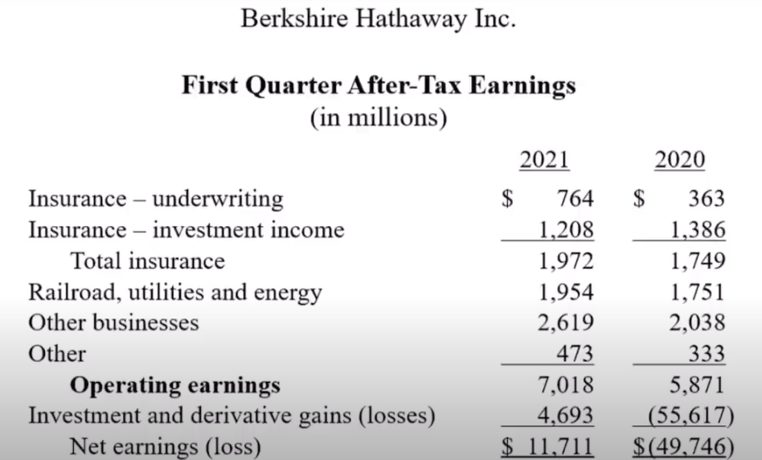
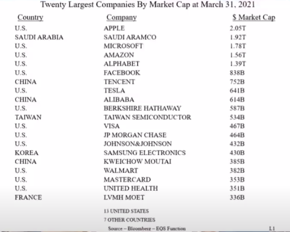
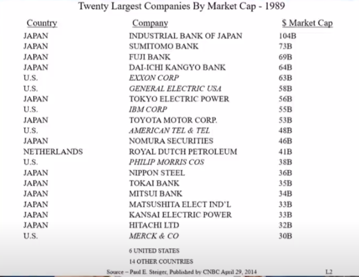
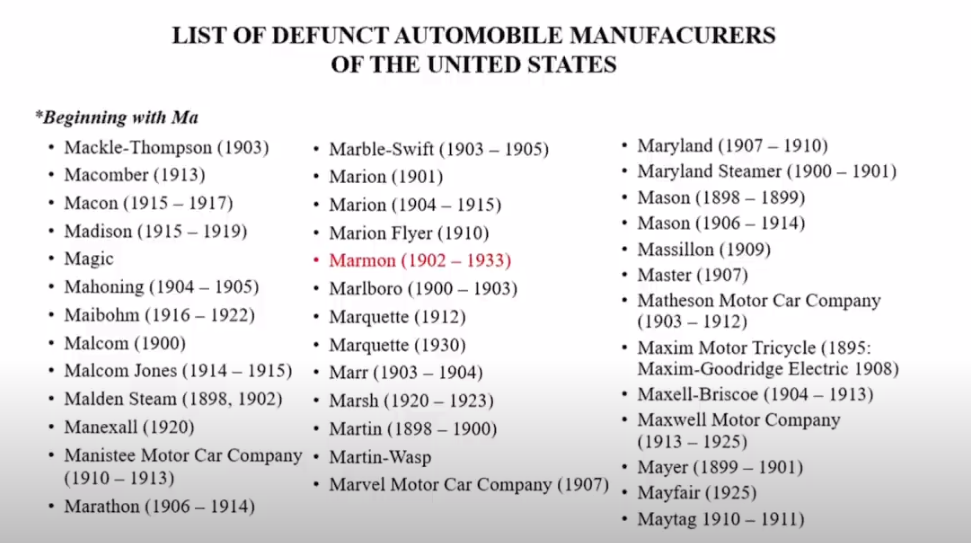

* \-----第一部分开始------

**巴菲特：**&#x5927;家好，这里是伯克希尔哈撒韦公司的在线年度会议，我们去年在奥马哈就这么做了。因为疫情，这次我们需要更加小心，所以我们来到洛杉矶。

今天我们把股东大会带到洛杉矶的原因是因为我左边的那个人，当然，这不是因为他要求的，而是因为我们所有人都想和查理一起在洛杉矶做这件事。

稍后我将介绍伯克希尔的三位副董事长。我会给你看第一季度的收益。我们不会花太多时间在这上面。

我会给那些伯克希尔哈撒韦公司的新投资者上一两节很短的课，特别是那些在去年进入了股市的新的投资人。我认为，进入股市的人数创下了历史新高。我会给他们举几个小例子。

然后我们将进入由Becky主持的问答环节，她看了好几千个问题，但在本次会议期间你们可以提交更多的问题。

我们会一直坐在摄像机前。如果你想在会议中提出问题，你可以直接与她交流，她上次被海量的问题淹没了，但她奇迹般地把它们整理出来。所以你们请随意的提出问题。我们将会有大约三个半小时的提问时间，然后我们将最终举行年度会议，年会不会花很长时间。

因此，我想首先介绍一下伯克希尔哈撒韦公司的三位副董事长。我会告诉你一些关于他们的事情，然后我会在最后给你一个小小的惊喜。在我左边的是芒格，我在62年前认识了查理。他曾经在洛杉矶做律师。

那时他在离这里几英里远的地方盖房子，62年过去了，他仍然住在同一所房子里。这很有趣，因为我在62年前的几个月也买了一套房子，现在我还住在这套房子里。所以你在伯克希尔，会看到一些相当奇特的男人谈论他们对家庭的热爱。

查理和我很快就合得来了。我会说，他可能是负责伯克希尔文化等事务的副主席。但如果我想知道问题的真正答案，那我会和查理谈谈，他可帮了我很大的忙。他回答所用的时间和话语都比我精炼的多，查理以一种不可思议的方式为伯克希尔做出了贡献。查理已经在洛杉矶待了60多年了。

而在我的右边，也就是你们的左边，是负责除保险和投资外所有事务的副主席格雷格·亚伯（Greg Abel）。格雷格在艾伯塔省的埃德蒙顿出生并长大。他是加拿大人，打曲棍球，他8岁的孩子也打曲棍球。他在加拿大大学毕业后不久就来到了美国。他掌管了一家销售额超过1500亿美元的企业，同时雇员超过25万人——可能实际有27.5万人。他在这方面做得比以前好得多。

在我的最左边，你们的右边，我们有阿吉特·杰恩（Ajeet Jain）。阿吉特在印度出生和长大，并在那里的大学毕业。1986年的一个周六，我遇到了阿吉特，当时我在保险行业工作。伯克希尔从事保险业务已有很长一段时间。我跌跌撞撞地做着各种各样的事情。阿吉特周六来到了办公室。我当时正准备打开邮件，我问，“你对保险了解多少？”他说，“一无所知。”我说，“嗯，人无完人。让我们谈一谈吧。”然后，在上午结束时，我知道我找到了一个人，而他将开创一项伟大的保险业务。

从那时候起，这个不可思议的小公司和奥马哈，成为按净值计算全球最大的财产和意外险公司。它在每天都会偶尔会冒一些风险，而其他公司却根本无法承受——因为他们不得不召集各种各样的人，让他们花很长时间商讨，才能做出在过去的不同时期里的每一个非常重要的决定。阿吉特建立了一个令人难以置信的，世界领先的财产和意外险公司。

所以在这里，我们有来自洛杉矶的查理，60多岁。我们有来自加拿大的格雷格，我们有来自印度的阿吉特。

这三个人的共同点除了为伯克希尔做了一份出色的工作之外，有一件事是相同的，那就是在某一段时间，在内布拉斯加州的奥马哈，他们都住在离我不到一英里的地方。

1934年，查理搬到了离我现在住的地方大约100码的地方，并完成了高中学业，他和我一样了解这个社区，他也和我的孩子一样上同一所小学，等等。格雷格在奥马哈生活了很长时间，住在离我五、六个街区的地方，现在住在德梅因。阿吉特在奥马哈一英里外的一个地方呆了几年。所以我们从非常不同的地方开始，但最终走到了一起。现在我们虽然不住在一块了，但一切都很顺利。

在这次会议上，你们将听到他们的发言，我建议你们提出问题，如果你们想的话，你们可以把问题抛给我或者给其他三个人中的任何一个——如果你能多问他们几个问题，那我会很高兴的。

所以我们，像往常一样，在今天早上——我们总是在星期六发布——我们发布了我们的10-Q，其中给出了季度收益。它在我们的网站上，Berkshirehathaway.com可以找到。有趣的是，我们在周六早上把季报公布出来，并不是因为媒体喜欢我们这样做，也并不是因为分析师喜欢这样做，而是因为我们想给你充足的时间来消化10-Q中的大量信息。

一季报没办法用完美的方式来概括。但我们会给你一些简要的数字，但他们真的只是其中一部分。实际上，我们的大多数投资者之所以买进，是因为他们相信其他三个人会做得很好。这并不是一种错误的信仰。但如果你真的喜欢深入细节，想要了解伯克希尔哈撒韦公司各项业务的具体细节，你应该读一下10-Q，它可能会花掉你几个小时。我的意思是，这可是一份耗时的工作，但它包含了我们所有业务的大量信息。对于那些商科学生，我建议你们去好好阅读。你们在这里看到的汇总数据，也就是我们放在新闻稿中的数据，同时我在底部备注了一些有趣的数据。而在我们去年——你们可以看看数字周围的括号，你们就知道你们要开始担心了——去年第一季度我们实际上亏损了近500亿美元。

**图：伯克希尔2021年一季度业绩**

我从没想过会看到这样的亏损数字。回想起来，我努力回想我是否在去年一季度去度假了，是否把事情交给了其他的人，但我查了日历，那就是我做的。而今年的数字是正的117亿，不过这两个数字本身都没有太大的意义。

几年前，会计准则委员会对伯克希尔这样的公司的未实现收益或亏损进行了调整，但它们并没有计入损益表。但在几年前，这条规则又改变了：每次股票上涨或下跌，它都会进入我们的损益表。所以在去年第一季度，当股票大幅下跌时，我们有一笔巨大的未实现收益，这是非常大金额的未实现亏损——一般来说，当你开始说这样的话，你就会开始失去信任你的人了。但是同样一个会计科目，今年确是温和的增长。但如果需要我们每天公布损益表，那你会看到在某一天的我们的收益是30亿，然后第二天就会亏损20亿。所以，这是一种我们认为不是特别合适的会计处理方法，但这又是必须的。我们已经非常仔细地解释了这一点，无论是在我们的新闻稿中，还是我试图在信中解释为什么我认为这不是看待伯克希尔的方式。

我们认为随着时间的推移，我们将获得投资收益，原因我在过去的股东信中已经列出了。我们拥有的这些股份公司，他们往往有很多留存收益，然后他们使用这些留存收益进行再投资，而他们这样做通常对我们有利。因为总有一天，这会体现在资本收益上。对于一家拥有大量上市普通股的像我们这样的公司来说，你往往不想看损益表的最后一个科目，你应该关注的是营运收益。

现在，我想说的是，如果你将去年的前两个月与今年的前两个月进行比较，这些数字本来是相当可比的。但众所周知，在2020年3月，整个经济被关闭了。我的意思是，这是一场自我引发的衰退，而且是突然发生的。因此，美国经济跌下了悬崖。而在去年3月份，美联储的行动以一种非常有效的方式使经济复苏。稍后关于国会的财政问题，我们稍后会讲到。但你看到的数字差异，基本上是发生在3月份。我们的业务将在稍后介绍更多细节，但我们的业务确实做得相当好。要知道，这对制造业来说是一场非常、非常、非常不寻常的衰退，达到了异乎寻常的程度。

现在，在经济的很多领域，生意都非常好，我们稍后会讲到。但如果你从事的是少数几种真正受到重创的行业，那就仍然存在问题，比如国际航空旅行之类的。我们也许在稍后一些问题中，将再谈到这些数据。

我想再谈两件事，我特别希望新进入股市的人仔细考虑一下，特别是在他们尝试每天做30或40次交易以便从看似简单的游戏中获利之前再仔细考虑一下。所以我想转到L1幻灯片。请工作人员把它放出来。

**图：20家市值最大的公司（截止至2021年3月31日）**

在今年3月31日，我列出了世界上市值最大的20家公司的名单，其中很多都是大家所熟悉的，但苹果公司是领头的，它的市值略高于2万亿美元。排在第20位的企业，市场价值3300多亿美元，但以上这些是截至3月31日世界上市值最大的20家公司。

现在，我希望你们认真看一下这个列表。排名第一的是苹果，然后表中的沙特阿美是一家在能源领域非常专业的公司——虽然我不知道它95%的股份是归政府所有还是什么的，但它本质上就是相当于一个可供出售的国家。但排名前六位的公司中，有五家是美国的。所以当你听到人们说美国没落了，或它没有很好地运行或诸如此类的事情，请你们记住，在整个世界上的六家顶级公司中，有五家在美国。

如果你想一想——我们去年讨论了一下这个问题，但在1790年，我们的人口只占世界人口的1%，我们有400万人左右，其中60万人是奴隶，连爱尔兰的人口都比美国多，那时候俄罗斯的人口是美国的五倍，乌克兰的人口是美国的两倍。所以我们在美洲大陆，我们有什么呢？我们只有一张关于未来、关于理想的蓝图。在宪法公布232年后，世界前六大公司中有五家是美国的公司。这可不是意外。这也并不是因为我们变得更聪明，更强大，或诸如此类的东西。我们有肥沃的土壤，我们有舒适的气候。但我提到的其他一些国家也是如此。整个系统的运行效果好得令人难以置信。想象一下，世界上最大的六家公司中的五家，存在于一个几百年前只占0.5%全球人口的国家。

如果你们愿意的话，请花一两分钟看看这份名单，然后做一个估计，自己猜测一下，30年后这些公司中有多少会出现在名单上。你们认为这些强大的公司，还有多少家会在名单上？嗯，我想不会是同样的20家公司。

**图：1989年全球20家市值最大的公司**

我现在请大家看一下幻灯片2，它可以追溯到30多年前。如果你们看看1989年的全球市值前20的公司，有两件事应该引起你的兴趣。第一，30年前的市值排名前20的公司都不在目前的名单上，一家都没有。第二，当时名单上有6家美国公司，它们的名字大家都很熟悉，比如通用电气（General Electric）、埃克森（Exxon）、IBM等。而这些公司，它们现在仍然存在，但默克公司排名下降了……30年后，没有一家公司上榜。我猜你们中很少有人会想到这点——我也想不到，但这件事提醒我们很多意想不到的事情可能会发生。这对你们来说应该是很明显的事情。

当时，日本的牛市持续了很长时间，所以我们有很多日本公司在名单上。而在今天，一个也没有；当时美国有6家公司上榜，现在我们有13个——但它们不是同样的6家公司。

我想请大家在看这份清单的时候再想一想另一件事。1989年不是什么黑暗时代。我的意思是，我们不仅仅是在探索资本主义或其他什么东西，当时的人们认为他们对股票市场非常了解，并且有效市场理论盛行——他们都认为，这不是一个倒退的时代。如果你看一下，当时排名第一的公司的市值是1040亿。因此，世界上最大的公司在短短30多年的时间里，从1000亿美元增长到了2万亿美元。而第20名从340亿增长了10倍多。

好吧，这告诉了你一些关于平等的事情，这在这个国家是一个热门话题。它还会告诉你一些关于通货膨胀的信息，但这并不是一个高通胀时期。但它告诉你，资本主义运作得非常好，尤其是对资本家而言。这是一个相当惊人的数字。你可能会想未来30年同样的事情会再次发生——如今你们可以用2万亿美元买下苹果，但30年后要想再排名第一的公司的市值也许是现在的30倍。是啊，这似乎不可能，发生的，但我们对自己的信心就像1989年的投资者和华尔街一样，而世界可以以非常戏剧性的方式发展改变。

在你们开始对自己过于自信之前，我再给你们举一个你们可能会思考的例子。顺便说一句，这表明指数基金的一个重要论点，这个论点就是，投资者要做的主要事情就是“登船”。如果人们都要去一个更好的乐土，你只需要知道哪一个地方是必须要去的，然后登船——你不需要做很多其他事情。如果你有一个多元化的股票组合，比如美国股票——那是我的偏好，但要持有30年以上。但是如果你认为成功必须要知道很多关于选择哪些公司的知识，或者需要知道要选择哪些基金经理——你往往需要付给他们很多钱，他们才告诉你他们最好的想法，我的建议是，在1989年你不一定需要这样做。

总体来说，股票绝对是个好去处。但是，人们总是被各种行业极大地吸引。我的意思是，他们认为，如果一家公司说它属于XYZ行业，而且是一个受欢迎的行业，那么投资者就可以通过出售IPO，通过出售SPAC（特殊目的收购公司），并且不需要关注销售数字或盈利数字而大赚一笔——无论如何，这是投资该去的地方。

那么，如果伯克希尔哈撒韦公司回到1903年的时候，那应该在哪里投资呢？我父亲出生于1903年，但那并不是什么大新闻。事实上亨利•福特（Henry Ford）在1903年创办了福特汽车公司。虽然他之前失败过几次，但他即将改变世界。我是说，汽车将改变世界。你想一想，这关系到一家伟大的汽车保险公司的诞生——如果没有汽车，我们就不会有GEICO。但汽车改变了这个国家。而亨利·福特则带来了每天5美元的工资。这在当时是一件大事。然后，各种汽车生产线都出现了。

所以，让我们假设你在1903年快速浏览了一下所有的州际高速公路，在未来美国将有2.9亿辆汽车在路上行驶，你还浏览了关于汽车行业的一切，然后你说，“好吧，这很简单。这将是汽车的时代。”

在伯克希尔，我们有一家公司叫Marmon，是几年前我们从普利兹克家族那里买来的。普利兹克家族通过收购很多很多的公司建立了自己的事业，他们的公司的名字是Marmon。我不知道为什么杰伊和鲍勃决定用Marmon这个名字，但他们确实拥有一家名为Marmon的公司。他们拥有Marmon这家公司，并在1911年，这家公司的车赢得了第一个印第安纳波利斯500比赛（注：印第安纳波利斯500被称为美国赛车史上最壮观的赛事）。

也许这就是为什么他们叫它Marmon。我们为公司在1911年赢得第一个印第安纳波利斯500而感到自豪。同时，Marmon也是发明后视镜的公司——我不确定这是否是对社会的巨大贡献——但是在当时，那辆参加印第安纳波利斯500比赛的车，那个平时坐在车手旁边，负责向后看然后告诉赛车手在做什么的家伙，他生病了，所以他们发明了后视镜。

让我们假设你已经认可了汽车是一个不可思议的东西。总有一天会有印第安纳波利斯500比赛，总有一天他们会在车上装上后视镜，也总有一天，2.9亿辆汽车将在美国的高速公路上奔驰。

**图：美国历史上的汽车制造商（以Ma开头）**

所以我决定回顾一下历史，我想我应该列出这些年来的汽车公司名单。我本来打算只放那些字母M开头的公司，我原本打算把它们放在一张幻灯片上。但是当我去翻看字母M开头的公司的时候，我发现名单太长了。所以我决定列出以字母Ma开头的公司，正如你们所看到的，这上面有将近40家公司进入了汽车行业，你们可以看到我们的Marmon公司，它生存了一段时间，但它在20世纪30年代销售的汽车确实很特别。但无论如何，至少有2000家公司进入了汽车行业，因为它显然拥有令人难以置信的未来。当然，你还记得在2009年，有三家公司倒闭，其中两家破产了。因此，选股远比确定未来什么会成为一个出色的行业要难得多。

Maytag公司推出了一款汽车，Allstate也推出了一款汽车，杜邦公司也推出了一款汽车。我的意思是，在内布拉斯加州，有内布拉斯加州汽车公司。很多人都开了汽车公司，就像现在很多人在做的一样，因为你可以从别人那里得到钱。但是，只有非常非常非常少的人选出了获胜者并得到了继续投资的机会。

在福特汽车公司，亨利·福特有几个合伙人，他不喜欢他们。所以他想出了一个让他们退出的方法。这就是汽车金融的开始。这说来话长，我们今天不会讨论这个，但在当时你没有办法购买福特汽车公司的股票。当然，最后通用汽车成为了其主导公司。因为亨利•福特在推出T型车后再推出A型车的时候，他的工作做得不是很好。所以我只想告诉你，这个行业并不像听起来那么容易。

好了，我们会去找Becky Quick，她会问我们四个人中的任何一个问题，这些问题都是她选择的，也是她没有告诉我们的。我们将在相当长的一段时间内这样做。你可以向她提问。然后，在大约三个半小时之后，我们将举行年会，这不会花很长时间。所以Becky，到你了。

* \-------第一部分完结--------
