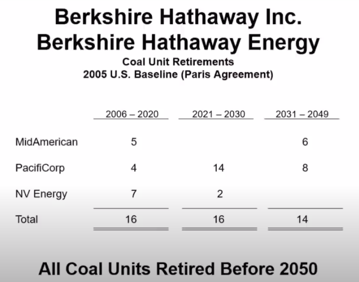

* \-------问答环节开始--------

### **1、目前仍然不想拥有航空公司**

**Becky：谢谢沃伦。大家好。第一个问题来自Andy Seas。他说他持有的B股还远远不够。**

**他说，“巴菲特先生，你的名言是当别人贪婪时要恐惧，当别人恐惧时要贪婪。但从所有迹象来看，在其他人最害怕COVID-19爆发的最初几个月里，伯克希尔却在恐惧，在低位或接近低位时抛售了航空股。你们没有利用当时市场的恐惧，以极低的折扣购买上市公司的股票，并且在以极具吸引力的价格回购大量伯克希尔股票时犹豫不决。我很想听听你对这次事件的看法，以及在通过《关怀法案》(CARES Act)确保政府将为金融市场提供强有力的支持之后，伯克希尔公司是如何做出决策的。”**

**巴菲特：**&#x76F4;到货币和财政政策开始发挥作用，我们知道我们遇到了一个令人难以置信的麻烦。

就像查理是首席文化官一样，我是伯克希尔的首席风险官。那是我的工作。我们希望我们做得很好，但我们想确保我们不会做得太糟。但我们并没有卖出很多。

我的意思是，我们是一家拥有可能价值7,000亿美元业务的公司。有些公司我们拥有它们的全部，有些公司我们拥有一块，我不知道我们是否只卖出了当时我们所有业务价值的1%。

关于航空公司，在这里我会讲到财政货币政策做了什么。我们在伯克希尔的不同子公司有一些人，他们想要从政府那里寻求帮助。还有一些拥有百分之几股份的小股东们说，“我们将会被正在出台的法规和经济停滞所带来的后果所扼杀。”

他们说，所有人都在寻找政府的帮助，那我们为什么不去呢？我说，“伯克希尔可以处理这些麻烦，政府的救济是为那些无法处理正在发生的事情的人准备的。”所以我们没有申请救济，但是航空公司是最主要的受益者。很快，航空业得到了第一阶段的250亿美元救济，其中大部分给了四大航空公司，还有一些是赠款，而不是贷款。

我认为这是很好的公共政策。我希望它能普及到每一家餐馆和干洗店，以及每一家真正停业的小企业。他们基本上被疫情击垮了。但对于航空公司来说，显然正在发生的事情不是他们的错。这不像2008年和2009年那样，人们指责银行，不愿看到政府向它们提供帮助。

现在几乎所有的航空公司都处于破产状态。而前四大航空公司中有三家在过去也曾破产。因此，航空业已经习惯于面对破产的风险经营。（在疫情打击下），他们本可以继续经营下去，但得到政府的帮助也是无可厚非的。

整个航空业——对比苹果的2万亿市值这些数字——整个四大航空公司，他们差不多市值在1,000亿美元左右。我的意思是，这个行业相对而言是非常非常小，即使它们的市值都加在一起也不会在前50名。

所以无论如何，政府介入了，他们需要政府的帮助，否则他们会破产。而面对国会提出的救济方案，他们决定他们应该得到帮助，关于这点我一点儿也不反对。但想象一下，如果伯克希尔一直持有它们10%的股份，那么也许会有人说，“你们去找伯克希尔吧。”

如果他们有一个非常富有的股东，拥有8%或9%的股份，他们可能会有一个非常不同的结果。而如果他们去寻找政府救助的时候没有这些，那可能不会得到同样的结果。

我的意思是，因为你们已经看到了一些公司的头条新闻，它们拿了一两个亿，但实际上它们并不需要这一两个亿。虽然它们中的一些公司把政府救济金给还回去了，但在这个例子中，你们实际上看到的结果可能与我们选择继续保留股票的结果不同。但无论如何，一个市值不到1,000亿美元的行业，它们在疫情中损失了大量的资金。

他们损失可持续的赚钱能力。目前，国际旅行还没有回归，但我想对它们说，经济复苏可能比你们预期的要好得多。

另外那时我们不喜欢在银行业里投入那么多资金。所以我收回了一些银行的投资，但基本上只是我们总规模1%或1.5%左右的净卖出。

虽然现在回过头来看，最好还是买入，但我当时没有考虑。我不认为这是伯克希尔历史上的伟大时刻，但我们的净资产超过了美国任何一家公司。根据会计原则。我们有6000亿或7000亿美元的好生意。我认为航空业因为我们的卖出而过得更好，我希望他们好，但现在我仍然不想买下航空业。

人们真正想要旅行是出于个人原因，而商务旅行则是另一回事。我们拥有美国运通19%的股份，并拥有精密铸件公司（Precision Castparts），这些公司为航空业务提供了很好的服务。所以我们在航空旅行方面仍然有很大的投资，也对它们有很大的承诺，但我们希望四大航空公司一切顺利，我认为它们的管理层在这段时间里做得非常好。

***

### **2、我们本可以在美联储行动之前进行投资**

**Becky：除了关于航空公司的问题以外，还有一个问题——有几个问题问到了这方面，其中一个来自于Chris Blaine。他问，“你花了多年时间积累了很多现金，并认为自己已经准备好了猎象枪并随时狙击大象。但在2020年3月，当股票市场出现了抛售、美国政府承诺会采取一切必要措施时，你却袖手旁观。请问这是为什么呢？你为什么不充分利用手头的现金？”**

**巴菲特：**&#x6211;们手头的现金约占我们企业价值的15%。这是一个健康的数字，并且我曾说过，它永远不会低于200亿美元。现在我们将提高这个数字，因为这和伯克希尔的规模和重要程度有关。

就在美联储采取行动之前，我们本可以部署500亿或750亿美元的投资。当时已经有两个（潜在收购机会的）电话打进来了，但在那两到三天的时间里，似乎什么都不可能发生。

然后杰伊·鲍威尔（美联储主席）开始了他的行动，而这是非常重要的。我想说的是，美联储采取了行动，他们在3月23日的行动迅速而果断。这改变了经济停滞的局面。当时的政府债券市场受到了疫情的严重干扰，伯克希尔公司甚至没办法在那段时间发行债券（注：伯克希尔的评级非常高）。新闻媒体对此报道的不多，但货币市场基金在这段时间出现了挤兑，非常严重的挤兑。

如果你看看当时每天的数字，那就是2008年9月的重演——当时，我对伯南克和保尔森他们所做的一切给予了极大的肯定。而这一次，美联储知道，他们需要付出一切代价也要救活市场——他们在3月23日也说出并展示了这一点。通过行动，他们把一个连伯克希尔都无法融资的债券市场，变成了连嘉年华游轮公司（注：该公司受疫情影响严重）都可以随意融资的地方，其中包括创纪录的公司债券发行，涉及到亏损公司、破产公司等等，这是你能想象到的最戏剧性的举动。当时，我记得国会主席说过，“在财政方面提供一点帮助怎么样？”然后国会再次采取了非常非常大的行动。

在2008年和2009年，他们还会争论说，“我们不想给那些肮脏的银行任何钱”，但这次疫情真的不能怪任何人。所以他们看到了什么是必要的，然后国会做出了回应。因此，财政和货币政策的反应和行动令人难以置信，它们很好的完成了任务。我认为这些政策的效果比美联储或财政部或任何人预期的都要好。现在的经济，85%都在高速运转，我想你们将会看到一些通货膨胀。美联储、国会它们以一种令人难以置信的方式做出了回应。我们从2008年和2009年学到了一些东西，然后这次我们应用了它。但我不认为这是肯定会发生的事情。

关于伯克希尔的一件事是，我们不想依赖任何人。我们也不是银行。如果我们需要钱，我们也不能去找美联储。我们必须确定，在任何情况下，我们都能够生存下去。如果你还记得，布兰奇·杜布瓦在《欲望号街车》中说过，“我总是相信陌生人的仁慈。”但如果糟糕的事情发生了，你可不能依靠来自朋友的善意。我在很多地方都看到过类似的场景。

我们在三月中旬看到，当时每个人都在提取信用额度以度过难关，而银行没有预料到这一点。人们不确定自己能否在10天后继续提取信用额度，所以他们就把钱提出来投资在货币市场基金上。

我对所做的货币和财政方面的工作都给予了很高的评价，但我不认为这是一件“必然如此”的事情。在当时，我根本不知道该怎么实施。还好最终起作用了。我认为它比任何人预期的都要好，我想你们现在也看到了成果。

查理对此也有一些看法，谈谈吧。

**芒格：**&#x5982;果有人认为，一旦市场陷入某种疯狂的危机，我们在市场最底部的时候能够把钱都花光进行抄底，那真是疯了。总是有一些人偶然会成功，但这是一个太难的标准。任何人如果对伯克希尔哈撒韦抱有这样的期望，那他就是疯了。

**巴菲特：**&#x662F;啊，查理。查理和我从来都不擅长抄底，但这是因为我们是真的不会抄底。

**芒格：**&#x662F;的，我们不能。顺便说一下，几乎没有人能做到。

**巴菲特：** 在管理几百亿或者几千亿下是根本不可能的。但伯克希尔现在就很好。我们忘了展示其中一个财务方面，实际上，如果你回到资产负债表，我们确实在底部回购了不少流通股。

我们在第一季度花了大约250亿美元，之后又花了更多钱，这是最好的事情。我们无法以像回购自己的公司那样便宜的价格去并购公司或者购买股票。所以，我们花了不少钱进行回购，但回想起来，我觉得我们本可以做得更好。我们本可以卖掉航空公司，削减银行股的头寸，而我们是否应该同时买其他东西是另一个问题。

***

### **3、伯克希尔长期表现会更好，但巴菲特向普通人推荐指数基金**

**Becky：这个问题来自一位长期股东，他持有伯克希尔已经超过25年了。他的名字是Ben Nowell，他来自明尼苏达州的明尼阿波利斯。**

**他说，“芒格先生和巴菲特先生，你们在经历了15年的市场低迷后，对预测伯克希尔未来能够跑赢市场持谨慎态度。考虑到这一点，你认为长期股东继续持有股票的理由是什么？为什么不通过指数投资分散风险呢？”**

**巴菲特：**&#x67E5;理，你想回答吗？

**芒格：**&#x55EF;，没问题。我个人更喜欢持有伯克希尔，而不是持有指数。我很放心的持有伯克希尔。我认为我们的业务优于市场平均水平。

**Becky：**&#x90A3;你是否认为市场对它的估值是错的？

**芒格：**&#x597D;吧，其实这些都只是历史的偶然，股价一直在波动，但综合来看，我认为伯克希尔会表现优于市场，即使巴菲特和我离开人世。

**巴菲特：**&#x6211;推荐标普500指数基金，并且长期以来一直向人们推荐。我从来没有向任何人推荐过伯克希尔。因为我不想让人们买伯克希尔，仅仅是因为他们认为我在推销伯克希尔。可无论如何，关于伯克希尔的一切情况，我都告诉全世界了。

我死后，会有一笔基金留给我的遗孀，其中90%将投资于标普500指数基金，10%投资于国债。另一方面，我很高兴能在我死后的12年左右的时间里，继续为慈善事业捐款，让绝大多数股份留在伯克希尔。我认为长期来看伯克希尔会跑赢指数。我喜欢伯克希尔，但我也认为大多数人不具备选择股票的能力。

在50或60年前，我们的合伙企业清算的时候，有一大群投资人没有选择持有伯克希尔的股票，他们选择了查理，并让查理继续为他们管理资金。

所以我们有一群非常不寻常的股东。我认为，他们把伯克希尔视为一个终生储蓄工具；同时，他们并不需要过多的关注伯克希尔，并且他们相信，即使他们在10年或20年里不管它，我们仍然会把他们的资金处理得相当好。但我不会说，随着时间的推移，标普500指数能够跑赢伯克希尔。我更喜欢伯克希尔。

但我认为，一个对股票完全不了解的人、一个对伯克希尔没有任何特殊感觉的人，我认为他们应该买标准普尔500指数。

***

### **4、巴菲特将遗产中的绝大部分配置在标普500上**

**Becky：**&#x4E0B;一个问题来自Gerald Silver。他说，“我相信你已经指示你的财产受托人将大量资产投资于指数基金。这难道不是对你的投资经理投了不信任票吗？”

**巴菲特：**&#x55EF;，其实我们谈论的仅仅是我1%的遗产的归属问题。顺便说一句，所有的富人都会得到律师的建议，建立信托，这样就没有人能看到你的遗嘱之类的东西。但我的遗嘱将被公开，你们将能够在某个时候看到我遗嘱的全部部分——大概我99.7%的财产要么捐给慈善机构，要么捐给联邦政府。

在此之前，我认为，伯克希尔是一个很好的持有对象。但对于特定的个人，特别是我的妻子，我只是觉得，只需要我遗产中的一小部分，就足以让她在今后的生活中过得很好。我只是认为最好的办法是将当中的90%配置中标普500上。

现在，那些指数基金的管理者随着时间的推移，已经开始推出了越来越多的产品，这些产品与其他指数和其他产品挂钩，所以他们开始对美国公众说，“嗯，你可以选择在哪个洲投资，或者你可以选择什么行业，然后我们可以卖给你特定的指数基金产品。”

当他们刚刚告诉你，如果你真的不懂什么股票，那就简单的购买整个指数吧。所以我把标普500指数作为一个基准指数。

但总体来说，这只是占我总遗产中的很小的一部分，但这将是我遗孀的全部——她将拥有她所需要的所有钱，而且远远超过自身的需求。这就是我想说的。对于我遗产中的99.7%，将和现在一样，捐作慈善事业用途，这些遗产会以伯克希尔公司股份的形式存在，直到它们最终被处理掉。

***

### **5、投资雪佛龙不涉及道德判断**

**Becky：**&#x8FD9;个问题来自英国的Andrew Dickson。他说，“我的问题是关于石油和天然气业务，以及你购买雪佛龙的股票。在1997年你被问及烟草股票相关问题时，你提到个人和公司偶尔要对他们愿意做的事情划出道德界限。你当时表示，你不愿意在烟草股票上做出大的投资，你对它们的前景感到不安。查理还提到了一桩私下的烟草交易，你们都知道这是件轻而易举的事。然而，你们两人都没有后悔对交易说‘不’。”

“我并不是说石油和天然气行业与香烟一样，没有负面的外部效应。但就烟草而言，其产品与癌症之间的因果关系是直接、明显和可衡量的。而对于碳氢化合物，社会成本和收益的评估要复杂得多。然而，社会中越来越多的人以这样那样的理由认为，碳氢化合物应当在投资中被排除在外。”

“我的问题是，气候界的危言耸听现在是否已经在全社会蔓延到了非理性的程度？在向更绿色的能源过渡方面，我们是否就可实现的变革步伐达成了不切实际的共识？在某种程度上，这正成为当前年轻一代负担的一种过于昂贵的税收。从你购买雪佛龙股票的行为中，我们可以看出你似乎并不相信社会上的抱怨？未来10年，监管机构和政客对碳氢化合物的前景肯定不太友好，就这一点而言，会影响到雪佛龙。在这样的背景下，投资者还能认为，以低成本发现并生产石油的油气企业在未来很长一段时间内都能产生足够的资本回报吗？”

**巴菲特：**&#x597D;吧，我给你10个字的答案。我不记得所有的问题，但我想说的是，持很极端的不同观点的人都有点疯狂。我讨厌在三年内禁止所有碳氢化合物，这在现实世界中是行不通的。

另一方面，随着时间的推移，正在发生的事情将会适应时代，就像我们已经适应了各种事情一样。我感兴趣的是你引用了我在1997年说过的话，因为我们以前讨论过这个问题。

我们对拥有好市多或沃尔玛感到舒适，虽然他们有大量的商店在卖香烟，香烟是他们收入的重要来源。香烟可以吸引人们进入门店，他们知道香烟的价格，好市多和沃尔玛把香烟摆在柜台前面。所以这是一个非常艰难的局面。我们很久以前就做出了这个决定。

当年我们去孟菲斯的时候，我们看到了一家非常非常好的企业，而且它的危害要小得多。至少从我能发现的一切来看，它比吸烟、咀嚼烟草的危害要小得多。这些人都是正派的人，他们经营着合法的生意，他们自己也嚼烟草。他们告诉我，他们的母亲有一百岁了，也嚼烟草，以及所有这些事情。但查理和我去了酒店大堂，我们对自己说，这可能是我们见过的最好的生意。我打电话给我当时的女婿Allen Greenberg，他在为一个与北约有关的组织工作时曾研究过咀嚼烟草及其影响，然后我们决定不做这件事。

但我过去常常在我们的报纸上看到金融公司的广告，我知道它们很糟糕。决定是否从事这一个行业是一件非常困难的事情。这是一个非常艰难的时刻，决定哪些公司比其他公司更有利于社会。

但我认为雪佛龙以各种方式造福社会，我认为它将继续这样做，我认为我们将在很长一段时间内需要大量的碳氢化合物，我们将非常高兴我们已经拥有了它们，但我确实认为，世界也在远离他们，但这也可能会有所改变。

我不喜欢对股票进行道德判断，从实际经营业务的角度来看，但每个行业都有你不喜欢的东西。比如肉类包装工，不知道你有没有去过肉类加工厂？那你是否也要做出什么道德评判呢？

如果你期待完美的投资，即使你的配偶或朋友在公司内部，你也很难找到。如果你投资指数基金，你又怎么选择指数里应该包含什么公司呢？

雪佛龙公司不是一个邪恶的公司，我对拥有雪佛龙公司一点也不感到内疚。如果我们拥有整个企业，我不会对从事这一行业感到不舒服。查理？

**芒格：**&#x55EF;，我同意。你可以想象两件事。一个年轻人将成为你的女婿，他可以是斯沃斯莫尔大学的英语教授，或者也可以是在雪佛龙公司工作。你会选哪个？我想承认，我会选在雪佛龙工作的那个。

**巴菲特：**&#x6211;希望你的女儿们同意你的观点。

***

### **6、伯克希尔是全美最大的基础设施建设者，履行了减少碳排放的承诺**

**Becky：在争论的另一方，这些关于这些ESG问题，我收到了来自持有不同的观点的双方的大量的电子邮件。这个问题来自Christina Gallegos，她从2018年开始成为股东。**

**她说，“关于会议议案的第二项和第三项，董事会建议对关于要求伯克希尔报告气候相关风险和机会的股东提案投反对票，以及对股东多样化和包容性的提案投反对票。在金融知识普及和通过财富创造增强权能方面，伯克希尔是一支如此强大的正义力量。在这两个非常重要的问题上，为什么不成为一股向善的力量和一个榜样呢？请与我们分享有关‘反对’建议的更多信息。”**

**巴菲特：**&#x597D;的，我想Greg也许可以谈谈伯克希尔在环境方面所做的工作。我想说的是，这非常有趣。就目前的情况来看，我认为我们很可能有超过100万的股东。

我收到了股东写给我的信，我想去年我收到了不止3封来自股东的信。我们对此的投票结果，你们稍后会看到，绝大多数用自己的钱购买伯克希尔的人投票反对这些提议。而大多数投赞成票的人从来没有把自己的一分钱投入伯克希尔。

所以我认为他们没有读过我们的年报，我认为他们没有读过伯克希尔哈撒韦能源公司的报告。我不认为他们知道，如果我谈论我们在高压输电方面所做的，我们比国内任何一家公司都做得更多。总统也谈到了政府将要对此（高压输电建设）做什么，以及这有多么重要。

总的来说，我们的记录非常好，但我们有一群组织——他们都是好人，但他们希望我们按照他们的方式回答一堆问卷。所以他们想让我们的Dairy Queen和Borsheims，以及所有公司为他们填写报告，只是为了让这些报告显示一堆数字。可真正重要的是Greg提供的关于伯克希尔哈撒韦能源和铁路的报告。

他们谈到了我们的三家公司，这已经涵盖了伯克希尔整体的95%。坦率地说，在我看来，这是愚蠢的。现在我们会做一些其他愚蠢的事情，仅仅是因为我们被要求这样做。

所以，我们会做任何需要做的事情。但要Business Wire、Dairy Queen、以及所有这些地方的工作人员为了这些数字而专门做报告？我们在伯克希尔不做这种事。

在疫情期间，我们可能只有大约12个人来到总部，而我们有360,000人在子公司工作，从事各种不同的活动，伯克希尔就是这样建立起来的，是建立在自治的基础上的，我不想干涉它。在标准普尔500指数成分股公司中，我可能是唯一一个没有每月收到综合损益表的CEO。标准普尔500中的其他公司，我敢打赌，他们在2月和3月的综合损益表，公司的CEO和很多其他高管都得到了这些数据。

我们没有这个。我不需要它们。即使它们给了我每个月的经营数据，该发生的麻烦仍会发生；实际上，它们想要告诉我的月度经营情况，我早已心中有数。因此，它们是否提供月度损益表，对我来说没有任何区别。

这些子公司能够自负盈亏。所以我们不会仅仅因为我们有相关的这样的部门，或者那样的部门就去让子公司做事情。我们可不想设立很多这样的部门。

最重要的是我们在伯克希尔哈撒韦能源公司和铁路公司所做的工作。我会让Greg待会告诉你，但我们——

**芒格：**&#x6211;不认为我们知道关于全球变暖等所有这些问题的答案。问问题的人认为他们实际上知道答案。我们只是更谦虚。

**巴菲特：**&#x597D;吧，但即使我们知道答案，就我们会做什么报告而言……我们也不会收集一大堆对我们来说毫无意义的东西，来满足那些实际上自己没有任何伯克希尔股票的人的需求。在大多数情况下，我可以告诉你，他们甚至没有读过我们的年度报告。正如我在年报中指出的，很多人会认为我们只是在炒股。

根据会计准则，伯克希尔哈撒韦公司拥有很多的固定资产、工厂设备、商业基础设施——而总统刚刚在周三晚上谈到了基础设施方面、IT建设方面的重要性。以会计准则来衡量，我们在这方面的投入比美国任何一家公司都多。我们的在固定资产和基础设施方面的规模超过了美国上市的所有公司，而且我们的优势很大。因此，我们实际上投资了使得这个国家前进和运转的东西。

15%的州际货物通过我们的铁路运输，而我们正在建设运输系统。我们从2006年或2007年开始，计划着该如何关闭燃煤电厂，但如果你无法把可再生能源的发电传输给客户，那你就不能关闭燃煤电厂。如果你要在怀俄明州发电，把电力运输去拉斯维加斯或其他地方——以前他们在附近有一个煤电厂，因为这是50年前、或75年前的方式——你最好有良好的输电网。否则，在怀俄明州刮大风是没有意义的，因为如果没有输电网，在拉斯维加斯人们也没办法开灯。

所以我们在很早之前就提出了输电计划的问题，我们在正在进行的年度报告中说我们投资了160亿，并且自从年度报告出来后，我们又增加了20亿的投资。而在美国也没有什么人在这样做公共设施建设。

我说的差不多了，Greg你说说吧。

**Greg Abel：**&#x597D;的，沃伦。谢谢。实际上，正如沃伦所提到的，当你想到伯克希尔时，BHE和BNSF有着显著的碳排放的足迹。

沃伦，你刚刚谈到了我们过去提供的信息披露，可以一直追溯到2007年。我找出了两份给投资者做的演示报告，一份是2007年的，然后是我们最近的一份是2021年的。从2007年开始，我们一直在为我们的固定收益投资者做投资者演示报告——直到2021年，我们每年都在做。我们每年都会向董事会披露类似的信息，并就伯克希尔哈撒韦能源公司（BHE）的脱碳计划进行了讨论。

现在很有趣的是，如果你看一下2007年的固定收益投资演示报告，我们当时正在召开会议，我们有第三方债务——即我们的公用事业通过公开市场筹集的债务，这是我们所有受监管实体所使用的传统资本结构。我们做投资者演示报告，目的是用于管理我们对客户的总债务成本。所以我们有固定收益投资者，我们每年向他们展示经营情况。

如果你回顾一下2007年的投资者会议，就会发现这很有趣。在那个演讲中，我们强调了气候变化风险。它是一个根本性的风险，我们讨论了什么是好的政策。我们讨论了创新，讨论了市场转型，以及在那个时间点设定目标的重要性。同时，我们对我们的行业提出了建议。

从那时起，我们每年都会提出一项计划和战略，围绕我们在BHE的每一项业务，以及我们的每一个受监管实体，我们会去谈它们将如何转型。我们的整个转型一直围绕着去碳化，不仅代表着我们的利益相关者，还代表着我们在许多州服务的客户管理相应风险，并最终为伯克希尔哈撒韦的股东管理相应风险。

现在，当你回顾这些演示报告时，它们都有一个共同的主题——沃伦刚刚已经谈到了。你必须先做好基础设施建设，而这个基础设施建设就是围绕着建立高压输电系统所开展的。

沃伦在今年的年度报告中提到了这一点。他在信中强调，在伯克希尔哈撒韦能源公司（BHE），仅仅是在西部，我们将投资180亿美元在电网建设上。当我们今天坐在这里的时候，我们已经完成了其中的50亿的投资；剩下的130亿美元将在未来10年内继续投入。这是基础设施的建设，然后我们才能继续围绕可再生资源发电进行投入，并将其产生的电力，转移到我们在伯克希尔哈撒韦能源公司（BHE）服务的许多州，以及更远的地方去。

我要强调的是，在我们建设输电基础设施的同时，我们也一直在建设可再生能源发电设备。如果你看一下我们到2020年底的投资，我们已经投资了300亿美元，或者说在可再生能源方面投入了超过300亿美元，并且已经真正彻底改变了我们的公用事业业务的经营方式。它们一直在脱碳，并向我们的利益相关者和客户提供有价值的产品。

我认为结果真的很惊人。当你看到这些数据的时候，我会给你几个要点。如果你回到2015年，当美国加入《巴黎协定》时，制定了非常具体的目标。在制定这些目标之前，伯克希尔哈撒韦能源公司（BHE）和其他12家公司，包括世界苹果公司（Apple of the World）、谷歌（Google）、沃尔玛（Walmart）等，承诺在《巴黎协定》下开展业务。伯克希尔哈撒韦能源公司是2015年参与协定的公司之一。

**Becky：**&#x5176;中有多少公用事业公司？

**Greg Abel：**&#x5F53;时没有其他能源公司做出任何类型的承诺，我很高兴地告诉大家，我们做出了各种承诺。其中之一是，在那时，我们在可再生能源上投资了150亿美元，而我们总共将承诺300亿美元。截至今天，我们远远超过了这个总数。因此，我们有明确的承诺，要减少我们企业的碳排放。同时，我们也专注于可识别、可量化的成果。我认为这非常重要。

如果你看看最初美国政府与《巴黎协定》相关的承诺所设定的标准：从2005年起，碳排放的目标是减少26%到28%，这个目标是到2025年之前。政府想要26%到28%的削减水平。而我们在BHE承诺了这一点。

我很高兴地向大家报告——沃伦，我们也向我们的董事会做出了简报，我们在2020年已经实现了这一点。因此，我们实现了我们的承诺，我们实现了《巴黎协定》下的承诺。

然后，如果看看现在发生的情况。关于重新加入巴黎协议的讨论中，本届政府再次提议，以2005年为起点，到2030年，减排目标应该是50%到52%。再次，我很高兴向我们的股东做简报，并向我们的董事会做简报，伯克希尔哈撒韦能源公司（BHE）将在2030年前实现这一目标。我们的碳排放削减将达到《巴黎协定》的目标。

同样，我们能做到这一点的原因是我们已经建立了输配电系统的基础。沃伦强调了大量投资，然后在可再生能源方面进行了非常具体的投资。

这里我有一个额外的幻灯片，我希望把所有的内容都结合起来，这是幻灯片。

**图：伯克希尔哈撒韦能源公司碳排放目标**

当人们讨论碳排放时，他们经常用到煤（Coal units）作为单位。比如你拥有多少，你减少了多少？毫无疑问，这是一个重要的衡量标准，但它是一个指标。

我们非常关注我们拥有的三个公用事业企业，以及我们在幻灯片上强调的，是我们现有的发电厂逐步过渡到通过电网传输的可再生能源的时间表。

我们没有过度依赖于利用天然气过渡的方案，这是一个明确的战略。所以再过一段时间，我们的煤炭机组就会退役。

我很高兴地向我们的股东报告，截至2020年，我们已经关闭了16个单位。如果你看看从2021年到2030年，将会有16个增量单位被关闭。然后如果你一直看到2049年底，我们剩下的14个单位将被关闭。在那个时间点，我们所有的煤炭单位都会关闭。

这张幻灯片只是汇总了我们每个业务部门为帮助实现这一过渡而开展的所有活动，我们最终会实现脱碳化。

这不仅仅有利于我们的客户，他们代表的在不同州的许多利益相关者，同样重要的是，这还代表了我们伯克希尔哈撒韦的全体股东为“去碳化”的努力。

我想补充的另一件事是，当你讨论伯克希尔内部的碳排放问题时，当你把BNSF和BHE结合在一起时，要注意它们是伯克希尔哈撒韦公司中前二大的碳排放实体。

BNSF也非常积极地管理他们的碳排放。他们已经承诺为2030年制定基于科学的目标。因此，这些目标将再次与《巴黎协定》保持一致。

我们已经看到了其他参与者或行业中的一些参与者所承诺的，我们的承诺将非常类似，即这将与巴黎协议一致：到2030年，BNSF的碳排放将减少30%。这个目标之前已经被公开披露，在BNSF的网站上。我所讨论的关于BHE的一切也都在他们的网站上，在8-KS中归档，我们的股东都可以自由调阅。

所以当我从我们伯克希尔股东的角度来看，我真的相信这个风险得到了很好的管理，我们正在为自己的长期发展做准备。谢谢，沃伦。

**巴菲特：**&#x662F;的，顺便说一句，总统那天晚上谈到了1,000亿美元的基础设施建设。电力传输确实是个问题，是一个大问题。因为你必须从太阳照耀的地方和大风吹的地方，把电力运输到人口集中的地方，这涉及到跨越州界，以及高压电线很可能将穿过人们的后院。

联邦政府只是说，“这是我们要做的”，然后就把计划塞给地方州政府，然后让它们把计划完成。他们可能有这样的能力，他们将能够比我们更快地做到这一点。但另一方面，我们很乐意这样做。

我们将花费1000亿美元，但我们能做到这一点的速度并不快。我们在2006年收购了太平洋公司（Pacific Corp），让我们在遥远的西部有一批客户，他们有煤电厂为他们服务。而要改变这一点，你必须能够去起风的地方建立风力发电设备，然后通过输电网去传输电力。但这很有趣。我们已经公布了这一信息。在美国，我们在可再生能源和输电方面的支出远远超过任何公用事业。

我们一开始什么都没有，是逐步投入的。但是那些用自己的钱购买伯克希尔股票的个人投资者，他们似乎明白这一点，我相信他们阅读了我们的年报。

我们接到一些机构的电话，他们说，“好吧，我们想出来和你谈谈。”好吧，我们才不会和他们交谈呢。

不过，我们也没有忽视那些长期以来一直与我们在一起并用自己的钱购买了大量股份的投资者。我们也不会给予分析师或机构比个人更多的特殊待遇，因为这些个人投资者，基本上非常信任我们、并将他们的储蓄托付给了我们。

* \-------未完待续--------
